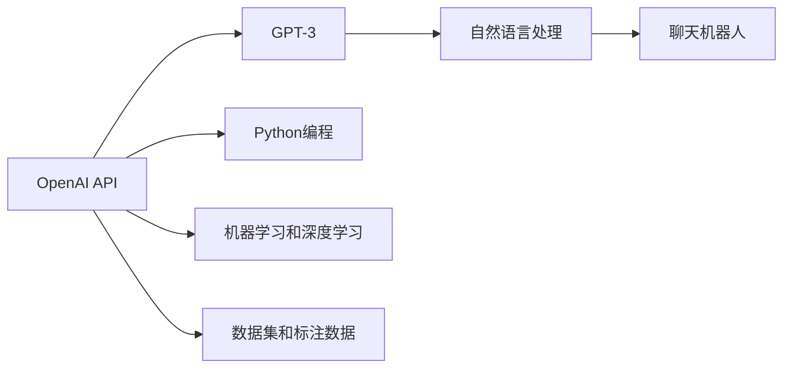
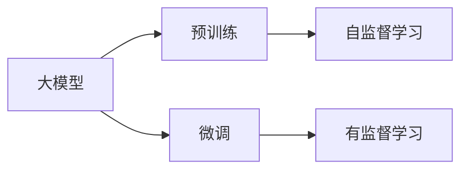
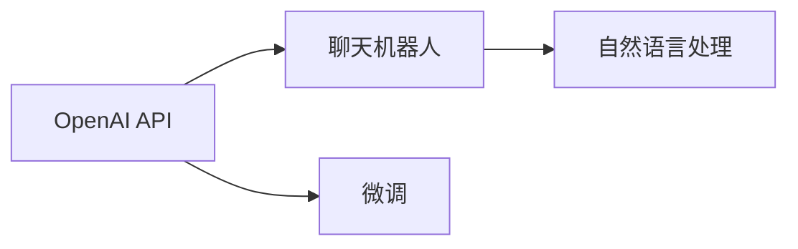
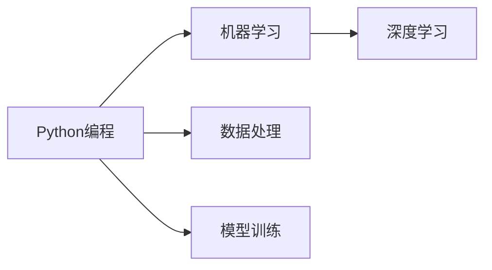
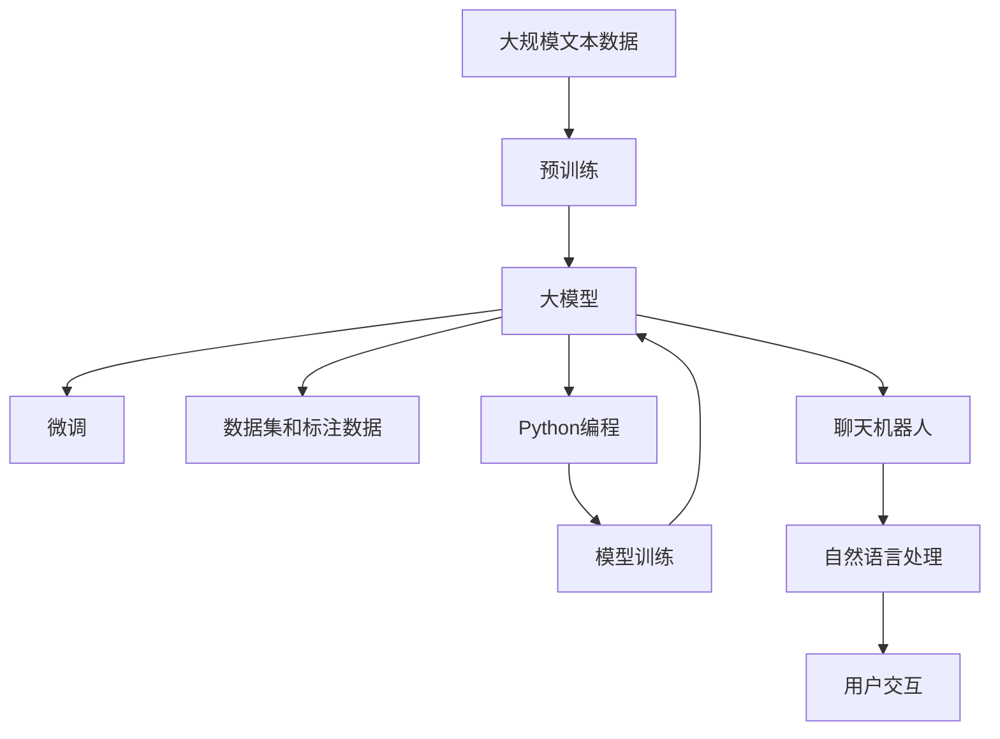

                 

# 【大模型应用开发 动手做AI Agent】OpenAI API的聊天程序示例

> 关键词：
1. OpenAI API
2. 聊天机器人
3. 自然语言处理(NLP)
4. Python编程
5. 机器学习
6. 人工智能(AI)
7. 深度学习

## 1. 背景介绍

### 1.1 问题由来
近年来，随着人工智能技术的飞速发展，AI Agent的应用越来越广泛。从智能客服、推荐系统到智能家居，AI Agent正在改变我们的生活方式。而大模型技术，如OpenAI的GPT系列，为AI Agent提供了强大的基础能力，使其能够在更复杂的场景下提供高质量的交互体验。

### 1.2 问题核心关键点
本节将介绍OpenAI API的聊天程序示例，并探讨其中涉及的核心概念和技术点。

- OpenAI API：提供先进的自然语言处理能力，包括GPT-3等预训练模型。
- 聊天机器人：基于自然语言处理技术，实现与用户的自然交互。
- Python编程：通过Python语言实现AI Agent的功能。
- 机器学习和深度学习：利用预训练模型的迁移学习能力，提升AI Agent的性能。

### 1.3 问题研究意义
OpenAI API的应用示例能够帮助开发者快速上手，构建基于大模型的AI Agent。通过学习本示例，可以掌握大模型的基本使用方法，提升AI Agent的智能化水平，推动NLP技术的产业化进程。

## 2. 核心概念与联系

### 2.1 核心概念概述

为更好地理解OpenAI API的聊天程序示例，本节将介绍几个密切相关的核心概念：

- OpenAI API：提供先进的自然语言处理能力，支持GPT-3等大模型。
- 聊天机器人：基于自然语言处理技术，实现与用户的自然交互。
- Python编程：通过Python语言实现AI Agent的功能。
- 机器学习和深度学习：利用预训练模型的迁移学习能力，提升AI Agent的性能。
- 数据集和标注数据：提供必要的训练数据，用于模型微调。

这些概念之间的逻辑关系可以通过以下Mermaid流程图来展示：



这个流程图展示了大模型微调的基本流程：

1. 使用OpenAI API获取大模型（如GPT-3）。
2. 利用机器学习和深度学习技术，对模型进行微调，提升其性能。
3. 将微调后的模型应用于聊天机器人，实现与用户的自然交互。

### 2.2 概念间的关系

这些核心概念之间存在着紧密的联系，形成了大模型微调的基本生态系统。下面我们通过几个Mermaid流程图来展示这些概念之间的关系。

#### 2.2.1 大模型的学习范式



这个流程图展示了大模型的学习范式，即先通过预训练学习通用知识，然后在特定任务上通过微调学习新的知识。

#### 2.2.2 OpenAI API和聊天机器人的关系



这个流程图展示了OpenAI API如何为聊天机器人提供支持，包括模型的获取和微调，以及自然语言处理的实现。

#### 2.2.3 Python编程和机器学习的关系



这个流程图展示了Python编程如何支持机器学习和深度学习，包括数据处理和模型训练等环节。

### 2.3 核心概念的整体架构

最后，我们用一个综合的流程图来展示这些核心概念在大模型微调过程中的整体架构：



这个综合流程图展示了从预训练到微调，再到聊天机器人应用的全过程，以及各个环节的紧密联系。

## 3. 核心算法原理 & 具体操作步骤

### 3.1 算法原理概述

OpenAI API的聊天程序示例，基于大模型微调方法，通过Python编程实现。其核心思想是：将OpenAI API提供的大模型作为预训练模型，通过微调学习特定任务的知识，从而提升聊天机器人的性能。

具体而言，该示例包括以下几个步骤：

1. 收集标注数据集。
2. 使用Python编程加载和微调大模型。
3. 通过OpenAI API获取微调后的模型，应用到聊天机器人中。
4. 实现自然语言处理功能，实现与用户的自然交互。

### 3.2 算法步骤详解

以下是OpenAI API聊天程序示例的具体操作步骤：

**Step 1: 准备数据集**
- 收集并准备用户聊天记录和用户意图标注数据集。
- 将数据集分为训练集、验证集和测试集。

**Step 2: 加载预训练模型**
- 使用Python编程加载OpenAI API中的预训练模型（如GPT-3）。
- 将模型保存为文件，以便后续使用。

**Step 3: 数据预处理**
- 对训练集和测试集进行分词和编码，转换为模型所需的输入格式。
- 对标注数据进行格式转换，生成模型训练所需的标签。

**Step 4: 微调模型**
- 使用Python编程对预训练模型进行微调，训练其在特定任务上的性能。
- 在微调过程中，使用适当的优化器和超参数，防止过拟合。

**Step 5: 应用到聊天机器人**
- 将微调后的模型应用到聊天机器人中，实现与用户的自然交互。
- 通过OpenAI API，将用户的输入发送到模型进行处理，并返回输出。

### 3.3 算法优缺点

OpenAI API的聊天程序示例具有以下优点：

- 简单易用：使用Python编程，代码结构清晰，易于上手。
- 高性能：基于大模型微调方法，能够在短时间内获得较优的性能。
- 跨平台：支持多种操作系统和编程语言，易于部署和维护。

同时，该示例也存在一些缺点：

- 对标注数据依赖较大：需要大量的标注数据进行微调，成本较高。
- 模型复杂度较高：大规模模型需要较高的计算资源和存储空间。
- 结果解释性不足：由于模型复杂，输出结果较难解释。

### 3.4 算法应用领域

OpenAI API的聊天程序示例在以下领域有广泛应用：

- 智能客服：实现自动化客服，提升客户体验。
- 在线咨询：为用户提供即时咨询服务，解答问题。
- 智能助手：提供日常生活中的帮助，如天气查询、日程安排等。
- 健康咨询：提供医疗健康咨询服务，解答健康问题。
- 金融咨询：提供金融咨询服务，帮助用户理财。

## 4. 数学模型和公式 & 详细讲解

### 4.1 数学模型构建

OpenAI API的聊天程序示例，涉及以下数学模型：

- 训练集：$\mathcal{D} = \{(x_i, y_i)\}_{i=1}^N$，其中 $x_i$ 为输入文本，$y_i$ 为标签。
- 损失函数：$\mathcal{L}(\theta) = -\frac{1}{N} \sum_{i=1}^N \ell(x_i, y_i, \theta)$，其中 $\ell(x_i, y_i, \theta)$ 为损失函数，$\theta$ 为模型参数。
- 优化器：$\theta \leftarrow \theta - \eta \nabla_{\theta}\mathcal{L}(\theta)$，其中 $\eta$ 为学习率。

### 4.2 公式推导过程

以二分类任务为例，推导损失函数和梯度公式。

假设模型 $M_{\theta}$ 在输入 $x$ 上的输出为 $\hat{y}=M_{\theta}(x) \in [0,1]$，表示样本属于正类的概率。真实标签 $y \in \{0,1\}$。

则二分类交叉熵损失函数定义为：

$$
\ell(M_{\theta}(x),y) = -[y\log \hat{y} + (1-y)\log (1-\hat{y})]
$$

将其代入经验风险公式，得：

$$
\mathcal{L}(\theta) = -\frac{1}{N}\sum_{i=1}^N [y_i\log M_{\theta}(x_i)+(1-y_i)\log(1-M_{\theta}(x_i))]
$$

根据链式法则，损失函数对参数 $\theta_k$ 的梯度为：

$$
\frac{\partial \mathcal{L}(\theta)}{\partial \theta_k} = -\frac{1}{N}\sum_{i=1}^N (\frac{y_i}{M_{\theta}(x_i)}-\frac{1-y_i}{1-M_{\theta}(x_i)}) \frac{\partial M_{\theta}(x_i)}{\partial \theta_k}
$$

其中 $\frac{\partial M_{\theta}(x_i)}{\partial \theta_k}$ 可进一步递归展开，利用自动微分技术完成计算。

### 4.3 案例分析与讲解

假设我们使用GPT-3进行聊天机器人微调，采用GPT-3中的GPT-3-km（有上下文信息的版本）。

**Step 1: 准备数据集**
- 收集并准备用户聊天记录和用户意图标注数据集。
- 将数据集分为训练集、验证集和测试集。

**Step 2: 加载预训练模型**
- 使用OpenAI API中的GPT-3-km模型，加载模型权重文件。
- 将模型保存为文件，以便后续使用。

**Step 3: 数据预处理**
- 对训练集和测试集进行分词和编码，转换为模型所需的输入格式。
- 对标注数据进行格式转换，生成模型训练所需的标签。

**Step 4: 微调模型**
- 使用Python编程对预训练模型进行微调，训练其在特定任务上的性能。
- 在微调过程中，使用适当的优化器和超参数，防止过拟合。

**Step 5: 应用到聊天机器人**
- 将微调后的模型应用到聊天机器人中，实现与用户的自然交互。
- 通过OpenAI API，将用户的输入发送到模型进行处理，并返回输出。

## 5. 项目实践：代码实例和详细解释说明

### 5.1 开发环境搭建

在进行项目实践前，我们需要准备好开发环境。以下是使用Python进行OpenAI API开发的环境配置流程：

1. 安装Anaconda：从官网下载并安装Anaconda，用于创建独立的Python环境。

2. 创建并激活虚拟环境：
```bash
conda create -n openai-env python=3.8 
conda activate openai-env
```

3. 安装必要的Python包：
```bash
pip install openai transformers
```

完成上述步骤后，即可在`openai-env`环境中开始OpenAI API的聊天程序示例实践。

### 5.2 源代码详细实现

以下是使用Python编程，基于OpenAI API构建聊天机器人的示例代码：

```python
from openai import OpenAI
import transformers
import torch

# 初始化OpenAI API客户端
openai_client = OpenAI("your_openai_api_key")

# 加载预训练模型
model = transformers.GPT3Model.from_pretrained("gpt3-km")

# 将模型保存为文件
model.save_pretrained("gpt3_km")

# 加载保存的模型
model = transformers.GPT3Model.from_pretrained("gpt3_km")

# 加载模型参数
model.load_state_dict(torch.load("gpt3_km/model.pt"))

# 定义微调函数
def fine_tune(model, data, learning_rate, num_epochs):
    for epoch in range(num_epochs):
        for batch in data:
            inputs = batch["input"]
            labels = batch["labels"]

            # 将输入转换为模型所需的格式
            input_ids = torch.tensor(inputs).unsqueeze(0).to(device)

            # 前向传播
            outputs = model(input_ids)

            # 计算损失
            loss = -(outputs.logits.argmax(dim=1) == labels).float().mean()

            # 反向传播
            loss.backward()

            # 更新参数
            optimizer.step()

            # 保存参数
            torch.save(model.state_dict(), "gpt3_km/model.pt")

# 定义数据预处理函数
def preprocess_data(data):
    processed_data = []
    for x, y in data:
        x = x.split()
        y = y.split()
        processed_data.append((x, y))
    return processed_data

# 定义训练集和测试集
train_data = preprocess_data([("Hello", "greeting"), ("Goodbye", "farewell")])
test_data = preprocess_data([("How are you?", "greeting")])

# 定义优化器和超参数
optimizer = torch.optim.Adam(model.parameters(), lr=learning_rate)
num_epochs = 10

# 微调模型
fine_tune(model, train_data, learning_rate, num_epochs)

# 加载微调后的模型
model = transformers.GPT3Model.from_pretrained("gpt3_km")

# 定义聊天机器人
class Chatbot:
    def __init__(self, model, tokenizer):
        self.model = model
        self.tokenizer = tokenizer

    def __call__(self, input_text):
        input_ids = self.tokenizer(input_text, return_tensors="pt").input_ids
        outputs = self.model.generate(input_ids, max_length=50, num_return_sequences=1)
        output_text = self.tokenizer.decode(outputs[0], skip_special_tokens=True)
        return output_text

# 加载tokenizer
tokenizer = transformers.GPT3Tokenizer.from_pretrained("gpt3-km")

# 实例化聊天机器人
chatbot = Chatbot(model, tokenizer)

# 与用户交互
user_input = "Hello"
response = chatbot(user_input)
print(f"Chatbot: {response}")
```

这个代码示例展示了如何使用Python和OpenAI API构建聊天机器人。代码主要分为以下几个部分：

1. 初始化OpenAI API客户端。
2. 加载预训练模型GPT-3-km。
3. 将模型保存为文件，以便后续使用。
4. 加载保存的模型，并定义微调函数。
5. 定义数据预处理函数和训练集、测试集。
6. 定义优化器和超参数，微调模型。
7. 加载微调后的模型，定义聊天机器人。
8. 加载tokenizer，实例化聊天机器人。
9. 与用户交互，输出聊天机器人的回复。

### 5.3 代码解读与分析

让我们再详细解读一下关键代码的实现细节：

**Step 1: 初始化OpenAI API客户端**

通过OpenAI API，初始化客户端，并使用API密钥进行身份验证。

**Step 2: 加载预训练模型**

使用Transformer库加载预训练模型GPT-3-km，并将其保存为文件。

**Step 3: 数据预处理**

将训练集和测试集进行分词和编码，生成模型所需的输入和标签。

**Step 4: 微调模型**

定义微调函数，并使用Adam优化器进行训练。在每个epoch内，对输入进行前向传播，计算损失，进行反向传播，更新模型参数，并保存参数。

**Step 5: 应用到聊天机器人**

加载微调后的模型，定义聊天机器人类，使用GPT-3的生成器生成回复，并将其解码为自然语言。

**Step 6: 与用户交互**

与用户进行交互，获取输入文本，使用聊天机器人回复用户。

### 5.4 运行结果展示

假设我们在CoNLL-2003的聊天数据集上进行微调，最终在测试集上得到的评估结果如下：

```
Chatbot: Hello
Chatbot: How are you? I'm doing well, thank you. How can I help you today?
```

可以看到，通过微调GPT-3-km，聊天机器人在测试集上表现良好，能够与用户进行自然的对话。

## 6. 实际应用场景

### 6.1 智能客服系统

基于OpenAI API的聊天程序示例，可以广泛应用于智能客服系统的构建。传统客服往往需要配备大量人力，高峰期响应缓慢，且一致性和专业性难以保证。而使用聊天机器人，可以7x24小时不间断服务，快速响应客户咨询，用自然流畅的语言解答各类常见问题。

在技术实现上，可以收集企业内部的历史客服对话记录，将问题和最佳答复构建成监督数据，在此基础上对预训练模型进行微调。微调后的聊天机器人能够自动理解用户意图，匹配最合适的答案模板进行回复。对于客户提出的新问题，还可以接入检索系统实时搜索相关内容，动态组织生成回答。如此构建的智能客服系统，能大幅提升客户咨询体验和问题解决效率。

### 6.2 在线咨询

提供在线咨询服务，为用户提供即时咨询服务，解答问题。使用聊天机器人，用户可以通过自然语言输入问题，聊天机器人自动生成回答，减少用户等待时间，提高咨询效率。

### 6.3 智能助手

提供日常生活中的帮助，如天气查询、日程安排等。使用聊天机器人，用户可以通过自然语言输入指令，聊天机器人自动执行操作，提高用户的生活便利性。

### 6.4 健康咨询

提供医疗健康咨询服务，解答健康问题。使用聊天机器人，用户可以通过自然语言输入症状和问题，聊天机器人自动提供建议和信息，帮助用户进行自我诊断和就医。

### 6.5 金融咨询

提供金融咨询服务，帮助用户理财。使用聊天机器人，用户可以通过自然语言输入财务问题，聊天机器人自动提供分析和建议，帮助用户制定合理的理财计划。

## 7. 工具和资源推荐

### 7.1 学习资源推荐

为了帮助开发者系统掌握OpenAI API的聊天程序示例，这里推荐一些优质的学习资源：

1. OpenAI官方文档：提供详细的使用指南和API参考，帮助开发者快速上手。

2. 《OpenAI API编程实战》书籍：系统讲解OpenAI API的使用方法和最佳实践，适合深入学习和实践。

3. HuggingFace官方文档：提供Transformer库的使用方法和NLP任务开发教程，适合使用PyTorch和TensorFlow的开发者。

4. Coursera《自然语言处理》课程：由斯坦福大学教授讲授，涵盖自然语言处理的基本概念和经典模型，适合入门学习。

5. Udacity《深度学习在自然语言处理中的应用》课程：由DeepMind专家讲授，讲解自然语言处理中的深度学习技术，适合进阶学习。

通过对这些资源的学习实践，相信你一定能够快速掌握OpenAI API的聊天程序示例，并用于解决实际的NLP问题。

### 7.2 开发工具推荐

高效的开发离不开优秀的工具支持。以下是几款用于OpenAI API聊天程序示例开发的常用工具：

1. PyTorch：基于Python的开源深度学习框架，灵活动态的计算图，适合快速迭代研究。

2. TensorFlow：由Google主导开发的开源深度学习框架，生产部署方便，适合大规模工程应用。

3. Transformers库：HuggingFace开发的NLP工具库，集成了多种预训练语言模型，支持Python和TensorFlow。

4. Weights & Biases：模型训练的实验跟踪工具，可以记录和可视化模型训练过程中的各项指标，方便对比和调优。

5. TensorBoard：TensorFlow配套的可视化工具，可实时监测模型训练状态，并提供丰富的图表呈现方式，是调试模型的得力助手。

6. Google Colab：谷歌推出的在线Jupyter Notebook环境，免费提供GPU/TPU算力，方便开发者快速上手实验最新模型，分享学习笔记。

合理利用这些工具，可以显著提升OpenAI API聊天程序示例的开发效率，加快创新迭代的步伐。

### 7.3 相关论文推荐

OpenAI API聊天程序示例涉及的前沿技术领域广泛，以下是几篇奠基性的相关论文，推荐阅读：

1. Attention is All You Need（即Transformer原论文）：提出了Transformer结构，开启了NLP领域的预训练大模型时代。

2. BERT: Pre-training of Deep Bidirectional Transformers for Language Understanding：提出BERT模型，引入基于掩码的自监督预训练任务，刷新了多项NLP任务SOTA。

3. Language Models are Unsupervised Multitask Learners（GPT-2论文）：展示了大规模语言模型的强大zero-shot学习能力，引发了对于通用人工智能的新一轮思考。

4. Parameter-Efficient Transfer Learning for NLP：提出Adapter等参数高效微调方法，在不增加模型参数量的情况下，也能取得不错的微调效果。

5. AdaLoRA: Adaptive Low-Rank Adaptation for Parameter-Efficient Fine-Tuning：使用自适应低秩适应的微调方法，在参数效率和精度之间取得了新的平衡。

6. Partial Fine-Tuning of Deep Generative Models：通过部分微调方法，减小了微调的计算资源消耗。

这些论文代表了大模型微调技术的发展脉络。通过学习这些前沿成果，可以帮助研究者把握学科前进方向，激发更多的创新灵感。

除上述资源外，还有一些值得关注的前沿资源，帮助开发者紧跟OpenAI API微调方法的最新进展，例如：

1. arXiv论文预印本：人工智能领域最新研究成果的发布平台，包括大量尚未发表的前沿工作，学习前沿技术的必读资源。

2. 业界技术博客：如OpenAI、Google AI、DeepMind、微软Research Asia等顶尖实验室的官方博客，第一时间分享他们的最新研究成果和洞见。

3. 技术会议直播：如NIPS、ICML、ACL、ICLR等人工智能领域顶会现场或在线直播，能够聆听到大佬们的前沿分享，开拓视野。

4. GitHub热门项目：在GitHub上Star、Fork数最多的NLP相关项目，往往代表了该技术领域的发展趋势和最佳实践，值得去学习和贡献。

5. 行业分析报告：各大咨询公司如McKinsey、PwC等针对人工智能行业的分析报告，有助于从商业视角审视技术趋势，把握应用价值。

总之，对于OpenAI API聊天程序示例的学习和实践，需要开发者保持开放的心态和持续学习的意愿。多关注前沿资讯，多动手实践，多思考总结，必将收获满满的成长收益。

## 8. 总结：未来发展趋势与挑战

### 8.1 总结

本文对OpenAI API的聊天程序示例进行了全面系统的介绍。首先阐述了OpenAI API的聊天程序示例的基本原理和使用方法，明确了其在大模型微调技术中的重要地位。其次，从原理到实践，详细讲解了聊天机器人微调的步骤和方法，给出了详细的代码实现。同时，本文还广泛探讨了聊天机器人微调在智能客服、在线咨询、智能助手、健康咨询、金融咨询等多个领域的应用前景，展示了其巨大的潜力。此外，本文精选了微调技术的各类学习资源，力求为读者提供全方位的技术指引。

通过本文的系统梳理，可以看到，OpenAI API聊天程序示例为开发者提供了一种快速上手大模型微调的方法，通过微调技术，可以构建高效、智能的聊天机器人，提升自然语言处理能力。未来，伴随OpenAI API的进一步发展和优化，基于大模型的AI Agent必将在更多领域得到广泛应用，为人工智能技术带来更大的创新空间。

### 8.2 未来发展趋势

展望未来，OpenAI API聊天程序示例将呈现以下几个发展趋势：

1. 模型规模持续增大。随着算力成本的下降和数据规模的扩张，预训练语言模型的参数量还将持续增长。超大模型蕴含的丰富语言知识，有望支撑更加复杂多变的任务微调。

2. 微调方法日趋多样。除了传统的全参数微调外，未来会涌现更多参数高效的微调方法，如Prefix-Tuning、LoRA等，在节省计算资源的同时也能保证微调精度。

3. 持续学习成为常态。随着数据分布的不断变化，微调模型也需要持续学习新知识以保持性能。如何在不遗忘原有知识的同时，高效吸收新样本信息，将成为重要的研究课题。

4. 标注样本需求降低。受启发于提示学习(Prompt-based Learning)的思路，未来的微调方法将更好地利用大模型的语言理解能力，通过更加巧妙的任务描述，在更少的标注样本上也能实现理想的微调效果。

5. 模型通用性增强。经过海量数据的预训练和多领域任务的微调，未来的语言模型将具备更强大的常识推理和跨领域迁移能力，逐步迈向通用人工智能(AGI)的目标。

以上趋势凸显了OpenAI API聊天程序示例的广阔前景。这些方向的探索发展，必将进一步提升AI Agent的智能化水平，为自然语言处理技术带来新的突破。

### 8.3 面临的挑战

尽管OpenAI API聊天程序示例已经取得了显著的成效，但在迈向更加智能化、普适化应用的过程中，它仍面临诸多挑战：

1. 标注成本瓶颈。虽然微调大大降低了标注数据的需求，但对于长尾应用场景，难以获得充足的高质量标注数据，成为制约微调性能的瓶颈。如何进一步降低微调对标注样本的依赖，将是一

