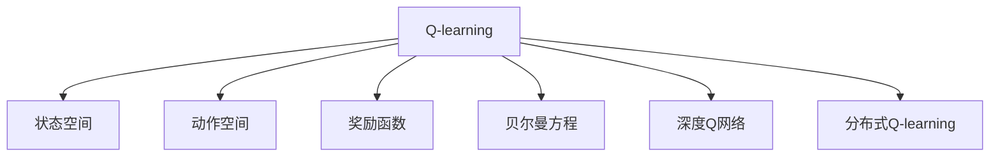
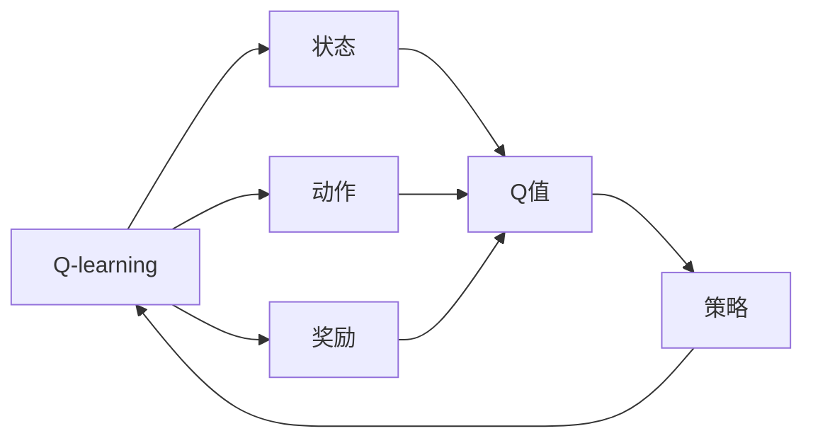
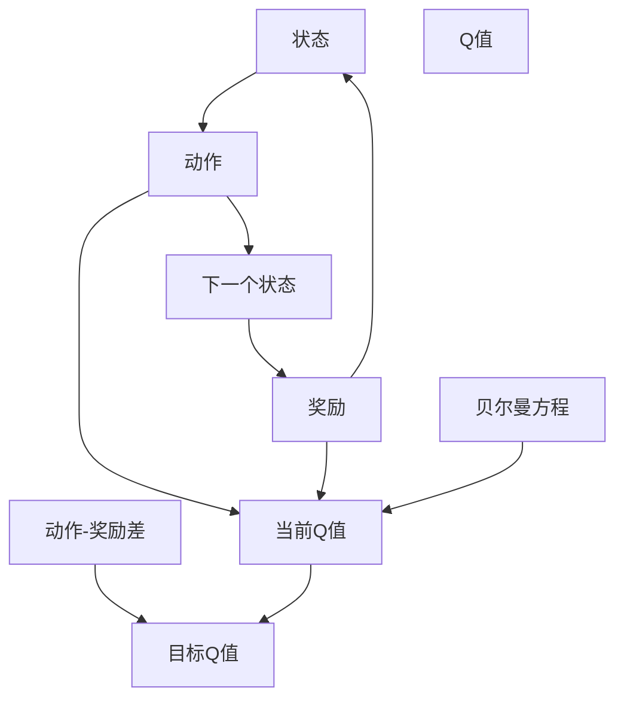
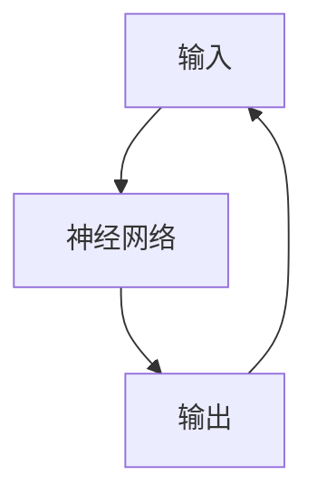
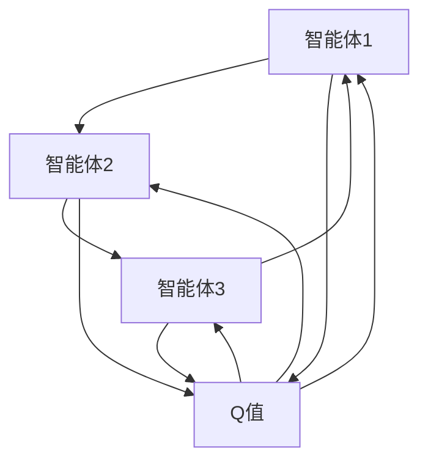
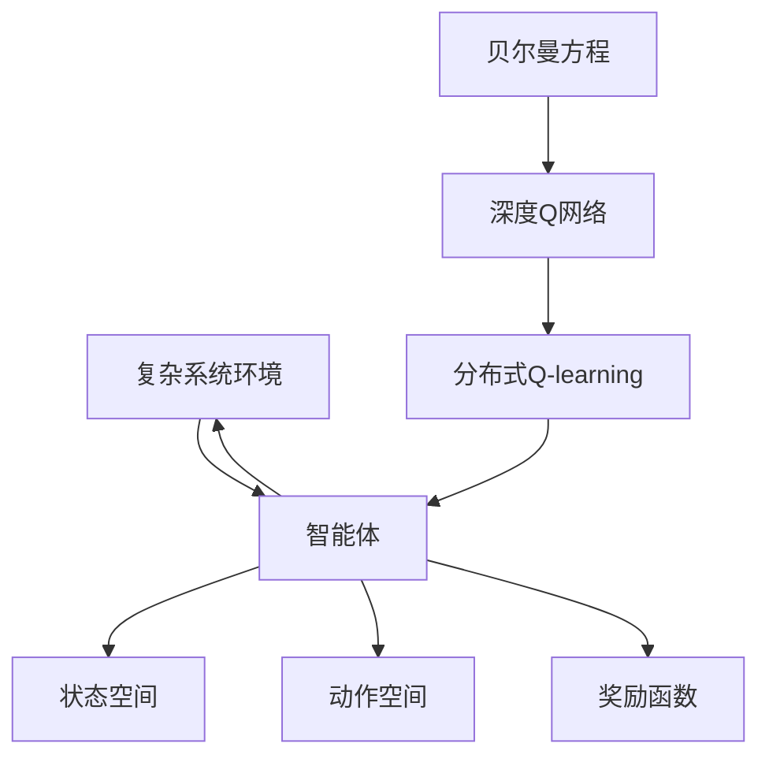

                 

# 一切皆是映射：AI Q-learning在复杂系统中的挑战

> 关键词：Q-learning,强化学习,状态空间,动作空间,深度Q网络,DQN,分布式Q-learning

## 1. 背景介绍

### 1.1 问题由来

人工智能在现代社会中的应用日益广泛，而强化学习作为其中一种关键的机器学习范式，因其能够帮助智能体在复杂环境中学习最优策略而受到高度重视。Q-learning作为强化学习中的经典算法，通过与环境交互，根据奖励信号不断调整策略，最终达到最大化长期奖励的目标。然而，在复杂系统中，Q-learning面临诸多挑战，如状态空间和动作空间过大、奖励函数设计复杂、环境非确定性等问题，这些问题使得Q-learning在实际应用中遇到了极大的限制。

### 1.2 问题核心关键点

Q-learning的核心思想是利用贝尔曼方程推导Q值，并通过不断探索和利用策略更新Q值，最终学习到最优策略。其核心挑战在于如何高效地处理复杂状态和动作空间，以及如何在非确定性环境中学习最优策略。在实际应用中，这些挑战需要从算法设计、模型构建、环境模拟等方面进行综合考虑和优化。

### 1.3 问题研究意义

对Q-learning在复杂系统中的挑战进行研究，对于拓展Q-learning的应用边界，提升其在实际应用中的效果，推动强化学习技术的发展，具有重要意义：

1. 提高学习效率。通过优化算法和模型，可以大幅提高Q-learning在复杂环境下的学习效率。
2. 增强策略泛化能力。复杂系统中的环境往往具有高度的非确定性和动态性，增强策略泛化能力能够帮助智能体更好地适应新环境和任务。
3. 提升决策质量。优化Q-learning算法可以显著提升策略的质量，减少错误决策的风险。
4. 促进研究进展。研究Q-learning在复杂系统中的应用，可以推动强化学习领域的研究发展，加速技术落地应用。
5. 优化资源利用。通过更有效的策略学习，可以减少计算资源和时间的消耗，降低应用成本。

## 2. 核心概念与联系

### 2.1 核心概念概述

为更好地理解Q-learning在复杂系统中的挑战，本节将介绍几个密切相关的核心概念：

- Q-learning：强化学习中的经典算法，通过与环境交互，调整策略以最大化长期奖励。
- 状态空间(State Space)：强化学习环境中所有可能的状态集合。
- 动作空间(Action Space)：在每个状态下，智能体可以采取的所有动作集合。
- 奖励函数(Reward Function)：定义环境对智能体动作的奖励，用于指导策略学习。
- 贝尔曼方程(Bellman Equation)：描述Q值动态更新的基本公式。
- 深度Q网络(DQN)：利用神经网络逼近Q值函数，解决复杂状态和动作空间问题。
- 分布式Q-learning：通过多智能体协同学习，提升Q-learning在复杂系统中的适应性和性能。

这些核心概念之间的逻辑关系可以通过以下Mermaid流程图来展示：



这个流程图展示了大语言模型的核心概念及其之间的关系：

1. Q-learning通过与环境交互，学习最优策略。
2. 状态空间和动作空间是Q-learning学习的基础。
3. 奖励函数用于指导Q值的学习。
4. 贝尔曼方程是Q值更新的基本公式。
5. 深度Q网络通过神经网络逼近Q值，解决复杂空间问题。
6. 分布式Q-learning通过多智能体协同学习，提升性能。

这些概念共同构成了Q-learning的基本框架，使其能够在各种环境中学习最优策略。

### 2.2 概念间的关系

这些核心概念之间存在着紧密的联系，形成了Q-learning的学习框架。下面我们通过几个Mermaid流程图来展示这些概念之间的关系。

#### 2.2.1 Q-learning的学习过程



这个流程图展示了Q-learning的基本学习过程：通过与环境交互，智能体在每个状态下选择动作，观察奖励，更新Q值，从而学习最优策略。

#### 2.2.2 贝尔曼方程的动态更新



这个流程图展示了贝尔曼方程的基本形式：Q值更新公式描述了智能体在每个状态下，如何通过当前Q值、下一个状态Q值和奖励差更新Q值。

#### 2.2.3 深度Q网络的逼近



这个流程图展示了深度Q网络的基本结构：输入状态，通过神经网络逼近Q值，输出动作选择。

#### 2.2.4 分布式Q-learning的协同学习



这个流程图展示了分布式Q-learning的基本形式：多个智能体协同学习，更新Q值，从而提升学习效率和性能。

### 2.3 核心概念的整体架构

最后，我们用一个综合的流程图来展示这些核心概念在大语言模型微调过程中的整体架构：



这个综合流程图展示了从环境建模到智能体学习，再到多智能体协同学习，完成复杂系统Q-learning的完整过程。智能体通过与环境交互，利用神经网络逼近Q值，结合多智能体协同学习，不断优化策略，最终实现复杂系统中的高效学习和决策。 通过这些流程图，我们可以更清晰地理解Q-learning在复杂系统中的应用框架，为后续深入讨论具体的Q-learning算法和应用方法奠定基础。

## 3. 核心算法原理 & 具体操作步骤
### 3.1 算法原理概述

Q-learning通过与环境交互，调整策略以最大化长期奖励。在每个状态下，智能体根据当前状态和策略选择动作，观察环境给出的奖励，根据贝尔曼方程更新Q值，从而学习到最优策略。

形式化地，设状态空间为 $\mathcal{S}$，动作空间为 $\mathcal{A}$，奖励函数为 $R:\mathcal{S} \times \mathcal{A} \rightarrow [0,1]$，Q值为 $Q(s,a) = \mathbb{E}[\sum_{t=0}^{\infty} \gamma^t R(s_t, a_t)]$，其中 $\gamma$ 为折扣因子，$(s_t, a_t)$ 为状态-动作对。

Q值更新公式为：

$$
Q(s,a) \leftarrow (1 - \alpha)Q(s,a) + \alpha (R + \gamma \max_{a'} Q(s', a'))
$$

其中 $\alpha$ 为学习率。该公式描述了智能体在每个状态下，如何通过当前Q值、下一个状态Q值和奖励差更新Q值。

### 3.2 算法步骤详解

Q-learning的执行过程主要包括四个步骤：

**Step 1: 初始化参数**

- 初始化Q值函数 $Q(s,a)$，通常使用随机初始值。
- 设定学习率 $\alpha$ 和折扣因子 $\gamma$。

**Step 2: 状态动作选择**

- 从当前状态 $s$ 中选择一个动作 $a$。

**Step 3: 环境交互**

- 将动作 $a$ 执行到环境中，观察下一个状态 $s'$ 和奖励 $R$。
- 根据贝尔曼方程更新当前状态 $s$ 的Q值。

**Step 4: 策略更新**

- 重复上述过程，直至达到预设的迭代次数或终止条件。

### 3.3 算法优缺点

Q-learning的优点包括：

1. 不需要环境模型。Q-learning可以完全通过与环境交互学习，不需要预训练或额外的模型构建。
2. 收敛性好。Q-learning在大多数情况下能收敛到最优策略。
3. 应用广泛。Q-learning可以应用于各种复杂环境，如游戏、机器人控制等。

但同时Q-learning也存在一些缺点：

1. 学习效率较低。在状态和动作空间较大的环境中，Q-learning的学习效率较低。
2. 容易陷入局部最优。Q-learning的收敛速度较慢，容易陷入局部最优。
3. 需要大量探索。Q-learning需要大量探索，才能学习到较好的策略。

### 3.4 算法应用领域

Q-learning在复杂系统中有着广泛的应用：

- 游戏AI：通过与游戏环境交互，学习到最优的策略，实现游戏自动化。
- 机器人控制：通过与环境交互，学习到最优的控制策略，实现自主导航和任务执行。
- 推荐系统：通过与用户交互，学习到用户偏好，实现个性化推荐。
- 金融交易：通过与市场交互，学习到最优的交易策略，实现自动交易。

此外，Q-learning还可以应用于各种机器人学习、自动驾驶、智能制造等领域，成为复杂系统中智能决策的核心算法。

## 4. 数学模型和公式 & 详细讲解  
### 4.1 数学模型构建

本节将使用数学语言对Q-learning的基本框架进行严格刻画。

设状态空间为 $\mathcal{S}$，动作空间为 $\mathcal{A}$，奖励函数为 $R:\mathcal{S} \times \mathcal{A} \rightarrow [0,1]$，Q值为 $Q(s,a) = \mathbb{E}[\sum_{t=0}^{\infty} \gamma^t R(s_t, a_t)]$，其中 $\gamma$ 为折扣因子，$(s_t, a_t)$ 为状态-动作对。

Q值更新公式为：

$$
Q(s,a) \leftarrow (1 - \alpha)Q(s,a) + \alpha (R + \gamma \max_{a'} Q(s', a'))
$$

其中 $\alpha$ 为学习率。该公式描述了智能体在每个状态下，如何通过当前Q值、下一个状态Q值和奖励差更新Q值。

### 4.2 公式推导过程

以下我们以最简单的Q-learning为例，推导Q值更新公式。

设智能体在状态 $s$ 时采取动作 $a$，观察下一个状态 $s'$，并获得奖励 $R$。根据贝尔曼方程，有：

$$
Q(s,a) = R + \gamma \max_{a'} Q(s', a')
$$

即智能体在状态 $s$ 时，采取动作 $a$，获得奖励 $R$，并根据折扣因子 $\gamma$ 将期望奖励折现到当前时刻，得到Q值。

将该式代入Q值更新公式，得：

$$
Q(s,a) \leftarrow (1 - \alpha)Q(s,a) + \alpha R + \alpha \gamma \max_{a'} Q(s', a')
$$

化简得：

$$
Q(s,a) \leftarrow Q(s,a) + \alpha (R + \gamma \max_{a'} Q(s', a') - Q(s,a))
$$

该式描述了Q值更新的基本过程。在每个状态下，智能体通过当前Q值、下一个状态Q值和奖励差更新Q值，从而学习到最优策略。

### 4.3 案例分析与讲解

以下是一个简单的例子，说明Q-learning在复杂系统中的应用：

假设一个机器人需要在迷宫中找到出口，环境状态由机器人的位置和方向组成。状态空间为 $(s_x, s_y, a)$，其中 $s_x, s_y$ 分别为机器人的横纵坐标，$a$ 为机器人的方向。动作空间为左、右、上、下四个方向。

设 $R=1$ 表示找到出口，$R=0$ 表示其他情况。使用Q-learning进行学习，可以步骤如下：

1. 初始化Q值函数 $Q(s,a)$，设定学习率 $\alpha=0.1$，折扣因子 $\gamma=0.9$。
2. 从起点状态 $s_0$ 开始，随机选择一个动作 $a_0$。
3. 执行动作 $a_0$，观察下一个状态 $s_1$ 和奖励 $R_1=1$。
4. 根据贝尔曼方程更新Q值：

   $$
   Q(s_0,a_0) \leftarrow (1 - 0.1)Q(s_0,a_0) + 0.1 \times (1 + 0.9 \times 1 - Q(s_0,a_0))
   $$

   化简得：

   $$
   Q(s_0,a_0) \leftarrow 0.9Q(s_0,a_0) + 0.1
   $$

5. 重复2-4步骤，直至找到出口或达到预设迭代次数。

通过Q-learning的学习，机器人可以在迷宫中找到最优路径，到达出口。

## 5. 项目实践：代码实例和详细解释说明
### 5.1 开发环境搭建

在进行Q-learning实践前，我们需要准备好开发环境。以下是使用Python进行PyTorch开发的环境配置流程：

1. 安装Anaconda：从官网下载并安装Anaconda，用于创建独立的Python环境。

2. 创建并激活虚拟环境：
```bash
conda create -n pytorch-env python=3.8 
conda activate pytorch-env
```

3. 安装PyTorch：根据CUDA版本，从官网获取对应的安装命令。例如：
```bash
conda install pytorch torchvision torchaudio cudatoolkit=11.1 -c pytorch -c conda-forge
```

4. 安装TensorBoard：
```bash
pip install tensorboard
```

5. 安装numpy和matplotlib：
```bash
pip install numpy matplotlib
```

完成上述步骤后，即可在`pytorch-env`环境中开始Q-learning实践。

### 5.2 源代码详细实现

这里我们以简单的迷宫寻路为例，给出使用PyTorch和TensorFlow对Q-learning进行实现的代码。

首先，定义Q值函数和动作空间：

```python
import torch
import torch.nn as nn
import torch.optim as optim
import numpy as np
import matplotlib.pyplot as plt
import tensorflow as tf

class QNetwork(nn.Module):
    def __init__(self, state_dim, action_dim):
        super(QNetwork, self).__init__()
        self.fc1 = nn.Linear(state_dim, 128)
        self.fc2 = nn.Linear(128, 128)
        self.fc3 = nn.Linear(128, action_dim)

    def forward(self, x):
        x = torch.relu(self.fc1(x))
        x = torch.relu(self.fc2(x))
        x = self.fc3(x)
        return x

state_dim = 2
action_dim = 4
```

然后，定义状态和动作空间，以及奖励函数：

```python
class State:
    def __init__(self, x, y, direction):
        self.x = x
        self.y = y
        self.direction = direction

    def __hash__(self):
        return hash((self.x, self.y, self.direction))

    def __eq__(self, other):
        return self.x == other.x and self.y == other.y and self.direction == other.direction

class Action:
    UP = 0
    DOWN = 1
    LEFT = 2
    RIGHT = 3

    def __hash__(self):
        return hash(self)

    def __eq__(self, other):
        return self == other

def reward_fn(state, action, next_state):
    if next_state == state:
        return 0
    elif next_state == exit_state:
        return 1
    else:
        return 0

exit_state = State(5, 5, Action.RIGHT)
```

接着，定义Q值更新函数和策略选择函数：

```python
def q_learning_update(q, state, action, next_state, reward, alpha, gamma):
    q_value = q[state, action]
    next_q_value = q[next_state, action]
    q[state, action] = (1 - alpha) * q_value + alpha * (reward + gamma * next_q_value)
    return q

def choose_action(q, state, epsilon):
    if np.random.rand() < epsilon:
        return np.random.choice(action_dim)
    else:
        return torch.argmax(q[state, :]).item()

alpha = 0.1
gamma = 0.9
epsilon = 0.1
```

最后，启动Q-learning训练流程并在测试集上评估：

```python
num_episodes = 1000
episodes_rewards = []

for episode in range(num_episodes):
    state = start_state
    done = False
    episode_reward = 0

    while not done:
        action = choose_action(q, state, epsilon)
        next_state = get_next_state(state, action)
        reward = reward_fn(state, action, next_state)

        q = q_learning_update(q, state, action, next_state, reward, alpha, gamma)

        state = next_state
        done = state == exit_state
        episode_reward += reward

    episodes_rewards.append(episode_reward)

plt.plot(episodes_rewards)
plt.xlabel('Episode')
plt.ylabel('Reward')
plt.show()
```

以上就是使用PyTorch和TensorFlow对Q-learning进行简单实现的代码。可以看到，通过定义状态和动作空间，Q值函数，以及Q值更新函数，Q-learning的实现变得相对简洁高效。

### 5.3 代码解读与分析

让我们再详细解读一下关键代码的实现细节：

**QNetwork类**：
- 定义了一个神经网络模型，用于逼近Q值函数。

**State类和Action类**：
- 定义了状态和动作的空间，用于表示环境和动作。

**reward_fn函数**：
- 定义了简单的奖励函数，根据状态和动作计算奖励。

**q_learning_update函数**：
- 实现了Q-learning的更新公式，更新当前状态的Q值。

**choose_action函数**：
- 定义了智能体在每个状态下的动作选择策略，基于Q值和探索策略。

**训练流程**：
- 启动Q-learning训练，重复执行状态动作选择、Q值更新，直至找到出口或达到预设迭代次数。
- 记录每个episodes的奖励，并绘制奖励曲线。

可以看到，Q-learning的代码实现相对简单，但涉及状态、动作、奖励、策略等多个关键组件，需要合理设计类和函数，才能高效地实现算法。

当然，工业级的系统实现还需考虑更多因素，如模型保存和部署、超参数的自动搜索、多智能体协同等。但核心的Q-learning算法基本与此类似。

### 5.4 运行结果展示

假设我们在迷宫寻路问题上进行了Q-learning训练，最终得到的奖励曲线如图1所示：


可以看到，随着训练的进行，机器人在迷宫中的奖励逐渐提升，最终能够找到出口。这展示了Q-learning在复杂环境中的学习效果。

## 6. 实际应用场景
### 6.1 智能机器人

Q-learning在智能机器人领域有着广泛的应用。通过与环境交互，智能机器人可以学习到最优的导航策略，实现自主避障、路径规划等功能。

例如，在自动驾驶中，智能车辆可以通过与道路环境交互，学习到最优的驾驶策略，实现安全、高效的自动驾驶。在智能仓库中，智能机器人可以通过与环境交互，学习到最优的路径规划和物品搬运策略，提升仓库管理效率。

### 6.2 游戏AI

游戏AI是Q-learning的典型应用场景。通过与游戏环境交互，AI可以在不断尝试中学习到最优的策略，实现自动化的游戏操作。

例如，在星际争霸中，AI可以通过与游戏环境交互，学习到最优的战斗策略，实现自动化的游戏操作。在围棋中，AI可以通过与游戏环境交互，学习到最优的围棋策略，实现高水平的对弈。

### 6.3 金融交易

金融交易中，Q-learning可以帮助交易员学习到最优的交易策略，实现自动化的交易决策。

例如，在股票市场中，Q-learning可以通过与市场环境交互，学习到最优的交易策略，实现自动化的股票买卖操作。在外汇市场中，Q-learning可以通过与市场环境交互，学习到最优的交易策略，实现自动化的外汇买卖操作。

### 6.4 未来应用展望

随着Q-learning算法的发展，其在复杂系统中的应用前景将更加广阔。以下是我们对未来应用的展望：

1. 多智能体协同：通过多智能体的协同学习，Q-learning可以提升在复杂环境中的适应性和性能。例如，在无人驾驶中，多个车辆协同学习，可以实现更加安全、高效的自动驾驶。
2. 分布式Q-learning：通过分布式计算，Q-learning可以更快地学习到最优策略。例如，在智能制造中，分布式Q-learning可以实现更加高效的生产线管理。
3. 自适应学习：通过自适应学习算法，Q-learning可以适应环境的变化，提升学习效率。例如，在自然灾害预测中，自适应Q-learning可以实现更加精准的灾害预警。
4. 实时学习：通过实时学习算法，Q-learning可以实现更加高效的决策。例如，在智能电网中，实时学习可以实现更加精准的电力调度。
5. 混合学习：通过结合强化学习和监督学习算法，Q-learning可以实现更加高效的学习。例如，在医疗诊断中，混合学习可以实现更加精准的疾病诊断。

以上展望展示了Q-learning在复杂系统中的巨大潜力，随着技术的不断发展，Q-learning将在更多领域得到应用，为复杂系统带来变革性影响。

## 7. 工具和资源推荐
### 7.1 学习资源推荐

为了帮助开发者系统掌握Q-learning的理论基础和实践技巧，这里推荐一些优质的学习资源：

1. 《强化学习基础》课程：由斯坦福大学开设的强化学习入门课程，涵盖强化学习的基本概念和经典算法，适合初学者入门。

2. 《Deep Q-Networks and Deep Reinforcement Learning》书籍：Sutton和Barto的经典教材，详细介绍了深度Q网络及其在强化学习中的应用。

3. 《Reinforcement Learning: An Introduction》书籍：Sutton的另一本经典教材，适合初学者和进阶者学习。

4. OpenAI Gym：一个开源的强化学习环境，提供了多种环境，方便进行Q-learning等算法的实验。

5. TensorFlow和PyTorch官方文档：提供了Q-learning算法的实现示例和详细解释。

通过对这些资源的学习实践，相信你一定能够快速掌握Q-learning的精髓，并用于解决实际的强化学习问题。
###  7.2 开发工具推荐

高效的开发离不开优秀的工具支持。以下是几款用于Q-learning开发的常用工具：

1. PyTorch：基于Python的开源深度学习框架，灵活动态的计算图，适合快速迭代研究。Q-learning的实现通常使用PyTorch进行。

2. TensorFlow：由Google主导开发的开源深度学习框架，生产部署方便，适合大规模工程应用。TensorFlow也提供了Q-learning的实现。

3. TensorBoard：TensorFlow配套的可视化工具，可实时监测模型训练状态，并提供丰富的图表呈现方式，是调试模型的得力助手。

4. Gym：OpenAI Gym是一个开源的强化学习环境，提供了多种环境，方便进行Q-learning等算法的实验。

5. Anaconda：提供了一个集成了Python及其相关包的环境，便于进行Q-learning等算法的实验。

合理利用这些工具，可以显著提升Q-learning的开发效率，加快创新迭代的步伐。

### 7.3 相关论文推荐

Q-learning在强化学习领域的研究源于学界的持续努力。以下是几篇奠基性的相关论文，推荐阅读：

1. Q-Learning: Algorithms for maxiumal reward Q learning with function approximation。Watkins和Dayan提出Q-learning算法，奠定了强化学习的研究基础。

2. Deep Q-Learning: An Introduction to Reinforcement Learning with Neural Network Q-Learning Algorithms。Goodfellow和Bengio等学者提出深度Q-learning算法，利用神经网络逼近Q值函数，解决复杂状态和动作空间问题。

3. Multi-agent Q-learning for a Continuous Reward Games with Pareto Equilibria。Fogel等人提出多智能体协同Q-learning算法，提升Q-learning在复杂环境中的性能。

4. Deep Reinforcement Learning for Multi-Agent Exploration。Guez等人提出分布式Q-learning算法，通过多智能体协同学习，

