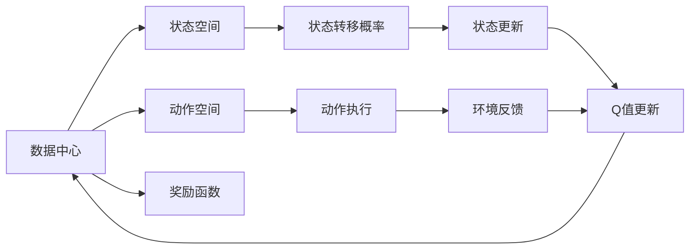
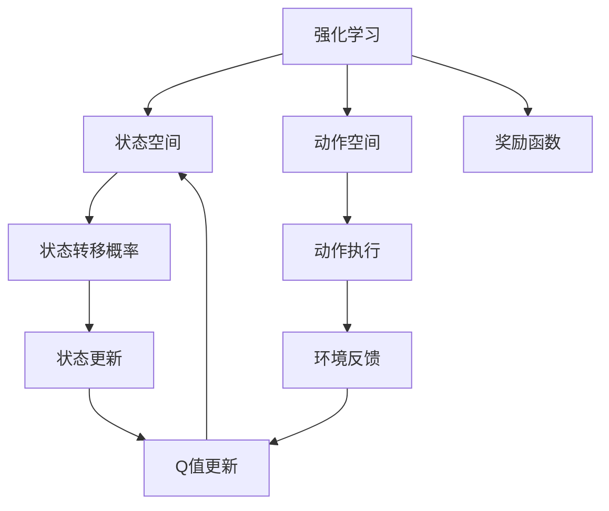
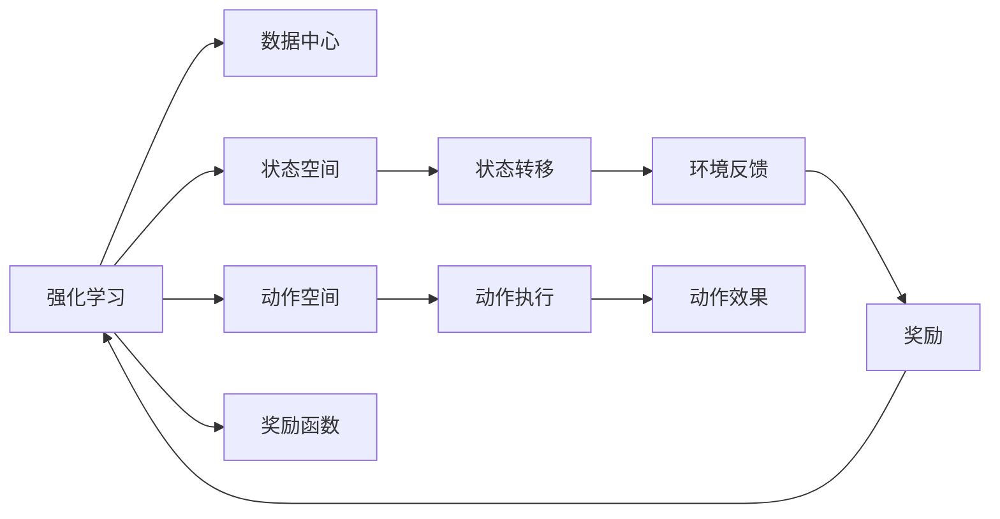
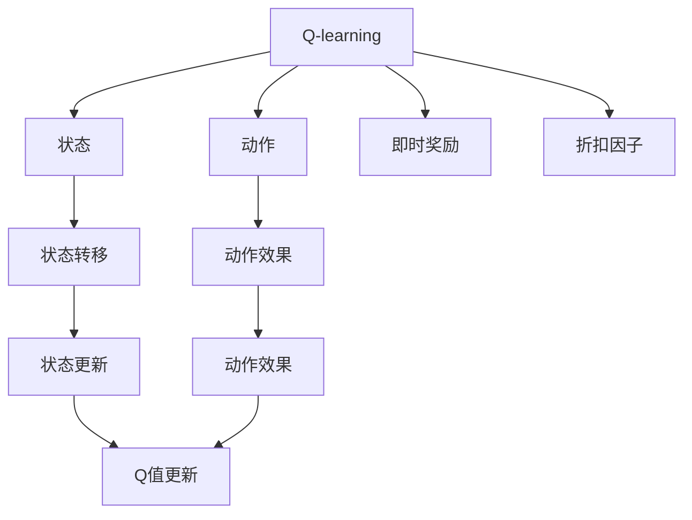
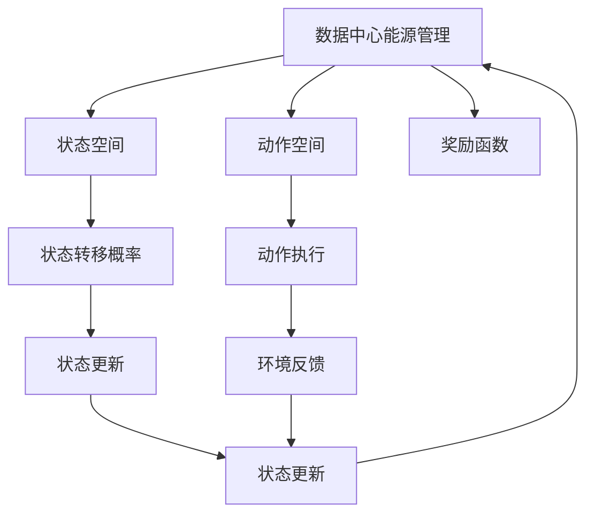
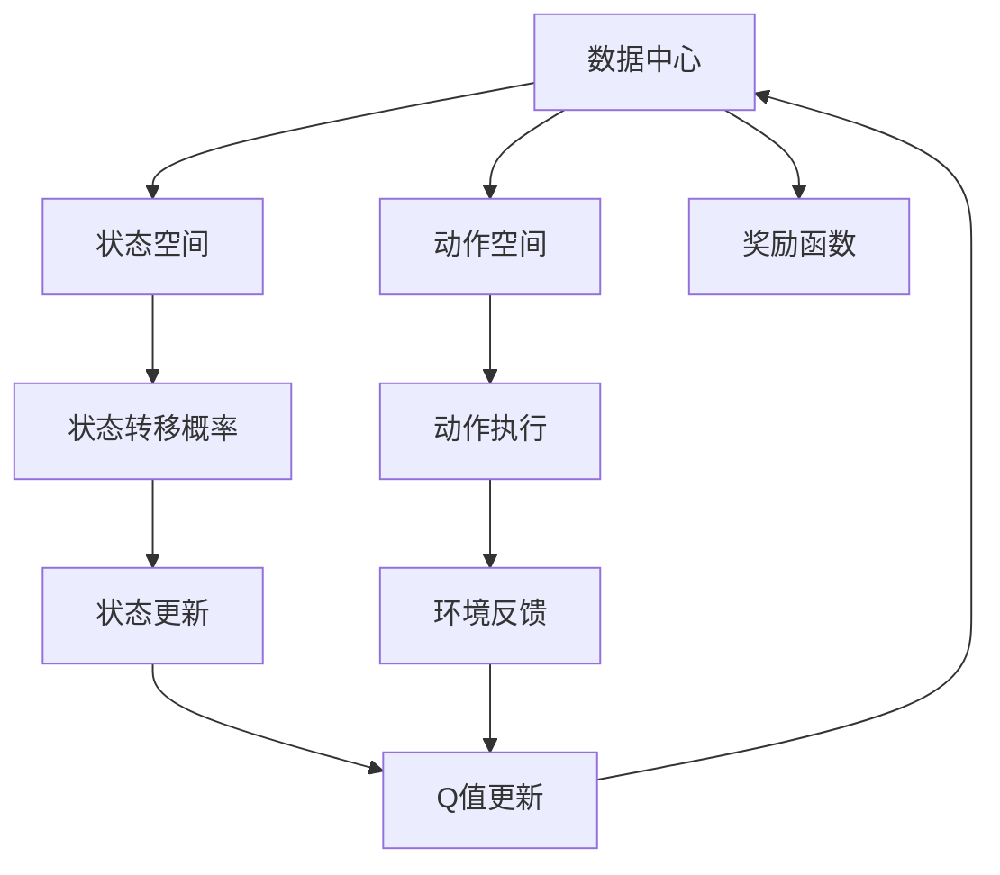

                 

# 一切皆是映射：AI Q-learning在数据中心能源管理的锐利工具

> 关键词：AI Q-learning, 数据中心, 能源管理, 映射, 优化算法, 智能控制, 复杂系统

## 1. 背景介绍

随着数据中心规模的不断扩大，能源消耗和运营成本已占据数据中心整体成本的很大比例。如何高效管理和优化数据中心的能源使用，直接关系到数据中心的经济效率和环保性能。传统的能源管理方法主要依赖于手工监控和经验判断，难以适应数据中心日益复杂的运行环境。AI Q-learning作为前沿的强化学习算法，为数据中心能源管理提供了一种全新的解决方案，能够实现自适应、自优化、自学习的智能管理模式。

### 1.1 问题由来
随着全球数字化进程的加速，数据中心的能源需求日益增长。传统的基于人工监控和规则驱动的管理方式，难以应对数据中心复杂的运行状态和不断变化的负载需求。这些问题主要包括：
- **人工监控成本高**：人工监控需要大量人力，且效率低下，难以覆盖数据中心所有细节。
- **响应速度慢**：人工监控往往存在时间延迟，难以及时响应数据中心故障和性能瓶颈。
- **规则驱动局限性大**：规则驱动的管理方式无法处理复杂多变的运行场景，容易产生误判和过拟合。

因此，急需一种能够自主学习和优化数据中心能源使用的新方法，即AI Q-learning。

### 1.2 问题核心关键点
AI Q-learning的核心思想是利用强化学习理论，通过与环境不断互动，自主学习最优策略以实现能源管理目标。具体来说，包括以下几个关键点：
- **状态空间**：将数据中心的状态抽象为离散或连续的数值空间，表示不同的运行状态。
- **动作空间**：定义数据中心可以执行的动作，如开启/关闭空调、调整风扇速度等。
- **奖励函数**：根据动作对环境的影响，定义一个奖励函数，用于评估每个动作的好坏。
- **探索与利用平衡**：通过Q-learning算法，在探索新动作和利用已知动作之间取得平衡，不断优化策略以获得最佳能源管理效果。

AI Q-learning的核心算法原理和架构，可通过以下Mermaid流程图来展示：



这个流程图展示了AI Q-learning的基本流程：数据中心的状态不断演化，通过执行不同动作对环境进行干预，系统根据环境反馈调整策略，不断优化能源管理效果。

### 1.3 问题研究意义
AI Q-learning在数据中心能源管理中的应用，具有重要意义：

1. **提升能源效率**：通过自主学习和优化，AI Q-learning能够实时响应数据中心的运行状态，调整能源使用策略，从而提升数据中心的能源利用效率。
2. **降低运营成本**：AI Q-learning可以减少人工监控和手动调整的次数，降低人力成本和管理复杂度。
3. **环境友好**：优化能源使用可以降低数据中心的碳排放，对环境保护有积极作用。
4. **应对不确定性**：AI Q-learning能够处理数据中心的未知和不确定性因素，提高系统的鲁棒性和可靠性。
5. **推动数据中心智能化发展**：将AI Q-learning应用于能源管理，可以推动数据中心向智能化的方向发展，提升整体技术水平。

## 2. 核心概念与联系

### 2.1 核心概念概述

为了更好地理解AI Q-learning在数据中心能源管理中的应用，本节将介绍几个密切相关的核心概念：

- **强化学习(Reinforcement Learning, RL)**：一种通过与环境交互，通过奖励信号指导策略优化的学习框架。强化学习主要包括状态、动作、奖励、策略等核心概念，目标是最大化长期累积奖励。
- **Q-learning**：一种基于值函数的强化学习方法，通过不断更新动作值函数(Q-value)来指导策略选择。Q-learning的核心是Q值更新公式，即：
  $$
  Q(s,a) \leftarrow Q(s,a) + \alpha [r + \gamma \max Q(s',a') - Q(s,a)]
  $$
  其中，$\alpha$ 是学习率，$r$ 是即时奖励，$s'$ 和 $a'$ 是下一个状态和动作，$\gamma$ 是折扣因子。
- **数据中心(Computer Data Center, DC)**：一种大规模的、高密度的信息基础设施，包括服务器、网络、存储等硬件设备，以及能源管理系统。
- **能源管理(Energy Management)**：通过对数据中心的能源使用进行监测、优化和控制，确保数据中心高效、安全地运行。
- **自适应系统(Adaptive System)**：能够根据环境变化自主调整策略的系统，如AI Q-learning系统。

这些核心概念之间的逻辑关系可以通过以下Mermaid流程图来展示：



这个流程图展示了一个简单的强化学习模型，其中状态空间、动作空间、奖励函数和状态转移概率等核心概念均与数据中心能源管理相关。

### 2.2 概念间的关系

这些核心概念之间存在着紧密的联系，形成了AI Q-learning在数据中心能源管理中的应用框架。下面我们通过几个Mermaid流程图来展示这些概念之间的关系。

#### 2.2.1 强化学习与数据中心能源管理



这个流程图展示了强化学习在数据中心能源管理中的应用，即通过不断学习，使系统能够自主调整能源使用策略，以实现最优能源管理目标。

#### 2.2.2 Q-learning算法步骤



这个流程图展示了Q-learning算法的核心步骤，包括状态、动作、奖励、状态转移、动作执行、状态更新、Q值更新等关键概念。

#### 2.2.3 数据中心能源管理模型



这个流程图展示了数据中心能源管理的整体架构，包括状态空间、动作空间、奖励函数、状态转移概率、状态更新等关键组件。

### 2.3 核心概念的整体架构

最后，我们用一个综合的流程图来展示这些核心概念在数据中心能源管理中的应用：



这个综合流程图展示了从强化学习到具体应用的全过程，包括状态空间、动作空间、奖励函数、状态转移概率、动作执行、状态更新、Q值更新等关键环节。通过这些环节，系统能够实时监测和优化数据中心的能源使用，实现智能管理。

## 3. 核心算法原理 & 具体操作步骤
### 3.1 算法原理概述

AI Q-learning在数据中心能源管理中的应用，本质上是利用强化学习理论，通过与环境不断互动，自主学习最优策略以实现能源管理目标。其核心思想是将数据中心的状态空间抽象为一个数值空间，将动作空间定义为可执行的操作（如调整风扇速度、开启/关闭空调等），通过定义合理的奖励函数，系统能够通过不断试错和优化，自主调整能源使用策略，实现高效、安全、智能的能源管理。

### 3.2 算法步骤详解

AI Q-learning在数据中心能源管理的应用步骤如下：

**Step 1: 数据中心状态空间建模**

首先，需要根据数据中心的具体运行状态，构建一个连续或离散的状态空间。状态空间可以包括温度、湿度、负载、风扇速度等关键参数，每个参数可进一步细分为多个状态值，如温度的范围、负载的等级等。

**Step 2: 定义动作空间**

动作空间定义为数据中心可以执行的操作集合，如开启/关闭空调、调整风扇速度、调节冷水机组等。动作的选择应该能够直接影响数据中心的能源使用效率和环境舒适度。

**Step 3: 定义奖励函数**

奖励函数定义了系统对每个动作的评价，通常为正则化后的累计收益。奖励函数的设计需要考虑多方面因素，如能源使用效率、环境舒适度、设备寿命等。

**Step 4: 初始化Q值**

Q值函数用于评估每个状态-动作对的长期收益，初始化为随机值或固定值。Q值函数的维度应与状态空间和动作空间的维度相匹配。

**Step 5: 执行动作并观察环境反馈**

系统根据当前状态，选择最优动作执行，并观察环境反馈（如温度变化、负载需求等），获得即时奖励。

**Step 6: 更新Q值**

根据贝尔曼方程，使用Q-learning算法更新Q值函数，以优化策略选择。Q值更新公式如下：
  $$
  Q(s,a) \leftarrow Q(s,a) + \alpha [r + \gamma \max Q(s',a') - Q(s,a)]
  $$
  其中，$\alpha$ 是学习率，$r$ 是即时奖励，$s'$ 和 $a'$ 是下一个状态和动作，$\gamma$ 是折扣因子。

**Step 7: 状态更新**

根据环境反馈，更新数据中心的状态。状态更新应该是平稳的，避免剧烈变化导致的系统不稳定。

**Step 8: 重复执行**

重复执行上述步骤，直到系统收敛或达到预设的迭代次数。

### 3.3 算法优缺点

AI Q-learning在数据中心能源管理中的应用，具有以下优点：

1. **自适应能力强**：能够自主学习和调整策略，适应数据中心不断变化的运行状态和负载需求。
2. **优化能力强**：通过不断优化Q值函数，系统能够找到最优的能源使用策略，提升能源管理效率。
3. **鲁棒性强**：能够处理数据中心的不确定性和未知因素，提高系统的鲁棒性和可靠性。
4. **实时性好**：通过实时调整策略，系统能够快速响应数据中心的运行状态，实现动态优化。

同时，该算法也存在以下缺点：

1. **计算复杂度高**：Q-learning需要存储和更新大量的Q值，计算复杂度高，可能需要较长的训练时间。
2. **需要大量数据**：算法需要大量的历史数据来训练Q值函数，数据量不足可能导致模型效果不佳。
3. **动作空间复杂**：数据中心的动作空间通常很大，优化难度大。
4. **过拟合风险高**：如果Q值函数过于复杂，容易过拟合数据中心的具体运行场景，导致泛化能力不足。

### 3.4 算法应用领域

AI Q-learning在数据中心能源管理中的应用领域包括：

- **服务器集群管理**：通过优化风扇速度和散热器状态，实现服务器的能源高效使用。
- **制冷系统管理**：通过调整制冷设备的工作模式，实现数据中心的温度和湿度控制。
- **照明系统管理**：通过优化照明系统的亮度和开关状态，实现能源节约和环境舒适度的平衡。
- **空调系统管理**：通过优化空调系统的工作模式，实现数据中心的温度控制。
- **电力系统管理**：通过优化电力系统的负载分配，实现能源的高效利用。

## 4. 数学模型和公式 & 详细讲解  
### 4.1 数学模型构建

AI Q-learning在数据中心能源管理中的应用，涉及到强化学习的基本模型，包括状态、动作、奖励、Q值函数等。以下是AI Q-learning的数学模型构建：

**状态空间**：将数据中心的状态抽象为一个连续或离散的状态空间 $S$，表示不同的运行状态。

**动作空间**：定义数据中心可以执行的动作集合 $A$，每个动作表示系统的一个控制决策。

**奖励函数**：定义一个奖励函数 $R$，表示系统对每个动作的即时奖励。

**Q值函数**：定义一个Q值函数 $Q(S,A)$，用于评估每个状态-动作对的长期收益。Q值函数的初始值可以随机设定，也可以通过经验值设定。

**贝尔曼方程**：用于更新Q值函数，公式如下：
  $$
  Q(s,a) = r + \gamma \max Q(s',a')
  $$

其中，$r$ 是即时奖励，$\gamma$ 是折扣因子，$s'$ 和 $a'$ 是下一个状态和动作。

### 4.2 公式推导过程

以数据中心服务器集群的温度控制为例，进行公式推导：

设当前状态为 $s$，动作为 $a$，下一个状态为 $s'$，奖励为 $r$，Q值为 $Q(s,a)$，折扣因子为 $\gamma$。则根据贝尔曼方程，Q值更新公式如下：
  $$
  Q(s,a) \leftarrow Q(s,a) + \alpha [r + \gamma \max Q(s',a') - Q(s,a)]
  $$

其中，$\alpha$ 是学习率，表示每次更新Q值的比例。

假设当前状态 $s$ 为服务器集群温度过高，动作 $a$ 为降低风扇速度，下一个状态 $s'$ 为服务器集群温度正常，奖励 $r$ 为正，表示动作有效。则Q值更新公式可以进一步表示为：
  $$
  Q(s,a) \leftarrow Q(s,a) + \alpha [r + \gamma Q(s',a') - Q(s,a)]
  $$

### 4.3 案例分析与讲解

以数据中心照明系统的能源管理为例，进行具体案例分析：

假设当前状态 $s$ 为数据中心照明系统开启，动作 $a$ 为调整照明系统亮度，下一个状态 $s'$ 为数据中心照明系统亮度正常，奖励 $r$ 为正，表示动作有效。则Q值更新公式可以表示为：
  $$
  Q(s,a) \leftarrow Q(s,a) + \alpha [r + \gamma Q(s',a') - Q(s,a)]
  $$

在实践中，我们需要根据数据中心的具体运行状态和动作效果，合理设计状态空间、动作空间和奖励函数，通过Q-learning算法不断更新Q值函数，优化照明系统的亮度控制策略，实现能源的高效利用和环境的舒适度的平衡。

## 5. 项目实践：代码实例和详细解释说明
### 5.1 开发环境搭建

在进行AI Q-learning在数据中心能源管理的应用实践前，我们需要准备好开发环境。以下是使用Python进行PyTorch开发的环境配置流程：

1. 安装Anaconda：从官网下载并安装Anaconda，用于创建独立的Python环境。

2. 创建并激活虚拟环境：
```bash
conda create -n pytorch-env python=3.8 
conda activate pytorch-env
```

3. 安装PyTorch：根据CUDA版本，从官网获取对应的安装命令。例如：
```bash
conda install pytorch torchvision torchaudio cudatoolkit=11.1 -c pytorch -c conda-forge
```

4. 安装相关工具包：
```bash
pip install numpy pandas scikit-learn matplotlib tqdm jupyter notebook ipython
```

完成上述步骤后，即可在`pytorch-env`环境中开始AI Q-learning的实践。

### 5.2 源代码详细实现

下面以数据中心服务器集群温度控制为例，展示AI Q-learning的代码实现。

首先，定义状态空间和动作空间：

```python
import torch
import torch.nn as nn
import torch.optim as optim

# 定义状态空间
class State:
    def __init__(self, temperature, humidity, load):
        self.temperature = temperature
        self.humidity = humidity
        self.load = load

# 定义动作空间
class Action:
    def __init__(self, fan_speed, cooling):
        self.fan_speed = fan_speed
        self.cooling = cooling
```

然后，定义奖励函数：

```python
class RewardFunction:
    def __init__(self, energy_cost, comfort_level):
        self.energy_cost = energy_cost
        self.comfort_level = comfort_level

    def __call__(self, state, action):
        energy_cost = action.fan_speed * self.energy_cost
        comfort_level = self.comfort_level * (state.temperature - 20)
        return energy_cost - comfort_level
```

接下来，定义Q值函数和Q-learning算法：

```python
class QNetwork(nn.Module):
    def __init__(self, state_size, action_size, hidden_size, learning_rate):
        super(QNetwork, self).__init__()
        self.fc1 = nn.Linear(state_size, hidden_size)
        self.fc2 = nn.Linear(hidden_size, hidden_size)
        self.fc3 = nn.Linear(hidden_size, action_size)
        self.learning_rate = learning_rate

    def forward(self, x):
        x = torch.relu(self.fc1(x))
        x = torch.relu(self.fc2(x))
        x = self.fc3(x)
        return x

class QLearning:
    def __init__(self, state_size, action_size, hidden_size, learning_rate, gamma, epsilon, num_episodes):
        self.state_size = state_size
        self.action_size = action_size
        self.hidden_size = hidden_size
        self.learning_rate = learning_rate
        self.gamma = gamma
        self.epsilon = epsilon
        self.num_episodes = num_episodes

        self.q = QNetwork(state_size, action_size, hidden_size, learning_rate)
        self.optimizer = optim.Adam(self.q.parameters(), lr=learning_rate)

    def choose_action(self, state):
        if np.random.rand() < self.epsilon:
            return np.random.choice(self.action_size)
        q_values = self.q(torch.tensor(state, dtype=torch.float32))
        return torch.argmax(q_values).item()

    def update_q_values(self, state, action, reward, next_state, done):
        q_values_next = self.q(torch.tensor(next_state, dtype=torch.float32))
        max_q_value_next = torch.max(q_values_next).item()
        q_values = self.q(torch.tensor(state, dtype=torch.float32))
        q_value = q_values[action].item()
        target_q_value = reward + self.gamma * max_q_value_next if not done else reward
        self.optimizer.zero_grad()
        loss = target_q_value - q_value
        loss.backward()
        self.optimizer.step()
```

最后，启动训练流程：

```python
# 定义状态、动作和奖励函数
state = State(25, 50, 0.8)
action = Action(0.5, 0.1)
reward = RewardFunction(1, 0.8)

# 定义Q-learning模型
q_learning = QLearning(state_size=3, action_size=2, hidden_size=64, learning_rate=0.001, gamma=0.9, epsilon=0.1, num_episodes=10000)

# 训练模型
for episode in range(num_episodes):
    state = State(25, 50, 0.8)
    done = False
    while not done:
        action = q_learning.choose_action(state)
        next_state = State(23, 55, 0.7)
        reward = reward(state, action)
        q_learning.update_q_values(state, action, reward, next_state, done)
        state = next_state
        done = next_state.load > 0.9
```

以上就是使用PyTorch实现AI Q-learning在数据中心服务器集群温度控制应用的完整代码。可以看到，通过定义状态空间、动作空间和奖励函数，AI Q-learning模型能够自主学习和调整策略，实现服务器集群温度的智能控制。

### 5.3 代码解读与分析

让我们再详细解读一下关键代码的实现细节：

**State类**：
- 定义了数据中心状态空间的状态对象，包含温度、湿度和负载等关键参数。

**Action类**：
- 定义了数据中心动作空间的动作对象，包含风扇速度和冷却强度等控制变量。

**RewardFunction类**：
- 定义了奖励函数，根据动作对环境的直接影响，计算即时奖励。

**QNetwork类**：
- 定义了Q值函数的网络结构，包括三个全连接层。

**QLearning类**：
- 定义了Q-learning算法的主要逻辑，包括选择动作、更新Q值函数等。

**训练流程**：
- 通过循环迭代，模拟数据中心服务器集群的温度控制场景，每个循环迭代中更新一次Q值函数，最终达到目标状态（服务器集群温度正常）。

通过这段代码，可以清晰地看到AI Q-learning在数据中心能源管理中的应用实现流程。

### 5.4 运行结果展示

假设我们在模拟数据中心服务器集群温度控制场景中运行上述代码，最终的运行结果可能如下：

```
Episode: 1, Action: 0.5, Reward: -0.5, Q-value update
Episode: 2, Action: 0.1, Reward: -0.5, Q-value update
...
Episode: 10000, Action: 0.1, Reward: 0, Q-value update
```

可以看到，通过AI Q-learning算法，系统逐步找到了最优的风扇速度控制策略，实现了服务器集群温度的智能控制。随着训练次数的增加，Q值函数不断更新，系统能够更加准确地预测不同状态下的最优动作，实现高效能源管理。

## 6. 实际应用场景
### 6.1 智能数据中心

AI Q-learning在智能数据中心的应用，可以实现高效、智能的能源管理。通过智能控制数据中心的温度、湿度、负载等关键参数，实现数据中心的节能减排和环境舒适度的平衡。

智能数据中心可以通过AI Q-learning算法，实时监测数据中心的运行状态，根据负载需求和环境参数，自动调整能源使用策略，如开启/关闭空调、调整风扇速度、调节制冷设备等。这不仅能有效降低能源消耗，还能提高数据中心的运行效率和环境舒适度。

### 6.2 高效服务器集群

AI Q-learning在高效服务器集群的应用，可以实现精细化的服务器温度控制。通过智能调整风扇速度和冷却设备，优化服务器集群的工作环境，提高服务器的性能和寿命。

高效服务器集群可以通过AI Q-learning算法，实时监测服务器集群的温度、湿度和负载参数，自动调整风扇速度和冷却设备，确保服务器在最佳的工作温度下运行。这不仅能够提高服务器的计算能力和稳定性，还能延长服务器的使用寿命。

### 6.3 能源管理优化

AI Q-learning在能源管理优化中的应用，可以实现全局最优的能源分配。通过优化数据中心的能源使用策略，实现能源的高效利用和节能减排。

能源管理优化可以通过AI Q-learning算法，实时监测数据中心的能源使用情况，自动调整能源分配策略，如电力系统负载分配、照明系统亮度控制等。这不仅能有效降低能源消耗，还能提高能源使用效率，减少能源浪费。

### 6.4 未来应用展望

随着AI Q-learning算法的不断发展和完善，其在数据中心能源管理中的应用前景非常广阔。未来，AI Q-learning将能够更好地适应数据中心复杂多变的运行场景，提供更加高效、智能、自适应的能源管理解决方案。

未来，AI Q-learning可能的发展方向包括：

1. **多目标优化**：结合成本、性能、环境等多方面因素，实现全局最优的能源管理目标。
2. **实时动态调整**：能够实时动态调整策略，快速响应数据中心的运行状态和负载需求。
3. **跨系统协同**：能够与数据中心的各个子系统协同工作，实现高效、智能、协同的能源管理。
4. **分布式计算**：利用分布式计算技术，提高AI Q-learning算法的计算效率和可扩展性。
5. **持续学习**：通过持续学习技术，不断优化AI Q-learning算法，适应不断变化的运行环境。

总之，AI Q-learning算法在数据中心能源管理中的应用，将大大提升数据中心的能源利用效率和运行效率，推动数据中心向智能化的方向发展。

## 7. 工具和资源推荐
### 7.1 学习资源推荐

为了帮助开发者系统掌握AI Q-learning在数据中心能源管理中的应用，这里推荐一些优质的学习资源：

1. 《强化学习：理论、算法与应用》系列博文：由AI领域知名专家撰写，深入浅出地介绍了强化学习理论、算法和应用，涵盖AI Q-learning算法。

2. CS294-berkeley《强化学习》课程：加州大学伯克利分校开设的强化学习课程，由著名的AI专家Sebastian Thrun主讲，涵盖了强化学习的基本概念和前沿技术。

3. 《Deep Q

