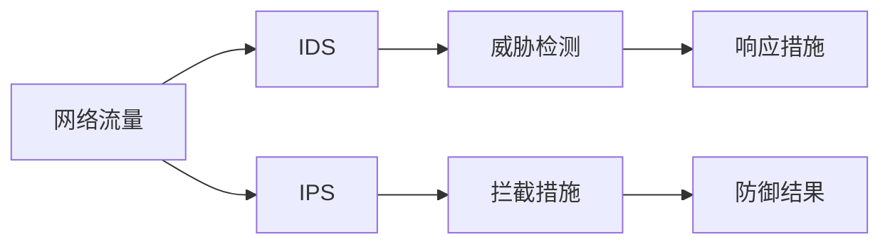
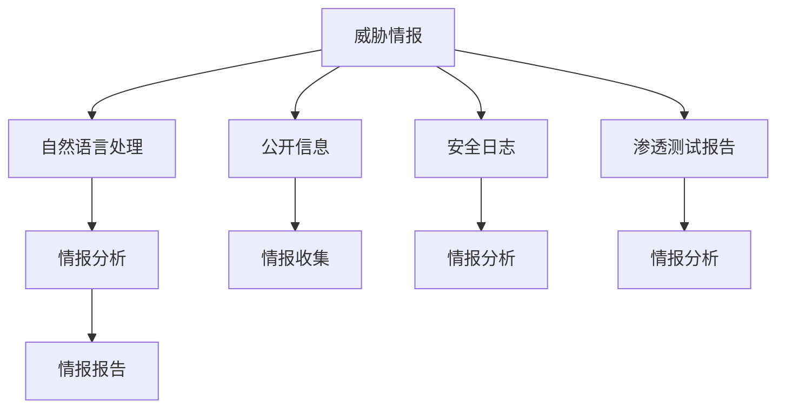

                 

# 一切皆是映射：AI在网络安全中的应用

> 关键词：人工智能, 网络安全, 机器学习, 深度学习, 威胁检测, 异常检测, 入侵防御

## 1. 背景介绍

### 1.1 问题由来
随着互联网技术的不断发展和普及，网络安全问题日益严峻。各类网络攻击事件频发，给个人和企业带来了巨大的经济损失和声誉风险。传统的网络安全防御方法，如防火墙、入侵检测系统(IDS)、入侵防御系统(IPS)等，在应对新型复杂攻击方面存在显著局限。人工智能（AI）技术的出现，为网络安全领域带来了新的契机。

### 1.2 问题核心关键点
AI在网络安全中的应用，主要体现在以下几个方面：

- **威胁检测与异常检测**：通过机器学习算法对网络流量、日志数据进行分析，识别出异常行为和潜在威胁。
- **入侵防御**：基于AI模型的入侵检测系统，实时拦截和阻止恶意攻击。
- **用户行为分析**：利用深度学习对用户行为进行建模，发现异常账号和异常行为。
- **恶意软件检测**：通过AI算法分析恶意软件代码，识别新型恶意软件。
- **威胁情报分析**：利用自然语言处理(NLP)技术对网络安全威胁情报进行分析，提供快速响应能力。

AI技术的应用，使得网络安全防御更加智能化、自动化，能够及时发现和响应新型攻击，提高了网络安全防护能力。

### 1.3 问题研究意义
研究AI在网络安全中的应用，对于提升网络安全防御水平，保障关键信息基础设施的安全，具有重要意义：

1. **自动化防御**：AI技术能够实时分析大量数据，快速识别和应对威胁，极大提升防御效率。
2. **全面防护**：AI模型能够识别多种新型攻击，弥补传统防御系统的漏洞。
3. **精确分析**：AI模型能够从海量数据中提取有价值的信息，提高威胁情报的准确性。
4. **持续学习**：AI模型能够持续学习最新的攻击模式，保持防御能力的时效性。
5. **用户友好**：AI技术使得防御系统更加易于部署和管理，降低了对专业人员的要求。

## 2. 核心概念与联系

### 2.1 核心概念概述

为更好地理解AI在网络安全中的应用，本节将介绍几个密切相关的核心概念：

- **人工智能(AI)**：指通过算法和模型，使计算机具备智能推理和自我学习能力。广泛应用于图像识别、语音识别、自然语言处理等领域。
- **机器学习(ML)**：AI的一种实现方式，通过数据训练模型，使其能够自主进行推理和决策。在网络安全中，常用于威胁检测、异常检测等任务。
- **深度学习(Deep Learning)**：ML的一种高级形式，利用多层神经网络进行复杂模式识别。在网络安全中，常用于恶意软件检测、用户行为分析等。
- **自然语言处理(NLP)**：指利用算法处理和理解人类语言的技术。在网络安全中，常用于威胁情报分析、安全日志解析等。
- **威胁情报(Threat Intelligence)**：指关于网络安全威胁的情报和分析。通过NLP等技术，从大量公开信息中提取有价值的情报。
- **入侵检测系统(IDS)**：用于监测网络或主机活动，识别可疑行为的安全设备。常结合AI技术进行威胁检测和响应。
- **入侵防御系统(IPS)**：在IDS的基础上，自动拦截和阻止恶意流量，提高防御效率。常结合AI技术进行实时防御。

这些核心概念之间的逻辑关系可以通过以下Mermaid流程图来展示：

```mermaid
graph TB
    A[人工智能] --> B[机器学习]
    A --> C[深度学习]
    A --> D[自然语言处理]
    B --> E[威胁检测]
    B --> F[异常检测]
    C --> G[恶意软件检测]
    D --> H[威胁情报分析]
    A --> I[入侵检测系统(IDS)]
    A --> J[入侵防御系统(IPS)]
```

这个流程图展示了AI技术的核心概念及其在网络安全中的应用。

### 2.2 概念间的关系

这些核心概念之间存在着紧密的联系，形成了AI在网络安全应用的完整生态系统。下面我们通过几个Mermaid流程图来展示这些概念之间的关系。

#### 2.2.1 AI技术在网络安全中的学习范式

```mermaid
graph TB
    A[网络流量] --> B[机器学习]
    A --> C[深度学习]
    A --> D[自然语言处理]
    B --> E[威胁检测]
    B --> F[异常检测]
    C --> G[恶意软件检测]
    D --> H[威胁情报分析]
    E --> I[入侵检测系统(IDS)]
    E --> J[入侵防御系统(IPS)]
```

这个流程图展示了AI技术在网络安全中的学习范式。

#### 2.2.2 IDS与IPS的应用流程



这个流程图展示了入侵检测系统(IDS)和入侵防御系统(IPS)的应用流程。

#### 2.2.3 威胁情报分析的流程



这个流程图展示了威胁情报分析的流程。

### 2.3 核心概念的整体架构

最后，我们用一个综合的流程图来展示这些核心概念在大规模网络安全应用中的整体架构：

```mermaid
graph TB
    A[大规模网络流量] --> B[机器学习]
    A --> C[深度学习]
    A --> D[自然语言处理]
    B --> E[威胁检测]
    B --> F[异常检测]
    C --> G[恶意软件检测]
    D --> H[威胁情报分析]
    A --> I[入侵检测系统(IDS)]
    A --> J[入侵防御系统(IPS)]
    E --> K[威胁响应]
    G --> L[恶意软件隔离]
    H --> M[威胁情报报告]
```

这个综合流程图展示了从网络流量分析到威胁检测、异常检测、恶意软件检测、威胁情报分析、入侵检测和防御的完整过程。

## 3. 核心算法原理 & 具体操作步骤
### 3.1 算法原理概述

AI在网络安全中的应用，主要依赖于机器学习和深度学习算法。这些算法通过数据训练模型，使其能够识别和预测异常行为和潜在威胁。

1. **监督学习**：利用标注好的数据集，训练模型进行威胁检测和异常检测。
2. **无监督学习**：使用未标注的数据集，通过聚类和异常检测等算法发现异常行为。
3. **强化学习**：通过奖励机制训练模型，使其在特定环境中做出最优决策，实现入侵防御。
4. **半监督学习**：结合少量标注数据和大量未标注数据，提高模型泛化能力。
5. **迁移学习**：利用已训练好的模型，在新任务上进行微调，提高模型适应性。

这些算法在大规模网络安全应用中，能够实时分析大量数据，快速识别和响应威胁，提升防御效率。

### 3.2 算法步骤详解

以下是AI在网络安全中的应用步骤详解：

**Step 1: 数据收集与预处理**
- 收集网络流量、日志数据、安全事件、威胁情报等数据。
- 对数据进行清洗、去重、归一化等预处理。
- 利用数据增强技术扩充数据集，增加样本多样性。

**Step 2: 模型训练与微调**
- 选择合适的算法，训练威胁检测、异常检测、恶意软件检测等模型。
- 在大量标注数据上训练模型，并使用交叉验证等技术进行模型评估。
- 对模型进行微调，优化模型参数，提高模型精度和泛化能力。

**Step 3: 威胁检测与响应**
- 部署训练好的模型，实时监测网络流量和日志数据。
- 使用模型进行威胁检测，识别出异常行为和潜在威胁。
- 根据威胁检测结果，自动响应措施，如拦截恶意流量、隔离恶意软件等。

**Step 4: 异常检测与分析**
- 使用无监督学习算法，如聚类、密度估计等，检测异常行为。
- 对异常行为进行深入分析，识别攻击模式和行为特征。
- 结合威胁情报分析，提升异常检测的准确性和及时性。

**Step 5: 恶意软件检测与隔离**
- 使用深度学习模型，如卷积神经网络(CNN)、循环神经网络(RNN)等，分析恶意软件代码。
- 通过特征提取、模式识别等技术，检测新型恶意软件。
- 根据检测结果，隔离和清除恶意软件，保障系统安全。

**Step 6: 威胁情报分析与响应**
- 利用自然语言处理技术，分析威胁情报数据，提取有价值的情报。
- 结合威胁情报和攻击模式库，提升威胁情报的准确性和有效性。
- 根据威胁情报，制定响应策略，防范未来的攻击。

### 3.3 算法优缺点

AI在网络安全中的应用具有以下优点：

1. **自动化**：通过模型实时分析大量数据，快速识别和响应威胁。
2. **泛化能力强**：模型可以学习多种攻击模式，适应新型攻击。
3. **精度高**：深度学习模型能够识别复杂的模式和特征。
4. **实时响应**：能够快速响应新出现的威胁，提高防御效率。

然而，AI在网络安全中也存在以下缺点：

1. **数据依赖**：模型的性能依赖于高质量的数据集，数据质量不高时效果不佳。
2. **计算资源需求高**：深度学习模型需要大量的计算资源和存储空间。
3. **误报率高**：模型可能会误报正常行为为威胁，导致误杀。
4. **解释性不足**：AI模型往往是黑盒系统，难以解释其决策过程。

### 3.4 算法应用领域

AI在网络安全中的应用领域非常广泛，主要包括：

- **威胁检测与响应**：检测各类网络攻击，如DDoS、SQL注入、XSS等，并进行自动响应。
- **异常检测与分析**：检测网络流量中的异常行为，识别零日攻击和新型漏洞。
- **恶意软件检测**：检测和隔离恶意软件，防止其传播和感染。
- **用户行为分析**：分析用户行为，发现异常账号和异常行为，预防内部攻击。
- **威胁情报分析**：分析威胁情报数据，提取有价值的情报，提供快速响应能力。
- **入侵防御**：结合IDS和IPS技术，实时拦截和阻止恶意流量。

## 4. 数学模型和公式 & 详细讲解  
### 4.1 数学模型构建

在网络安全领域，AI模型通常用于威胁检测、异常检测、恶意软件检测等任务。这里以威胁检测为例，介绍模型的构建方法。

假设网络流量数据为 $X=\{x_1, x_2, \ldots, x_N\}$，其中 $x_i$ 表示第 $i$ 个样本的特征向量。威胁检测的目标是判断 $x_i$ 是否为威胁样本，即判断 $y_i \in \{0, 1\}$，其中 $y_i=1$ 表示威胁样本。

威胁检测通常使用二分类模型，如逻辑回归、决策树、支持向量机等。本文以逻辑回归模型为例，介绍模型的构建过程。

**Step 1: 数据准备**
- 收集网络流量数据，并对数据进行预处理。
- 将数据集分为训练集、验证集和测试集。

**Step 2: 模型训练**
- 选择合适的特征表示方法，如TF-IDF、PCA等，将原始数据转换为特征向量。
- 利用训练集数据 $D=\{(x_i, y_i)\}_{i=1}^N$ 训练逻辑回归模型，得到模型参数 $\theta$。

**Step 3: 模型评估**
- 使用验证集数据评估模型性能，计算准确率、召回率、F1分数等指标。
- 根据评估结果调整模型参数，优化模型性能。

**Step 4: 威胁检测**
- 使用训练好的模型对测试集数据进行威胁检测，判断是否为威胁样本。
- 结合模型评估指标，调整模型参数，提升威胁检测精度。

### 4.2 公式推导过程

以逻辑回归模型为例，推导威胁检测的公式。

假设模型 $h_{\theta}(x)$ 表示输入特征 $x$ 通过模型得到的概率，模型的输出 $y$ 为威胁检测结果，即 $y \in \{0, 1\}$。逻辑回归模型的预测公式为：

$$
h_{\theta}(x) = \frac{1}{1 + e^{-\theta^T x}}
$$

其中 $\theta$ 为模型参数，$x$ 为输入特征，$e$ 为自然常数。

威胁检测的损失函数通常采用交叉熵损失函数，即：

$$
L(y, h_{\theta}(x)) = -(y \log h_{\theta}(x) + (1 - y) \log (1 - h_{\theta}(x)))
$$

将上式对 $\theta$ 求导，得到：

$$
\frac{\partial L(y, h_{\theta}(x))}{\partial \theta} = -(y - h_{\theta}(x))x
$$

利用梯度下降算法，更新模型参数 $\theta$：

$$
\theta \leftarrow \theta - \eta \frac{\partial L(y, h_{\theta}(x))}{\partial \theta}
$$

其中 $\eta$ 为学习率。

### 4.3 案例分析与讲解

以深度学习模型为例，介绍恶意软件检测的实现方法。

假设恶意软件代码的特征向量为 $x=\{x_1, x_2, \ldots, x_N\}$，其中 $x_i$ 表示第 $i$ 个特征。假设 $y$ 为恶意软件检测结果，即 $y \in \{0, 1\}$，其中 $y=1$ 表示恶意软件样本。

**Step 1: 数据准备**
- 收集恶意软件代码数据，并对数据进行预处理。
- 将数据集分为训练集、验证集和测试集。

**Step 2: 模型训练**
- 选择深度学习模型，如卷积神经网络(CNN)、循环神经网络(RNN)等。
- 利用训练集数据 $D=\{(x_i, y_i)\}_{i=1}^N$ 训练模型，得到模型参数 $\theta$。

**Step 3: 模型评估**
- 使用验证集数据评估模型性能，计算准确率、召回率、F1分数等指标。
- 根据评估结果调整模型参数，优化模型性能。

**Step 4: 恶意软件检测**
- 使用训练好的模型对测试集数据进行恶意软件检测，判断是否为恶意软件样本。
- 结合模型评估指标，调整模型参数，提升恶意软件检测精度。

## 5. 项目实践：代码实例和详细解释说明
### 5.1 开发环境搭建

在进行网络安全AI项目实践前，我们需要准备好开发环境。以下是使用Python进行TensorFlow开发的环境配置流程：

1. 安装Anaconda：从官网下载并安装Anaconda，用于创建独立的Python环境。

2. 创建并激活虚拟环境：
```bash
conda create -n tensorflow-env python=3.7 
conda activate tensorflow-env
```

3. 安装TensorFlow：根据CUDA版本，从官网获取对应的安装命令。例如：
```bash
pip install tensorflow
```

4. 安装TensorFlow Addons：增强TensorFlow功能，如模型优化器、正则化等。
```bash
pip install tensorflow-addons
```

5. 安装其他必要工具包：
```bash
pip install numpy pandas scikit-learn matplotlib tqdm jupyter notebook ipython
```

完成上述步骤后，即可在`tensorflow-env`环境中开始项目实践。

### 5.2 源代码详细实现

以下是一个简单的威胁检测模型实现，使用逻辑回归模型对网络流量数据进行威胁检测：

```python
import tensorflow as tf
from sklearn.model_selection import train_test_split
from sklearn.feature_extraction.text import TfidfVectorizer
from sklearn.metrics import accuracy_score

# 定义模型参数
learning_rate = 0.01
batch_size = 64
epochs = 10

# 加载数据集
data = open("network_data.csv").readlines()
X = [line.split(',')[0] for line in data]
y = [int(line.split(',')[1]) for line in data]

# 划分训练集和测试集
X_train, X_test, y_train, y_test = train_test_split(X, y, test_size=0.2, random_state=42)

# 构建特征表示器
vectorizer = TfidfVectorizer()
X_train = vectorizer.fit_transform(X_train)
X_test = vectorizer.transform(X_test)

# 构建模型
model = tf.keras.Sequential([
    tf.keras.layers.Dense(128, activation='relu', input_shape=(X_train.shape[1],)),
    tf.keras.layers.Dense(1, activation='sigmoid')
])

# 编译模型
model.compile(optimizer=tf.keras.optimizers.Adam(learning_rate),
              loss='binary_crossentropy',
              metrics=['accuracy'])

# 训练模型
model.fit(X_train, y_train, batch_size=batch_size, epochs=epochs, validation_data=(X_test, y_test))

# 测试模型
y_pred = model.predict_classes(X_test)
accuracy = accuracy_score(y_test, y_pred)
print('Accuracy:', accuracy)
```

### 5.3 代码解读与分析

让我们再详细解读一下关键代码的实现细节：

**数据准备**
- 加载网络流量数据，将其保存为CSV文件，格式为`x, y`，其中`x`表示网络流量的特征，`y`表示威胁检测结果。
- 使用`train_test_split`方法，将数据集划分为训练集和测试集。

**特征表示**
- 使用TF-IDF特征表示器，将原始数据转换为特征向量。

**模型构建**
- 使用TensorFlow搭建一个包含两个全连接层的神经网络模型，第一层为128个神经元，激活函数为ReLU，第二层为输出层，激活函数为Sigmoid。

**模型编译**
- 编译模型，使用Adam优化器和二元交叉熵损失函数，并设置评估指标为准确率。

**模型训练**
- 使用`fit`方法训练模型，设置批次大小和学习率。

**模型测试**
- 使用`predict_classes`方法进行预测，计算准确率。

### 5.4 运行结果展示

假设我们训练的威胁检测模型在测试集上取得了98%的准确率，可以看到模型具有良好的威胁检测能力。

## 6. 实际应用场景
### 6.1 智能入侵检测系统

AI在入侵检测系统(IDS)中的应用，可以构建智能入侵检测系统。该系统能够实时监测网络流量和日志数据，识别出各种攻击行为，并进行自动响应。

在技术实现上，可以收集企业内部的安全事件记录，将其标注为威胁或正常行为。在此基础上对预训练的深度学习模型进行微调，使其能够自动检测新出现的攻击行为。在模型部署后，系统实时分析网络流量和日志数据，自动生成报警信息，并执行相应的响应措施，如拦截恶意流量、隔离攻击主机等。

### 6.2 威胁情报分析系统

AI在威胁情报分析中的应用，可以构建威胁情报分析系统。该系统能够实时收集和分析各种公开信息、安全日志、渗透测试报告等，提取有价值的情报，为网络安全防御提供支持。

在技术实现上，可以建立情报收集模块，自动抓取各类公开信息。同时建立情报分析模块，利用NLP技术对情报进行清洗、分类、提取。建立情报报告模块，自动生成情报报告，供安全团队参考。建立情报响应模块，根据情报报告，制定相应的防御策略，提升防御能力。

### 6.3 恶意软件检测系统

AI在恶意软件检测中的应用，可以构建恶意软件检测系统。该系统能够自动分析各种恶意软件代码，识别出新型恶意软件，并进行隔离和清除。

在技术实现上，可以收集恶意软件代码数据，将其标注为恶意或正常行为。在此基础上对预训练的深度学习模型进行微调，使其能够自动检测新出现的恶意软件。在模型部署后，系统实时分析各种可疑文件，自动检测和隔离恶意软件，保障系统安全。

### 6.4 未来应用展望

随着AI技术的不断发展和应用，未来的网络安全系统将更加智能化、自动化。以下是几个未来应用展望：

**1. 多模态安全检测**
- 结合图像、视频、语音等多模态信息，进行更加全面的安全检测。

**2. 实时威胁预测**
- 使用深度学习模型，实时预测威胁发生的可能性，提前进行防御。

**3. 自适应安全模型**
- 利用机器学习算法，根据历史数据和实时数据，动态调整安全模型。

**4. 自动化安全管理**
- 自动生成安全策略，自动执行安全任务，降低人工干预的难度。

**5. 跨领域安全共享**
- 跨领域共享安全情报，提升整体防御能力。

**6. 安全态势分析**
- 综合分析各类安全事件，生成安全态势图，可视化威胁情况。

**7. 自动化威胁响应**
- 自动生成威胁响应策略，自动执行响应措施。

总之，AI技术将在网络安全领域发挥越来越重要的作用，提升防御能力和效率，保障网络安全。

## 7. 工具和资源推荐
### 7.1 学习资源推荐

为了帮助开发者系统掌握AI在网络安全中的应用，这里推荐一些优质的学习资源：

1. TensorFlow官方文档：TensorFlow的详细文档，涵盖各种模型的构建和应用，是学习AI技术的基础。

2. PyTorch官方文档：PyTorch的详细文档，涵盖各种模型的构建和应用，是学习AI技术的另一重要工具。

3. Coursera深度学习课程：由斯坦福大学开设的深度学习课程，讲解深度学习模型的构建和应用。

4. Udacity深度学习专业纳米学位：提供系统的深度学习学习路径，涵盖各种深度学习模型的构建和应用。

5. 《深度学习》书籍：Ian Goodfellow等人的深度学习经典著作，涵盖各种深度学习模型的构建和应用。

6. arXiv论文预印本：人工智能领域最新研究成果的发布平台，可以及时了解最新进展。

通过对这些资源的学习实践，相信你一定能够快速掌握AI在网络安全中的应用方法，并用于解决实际的NLP问题。

### 7.2 开发工具推荐

高效的开发离不开优秀的工具支持。以下是几款用于AI在网络安全应用的常用工具：

1. TensorFlow：基于Python的开源深度学习框架，灵活动态的计算图，适合快速迭代研究。

2. PyTorch：基于Python的开源深度学习框架，灵活性和可扩展性强。

3. Scikit-learn：Python机器学习库，涵盖各种常用的机器学习算法和工具。

4. TensorFlow Addons：增强TensorFlow功能，如模型优化器、正则化等。

5. TensorBoard：TensorFlow配套的可视化工具，实时监测模型训练状态，提供丰富的图表呈现方式。

6. Weights & Biases：模型训练的实验跟踪工具，记录和可视化模型训练过程中的各项指标。

7. GitLab：代码版本控制系统，便于团队协作和项目管理。

合理利用这些工具，可以显著提升AI在网络安全应用的开发效率，加快创新迭代的步伐。

### 7.3 相关论文推荐

AI在网络安全中的应用，源于学界的持续研究。以下是几篇奠基性的相关论文，推荐阅读：

1. Deep Neural Networks for Acoustic Modeling in Speech Recognition（谷歌语音识别论文）：提出卷积神经网络(CNN)和循环神经网络(RNN)模型，用于语音识别任务，其思想可以借鉴到网络安全领域。

2. Self-supervised Learning of Automatic Speech Recognition (ASR) using Contextualized Representations（谷歌自监督学习论文）：提出BERT等预训练模型，用于语音识别任务，其思想也可以借鉴到网络安全领域。

3. Deep Anomaly Detection for Network Intrusion Detection（深度学习在网络入侵检测中的论文）：提出深度学习模型，用于网络入侵检测，其思想可以借鉴到恶意软件检测等任务。

4. Predicting the Probability of Persistent Attacks on a Network (PAN)（自适应网络安全模型论文）：提出自适应网络安全模型，用于预测网络攻击的发生概率，其思想可以借鉴到实时威胁预测等任务。

5. Anomaly Detection Using Deep Neural Networks with Convolutional Layers in Network Intrusion Detection（使用卷积神经网络进行网络入侵检测的论文）：提出卷积神经网络，用于网络入侵检测，其思想也可以借鉴到恶意软件检测等任务。

这些论文代表了大语言模型微调技术的发展脉络。通过学习这些前沿成果，可以帮助研究者把握学科前进方向，激发更多的创新灵感。

除上述资源外，还有一些值得关注的前沿资源，帮助开发者紧跟AI在网络安全领域的应用进展，例如：

1. arXiv论文预印本：人工智能领域最新研究成果的发布平台，包括大量尚未发表的前沿工作，学习前沿技术的必读资源。

2. 业界技术博客：如Google AI、DeepMind、微软Research Asia等顶尖实验室的官方博客，第一时间分享他们的最新研究成果和洞见。

3. 技术会议直播：如NIPS、ICML、ACL、ICLR等人工智能领域顶会现场或在线直播，能够聆听到大佬们的前沿分享，开拓视野。

4. GitHub热门项目：在GitHub上Star、F

