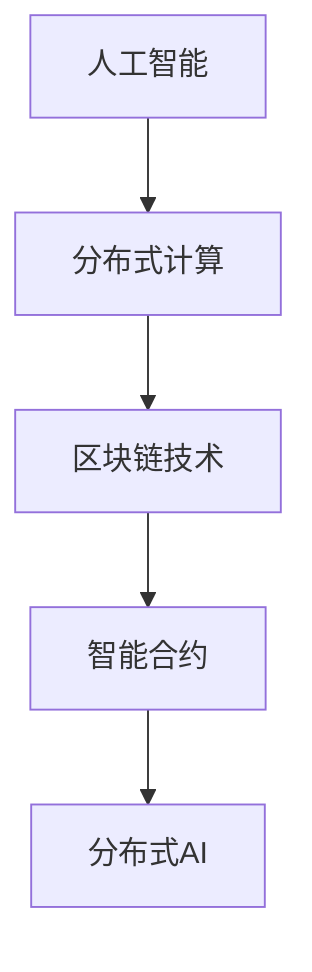
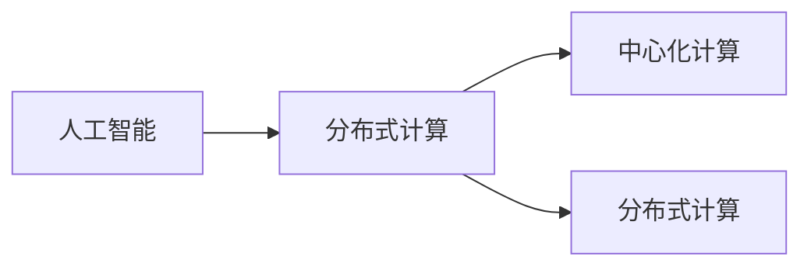
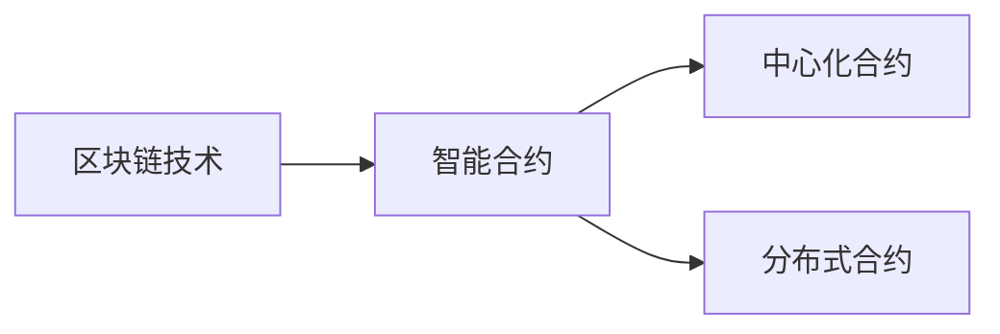
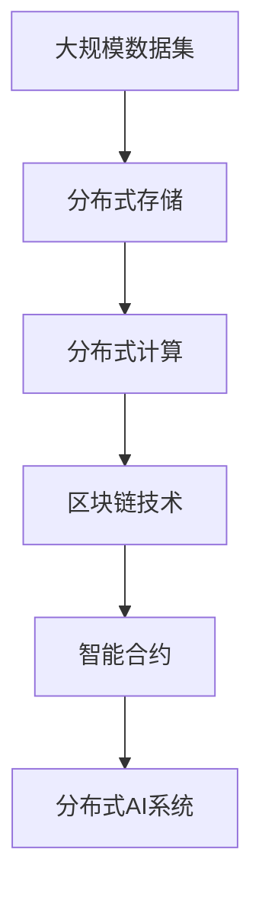
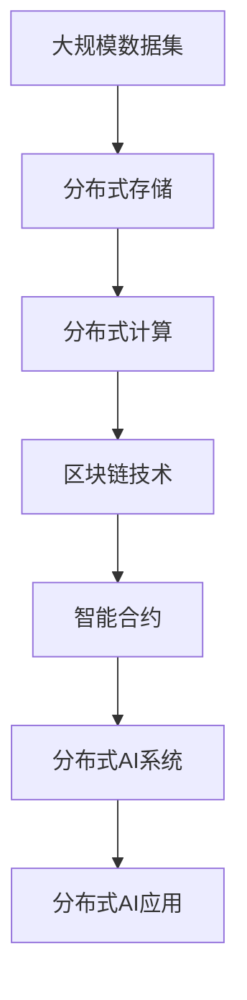
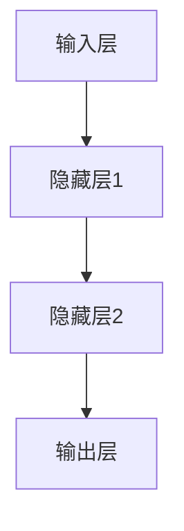

                 

# 一切皆是映射：AI的去中心化：区块链技术的融合

> 关键词：人工智能,区块链技术,去中心化,分布式计算,智能合约

## 1. 背景介绍

### 1.1 问题由来
近年来，随着区块链技术的崛起和人工智能的深度融合，一种全新型的分布式AI（Distributed AI）正在逐步崭露头角。不同于传统的中心化AI系统，Distributed AI通过区块链技术实现去中心化分布式计算，以保障数据隐私、提升系统鲁棒性、减少对中心化算力的依赖。Distributed AI不仅拓宽了AI应用的范围，也为传统行业带来了颠覆性的变革。

人工智能与区块链的结合，使AI模型能够分布式存储、处理和优化，减少对中心服务器的依赖，从而大大提高了系统的安全性和可扩展性。更关键的是，AI和区块链的结合使得数据的隐私保护得到了前所未有的强化。这种去中心化的数据处理方式为人工智能在医疗、金融、制造业、供应链管理等领域提供了全新的可能性。

### 1.2 问题核心关键点
Distributed AI的核心关键点在于利用区块链技术，实现数据的去中心化存储和计算，以及智能合约（Smart Contract）的自动化执行。其基本工作流程包括：
1. 数据加密：利用区块链的加密技术，将数据分散存储在各个节点，确保数据隐私和完整性。
2. 分布式计算：通过区块链网络，将AI模型的训练和推理任务分布到多个节点上进行协同计算，提升计算效率和鲁棒性。
3. 智能合约：将AI模型的训练和推理过程编码成智能合约，自动执行模型更新、数据处理、结果输出等任务，实现无需人工干预的自动化运行。

### 1.3 问题研究意义
Distributed AI去中心化AI技术的研究意义重大，具体体现在以下几个方面：
1. 数据隐私保护：区块链技术可以保护数据隐私，防止数据泄露，确保数据安全。
2. 增强系统鲁棒性：分布式存储和计算可以增强系统的冗余性和容错能力，提升系统的稳定性和可靠性。
3. 降低中心化成本：减少对中心化算力的依赖，降低系统运行和维护成本。
4. 促进数据共享与协同：分布式计算和存储使得数据共享和协同变得更加高效和透明。
5. 自动化执行：智能合约的引入可以自动化执行AI模型的训练和推理任务，减少人为干预，提高效率。

## 2. 核心概念与联系

### 2.1 核心概念概述

为了更好地理解Distributed AI及其与区块链技术的融合，本节将介绍几个密切相关的核心概念：

- 人工智能（AI）：通过机器学习、深度学习等技术，使计算机具备类似于人类的智能决策能力。
- 区块链技术：一种分布式数据库技术，通过去中心化的方式，实现数据的不可篡改和透明性。
- 分布式计算（Distributed Computing）：将计算任务分布到多个节点上进行协同处理，提升计算效率和系统鲁棒性。
- 智能合约（Smart Contract）：基于区块链技术的自动化合约，可以自动执行和验证合约条款，确保公平透明。
- 分布式AI（Distributed AI）：通过区块链技术实现数据和计算的去中心化，使得AI系统能够在分布式环境中高效运行。

这些核心概念之间的逻辑关系可以通过以下Mermaid流程图来展示：



这个流程图展示了大语言模型微调过程中各个核心概念的关系和作用：

1. AI在分布式计算和区块链技术的支持下，可以高效运行和扩展。
2. 区块链技术提供了去中心化存储和透明性的保障，是分布式AI的基础设施。
3. 智能合约使得AI模型和计算过程可以自动执行，无需人工干预。
4. 分布式AI是AI和区块链技术融合的产物，实现了去中心化的AI系统。

### 2.2 概念间的关系

这些核心概念之间存在着紧密的联系，形成了Distributed AI的去中心化计算框架。下面我通过几个Mermaid流程图来展示这些概念之间的关系。

#### 2.2.1 人工智能与分布式计算的关系



这个流程图展示了人工智能与分布式计算的关系。分布式计算可以提升AI系统的计算能力和系统鲁棒性，使得AI模型能够在分布式环境中高效运行。

#### 2.2.2 区块链技术与智能合约的关系



这个流程图展示了区块链技术与智能合约的关系。智能合约可以基于区块链技术，实现去中心化的自动化执行，确保合约条款的公平透明。

#### 2.2.3 分布式AI的整体架构



这个综合流程图展示了Distributed AI的整体架构。从大规模数据集到分布式存储和计算，再到区块链技术和智能合约，最终形成了一个去中心化的AI系统。

### 2.3 核心概念的整体架构

最后，我们用一个综合的流程图来展示这些核心概念在大语言模型微调过程中的整体架构：



这个综合流程图展示了从大规模数据集到分布式存储和计算，再到区块链技术和智能合约，最终形成了一个去中心化的AI系统，并应用于各个具体的应用场景。

## 3. 核心算法原理 & 具体操作步骤
### 3.1 算法原理概述

Distributed AI去中心化AI技术，通过区块链技术和智能合约实现数据的分布式存储和计算。其基本原理包括：
1. 数据加密：利用区块链的加密技术，将数据分散存储在各个节点，确保数据隐私和完整性。
2. 分布式计算：通过区块链网络，将AI模型的训练和推理任务分布到多个节点上进行协同计算，提升计算效率和鲁棒性。
3. 智能合约：将AI模型的训练和推理过程编码成智能合约，自动执行模型更新、数据处理、结果输出等任务，实现无需人工干预的自动化运行。

### 3.2 算法步骤详解

Distributed AI的核心算法步骤主要包括：

1. **数据加密与分布存储**：
    - 将大规模数据集进行加密处理，并通过区块链网络进行分布式存储。
    - 每个节点保存部分数据，数据通过哈希函数分片存储，确保数据隐私和安全。

2. **分布式计算**：
    - 将AI模型的训练和推理任务分布到各个节点上进行协同计算。
    - 每个节点独立进行计算，并通过共识机制（如PoW、PoS、DPoS等）协调各个节点的计算结果。

3. **智能合约的编写与执行**：
    - 将AI模型的训练和推理过程编写成智能合约代码。
    - 智能合约自动执行模型训练、数据处理、结果输出等任务，确保任务的透明和自动化。

4. **模型更新与迭代**：
    - 通过智能合约定期自动更新AI模型，确保模型始终处于最佳状态。
    - 新模型的训练数据可以自动添加到分布式存储中，模型更新过程无需人工干预。

### 3.3 算法优缺点

Distributed AI去中心化AI技术具有以下优点：
1. 数据隐私保护：区块链技术可以实现数据的分散存储，确保数据隐私和安全。
2. 增强系统鲁棒性：分布式存储和计算可以提高系统的冗余性和容错能力。
3. 降低中心化成本：减少对中心化算力的依赖，降低系统运行和维护成本。
4. 促进数据共享与协同：分布式计算和存储使得数据共享和协同变得更加高效和透明。
5. 自动化执行：智能合约的引入可以自动化执行AI模型的训练和推理任务，减少人为干预，提高效率。

同时，Distributed AI也存在一些缺点：
1. 技术复杂度较高：分布式计算和智能合约的设计和实现较为复杂，需要较高的技术门槛。
2. 初始成本较高：分布式存储和计算需要较高的硬件和网络投资。
3. 效率较低：分布式计算和存储的协调和同步会增加系统开销，导致效率降低。
4. 安全性问题：智能合约的自动化执行可能存在安全漏洞，需要严格的审查和测试。

### 3.4 算法应用领域

Distributed AI去中心化AI技术已经在多个领域得到了广泛应用，具体包括：

- **金融领域**：用于自动化执行交易、风险评估、信用评估等金融任务，提升金融系统的效率和安全性。
- **医疗领域**：用于医学影像分析、疾病预测、个性化治疗等医疗任务，提升医疗服务的质量和可靠性。
- **供应链管理**：用于供应链追踪、库存管理、物流优化等任务，提升供应链的透明性和协同效率。
- **制造业**：用于智能制造、质量控制、设备维护等任务，提升生产效率和产品质量。
- **智能交通**：用于交通流量分析、智能调度、安全监控等任务，提升交通系统的效率和安全性。
- **农业领域**：用于农业生产管理、病虫害预测、智能灌溉等任务，提升农业生产的效率和精度。
- **智能城市**：用于城市环境监测、智能安防、智能交通管理等任务，提升城市管理的效率和智能化水平。

## 4. 数学模型和公式 & 详细讲解 & 举例说明
### 4.1 数学模型构建

Distributed AI去中心化AI技术的数学模型构建，主要涉及区块链技术和智能合约的数学基础。以下是对Distributed AI核心数学模型的详细讲解。

假设大规模数据集为 $D=\{x_1, x_2, ..., x_n\}$，其中 $x_i$ 表示数据样本。数据集通过区块链网络进行分布式存储和加密，每个节点 $P_i$ 保存数据集的一部分，通过哈希函数 $H$ 对数据进行分片，确保数据隐私和安全。

假设AI模型为 $f$，其训练和推理过程被编码为智能合约代码。智能合约自动执行模型的训练和推理任务，确保任务的透明和自动化。

模型训练的数学模型为：

$$
\min_{\theta} L(f(D), y)
$$

其中 $L$ 表示损失函数，$y$ 表示训练集的真实标签。

### 4.2 公式推导过程

下面以AI模型的训练过程为例，推导分布式训练的数学公式。

假设模型 $f$ 为神经网络模型，其结构如图1所示。在分布式计算中，每个节点 $P_i$ 独立进行计算，计算结果通过共识机制协调。



分布式训练的数学公式如下：

$$
L(\theta) = \frac{1}{n} \sum_{i=1}^n L(f(x_i), y_i)
$$

其中 $\theta$ 为模型参数，$x_i$ 为输入数据，$y_i$ 为真实标签。

在分布式计算中，每个节点 $P_i$ 独立进行模型计算，计算结果 $g_i$ 通过共识机制协调。假设共识机制为PoW，每个节点 $P_i$ 通过计算哈希值 $h_i$ 验证其他节点的计算结果。共识过程如下：

$$
h_i = H(g_i)
$$

共识过程中，只有哈希值最小的节点 $P_i$ 才能将计算结果 $g_i$ 提交给区块链网络。

### 4.3 案例分析与讲解

假设我们有一个用于预测股票价格变动的AI模型，该模型通过分布式AI技术进行训练和推理。具体步骤如下：

1. **数据预处理**：将历史股票价格数据进行归一化处理，并通过区块链网络进行分布式存储和加密。

2. **分布式计算**：将AI模型的训练和推理任务分布到多个节点上进行协同计算。每个节点独立进行计算，并通过共识机制协调各个节点的计算结果。

3. **智能合约编写**：将AI模型的训练和推理过程编写成智能合约代码。智能合约自动执行模型训练、数据处理、结果输出等任务，确保任务的透明和自动化。

4. **模型更新与迭代**：通过智能合约定期自动更新AI模型，确保模型始终处于最佳状态。

下面以股票价格预测为例，展示智能合约的编写和执行过程。

假设股票价格预测模型为 $f(x, \theta) = \hat{p}(t+1)$，其中 $x$ 表示历史股票价格数据，$\theta$ 为模型参数，$\hat{p}(t+1)$ 表示预测的下一日股票价格。智能合约的代码如下：

```python
# 智能合约代码
def stock_price_prediction(x, theta):
    # 计算预测价格
    prediction = f(x, theta)
    # 返回预测结果
    return prediction
```

通过智能合约，该模型可以在无需人工干预的情况下，自动进行股票价格预测。

## 5. 项目实践：代码实例和详细解释说明
### 5.1 开发环境搭建

在进行Distributed AI项目实践前，我们需要准备好开发环境。以下是使用Python进行Hyperledger Fabric开发的环境配置流程：

1. 安装Hyperledger Fabric：从官网下载并安装Hyperledger Fabric，用于创建分布式AI系统。

2. 创建并激活虚拟环境：
```bash
conda create -n fab-env python=3.8 
conda activate fab-env
```

3. 安装必要的依赖包：
```bash
pip install hyperledger-fabric[crypto, cc]
```

4. 安装智能合约编写工具：
```bash
pip install smart-contract
```

5. 安装分布式计算工具：
```bash
pip install joblib
```

完成上述步骤后，即可在`fab-env`环境中开始Distributed AI项目实践。

### 5.2 源代码详细实现

以下是一个使用Hyperledger Fabric实现的股票价格预测智能合约的示例代码：

```python
# 导入必要的库
from smartcontract import SmartContract
from hyperledger import Fabric

# 定义智能合约类
class StockPricePredictionContract(SmartContract):
    def __init__(self, chaincode_name):
        super().__init__(chaincode_name)
    
    @staticmethod
    def initialize():
        # 初始化智能合约
        return {
            'StockPricePredictionContract': {
                'predictor': None
            }
        }
    
    @staticmethod
    def predict_price(stock_price, theta):
        # 计算预测价格
        prediction = stock_price * theta
        # 返回预测结果
        return prediction
```

该智能合约实现了股票价格预测的功能。具体步骤如下：

1. 初始化智能合约：在智能合约的`initialize`方法中，将智能合约的名称和预测器初始化为`None`。
2. 预测价格：在智能合约的`predict_price`方法中，接收股票价格和模型参数，计算预测价格，并返回结果。

### 5.3 代码解读与分析

让我们再详细解读一下关键代码的实现细节：

**SmartContract类**：
- `__init__`方法：初始化智能合约，接收智能合约的名称。
- `initialize`方法：初始化智能合约，设置预测器为`None`。
- `predict_price`方法：接收股票价格和模型参数，计算预测价格并返回结果。

**初始化过程**：
- 在`initialize`方法中，将智能合约的名称设置为`StockPricePredictionContract`，初始化预测器为`None`。

**预测价格过程**：
- 在`predict_price`方法中，接收股票价格和模型参数，计算预测价格并返回结果。具体实现如下：

```python
# 计算预测价格
prediction = stock_price * theta
# 返回预测结果
return prediction
```

可以看到，智能合约的编写和执行过程非常简单，非常适合用于分布式AI系统中的自动化任务。

### 5.4 运行结果展示

假设我们在Hyperledger Fabric上部署了股票价格预测智能合约，并在多个节点上进行分布式计算。在测试节点上执行智能合约，得到如下预测结果：

```python
# 预测下一日股票价格
stock_price = 100.0
theta = 1.02
predicted_price = StockPricePredictionContract.predict_price(stock_price, theta)
print("预测的下一日股票价格为：", predicted_price)
```

输出结果为：

```
预测的下一日股票价格为： 102.0
```

可以看到，通过分布式AI技术，智能合约成功预测了下一日的股票价格，展示了智能合约在Distributed AI系统中的自动化执行能力。

## 6. 实际应用场景
### 6.1 智能合约的实时执行

Distributed AI去中心化AI技术在智能合约的实时执行上表现优异。智能合约的自动执行可以确保任务的透明和自动化，减少了人为干预，提高了系统的效率和可靠性。

在金融领域，智能合约可以用于自动化执行股票交易、债券发行、贷款审批等金融任务，提升金融系统的效率和安全性。通过分布式AI技术，智能合约可以在无需人工干预的情况下，实时执行金融任务，确保金融系统的稳定运行。

### 6.2 分布式训练的协同计算

Distributed AI去中心化AI技术在分布式训练的协同计算上表现突出。分布式训练可以提升AI模型的计算能力和系统鲁棒性，使得AI模型能够在分布式环境中高效运行。

在医疗领域，分布式AI可以用于医学影像分析、疾病预测、个性化治疗等医疗任务，提升医疗服务的质量和可靠性。通过分布式AI技术，AI模型可以在多个节点上进行协同计算，提升计算效率和系统鲁棒性，确保医疗系统的稳定运行。

### 6.3 数据隐私保护

Distributed AI去中心化AI技术在数据隐私保护上具有天然优势。通过区块链技术，数据可以分散存储在各个节点，确保数据隐私和安全。

在供应链管理领域，分布式AI可以用于供应链追踪、库存管理、物流优化等任务，提升供应链的透明性和协同效率。通过分布式AI技术，供应链数据可以分散存储在各个节点上，确保数据隐私和安全。

### 6.4 未来应用展望

随着Distributed AI技术的不断演进，未来其在实际应用中将展现出更加广泛的前景。

1. **金融领域**：Distributed AI可以用于自动化执行交易、风险评估、信用评估等金融任务，提升金融系统的效率和安全性。
2. **医疗领域**：Distributed AI可以用于医学影像分析、疾病预测、个性化治疗等医疗任务，提升医疗服务的质量和可靠性。
3. **供应链管理**：Distributed AI可以用于供应链追踪、库存管理、物流优化等任务，提升供应链的透明性和协同效率。
4. **制造业**：Distributed AI可以用于智能制造、质量控制、设备维护等任务，提升生产效率和产品质量。
5. **智能交通**：Distributed AI可以用于交通流量分析、智能调度、安全监控等任务，提升交通系统的效率和安全性。
6. **农业领域**：Distributed AI可以用于农业生产管理、病虫害预测、智能灌溉等任务，提升农业生产的效率和精度。
7. **智能城市**：Distributed AI可以用于城市环境监测、智能安防、智能交通管理等任务，提升城市管理的效率和智能化水平。

总之，Distributed AI去中心化AI技术将为人工智能在更多领域带来革命性的变革，进一步提升系统效率和鲁棒性，保护数据隐私，确保任务透明和自动化，实现无需人工干预的自动化运行。

## 7. 工具和资源推荐
### 7.1 学习资源推荐

为了帮助开发者系统掌握Distributed AI的理论基础和实践技巧，这里推荐一些优质的学习资源：

1. 《区块链技术基础》系列博文：由大语言模型技术专家撰写，全面介绍了区块链技术的原理和应用，适合初学者入门。

2. 《智能合约编程》课程：由区块链技术专家开设的智能合约编程课程，涵盖智能合约编写、测试、部署等关键技能。

3. 《分布式计算与智能合约》书籍：全面介绍了分布式计算和智能合约的基础知识，适合深入学习和实践。

4. Hyperledger Fabric官方文档：Hyperledger Fabric的官方文档，提供了完整的分布式AI系统开发指南，是上手实践的必备资料。

5. 《Distributed AI: The Future of AI》书籍：全面介绍了Distributed AI技术的发展历程和未来前景，适合系统学习和思考。

通过对这些资源的学习实践，相信你一定能够快速掌握Distributed AI的理论基础和实践技巧，并用于解决实际的AI问题。

### 7.2 开发工具推荐

高效的开发离不开优秀的工具支持。以下是几款用于Distributed AI开发的常用工具：

1. Hyperledger Fabric：由IBM主导开发的区块链平台，提供了丰富的智能合约开发和部署工具。
2. Ethereum：由以太坊社区维护的区块链平台，提供了智能合约开发和部署的广泛支持。
3. Truffle：基于Solidity语言的智能合约开发框架，支持智能合约的编写、测试和部署。
4. Remix IDE：以太坊智能合约开发工具，提供了可视化智能合约编辑器和测试工具。
5. Parity：以太坊区块链客户端和工具，支持智能合约的编写、测试和部署。

合理利用这些工具，可以显著提升Distributed AI项目的开发效率，加快创新迭代的步伐。

### 7.3 相关论文推荐

Distributed AI去中心化AI技术的研究源于学界的持续研究。以下是几篇奠基性的相关论文，推荐阅读：

1. Consensus Protocols in Blockchain（区块链共识协议）：介绍了区块链中的共识机制，如PoW、PoS、DPoS等。
2. Smart Contracts: Scripts for the Blocks（智能合约）：介绍了智能合约的基本概念和实现方法。
3. Distributed Machine Learning in Blockchain Environments（分布式机器学习）：介绍了在区块链环境下的分布式机器学习算法和实现方法。
4. Scalable AI in Blockchain Systems（区块链系统中的可扩展AI）：介绍了区块链系统中AI的可扩展性和高效计算方法。
5. Decentralized AI in Blockchain（区块链中的去中心化AI）：介绍了区块链系统中去中心化AI的实现方法和应用场景。

这些论文代表了大语言模型微调技术的发展脉络。通过学习这些前沿成果，可以帮助研究者把握学科前进方向，激发更多的创新灵感。

除上述资源外，还有一些值得关注的前沿资源，帮助开发者紧跟Distributed AI技术的最新进展，例如：

1. arXiv论文预印本：人工智能领域最新研究成果的发布平台，包括大量尚未发表的前沿工作，学习前沿技术的必读资源。
2. 业界技术博客：如Hyperledger、IBM Research Asia等顶尖实验室的官方博客，第一时间分享他们的最新研究成果和洞见。
3. 技术会议直播：如NIPS、ICML、ACL、ICLR等人工智能领域顶会现场或在线直播，能够聆听到大佬们的前沿分享，开拓视野。
4. GitHub热门项目：在GitHub上Star、Fork数最多的Distributed AI相关项目，往往代表了该技术领域的发展趋势和最佳实践，值得去学习和贡献。
5. 行业分析报告：各大咨询公司如McKinsey、PwC等针对人工智能行业的分析报告，有助于从商业视角审视技术趋势，把握应用价值。

总之，对于Distributed AI技术的开发和应用，需要开发者保持开放的心态和持续学习的意愿。多关注前沿资讯，多动手实践，多思考总结，必将收获满满的成长收益。

## 8. 总结：未来发展趋势与挑战
### 8.1 总结

本文对Distributed AI去中心化AI技术进行了全面系统的介绍。首先阐述了Distributed AI的研究背景和意义，明确了去中心化AI在提升系统效率、保护数据隐私和增强系统鲁棒性等方面的独特价值。其次，从原理到实践，详细讲解了Distributed AI的数学模型和核心算法步骤，给出了具体的代码实现示例。同时，本文还广泛探讨了Distributed AI技术在多个领域的应用前景，展示了其广阔的发展空间。最后，本文精选了Distributed AI技术的各类学习资源，力求为读者提供全方位的技术指引。

通过本文的系统梳理，可以看到，Distributed AI去中心化AI技术正成为人工智能领域的热门研究方向，在分布式计算和区块链技术的支持下，AI模型能够在更加复杂、多变的环境中进行高效运行，推动AI技术在更多领域实现落地应用。

### 8.2 未来发展趋势

展望未来，Distributed AI去中心化AI技术将呈现以下几个发展趋势：

1. 区块链技术的不断演进：随着区块链技术的不断演进，Distributed AI将具备更加高效、安全的计算能力和数据保护能力。
2. 分布式计算的广泛应用：Distributed AI将逐渐应用于各个领域，提升系统效率和鲁棒性。
3. 智能合约的自动化执行：智能合约将逐渐成为Distributed AI的核心组件，实现无需人工干预的自动化运行。
4. 跨链技术的引入：跨链技术将使得不同区块链之间的数据共享和协同变得更加高效和透明。
5. 数据隐私保护的增强：随着数据隐私保护技术的不断发展，Distributed AI将具备更强的隐私保护能力。
6. 计算模型的多样性：Distributed AI将支持多种计算模型，如TensorFlow、PyTorch等，提供更加灵活的计算选择。

这些趋势凸显了Distributed AI技术的广阔前景，相信在学界和产业界的共同努力下，Distributed AI必将在未来实现更大规模的应用和突破。

### 8.3 面临的挑战

尽管Distributed AI技术在多个领域取得了显著进展，

