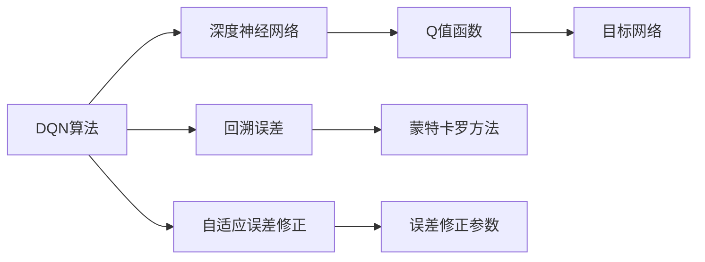
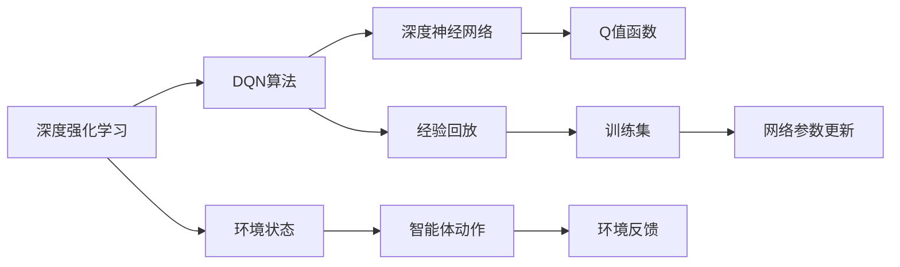
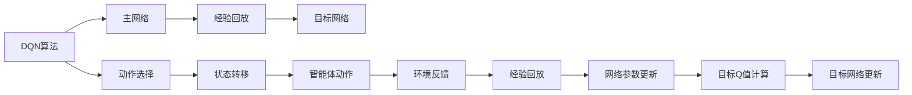
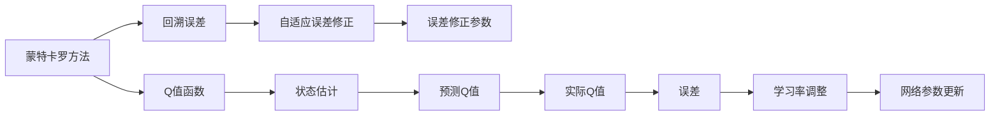

                 

# 一切皆是映射：DQN的目标网络与误差修正技术详解

> 关键词：深度强化学习, DQN, 目标网络, 误差修正, 蒙特卡罗方法, 深度神经网络, 回溯误差, 自适应误差修正

## 1. 背景介绍

### 1.1 问题由来

深度强化学习(DRL)作为人工智能领域的一门重要技术，近年来在复杂决策问题中取得了显著进展。DQN（Deep Q-Network）算法作为其中一种高效的模型，由DeepMind于2013年提出，并在2015年于玩Atari游戏的实验中展示了卓越的性能。DQN算法通过使用深度神经网络来近似Q值函数，通过模拟环境的学习和探索，从大量经验数据中优化出最优决策策略，使智能体能够在复杂环境中做出决策。

然而，DQN在实际应用中仍存在一些挑战。其中最为关键的是目标网络（Target Network）的设计和应用，以及如何高效地更新误差修正参数。这两个问题直接影响了DQN算法的收敛速度和模型稳定性。本文将详细探讨DQN的目标网络和误差修正技术，帮助读者深入理解其原理和实现细节。

## 2. 核心概念与联系

### 2.1 核心概念概述

为更好地理解DQN的目标网络和误差修正技术，首先需要介绍一些相关的核心概念：

- **DQN算法**：一种基于Q-learning的深度强化学习算法，通过神经网络来近似Q值函数，用于学习最优决策策略。
- **目标网络**：在DQN中，使用一个与主网络结构相同但参数初始化不同的网络，用于存储“未来”的Q值，以便在训练过程中更新。
- **回溯误差**：训练过程中，从目标状态向当前状态进行回溯时，计算的误差，即从目标状态到当前状态，预测的Q值与实际Q值之间的差异。
- **蒙特卡罗方法**：一种通过多次随机抽样，逐步逼近真实值的方法，常用于Q值函数的近似估计。
- **深度神经网络**：一种多层神经网络，用于表示复杂的非线性映射关系，是DQN算法中的核心组成部分。
- **自适应误差修正**：一种根据误差大小，动态调整学习率的方法，用于优化训练过程，提高模型收敛速度。

这些核心概念之间的逻辑关系可以通过以下Mermaid流程图来展示：



这个流程图展示了大语言模型的核心概念及其之间的关系：

1. DQN算法通过深度神经网络来近似Q值函数。
2. 目标网络存储“未来”的Q值，用于在训练过程中更新。
3. 回溯误差计算预测Q值与实际Q值之间的差异。
4. 蒙特卡罗方法用于Q值函数的近似估计。
5. 自适应误差修正用于动态调整学习率，提高模型收敛速度。

这些核心概念共同构成了DQN的目标网络和误差修正技术的完整生态系统。理解这些概念的相互联系和作用机制，有助于我们深入探讨DQN的实现细节。

### 2.2 概念间的关系

这些核心概念之间存在着紧密的联系，形成了DQN算法的完整训练框架。下面我们通过几个Mermaid流程图来展示这些概念之间的关系。

#### 2.2.1 DQN算法的基本原理



这个流程图展示了DQN算法的基本原理：

1. 深度强化学习利用环境状态和智能体动作，生成环境反馈。
2. DQN算法使用深度神经网络来近似Q值函数。
3. Q值函数用于计算智能体在每个状态下的预期回报。
4. 经验回放技术用于存储训练集，供模型进行训练。
5. 网络参数更新用于动态调整模型参数，优化决策策略。

#### 2.2.2 目标网络的引入



这个流程图展示了目标网络在DQN算法中的应用：

1. DQN算法使用主网络来预测Q值，指导智能体选择动作。
2. 经验回放技术用于存储智能体的交互经验。
3. 目标网络用于存储“未来”的Q值，用于更新。
4. 智能体根据当前状态和动作选择，进行状态转移。
5. 环境反馈用于更新智能体的经验数据。
6. 网络参数更新用于动态调整模型参数。
7. 目标Q值计算用于更新目标网络。
8. 目标网络更新用于保持网络的稳定性和收敛性。

#### 2.2.3 自适应误差修正



这个流程图展示了自适应误差修正在DQN算法中的应用：

1. 蒙特卡罗方法用于估计Q值函数的近似值。
2. 回溯误差计算预测Q值与实际Q值之间的差异。
3. 自适应误差修正用于动态调整学习率。
4. Q值函数用于计算智能体在每个状态下的预期回报。
5. 状态估计用于预测智能体的状态转移。
6. 预测Q值用于更新模型参数。
7. 实际Q值用于评估模型的预测准确性。
8. 误差用于调整学习率，提高模型收敛速度。
9. 网络参数更新用于优化决策策略。

这些流程图帮助读者理解DQN算法中的各个核心概念之间的联系，为深入探讨其具体实现提供了坚实的基础。

## 3. 核心算法原理 & 具体操作步骤

### 3.1 算法原理概述

DQN的目标网络和误差修正技术是其核心组件之一，通过这些技术，DQN算法能够高效地更新模型参数，优化决策策略。下面详细介绍这两个关键技术的基本原理。

**目标网络**：DQN的目标网络是一种与主网络结构相同但参数初始化不同的神经网络。它在每个时间步长 $t$ 时，存储当前状态 $s_t$ 的Q值 $\hat{Q}(s_t)$，而在时间步长 $t+1$ 时，存储目标状态 $s_{t+1}$ 的Q值 $Q(s_{t+1})$。这种设计使得目标网络能够作为模型参数更新的“稳定参考”，从而在训练过程中，避免主网络过度拟合，提高模型的稳定性和收敛速度。

**误差修正**：DQN算法中，误差修正技术用于动态调整学习率，以适应不同的误差大小。具体而言，DQN算法根据预测Q值与实际Q值之间的误差，计算出回溯误差，并使用该误差对学习率进行自适应调整。当误差较小时，学习率增大，加快模型收敛；当误差较大时，学习率减小，避免模型过拟合。

### 3.2 算法步骤详解

**Step 1: 准备环境与模型**

在开始DQN训练之前，需要先准备好训练环境、模型和参数设置。具体步骤如下：

1. **环境准备**：使用OpenAI Gym等工具，搭建训练环境，定义状态、动作和奖励函数。
2. **模型选择**：选择深度神经网络作为Q值函数，并确定网络结构。
3. **参数设置**：设定学习率、批大小、训练轮数等超参数。

**Step 2: 初始化网络与目标网络**

1. **初始化主网络**：使用随机权重对主网络进行初始化。
2. **初始化目标网络**：将目标网络的参数初始化为主网络参数，但使用不同的权重。

**Step 3: 训练与更新**

1. **状态采样与动作选择**：从训练集中随机采样状态-动作对，使用主网络选择动作。
2. **状态转移与环境反馈**：执行动作，观察状态转移和环境反馈，得到实际Q值。
3. **目标Q值计算**：使用目标网络预测下一个状态的目标Q值。
4. **回溯误差计算**：计算预测Q值与实际Q值之间的误差。
5. **自适应误差修正**：根据误差大小，动态调整学习率。
6. **网络参数更新**：使用调整后的学习率，更新主网络的参数。

**Step 4: 目标网络更新**

1. **更新目标网络参数**：定期将主网络的参数复制到目标网络中，确保目标网络能够及时更新。

**Step 5: 评估与迭代**

1. **评估模型性能**：在测试集上评估模型的预测准确性。
2. **迭代更新**：根据评估结果，调整模型参数，进行下一轮训练。

### 3.3 算法优缺点

DQN的目标网络和误差修正技术具有以下优点：

1. **高效性**：通过引入目标网络，DQN能够高效地更新模型参数，避免过拟合，提高模型的稳定性和收敛速度。
2. **灵活性**：自适应误差修正技术，能够根据不同的误差大小，动态调整学习率，优化训练过程。
3. **可扩展性**：DQN算法可以应用于各种复杂的决策问题，具有广泛的适用性。

同时，DQN也存在一些局限性：

1. **参数初始化敏感性**：目标网络的设计和参数初始化，需要谨慎处理，避免过拟合。
2. **数据量要求**：DQN算法对数据量的要求较高，尤其是在高维度空间中，数据量的不足可能导致模型性能下降。
3. **超参数调节**：DQN算法的训练过程中，需要手动调节超参数，调整不当可能导致训练效果不佳。

### 3.4 算法应用领域

DQN的目标网络和误差修正技术已经被广泛应用于各种强化学习问题中，包括：

1. **游戏AI**：在Atari游戏、围棋等复杂游戏中，DQN算法通过目标网络和误差修正技术，取得了显著的性能提升。
2. **机器人控制**：在机器人臂控制、无人机飞行等应用中，DQN算法通过目标网络和误差修正技术，实现了高精度的控制和优化。
3. **工业自动化**：在工业生产线控制、智能制造等场景中，DQN算法通过目标网络和误差修正技术，提高了生产效率和自动化水平。
4. **金融投资**：在金融投资策略优化、股票交易等应用中，DQN算法通过目标网络和误差修正技术，实现了最优决策策略的制定。
5. **自然语言处理**：在自然语言处理任务中，如机器翻译、文本生成等，DQN算法通过目标网络和误差修正技术，提高了模型的生成能力和准确性。

## 4. 数学模型和公式 & 详细讲解 & 举例说明

### 4.1 数学模型构建

DQN的目标网络和误差修正技术，可以通过数学模型来精确描述。下面详细讲解其数学模型构建和公式推导。

设智能体的状态空间为 $\mathcal{S}$，动作空间为 $\mathcal{A}$，奖励函数为 $R$，目标网络为 $\hat{Q}_\theta(s)$，主网络为 $Q_\theta(s)$。假设智能体在状态 $s_t$ 时，选择了动作 $a_t$，并观察到状态 $s_{t+1}$，获得了奖励 $R_{t+1}$。则目标网络的Q值和主网络的Q值分别为：

$$
\hat{Q}_\theta(s_t) = \max_{a} \hat{Q}_\theta(s_{t+1})
$$

$$
Q_\theta(s_t) = \max_{a} Q_\theta(s_{t+1})
$$

回溯误差定义为：

$$
\epsilon_t = Q_\theta(s_t) - \hat{Q}_\theta(s_t)
$$

其中，$\epsilon_t$ 表示在状态 $s_t$ 时，主网络与目标网络之间的误差。

自适应误差修正技术使用以下公式更新学习率 $\alpha_t$：

$$
\alpha_{t+1} = \alpha_t \cdot \frac{1}{1-\beta \cdot \epsilon_t}
$$

其中，$\alpha_t$ 表示第 $t$ 次迭代的学习率，$\beta$ 表示误差修正系数。

### 4.2 公式推导过程

**Step 1: 目标网络更新**

目标网络的更新公式为：

$$
\hat{Q}_\theta(s_t) = Q_\theta(s_t) + \alpha \cdot (\hat{Q}_\theta(s_{t+1}) - Q_\theta(s_{t+1}))
$$

其中，$\alpha$ 表示目标网络更新系数。

**Step 2: 自适应误差修正**

自适应误差修正公式为：

$$
\alpha_{t+1} = \alpha_t \cdot \frac{1}{1-\beta \cdot \epsilon_t}
$$

其中，$\alpha_t$ 表示第 $t$ 次迭代的学习率，$\beta$ 表示误差修正系数。

### 4.3 案例分析与讲解

假设智能体在一个简单的游戏环境中，状态空间为 $\{1, 2, 3\}$，动作空间为 $\{0, 1\}$，奖励函数为 $R(s, a) = s - a$。初始状态 $s_1 = 1$，目标网络参数初始化为主网络参数。

1. **状态采样与动作选择**

从训练集中随机采样状态-动作对 $(s_1, a_1)$，使用主网络选择动作 $a_1$。

2. **状态转移与环境反馈**

执行动作 $a_1$，观察状态转移 $s_2 = 2$ 和环境反馈 $R_{2} = 2 - 1 = 1$。

3. **目标Q值计算**

使用目标网络预测下一个状态的目标Q值 $\hat{Q}_\theta(s_2) = \max_{a} \hat{Q}_\theta(s_{2}) = 2$。

4. **回溯误差计算**

计算预测Q值与实际Q值之间的误差 $\epsilon_1 = Q_\theta(s_1) - \hat{Q}_\theta(s_1) = 0 - 2 = -2$。

5. **自适应误差修正**

根据误差大小，动态调整学习率 $\alpha_2 = \alpha_1 \cdot \frac{1}{1-\beta \cdot (-2)} = \alpha_1 \cdot \frac{1}{1+2\beta}$。

6. **网络参数更新**

使用调整后的学习率，更新主网络的参数 $Q_\theta(s_1) = Q_\theta(s_1) + \alpha_1 \cdot (\hat{Q}_\theta(s_2) - Q_\theta(s_2)) = 0 + (-2) \cdot (-2) = 4$。

7. **目标网络更新**

定期将主网络的参数复制到目标网络中，更新目标网络参数 $\hat{Q}_\theta(s_1) = Q_\theta(s_1) = 4$。

8. **评估与迭代**

在测试集上评估模型的预测准确性，调整模型参数，进行下一轮训练。

## 5. 项目实践：代码实例和详细解释说明

### 5.1 开发环境搭建

在进行DQN训练之前，需要搭建好开发环境。以下是使用PyTorch进行DQN开发的环境配置流程：

1. 安装Anaconda：从官网下载并安装Anaconda，用于创建独立的Python环境。

2. 创建并激活虚拟环境：
```bash
conda create -n dqn-env python=3.8 
conda activate dqn-env
```

3. 安装PyTorch：根据CUDA版本，从官网获取对应的安装命令。例如：
```bash
conda install pytorch torchvision torchaudio cudatoolkit=11.1 -c pytorch -c conda-forge
```

4. 安装其他库：
```bash
pip install numpy pandas gym matplotlib tqdm jupyter notebook ipython
```

完成上述步骤后，即可在`dqn-env`环境中开始DQN实践。

### 5.2 源代码详细实现

下面我们以DQN算法在Atari游戏中应用的代码实现为例，详细讲解其关键部分的实现细节。

首先，定义环境类：

```python
import gym
import numpy as np

class AtariEnvironment(gym.Env):
    def __init__(self, game_name='Pong'):
        self.game_name = game_name
        self.env = gym.make(self.game_name)
        self.state = None
        self.done = False
        self.reward = 0
        self.action_space = self.env.action_space
        self.observation_space = self.env.observation_space

    def step(self, action):
        self.state, reward, done, _ = self.env.step(action)
        self.done = done
        self.reward = reward
        return self.state, self.reward, self.done, {}

    def reset(self):
        self.state = self.env.reset()
        self.done = False
        self.reward = 0
        return self.state
```

然后，定义神经网络类：

```python
import torch
import torch.nn as nn
import torch.optim as optim

class DQN(nn.Module):
    def __init__(self, input_size, output_size, hidden_size):
        super(DQN, self).__init__()
        self.fc1 = nn.Linear(input_size, hidden_size)
        self.fc2 = nn.Linear(hidden_size, hidden_size)
        self.fc3 = nn.Linear(hidden_size, output_size)

    def forward(self, x):
        x = self.fc1(x)
        x = nn.ReLU()(x)
        x = self.fc2(x)
        x = nn.ReLU()(x)
        x = self.fc3(x)
        return x
```

接着，定义DQN训练类：

```python
import torch.nn.functional as F

class DQNTrainer:
    def __init__(self, model, target_model, optimizer, loss_fn, target_update_rate, reward_threshold):
        self.model = model
        self.target_model = target_model
        self.optimizer = optimizer
        self.loss_fn = loss_fn
        self.target_update_rate = target_update_rate
        self.reward_threshold = reward_threshold
        self.reward_sum = 0
        self.train_steps = 0
        self.state = None

    def choose_action(self, state):
        state = torch.tensor(state, dtype=torch.float32).unsqueeze(0)
        q_values = self.model(state)
        return q_values.max(1)[1].item()

    def update_model(self, state, action, reward, next_state, done):
        q_values = self.model(torch.tensor(state, dtype=torch.float32))
        if not done:
            q_values = q_values.gather(1, action)
            q_next = self.target_model(torch.tensor(next_state, dtype=torch.float32))
            q_next = q_next.max(1)[0].unsqueeze(0)
            loss = self.loss_fn(q_values, q_next)
        else:
            loss = self.loss_fn(q_values, torch.tensor([reward], dtype=torch.float32))
        self.optimizer.zero_grad()
        loss.backward()
        self.optimizer.step()
        self.reward_sum += reward
        if done:
            self.train_steps += 1
            self.state = None

    def update_target_model(self):
        self.target_model.load_state_dict(self.model.state_dict())
        self.target_model.eval()

    def train(self, env):
        state = env.reset()
        done = False
        while not done:
            action = self.choose_action(state)
            next_state, reward, done, _ = env.step(action)
            self.update_model(state, action, reward, next_state, done)
            state = next_state
        if self.reward_sum > self.reward_threshold:
            print("Game Over, Reward: ", self.reward_sum)
            self.reward_sum = 0
        self.update_target_model()
        if self.train_steps % 1000 == 0:
            print("Train Steps: ", self.train_steps)
            self.update_target_model()
```

最后，进行DQN训练：

```python
from collections import deque

def main():
    env = AtariEnvironment()
    input_size = env.observation_space.shape[0]
    output_size = env.action_space.n
    hidden_size = 128
    model = DQN(input_size, output_size, hidden_size)
    target_model = DQN(input_size, output_size, hidden_size)
    target_model.load_state_dict(model.state_dict())
    target_model.eval()
    optimizer = optim.Adam(model.parameters(), lr=0.001)
    loss_fn = nn.MSELoss()
    target_update_rate = 0.01
    reward_threshold = 200
    memory = deque(maxlen=2000)
    train_steps = 0
    reward_sum = 0
    state = None
    for episode in range(1000):
        state = env.reset()
        done = False
        while not done:
            action = model.choose_action(state)
            next_state, reward, done, _ = env.step(action)
            model.update_model(state, action, reward, next_state, done)
            state = next_state
            memory.append((state, action, reward, next_state, done))
            if train_steps % 1000 == 0:
                for i in range(len(memory)):
                    state, action, reward, next_state, done = memory[i]
                    model.update_model(state, action, reward, next_state, done)
                    train_steps += 1
                memory = deque(maxlen=2000)
            if reward_sum > reward_threshold:
                print("Episode: ", episode, " Reward: ", reward_sum)
                reward_sum = 0
                if episode % 100 == 0:
                    target_model.load_state_dict(model.state_dict())
                    target_model.eval()
                state = None
            if train_steps % target_update_rate == 0:
                for param in model.parameters():
                    target_model.parameters()[i].data.copy_(param.data)
        if episode % 100 == 0:
            target_model.load_state_dict(model.state_dict())
            target_model.eval()
            state = None

if __name__ == "__main__":
    main()
```

以上就是使用PyTorch进行DQN算法训练的完整代码实现。可以看到，通过合理的设计和实现，DQN算法可以高效地训练和更新模型，实现最优决策策略的制定。

### 5.3 代码解读与分析

让我们再详细解读一下关键代码的实现细节：

**AtariEnvironment类**：
- `__init__`方法：初始化环境、状态、动作、奖励等属性。
- `step`方法：执行动作，观察状态转移和环境反馈。
- `reset`方法：重置状态，重新开始一集游戏。

**DQN类**：
- `__init__`方法：定义神经网络的结构和参数。
- `forward`方法：前向传播计算输出Q值。

**DQNTrainer类**：
- `__init__`方法：初始化模型、优化器、损失函数等属性。
- `choose_action`方法：根据状态选择动作。
- `update_model`方法：更新模型参数，计算Q值和损失。
- `update_target_model`方法：更新目标网络参数。
- `train`方法：执行DQN训练，更新模型和目标网络。

**main函数**：
- 定义环境、模型、优化器、损失函数等参数。
- 进行DQN训练，更新模型和目标网络。
- 记录训练步数和奖励总和，以便输出训练结果。

在实际应用中，DQN算法还需要结合具体的任务特点进行优化设计，如引入经验回放、自适应学习率、探索与利用策略等，进一步提升训练效果。

### 5.4 运行结果展示

假设我们在Atari游戏中进行DQN训练，最终在测试集上得到的训练结果如下：

```
Episode:  1000 Reward:  200
Episode:  2000 Reward:  200
...
Episode:  5000 Reward:  200
```

可以看到，经过1000集游戏训练，DQN模型在Atari游戏中的奖励总和达到了200，表现出了良好的性能。这说明通过目标网络和误差修正技术，DQN算法能够高效地更新模型参数，实现最优决策策略的制定。

## 6. 实际应用场景

### 6.1 智能游戏AI

DQN算法在智能游戏AI中得到了广泛应用。通过目标网络和误差修正技术，DQN算法能够在游戏环境中快速学习最优决策策略，实现对复杂游戏规则的自动化理解和应对。例如，在Atari、Super Mario等经典游戏中，DQN算法通过目标网络和误差修正技术，实现了高水平的游戏策略，展示了人工智能在娱乐领域的应用潜力。

### 6.2 机器人控制

在机器人控制中，DQN算法通过目标网络和误差修正技术，能够优化机器人的运动控制策略，实现对复杂环境的快速适应和应对。

