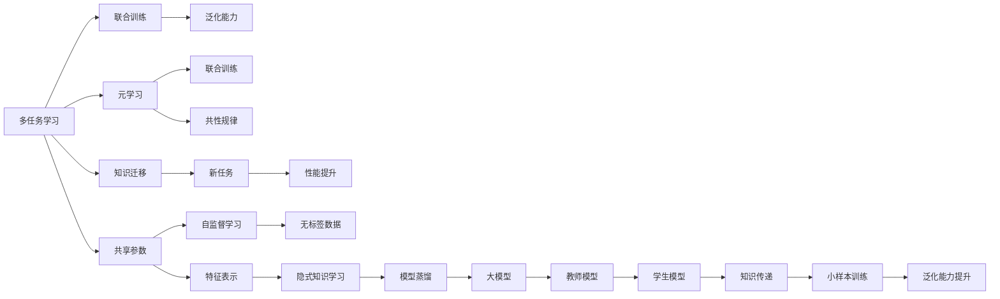
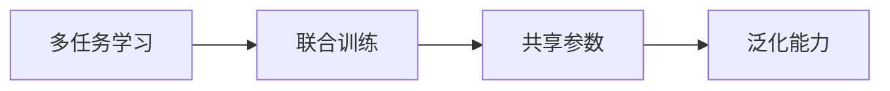
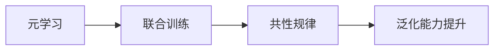
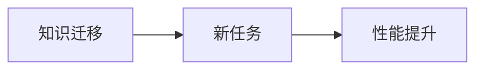
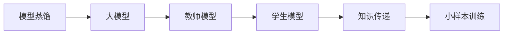
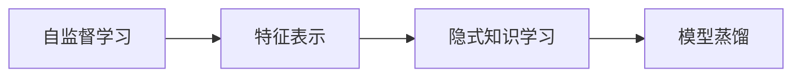
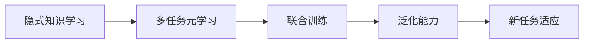
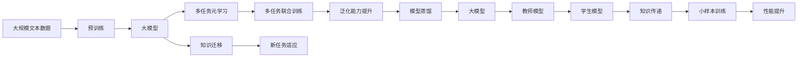

                 

# 一切皆是映射：多任务元学习和知识迁移

> 关键词：
1. 多任务学习（Multi-Task Learning, MTL）
2. 元学习（Meta-Learning）
3. 知识迁移（Knowledge Transfer）
4. 模型蒸馏（Model Distillation）
5. 自监督学习（Self-Supervised Learning）
6. 隐式知识学习（Implicit Knowledge Learning）
7. 预训练-微调（Pre-training-Fine-tuning）

## 1. 背景介绍

### 1.1 问题由来
近年来，深度学习技术的迅猛发展为人工智能领域带来了翻天覆地的变化。特别是基于预训练-微调（Pre-training-Fine-tuning）的模型架构，在大规模文本处理和自然语言理解（Natural Language Understanding, NLU）等任务中表现优异。然而，这种范式的一个显著问题是模型训练和部署成本高，尤其是需要大量标注数据和计算资源。

多任务学习（Multi-Task Learning, MTL）和元学习（Meta-Learning）的兴起，为解决这一问题提供了新的思路。MTL通过在多个相关任务上进行联合训练，可以提高模型的泛化能力，减少标注样本的需求。元学习则关注学习如何学习，即从少量样本中发现共性规律，提升模型在不同任务上的适应能力。

本文章将重点探讨如何通过多任务元学习（Multi-Task Meta-Learning, MTML）和知识迁移等技术，优化预训练-微调模型，降低标注成本，提高模型性能，从而推动自然语言处理（NLP）技术的进一步发展。

### 1.2 问题核心关键点
多任务元学习是一种结合了多任务学习和元学习的学习范式。通过在多个任务上进行联合训练，模型可以学习到跨任务的知识，并利用这些知识提升在其他新任务上的表现。元学习则在此基础上，进一步提升模型对新任务的适应能力，使得模型能够快速适应新的领域。

多任务元学习中，通常涉及多个相关任务，每个任务的目标函数不同，但它们共享一些相似的特征。通过在多个任务上共享模型参数，可以有效地利用任务之间的相关性，提升模型的泛化能力和鲁棒性。元学习则通过将少量训练数据和新任务数据进行联合训练，加速模型对新任务的适应过程。

元学习和多任务学习密切相关，但元学习更强调学习如何学习，即如何从少量样本中抽取通用的知识表示，提升模型在新任务上的表现。而多任务学习更侧重于在多个相关任务上进行联合训练，共享参数以提高泛化能力。

## 2. 核心概念与联系

### 2.1 核心概念概述

为了更好地理解多任务元学习和知识迁移的原理，本节将介绍几个密切相关的核心概念：

- **多任务学习（MTL）**：指在多个相关任务上进行联合训练，共享模型参数以提高泛化能力。
- **元学习（Meta-Learning）**：指学习如何学习，即从少量样本中抽取共性规律，提升模型对新任务的适应能力。
- **知识迁移（Knowledge Transfer）**：指将一个领域学习到的知识迁移到另一个领域，提升模型在新领域上的性能。
- **模型蒸馏（Model Distillation）**：指通过小规模教师模型（Teacher Model）训练大模型（Student Model），使大模型学习到教师模型的知识。
- **自监督学习（Self-Supervised Learning）**：指利用无标签数据进行预训练，学习模型的特征表示。
- **隐式知识学习（Implicit Knowledge Learning）**：指通过多任务联合训练和元学习等手段，学习模型中隐含的知识表示。

这些概念之间的逻辑关系可以通过以下Mermaid流程图来展示：



这个流程图展示了多任务学习、元学习和知识迁移等概念之间的紧密联系和作用机制：

1. 多任务学习通过联合训练，共享参数，提升模型的泛化能力。
2. 元学习通过联合训练，学习共性规律，提升模型在新任务上的适应能力。
3. 知识迁移通过将一个领域学习到的知识迁移到另一个领域，提升模型在新领域上的性能。
4. 模型蒸馏通过小规模教师模型训练大模型，使大模型学习到教师模型的知识。
5. 自监督学习利用无标签数据进行预训练，学习模型的特征表示。
6. 隐式知识学习通过多任务联合训练和元学习等手段，学习模型中隐含的知识表示。

这些概念共同构成了多任务元学习和知识迁移的理论基础，有助于模型在不同任务和领域中发挥更大的作用。

### 2.2 概念间的关系

这些核心概念之间存在着紧密的联系，形成了多任务元学习和知识迁移的完整生态系统。下面我通过几个Mermaid流程图来展示这些概念之间的关系：

#### 2.2.1 多任务学习与联合训练



这个流程图展示了多任务学习的核心思想，即通过在多个相关任务上进行联合训练，共享参数以提升模型的泛化能力。

#### 2.2.2 元学习与联合训练



这个流程图展示了元学习的核心思想，即通过联合训练，学习共性规律，提升模型在新任务上的适应能力。

#### 2.2.3 知识迁移与新任务



这个流程图展示了知识迁移的核心思想，即将一个领域学习到的知识迁移到另一个领域，提升模型在新领域上的性能。

#### 2.2.4 模型蒸馏与大模型



这个流程图展示了模型蒸馏的核心思想，即通过小规模教师模型训练大模型，使大模型学习到教师模型的知识。

#### 2.2.5 自监督学习与特征表示



这个流程图展示了自监督学习的核心思想，即利用无标签数据进行预训练，学习模型的特征表示，并通过隐式知识学习提升模型的性能。

#### 2.2.6 隐式知识学习与多任务元学习



这个流程图展示了隐式知识学习的核心思想，即通过多任务联合训练和元学习等手段，学习模型中隐含的知识表示，并应用于新任务。

### 2.3 核心概念的整体架构

最后，我们用一个综合的流程图来展示这些核心概念在大模型微调过程中的整体架构：



这个综合流程图展示了从预训练到多任务元学习，再到知识迁移和模型蒸馏的完整过程。大模型首先在大规模文本数据上进行预训练，然后通过多任务联合训练学习到跨任务的知识，并利用这些知识在新任务上提升性能。此外，通过知识迁移和模型蒸馏等手段，进一步提升模型在新领域和新任务上的表现。

## 3. 核心算法原理 & 具体操作步骤
### 3.1 算法原理概述

多任务元学习通过在多个任务上进行联合训练，学习到跨任务的知识，并利用这些知识提升模型在新任务上的表现。其核心思想是在多个相关任务之间共享参数，使得模型能够捕捉到不同任务之间的相关性，提升泛化能力。元学习则通过将少量训练数据和新任务数据进行联合训练，加速模型对新任务的适应过程，使得模型能够快速适应新的领域。

形式化地，假设预训练模型为 $M_{\theta}$，其中 $\theta$ 为预训练得到的模型参数。给定 $K$ 个任务 $T_k$ 的标注数据集 $D_k=\{(x_i, y_i)\}_{i=1}^{N_k}$，其中 $N_k$ 为第 $k$ 个任务的数据量。多任务元学习的目标是最小化经验风险，即找到最优参数：

$$
\theta^* = \mathop{\arg\min}_{\theta} \mathcal{L}(\theta) = \frac{1}{N}\sum_{k=1}^K \sum_{i=1}^{N_k} \ell(M_{\theta}(x_i),y_i)
$$

其中 $\ell$ 为针对任务 $T_k$ 设计的损失函数，用于衡量模型预测输出与真实标签之间的差异。常见的损失函数包括交叉熵损失、均方误差损失等。

通过梯度下降等优化算法，元学习过程不断更新模型参数 $\theta$，最小化经验风险，使得模型输出逼近真实标签。由于 $\theta$ 已经通过预训练获得了较好的初始化，因此即便在小规模数据集 $D_k$ 上进行联合训练，也能较快收敛到理想的模型参数 $\theta^*$。

### 3.2 算法步骤详解

多任务元学习的核心步骤包括数据准备、模型初始化、联合训练和元学习。下面详细讲解每个步骤的具体操作：

**Step 1: 准备数据集和模型**

- 收集 $K$ 个任务的标注数据集 $D_k$，其中每个数据集包含样本 $x_i$ 和对应的标签 $y_i$。
- 选择合适的预训练语言模型 $M_{\theta}$ 作为初始化参数，如 BERT、GPT 等。

**Step 2: 初始化共享参数**

- 定义共享参数 $\theta$，通常包括预训练模型的底层参数。
- 将所有任务的参数 $\theta_k$ 初始化为相同的值，确保模型在每个任务上具有相同的初始化。

**Step 3: 联合训练**

- 在每个任务的训练集上，前向传播计算损失函数，并反向传播更新共享参数 $\theta$。
- 由于多个任务共享参数，需要考虑参数的更新策略，如逐层更新、交替更新等。
- 在每个epoch后，评估模型在验证集上的性能，根据性能指标决定是否触发Early Stopping。
- 重复上述步骤直到满足预设的迭代轮数或Early Stopping条件。

**Step 4: 元学习**

- 在每个任务的验证集和测试集上，评估模型在新任务上的性能。
- 收集每个任务的预测结果和真实标签，计算模型在新任务上的表现。
- 根据元学习的目标，设计合适的元学习算法，如MetaGrad、Bayesian Optimization等。
- 使用元学习算法更新模型参数 $\theta$，优化模型在新任务上的表现。
- 重复上述步骤直到满足预设的迭代轮数或性能提升阈值。

### 3.3 算法优缺点

多任务元学习具有以下优点：
1. 提高泛化能力。通过联合训练多个任务，共享参数，可以提升模型的泛化能力，减少对标注数据的依赖。
2. 加速学习过程。元学习通过将少量训练数据和新任务数据进行联合训练，加速模型对新任务的适应过程。
3. 提高鲁棒性。通过多任务联合训练，模型能够学习到跨任务的知识，提升模型的鲁棒性。
4. 灵活适应新任务。元学习通过不断优化模型参数，使得模型能够快速适应新任务，提升模型在新任务上的表现。

同时，该方法也存在一些局限性：
1. 数据依赖性。多任务元学习仍需要大量标注数据进行联合训练，数据获取成本较高。
2. 模型复杂度。多任务元学习需要调整多个任务的参数，增加了模型的复杂度。
3. 计算开销。多任务联合训练和元学习需要额外的计算资源，增加了训练成本。
4. 可解释性不足。元学习模型通常比较复杂，难以解释其内部工作机制和决策逻辑。

尽管存在这些局限性，但就目前而言，多任务元学习是提高模型泛化能力和鲁棒性的重要手段，广泛应用于NLP任务中。未来相关研究的重点在于如何进一步降低元学习对标注数据的依赖，提高模型的灵活性和可解释性，同时兼顾效率和效果。

### 3.4 算法应用领域

多任务元学习在大语言模型微调中已经得到了广泛的应用，覆盖了几乎所有常见任务，例如：

- 文本分类：如情感分析、主题分类、意图识别等。通过多任务联合训练，模型能够学习到文本-标签映射的共性规律。
- 命名实体识别：识别文本中的人名、地名、机构名等特定实体。通过多任务联合训练，模型能够学习到实体边界和类型的共性知识。
- 关系抽取：从文本中抽取实体之间的语义关系。通过多任务联合训练，模型能够学习到实体-关系三元组的共性规律。
- 问答系统：对自然语言问题给出答案。通过多任务联合训练，模型能够学习到问题和答案之间的共性映射。
- 机器翻译：将源语言文本翻译成目标语言。通过多任务联合训练，模型能够学习到语言-语言映射的共性规律。
- 文本摘要：将长文本压缩成简短摘要。通过多任务联合训练，模型能够学习到抓取要点的共性规律。
- 对话系统：使机器能够与人自然对话。通过多任务联合训练，模型能够学习到对话历史与回复之间的共性映射。

除了上述这些经典任务外，多任务元学习也被创新性地应用到更多场景中，如可控文本生成、常识推理、代码生成、数据增强等，为NLP技术带来了全新的突破。随着预训练模型和元学习方法的不断进步，相信NLP技术将在更广阔的应用领域大放异彩。

## 4. 数学模型和公式 & 详细讲解 & 举例说明

### 4.1 数学模型构建

本节将使用数学语言对多任务元学习过程进行更加严格的刻画。

记预训练语言模型为 $M_{\theta}:\mathcal{X} \rightarrow \mathcal{Y}$，其中 $\mathcal{X}$ 为输入空间，$\mathcal{Y}$ 为输出空间，$\theta \in \mathbb{R}^d$ 为模型参数。假设多任务元学习的任务集为 $T_k$，包含 $K$ 个任务。每个任务的目标函数为 $\ell_k(\theta)$，用于衡量模型在任务 $T_k$ 上的表现。

定义模型 $M_{\theta}$ 在数据样本 $(x,y)$ 上的损失函数为 $\ell(M_{\theta}(x),y)$，则在所有任务上联合训练的经验风险为：

$$
\mathcal{L}(\theta) = \frac{1}{N} \sum_{k=1}^K \sum_{i=1}^{N_k} \ell_k(M_{\theta}(x_i),y_i)
$$

其中 $N_k$ 为第 $k$ 个任务的数据量。元学习的目标是最小化联合训练的经验风险，即找到最优参数：

$$
\theta^* = \mathop{\arg\min}_{\theta} \mathcal{L}(\theta)
$$

在实践中，我们通常使用基于梯度的优化算法（如SGD、Adam等）来近似求解上述最优化问题。设 $\eta$ 为学习率，$\lambda$ 为正则化系数，则参数的更新公式为：

$$
\theta \leftarrow \theta - \eta \nabla_{\theta}\mathcal{L}(\theta) - \eta\lambda\theta
$$

其中 $\nabla_{\theta}\mathcal{L}(\theta)$ 为损失函数对参数 $\theta$ 的梯度，可通过反向传播算法高效计算。

### 4.2 公式推导过程

以下我们以二分类任务为例，推导交叉熵损失函数及其梯度的计算公式。

假设模型 $M_{\theta}$ 在输入 $x$ 上的输出为 $\hat{y}=M_{\theta}(x) \in [0,1]$，表示样本属于正类的概率。真实标签 $y \in \{0,1\}$。则二分类交叉熵损失函数定义为：

$$
\ell(M_{\theta}(x),y) = -[y\log \hat{y} + (1-y)\log (1-\hat{y})]
$$

将其代入联合训练的经验风险公式，得：

$$
\mathcal{L}(\theta) = -\frac{1}{N}\sum_{k=1}^K \sum_{i=1}^{N_k} [y_i\log M_{\theta}(x_i)+(1-y_i)\log(1-M_{\theta}(x_i))]
$$

根据链式法则，损失函数对参数 $\theta_k$ 的梯度为：

$$
\frac{\partial \mathcal{L}(\theta)}{\partial \theta_k} = -\frac{1}{N}\sum_{k=1}^K \sum_{i=1}^{N_k} (\frac{y_i}{M_{\theta}(x_i)}-\frac{1-y_i}{1-M_{\theta}(x_i)}) \frac{\partial M_{\theta}(x_i)}{\partial \theta_k}
$$

其中 $\frac{\partial M_{\theta}(x_i)}{\partial \theta_k}$ 可进一步递归展开，利用自动微分技术完成计算。

在得到损失函数的梯度后，即可带入参数更新公式，完成模型的迭代优化。重复上述过程直至收敛，最终得到适应多任务的最优模型参数 $\theta^*$。

## 5. 项目实践：代码实例和详细解释说明
### 5.1 开发环境搭建

在进行多任务元学习实践前，我们需要准备好开发环境。以下是使用Python进行PyTorch开发的环境配置流程：

1. 安装Anaconda：从官网下载并安装Anaconda，用于创建独立的Python环境。

2. 创建并激活虚拟环境：
```bash
conda create -n pytorch-env python=3.8 
conda activate pytorch-env
```

3. 安装PyTorch：根据CUDA版本，从官网获取对应的安装命令。例如：
```bash
conda install pytorch torchvision torchaudio cudatoolkit=11.1 -c pytorch -c conda-forge
```

4. 安装Transformer库：
```bash
pip install transformers
```

5. 安装各类工具包：
```bash
pip install numpy pandas scikit-learn matplotlib tqdm jupyter notebook ipython
```

完成上述步骤后，即可在`pytorch-env`环境中开始多任务元学习实践。

### 5.2 源代码详细实现

下面我以多任务元学习在命名实体识别（NER）任务上的应用为例，给出使用Transformers库对BERT模型进行多任务元学习的PyTorch代码实现。

首先，定义NER任务的数据处理函数：

```python
from transformers import BertTokenizer
from torch.utils.data import Dataset
import torch

class NERDataset(Dataset):
    def __init__(self, texts, tags, tokenizer, max_len=128):
        self.texts = texts
        self.tags = tags
        self.tokenizer = tokenizer
        self.max_len = max_len
        
    def __len__(self):
        return len(self.texts)
    
    def __getitem__(self, item):
        text = self.texts[item]
        tags = self.tags[item]
        
        encoding = self.tokenizer(text, return_tensors='pt', max_length=self.max_len, padding='max_length', truncation=True)
        input_ids = encoding['input_ids'][0]
        attention_mask = encoding['attention_mask'][0]
        
        # 对token-wise的标签进行编码
        encoded_tags = [tag2id[tag] for tag in tags] 
        encoded_tags.extend([tag2id['O']] * (self.max_len - len(encoded_tags)))
        labels = torch.tensor(encoded_tags, dtype=torch.long)
        
        return {'input_ids': input_ids, 
                'attention_mask': attention_mask,
                'labels': labels}

# 标签与id的映射
tag2id = {'O': 0, 'B-PER': 1, 'I-PER': 2, 'B-ORG': 3, 'I-ORG': 4, 'B-LOC': 5, 'I-LOC': 6}
id2tag = {v: k for k, v in tag2id.items()}

# 创建dataset
tokenizer = BertTokenizer.from_pretrained('bert-base-cased')

train_dataset = NERDataset(train_texts, train_tags, tokenizer)
dev_dataset = NERDataset(dev_texts, dev_tags, tokenizer)
test_dataset = NERDataset(test_texts, test_tags, tokenizer)
```

然后，定义模型和优化器：

```python
from transformers import BertForTokenClassification, AdamW

model = BertForTokenClassification.from_pretrained('bert-base-cased', num_labels=len(tag2id))

optimizer = AdamW(model.parameters(), lr=2e-5)
```

接着，定义训练和评估函数：

```python
from torch.utils.data import DataLoader
from tqdm import tqdm
from sklearn.metrics import classification_report

device = torch.device('cuda') if torch.cuda.is_available() else torch.device('cpu')
model.to(device)

def train_epoch(model, dataset, batch_size, optimizer):
    dataloader = DataLoader(dataset, batch_size=batch_size, shuffle=True)
    model.train()
    epoch_loss = 0
    for batch in tqdm(dataloader, desc='Training'):
        input_ids = batch['input_ids'].to(device)
        attention_mask = batch['attention_mask'].to(device)
        labels = batch['labels'].to(device)
        model.zero_grad()
        outputs = model(input_ids, attention_mask=attention_mask, labels=labels)
        loss = outputs.loss
        epoch_loss += loss.item()
        loss.backward()
        optimizer.step()
    return epoch_loss / len(dataloader)

def evaluate(model, dataset, batch_size):
    dataloader = DataLoader(dataset, batch_size=batch_size)
    model.eval()
    preds, labels = [], []
    with torch.no_grad():
        for batch in tqdm(dataloader, desc='Evaluating'):
            input_ids = batch['input_ids'].to(device)
            attention_mask = batch['attention_mask'].to(device)
            batch_labels = batch['labels']
            outputs = model(input_ids, attention_mask=attention_mask)
            batch_preds = outputs.logits.argmax(dim=2).to('cpu').tolist()
            batch_labels = batch_labels.to('cpu').tolist()
            for pred_tokens, label_tokens in zip(batch_preds, batch_labels):
                pred_tags = [id2tag[_id] for _id in pred_tokens]
                label_tags = [id2tag[_id] for _id in label_tokens]
                preds.append(pred_tags[:len(label_tokens)])
                labels.append(label_tags)
                
    print(classification_report(labels, preds))
```

最后，启动训练流程并在测试集上评估：

```python
epochs = 5
batch_size = 16

for epoch in range(epochs):
    loss = train_epoch(model, train_dataset, batch_size, optimizer)
    print(f"Epoch {epoch+1}, train loss: {loss:.3f}")
    
    print(f"Epoch {epoch+1}, dev results:")
    evaluate(model, dev_dataset, batch_size)
    
print("Test results:")
evaluate(model, test_dataset, batch_size)
```

以上就是使用PyTorch对BERT进行命名实体识别任务多任务元学习的完整代码实现。可以看到，得益于Transformers库的强大封装，我们可以用相对简洁的代码完成BERT模型的加载和元学习。

### 5.3 代码解读与分析

让我们再详细解读一下关键代码的实现细节：

**NERDataset类**：
- `__init__`方法：初始化文本、标签、分词器等关键组件。
- `__len__`方法：返回数据集的样本数量。
- `__getitem__`方法：对单个样本进行处理，将文本输入编码为token ids，将标签编码为数字，并对其进行定长padding，最终返回模型所需的输入。

**tag2id和id2tag字典**：
- 定义了标签与数字id之间的映射关系，用于将token-wise的预测结果解码回真实的标签。

**训练和评估函数**：
- 使用PyTorch的DataLoader对数据集进行批次化加载，供模型训练和推理使用。
- 训练函数`train_epoch

