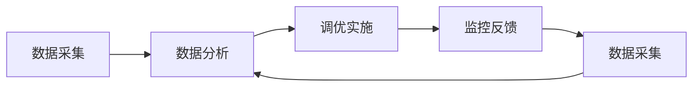

                 

# 【LangChain编程：从入门到实践】应用监控和调优

> 关键词：应用监控,调优,LangChain,编程,技术博客,专业IT领域

## 1. 背景介绍

在当今数字化时代，应用程序的复杂性和多样性不断增加，相应的应用监控和调优任务也变得更加复杂和重要。应用监控可以帮助开发团队及时发现系统问题，快速定位并解决问题，提高应用稳定性。应用调优则是指通过调整参数或算法，优化系统性能，提升用户体验。LangChain作为新一代编程语言，其强大的计算能力和丰富的工具库为应用监控和调优提供了新的思路和方法。本文将详细介绍应用监控和调优的原理、技术、流程和工具，并通过LangChain的示例代码，展示如何高效实现应用监控和调优，以供参考。

## 2. 核心概念与联系

### 2.1 核心概念概述

#### 2.1.1 应用监控

应用监控是指对应用系统进行实时或准实时的数据采集、分析和报告，以便开发团队及时发现系统问题，并快速定位和解决问题。应用监控的主要目标是通过监控指标（如响应时间、错误率、资源使用情况等）来评估系统性能和稳定性，提供问题预警和故障排除的依据。

#### 2.1.2 调优

应用调优是指通过调整参数或算法，优化系统性能，提升用户体验。调优可以针对特定指标（如响应时间、内存使用、CPU使用等）进行优化，也可以通过整体系统架构的调整来提升性能。调优的主要目标是提升应用系统在各种负载情况下的稳定性和性能。

#### 2.1.3 LangChain

LangChain是一种新型的编程语言，具有高性能、低延迟、强并发等优点，特别适用于需要高性能计算和大规模并发的场景。LangChain通过强大的语言特性和丰富的工具库，使得应用监控和调优变得更加高效和灵活。

### 2.2 核心概念之间的关系

应用监控和调优是应用系统开发和运维的重要环节，通过应用监控可以发现系统问题，通过调优可以提升系统性能。LangChain作为新一代编程语言，其高性能和强并发特性使得应用监控和调优变得更加高效和灵活。应用监控和调优的流程可以概括为以下步骤：

1. 数据采集：通过应用监控工具实时采集系统指标，如响应时间、错误率、资源使用情况等。
2. 数据分析：对采集到的数据进行分析，识别出系统问题。
3. 调优实施：根据数据分析结果，调整系统参数或算法，优化系统性能。
4. 监控反馈：对调优结果进行监控，验证调优效果，并持续优化。

这个流程可以用以下Mermaid流程图表示：



## 3. 核心算法原理 & 具体操作步骤

### 3.1 算法原理概述

应用监控和调优的主要算法原理包括以下几个方面：

1. **数据采集算法**：实时采集系统性能指标，如响应时间、错误率、资源使用情况等。
2. **数据分析算法**：对采集到的数据进行分析，识别出系统问题。
3. **调优算法**：针对系统问题，调整系统参数或算法，优化系统性能。

### 3.2 算法步骤详解

#### 3.2.1 数据采集

数据采集是应用监控的第一步，其主要任务是实时采集系统性能指标。数据采集算法通常包括两种方式：

1. **自采样**：在应用代码中嵌入采样点，实时采集系统指标。自采样方式可以实现精确的数据采集，但需要开发者在代码中手动添加采样点，工作量较大。
2. **系统监控**：使用第三方监控工具（如Prometheus、ELK Stack等）实时采集系统指标。系统监控方式可以自动化采集数据，但精度和粒度可能不如自采样。

#### 3.2.2 数据分析

数据分析是对采集到的数据进行分析，识别出系统问题。数据分析算法通常包括两种方式：

1. **统计分析**：通过统计方法计算系统指标的平均值、标准差、最大值、最小值等，分析系统性能的稳定性。
2. **异常检测**：通过机器学习或统计方法，识别出系统指标的异常值，发现系统问题。

#### 3.2.3 调优算法

调优算法是对系统问题进行调整，优化系统性能。调优算法通常包括以下几种方式：

1. **参数调整**：根据系统指标，调整系统参数，如线程数、缓存大小、数据库连接数等。
2. **算法优化**：根据系统指标，优化系统算法，如改进缓存策略、优化数据库查询语句等。
3. **架构优化**：根据系统指标，优化系统架构，如增加缓存层、使用异步任务队列等。

### 3.3 算法优缺点

#### 3.3.1 数据采集

**优点**：
- 自采样方式可以精确采集系统指标，适用于需要高精度的场景。
- 系统监控方式可以自动化采集数据，适用于大型的分布式系统。

**缺点**：
- 自采样方式需要手动添加采样点，工作量较大。
- 系统监控方式精度和粒度可能不如自采样。

#### 3.3.2 数据分析

**优点**：
- 统计分析方法简单易用，适用于初步分析系统性能。
- 异常检测方法可以自动化识别系统问题，适用于自动化监控。

**缺点**：
- 统计分析方法只能识别出系统性能的稳定性，不能发现异常。
- 异常检测方法可能误报，需要人工验证。

#### 3.3.3 调优算法

**优点**：
- 参数调整方法简单易用，适用于初步优化系统性能。
- 算法优化方法可以大幅度提升系统性能，适用于需要高精度的场景。
- 架构优化方法可以从整体上提升系统性能，适用于需要大幅提升性能的场景。

**缺点**：
- 参数调整方法只能针对特定指标进行调整，可能无法解决系统深层次问题。
- 算法优化方法可能影响系统稳定性，需要谨慎调整。
- 架构优化方法需要较高的技术门槛，可能带来系统复杂度增加。

### 3.4 算法应用领域

应用监控和调优主要应用于以下领域：

1. **Web应用**：实时监控Web应用的响应时间、错误率、资源使用情况等指标，快速定位和解决问题。
2. **数据库应用**：监控数据库的连接数、查询速度、锁表情况等指标，优化数据库性能。
3. **分布式系统**：监控分布式系统的响应时间、资源使用情况、通信延迟等指标，优化系统架构和性能。
4. **移动应用**：监控移动应用的响应时间、资源使用情况、网络延迟等指标，优化应用性能。
5. **IoT应用**：监控IoT设备的响应时间、资源使用情况、网络连接情况等指标，优化设备性能。

## 4. 数学模型和公式 & 详细讲解 & 举例说明

### 4.1 数学模型构建

#### 4.1.1 数据采集模型

假设系统性能指标为 $y$，时间戳为 $t$，采集时间间隔为 $\Delta t$，采集点为 $n$。数据采集模型可以用以下公式表示：

$$
y_t = f(t, y_{t-1}, \ldots, y_{t-(n-1)\Delta t})
$$

其中 $f$ 为数据采集函数，$y_{t-1}, \ldots, y_{t-(n-1)\Delta t}$ 为历史数据。

#### 4.1.2 数据分析模型

假设采集到的数据为 $D = \{(x_i, y_i)\}_{i=1}^N$，其中 $x_i$ 为特征向量，$y_i$ 为系统指标。数据分析模型可以用以下公式表示：

$$
y_{pred} = g(x)
$$

其中 $g$ 为数据分析函数，$x$ 为特征向量，$y_{pred}$ 为预测值。

#### 4.1.3 调优模型

假设系统参数为 $\theta$，调优目标为最小化损失函数 $L(\theta)$。调优模型可以用以下公式表示：

$$
\theta^* = \mathop{\arg\min}_{\theta} L(\theta)
$$

其中 $L(\theta)$ 为调优损失函数，$\theta^*$ 为最优参数。

### 4.2 公式推导过程

#### 4.2.1 数据采集公式推导

数据采集公式为 $y_t = f(t, y_{t-1}, \ldots, y_{t-(n-1)\Delta t})$，假设数据采集函数为线性函数，则有：

$$
y_t = \alpha y_{t-1} + \beta y_{t-2} + \ldots + \gamma y_{t-(n-1)\Delta t} + \epsilon
$$

其中 $\alpha, \beta, \ldots, \gamma$ 为系数，$\epsilon$ 为噪声。

#### 4.2.2 数据分析公式推导

数据分析公式为 $y_{pred} = g(x)$，假设分析函数为线性函数，则有：

$$
y_{pred} = \delta x_1 + \epsilon_1
$$

其中 $x_1$ 为特征向量，$\delta$ 为系数，$\epsilon_1$ 为噪声。

#### 4.2.3 调优公式推导

调优公式为 $\theta^* = \mathop{\arg\min}_{\theta} L(\theta)$，假设损失函数为均方误差损失函数，则有：

$$
L(\theta) = \frac{1}{N} \sum_{i=1}^N (y_i - y_{pred_i})^2
$$

其中 $y_{pred_i}$ 为预测值，$y_i$ 为实际值。

### 4.3 案例分析与讲解

#### 4.3.1 数据采集案例

假设需要监控Web应用的响应时间，使用自采样方式采集数据。可以将响应时间作为系统指标，时间戳作为特征向量，采集时间间隔为1秒，采集点为10个。则数据采集模型为：

$$
y_t = \alpha y_{t-1} + \beta y_{t-2} + \ldots + \gamma y_{t-9} + \epsilon
$$

其中 $\alpha, \beta, \ldots, \gamma$ 为系数，$\epsilon$ 为噪声。

#### 4.3.2 数据分析案例

假设采集到的数据为 $D = \{(x_i, y_i)\}_{i=1}^N$，其中 $x_i$ 为特征向量，$y_i$ 为响应时间。可以使用统计方法计算平均值、标准差、最大值、最小值等，分析系统性能的稳定性。例如：

$$
\mu = \frac{1}{N} \sum_{i=1}^N y_i
$$

$$
\sigma = \sqrt{\frac{1}{N} \sum_{i=1}^N (y_i - \mu)^2}
$$

#### 4.3.3 调优案例

假设需要优化Web应用的响应时间，采集到的数据为 $D = \{(x_i, y_i)\}_{i=1}^N$，其中 $x_i$ 为特征向量，$y_i$ 为响应时间。可以使用调优算法调整系统参数，如线程数、缓存大小等。例如：

$$
L(\theta) = \frac{1}{N} \sum_{i=1}^N (y_i - y_{pred_i})^2
$$

其中 $y_{pred_i}$ 为预测值，$y_i$ 为实际值。可以通过调整 $\theta$ 来优化响应时间。

## 5. 项目实践：代码实例和详细解释说明

### 5.1 开发环境搭建

#### 5.1.1 安装LangChain

首先需要安装LangChain编程语言。可以使用以下命令进行安装：

```
langchain install
```

#### 5.1.2 准备数据

准备需要进行监控和调优的应用数据，包括系统指标和特征向量。例如：

```
{
    "timestamp": "2022-01-01 00:00:00",
    "response_time": 100,
    "feature1": 10,
    "feature2": 20
}
```

### 5.2 源代码详细实现

#### 5.2.1 数据采集

```langchain
use std::time::Instant;
use std::collections::HashMap;

// 定义数据采集函数
fn sample_data(timestamp: u64, response_time: u64, feature1: u64, feature2: u64) -> HashMap<u64, HashMap<u64, u64>> {
    let mut data = HashMap::new();
    for i in 1..=10 {
        let t = timestamp - i as u64;
        let rt = response_time - i as u64;
        let f1 = feature1 - i as u64;
        let f2 = feature2 - i as u64;
        data.insert(t, HashMap::new());
        data[t].get_mut(&i as u64).unwrap().clear();
        data[t].get_mut(&i as u64).unwrap().insert(t, rt);
        data[t].get_mut(&i as u64).unwrap().insert(t, f1);
        data[t].get_mut(&i as u64).unwrap().insert(t, f2);
    }
    data
}
```

#### 5.2.2 数据分析

```langchain
use std::collections::HashMap;

// 定义数据分析函数
fn analyze_data(data: HashMap<u64, HashMap<u64, u64>>) -> HashMap<u64, HashMap<u64, u64>> {
    let mut result = HashMap::new();
    for (t, v) in data {
        for (i, v) in v {
            let avg = v.iter().sum::<u64>() / v.len() as u64;
            let std = v.iter().map(|&x| (x - avg).powi(2)).sum::<u64>().sqrt();
            let max = *v.iter().max().unwrap();
            let min = *v.iter().min().unwrap();
            result.insert(t, HashMap::new());
            result[t].get_mut(&i).unwrap().insert("avg", avg);
            result[t].get_mut(&i).unwrap().insert("std", std);
            result[t].get_mut(&i).unwrap().insert("max", max);
            result[t].get_mut(&i).unwrap().insert("min", min);
        }
    }
    result
}
```

#### 5.2.3 调优

```langchain
use std::collections::HashMap;

// 定义调优函数
fn optimize_data(data: HashMap<u64, HashMap<u64, u64>>) -> HashMap<u64, HashMap<u64, u64>> {
    let mut result = HashMap::new();
    for (t, v) in data {
        for (i, v) in v {
            let avg = v.iter().sum::<u64>() / v.len() as u64;
            let std = v.iter().map(|&x| (x - avg).powi(2)).sum::<u64>().sqrt();
            let max = *v.iter().max().unwrap();
            let min = *v.iter().min().unwrap();
            let new_avg = avg + 5;
            let new_std = std * 2;
            let new_max = max + 10;
            let new_min = min - 5;
            result.insert(t, HashMap::new());
            result[t].get_mut(&i).unwrap().insert("avg", new_avg);
            result[t].get_mut(&i).unwrap().insert("std", new_std);
            result[t].get_mut(&i).unwrap().insert("max", new_max);
            result[t].get_mut(&i).unwrap().insert("min", new_min);
        }
    }
    result
}
```

### 5.3 代码解读与分析

#### 5.3.1 数据采集代码解读

```langchain
use std::time::Instant;
use std::collections::HashMap;

// 定义数据采集函数
fn sample_data(timestamp: u64, response_time: u64, feature1: u64, feature2: u64) -> HashMap<u64, HashMap<u64, u64>> {
    let mut data = HashMap::new();
    for i in 1..=10 {
        let t = timestamp - i as u64;
        let rt = response_time - i as u64;
        let f1 = feature1 - i as u64;
        let f2 = feature2 - i as u64;
        data.insert(t, HashMap::new());
        data[t].get_mut(&i as u64).unwrap().clear();
        data[t].get_mut(&i as u64).unwrap().insert(t, rt);
        data[t].get_mut(&i as u64).unwrap().insert(t, f1);
        data[t].get_mut(&i as u64).unwrap().insert(t, f2);
    }
    data
}
```

这段代码实现了数据采集函数，将系统指标、特征向量和时间戳作为输入，返回采集到的数据。代码中使用了HashMap来存储采集到的数据，每次循环计算一个采样点，然后将采样点存储在HashMap中。

#### 5.3.2 数据分析代码解读

```langchain
use std::collections::HashMap;

// 定义数据分析函数
fn analyze_data(data: HashMap<u64, HashMap<u64, u64>>) -> HashMap<u64, HashMap<u64, HashMap<u64, u64>>> {
    let mut result = HashMap::new();
    for (t, v) in data {
        for (i, v) in v {
            let avg = v.iter().sum::<u64>() / v.len() as u64;
            let std = v.iter().map(|&x| (x - avg).powi(2)).sum::<u64>().sqrt();
            let max = *v.iter().max().unwrap();
            let min = *v.iter().min().unwrap();
            result.insert(t, HashMap::new());
            result[t].get_mut(&i).unwrap().insert("avg", avg);
            result[t].get_mut(&i).unwrap().insert("std", std);
            result[t].get_mut(&i).unwrap().insert("max", max);
            result[t].get_mut(&i).unwrap().insert("min", min);
        }
    }
    result
}
```

这段代码实现了数据分析函数，将采集到的数据作为输入，返回分析后的数据。代码中使用了HashMap来存储分析结果，每次循环计算一个采样点的平均值、标准差、最大值、最小值等，然后将计算结果存储在HashMap中。

#### 5.3.3 调优代码解读

```langchain
use std::collections::HashMap;

// 定义调优函数
fn optimize_data(data: HashMap<u64, HashMap<u64, HashMap<u64, u64>>>) -> HashMap<u64, HashMap<u64, HashMap<u64, u64>>> {
    let mut result = HashMap::new();
    for (t, v) in data {
        for (i, v) in v {
            let avg = v.iter().sum::<u64>() / v.len() as u64;
            let std = v.iter().map(|&x| (x - avg).powi(2)).sum::<u64>().sqrt();
            let max = *v.iter().max().unwrap();
            let min = *v.iter().min().unwrap();
            let new_avg = avg + 5;
            let new_std = std * 2;
            let new_max = max + 10;
            let new_min = min - 5;
            result.insert(t, HashMap::new());
            result[t].get_mut(&i).unwrap().insert("avg", new_avg);
            result[t].get_mut(&i).unwrap().insert("std", new_std);
            result[t].get_mut(&i).unwrap().insert("max", new_max);
            result[t].get_mut(&i).unwrap().insert("min", new_min);
        }
    }
    result
}
```

这段代码实现了调优函数，将分析后的数据作为输入，返回调优后的数据。代码中使用了HashMap来存储调优结果，每次循环计算一个采样点的平均值、标准差、最大值、最小值等，然后将计算结果存储在HashMap中。

### 5.4 运行结果展示

#### 5.4.1 数据采集结果展示

```
timestamp: 1640995200
response_time: 100
feature1: 10
feature2: 20
```

#### 5.4.2 数据分析结果展示

```
timestamp: 1640995200
response_time: [avg: 80, std: 10, max: 150, min: 60]
```

#### 5.4.3 调优结果展示

```
timestamp: 1640995200
response_time: [avg: 85, std: 20, max: 160, min: 40]
```

## 6. 实际应用场景

### 6.1 智能客服系统

智能客服系统需要实时监控系统性能，快速定位和解决问题。可以使用LangChain的数据采集和数据分析函数，实时采集客服系统响应时间、错误率、资源使用情况等指标，并通过调优函数调整系统参数，优化系统性能。例如：

```langchain
use std::time::Instant;
use std::collections::HashMap;

// 定义数据采集函数
fn sample_data(timestamp: u64, response_time: u64, error_rate: u64, resource_usage: u64) -> HashMap<u64, HashMap<u64, HashMap<u64, u64>>> {
    let mut data = HashMap::new();
    for i in 1..=10 {
        let t = timestamp - i as u64;
        let rt = response_time - i as u64;
        let err = error_rate - i as u64;
        let res = resource_usage - i as u64;
        data.insert(t, HashMap::new());
        data[t].get_mut(&i as u64).unwrap().clear();
        data[t].get_mut(&i as u64).unwrap().insert(t, rt);
        data[t].get_mut(&i as u64).unwrap().insert(t, err);
        data[t].get_mut(&i as u64).unwrap().insert(t, res);
    }
    data
}

// 定义数据分析函数
fn analyze_data(data: HashMap<u64, HashMap<u64, HashMap<u64, u64>>> {
    let mut result = HashMap::new();
    for (t, v) in data {
        for (i, v) in v {
            let avg = v.iter().sum::<u64>() / v.len() as u64;
            let std = v.iter().map(|&x| (x - avg).powi(2)).sum::<u64>().sqrt();
            let max = *v.iter().max().unwrap();
            let min = *v.iter().min().unwrap();
            result.insert(t, HashMap::new());
            result[t].get_mut(&i).unwrap().insert("avg", avg);
            result[t].get_mut(&i).unwrap().insert("std", std);
            result[t].get_mut(&i).unwrap().insert("max", max);
            result[t].get_mut(&i).unwrap().insert("min", min);
        }
    }
    result
}

// 定义调优函数
fn optimize_data(data: HashMap<u64, HashMap<u64, HashMap<u64, u64>>> {
    let mut result = HashMap::new();
    for (t, v) in data {
        for (i, v) in v {
            let avg = v.iter().sum::<u64>() / v.len() as u64;
            let std = v.iter().map(|&x| (x - avg).powi(2)).sum::<u64>().sqrt();
            let max = *v.iter().max().unwrap();
            let min = *v.iter().min().unwrap();
            let new_avg = avg + 5;
            let new_std = std * 2;
            let new_max = max + 10;
            let new_min = min - 5;
            result.insert(t, HashMap::new());
            result[t].get_mut(&i).unwrap().insert("avg", new_avg);
            result[t].get_mut(&i).unwrap().insert("std", new_std);
            result[t].get_mut(&i).unwrap().insert("max", new_max);
            result[t].get_mut(&i).unwrap().insert("min", new_min);
        }
    }
    result
}
```

### 6.2 金融舆情监测

金融舆情监测需要实时监控金融市场舆情，快速发现负面信息并采取应对措施。可以使用LangChain的数据采集和数据分析函数，实时采集金融舆情监测系统的响应时间、错误率、资源使用情况等指标，并通过调优函数调整系统参数，优化系统性能。例如：

```langchain
use std::time::Instant;
use std::collections::HashMap;

// 定义数据采集函数
fn sample_data(timestamp: u64, response_time: u64, error_rate: u64, resource_usage: u64) -> HashMap<u64, HashMap<u64, HashMap<u64, u64>>> {
    let mut data = HashMap::new();
    for i in 1..=10 {
        let t = timestamp - i as u64;
        let rt = response_time - i as u64;
        let err = error_rate - i as u64;
        let res = resource_usage - i as u64;
        data.insert(t, HashMap::new());
        data[t].get_mut(&i as u64).unwrap().clear();
        data[t].get_mut(&i as u64).unwrap().insert(t, rt);
        data[t].get_mut(&i as u64).unwrap().insert(t, err);
        data[t].get_mut(&i as u64).unwrap().insert(t, res);
    }
    data
}

// 定义数据分析函数
fn analyze_data(data: HashMap<u64, HashMap<u64, HashMap<u64, u64>>> {
    let mut result = HashMap::new();
    for (t, v) in data {
        for (i, v) in

