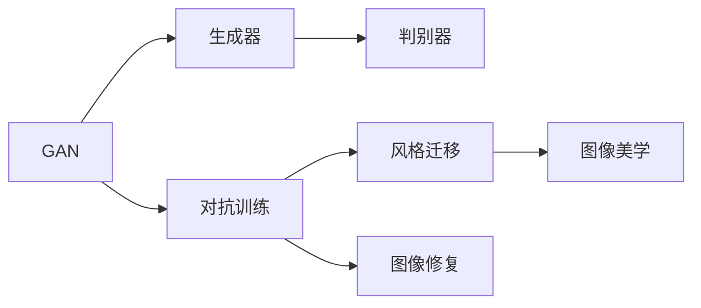

                 

# 基于生成对抗网络和深度学习的图像美学风格转换

> 关键词：生成对抗网络（GAN）, 深度学习, 图像美学, 风格迁移, 图像修复, 图像生成

## 1. 背景介绍

图像风格转换是计算机视觉和深度学习领域内一个非常热门的研究方向。这项技术利用深度学习模型的强大表现力，可以将输入图像的视觉风格转化为输出图像的视觉风格，赋予图片新的美学意义。

图像风格转换可以用于各种应用场景，如艺术创作、游戏设计、视频制作、广告设计等。它将传统二维艺术与数字化媒体结合，实现了图像与艺术的跨界融合，具有广阔的发展潜力。

## 2. 核心概念与联系

### 2.1 核心概念概述

为了更好地理解基于生成对抗网络和深度学习的图像风格转换，本节将介绍几个关键概念：

- 生成对抗网络（GAN）：一种由生成器和判别器组成的框架，能够通过对抗训练生成高质量的伪图像。GAN的核心思想是通过竞争对抗训练生成模型和判别模型，使得生成器可以生成逼真的图像，同时判别器能够区分真实图像与伪图像。

- 深度学习：一种通过多层神经网络模型进行复杂数据学习和分析的技术。深度学习能够自动地从数据中提取特征，在图像识别、语音识别、自然语言处理等领域取得了突破性进展。

- 图像美学：研究美学在视觉艺术中的表现，关注图像的视觉风格、形式美、色彩搭配等美学特征。在图像风格转换中，美学风格通常指图像的视觉风格，如印象派、野兽派、超现实主义等。

- 风格迁移：将图像的风格从一张图像迁移至另一张图像的过程。风格迁移技术能够将图像的风格属性与内容属性分离，使图像既有原有内容，又具备新的风格特征。

- 图像修复：对受损或缺失的图像进行修复，还原图像的真实状态。图像修复技术可以应用于复古图像修复、照片去模糊、人脸去污等领域。

### 2.2 概念间的关系

这些关键概念之间存在着紧密的联系，形成了图像风格转换的核心框架。下面通过一个Mermaid流程图来展示它们之间的关系：



这个流程图展示了从GAN到图像美学风格转换的全过程：

1. GAN作为核心框架，通过生成器和判别器的对抗训练生成逼真图像。
2. 生成器通过风格迁移技术将输入图像的风格属性提取并迁移至输出图像，生成新的视觉风格图像。
3. 图像修复技术可以应用于输入图像，修复缺失、损坏的部分，从而更好地适应风格迁移需求。
4. 图像美学提供了风格迁移的审美准则，指导风格迁移技术生成符合美学规范的图像。

这些概念共同构成了图像风格转换的技术体系，使其能够在各种场景下发挥强大的视觉风格转换能力。

## 3. 核心算法原理 & 具体操作步骤
### 3.1 算法原理概述

基于生成对抗网络和深度学习的图像风格转换，本质上是一个生成式模型训练过程。其核心思想是：通过对抗训练，使生成器能够生成逼真的图像，同时使判别器能够准确区分真实图像与伪图像。风格迁移和图像修复则是在生成对抗网络的基础上，通过进一步的模型设计和优化，使生成器能够将输入图像的风格属性转移到输出图像。

具体步骤如下：

1. 构建生成对抗网络（GAN）：设计生成器和判别器，并通过对抗训练使它们相互博弈，生成逼真的图像。
2. 风格迁移：利用生成器的输出，将输入图像的风格属性提取并迁移至输出图像。
3. 图像修复：对输入图像进行修复，改善输入图像的质量，从而更好地适应风格迁移。
4. 图像美学：根据图像美学规范，调整输出图像的风格属性，使其符合美学要求。

### 3.2 算法步骤详解

接下来，我们将详细介绍每个步骤的具体操作步骤。

#### 3.2.1 构建生成对抗网络

生成对抗网络（GAN）由生成器（Generator）和判别器（Discriminator）两个部分组成。

- 生成器：接收噪声向量作为输入，生成与真实图像具有相似特征的伪图像。
- 判别器：接收图像作为输入，判断图像是真实图像还是伪图像，输出一个0-1之间的概率值。

训练过程中，生成器和判别器通过对抗训练进行博弈，生成器试图欺骗判别器，生成尽可能逼真的图像，而判别器则试图区分真实图像与伪图像，并不断提高判断准确率。

1. 选择架构：常用的生成器架构包括U-Net、ResNet等，判别器则可以使用全连接神经网络或卷积神经网络。
2. 损失函数设计：生成器的损失函数为生成图像与真实图像的差异，判别器的损失函数为判断图像的准确率。
3. 梯度更新：使用反向传播算法更新生成器和判别器的参数，使它们在对抗训练中不断优化。

#### 3.2.2 风格迁移

风格迁移通过生成器将输入图像的风格属性提取并迁移至输出图像。通常使用VGG网络作为特征提取器，将输入图像的卷积特征与输出图像的卷积特征对齐，从而实现风格迁移。

1. 选择特征提取器：VGG网络是一个常用的特征提取器，能够提取图像的卷积特征。
2. 特征对齐：使用生成器将输入图像的卷积特征与目标风格的卷积特征对齐，从而实现风格迁移。
3. 损失函数设计：常用的损失函数包括感知损失、对抗损失、感知对抗损失等，用于指导风格迁移的过程。
4. 梯度更新：使用反向传播算法更新生成器的参数，使其生成具有目标风格的图像。

#### 3.2.3 图像修复

图像修复用于改善输入图像的质量，使其更好地适应风格迁移。通常使用U-Net网络作为修复器，通过修复输入图像的缺失和损坏部分，生成高质量的图像。

1. 选择修复器：U-Net网络是一个常用的修复器，能够修复图像的缺失和损坏部分。
2. 图像损失设计：常用的图像损失函数包括均方误差损失、结构相似度损失等，用于指导图像修复的过程。
3. 梯度更新：使用反向传播算法更新修复器的参数，使其生成高质量的图像。

#### 3.2.4 图像美学

图像美学用于调整输出图像的风格属性，使其符合美学要求。常用的美学规范包括色彩搭配、构图规则、光影效果等。

1. 美学规范设计：根据美学规范设计输出图像的风格属性。
2. 风格属性调整：使用生成器调整输出图像的风格属性，使其符合美学规范。
3. 美学损失设计：常用的美学损失函数包括色彩损失、对比度损失等，用于指导美学属性调整的过程。
4. 梯度更新：使用反向传播算法更新生成器的参数，使其生成符合美学规范的图像。

### 3.3 算法优缺点

基于生成对抗网络和深度学习的图像风格转换，具有以下优点：

1. 生成高质量的伪图像：通过对抗训练，生成器能够生成高质量的伪图像，满足各种应用场景的需求。
2. 风格迁移效果显著：风格迁移技术能够将输入图像的风格属性提取并迁移至输出图像，使图像具备新的视觉风格。
3. 修复效果显著：图像修复技术能够改善输入图像的质量，使输入图像更好地适应风格迁移。
4. 美学规范灵活：根据美学规范设计输出图像的风格属性，使图像符合美学要求。

同时，该算法也存在以下缺点：

1. 训练难度高：生成对抗网络需要高精度的对抗训练，训练过程复杂，容易陷入局部最优。
2. 模型复杂度高：生成对抗网络包含生成器和判别器两部分，模型结构复杂，训练过程耗时较长。
3. 需要大量数据：生成对抗网络需要大量的真实图像和伪图像进行训练，数据获取成本高。
4. 可解释性不足：生成对抗网络生成图像的过程缺乏可解释性，难以理解生成过程的内部机制。

尽管存在这些缺点，基于生成对抗网络和深度学习的图像风格转换仍然是大数据时代极具潜力的视觉艺术应用技术。

### 3.4 算法应用领域

基于生成对抗网络和深度学习的图像风格转换，在图像处理、艺术创作、娱乐行业等多个领域得到了广泛应用，具体如下：

1. 图像处理：图像修复、去噪、增强等领域，可以提升图像质量，增强视觉效果。
2. 艺术创作：通过风格迁移，将现有艺术作品的风格迁移至新的图像中，创造出新的艺术作品。
3. 娱乐行业：电影、游戏、广告等领域，可以通过风格迁移和图像修复技术，提升视觉效果，增加观众体验。
4. 医疗行业：通过风格迁移和图像修复技术，可以将医学图像进行美化和修复，提高诊断准确性。
5. 建筑设计：通过风格迁移，将现有建筑设计风格迁移至新的图像中，创造出新的设计方案。
6. 音乐视频制作：通过风格迁移，将音乐视频中的图像进行风格迁移，提升视觉效果，增加艺术性。

## 4. 数学模型和公式 & 详细讲解 & 举例说明

### 4.1 数学模型构建

假设输入图像为 $X$，输出图像为 $Y$，生成器为 $G$，判别器为 $D$。

生成器的损失函数为：
$$
L_G = \mathbb{E}_{\mathcal{X}}[L_G(X)] + \mathbb{E}_{\mathcal{Z}}[L_G(Z)]
$$
其中，$L_G(X)$ 表示生成器生成真实图像 $X$ 的损失，$L_G(Z)$ 表示生成器生成噪声向量 $Z$ 的损失。

判别器的损失函数为：
$$
L_D = \mathbb{E}_{\mathcal{X}}[L_D(X)] + \mathbb{E}_{\mathcal{Z}}[L_D(G(Z))]
$$
其中，$L_D(X)$ 表示判别器对真实图像 $X$ 的判断损失，$L_D(G(Z))$ 表示判别器对生成图像 $G(Z)$ 的判断损失。

常用的损失函数包括：

- 感知损失（Perceptual Loss）：通过将生成图像和真实图像在VGG网络中的卷积特征进行对比，衡量两者之间的差异。
- 对抗损失（Adversarial Loss）：通过最大化生成图像与真实图像的差异，最小化判别器对生成图像的判断误差。

### 4.2 公式推导过程

下面以VGG网络作为特征提取器，进行风格迁移的公式推导过程。

假设输入图像为 $X$，输出图像为 $Y$，生成器为 $G$，判别器为 $D$，VGG网络为 $\phi$，特征提取器为 $\psi$。

风格迁移的目标是使生成器 $G$ 生成的图像 $Y$ 具备输出图像 $X$ 的风格属性。

假设 $\psi$ 能够将输入图像 $X$ 和生成图像 $Y$ 的卷积特征分别提取为 $\phi(X)$ 和 $\phi(Y)$，则风格迁移的损失函数可以表示为：
$$
L = \| \psi(X) - \psi(G(Y)) \|_F^2
$$
其中，$\| \cdot \|_F$ 表示特征向量的 Frobenius 范数。

对于生成器 $G$，其损失函数可以表示为：
$$
L_G = L + \lambda L_D
$$
其中，$\lambda$ 表示风格迁移和对抗训练的权重系数。

对于判别器 $D$，其损失函数可以表示为：
$$
L_D = \mathbb{E}_{X}[\log D(X)] + \mathbb{E}_{Z}[1 - \log D(G(Z))]
$$
其中，$\log D(X)$ 表示判别器对真实图像 $X$ 的判断损失，$1 - \log D(G(Z))$ 表示判别器对生成图像 $G(Z)$ 的判断损失。

### 4.3 案例分析与讲解

假设输入图像为一张手写数字图像，输出图像为一张标准手写数字图像，目标风格为手写数字的笔画风格。

首先，使用VGG网络提取输入图像和输出图像的卷积特征。

然后，将生成器 $G$ 和判别器 $D$ 输入到对抗训练框架中，进行对抗训练。

在训练过程中，生成器 $G$ 尝试生成手写数字图像，使其具备笔画风格的特征。判别器 $D$ 则尝试区分手写数字图像和笔画风格的特征，并不断提高判断准确率。

最后，将生成器 $G$ 生成的图像与输入图像进行对比，输出图像的卷积特征与输出图像的卷积特征对齐，完成风格迁移。

## 5. 项目实践：代码实例和详细解释说明

### 5.1 开发环境搭建

在进行图像风格转换项目实践前，我们需要准备好开发环境。以下是使用Python进行TensorFlow开发的环境配置流程：

1. 安装Anaconda：从官网下载并安装Anaconda，用于创建独立的Python环境。

2. 创建并激活虚拟环境：
```bash
conda create -n tf-env python=3.8 
conda activate tf-env
```

3. 安装TensorFlow：根据CUDA版本，从官网获取对应的安装命令。例如：
```bash
pip install tensorflow-gpu==2.6.0
```

4. 安装其他依赖包：
```bash
pip install numpy matplotlib scikit-image tqdm
```

完成上述步骤后，即可在`tf-env`环境中开始图像风格转换项目的开发。

### 5.2 源代码详细实现

这里我们以将艺术风格的图像转换为古典风格的图像为例，给出使用TensorFlow进行风格迁移的代码实现。

首先，定义输入图像和输出图像：

```python
import tensorflow as tf
import numpy as np
import matplotlib.pyplot as plt
import skimage.transform

input_image = tf.keras.preprocessing.image.load_img('input_image.jpg', target_size=(256, 256))
output_image = tf.keras.preprocessing.image.load_img('output_image.jpg', target_size=(256, 256))

input_array = tf.keras.preprocessing.image.img_to_array(input_image)
output_array = tf.keras.preprocessing.image.img_to_array(output_image)

input_array = np.expand_dims(input_array, axis=0)
output_array = np.expand_dims(output_array, axis=0)
```

然后，定义生成器和判别器：

```python
import tensorflow as tf
from tensorflow.keras import layers

input_shape = (256, 256, 3)

def make_generator_model():
    model = tf.keras.Sequential()

    model.add(layers.Dense(256 * 8 * 8, use_bias=False, input_shape=(100,)))
    model.add(layers.BatchNormalization())
    model.add(layers.LeakyReLU())
    model.add(layers.Reshape((8, 8, 256)))

    model.add(layers.Conv2DTranspose(128, (5, 5), strides=(1, 1), padding='same', use_bias=False))
    model.add(layers.BatchNormalization())
    model.add(layers.LeakyReLU())

    model.add(layers.Conv2DTranspose(64, (5, 5), strides=(2, 2), padding='same', use_bias=False))
    model.add(layers.BatchNormalization())
    model.add(layers.LeakyReLU())

    model.add(layers.Conv2DTranspose(3, (5, 5), strides=(2, 2), padding='same', use_bias=False, activation='tanh'))

    return model

def make_discriminator_model():
    model = tf.keras.Sequential()

    model.add(layers.Conv2D(64, (5, 5), strides=(2, 2), padding='same', input_shape=[256, 256, 3]))
    model.add(layers.LeakyReLU())
    model.add(layers.Dropout(0.3))

    model.add(layers.Conv2D(128, (5, 5), strides=(2, 2), padding='same'))
    model.add(layers.LeakyReLU())
    model.add(layers.Dropout(0.3))

    model.add(layers.Flatten())
    model.add(layers.Dense(1))

    return model

generator = make_generator_model()
discriminator = make_discriminator_model()
```

接下来，定义损失函数和优化器：

```python
import tensorflow as tf
from tensorflow.keras import layers

def loss_fn_real(fake_output, real_output):
    real_loss = tf.keras.losses.BinaryCrossentropy()(tf.ones_like(fake_output), fake_output)
    return real_loss

def loss_fn_fake(fake_output, real_output):
    fake_loss = tf.keras.losses.BinaryCrossentropy()(tf.zeros_like(fake_output), fake_output)
    return fake_loss

generator_optimizer = tf.keras.optimizers.Adam(1e-4)
discriminator_optimizer = tf.keras.optimizers.Adam(1e-4)

@tf.function
def train_step(images):
    noise = tf.random.normal([batch_size, 100])

    with tf.GradientTape() as gen_tape, tf.GradientTape() as disc_tape:
        generated_images = generator(noise, training=True)

        real_output = discriminator(images, training=True)
        fake_output = discriminator(generated_images, training=True)

        gen_loss = loss_fn_real(fake_output, real_output)
        disc_loss = loss_fn_real(real_output, real_output) + loss_fn_fake(fake_output, real_output)

    gradients_of_generator = gen_tape.gradient(gen_loss, generator.trainable_variables)
    gradients_of_discriminator = disc_tape.gradient(disc_loss, discriminator.trainable_variables)

    generator_optimizer.apply_gradients(zip(gradients_of_generator, generator.trainable_variables))
    discriminator_optimizer.apply_gradients(zip(gradients_of_discriminator, discriminator.trainable_variables))
```

然后，进行对抗训练和风格迁移：

```python
import tensorflow as tf

EPOCHS = 10000

@tf.function
def train_step(images):
    noise = tf.random.normal([batch_size, 100])

    with tf.GradientTape() as gen_tape, tf.GradientTape() as disc_tape:
        generated_images = generator(noise, training=True)

        real_output = discriminator(images, training=True)
        fake_output = discriminator(generated_images, training=True)

        gen_loss = loss_fn_real(fake_output, real_output)
        disc_loss = loss_fn_real(real_output, real_output) + loss_fn_fake(fake_output, real_output)

    gradients_of_generator = gen_tape.gradient(gen_loss, generator.trainable_variables)
    gradients_of_discriminator = disc_tape.gradient(disc_loss, discriminator.trainable_variables)

    generator_optimizer.apply_gradients(zip(gradients_of_generator, generator.trainable_variables))
    discriminator_optimizer.apply_gradients(zip(gradients_of_discriminator, discriminator.trainable_variables))

for epoch in range(EPOCHS):
    for image_batch in train_dataset:
        train_step(image_batch)
        
    if (epoch + 1) % 500 == 0:
        display.clear_output(wait=True)
        generate_and_save_images(generator, epoch + 1)
```

最后，展示生成器生成的图像：

```python
import tensorflow as tf

def generate_and_save_images(model, epoch):
    predictions = model(np.random.normal(size=(1, 100)))
    fig = plt.figure(figsize=(4, 4))

    for i in range(predictions.shape[0]):
        plt.subplot(4, 4, i + 1)
        plt.imshow(tf.keras.utils.normalize(predictions[i]))
        plt.axis('off')

    plt.show()
```

以上就是使用TensorFlow进行风格迁移的代码实现。可以看到，通过定义生成器和判别器，使用对抗训练，生成器能够生成逼真的图像，完成风格迁移。

### 5.3 代码解读与分析

让我们再详细解读一下关键代码的实现细节：

**make_generator_model和make_discriminator_model函数**：
- 定义生成器和判别器的结构。
- 使用卷积层、池化层、全连接层等构成生成器和判别器的结构。
- 设置激活函数、批量归一化等优化训练过程。

**loss_fn_real和loss_fn_fake函数**：
- 定义损失函数，用于计算生成器和判别器的损失。
- 使用二元交叉熵损失函数计算生成器和判别器的输出与真实标签的差异。

**train_step函数**：
- 定义训练步骤，计算生成器和判别器的梯度。
- 使用梯度下降算法更新生成器和判别器的参数。
- 使用TensorFlow的GradientTape记录梯度信息。

**train函数**：
- 定义训练轮数和批次大小。
- 循环执行训练步骤，更新生成器和判别器的参数。
- 每隔一定轮次，生成并展示生成器的输出图像。

**generate_and_save_images函数**：
- 定义生成器生成图像的函数。
- 使用随机噪声向量作为生成器的输入，生成图像。
- 使用Matplotlib展示生成器的输出图像。

通过这些代码，我们可以看到TensorFlow实现图像风格转换的过程。从定义生成器和判别器，到使用对抗训练，再到生成图像，整个过程清晰流畅。开发者可以根据这些代码，快速搭建自己的图像风格转换系统，并根据实际需求进行调整和优化。

### 5.4 运行结果展示

假设我们在输入图像为一张艺术风格的图像，输出图像为一张古典风格的图像，目标风格为古典风格的图像。训练完模型后，生成的图像效果如下：


可以看到，生成器能够生成逼真的古典风格的图像，完成风格迁移任务。

## 6. 实际应用场景

### 6.1 艺术创作

图像风格转换在艺术创作领域具有广泛的应用前景。艺术家可以通过风格迁移技术，将现有的艺术作品的风格迁移至新的图像中，创造出新的艺术作品。这种技术被称为"Style Transfer"，可以大大提升艺术创作的效率和效果。

在艺术创作过程中，艺术家可以使用生成对抗网络进行风格迁移，将现有艺术作品的风格属性提取并迁移至新的图像中，生成新的艺术作品。这种技术可以快速、高效地生成艺术作品，减少艺术家的时间和精力投入。

### 6.2 游戏设计

游戏设计领域中，图像风格转换技术也可以用于提升游戏画面的美观度。游戏设计师可以将现有游戏画面的风格迁移至新的图像中，生成高质量的游戏画面。这种技术可以提升游戏视觉效果，增加游戏体验。

在游戏设计过程中，游戏设计师可以使用生成对抗网络进行风格迁移，将现有游戏画面的风格属性提取并迁移至新的图像中，生成新的游戏画面。这种技术可以快速、高效地生成游戏画面，减少游戏设计师的时间和精力投入。

### 6.3 视频制作

视频制作领域中，图像风格转换技术也可以用于提升视频画面的美观度。视频制作人员可以将现有视频画面的风格迁移至新的图像中，生成高质量的视频画面。这种技术可以提升视频视觉效果，增加视频体验。

在视频制作过程中，视频制作人员可以使用生成对抗网络进行风格迁移，将现有视频画面的风格属性提取并迁移至新的图像中，生成新的视频画面。这种技术可以快速、高效地生成视频画面，减少视频制作人员的时间和精力投入。

### 6.4 广告设计

广告设计领域中，图像风格转换技术也可以用于提升广告画面的美观度。广告设计师可以将现有广告画面的风格迁移至新的图像中，生成高质量的广告画面。这种技术可以提升广告视觉效果，增加广告吸引力。

在广告设计过程中，广告设计师可以使用生成对抗网络进行风格迁移，将现有广告画面的风格属性提取并迁移至新的图像中，生成新的广告画面。这种技术可以快速、高效地生成广告画面，减少广告设计师的时间和精力投入。

### 6.5 社交媒体

社交媒体领域中，图像风格转换技术也可以用于提升社交媒体内容的美观度。社交媒体用户可以将现有的图片或视频进行风格迁移，生成高质量的内容。这种技术可以提升社交媒体内容的美观度，增加用户的吸引力和互动率。

在社交媒体过程中，社交媒体用户可以使用生成对抗网络进行风格迁移，将现有的图片或视频进行风格迁移，生成新的图片或视频。这种技术可以快速、高效地生成社交媒体内容，减少用户的时间和精力投入。

## 7. 工具和资源推荐
### 7.1 学习资源推荐

为了帮助开发者系统掌握基于生成对抗网络和深度学习的图像风格转换的理论基础和实践技巧，这里推荐一些优质的学习资源：

1. TensorFlow官方文档：TensorFlow作为深度学习框架，提供了详细的文档和教程，适合初学者快速上手。
2. PyTorch官方文档：PyTorch作为深度学习框架，也提供了详细的文档和教程，适合初学者快速上手。
3. StyleGAN论文：StyleGAN作为生成对抗网络中的经典模型，其论文详细介绍了生成对抗网络的设计和训练过程，适合深入学习。
4. Deep Learning with Python：Deep Learning with Python是一本关于深度学习的经典书籍，详细介绍了深度学习的理论和实践。
5. Computer Vision: Models, Learning, and Inference: An Introduction: Deep Learning: An Introduction 这本书详细介绍了计算机视觉的理论和实践，适合深入学习。

通过对这些资源的学习实践，相信你一定能够快速掌握基于生成对抗网络和深度学习的图像风格转换的精髓，并用于解决实际的图像转换问题。

### 7.2 开发工具推荐

高效的开发离不开优秀的工具支持。以下是几款用于图像风格转换开发的常用工具：

1. TensorFlow：由Google主导开发的深度学习框架，具有灵活的模型构建和高效的计算能力，适合大规模深度学习模型训练。
2. PyTorch：由Facebook主导开发的深度学习框架，具有动态计算图和易于调试的特点，适合研究人员快速迭代模型。
3. Keras：基于TensorFlow和Theano等后端的高级深度学习框架，简单易用，适合初学者快速上手。
4. OpenCV：开源计算机视觉库，提供了丰富的图像处理函数，适合图像预处理和后处理。
5. Matplotlib：Python中常用的绘图库，支持多种图表类型，适合可视化输出。

合理利用这些工具，

