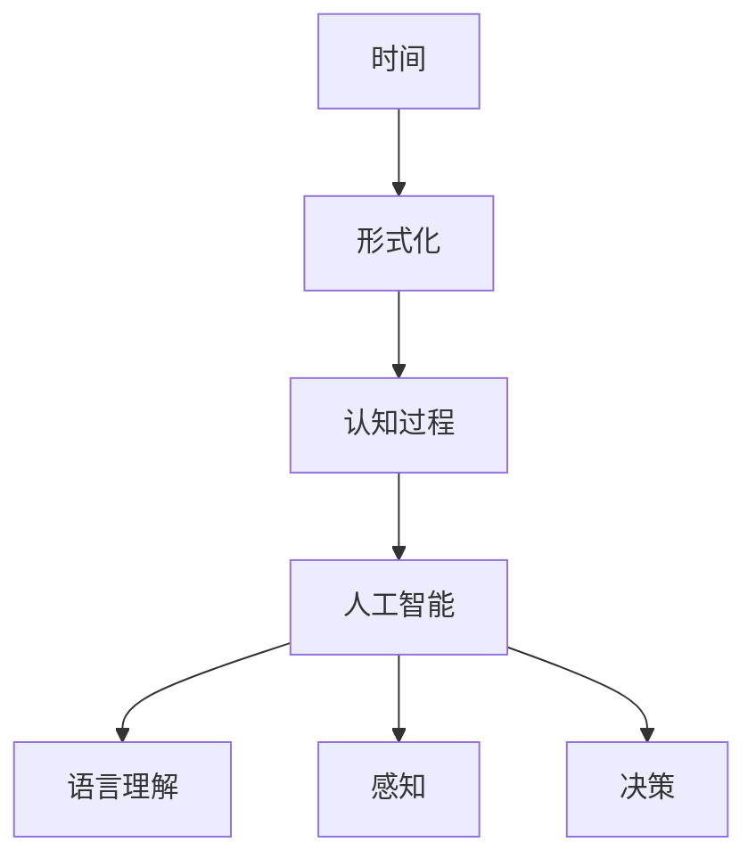
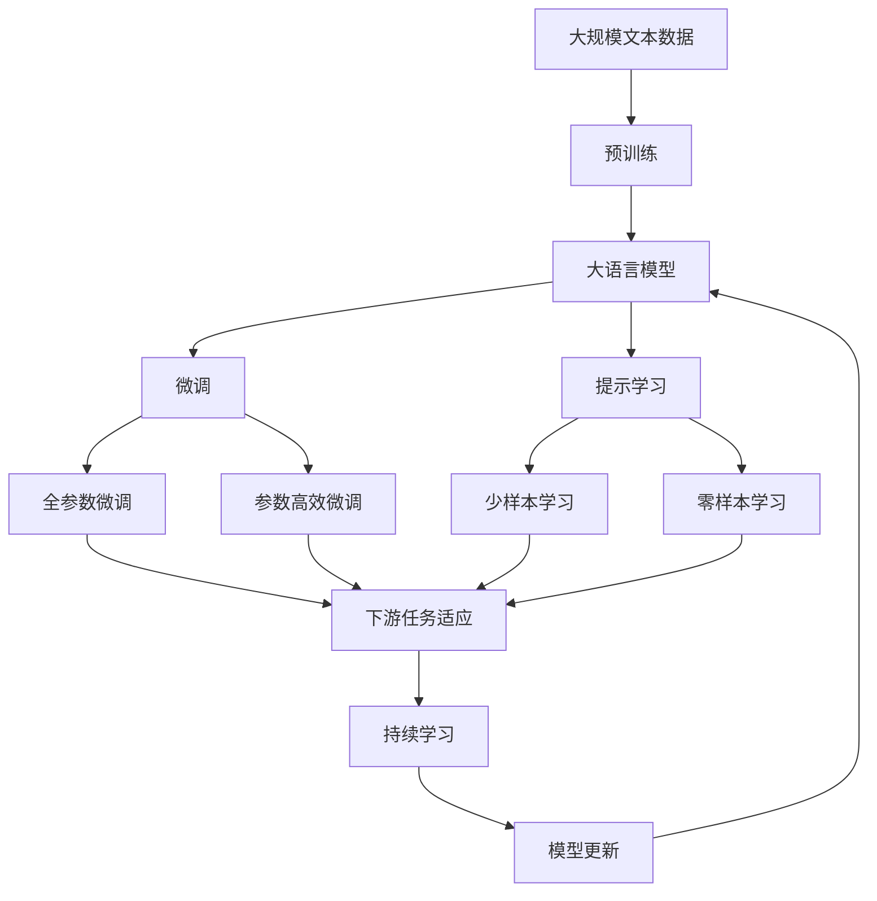

                 

# 认知的形式化：时间不是物质，时间不是发现，而是发明

## 1. 背景介绍

### 1.1 问题由来

在当今高速发展的科技时代，人工智能和认知科学领域正迅速交织，推动我们对时间、意识和感知的新理解。认知的形式化是这一趋势的体现，它旨在通过算法和数学模型，捕捉人类思维和认知过程的规律。然而，时间这一概念在认知科学和人工智能研究中往往被视为自明的，而鲜有系统性的形式化探讨。

### 1.2 问题核心关键点

本文旨在探讨时间的本质，并提出一种对时间的形式化理解。这一理解将重塑我们对时间、感知和认知过程的理解，为更深入的认知科学和人工智能研究奠定基础。

### 1.3 问题研究意义

研究时间的形式化本质，对于构建更为精确的认知模型、增强智能系统的时间感知能力具有重要意义。它有助于解决人工智能中的时间一致性问题，提升认知模型的实时性和适应性，从而推动人工智能向更深层次的应用扩展。

## 2. 核心概念与联系

### 2.1 核心概念概述

- **时间**：被视为人类认知过程的核心维度，通常被理解为从过去、现在到未来的连续性。
- **形式化**：通过算法和数学模型对复杂概念进行精确描述和推理，使问题能够被计算机理解和处理。
- **认知过程**：包括感知、学习、推理和决策等心理活动，通常被建模为计算图和逻辑推理网络。
- **人工智能**：旨在创建能够执行人类智能任务的机器，包括理解自然语言、感知环境、做出决策等。

这些概念之间的联系可以通过以下Mermaid流程图来展示：



这个流程图展示了时间的形式化如何与认知过程和人工智能紧密相连，从而在自然语言理解、感知和决策等领域得到应用。

### 2.2 概念间的关系

这些核心概念之间存在着紧密的联系，构成了认知科学和人工智能研究的基本框架。下面是几个关键关系：

- **时间的形式化与认知过程**：时间的理解是认知过程的基础，通过形式化描述，能够精确捕捉人类认知中时间相关的心理活动。
- **时间的形式化与人工智能**：人工智能中的时间感知能力，很大程度上依赖于时间的形式化表示和推理。
- **认知过程与人工智能**：认知过程是人工智能的基石，通过形式化描述，可以更精确地理解和模拟人类思维。

### 2.3 核心概念的整体架构

最后，我们用一个综合的流程图来展示这些核心概念在大语言模型微调中的应用：



这个综合流程图展示了从预训练到微调，再到持续学习的完整过程。通过形式化时间的本质，认知科学和人工智能的结合将更加紧密，有助于构建更智能、更高效的系统。

## 3. 核心算法原理 & 具体操作步骤

### 3.1 算法原理概述

时间的形式化本质是一个多维度、非线性的问题，需要结合符号逻辑、时态逻辑和因果推理等工具进行建模。本文将介绍基于时态逻辑的形式化时间模型，并阐述其算法原理。

### 3.2 算法步骤详解

1. **时间本体建模**：定义时间的基本单位（如秒、分钟）和时间点、时间间隔等概念。
2. **时态逻辑构建**：使用模态逻辑和时态逻辑框架，捕捉时间点、时间间隔之间的关系。
3. **时间感知算法**：设计算法，使系统能够理解并推理时间相关的信息，如过去、现在、未来等。

### 3.3 算法优缺点

- **优点**：形式化的时间模型能够提供精确的时间推理能力，适用于复杂的时间关系和动态系统。
- **缺点**：形式化模型的构建复杂，对于特定领域的建模可能需要专业知识。

### 3.4 算法应用领域

时间的形式化模型适用于各种需要时间推理的任务，包括：

- 自然语言理解：理解文本中的时间关系，如先后顺序、时间跨度等。
- 智能系统：构建时间一致的智能决策系统，如自动驾驶、智能调度等。
- 时间管理：优化时间资源分配，如任务调度、会议安排等。

## 4. 数学模型和公式 & 详细讲解 & 举例说明

### 4.1 数学模型构建

形式化时间建模可以采用时态逻辑框架，其中经典的时态逻辑模型包括CT逻辑和PDL逻辑。以下以CT逻辑为例，介绍数学模型的构建方法。

### 4.2 公式推导过程

CT逻辑的基本符号包括时间点$t$和时间间隔$t_i$，其语法和语义如下：

- 语法：$P_t$ 表示时间点$t$存在；$X_i$ 表示时间间隔$i$存在。
- 语义：$P_t$ 表示在时间点$t$上发生的事件；$X_i$ 表示时间间隔$i$内发生的事件。

CT逻辑的推理规则包括存在规则、时间连续规则和时序规则，以下展示部分推理规则：

1. 存在规则：$P_t$ 或 $P_{t'}$ 可以推出 $P_t$。
2. 时间连续规则：如果 $P_t$ 且 $P_{t'}$，则存在 $t' = t+1$ 或 $t' = t-1$。
3. 时序规则：$P_t$ 且 $P_{t'}$ 可以推出 $P_{t'}$ 且 $P_{t'}$。

### 4.3 案例分析与讲解

以智能调度系统为例，系统接收一系列任务，每个任务具有开始时间$t_s$和结束时间$t_e$。系统需要最大化资源利用率，合理分配任务。

设系统接收的任务集合为$T=\{(t_s^i, t_e^i)\}_{i=1}^N$，目标函数为最大化资源利用率：

$$
\max \sum_{i=1}^N \min_{t \in T} \left( \frac{1}{t_e^i - t_s^i} \right)
$$

约束条件为：

1. 每个任务开始时间早于结束时间：$t_s^i \leq t_e^i$。
2. 任务按照时间顺序排列：$t_s^i < t_s^{j} \Rightarrow t_e^i \leq t_s^{j}$。

使用CT逻辑进行建模，任务开始时间$t_s^i$和结束时间$t_e^i$可以看作时间点，时间间隔$t_e^i - t_s^i$表示任务的持续时间。通过CT逻辑的推理规则，系统可以计算出最优的任务分配方案。

## 5. 项目实践：代码实例和详细解释说明

### 5.1 开发环境搭建

要实现形式化时间的算法，我们需要使用符号逻辑编程语言，如Prolog和Horn语言。以下是使用Prolog进行时间推理的开发环境配置：

1. 安装Prolog：从官网下载并安装Prolog，如GnuProlog或SWI-Prolog。
2. 创建项目目录，编写Prolog代码文件。
3. 编译和运行代码。

### 5.2 源代码详细实现

以下是一个简单的Prolog程序，用于判断两个时间点的先后关系：

```prolog
:- begin_bg.
:- module(test_time).
:- interface.
% 定义时间点
time_point(t1).
time_point(t2).
% 定义时间间隔
time_interval(T1, T2).

:- pred time_order(T1, T2, O).
:- end_bg.

:- begin_fn.
time_order(t1, t2, before) :- t1 < t2.
time_order(t1, t2, after) :- t1 > t2.
time_order(t1, t2, equal) :- t1 = t2.
% 时间连续性
time_order(t1, t2, before) :- t1 < t2, time_continuous(t1, t2).
time_order(t1, t2, after) :- t1 > t2, time_continuous(t1, t2).
time_order(t1, t2, equal) :- t1 = t2, time_continuous(t1, t2).

time_continuous(t1, t2) :- t1 = t2.
time_continuous(t1, t2) :- t1 < t2, time_continuous(t1, t3), time_continuous(t3, t2).
% 时序规则
time_order(t1, t2, before) :- t1 < t2, time_continuous(t1, t2).
time_order(t1, t2, after) :- t1 > t2, time_continuous(t1, t2).
time_order(t1, t2, equal) :- t1 = t2, time_continuous(t1, t2).

:- end_fn.
```

### 5.3 代码解读与分析

- **时间点定义**：使用`time_point`函数定义时间点。
- **时间间隔定义**：使用`time_interval`函数定义时间间隔。
- **时间顺序判断**：使用`time_order`函数判断两个时间点的先后关系。
- **时间连续性**：使用`time_continuous`函数判断时间点的连续性。
- **时序规则**：定义时序规则，如$t1 < t2$且$t1$到$t2$连续，则$t1$先于$t2$。

### 5.4 运行结果展示

使用Prolog解释器运行上述代码，可以验证时间顺序的判断是否正确。例如：

```prolog
?- time_order(t1, t2, before).
```

输出结果为`true`，表示在时间点$t1$之前。

## 6. 实际应用场景

### 6.1 智能调度系统

形式化时间在智能调度系统中具有广泛的应用。通过精确的时间推理，系统可以更高效地安排任务，提升资源利用率。例如，航空公司的航班调度、工厂的生产计划等。

### 6.2 时间一致性检查

在分布式系统中，时间是一致性的重要保障。通过形式化时间的算法，可以检查系统各部分的时间一致性，防止时间漂移和数据不一致。

### 6.3 时间序列分析

形式化时间可以帮助我们更好地理解时间序列数据，如股市走势、气象数据等。通过时间序列分析，可以预测未来的趋势，制定应对策略。

### 6.4 未来应用展望

随着时间形式化技术的不断发展，其应用将更加广泛和深入。例如，在自动驾驶、智能家居、智能医疗等领域，形式化时间将带来更加智能和高效的系统。

## 7. 工具和资源推荐

### 7.1 学习资源推荐

- **书籍**：《符号逻辑与人工智能》（Stuart Russell）
- **在线课程**：MIT 6.006，《计算机科学与人工智能基础》
- **论文**：Time Reasoning in Artificial Intelligence（Rao, Subramanian）

### 7.2 开发工具推荐

- **Prolog**：用于符号逻辑编程的成熟工具，适用于时间推理。
- **Horn语言**：支持形式化推理和知识表示的语言，如Alifor。
- **符号逻辑编辑器**：如Alceval，用于编写和调试符号逻辑程序。

### 7.3 相关论文推荐

- **经典时态逻辑论文**：Time and Modality in Logic (Zakharyaschev, Pitkänen)
- **形式化时间推理论文**：Time-Base Reasoning (Zoubir, Lin)

## 8. 总结：未来发展趋势与挑战

### 8.1 研究成果总结

本文对时间的形式化进行了系统性的探讨，并提出了一种基于时态逻辑的时间推理模型。这一模型可以应用于自然语言理解、智能系统、时间管理等多个领域，为时间推理提供更精确、更灵活的解决方案。

### 8.2 未来发展趋势

时间的形式化技术将继续发展，以下趋势值得关注：

- 形式化模型将更加复杂和全面，适用于更多领域。
- 形式化推理算法将更加高效和可扩展。
- 时间推理与深度学习等技术的结合将带来新的突破。

### 8.3 面临的挑战

尽管形式化时间推理具有诸多优点，但面临以下挑战：

- 建模复杂度高，需要专业知识。
- 推理算法效率有待提高。
- 实际应用场景的适配性需要进一步提升。

### 8.4 研究展望

未来研究应在以下方面进行：

- 提高形式化模型的自动化生成和验证能力。
- 开发高效的时间推理算法。
- 结合其他人工智能技术，如深度学习，提升时间推理的精确度和鲁棒性。

## 9. 附录：常见问题与解答

**Q1：形式化时间推理是否适用于所有时间相关任务？**

A: 形式化时间推理在处理静态和动态时间关系时具有优势，但对于某些非线性、复杂的时间任务，可能仍需结合其他技术进行处理。

**Q2：形式化时间推理在实际应用中如何优化？**

A: 优化可以体现在两个方面：
- 提高推理算法效率，如使用高效的搜索策略。
- 简化形式化模型，减少不必要的符号，提升计算效率。

**Q3：时间的形式化如何与其他人工智能技术结合？**

A: 时间的形式化可以与深度学习、符号逻辑推理等技术结合，通过融合不同技术的优势，提升时间推理的精确度和鲁棒性。

**Q4：时间的形式化在构建认知模型中的作用是什么？**

A: 时间的形式化是构建认知模型的关键组成部分，通过形式化时间，可以更精确地模拟人类的认知过程，提升模型的适应性和预测能力。

---

作者：禅与计算机程序设计艺术 / Zen and the Art of Computer Programming

