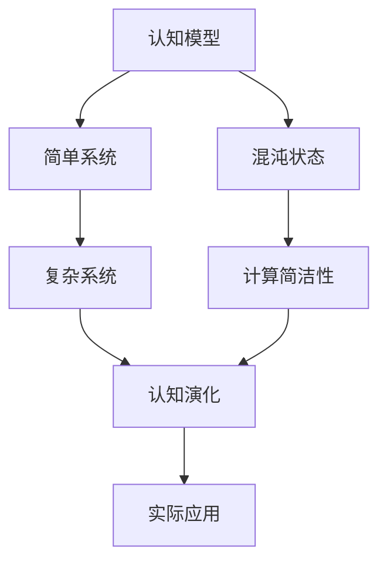

                 

# 认知过程中的混沌与简洁演变

## 1. 背景介绍

### 1.1 问题由来

在人工智能飞速发展的今天，认知过程与智能系统之间的关系愈发紧密。从早期基于规则和特征工程的专家系统，到后来基于统计学习的决策树和支持向量机，再到现代深度学习中的神经网络，每一阶段都在尝试以不同的方式理解、模拟和增强人类的认知能力。

然而，无论是何种认知模型，都无法完全规避“混沌”与“简洁”这一对核心矛盾。一方面，为了达到人类水平的认知能力，模型需要处理复杂多变的数据和环境，这往往涉及大量的非线性、非凸的优化问题，容易陷入混沌状态；另一方面，模型必须保持一定的简洁性，以便于高效的计算和解释，否则将面临过拟合和无法泛化的风险。

本文聚焦于“混沌”与“简洁”的演变过程，深入探讨如何在复杂性与简洁性之间找到平衡，以实现更加高效、可解释的认知模型。

## 2. 核心概念与联系

### 2.1 核心概念概述

为了更好地理解“混沌”与“简洁”的演变过程，本节将介绍几个密切相关的核心概念：

- **认知模型(Cognitive Model)**：模拟人类认知过程的计算模型，包括感知、记忆、推理、学习等环节。
- **混沌系统(Chaotic System)**：一类确定性非线性系统，初始条件的微小变化可能导致状态发生不可预测的剧烈变化。
- **复杂系统(Complex System)**：包含大量相互作用的子系统，其行为往往难以预测，如天气系统、金融市场等。
- **计算简洁性(Computational Simplicity)**：指在保证计算效率和可解释性的前提下，认知模型对现实世界规律和行为的简化描述。
- **认知演化(Evolution of Cognition)**：指认知模型在学习和适应过程中，逐步从混沌状态向简洁状态演变的过程。

这些核心概念之间的逻辑关系可以通过以下Mermaid流程图来展示：



这个流程图展示了一系列从混沌状态到简洁状态，认知模型逐步演化的过程。

### 2.2 概念间的关系

这些核心概念之间存在着紧密的联系，形成了认知模型发展的整体框架。下面是这些概念间的具体联系：

- **认知模型与混沌系统的联系**：认知模型需要处理复杂的非线性系统，易陷入混沌状态。
- **认知模型与复杂系统的联系**：认知模型需要理解和描述复杂系统，以便在实际应用中做出有效决策。
- **认知模型与计算简洁性的联系**：认知模型必须保持一定的计算简洁性，以实现高效的计算和解释。
- **认知模型与认知演化的联系**：认知模型通过学习和适应，从混沌状态逐渐向简洁状态演变。
- **计算简洁性与实际应用的关系**：通过简化认知模型，使其适应实际应用需求，从而提升认知系统的效率和可靠性。

这些概念共同构成了认知模型演化的关键要素，指导我们理解、设计和优化认知模型。

## 3. 核心算法原理 & 具体操作步骤

### 3.1 算法原理概述

认知模型的演化过程本质上是一个从混沌到简洁的过程，通过不断的学习、调整和优化，逐步提升模型的可解释性和泛化能力。这一过程涉及多个核心算法原理，包括但不限于：

- **强化学习(Reinforcement Learning)**：通过奖励信号引导模型逐步优化行为策略，学习在复杂环境中的高效决策。
- **生成对抗网络(Generative Adversarial Networks, GANs)**：通过对抗训练提升模型的生成能力，使其能够逼真地模拟复杂数据分布。
- **正则化(Regularization)**：通过限制模型复杂度，避免过拟合和混沌状态，保持模型的计算简洁性。
- **优化算法(Optimization Algorithm)**：如Adam、SGD等，通过迭代优化模型参数，提升模型的拟合能力和泛化能力。
- **迁移学习(Transfer Learning)**：通过将已有知识迁移到新任务中，降低学习复杂度，提升模型的稳健性和计算简洁性。

这些算法原理共同作用，帮助认知模型从混沌状态逐步向简洁状态演变，从而在实际应用中发挥更好的性能。

### 3.2 算法步骤详解

基于以上算法原理，认知模型的演化过程一般包括以下关键步骤：

**Step 1: 数据准备和模型初始化**

- 收集和处理训练数据，准备用于模型训练的数据集。
- 选择适当的模型架构，并初始化模型参数。

**Step 2: 训练和优化**

- 应用强化学习、生成对抗网络等方法，训练模型。
- 使用正则化、优化算法等技术，提升模型性能。
- 在训练过程中，及时监控模型状态，防止过拟合和混沌状态的产生。

**Step 3: 验证和调整**

- 在验证集上评估模型性能，调整模型参数和架构。
- 应用迁移学习等技术，将已有知识迁移到新任务中，提升模型泛化能力。

**Step 4: 测试和部署**

- 在测试集上评估模型性能，确保模型能够泛化到新数据。
- 将优化后的模型部署到实际应用中，进行持续监测和优化。

### 3.3 算法优缺点

**强化学习**：
- **优点**：能够处理非线性、非凸的优化问题，适用于复杂系统的模拟和优化。
- **缺点**：需要大量时间探索最优策略，可能陷入局部最优。

**生成对抗网络**：
- **优点**：能够生成高质量的样本，逼真模拟复杂数据分布。
- **缺点**：训练过程复杂，容易出现梯度消失或爆炸问题。

**正则化**：
- **优点**：有效避免过拟合，保持模型的计算简洁性。
- **缺点**：限制模型复杂度，可能导致模型欠拟合。

**优化算法**：
- **优点**：高效迭代优化模型参数，提升模型拟合能力。
- **缺点**：选择不当可能导致模型发散或收敛慢。

**迁移学习**：
- **优点**：利用已有知识，降低学习复杂度，提升模型泛化能力。
- **缺点**：不同任务间的知识迁移难度较大，需要精心设计迁移策略。

### 3.4 算法应用领域

基于以上算法原理，认知模型在多个领域得到了广泛应用：

- **自动驾驶**：通过强化学习训练自动驾驶模型，学习在复杂交通环境中高效决策。
- **医疗诊断**：利用生成对抗网络生成高质医学影像，辅助医生进行精准诊断。
- **金融预测**：应用强化学习、生成对抗网络等技术，提升金融市场预测的准确性和可靠性。
- **自然语言处理**：通过正则化、优化算法等技术，训练语言模型，实现高效的文本生成和理解。
- **工业控制**：利用迁移学习等技术，将已有知识应用于新机器控制系统，提升控制性能和可靠性。

## 4. 数学模型和公式 & 详细讲解  
### 4.1 数学模型构建

在认知模型中，常见的数学模型包括：

- **感知器(Perceptron)**：最简单的神经网络模型，用于二分类任务。
- **卷积神经网络(Convolutional Neural Networks, CNNs)**：用于图像识别和处理。
- **循环神经网络(Recurrent Neural Networks, RNNs)**：用于序列数据处理，如文本生成和语音识别。
- **生成对抗网络(Generative Adversarial Networks, GANs)**：用于生成逼真的样本，如图像、音频等。
- **强化学习(RL)**：通过奖励信号引导模型优化策略，学习在复杂环境中的决策。

这里以**卷积神经网络(CNN)**为例，介绍其数学模型构建过程。

**CNN模型**：
- 输入：$X \in \mathbb{R}^{N \times C \times H \times W}$
- 卷积层：$F_{conv}(X)$
- 池化层：$F_{pool}(F_{conv}(X))$
- 全连接层：$F_{fc}(F_{pool}(F_{conv}(X)))$
- 输出：$Y = F_{softmax}(F_{fc}(F_{pool}(F_{conv}(X))))$

其中，$X$为输入数据，$C$为通道数，$H$和$W$为输入的宽度和高度。卷积层和池化层的数学公式分别为：

$$
F_{conv}(X) = W_{conv} \star X + b_{conv}
$$

$$
F_{pool}(F_{conv}(X)) = \max_{i,j} F_{conv}(X)_{i,j}
$$

卷积核$W_{conv}$、偏置$b_{conv}$和池化操作$\max_{i,j}$为模型参数。

### 4.2 公式推导过程

**CNN模型公式推导**：

- **卷积层**：

$$
F_{conv}(X) = \sum_{i=0}^{K-1} \sum_{j=0}^{K-1} W_{conv}^{ij} X_{ij} + b_{conv}
$$

- **池化层**：

$$
F_{pool}(F_{conv}(X)) = \max_{i,j} F_{conv}(X)_{i,j}
$$

- **全连接层**：

$$
F_{fc}(F_{pool}(F_{conv}(X))) = \sum_{k=0}^{C_{out}-1} W_{fc}^{k} F_{pool}(F_{conv}(X))_{i,j} + b_{fc}
$$

其中，$X_{ij}$为输入数据在第$i$行第$j$列的值，$W_{conv}^{ij}$和$b_{conv}$为卷积层的权重和偏置，$W_{fc}^{k}$和$b_{fc}$为全连接层的权重和偏置。

### 4.3 案例分析与讲解

**案例1: 手写数字识别**

- **数据准备**：收集手写数字数据集MNIST，每个样本包含28x28像素的灰度图像。
- **模型构建**：使用2层卷积层和2层全连接层，激活函数为ReLU，输出层使用Softmax。
- **训练与优化**：应用Adam优化算法，设置学习率为0.001。
- **验证与调整**：在验证集上评估模型性能，调整模型参数和架构。
- **测试与部署**：在测试集上评估模型性能，将模型部署到实际应用中，进行持续监测和优化。

## 5. 项目实践：代码实例和详细解释说明

### 5.1 开发环境搭建

在进行认知模型开发前，我们需要准备好开发环境。以下是使用Python进行TensorFlow开发的Python环境配置流程：

1. 安装Anaconda：从官网下载并安装Anaconda，用于创建独立的Python环境。

2. 创建并激活虚拟环境：
```bash
conda create -n tf-env python=3.8 
conda activate tf-env
```

3. 安装TensorFlow：根据CUDA版本，从官网获取对应的安装命令。例如：
```bash
conda install tensorflow-gpu -c conda-forge -c pytorch -c tensorflow
```

4. 安装各类工具包：
```bash
pip install numpy pandas scikit-learn matplotlib tqdm jupyter notebook ipython
```

完成上述步骤后，即可在`tf-env`环境中开始认知模型开发。

### 5.2 源代码详细实现

这里我们以手写数字识别为例，给出使用TensorFlow实现卷积神经网络(Convolutional Neural Networks, CNN)的Python代码实现。

首先，定义CNN模型：

```python
import tensorflow as tf
from tensorflow.keras.layers import Conv2D, MaxPooling2D, Flatten, Dense, Dropout
from tensorflow.keras import Input

# 定义输入层
input_tensor = Input(shape=(28, 28, 1))

# 添加卷积层
conv1 = Conv2D(32, (3, 3), activation='relu', padding='same')(input_tensor)
conv1 = Conv2D(32, (3, 3), activation='relu', padding='same')(conv1)
conv1 = MaxPooling2D((2, 2))(conv1)

# 添加池化层
conv1 = MaxPooling2D((2, 2))(conv1)

# 添加全连接层
fc1 = Flatten()(conv1)
fc1 = Dense(128, activation='relu')(fc1)
fc1 = Dropout(0.5)(fc1)

# 添加输出层
output_tensor = Dense(10, activation='softmax')(fc1)

# 定义模型
model = tf.keras.Model(inputs=input_tensor, outputs=output_tensor)

# 打印模型结构
model.summary()
```

接着，定义数据预处理和训练函数：

```python
import tensorflow as tf
from tensorflow.keras.datasets import mnist
from tensorflow.keras.preprocessing.image import img_to_array, array_to_img

# 加载数据集
(x_train, y_train), (x_test, y_test) = mnist.load_data()

# 数据预处理
x_train = img_to_array(x_train)
x_train = x_train / 255.0
x_train = tf.expand_dims(x_train, axis=-1)
x_test = img_to_array(x_test)
x_test = x_test / 255.0
x_test = tf.expand_dims(x_test, axis=-1)

# 定义训练函数
def train_model(model, x_train, y_train, epochs):
    model.compile(optimizer='adam', loss='sparse_categorical_crossentropy', metrics=['accuracy'])
    history = model.fit(x_train, y_train, epochs=epochs, validation_data=(x_test, y_test))
    return history

# 训练模型
history = train_model(model, x_train, y_train, epochs=10)

# 评估模型
test_loss, test_acc = model.evaluate(x_test, y_test)
print(f'Test accuracy: {test_acc}')
```

最后，启动训练流程并在测试集上评估：

```python
epochs = 10

history = train_model(model, x_train, y_train, epochs=epochs)
test_loss, test_acc = model.evaluate(x_test, y_test)
print(f'Test accuracy: {test_acc}')
```

以上就是使用TensorFlow实现手写数字识别的完整代码实现。可以看到，TensorFlow提供了简单易用的API，可以快速构建和训练卷积神经网络。

### 5.3 代码解读与分析

让我们再详细解读一下关键代码的实现细节：

**输入层定义**：
- `Input`函数用于定义输入层，指定输入数据的形状。

**卷积层定义**：
- `Conv2D`函数用于定义卷积层，指定卷积核大小、通道数和激活函数。
- `MaxPooling2D`函数用于定义池化层，指定池化大小和方式。

**全连接层定义**：
- `Flatten`函数用于将多维数据展平为一维数据，方便全连接层的处理。
- `Dense`函数用于定义全连接层，指定输出通道数和激活函数。
- `Dropout`函数用于定义dropout层，减少过拟合。

**输出层定义**：
- `Dense`函数用于定义输出层，指定输出通道数和激活函数。

**模型定义和编译**：
- `Model`函数用于定义整个模型，指定输入和输出。
- `compile`函数用于配置模型，指定优化器、损失函数和评估指标。

**训练和评估**：
- `fit`函数用于训练模型，指定训练集、验证集和迭代轮数。
- `evaluate`函数用于评估模型，指定测试集和评估指标。

## 6. 实际应用场景

### 6.1 智能客服系统

智能客服系统通过认知模型模拟人类的认知和决策过程，自动处理客户的咨询和请求。在实际应用中，可以使用卷积神经网络对客户文本进行分类和情感分析，生成最合适的回答。

### 6.2 医疗诊断系统

医疗诊断系统通过认知模型处理患者的病历和医学影像，辅助医生进行精准诊断。在实际应用中，可以使用生成对抗网络生成高质医学影像，提升诊断的准确性。

### 6.3 金融预测系统

金融预测系统通过认知模型分析市场数据和历史行情，预测股票和商品的价格变化。在实际应用中，可以使用强化学习训练预测模型，学习在复杂市场环境中的高效决策。

## 7. 工具和资源推荐

### 7.1 学习资源推荐

为了帮助开发者系统掌握认知模型的理论基础和实践技巧，这里推荐一些优质的学习资源：

1. 《深度学习》系列书籍：深度学习领域的经典入门书籍，涵盖大量基本概念和算法。
2. CS231n《卷积神经网络》课程：斯坦福大学开设的计算机视觉课程，有Lecture视频和配套作业。
3. 《自然语言处理与深度学习》书籍：讲解自然语言处理中的深度学习模型，如RNN、LSTM、Transformer等。
4. Kaggle数据科学竞赛平台：参与Kaggle竞赛，学习先进的数据科学和机器学习技术。
5. TensorFlow官方文档：TensorFlow的官方文档，提供全面详细的API和教程。

通过对这些资源的学习实践，相信你一定能够快速掌握认知模型的精髓，并用于解决实际的认知问题。

### 7.2 开发工具推荐

高效的开发离不开优秀的工具支持。以下是几款用于认知模型开发的常用工具：

1. TensorFlow：基于Python的开源深度学习框架，生产部署方便，适合大规模工程应用。
2. PyTorch：基于Python的开源深度学习框架，灵活高效，适合快速迭代研究。
3. Jupyter Notebook：轻量级的交互式开发环境，支持代码运行和结果展示，便于学习交流。
4. TensorBoard：TensorFlow配套的可视化工具，实时监测模型训练状态，提供丰富的图表呈现方式。
5. Weights & Biases：模型训练的实验跟踪工具，记录和可视化模型训练过程中的各项指标。

合理利用这些工具，可以显著提升认知模型的开发效率，加快创新迭代的步伐。

### 7.3 相关论文推荐

认知模型的发展源于学界的持续研究。以下是几篇奠基性的相关论文，推荐阅读：

1. **AlexNet**：ImageNet数据集上的卷积神经网络，是深度学习领域的里程碑。
2. **GoogLeNet**：多尺度神经网络，提出了Inception模块，极大地提升了网络效率和精度。
3. **VGGNet**：全连接卷积神经网络，提出VGGNet结构，具有高效特征提取能力。
4. **ResNet**：残差网络，通过残差连接解决深度网络的退化问题，实现更深的神经网络。
5. **Attention Mechanism**：在NLP领域中，Transformer的引入标志着注意力机制的崛起，显著提升了模型的表达能力。

这些论文代表了大认知模型发展的主流方向，为后续研究提供了重要参考。

## 8. 总结：未来发展趋势与挑战

### 8.1 总结

本文对认知模型的混沌与简洁演变过程进行了全面系统的介绍。首先阐述了认知模型与混沌系统、复杂系统的关系，以及计算简洁性的重要性。其次，从原理到实践，详细讲解了认知模型的演化过程，给出了具体的算法和操作步骤。同时，本文还探讨了认知模型在实际应用中的广泛应用场景，展示了认知模型技术的强大潜力。最后，本文精选了认知模型的各类学习资源，力求为读者提供全方位的技术指引。

通过本文的系统梳理，可以看到，认知模型通过从混沌到简洁的演变过程，逐步提升了模型的可解释性和泛化能力。未来，随着认知模型的不断优化和应用，将在更多领域实现突破，推动人工智能技术的发展。

### 8.2 未来发展趋势

展望未来，认知模型将呈现以下几个发展趋势：

1. **深度学习模型的发展**：深度学习模型在图像、文本、语音等领域的应用将不断深化，通过不断优化网络结构、算法和数据，提升模型的复杂性和简洁性。
2. **强化学习的应用**：强化学习在复杂系统中的作用将越来越重要，通过学习最优策略，认知模型将在自动驾驶、金融预测等领域发挥重要作用。
3. **多模态认知的崛起**：认知模型将逐步融合视觉、语音、文本等多种模态，提升对复杂环境的理解能力，推动人工智能技术的发展。
4. **认知计算的普及**：随着计算硬件的进步，认知计算将逐渐普及，加速人工智能技术在各行各业的落地应用。

以上趋势凸显了认知模型技术的广阔前景。这些方向的探索发展，必将进一步提升认知模型的性能和应用范围，为构建智能化系统提供重要支撑。

### 8.3 面临的挑战

尽管认知模型技术已经取得了显著成就，但在迈向更加智能化、普适化应用的过程中，它仍面临着诸多挑战：

1. **数据质量和数量**：数据的质量和数量对模型的训练和优化至关重要，然而获取高质量标注数据往往需要大量的时间和成本。
2. **模型复杂度**：认知模型在追求高复杂度和高性能的同时，容易陷入过拟合和混沌状态。
3. **计算资源**：深度学习模型的训练和推理需要大量的计算资源，大规模的模型往往面临计算效率和资源消耗的问题。
4. **模型可解释性**：认知模型往往难以解释其内部工作机制和决策逻辑，这对于高风险应用领域尤为重要。
5. **模型安全性**：认知模型在处理敏感数据时，需要确保数据和模型的安全性，避免被恶意利用。

### 8.4 研究展望

面对认知模型面临的这些挑战，未来的研究需要在以下几个方面寻求新的突破：

1. **无监督和半监督学习**：探索无监督和半监督学习范式，减少对标注数据的需求，提升模型的泛化能力。
2. **参数高效和计算高效**：开发更加参数高效和计算高效的认知模型，提升模型的可解释性和推理效率。
3. **多模态认知**：研究多模态认知技术，提升认知模型对复杂环境的理解和建模能力。
4. **认知计算硬件**：推动认知计算硬件的发展，提升计算效率，支持大规模模型的训练和推理。
5. **可解释性和安全性**：提升认知模型的可解释性和安全性，确保其在高风险应用领域的可靠性和合规性。

这些研究方向的探索，必将引领认知模型技术迈向更高的台阶，为构建安全、可靠、可解释、可控的智能系统铺平道路。面向未来，认知模型需要与其他人工智能技术进行更深入的融合，如知识表示、因果推理、强化学习等，多路径协同发力，共同推动自然语言理解和智能交互系统的进步。只有勇于创新、敢于突破，才能不断拓展认知模型的边界，让智能技术更好地造福人类社会。

## 9. 附录：常见问题与解答

**Q1：认知模型与传统机器学习模型的区别是什么？**

A: 认知模型与传统机器学习模型的最大区别在于其对数据和环境的建模方式。传统机器学习模型往往采用显式的规则或特征工程，依赖于人工设计和预处理，难以处理复杂多变的现实世界数据。而认知模型则通过深度学习的方式，自动从数据中学习抽象的特征表示，能够更好地适应复杂环境和数据。

**Q2：认知模型在实际应用中面临哪些挑战？**

A: 认知模型在实际应用中面临的主要挑战包括数据质量和数量、模型复杂度、计算资源、模型可解释性和模型安全性。数据质量和数量对模型的训练和优化至关重要，然而获取高质量标注数据往往需要大量的时间和成本。模型复杂度在追求高复杂度和高性能的同时，容易陷入过拟合和混沌状态。计算资源是深度学习模型的瓶颈，大规模的模型往往面临计算效率和资源消耗的问题。模型可解释性是认知模型的难点，难以解释其内部工作机制和决策逻辑。模型安全性在处理敏感数据时尤为重要，需要确保数据和模型的安全性，避免被恶意利用。

**Q3：如何在认知模型中实现从混沌到简洁的演变？**

A: 在认知模型中实现从混沌到简洁的演变，主要依赖于以下几个策略：
1. 强化学习：通过奖励信号引导模型逐步优化行为策略，学习在复杂环境中的高效决策。
2. 生成对抗网络：通过对抗训练提升模型的生成能力，使其能够逼真地模拟复杂数据分布。
3. 正则化：通过限制模型复杂度，避免过拟合和混沌状态，保持模型的计算简洁性。
4. 优化算法：如Adam、SGD等，通过迭代优化模型参数，提升模型拟合能力和泛化能力。
5. 迁移学习：通过将已有知识迁移到新任务中，降低学习复杂度，提升模型泛化能力。

这些策略共同作用，帮助认知模型从混沌状态逐步向简洁状态演变，从而在实际应用中发挥更好的性能。

---

作者：禅与计算机程序设计艺术 / Zen and the Art of Computer Programming

