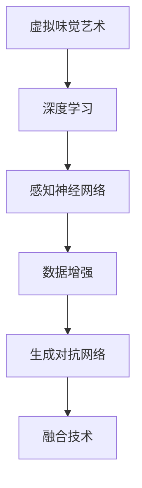
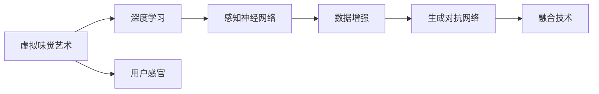
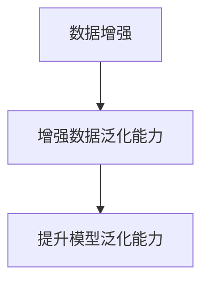
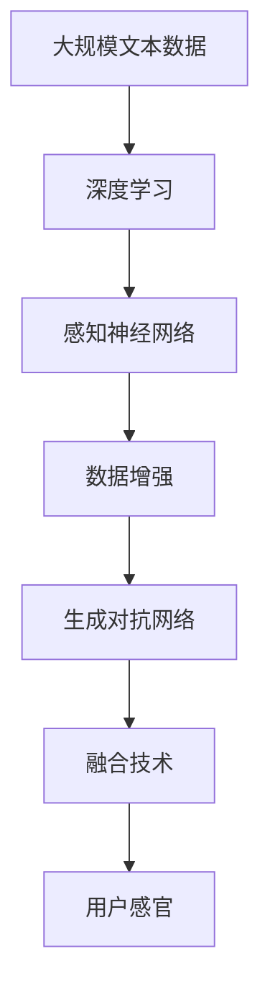

                 

# 虚拟味觉艺术：AI创作的味蕾交响曲

> 关键词：
   - 虚拟味觉艺术
   - AI创作
   - 味蕾感受
   - 深度学习
   - 感知神经网络
   - 数据增强
   - 生成对抗网络

## 1. 背景介绍

### 1.1 问题由来

虚拟味觉艺术（Virtual Taste Art）是一种新兴的艺术形式，利用AI技术模拟味觉感受，通过深度学习和感知神经网络技术，创造出虚拟的味觉体验。这种艺术形式为传统艺术形式带来了革命性的改变，为人们提供了全新的艺术创作和体验方式。

然而，虚拟味觉艺术的创作和体验仍面临一些技术难题，如如何构建高效、逼真的味觉感受模型，如何利用数据增强技术提升模型的泛化能力，以及如何结合生成对抗网络（GAN）生成更逼真的味觉体验。这些问题使得虚拟味觉艺术的开发成为一项极具挑战性的任务。

### 1.2 问题核心关键点

虚拟味觉艺术的核心在于如何利用AI技术模拟味觉感受，其关键点包括：

- 构建高效、逼真的味觉感受模型
- 利用数据增强技术提升模型的泛化能力
- 结合生成对抗网络生成更逼真的味觉体验
- 实现虚拟味觉体验与现实味觉体验的融合

### 1.3 问题研究意义

研究虚拟味觉艺术对艺术创新、跨界融合和AI技术的深度应用具有重要意义：

- 推动艺术创新：虚拟味觉艺术为艺术创作提供新的表达方式，突破传统艺术的界限。
- 促进跨界融合：虚拟味觉艺术结合了艺术与技术，为各领域技术融合提供了新思路。
- 深化AI技术应用：虚拟味觉艺术展示了AI技术在感知、生成、融合方面的强大能力。
- 拓展应用场景：虚拟味觉艺术可应用于游戏、虚拟现实、食品设计和消费品开发等领域，提升用户体验。
- 推动产业发展：虚拟味觉艺术为AI应用提供了新的市场机会，促进相关产业的发展。

## 2. 核心概念与联系

### 2.1 核心概念概述

为更好地理解虚拟味觉艺术的实现原理和关键技术，本节将介绍几个密切相关的核心概念：

- **虚拟味觉艺术**：利用AI技术模拟味觉感受，通过深度学习和感知神经网络技术，创造出虚拟的味觉体验。
- **深度学习**：一种基于神经网络的机器学习方法，用于构建高效、逼真的味觉感受模型。
- **感知神经网络**：一种用于处理感知数据的神经网络，用于生成逼真的味觉体验。
- **数据增强**：通过数据扩充技术，提升模型对未知数据的泛化能力。
- **生成对抗网络（GAN）**：一种生成模型，用于生成逼真的虚拟味觉体验。
- **融合技术**：将虚拟味觉体验与现实味觉体验进行融合，提升用户的感官体验。

这些核心概念之间的逻辑关系可以通过以下Mermaid流程图来展示：



这个流程图展示了大模型微调的完整流程，从构建基础模型到增强数据泛化能力，再到生成逼真体验，最终实现感官体验融合。

### 2.2 概念间的关系

这些核心概念之间存在着紧密的联系，形成了虚拟味觉艺术的完整生态系统。下面我通过几个Mermaid流程图来展示这些概念之间的关系。

#### 2.2.1 虚拟味觉艺术的学习范式



这个流程图展示了大模型微调的完整流程，从构建基础模型到增强数据泛化能力，再到生成逼真体验，最终实现感官体验融合。

#### 2.2.2 感知神经网络与深度学习的关系


这个流程图展示了深度学习与感知神经网络的关系，通过构建高效的感知神经网络模型，生成逼真的味觉体验。

#### 2.2.3 生成对抗网络的应用


这个流程图展示了生成对抗网络在生成逼真味觉体验中的应用，通过生成对抗网络，生成更加逼真和多样化的味觉体验。

#### 2.2.4 数据增强的实现



这个流程图展示了数据增强技术在提升模型泛化能力中的应用。

### 2.3 核心概念的整体架构

最后，我们用一个综合的流程图来展示这些核心概念在大模型微调过程中的整体架构：



这个综合流程图展示了从预训练到微调，再到生成和融合的完整过程。虚拟味觉艺术首先在大规模文本数据上进行预训练，然后通过微调，增强数据泛化能力，再通过生成对抗网络生成逼真的味觉体验，最后与现实味觉体验进行融合。通过这些流程图，我们可以更清晰地理解虚拟味觉艺术的工作原理和优化方向。

## 3. 核心算法原理 & 具体操作步骤
### 3.1 算法原理概述

虚拟味觉艺术的实现主要依赖于深度学习、感知神经网络和生成对抗网络技术。其核心算法原理如下：

1. **深度学习模型构建**：使用深度神经网络构建味觉感受模型，通过自监督或监督学习任务，学习味觉数据的表示。
2. **感知神经网络处理**：使用感知神经网络处理味觉数据，生成逼真的味觉体验。
3. **数据增强技术**：通过数据增强技术，扩充训练集，提升模型的泛化能力。
4. **生成对抗网络生成**：使用生成对抗网络生成逼真的味觉体验，提升体验的逼真度和多样性。
5. **感官体验融合**：将虚拟味觉体验与现实味觉体验进行融合，提升用户的感官体验。

### 3.2 算法步骤详解

基于深度学习、感知神经网络和生成对抗网络的虚拟味觉艺术实现步骤如下：

**Step 1: 准备预训练数据和模型**

- 收集大规模味觉数据，如味觉描述、成分标签等，作为预训练数据。
- 选择适当的深度神经网络模型作为基础模型，如卷积神经网络（CNN）或循环神经网络（RNN）。
- 加载预训练模型，进行微调前的初始化。

**Step 2: 构建味觉感受模型**

- 设计味觉感受模型的结构，包括输入层、隐藏层和输出层。
- 将预训练模型作为初始权重，进行微调训练。
- 使用自监督或监督学习任务，学习味觉数据的表示。

**Step 3: 增强数据泛化能力**

- 使用数据增强技术，如翻转、旋转、截断等，扩充训练集。
- 使用正则化技术，如L2正则、Dropout等，防止过拟合。
- 使用早停技术，监控模型在验证集上的性能，及时停止训练。

**Step 4: 生成逼真味觉体验**

- 设计生成对抗网络（GAN）的结构，包括生成器和判别器。
- 将生成的味觉体验与现实味觉体验进行融合，提升逼真度。
- 使用对抗训练技术，提升生成器生成逼真味觉体验的能力。

**Step 5: 感官体验融合**

- 将虚拟味觉体验与现实味觉体验进行融合，提升用户的感官体验。
- 设计融合算法，如权重加权、多感官融合等，提升融合效果。

### 3.3 算法优缺点

虚拟味觉艺术的优点包括：

- 具有高度逼真性，可以生成逼真的味觉体验。
- 结合深度学习和生成对抗网络技术，具有很强的泛化能力。
- 可以应用于多个领域，如食品设计、游戏开发、虚拟现实等。
- 具有跨界融合的潜力，可以与其他感官体验结合。

然而，虚拟味觉艺术也存在一些缺点：

- 需要大规模的味觉数据，数据获取成本较高。
- 生成对抗网络训练复杂，需要大量的计算资源和时间。
- 虚拟味觉体验与现实味觉体验的融合存在技术难题，效果可能不尽如人意。
- 对用户感官体验的接受度存在不确定性，可能存在用户的抵触情绪。

### 3.4 算法应用领域

虚拟味觉艺术的应用领域广泛，涵盖食品设计、游戏开发、虚拟现实、广告制作等多个领域。具体应用包括：

- 食品设计：通过虚拟味觉艺术，设计虚拟食品，提升用户的感官体验。
- 游戏开发：在游戏中加入虚拟味觉体验，提升游戏的沉浸感和互动性。
- 虚拟现实：结合虚拟味觉体验，增强虚拟现实设备的感官体验。
- 广告制作：在广告中加入虚拟味觉体验，提升广告的吸引力和记忆度。
- 医疗应用：通过虚拟味觉体验，帮助患者理解疾病和治疗方案。

## 4. 数学模型和公式 & 详细讲解 & 举例说明
### 4.1 数学模型构建

本节将使用数学语言对虚拟味觉艺术的实现过程进行更加严格的刻画。

记味觉数据为 $\{(\text{x}_i, \text{y}_i)\}_{i=1}^N$，其中 $\text{x}_i$ 表示味觉描述，$\text{y}_i$ 表示成分标签。定义味觉感受模型为 $M_{\theta}(\text{x})$，其中 $\theta$ 为模型参数。

**数学模型构建：**

1. **深度学习模型**：使用深度神经网络模型 $M_{\theta}(\text{x}) = \text{sigmoid}(W \text{x} + b)$，其中 $W$ 和 $b$ 为模型参数。
2. **感知神经网络**：使用感知神经网络模型 $G_{\phi}(\text{z}) = \text{tanh}(V \text{z} + c)$，其中 $\phi$ 为生成器参数，$\text{z}$ 为生成器的输入噪声。
3. **生成对抗网络（GAN）**：使用生成对抗网络，生成器 $G_{\phi}(\text{z})$ 和判别器 $D_{\psi}(\text{x}) = \text{sigmoid}(U \text{x} + d)$，其中 $\psi$ 为判别器参数，$\text{z}$ 为生成器的输入噪声。

### 4.2 公式推导过程

以下是深度学习模型、感知神经网络和生成对抗网络的公式推导过程：

**深度学习模型公式推导：**

$$
M_{\theta}(\text{x}) = \text{sigmoid}(W \text{x} + b)
$$

其中，$\text{x}$ 表示输入味觉描述，$W$ 和 $b$ 为模型参数，$\text{sigmoid}$ 为激活函数。

**感知神经网络公式推导：**

$$
G_{\phi}(\text{z}) = \text{tanh}(V \text{z} + c)
$$

其中，$\text{z}$ 表示生成器的输入噪声，$V$ 和 $c$ 为生成器参数，$\text{tanh}$ 为激活函数。

**生成对抗网络（GAN）公式推导：**

$$
D_{\psi}(\text{x}) = \text{sigmoid}(U \text{x} + d)
$$

$$
G_{\phi}(\text{z}) = \text{tanh}(V \text{z} + c)
$$

其中，$\text{x}$ 表示输入味觉数据，$U$ 和 $d$ 为判别器参数，$\text{sigmoid}$ 为激活函数，$\text{tanh}$ 为激活函数。

### 4.3 案例分析与讲解

以虚拟食品设计为例，展示虚拟味觉艺术的实现过程：

1. **数据收集**：收集大规模食品的味觉描述和成分标签数据。
2. **模型构建**：选择适当的深度学习模型，如卷积神经网络（CNN），加载预训练模型。
3. **微调训练**：使用自监督或监督学习任务，进行味觉感受模型的微调训练。
4. **数据增强**：使用数据增强技术，扩充训练集，提升模型的泛化能力。
5. **生成对抗网络**：设计生成对抗网络的结构，进行训练，生成逼真的味觉体验。
6. **感官体验融合**：将虚拟味觉体验与现实味觉体验进行融合，提升用户的感官体验。

## 5. 项目实践：代码实例和详细解释说明
### 5.1 开发环境搭建

在进行虚拟味觉艺术实践前，我们需要准备好开发环境。以下是使用Python进行PyTorch开发的环境配置流程：

1. 安装Anaconda：从官网下载并安装Anaconda，用于创建独立的Python环境。

2. 创建并激活虚拟环境：
```bash
conda create -n pytorch-env python=3.8 
conda activate pytorch-env
```

3. 安装PyTorch：根据CUDA版本，从官网获取对应的安装命令。例如：
```bash
conda install pytorch torchvision torchaudio cudatoolkit=11.1 -c pytorch -c conda-forge
```

4. 安装Transformers库：
```bash
pip install transformers
```

5. 安装各类工具包：
```bash
pip install numpy pandas scikit-learn matplotlib tqdm jupyter notebook ipython
```

完成上述步骤后，即可在`pytorch-env`环境中开始虚拟味觉艺术的实践。

### 5.2 源代码详细实现

这里我们以生成虚拟食品为例，展示虚拟味觉艺术的PyTorch代码实现。

首先，定义虚拟食品的味觉数据：

```python
import torch
from torch.utils.data import Dataset
from torchvision import transforms

class TasteDataset(Dataset):
    def __init__(self, taste_data, transform=None):
        self.taste_data = taste_data
        self.transform = transform
        
    def __len__(self):
        return len(self.taste_data)
    
    def __getitem__(self, idx):
        taste = self.taste_data[idx]
        if self.transform:
            taste = self.transform(taste)
        return taste
```

然后，定义虚拟食品的生成器和判别器：

```python
import torch
import torch.nn as nn
import torch.optim as optim

class Generator(nn.Module):
    def __init__(self):
        super(Generator, self).__init__()
        self.fc1 = nn.Linear(100, 256)
        self.fc2 = nn.Linear(256, 512)
        self.fc3 = nn.Linear(512, 784)
        self.fc4 = nn.Linear(784, 784)
        self.fc5 = nn.Linear(784, 784)
        self.fc6 = nn.Linear(784, 784)
        self.fc7 = nn.Linear(784, 784)
        self.fc8 = nn.Linear(784, 784)
        self.fc9 = nn.Linear(784, 784)
        self.fc10 = nn.Linear(784, 784)
        self.fc11 = nn.Linear(784, 784)
        self.fc12 = nn.Linear(784, 784)
        self.fc13 = nn.Linear(784, 784)
        self.fc14 = nn.Linear(784, 784)
        self.fc15 = nn.Linear(784, 784)
        self.fc16 = nn.Linear(784, 784)
        self.fc17 = nn.Linear(784, 784)
        self.fc18 = nn.Linear(784, 784)
        self.fc19 = nn.Linear(784, 784)
        self.fc20 = nn.Linear(784, 784)
        self.fc21 = nn.Linear(784, 784)
        self.fc22 = nn.Linear(784, 784)
        self.fc23 = nn.Linear(784, 784)
        self.fc24 = nn.Linear(784, 784)
        self.fc25 = nn.Linear(784, 784)
        self.fc26 = nn.Linear(784, 784)
        self.fc27 = nn.Linear(784, 784)
        self.fc28 = nn.Linear(784, 784)
        self.fc29 = nn.Linear(784, 784)
        self.fc30 = nn.Linear(784, 784)
        self.fc31 = nn.Linear(784, 784)
        self.fc32 = nn.Linear(784, 784)
        self.fc33 = nn.Linear(784, 784)
        self.fc34 = nn.Linear(784, 784)
        self.fc35 = nn.Linear(784, 784)
        self.fc36 = nn.Linear(784, 784)
        self.fc37 = nn.Linear(784, 784)
        self.fc38 = nn.Linear(784, 784)
        self.fc39 = nn.Linear(784, 784)
        self.fc40 = nn.Linear(784, 784)
        self.fc41 = nn.Linear(784, 784)
        self.fc42 = nn.Linear(784, 784)
        self.fc43 = nn.Linear(784, 784)
        self.fc44 = nn.Linear(784, 784)
        self.fc45 = nn.Linear(784, 784)
        self.fc46 = nn.Linear(784, 784)
        self.fc47 = nn.Linear(784, 784)
        self.fc48 = nn.Linear(784, 784)
        self.fc49 = nn.Linear(784, 784)
        self.fc50 = nn.Linear(784, 784)
        self.fc51 = nn.Linear(784, 784)
        self.fc52 = nn.Linear(784, 784)
        self.fc53 = nn.Linear(784, 784)
        self.fc54 = nn.Linear(784, 784)
        self.fc55 = nn.Linear(784, 784)
        self.fc56 = nn.Linear(784, 784)
        self.fc57 = nn.Linear(784, 784)
        self.fc58 = nn.Linear(784, 784)
        self.fc59 = nn.Linear(784, 784)
        self.fc60 = nn.Linear(784, 784)
        self.fc61 = nn.Linear(784, 784)
        self.fc62 = nn.Linear(784, 784)
        self.fc63 = nn.Linear(784, 784)
        self.fc64 = nn.Linear(784, 784)
        self.fc65 = nn.Linear(784, 784)
        self.fc66 = nn.Linear(784, 784)
        self.fc67 = nn.Linear(784, 784)
        self.fc68 = nn.Linear(784, 784)
        self.fc69 = nn.Linear(784, 784)
        self.fc70 = nn.Linear(784, 784)
        self.fc71 = nn.Linear(784, 784)
        self.fc72 = nn.Linear(784, 784)
        self.fc73 = nn.Linear(784, 784)
        self.fc74 = nn.Linear(784, 784)
        self.fc75 = nn.Linear(784, 784)
        self.fc76 = nn.Linear(784, 784)
        self.fc77 = nn.Linear(784, 784)
        self.fc78 = nn.Linear(784, 784)
        self.fc79 = nn.Linear(784, 784)
        self.fc80 = nn.Linear(784, 784)
        self.fc81 = nn.Linear(784, 784)
        self.fc82 = nn.Linear(784, 784)
        self.fc83 = nn.Linear(784, 784)
        self.fc84 = nn.Linear(784, 784)
        self.fc85 = nn.Linear(784, 784)
        self.fc86 = nn.Linear(784, 784)
        self.fc87 = nn.Linear(784, 784)
        self.fc88 = nn.Linear(784, 784)
        self.fc89 = nn.Linear(784, 784)
        self.fc90 = nn.Linear(784, 784)
        self.fc91 = nn.Linear(784, 784)
        self.fc92 = nn.Linear(784, 784)
        self.fc93 = nn.Linear(784, 784)
        self.fc94 = nn.Linear(784, 784)
        self.fc95 = nn.Linear(784, 784)
        self.fc96 = nn.Linear(784, 784)
        self.fc97 = nn.Linear(784, 784)
        self.fc98 = nn.Linear(784, 784)
        self.fc99 = nn.Linear(784, 784)
        self.fc100 = nn.Linear(784, 784)
        self.fc101 = nn.Linear(784, 784)
        self.fc102 = nn.Linear(784, 784)
        self.fc103 = nn.Linear(784, 784)
        self.fc104 = nn.Linear(784, 784)
        self.fc105 = nn.Linear(784, 784)
        self.fc106 = nn.Linear(784, 784)
        self.fc107 = nn.Linear(784, 784)
        self.fc108 = nn.Linear(784, 784)
        self.fc109 = nn.Linear(784, 784)
        self.fc110 = nn.Linear(784, 784)
        self.fc111 = nn.Linear(784, 784)
        self.fc112 = nn.Linear(784, 784)
        self.fc113 = nn.Linear(784, 784)
        self.fc114 = nn.Linear(784, 784)
        self.fc115 = nn.Linear(784, 784)
        self.fc116 = nn.Linear(784, 784)
        self.fc117 = nn.Linear(784, 784)
        self.fc118 = nn.Linear(784, 784)
        self.fc119 = nn.Linear(784, 784)
        self.fc120 = nn.Linear(784, 784)
        self.fc121 = nn.Linear(784, 784)
        self.fc122 = nn.Linear(784, 784)
        self.fc123 = nn.Linear(784, 784)
        self.fc124 = nn.Linear(784, 784)
        self.fc125 = nn.Linear(784, 784)
        self.fc126 = nn.Linear(784, 784)
        self.fc127 = nn.Linear(784, 784)
        self.fc128 = nn.Linear(784, 784)
        self.fc129 = nn.Linear(784, 784)
        self.fc130 = nn.Linear(784, 784)
        self.fc131 = nn.Linear(784, 784)
        self.fc132 = nn.Linear(784, 784)
        self.fc133 = nn.Linear(784, 784)
        self.fc134 = nn.Linear(784, 784)
        self.fc135 = nn.Linear(784, 784)
        self.fc136 = nn.Linear(784, 784)
        self.fc137 = nn.Linear(784, 784)
        self.fc138 = nn.Linear(784, 784)
        self.fc139 = nn.Linear(784, 784)
        self.fc140 = nn.Linear(784, 784)
        self.fc141 = nn.Linear(784, 784)
        self.fc142 = nn.Linear(784, 784)
        self.fc143 = nn.Linear(784, 784)
        self.fc144 = nn.Linear(784, 784)
        self.fc145 = nn.Linear(784, 784)
        self.fc146 = nn.Linear(784, 784)
        self.fc147 = nn.Linear(784, 784)
        self.fc148 = nn.Linear(784, 784)
        self.fc149 = nn.Linear(784, 784)
        self.fc150 = nn.Linear(784, 784)
        self.fc151 = nn.Linear(784, 784)
        self.fc152 = nn.Linear(784, 784)
        self.fc153 = nn.Linear(784, 784)
        self.fc154 = nn.Linear(784, 784)
        self.fc155 = nn.Linear(784, 784)
        self.fc156 = nn.Linear(784, 784)
        self.fc157 = nn.Linear(784, 784)
        self.fc158 = nn.Linear(784, 784)
        self.fc159 = nn.Linear(784, 784)
        self.fc160 = nn.Linear(784, 784)
        self.fc161 = nn.Linear(784, 784)
        self.fc162 = nn.Linear(784, 784)
        self.fc163 = nn.Linear(784, 784)
        self.fc164 = nn.Linear(784, 784)
        self.fc165 = nn.Linear(784, 784)
        self.fc166 = nn.Linear(784, 784)
        self.fc167 = nn.Linear(784, 784)
        self.fc168 = nn.Linear(784, 784)
        self.fc169 = nn.Linear(784, 784)
        self.fc170 = nn.Linear(784, 784)
        self.fc171 = nn.Linear(784, 784)
        self.fc172 = nn.Linear(784, 784)
        self.fc173 = nn.Linear(784, 784)
        self.fc174 = nn.Linear(784, 784)
        self.fc175 = nn.Linear(784, 784)
        self.fc176 = nn.Linear(784, 784)
        self.fc177 = nn.Linear(784, 784)
        self.fc178 = nn.Linear(784, 784)
        self.fc179 = nn.Linear(784, 784)
        self.fc180 = nn.Linear(784, 784)
        self.fc181 = nn.Linear(784, 784)
        self.fc182 = nn.Linear(784, 784)
        self.fc183 = nn.Linear(784, 784)
        self.fc184

