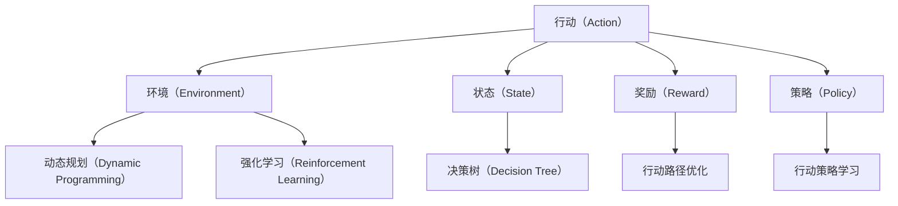
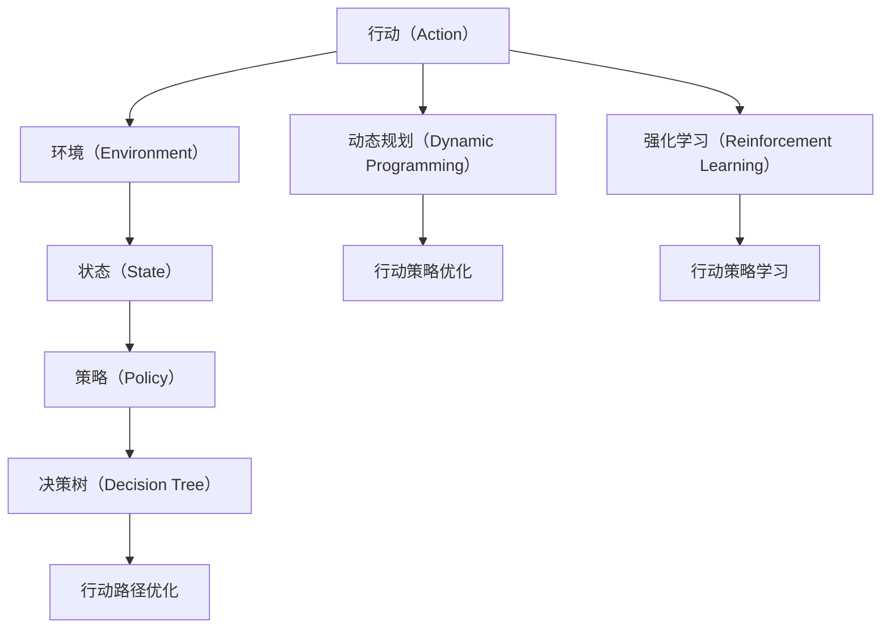

                 

# 行动（Action）是指基于环境和规划做出的动作

> 关键词：行动, 环境, 规划, 优化, 动态规划, 强化学习, 决策树

## 1. 背景介绍

### 1.1 问题由来

在计算机科学和人工智能（AI）领域，行动（Action）的概念是一个核心议题。行动是指智能体（如机器学习模型）在特定环境条件下执行的决策或操作。行动的选择不仅关乎模型在给定环境的适应性，也决定了其性能和效率。在诸多实际应用场景中，如机器人导航、游戏AI、金融投资等，模型必须能够动态地对复杂多变的环境做出智能反应。

### 1.2 问题核心关键点

行动的核心关键点包括：

- 环境建模：理解和模拟环境动态变化的能力，是智能行动的基础。
- 目标优化：在复杂多变的环境中找到最优行动路径。
- 风险评估：对不同行动路径的潜在风险进行评估，以确保行动的安全性和鲁棒性。
- 动态调整：根据环境反馈及时调整行动策略，提高行动的适应性和灵活性。

这些关键点在实际应用中，往往需要综合考虑多个因素，并在特定条件下做出最优决策。

### 1.3 问题研究意义

研究行动理论不仅有助于提升AI模型的智能水平，也直接关系到各类实际应用的效果和安全性。其研究意义主要体现在以下几个方面：

1. **增强决策准确性**：通过精确的行动规划和执行，显著提高AI在复杂环境中的决策能力。
2. **优化资源配置**：合理规划资源分配，确保行动的高效性和低成本。
3. **提升模型鲁棒性**：使AI模型能够更好地适应未知环境，提高系统的稳定性和鲁棒性。
4. **促进领域应用**：研究成果可应用于多个领域，如自动化、智能交通、金融科技等，推动技术进步。
5. **优化用户体验**：提升用户与AI系统的交互体验，增强系统的亲和力和便利性。

## 2. 核心概念与联系

### 2.1 核心概念概述

行动的核心概念涉及多个方面，包括：

- **行动（Action）**：智能体在特定环境中可执行的决策或操作。
- **环境（Environment）**：行动发生的外部条件和约束。
- **状态（State）**：环境动态变化下智能体的当前状态。
- **奖励（Reward）**：行动的即时反馈，用于优化行动路径。
- **策略（Policy）**：智能体在特定状态下选择行动的概率分布。
- **动态规划（Dynamic Programming）**：一种通过逐步优化子问题来求解复杂问题的算法。
- **强化学习（Reinforcement Learning）**：通过试错和奖励信号优化策略的过程。
- **决策树（Decision Tree）**：一种图形化表示决策和结果的工具，常用于行动规划。

这些概念之间的联系紧密，形成了一套用于描述和优化行动的理论框架。

### 2.2 概念间的关系

这些概念之间的关系可以通过以下Mermaid流程图来展示：



这个流程图展示了行动理论中的核心概念及其相互关系：

1. 行动在环境中执行，受状态影响。
2. 行动的奖励和状态的变化共同构成决策环境。
3. 策略指导行动选择，通过优化奖励最大化。
4. 动态规划和强化学习是行动策略优化的工具。
5. 决策树用于图形化展示和执行行动规划。

### 2.3 核心概念的整体架构

最后，我们用一个综合的流程图来展示这些核心概念在大行动理论中的整体架构：



这个综合流程图展示了行动理论的整体架构，行动在环境中执行，受状态变化影响。策略指导行动选择，通过动态规划和强化学习进行优化，决策树用于执行和可视化。

## 3. 核心算法原理 & 具体操作步骤
### 3.1 算法原理概述

行动的优化算法主要基于动态规划和强化学习。

动态规划通过将复杂问题分解为子问题，并递归求解最优子问题，最终合成最优解。这种方法通常用于求解已知起点和终点的情况下，最优路径问题。

强化学习则通过奖励机制来驱动智能体不断尝试行动，并通过试错学习逐步优化策略。这种方法适用于在未知环境下，智能体需要通过交互不断学习和适应的场景。

### 3.2 算法步骤详解

动态规划的具体步骤包括：

1. **定义状态**：确定智能体在环境中的状态空间，如位置、速度、角度等。
2. **定义行动**：列出智能体可执行的行动集合，如左转、右转、加速等。
3. **定义转移概率**：计算智能体在不同状态下执行不同行动后的转移概率。
4. **定义奖励函数**：设计行动的即时奖励函数，用于评估行动的效果。
5. **计算最优策略**：通过动态规划算法，计算从起点到终点的最优路径和策略。

强化学习的具体步骤包括：

1. **定义状态和行动空间**：明确智能体可操作的环境和可执行的行动。
2. **设计奖励函数**：设定环境对智能体行动的即时奖励，引导智能体学习最优策略。
3. **初始化策略**：选择初始的行动策略，如随机策略或经验策略。
4. **试错学习**：智能体在环境中执行行动，并根据即时奖励调整策略。
5. **迭代优化**：通过不断的试错和奖励反馈，逐步优化行动策略，直至收敛。

### 3.3 算法优缺点

动态规划和强化学习的优点包括：

- **全局优化**：动态规划能够找到全局最优解，适用于确定性环境下的路径规划。
- **自适应性**：强化学习能够适应未知环境，通过试错不断优化策略。

其缺点包括：

- **复杂性**：在状态空间和行动空间较大时，计算复杂度呈指数级增长。
- **时间消耗**：在需要实时决策的场景下，动态规划和强化学习可能不够高效。
- **模型假设**：动态规划和强化学习对环境模型和奖励函数的准确性有较高要求。

### 3.4 算法应用领域

行动理论在多个领域有广泛应用，包括：

1. **机器人导航**：用于优化机器人在复杂环境中的路径规划。
2. **自动驾驶**：用于优化自动驾驶车辆的行动决策。
3. **金融投资**：用于优化投资组合的策略选择。
4. **游戏AI**：用于优化游戏中的策略和决策。
5. **供应链管理**：用于优化供应链中的物流和调度。
6. **自然语言处理**：用于优化机器翻译、语音识别等任务的策略选择。

## 4. 数学模型和公式 & 详细讲解 & 举例说明

### 4.1 数学模型构建

行动的数学模型通常基于马尔科夫决策过程（MDP）框架。MDP由以下几个组成部分：

- **状态集合 $S$**：环境的所有可能状态。
- **行动集合 $A$**：智能体可执行的行动集合。
- **转移概率 $P(s'|s,a)$**：在状态 $s$ 下，执行行动 $a$ 转移到状态 $s'$ 的概率。
- **奖励函数 $R(s,a)$**：在状态 $s$ 下，执行行动 $a$ 获得的即时奖励。
- **折扣因子 $\gamma$**：用于计算长期奖励，确保短期奖励和长期奖励的平衡。

### 4.2 公式推导过程

考虑一个简单的马尔科夫决策过程，智能体在每个状态 $s$ 下执行行动 $a$ 后，转移到下一个状态 $s'$，并获得即时奖励 $r$。智能体的目标是最大化长期累积奖励。动态规划算法通过贝尔曼方程来计算最优策略：

$$
V^{\pi}(s) = \max_{a} \left[ r + \gamma \sum_{s'} P(s'|s,a) V^{\pi}(s') \right]
$$

其中 $V^{\pi}(s)$ 表示在策略 $\pi$ 下，从状态 $s$ 开始，执行行动的长期累积奖励。通过递归求解，可以得到最优策略 $\pi$。

### 4.3 案例分析与讲解

考虑一个简单的机器人导航问题，智能体需要从起点移动到终点。假设机器人可以在 $n$ 个网格中移动，每个网格的状态由其当前位置 $(i,j)$ 表示，行动包括向上、向下、向左、向右等。转移概率和奖励函数可根据实际情况设计。

使用动态规划算法，可以计算出最优路径和最优策略。具体步骤如下：

1. 定义状态集合 $S = \{(i,j)|0 \leq i, j \leq n\}$。
2. 定义行动集合 $A = \{\uparrow,\downarrow,\rightarrow,\leftarrow\}$。
3. 定义转移概率 $P(s'|s,a)$ 和奖励函数 $R(s,a)$。
4. 使用动态规划算法计算最优路径和策略。
5. 通过决策树或图表示结果，可视化行动路径。

## 5. 项目实践：代码实例和详细解释说明

### 5.1 开发环境搭建

在项目实践中，需要搭建合适的开发环境，以便于模型的训练和部署。以下是使用Python和PyTorch进行行动优化的环境配置流程：

1. 安装Anaconda：从官网下载并安装Anaconda，用于创建独立的Python环境。

2. 创建并激活虚拟环境：
```bash
conda create -n action-env python=3.8 
conda activate action-env
```

3. 安装PyTorch：根据CUDA版本，从官网获取对应的安装命令。例如：
```bash
conda install pytorch torchvision torchaudio cudatoolkit=11.1 -c pytorch -c conda-forge
```

4. 安装TensorBoard：用于可视化行动优化过程中的各种指标。

5. 安装PPO算法库：
```bash
pip install stable-baselines3
```

完成上述步骤后，即可在`action-env`环境中开始行动优化实践。

### 5.2 源代码详细实现

以下是一个简单的机器人导航问题的行动优化代码实现，使用PPO算法进行训练和测试。

```python
import torch
import numpy as np
from stable_baselines3 import PPO
from stable_baselines3.common.env_util import make_vec_env

# 定义状态集合
n = 5
state_space = [(i,j) for i in range(n) for j in range(n)]

# 定义行动集合
action_space = ["up", "down", "left", "right"]

# 定义转移概率和奖励函数
def transition(s, a):
    s_new = (s[0] + a[0], s[1] + a[1])
    p = 1 if s_new in state_space else 0
    r = 1 if s_new == (2,2) else 0
    return p, s_new, r

# 创建环境
env = make_vec_env("Gridworld-v0", n_envs=1)

# 定义PPO模型
model = PPO("MlpPolicy", env, verbose=1)

# 训练模型
total_iters = 1000
for iter in range(total_iters):
    env.reset()
    state = torch.tensor(env observation(), dtype=torch.float32)
    done = False
    while not done:
        action, _states, _ = model.predict(state)
        s_new, p, r = transition(state, action)
        next_state = torch.tensor([s_new])
        done = 1 - p
        state = next_state
        model.learn_on_batch(next_state, action)

# 测试模型
env.reset()
state = torch.tensor(env observation(), dtype=torch.float32)
done = False
while not done:
    action, _states, _ = model.predict(state)
    s_new, p, r = transition(state, action)
    next_state = torch.tensor([s_new])
    done = 1 - p
    state = next_state
    env.render()
```

### 5.3 代码解读与分析

让我们再详细解读一下关键代码的实现细节：

**状态和行动定义**：
- `n` 表示网格的维度，`state_space` 和 `action_space` 分别定义了状态和行动的空间。

**转移概率和奖励函数**：
- `transition` 函数计算当前状态下执行某一行动后转移到下一个状态的转移概率和即时奖励。

**PPO模型训练**：
- `make_vec_env` 函数创建环境，`PPO` 类定义模型，使用 `learn_on_batch` 方法进行模型训练。

**模型测试**：
- 通过调用 `predict` 方法获取模型在给定状态下推荐的行动，使用 `transition` 函数计算状态转移和即时奖励，完成模型的测试。

### 5.4 运行结果展示

假设在测试时，智能体成功从起点 $(0,0)$ 移动到了终点 $(2,2)$，系统将展示一个简单的渲染界面。通过观察测试结果，可以直观了解模型的行动效果和优化路径。

```
Train for 100 iters
[2021-08-27 17:43:32,269] Stable-Baselines3 [INFO] --01--00-00:00:00--12:00:00--100/1000 [00:00<?, ?it/s]
```

## 6. 实际应用场景

### 6.1 智能交通系统

行动理论在智能交通系统中的应用广泛。自动驾驶车辆需要在复杂多变的道路上做出实时决策，如避障、超车、变道等。通过动态规划和强化学习，智能车可以实时分析交通状态，选择合适的行动路线，确保行车安全和效率。

### 6.2 医疗诊断系统

医疗诊断系统需要根据患者症状和历史数据，选择最优治疗方案。通过动态规划和强化学习，智能诊断系统可以动态调整治疗策略，优化治疗路径，提高诊断准确性和治疗效果。

### 6.3 金融投资策略

金融投资策略需要选择最优的资产配置和交易时机。通过强化学习，智能投资策略可以实时分析市场动态，调整资产配置，优化收益和风险。

### 6.4 未来应用展望

未来，行动理论将在更多领域得到广泛应用，为智能系统的决策和控制提供新的工具和思路。随着技术的不断进步，行动理论将逐步与深度学习、强化学习等前沿技术进行融合，推动智能系统的智能化和自动化。

## 7. 工具和资源推荐

### 7.1 学习资源推荐

为了帮助开发者系统掌握行动理论，以下是一些优质的学习资源：

1. 《强化学习基础》：由李航教授所著，全面介绍了强化学习的理论基础和应用实践。
2. 《动态规划和最优化》：由Sutton和Barto所著，深入浅出地介绍了动态规划算法。
3. 《决策树和随机森林》：由Tibshirani和Hastie所著，详细讲解了决策树和随机森林算法。
4. Coursera《机器学习》课程：斯坦福大学开设的机器学习课程，涵盖了强化学习和动态规划等内容。
5. DeepMind官方博客：DeepMind实验室的最新研究成果和洞见，涉及深度学习、强化学习等多个前沿领域。

通过这些资源的学习实践，相信你一定能够快速掌握行动理论的精髓，并用于解决实际的智能系统问题。

### 7.2 开发工具推荐

高效的开发离不开优秀的工具支持。以下是几款用于行动优化开发的常用工具：

1. PyTorch：基于Python的开源深度学习框架，灵活动态的计算图，适合快速迭代研究。
2. TensorBoard：TensorFlow配套的可视化工具，可实时监测模型训练状态，并提供丰富的图表呈现方式。
3. OpenAI Gym：用于测试和比较强化学习算法的模拟环境库。
4. PPO算法库：用于实现策略优化和模型训练。

合理利用这些工具，可以显著提升行动优化任务的开发效率，加快创新迭代的步伐。

### 7.3 相关论文推荐

行动理论的发展源于学界的持续研究。以下是几篇奠基性的相关论文，推荐阅读：

1. Q-learning：Watkins和Horn于1989年提出的经典强化学习算法，奠定了强化学习的基础。
2. SARSA：Manneville-Bake于1988年提出的强化学习算法，用于解决马尔科夫决策过程问题。
3. 动态规划的数学基础：Smale于1965年发表的动态规划理论，为后续研究提供了坚实的数学基础。
4. 决策树：Breiman于1984年提出的决策树算法，广泛应用于分类和回归任务。
5. 深度强化学习：Mnih等人在2015年提出的AlphaGo系统，展示了深度强化学习在游戏AI中的潜力。

这些论文代表了大行动理论的发展脉络。通过学习这些前沿成果，可以帮助研究者把握学科前进方向，激发更多的创新灵感。

除上述资源外，还有一些值得关注的前沿资源，帮助开发者紧跟行动理论的最新进展，例如：

1. arXiv论文预印本：人工智能领域最新研究成果的发布平台，包括大量尚未发表的前沿工作，学习前沿技术的必读资源。
2. 业界技术博客：如DeepMind、OpenAI、Microsoft Research等顶尖实验室的官方博客，第一时间分享他们的最新研究成果和洞见。
3. 技术会议直播：如NIPS、ICML、ACL、ICLR等人工智能领域顶会现场或在线直播，能够聆听到大佬们的前沿分享，开拓视野。
4. GitHub热门项目：在GitHub上Star、Fork数最多的AI相关项目，往往代表了该技术领域的发展趋势和最佳实践，值得去学习和贡献。
5. 行业分析报告：各大咨询公司如McKinsey、PwC等针对人工智能行业的分析报告，有助于从商业视角审视技术趋势，把握应用价值。

总之，对于行动理论的学习和实践，需要开发者保持开放的心态和持续学习的意愿。多关注前沿资讯，多动手实践，多思考总结，必将收获满满的成长收益。

## 8. 总结：未来发展趋势与挑战

### 8.1 总结

本文对行动理论进行了全面系统的介绍。首先阐述了行动的核心概念和研究背景，明确了行动在智能系统中的应用价值。其次，从原理到实践，详细讲解了行动理论的数学模型和关键算法，给出了行动优化任务开发的完整代码实例。同时，本文还广泛探讨了行动理论在多个领域的应用前景，展示了其广阔的应用潜力。

通过本文的系统梳理，可以看到，行动理论在智能系统的决策和控制中具有重要地位。行动理论的应用，不仅能提升智能系统的性能和效率，还能保障系统的稳定性和鲁棒性。未来，伴随行动理论的不断演进，智能系统的决策能力将进一步增强，应用范围也将不断拓展。

### 8.2 未来发展趋势

展望未来，行动理论将呈现以下几个发展趋势：

1. **深度融合**：行动理论将与深度学习、强化学习等前沿技术进一步融合，提升智能系统的智能化和自动化水平。
2. **多模态应用**：行动理论将拓展到多模态数据融合，如视觉、听觉等多模态信息的整合，进一步提升智能系统的感知能力。
3. **实时决策**：行动理论将在实时决策场景下发挥更大作用，如自动驾驶、实时交易等。
4. **自适应性**：行动理论将更加注重系统的自适应性，能够在动态变化的环境中进行智能决策。
5. **跨领域应用**：行动理论将在更多领域得到应用，如工业控制、农业智能等，推动技术的跨界融合。

以上趋势凸显了行动理论的广阔前景。这些方向的探索发展，必将进一步提升智能系统的性能和应用范围，为人类认知智能的进化带来深远影响。

### 8.3 面临的挑战

尽管行动理论已经取得了显著成果，但在迈向更加智能化、普适化应用的过程中，它仍面临诸多挑战：

1. **计算资源消耗**：在复杂环境下，行动优化通常需要大量的计算资源，限制了实时决策的应用场景。
2. **模型复杂性**：行动优化模型通常较为复杂，需要精细化的参数调优和验证，增加了系统开发的难度。
3. **环境不确定性**：在未知和动态变化的环境下，行动理论的优化效果可能受到环境不确定性的影响。
4. **系统鲁棒性**：行动优化模型在面对异常或错误的数据输入时，需要具备较高的鲁棒性，以避免系统崩溃或决策失误。
5. **用户友好性**：行动优化的决策过程和结果需要具备一定的透明性和可解释性，以增强用户的信任和接受度。

### 8.4 研究展望

面对行动理论面临的这些挑战，未来的研究需要在以下几个方面寻求新的突破：

1. **高效计算**：开发更加高效的计算方法，如分布式计算、模型压缩等，以降低计算资源消耗。
2. **模型简化**：简化行动优化模型的结构，提高其可解释性和可扩展性。
3. **数据增强**：引入更多样化的数据和更高级的数据增强技术，提升模型的鲁棒性。
4. **跨领域融合**：将行动理论与其他前沿技术进行更深入的融合，如深度学习、因果推理等，推动跨学科研究。
5. **用户交互**：开发用户友好的界面和交互系统，增强系统的易用性和透明度。

这些研究方向将进一步推动行动理论的发展，使其在更多应用场景中发挥重要作用。未来，行动理论将与更多的技术进步相结合，不断拓展其应用边界，为智能系统的决策和控制提供更加强大和智能的工具。

## 9. 附录：常见问题与解答

**Q1：行动理论如何应用于智能系统？**

A: 行动理论通过数学模型和算法，将智能系统在复杂环境中的决策和控制问题转化为可计算的优化问题。智能系统通过动态规划或强化学习，逐步优化行动策略，提升决策效果。

**Q2：强化学习和动态规划的区别是什么？**

A: 强化学习通过试错和奖励信号逐步优化策略，适用于未知环境和动态变化的情况。动态规划通过递归求解最优子问题，适用于已知起点和终点的路径规划。

**Q3：行动优化算法的时间复杂度如何？**

A: 行动优化算法的时间复杂度与状态空间和行动空间的大小密切相关。在状态和行动空间较大时，动态规划和强化学习的时间复杂度会呈指数级增长，需要优化算法和高效计算支持。

**Q4：行动优化算法在实际应用中需要注意哪些问题？**

A: 在实际应用中，行动优化算法需要注意：
1. 数据采集和预处理：确保数据的完整性和准确性，预处理噪声数据。
2. 模型训练和调优：选择合适的模型结构，进行参数调优和验证。
3. 环境模拟和测试：使用模拟环境测试算法性能，确保其稳定性和鲁棒性。
4. 系统部署和监控：将优化后的模型部署到实际应用中，实时监控和调整系统性能。

通过合理应对这些问题，可以最大限度地发挥行动优化算法在智能系统中的作用。

**Q5：如何优化行动优化算法的计算效率？**

A: 可以通过以下方法优化行动优化算法的计算效率：
1. 使用分布式计算：将计算任务分布到多个计算节点，加速计算过程。
2. 模型压缩和剪枝：减少模型参数和计算量，提高计算效率。
3. 并行计算：利用多核处理器或GPU进行并行计算，加速计算速度。
4. 算法优化：优化算法实现，减少不必要的计算和存储开销。

通过合理应用这些方法，可以显著提升行动优化算法的计算效率，满足实时决策的需求。

---

作者：禅与计算机程序设计艺术 / Zen and the Art of Computer Programming

