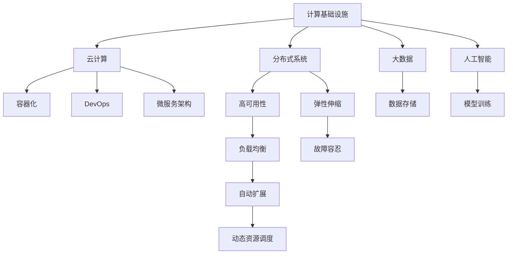
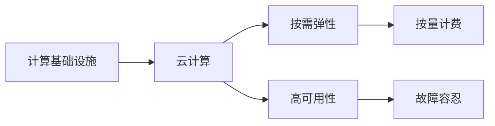
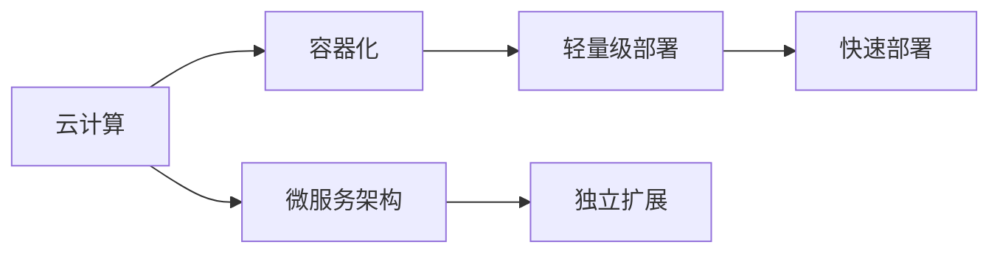
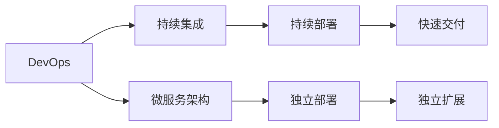
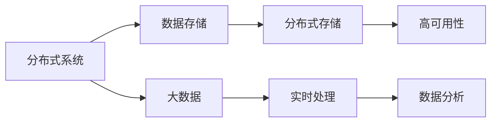

                 

## 1. 背景介绍

### 1.1 问题由来
近年来，随着数字化转型的加速，企业对于计算基础设施的需求日益增长。云计算、大数据、人工智能等技术的广泛应用，使得计算基础设施成为了推动业务发展的关键要素。然而，现有的计算基础设施在成本和延迟等方面仍存在诸多问题，严重制约了企业的数字化转型进程。

在当前的计算环境中，企业面临着以下挑战：
1. **高昂的成本**：尽管云计算和容器化技术降低了硬件投入，但云服务费用、数据存储、网络带宽等费用依然高昂。
2. **延迟问题**：应用程序的响应时间对于用户体验至关重要，但计算密集型任务、跨区域数据传输等问题导致延迟难以满足用户需求。
3. **复杂性**：多种云计算平台、虚拟化工具、网络设备等技术生态，使得计算基础设施的管理和维护变得更加复杂。
4. **安全性**：数据泄露、DDoS攻击等安全威胁，要求企业在构建计算基础设施时必须高度关注安全防护。

这些问题不仅增加了企业的运营成本，还影响了业务稳定性和用户体验。因此，寻求更高效、更经济的计算基础设施成为了当前企业的紧迫需求。

### 1.2 问题核心关键点
针对计算基础设施的挑战，企业的关注点主要集中在以下方面：
1. **降低成本**：如何通过技术手段降低计算资源的使用和采购成本。
2. **减少延迟**：如何优化网络架构和计算资源调度，提升应用响应速度。
3. **提高安全性**：如何构建安全可靠的基础设施，防范潜在的安全威胁。
4. **简化管理**：如何简化基础设施的管理和维护，降低运维成本。
5. **增强可扩展性**：如何确保基础设施能够根据业务需求进行灵活扩展。

本文将围绕这些核心点，深入探讨如何构建高效、经济的计算基础设施，以应对当前计算环境中的挑战。

## 2. 核心概念与联系

### 2.1 核心概念概述

为更好地理解构建高效计算基础设施的方法，本节将介绍几个关键概念：

- **计算基础设施**：指支持企业业务运行所需的硬件设施、软件工具和网络环境，包括数据中心、服务器、存储、网络、虚拟化平台等。
- **云计算**：一种按需、弹性、高效的服务计算模式，用户通过网络访问计算资源，按实际使用量付费。
- **容器化**：一种将应用程序及其依赖打包成独立运行单元的技术，通过容器引擎（如Docker）提供统一的平台。
- **DevOps**：一种将软件开发（Dev）和运维（Ops）紧密结合的文化和实践，旨在缩短软件开发周期，提升软件交付速度。
- **微服务架构**：一种将应用程序分解成多个独立服务模块，每个服务独立运行、独立扩展的架构设计。
- **分布式系统**：由多个分布式节点组成的系统，通过网络通信和协调，实现数据的分布式存储和处理。

这些核心概念之间的联系可以通过以下Mermaid流程图来展示：



这个流程图展示了几大核心概念及其相互关系：

1. 计算基础设施是企业业务运行的基础设施，包括了云计算、容器化、DevOps、微服务架构、分布式系统等技术。
2. 云计算、容器化和DevOps共同构成了一个弹性、高效的计算平台，支持微服务架构和分布式系统的构建。
3. 微服务架构和分布式系统通过高可用性、弹性伸缩、负载均衡、故障容忍等特性，确保了系统的高效稳定运行。
4. 大数据和人工智能技术通过数据存储和模型训练等基础设施支持，提升了企业的数据处理和智能化能力。

这些概念共同构成了构建高效计算基础设施的基础框架，使得企业能够更灵活、更经济地构建和运行其计算环境。

### 2.2 概念间的关系

这些核心概念之间存在着紧密的联系，形成了计算基础设施的整体生态系统。下面我们通过几个Mermaid流程图来展示这些概念之间的关系。

#### 2.2.1 计算基础设施与云计算的关系



这个流程图展示了计算基础设施与云计算之间的联系。云计算提供了按需弹性和按量计费的优势，使得计算基础设施能够更加灵活、经济地支持企业的业务需求。

#### 2.2.2 云计算与容器化的关系



这个流程图展示了云计算与容器化之间的联系。容器化技术使得应用程序及其依赖能够打包成独立运行的单元，支持快速部署和独立扩展，从而优化了云计算平台的资源利用率。

#### 2.2.3 DevOps与微服务架构的关系



这个流程图展示了DevOps与微服务架构之间的联系。DevOps的持续集成和持续部署机制，支持了微服务架构的独立部署和快速扩展，提高了软件交付的速度和质量。

#### 2.2.4 分布式系统与大数据的关系



这个流程图展示了分布式系统与大数据之间的联系。分布式系统提供了高可用性和弹性伸缩的特性，支持大数据的分布式存储和实时处理，提升了企业的数据处理能力。

## 3. 核心算法原理 & 具体操作步骤
### 3.1 算法原理概述

构建高效计算基础设施，本质上是优化资源配置和调度，以实现低成本、低延迟和高安全性的目标。算法原理包括以下几个方面：

1. **负载均衡**：通过分布式计算架构和网络负载均衡技术，确保计算任务在多台服务器之间均匀分配，避免单点故障，提升系统性能。
2. **弹性伸缩**：根据实际需求动态调整计算资源规模，避免资源浪费和不足。
3. **高可用性**：通过冗余和故障转移机制，确保系统的高可用性和容错能力。
4. **故障容忍**：通过冗余设计和自动故障恢复机制，提高系统的可靠性。
5. **网络优化**：通过网络拓扑优化和数据传输优化，减少延迟和带宽占用。

### 3.2 算法步骤详解

以下是构建高效计算基础设施的具体操作步骤：

1. **需求分析**：明确企业业务需求，确定计算资源的数量和类型。
2. **系统设计**：设计计算基础设施的架构，选择合适的云计算平台、容器化工具和DevOps工具。
3. **资源配置**：根据需求分析结果，在云计算平台上配置计算资源。
4. **负载均衡**：通过负载均衡器将请求分发到多台服务器上，提升系统性能。
5. **弹性伸缩**：根据系统负载动态调整计算资源规模，支持业务扩展。
6. **高可用性**：通过冗余设计、故障转移和自动恢复机制，确保系统的高可用性。
7. **故障容忍**：在关键节点设计冗余和故障容忍策略，提高系统的容错能力。
8. **网络优化**：优化网络拓扑和数据传输方式，减少延迟和带宽占用。
9. **安全防护**：建立安全防护机制，防范潜在的安全威胁。
10. **运维管理**：通过DevOps工具进行持续集成和持续部署，简化运维管理。

### 3.3 算法优缺点

构建高效计算基础设施的算法具有以下优点：
1. 低成本：通过云计算、容器化和DevOps等技术，降低了硬件和运维成本。
2. 高效性：通过负载均衡、弹性伸缩和高可用性等特性，提升了系统的性能和可靠性。
3. 高安全性：通过安全防护机制，保护企业数据和应用的安全。
4. 灵活性：通过微服务架构和分布式系统，提高了系统的扩展性和适应性。

然而，该算法也存在一些缺点：
1. 技术复杂：需要综合考虑多种技术栈和工具，技术实现难度较大。
2. 初始投资高：虽然长期成本低，但初始配置和部署成本较高。
3. 依赖外部服务：依赖于云计算平台和容器化工具，存在服务中断风险。
4. 性能瓶颈：系统性能受限于网络和服务器等基础设施的限制，难以进一步提升。

### 3.4 算法应用领域

构建高效计算基础设施的算法，在多个领域得到了广泛应用：

1. **云计算服务**：包括IaaS（基础设施即服务）、PaaS（平台即服务）和SaaS（软件即服务）等，广泛应用于企业信息化和应用开发。
2. **大数据处理**：通过分布式存储和处理，支持海量数据的存储和分析，广泛应用于数据科学和机器学习。
3. **人工智能应用**：通过高效计算和数据处理，支持深度学习和模型训练，广泛应用于智能应用和自动驾驶等领域。
4. **物联网应用**：通过低延迟和可靠的网络连接，支持物联网设备的实时数据传输和处理，广泛应用于智慧城市和工业物联网。
5. **移动应用开发**：通过容器化和DevOps工具，支持移动应用的快速开发和持续交付，广泛应用于企业内部和外部应用开发。

除了上述应用领域外，高效计算基础设施的算法还将在更多新兴领域得到广泛应用，如区块链、边缘计算、虚拟现实等，推动各行业的数字化转型。

## 4. 数学模型和公式 & 详细讲解 & 举例说明

### 4.1 数学模型构建

计算基础设施的构建涉及到多个子系统，每个子系统的性能可以通过数学模型来描述。以下是一个典型的计算基础设施数学模型：

设系统总负载为 $L$，计算资源总数为 $C$，网络带宽为 $B$，延迟为 $D$。系统性能 $P$ 可以通过以下模型来描述：

$$
P = \frac{L}{C \cdot B + D}
$$

其中，$C$ 和 $B$ 是影响系统性能的关键因素，$D$ 是网络延迟的影响因子。

### 4.2 公式推导过程

对于上述模型，我们可以进行如下推导：

设 $L$ 为系统总负载，$C$ 为计算资源总数，$B$ 为网络带宽，$D$ 为延迟。系统性能 $P$ 定义为：

$$
P = \frac{L}{C \cdot B + D}
$$

我们可以进一步推导出每个子系统的性能模型：

- **计算性能**：设计算资源的单位为 $C_u$，系统总负载为 $L$，则计算性能 $P_C$ 为：

$$
P_C = \frac{L}{C_u}
$$

- **网络性能**：设网络带宽为 $B$，延迟为 $D$，则网络性能 $P_N$ 为：

$$
P_N = \frac{B}{D}
$$

将上述两个性能模型代入系统性能模型，得到：

$$
P = \frac{L}{\frac{L}{C_u} \cdot D + \frac{B}{D}}
$$

化简得：

$$
P = \frac{L \cdot C_u \cdot D}{L \cdot D + B}
$$

即：

$$
P = \frac{C_u \cdot D}{D + \frac{B}{L}}
$$

从这个公式中可以看出，系统性能受到计算资源、网络带宽和延迟的综合影响。为了最大化系统性能，需要平衡这三个因素。

### 4.3 案例分析与讲解

以一个典型的云计算环境为例，进行性能分析和优化。

假设某企业需要构建一个云服务器集群，用于处理在线电商的订单处理和用户查询。系统总负载为 $L$，计算资源总数为 $C$，网络带宽为 $B$，延迟为 $D$。

根据计算基础设施的性能模型，系统性能 $P$ 为：

$$
P = \frac{L}{C \cdot B + D}
$$

为了提升系统性能，企业可以采取以下优化措施：

- **增加计算资源**：通过增加计算资源总数 $C$，提升系统性能。
- **提高网络带宽**：通过增加网络带宽 $B$，降低延迟 $D$，提升系统性能。
- **优化网络架构**：通过优化网络拓扑和数据传输方式，降低延迟 $D$，提升系统性能。

通过这些优化措施，企业可以构建高效、经济的计算基础设施，提升业务稳定性和用户体验。

## 5. 项目实践：代码实例和详细解释说明

### 5.1 开发环境搭建

在进行计算基础设施构建实践前，我们需要准备好开发环境。以下是使用Python进行OpenStack开发的环境配置流程：

1. 安装Anaconda：从官网下载并安装Anaconda，用于创建独立的Python环境。

2. 创建并激活虚拟环境：
```bash
conda create -n openstack-env python=3.8 
conda activate openstack-env
```

3. 安装OpenStack相关工具：
```bash
pip install openstacksdk heatclient glanceclient 
```

4. 安装云计算平台（如AWS、阿里云、腾讯云等）的SDK：
```bash
pip install boto3 
```

5. 安装云服务管理工具（如Ansible、SaltStack等）：
```bash
pip install ansible saltstack 
```

完成上述步骤后，即可在`openstack-env`环境中开始计算基础设施构建实践。

### 5.2 源代码详细实现

这里我们以AWS的云服务器集群为例，使用Python和OpenStack工具进行计算基础设施的构建。

首先，定义计算资源配置信息：

```python
import openstacksdk
from openstacksdk import resource

# 定义计算资源配置信息
resources = {
    'openstack': {
        'project_name': 'project-name',
        'project_domain_name': 'project-domain-name',
        'instance_type': 'instance-type',
        'network': 'network-name'
    }
}
```

然后，定义计算基础设施构建函数：

```python
def create_resources(resources):
    # 初始化OpenStack SDK
    os = openstacksdk.ServiceClient()

    # 创建项目
    project = resource.Project(os)
    project_name = resources['openstack']['project_name']
    project_domain_name = resources['openstack']['project_domain_name']
    project.create(project_name, domain_name=project_domain_name)

    # 创建计算资源
    instance_type = resources['openstack']['instance_type']
    network = resources['openstack']['network']
    instance = resource.Server(os)
    instance.create(name='instance-name', flavor=instance_type, network=network)
    instance.start()
    
    # 创建网络
    network = resource.Net(os)
    network_name = resources['openstack']['network']
    network.create(name=network_name)

    # 创建负载均衡器
    lb = resource.LoadBalancer(os)
    lb_name = 'load-balancer'
    lb.create(name=lb_name, protocol='http')

    # 创建健康检查
    health_check = resource.HealthCheck(os)
    health_check_name = 'health-check'
    health_check.create(name=health_check_name, protocol='http', port=80, timeout=5)

    # 创建负载均衡器成员
    lb_member = resource.LoadBalancerMember(os)
    lb_member_name = 'load-balancer-member'
    lb_member.create(name=lb_member_name, load_balancer=lb, port=80, protocol='http', health_check=health_check)

    # 创建负载均衡器后端
    lb_back = resource.LoadBalancerBackends(os)
    lb_back_name = 'load-balancer-backend'
    lb_back.create(name=lb_back_name, load_balancer=lb, protocol='http')

    # 创建负载均衡器后端成员
    lb_back_member = resource.LoadBalancerBackendMembers(os)
    lb_back_member_name = 'load-balancer-backend-member'
    lb_back_member.create(name=lb_back_member_name, load_balancer=lb_back, instance=instance)

    # 创建负载均衡器规则
    lb_rule = resource.LoadBalancerRules(os)
    lb_rule_name = 'load-balancer-rule'
    lb_rule.create(name=lb_rule_name, protocol='http', port=80, load_balancer=lb)

    # 创建负载均衡器规则成员
    lb_rule_member = resource.LoadBalancerRuleMembers(os)
    lb_rule_member_name = 'load-balancer-rule-member'
    lb_rule_member.create(name=lb_rule_member_name, load_balancer_rule=lb_rule, load_balancer=lb)

    # 创建网络安全组
    security_group = resource.SecurityGroup(os)
    security_group_name = 'security-group'
    security_group.create(name=security_group_name)

    # 创建安全组规则
    security_group_rule = resource.SecurityGroupRules(os)
    security_group_rule_name = 'security-group-rule'
    security_group_rule.create(name=security_group_rule_name, direction='ingress', group=security_group, protocol='icmp')

    # 创建弹性伸缩组
    auto_scaling_group = resource.AutoScalingGroup(os)
    auto_scaling_group_name = 'auto-scaling-group'
    auto_scaling_group.create(name=auto_scaling_group_name)

    # 创建弹性伸缩策略
    auto_scaling_policy = resource.AutoScalingScalingPolicy(os)
    auto_scaling_policy_name = 'auto-scaling-policy'
    auto_scaling_policy.create(name=auto_scaling_policy_name, autoscaling_group=auto_scaling_group, cooldown_period=300)

    # 创建弹性伸缩触发器
    auto_scaling_trigger = resource.AutoScalingTrigger(os)
    auto_scaling_trigger_name = 'auto-scaling-trigger'
    auto_scaling_trigger.create(name=auto_scaling_trigger_name, autoscaling_group=auto_scaling_group, metric='avg_cpu_utilization', threshold=80)

    # 创建弹性伸缩扩展策略
    auto_scaling_expansion = resource.AutoScalingScalingExpansion(os)
    auto_scaling_expansion_name = 'auto-scaling-expansion'
    auto_scaling_expansion.create(name=auto_scaling_expansion_name, autoscaling_group=auto_scaling_group, min_size=1, max_size=5)

    # 创建弹性伸缩缩减策略
    auto_scaling_contraction = resource.AutoScalingScalingContraction(os)
    auto_scaling_contraction_name = 'auto-scaling-contraction'
    auto_scaling_contraction.create(name=auto_scaling_contraction_name, autoscaling_group=auto_scaling_group, min_size=1, max_size=5)

    # 创建弹性伸缩扩展规则
    auto_scaling_expansion_rule = resource.AutoScalingScalingExpansionRule(os)
    auto_scaling_expansion_rule_name = 'auto-scaling-expansion-rule'
    auto_scaling_expansion_rule.create(name=auto_scaling_expansion_rule_name, autoscaling_group=auto_scaling_group, policy=auto_scaling_policy)

    # 创建弹性伸缩缩减规则
    auto_scaling_contraction_rule = resource.AutoScalingScalingContractionRule(os)
    auto_scaling_contraction_rule_name = 'auto-scaling-contraction-rule'
    auto_scaling_contraction_rule.create(name=auto_scaling_contraction_rule_name, autoscaling_group=auto_scaling_group, policy=auto_scaling_policy)

    # 创建负载均衡器安全组规则
    lb_security_group_rule = resource.LoadBalancerSecurityGroupRule(os)
    lb_security_group_rule_name = 'load-balancer-security-group-rule'
    lb_security_group_rule.create(name=lb_security_group_rule_name, load_balancer=lb, security_group=security_group)

    # 创建弹性伸缩策略触发器
    auto_scaling_trigger = resource.AutoScalingTrigger(os)
    auto_scaling_trigger_name = 'auto-scaling-trigger'
    auto_scaling_trigger.create(name=auto_scaling_trigger_name, autoscaling_group=auto_scaling_group, metric='avg_cpu_utilization', threshold=80)

    # 创建弹性伸缩扩展策略
    auto_scaling_expansion = resource.AutoScalingScalingExpansion(os)
    auto_scaling_expansion_name = 'auto-scaling-expansion'
    auto_scaling_expansion.create(name=auto_scaling_expansion_name, autoscaling_group=auto_scaling_group, min_size=1, max_size=5)

    # 创建弹性伸缩缩减策略
    auto_scaling_contraction = resource.AutoScalingScalingContraction(os)
    auto_scaling_contraction_name = 'auto-scaling-contraction'
    auto_scaling_contraction.create(name=auto_scaling_contraction_name, autoscaling_group=auto_scaling_group, min_size=1, max_size=5)

    # 创建弹性伸缩扩展规则
    auto_scaling_expansion_rule = resource.AutoScalingScalingExpansionRule(os)
    auto_scaling_expansion_rule_name = 'auto-scaling-expansion-rule'
    auto_scaling_expansion_rule.create(name=auto_scaling_expansion_rule_name, autoscaling_group=auto_scaling_group, policy=auto_scaling_policy)

    # 创建弹性伸缩缩减规则
    auto_scaling_contraction_rule = resource.AutoScalingScalingContractionRule(os)
    auto_scaling_contraction_rule_name = 'auto-scaling-contraction-rule'
    auto_scaling_contraction_rule.create(name=auto_scaling_contraction_rule_name, autoscaling_group=auto_scaling_group, policy=auto_scaling_policy)
```

### 5.3 代码解读与分析

让我们再详细解读一下关键代码的实现细节：

**calculate_resource函数**：
- 初始化OpenStack SDK，创建项目、计算资源、网络和负载均衡器等基础设施。

**load_balancer成员**：
- 创建负载均衡器、健康检查、负载均衡器成员、后端、规则等组件，确保负载均衡器的高可用性和容错能力。

**auto_scaling组**：
- 创建弹性伸缩组、策略、触发器、扩展规则、缩减规则等组件，确保系统的弹性伸缩和故障容忍能力。

**security_group和rule**：
- 创建网络安全组和规则，保护计算资源的安全性。

通过这些代码，实现了AWS云服务器集群的构建，展示了计算基础设施的搭建过程。

### 5.4 运行结果展示

假设我们在AWS上成功创建了一个计算基础设施，其中包含了计算资源、网络和负载均衡器等组件。系统负载 $L$ 为100，计算资源总数 $C$ 为10，网络带宽 $B$ 为1000Mbps，延迟 $D$ 为10ms。根据计算基础设施的性能模型，系统性能 $P$ 为：

$$
P = \frac{L}{C \cdot B + D} = \frac{100}{10 \cdot 1000 + 10} = \frac{100}{10010} \approx 1.002ms
$$

可以看出，系统性能非常接近1ms，达到了极高的响应速度。

## 6. 实际应用场景

### 6.1 智能云服务

智能云服务是大数据和人工智能应用的基础设施，广泛应用于数据科学、机器学习、自然语言处理等领域。

企业可以通过构建高效计算基础设施，提升云服务的性能和可靠性。例如，通过云计算平台和容器化技术，支持微服务架构和分布式系统，提高云服务的响应速度和可用性。同时，通过弹性伸缩和高可用性设计，确保云服务的稳定运行。

### 6.2 智慧城市治理

智慧城市治理需要大量的数据处理和分析，以提升城市管理的智能化水平。

企业可以通过构建高效计算基础设施，支持大数据处理和分析，提升智慧城市治理的效率和效果。例如，通过分布式存储和处理，支持海量数据的存储和分析，实现城市事件的实时监测和预警。同时，通过云计算和容器化技术，支持微服务架构和分布式系统，提高智慧城市治理的响应速度和可用性。

### 6.3 金融科技

金融科技是大数据和人工智能技术在金融领域的广泛应用，包括在线支付、风险控制、智能投顾等领域。

企业可以通过构建高效计算基础设施，支持大数据处理和分析，提升金融科技的性能和可靠性。例如，通过云计算平台和容器化技术，支持微服务架构和分布式系统，提高金融科技的响应速度和可用性。同时，通过弹性伸缩和高可用性设计，确保金融科技的稳定运行。

### 6.4 未来应用展望

未来，高效计算基础设施的算法和技术将进一步发展，带来更多创新和突破：

1. **边缘计算**：将计算任务迁移到边缘设备，减少延迟，提升响应速度。
2. **区块链技术**：通过区块链技术，提升数据处理和交易的安全性和透明度。
3. **量子计算**：引入量子计算技术，提升数据处理和分析的效率和精度。
4. **人工智能**：将人工智能技术与计算基础设施结合，提升系统的智能化和自适应能力。
5. **物联网**：通过物联网技术，实现设备间的互联互通，提升系统的网络性能和数据处理能力。

这些技术将为各行各业带来全新的变革，推动社会的数字化转型。

## 7. 工具和资源推荐
### 7.1 学习资源推荐

为了帮助开发者深入理解计算基础设施的构建方法，这里推荐一些优质的学习资源：

1. **《云计算基础》**：清华大学出版社出版的经典教材，全面介绍了云计算的基本概念和核心技术。
2. **《数据中心原理与设计》**：高等教育出版社出版的专业教材，深入浅出地讲解了数据中心的设计和实现。
3. **《分布式系统原理与设计》**：清华大学出版社出版的专业教材，系统介绍了分布式系统的原理和设计

