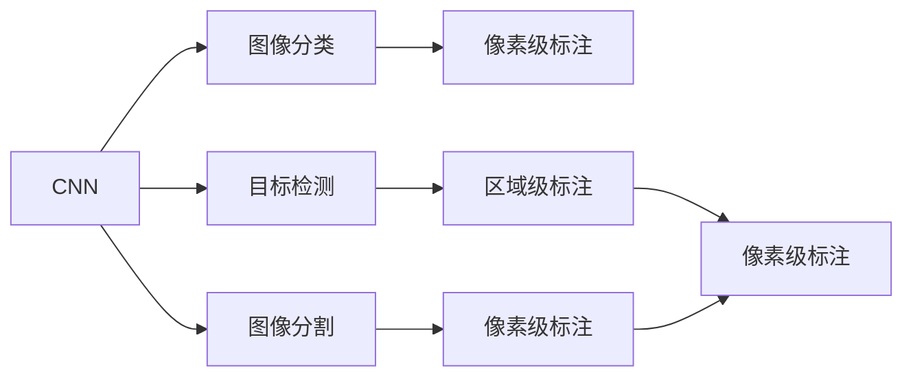

                 

# 计算机视觉(Computer Vision) - 原理与代码实例讲解

> 关键词：计算机视觉,深度学习,卷积神经网络(CNN),图像分类,目标检测,图像分割,深度学习框架(TensorFlow, PyTorch)

## 1. 背景介绍

### 1.1 问题由来
计算机视觉（Computer Vision, CV）作为人工智能的重要分支，旨在赋予计算机“看”的能力，从而实现对现实世界的理解与交互。计算机视觉的广泛应用包括自动驾驶、智能监控、机器人导航、医学影像分析、虚拟现实等。近年来，深度学习技术在计算机视觉领域取得了突破性进展，特别是卷积神经网络（Convolutional Neural Network, CNN），已经成为处理图像和视频数据的核心工具。然而，深度学习模型的训练与优化问题，如过拟合、训练速度慢、内存占用大等，仍是需要解决的重要挑战。

### 1.2 问题核心关键点
计算机视觉的深度学习算法，以卷积神经网络为核心。CNN通过卷积、池化、全连接等层级结构，可以有效提取图像特征，实现图像分类、目标检测、图像分割等任务。关键点包括：

- **卷积操作**：利用局部连接和权值共享，提取图像局部特征。
- **池化操作**：通过下采样减少特征图尺寸，保持特征不变性。
- **激活函数**：如ReLU、Sigmoid等，引入非线性变换，增强特征表达能力。
- **全连接层**：将特征图转化为向量，进行分类、回归等任务。
- **目标检测与分割**：通过区域池化、ROI池化等技术，将感兴趣区域进行细致分析。

### 1.3 问题研究意义
计算机视觉技术的发展，对于自动化、智能化、人机交互等领域具有深远的影响。它不仅能提升工作效率，还能改善人们的生活质量，如自动驾驶能提高出行安全，智能监控能提升公共安全，医学影像分析能辅助诊断等。本文将系统介绍计算机视觉的核心概念与算法原理，并结合代码实例，深入讲解其具体实现。

## 2. 核心概念与联系

### 2.1 核心概念概述
为了更好地理解计算机视觉的核心概念与联系，本文将介绍几个关键概念：

- **卷积神经网络(CNN)**：以卷积层和池化层为核心，通过局部连接和权值共享，提取图像特征，适用于图像分类、目标检测等任务。
- **图像分类**：将输入图像分为若干类别，主要解决“是什么”的问题。
- **目标检测**：在图像中定位目标的位置，并标注其类别，主要解决“在哪里”的问题。
- **图像分割**：将图像划分为若干像素级别的区域，并标注其类别，主要解决“是什么”和“在哪里”的组合问题。

### 2.2 概念间的关系

这些核心概念之间的关系可以通过以下Mermaid流程图来展示：



这个流程图展示了卷积神经网络在计算机视觉中的主要应用：

1. **图像分类**：将图像直接分类到某一类别中，主要应用CNN的前几层。
2. **目标检测**：在图像中定位目标并分类，主要应用CNN的特征提取部分。
3. **图像分割**：将图像分割为多个区域，并标注其类别，主要应用CNN的全连接层。

## 3. 核心算法原理 & 具体操作步骤
### 3.1 算法原理概述

卷积神经网络（CNN）是计算机视觉的核心算法，其原理可以通过以下步骤简要概述：

1. **卷积层**：对输入图像进行卷积操作，提取局部特征。
2. **池化层**：通过下采样减少特征图尺寸，保持特征不变性。
3. **激活函数**：引入非线性变换，增强特征表达能力。
4. **全连接层**：将特征图转化为向量，进行分类、回归等任务。

### 3.2 算法步骤详解

以图像分类为例，CNN的训练和推理步骤如下：

1. **数据准备**：将图像数据进行预处理，如归一化、扩充数据集等。
2. **模型定义**：定义CNN模型结构，包括卷积层、池化层、全连接层等。
3. **损失函数**：选择合适的损失函数，如交叉熵损失，衡量模型预测与真实标签之间的差异。
4. **优化器**：选择合适的优化器，如Adam、SGD等，更新模型参数。
5. **训练**：使用训练集数据，通过反向传播算法更新模型参数。
6. **评估**：在验证集或测试集上评估模型性能。
7. **推理**：对新输入图像进行预测。

### 3.3 算法优缺点

CNN的优点包括：

- **局部连接与权值共享**：减小模型参数量，减少计算复杂度。
- **特征提取能力**：通过卷积和池化操作，自动学习图像特征，无需手工设计特征。
- **端到端训练**：通过全连接层，实现从特征到输出的端到端训练。

但CNN也存在一些缺点：

- **过拟合风险**：随着模型复杂度的增加，容易在训练集上过拟合。
- **计算资源消耗大**：大型图像和深层次网络结构需要大量计算资源。
- **训练时间长**：大规模数据集训练耗时长，内存占用大。

### 3.4 算法应用领域

CNN广泛应用于计算机视觉的多个领域，包括：

- **图像分类**：如图像识别、医学图像分析等。
- **目标检测**：如人脸识别、物体检测等。
- **图像分割**：如语义分割、实例分割等。
- **深度学习框架**：如TensorFlow、PyTorch等。

## 4. 数学模型和公式 & 详细讲解 & 举例说明

### 4.1 数学模型构建

以图像分类为例，CNN的数学模型可以表示为：

$$
\text{Output} = f_\theta(\text{Input} * W_1 + b_1) * W_2 + b_2
$$

其中，$\theta$ 表示模型参数，$*$ 表示卷积操作，$f_\theta$ 表示激活函数。

### 4.2 公式推导过程

以最简单的LeNet网络为例，其卷积层的公式为：

$$
\text{Conv} = \text{Input} * W + b
$$

其中，$*$ 表示卷积操作，$W$ 表示卷积核，$b$ 表示偏置项。

### 4.3 案例分析与讲解

以MNIST手写数字识别为例，假设输入图像大小为28x28，卷积核大小为5x5，步长为1，输出通道数为10。则卷积操作可以表示为：

$$
\text{Conv} = \text{Input} * \text{Kernel} + \text{Bias}
$$

其中，$\text{Input}$ 表示输入图像，$\text{Kernel}$ 表示卷积核，$\text{Bias}$ 表示偏置项。

## 5. 项目实践：代码实例和详细解释说明

### 5.1 开发环境搭建

首先，需要安装深度学习框架TensorFlow和PyTorch。以下是在Python环境下搭建TensorFlow的示例代码：

```bash
pip install tensorflow
```

### 5.2 源代码详细实现

以使用TensorFlow实现手写数字识别为例：

```python
import tensorflow as tf
from tensorflow.keras import datasets, layers, models

# 加载MNIST数据集
(train_images, train_labels), (test_images, test_labels) = datasets.mnist.load_data()

# 数据预处理
train_images = train_images.reshape((60000, 28, 28, 1))
train_images = train_images / 255.0

test_images = test_images.reshape((10000, 28, 28, 1))
test_images = test_images / 255.0

# 构建CNN模型
model = models.Sequential([
    layers.Conv2D(32, (3, 3), activation='relu', input_shape=(28, 28, 1)),
    layers.MaxPooling2D((2, 2)),
    layers.Conv2D(64, (3, 3), activation='relu'),
    layers.MaxPooling2D((2, 2)),
    layers.Flatten(),
    layers.Dense(64, activation='relu'),
    layers.Dense(10)
])

# 编译模型
model.compile(optimizer='adam',
              loss=tf.keras.losses.SparseCategoricalCrossentropy(from_logits=True),
              metrics=['accuracy'])

# 训练模型
model.fit(train_images, train_labels, epochs=5, 
          validation_data=(test_images, test_labels))
```

### 5.3 代码解读与分析

代码中，首先加载MNIST数据集，然后对数据进行预处理，包括将图像数据归一化、调整尺寸等。接着构建CNN模型，包括卷积层、池化层和全连接层。最后，编译模型并训练。

### 5.4 运行结果展示

训练完成后，可以通过以下代码进行模型评估和预测：

```python
test_loss, test_acc = model.evaluate(test_images,  test_labels, verbose=2)
print('\nTest accuracy:', test_acc)

predictions = model.predict(test_images)
```

## 6. 实际应用场景

### 6.1 智能监控

智能监控系统可以通过计算机视觉技术实现目标检测和行为分析。例如，在商场中，系统可以实时监控人员流动情况，检测异常行为，如偷盗、斗殴等，并提供报警信息。

### 6.2 自动驾驶

自动驾驶系统通过摄像头、激光雷达等传感器获取环境信息，通过计算机视觉技术进行目标检测、路径规划等操作，保障行车安全。

### 6.3 医学影像分析

医学影像分析可以用于疾病的早期诊断和个性化治疗。例如，通过计算机视觉技术，可以从医学影像中检测肿瘤、识别病变区域等，辅助医生进行诊断和治疗决策。

### 6.4 未来应用展望

未来，计算机视觉技术将在更多领域得到广泛应用。例如，虚拟现实(VR)、增强现实(AR)将融合计算机视觉技术，提供更加沉浸式的交互体验。另外，随着5G网络的普及，远程医疗、智慧城市等应用也将得到进一步发展。

## 7. 工具和资源推荐

### 7.1 学习资源推荐

- **Coursera深度学习课程**：由深度学习领域的权威教授讲授，涵盖CNN的基本原理和应用，适合初学者入门。
- **Deep Learning with Python**：由谷歌开发者编写，全面介绍了CNN等深度学习模型的设计与实现，适合进阶学习。
- **Hands-On Machine Learning with Scikit-Learn, Keras, and TensorFlow**：介绍了Scikit-Learn、Keras和TensorFlow等常用机器学习工具在CNN中的应用，适合动手实践。

### 7.2 开发工具推荐

- **TensorFlow**：由Google开发，提供了丰富的深度学习工具和库，适合大规模应用开发。
- **PyTorch**：由Facebook开发，具有动态计算图和灵活的模型设计能力，适合研究和实验。
- **Keras**：建立在TensorFlow和Theano之上，提供了简单易用的接口，适合快速原型开发。

### 7.3 相关论文推荐

- **AlexNet: ImageNet Classification with Deep Convolutional Neural Networks**：引入了深度卷积神经网络，显著提升了图像分类的准确率。
- **R-CNN: Rich Feature Hierarchies for Accurate Object Detection and Semantic Segmentation**：提出了区域卷积神经网络(R-CNN)，将目标检测任务分解为两阶段，提升了检测精度。
- **Faster R-CNN: Towards Real-Time Object Detection with Region Proposal Networks**：提出了Faster R-CNN，进一步提升了目标检测的速度和精度。
- **U-Net: Convolutional Networks for Biomedical Image Segmentation**：提出了U-Net，应用于医学图像分割，取得了很好的效果。

## 8. 总结：未来发展趋势与挑战

### 8.1 研究成果总结

计算机视觉技术经过多年的发展，已经在图像分类、目标检测、图像分割等领域取得了重要进展。深度学习技术，特别是卷积神经网络，成为了实现这些任务的关键手段。

### 8.2 未来发展趋势

未来的计算机视觉技术将呈现以下几个趋势：

- **模型规模化**：随着计算资源的增加，深度卷积神经网络的层数和规模将不断增加，以进一步提升模型的表现。
- **多模态融合**：计算机视觉技术将与其他模态如语音、文本等融合，实现更全面的人机交互。
- **自监督学习**：利用无标签数据进行自监督学习，减少对标注数据的需求，提高模型泛化能力。
- **端到端训练**：更多端到端的训练方法，如集成学习、迁移学习等，将提高模型的整体性能。

### 8.3 面临的挑战

尽管计算机视觉技术取得了诸多进展，但仍面临一些挑战：

- **计算资源消耗大**：深度卷积神经网络对计算资源的需求较高，训练和推理过程中存在资源瓶颈。
- **模型泛化能力有限**：深度卷积神经网络对新数据的泛化能力有限，需要在模型设计和训练过程中进行优化。
- **数据标注成本高**：高质量的数据标注需要大量人力和时间，限制了计算机视觉技术的应用范围。

### 8.4 研究展望

未来的计算机视觉技术需要从以下几个方面进行进一步探索：

- **轻量级模型设计**：设计更加轻量级的模型结构，降低计算资源消耗。
- **数据增强技术**：引入更多数据增强技术，提高模型的泛化能力。
- **无监督和半监督学习**：利用无标签和弱标签数据进行模型训练，提高数据标注效率。
- **模型压缩与优化**：对深度卷积神经网络进行压缩和优化，提升模型推理速度和资源利用率。

## 9. 附录：常见问题与解答

**Q1：计算机视觉技术是否适用于所有领域？**

A: 计算机视觉技术主要应用于图像和视频数据处理，对自然场景和动态变化场景具有较好的适应性。但对于非视觉信号，如音频、文本等，计算机视觉技术并不适用。

**Q2：CNN的计算资源消耗是否过大？**

A: 当前主流的深度卷积神经网络对计算资源的需求较大，特别是在大规模数据集训练和推理时。可以考虑使用GPU、TPU等硬件加速设备，或者使用模型压缩、量化等技术进行优化。

**Q3：CNN在面对复杂场景时的表现如何？**

A: CNN在面对复杂场景时，可能会存在过拟合或分类不准确的问题。可以通过引入数据增强、正则化、集成学习等技术，提高模型的泛化能力。

**Q4：计算机视觉技术在实际应用中需要注意哪些问题？**

A: 计算机视觉技术在实际应用中需要注意数据隐私、安全防护等问题。对于涉及个人隐私的信息，需要进行匿名化处理，防止数据泄露。

**Q5：计算机视觉技术的未来发展方向是什么？**

A: 计算机视觉技术的未来发展方向包括模型规模化、多模态融合、自监督学习、端到端训练等。这些技术将进一步提升计算机视觉系统的性能和应用范围，推动其在更多领域的应用。

---

作者：禅与计算机程序设计艺术 / Zen and the Art of Computer Programming

