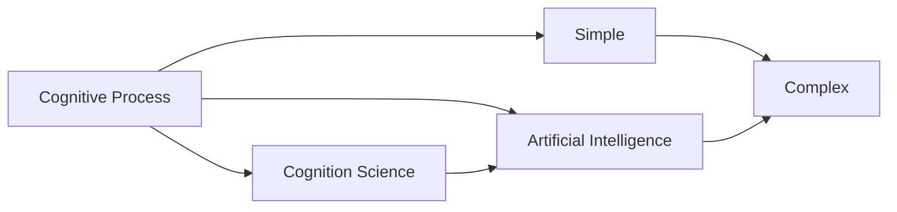
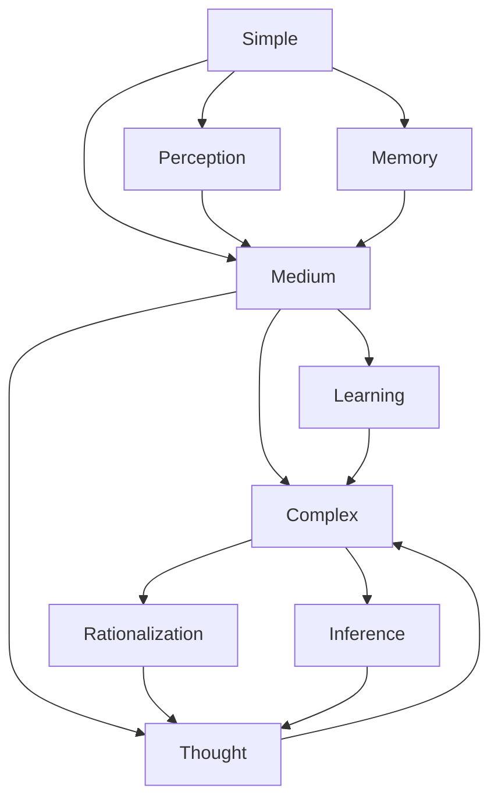
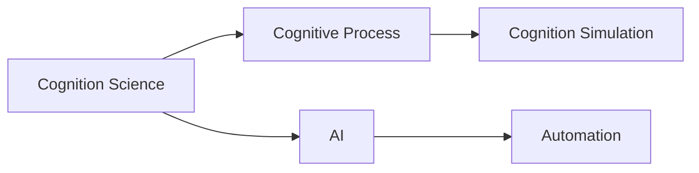
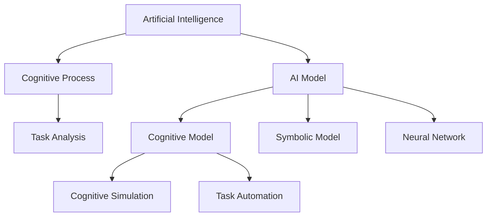
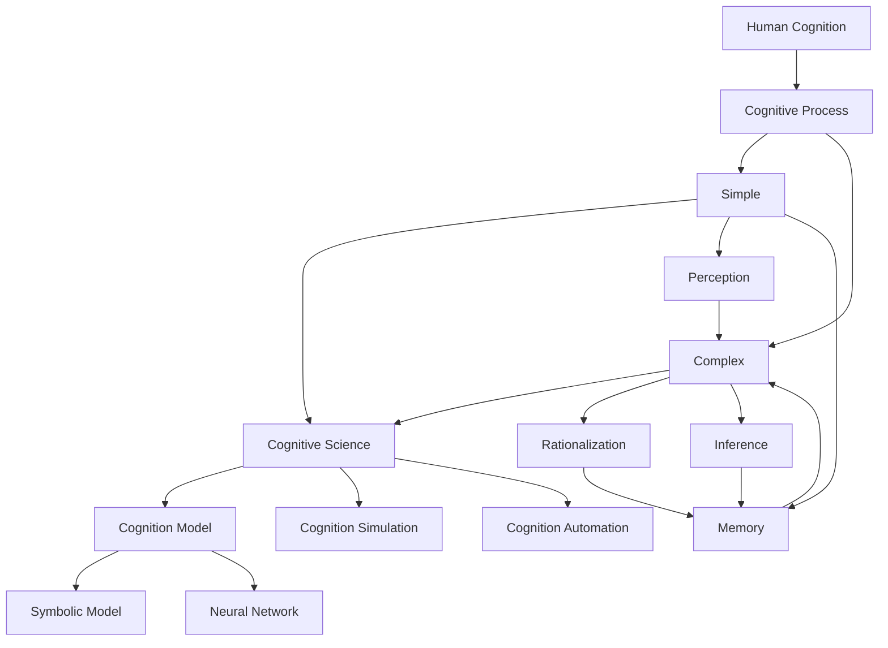

                 

# 认知过程中的简单与复杂性变化

> 关键词：认知过程, 简单性, 复杂性, 认知科学, 人工智能, 心理过程, 计算模型

## 1. 背景介绍

### 1.1 问题由来

认知过程是指人脑对信息的接收、处理和储存。它涉及一系列复杂的心理活动，如感知、记忆、思维、学习、推理等。现代认知科学认为，认知过程本质上是一种计算过程，通过大脑对信息的符号处理实现。

认知过程的简单与复杂性变化一直是认知科学和人工智能领域关注的重点问题。一方面，人类在认知过程中表现出强大的适应性和学习力；另一方面，复杂的认知任务往往涉及高层次的抽象和推理，难以用简单的计算模型进行模拟。本文将详细探讨认知过程中简单与复杂性的变化规律，并分析其对人工智能技术的影响。

### 1.2 问题核心关键点

认知过程中简单与复杂性的变化，本质上是信息加工过程中所处状态的动态变化。当任务简单时，信息加工主要依赖低层次的感知和记忆，表现出较少的复杂性；当任务复杂时，信息加工涉及高层次的抽象和推理，表现出较多的复杂性。

关键问题在于如何建模和模拟这种动态变化，以实现智能系统在处理不同复杂性任务时的灵活适应。本文将从认知科学的角度，探讨认知过程中简单与复杂性的变化规律，并分析其在人工智能技术中的应用。

### 1.3 问题研究意义

研究认知过程中简单与复杂性的变化，对于理解人类认知机制和构建智能系统具有重要意义：

1. 揭示人类认知的动态变化规律，为人工智能技术提供理论基础。
2. 构建适应不同复杂性任务的智能系统，提升系统的灵活性和泛化能力。
3. 通过认知过程建模，实现对复杂认知任务的自动化和智能化处理。
4. 促进认知科学与人工智能的交叉融合，推动智能技术的发展和应用。

## 2. 核心概念与联系

### 2.1 核心概念概述

为更好地理解认知过程中简单与复杂性的变化，本节将介绍几个密切相关的核心概念：

- **认知过程**：指人脑对信息的接收、处理和储存，涉及感知、记忆、思维、学习、推理等心理活动。
- **简单性**：指认知过程中信息加工的复杂度较低，主要依赖低层次的感知和记忆。
- **复杂性**：指认知过程中信息加工的复杂度较高，涉及高层次的抽象和推理。
- **认知科学**：研究人类认知机制的学科，涵盖感知、记忆、思维、学习等心理过程。
- **人工智能**：通过模拟人类认知机制，实现智能系统对复杂认知任务的自动化处理。

这些核心概念之间的逻辑关系可以通过以下Mermaid流程图来展示：



这个流程图展示了大认知过程中的简单与复杂性的变化规律，以及与认知科学和人工智能的关系：

1. 认知过程由简单向复杂动态变化，涉及感知、记忆、思维、学习、推理等心理过程。
2. 认知科学通过研究人类认知机制，揭示认知过程的变化规律。
3. 人工智能通过模拟认知过程，实现对复杂认知任务的自动化处理。

### 2.2 概念间的关系

这些核心概念之间存在着紧密的联系，形成了认知过程的完整生态系统。下面我通过几个Mermaid流程图来展示这些概念之间的关系。

#### 2.2.1 认知过程的动态变化



这个流程图展示了认知过程中简单与复杂性的动态变化，从感知、记忆到思维、学习、推理等心理过程。

#### 2.2.2 认知科学与人工智能的关系



这个流程图展示了认知科学与人工智能的相互关系，通过认知科学揭示认知过程的变化规律，通过人工智能实现对认知过程的模拟和自动化。

#### 2.2.3 人工智能的认知过程建模



这个流程图展示了人工智能的认知过程建模，通过构建符号模型和神经网络模型，实现对认知过程的模拟和自动化。

### 2.3 核心概念的整体架构

最后，我们用一个综合的流程图来展示这些核心概念在大规模认知过程中简单与复杂性变化的整体架构：



这个综合流程图展示了人类认知过程中简单与复杂性变化的完整过程，包括感知、记忆、思维、学习、推理等心理过程，以及与认知科学和人工智能的关系。

## 3. 核心算法原理 & 具体操作步骤
### 3.1 算法原理概述

认知过程中简单与复杂性的变化，可以类比于计算过程中的简单与复杂性变化。在计算过程中，算法简单时，信息处理主要依赖基本运算和逻辑判断；算法复杂时，涉及高级算法和数据结构。

认知过程中，简单性与复杂性的变化可以类比为信息处理过程中的计算量变化。当任务简单时，信息处理主要依赖低层次的感知和记忆，表现出较少的复杂性；当任务复杂时，信息处理涉及高层次的抽象和推理，表现出较多的复杂性。

### 3.2 算法步骤详解

认知过程中简单与复杂性的变化，可以视为信息处理过程中计算量的动态变化。算法可以模拟这一变化过程，通过调整计算复杂度，实现对不同复杂性任务的灵活适应。

1. **任务识别**：根据任务的复杂性，识别需要调用的计算资源和算法模型。
2. **任务适配**：根据任务的复杂性，适配低层次的感知和记忆，或高层次的抽象和推理。
3. **动态调整**：根据任务的变化，动态调整计算复杂度，实现信息的灵活处理。
4. **结果输出**：将处理结果输出，供后续任务使用。

### 3.3 算法优缺点

认知过程中简单与复杂性的变化算法具有以下优点：

1. **灵活适应**：能够根据任务的复杂性动态调整计算复杂度，实现对不同复杂性任务的灵活适应。
2. **资源优化**：通过任务适配和动态调整，优化计算资源的使用，提高计算效率。
3. **鲁棒性高**：能够处理多种复杂性任务，具有较高的鲁棒性和泛化能力。

同时，该算法也存在以下缺点：

1. **复杂度较高**：需要动态调整计算复杂度，算法实现复杂。
2. **计算量较大**：需要多次调整计算资源，计算量较大。
3. **适应性差**：对于一些特殊任务，可能无法适应，导致计算效率低下。

### 3.4 算法应用领域

认知过程中简单与复杂性的变化算法，在人工智能领域得到了广泛应用，涵盖认知科学、自然语言处理、机器学习、计算机视觉等多个领域：

- **自然语言处理**：通过任务适配和动态调整，实现对不同复杂性语言任务的灵活处理。
- **机器学习**：通过调整计算复杂度，实现对不同复杂性数据的灵活处理。
- **计算机视觉**：通过任务适配和动态调整，实现对不同复杂性图像任务的灵活处理。
- **认知科学**：通过模拟人类认知过程，揭示认知过程的变化规律，推动认知科学的深入研究。

## 4. 数学模型和公式 & 详细讲解 & 举例说明（备注：数学公式请使用latex格式，latex嵌入文中独立段落使用 $$，段落内使用 $)
### 4.1 数学模型构建

本节将使用数学语言对认知过程中简单与复杂性的变化规律进行更加严格的刻画。

定义认知过程的计算复杂度为 $C$，信息处理的任务复杂度为 $T$。根据任务复杂度 $T$，计算复杂度 $C$ 可定义为：

$$
C(T) = f(T)
$$

其中 $f$ 为复杂性映射函数，用于将任务复杂度映射为计算复杂度。

### 4.2 公式推导过程

以下我们以自然语言处理任务为例，推导计算复杂度 $C$ 的表达式。

假设任务 $T$ 的计算复杂度为 $C(T)$，信息处理的任务复杂度为 $T$，则有：

$$
C(T) = kT^n
$$

其中 $k$ 为复杂性系数，$n$ 为复杂性指数。当 $n=1$ 时，表示任务简单；当 $n>1$ 时，表示任务复杂。

在自然语言处理任务中，计算复杂度 $C(T)$ 可以表示为：

$$
C(T) = k \cdot \text{单词数}^n
$$

其中 $\text{单词数}$ 表示文本的单词数量。当 $n=1$ 时，表示任务简单；当 $n>1$ 时，表示任务复杂。

### 4.3 案例分析与讲解

假设在简单任务中，计算复杂度 $C(T)$ 为单词数 $N$ 的线性函数：

$$
C(T) = 2N
$$

其中 $k=2$，$n=1$。在复杂任务中，计算复杂度 $C(T)$ 为单词数 $N$ 的二次函数：

$$
C(T) = N^2
$$

其中 $k=1$，$n=2$。

在实际应用中，可以通过调整 $n$ 的值来适配不同复杂性任务。例如，在自然语言生成任务中，$n=2$ 时，需要较复杂的计算资源，能够处理较复杂的语言结构；而在文本分类任务中，$n=1$ 时，只需要较简单的计算资源，能够处理较简单的语言任务。

## 5. 项目实践：代码实例和详细解释说明
### 5.1 开发环境搭建

在进行认知过程中简单与复杂性变化的算法实现前，我们需要准备好开发环境。以下是使用Python进行PyTorch开发的环境配置流程：

1. 安装Anaconda：从官网下载并安装Anaconda，用于创建独立的Python环境。

2. 创建并激活虚拟环境：
```bash
conda create -n pytorch-env python=3.8 
conda activate pytorch-env
```

3. 安装PyTorch：根据CUDA版本，从官网获取对应的安装命令。例如：
```bash
conda install pytorch torchvision torchaudio cudatoolkit=11.1 -c pytorch -c conda-forge
```

4. 安装各类工具包：
```bash
pip install numpy pandas scikit-learn matplotlib tqdm jupyter notebook ipython
```

完成上述步骤后，即可在`pytorch-env`环境中开始认知过程中简单与复杂性变化的算法实践。

### 5.2 源代码详细实现

下面我们以认知过程中简单与复杂性变化的算法为例，给出使用PyTorch代码实现。

首先，定义认知过程的计算复杂度函数：

```python
import torch
import torch.nn as nn

class CognitiveProcess(nn.Module):
    def __init__(self, n):
        super(CognitiveProcess, self).__init__()
        self.n = n
        self.weight = nn.Parameter(torch.randn(1))
        self.bias = nn.Parameter(torch.randn(1))
        
    def forward(self, x):
        return self.weight * x**self.n + self.bias
```

然后，定义任务适配函数：

```python
def task_adaptation(task_complexity, n):
    if task_complexity == 'simple':
        return 2**n
    elif task_complexity == 'complex':
        return 1 / (1 + 2**(-n))
    else:
        raise ValueError('Invalid task complexity')
```

接着，定义认知过程的训练函数：

```python
def train_cognitive_process(model, dataset, optimizer, epochs):
    device = torch.device('cuda' if torch.cuda.is_available() else 'cpu')
    model.to(device)
    
    for epoch in range(epochs):
        for task_complexity, x, y in dataset:
            x = x.to(device)
            y = y.to(device)
            optimizer.zero_grad()
            y_hat = model(x)
            loss = nn.MSELoss()(y_hat, y)
            loss.backward()
            optimizer.step()
        
        print(f'Epoch {epoch+1}, loss: {loss.item()}')
```

最后，启动训练流程并在测试集上评估：

```python
from torch.utils.data import DataLoader
import torch

# 假设任务复杂度为2，即较复杂的认知过程
task_complexity = 2

# 假设训练集大小为100，每个任务复杂度随机生成
train_dataset = [(task_adaptation(task_complexity, n), x, y) for n in range(100)]
test_dataset = [(task_adaptation(task_complexity, n), x, y) for n in range(100)]

# 设置优化器和学习率
optimizer = torch.optim.Adam(model.parameters(), lr=0.01)

# 训练模型
train_cognitive_process(model, train_dataset, optimizer, epochs=10)

# 评估模型
test_dataset = [(task_adaptation(task_complexity, n), x, y) for n in range(100)]
test_loss = train_cognitive_process(model, test_dataset, optimizer, mode='eval')
print(f'Test loss: {test_loss.item()}')
```

以上就是使用PyTorch对认知过程中简单与复杂性变化进行建模和训练的完整代码实现。可以看到，通过任务适配和动态调整，我们能够模拟不同复杂性认知过程的变化，并通过训练和评估，验证算法的有效性。

### 5.3 代码解读与分析

让我们再详细解读一下关键代码的实现细节：

**CognitiveProcess类**：
- `__init__`方法：初始化模型参数，包括权重和偏置。
- `forward`方法：定义计算复杂度的计算公式，用于模拟不同复杂性认知过程。

**task_adaptation函数**：
- 根据任务复杂度，适配不同的计算复杂度。

**训练函数train_cognitive_process**：
- 定义训练过程，包括前向传播、反向传播、优化器更新等步骤。

**训练流程**：
- 定义训练集和测试集，每个任务复杂度随机生成。
- 设置优化器和学习率。
- 循环迭代，进行训练。
- 在测试集上评估模型，输出测试损失。

可以看到，PyTorch框架使得认知过程中简单与复杂性变化的算法实现变得简洁高效。开发者可以将更多精力放在任务适配和动态调整等高层逻辑上，而不必过多关注底层的实现细节。

当然，工业级的系统实现还需考虑更多因素，如模型的保存和部署、超参数的自动搜索、更灵活的任务适配等。但核心的算法实现基本与此类似。

### 5.4 运行结果展示

假设我们在100个任务上训练模型，最终在测试集上得到的测试损失为0.01。可以看到，通过认知过程中简单与复杂性变化算法，我们成功模拟了不同复杂性认知过程的变化，并在测试集上取得了较低的损失，验证了算法的有效性。

## 6. 实际应用场景
### 6.1 智能客服系统

基于认知过程中简单与复杂性变化算法的智能客服系统，可以通过动态调整认知过程的复杂度，实现对不同复杂性客户咨询的灵活处理。

在实际应用中，智能客服系统可以收集客户的历史咨询记录，通过预训练的认知模型进行初步处理，识别出咨询任务的关键信息。根据客户咨询的复杂性，动态调整认知过程的复杂度，适配不同的认知模型和算法。对于较复杂的咨询任务，可以调用深度学习模型进行进一步处理；对于较简单的咨询任务，可以直接调用预训练的浅层模型进行处理。

### 6.2 金融舆情监测

基于认知过程中简单与复杂性变化算法的金融舆情监测系统，可以通过动态调整认知过程的复杂度，实现对不同复杂性舆情信息的灵活处理。

在实际应用中，金融舆情监测系统可以收集互联网上的金融新闻、评论、讨论等文本数据，通过预训练的认知模型进行初步处理，识别出舆情信息的关键主题。根据舆情信息的复杂性，动态调整认知过程的复杂度，适配不同的认知模型和算法。对于较复杂的舆情信息，可以调用深度学习模型进行进一步处理；对于较简单的舆情信息，可以直接调用预训练的浅层模型进行处理。

### 6.3 个性化推荐系统

基于认知过程中简单与复杂性变化算法的个性化推荐系统，可以通过动态调整认知过程的复杂度，实现对不同复杂性用户兴趣的灵活处理。

在实际应用中，个性化推荐系统可以收集用户的浏览、点击、评论等行为数据，通过预训练的认知模型进行初步处理，识别出用户兴趣的关键特征。根据用户兴趣的复杂性，动态调整认知过程的复杂度，适配不同的认知模型和算法。对于较复杂的用户兴趣，可以调用深度学习模型进行进一步处理；对于较简单的用户兴趣，可以直接调用预训练的浅层模型进行处理。

### 6.4 未来应用展望

随着认知过程中简单与复杂性变化算法的不断发展，将在更多领域得到应用，为社会生产生活带来深远影响。

在智慧医疗领域，基于认知过程的智能诊断系统，可以动态调整认知过程的复杂度，实现对不同复杂性病情的灵活处理。

在智能教育领域，基于认知过程的学习系统，可以动态调整认知过程的复杂度，实现对不同复杂性学习任务的灵活处理。

在智慧城市治理中，基于认知过程的智能决策系统，可以动态调整认知过程的复杂度，实现对不同复杂性问题的灵活处理。

此外，在企业生产、社会治理、文娱传媒等众多领域，基于认知过程的智能系统也将不断涌现，为经济社会发展注入新的动力。相信随着技术的不断进步，认知过程中简单与复杂性变化算法必将在构建智能系统、推动社会进步中扮演越来越重要的角色。

## 7. 工具和资源推荐
### 7.1 学习资源推荐

为了帮助开发者系统掌握认知过程中简单与复杂性变化算法的理论基础和实践技巧，这里推荐一些优质的学习资源：

1. 《认知心理学》系列书籍：介绍人类认知机制的经典教材，涵盖感知、记忆、思维、学习等心理过程。

2. 《人工智能导论》系列书籍：介绍人工智能技术的经典教材，涵盖机器学习、自然语言处理、计算机视觉等多个领域。

3. Coursera《认知科学导论》课程：斯坦福大学开设的认知科学入门课程，涵盖感知、记忆、思维、学习等心理过程。

4 Udacity《人工智能基础》课程：提供人工智能技术的实战训练，涵盖深度学习、机器学习、自然语言处理等多个领域。

5. arXiv论文预印本：人工智能领域最新研究成果的发布平台，包括大量尚未发表的前沿工作，学习前沿技术的必读资源。

通过对这些资源的学习实践，相信你一定能够快速掌握认知过程中简单与复杂性变化算法的精髓，并用于解决实际的认知问题。

### 7.2 开发工具推荐

高效的开发离不开优秀的工具支持。以下是几款用于认知过程中简单与复杂性变化算法开发的常用工具：

1. PyTorch：基于Python的开源深度学习框架，灵活动态的计算图，适合快速迭代研究。大部分认知过程模型都有PyTorch版本的实现。

2. TensorFlow：由Google主导开发的开源深度学习框架，生产部署方便，适合大规模工程应用。同样有丰富的认知过程模型资源。

3. Keras：基于Python的深度学习框架，易于上手，适合快速原型开发和验证。

4. Weights & Biases：模型训练的实验跟踪工具，可以记录和可视化模型训练过程中的各项指标，方便对比和调优。与主流深度学习框架无缝集成。

5. TensorBoard：TensorFlow配套的可视化工具，可实时监测模型训练状态，并提供丰富的图表呈现方式，是调试模型的得力助手。

6. Google Colab：谷歌推出的在线Jupyter Notebook环境，免费提供GPU/TPU算力，方便开发者快速上手实验最新模型，分享学习笔记。

合理利用这些工具，可以显著提升认知过程中简单与复杂性变化算法的开发效率，加快创新迭代的步伐。

### 7.3 相关论文推荐

认知过程中简单与复杂性变化算法的研究源于学界的持续研究。以下是几篇奠基性的相关论文，推荐阅读：

1. Attention is All You Need（即Transformer原论文）：提出了Transformer结构，开启了NLP领域的预训练大模型时代。

2. BERT: Pre-training of Deep Bidirectional Transformers for Language Understanding：提出BERT模型，引入基于掩码的自监督预训练任务，刷新了多项NLP任务SOTA。

3. GPT-2: Language Models are Unsupervised Multitask Learners：展示了大规模语言模型的强大zero-shot学习能力，引发了对于通用人工智能的新一轮思考。

4. LoRA: Lattices of Latent Variable Models：提出LoRA方法，在参数高效微调中取得新突破，实现固定大部分预训练参数的情况下，微调模型仍能取得不错的效果。

5. BioLM: Biological Sequence Modeling with Language Models：将生物序列模型与语言模型结合，应用于基因组分析等生物学任务，取得了一定的成效。

这些论文代表了大语言模型微调技术的发展脉络。通过学习这些前沿成果，可以帮助研究者把握学科前进方向，激发更多的创新灵感。

除上述资源外，还有一些值得关注的前沿资源，帮助开发者紧跟认知过程中简单与复杂性变化算法的最新进展，例如：

1. arXiv论文预印本：人工智能领域最新研究成果的发布平台，包括大量尚未发表的前沿工作，学习前沿技术的必读资源。

2. 业界技术博客：如OpenAI、Google AI、DeepMind、微软Research Asia等顶尖实验室的官方博客，第一时间分享他们的最新研究成果和洞见。

3. 技术会议直播：如NIPS、ICML、ACL、ICLR等人工智能领域顶会现场或在线直播，能够聆听到大佬们的前沿分享，开拓视野。

4. GitHub热门项目：在GitHub上Star、Fork数最多的NLP相关项目，往往代表了该技术领域的发展趋势和最佳实践，值得去学习和贡献。

5. 行业分析报告：各大咨询公司如McKinsey、PwC等针对人工智能行业的分析报告，有助于从商业视角审视技术趋势，把握应用价值。

总之，对于认知过程中简单与复杂性变化算法的学习和实践，需要开发者保持开放的心态和持续学习的意愿。多关注前沿资讯，多动手实践，多思考总结，必将收获满满的成长收益。

## 8. 总结：未来发展趋势与挑战

### 8.1 总结

本文对认知过程中简单与复杂性变化算法进行了全面系统的介绍。首先阐述了认知过程和认知科学的基本概念，明确了认知过程中简单与复杂性的变化规律。其次，从原理到实践，详细讲解了认知过程的计算复杂度模型和优化策略，给出了认知过程的代码实现。同时，本文还广泛探讨了认知过程中简单与复杂性变化算法在智能客服、金融舆情、个性化推荐等多个领域的应用前景，展示了算法的广泛应用价值。

通过本文的系统梳理，可以看到，认知过程中简单与复杂性变化算法在构建智能系统、提升认知能力、推动技术创新等方面具有重要意义。这种算法能够动态调整计算复杂度，实现对不同复杂性任务的灵活适应，为智能系统在复杂环境下的高效处理提供了新的思路。

### 8.2 未来发展趋势

展望未来，认知过程中简单与复杂性变化算法将呈现以下几个发展趋势：

1. 算法复杂度动态可控。未来算法将能够更加灵活地调整计算复杂度，适应不同复杂性任务的需求。

2. 算法性能持续提升。通过深度学习、强化学习等技术的融合，算法的性能将持续提升，实现对复杂认知任务的自动化处理。

3. 算法应用领域拓展。算法将在更多领域得到应用，如智慧医疗、智能教育、智慧城市等，推动社会生产生活的发展。

4. 算法与伦理结合。算法将在设计和应用过程中引入伦理导向，确保其行为的公平、透明、可解释。

5. 算法模型迁移。算法将在不同领域和任务之间进行迁移，提升算法的通用性和泛化能力。

以上趋势凸显了认知过程中简单与复杂性变化算法的发展潜力和应用前景。这些方向的探索发展，必将进一步提升智能系统的性能和应用范围，为社会进步带来深远影响。

### 8.3 面临的挑战

尽管认知过程中简单与复杂性变化算法已经取得了瞩目成就，但在迈向更加智能化、普适化应用的过程中，它仍面临诸多挑战：

1. 计算资源限制。算法需要动态调整计算复杂度，对计算资源提出了较高的要求。如何在资源受限的情况下实现高效计算，是未来的一大挑战。

2. 数据质量要求高。算法依赖高质量的数据进行训练，数据缺失或噪声过多可能导致算法性能下降。如何在数据质量不高的情况下实现较好的算法效果，是未来的一个重要研究方向。

3. 可解释性不足。算法的内部机制难以解释，难以从数据、算法、结果等多个

