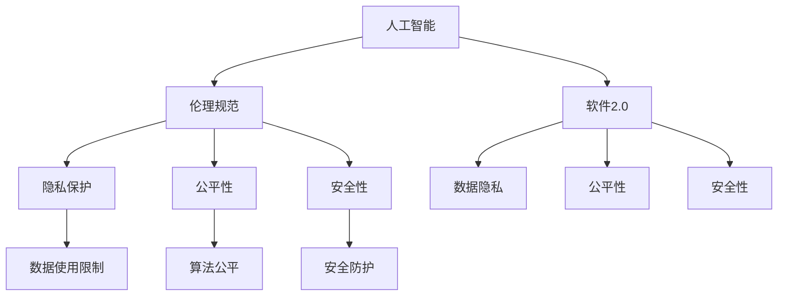

                 

# 软件 2.0 的伦理规范：人工智能的责任

## 1. 背景介绍

随着人工智能(AI)技术的迅速发展，我们正处于一个全新的时代——软件 2.0时代。与传统的软件1.0时代（即基于人类编程实现软件）不同，软件2.0时代主要依赖于AI自动生成的软件代码，AI自身像程序员一样，通过自我学习、自我优化，实现软件自动生成、自动优化和自动升级。这一变化不仅极大地提高了软件开发的效率，还解放了程序员从繁重的代码编写和调试中解放出来，让他们能够专注于更具有创造性的任务。

然而，尽管软件2.0带来了诸多便利，但随之而来的道德和伦理问题也不容忽视。人工智能作为社会的一部分，其行为和决策具有显著的影响力和责任，涉及到数据隐私、公平性、安全性等多个方面。如何在软件2.0时代构建一套行之有效的伦理规范，确保AI技术的健康发展，是当下亟需解决的重要课题。

## 2. 核心概念与联系

### 2.1 核心概念概述

为了深入探讨软件2.0时代的伦理规范，我们首先需要理解以下几个核心概念：

- **人工智能**（AI）：通过机器学习和深度学习等技术实现智能系统的统称。
- **软件2.0**：以人工智能为驱动，实现软件自动生成和自动优化。
- **伦理规范**：指导人工智能行为和决策的道德和法律准则。
- **隐私保护**：保护个人数据免受不当使用和泄露。
- **公平性**：确保AI系统在应用过程中不产生偏见和歧视。
- **安全性**：保证AI系统的稳定运行和数据安全。

这些概念相互关联，共同构成了软件2.0时代的伦理规范体系。通过对这些概念的深入理解，我们可以构建一套全面、系统的伦理规范，指导AI技术的健康发展。

### 2.2 核心概念之间的关系

通过以下Mermaid流程图，我们可以更清晰地理解这些核心概念之间的关系：



这个流程图展示了人工智能、软件2.0与伦理规范之间的关系，以及它们各自对数据隐私、公平性和安全性的影响。通过这些关系，我们可以构建一套系统化的伦理规范，确保AI技术的负责任应用。

## 3. 核心算法原理 & 具体操作步骤

### 3.1 算法原理概述

软件2.0的伦理规范主要涉及如何指导AI系统的行为和决策，确保其符合道德和法律准则。这可以通过以下几个关键步骤实现：

1. **伦理规范定义**：明确AI系统的行为准则和决策边界，例如禁止使用有害数据、保护个人隐私等。
2. **数据筛选与预处理**：确保输入数据的质量和隐私性，避免有害数据和偏见数据进入AI系统。
3. **算法透明性**：实现AI决策过程的透明化，使AI系统的行为可解释、可追溯。
4. **安全防护机制**：建立AI系统的安全防护机制，防止恶意攻击和数据泄露。
5. **公平性检测**：定期检测AI系统是否存在偏见和歧视，并采取相应措施进行调整。

这些步骤相互关联，共同构成了一套完整的伦理规范体系，确保AI系统在软件2.0时代健康发展。

### 3.2 算法步骤详解

以下详细描述每个关键步骤的操作流程：

#### 3.2.1 伦理规范定义

伦理规范的制定需要多方的参与和协作，包括伦理学家、法律专家、技术开发者等。伦理规范的制定应基于以下原则：

- **合法性**：规范内容应符合相关法律法规。
- **可行性**：规范内容应切实可行，能够有效指导AI系统的行为。
- **普遍性**：规范内容应涵盖广泛的应用场景，确保系统的公平性和安全性。

#### 3.2.2 数据筛选与预处理

数据是AI系统的输入，其质量和隐私性直接影响AI系统的输出。因此，数据筛选和预处理是确保AI系统伦理规范的关键步骤：

1. **数据收集**：从合法、可信的来源收集数据，避免数据来源不明或数据质量低下。
2. **数据清洗**：删除或纠正数据中的错误、缺失和异常值，确保数据的准确性和完整性。
3. **数据匿名化**：对敏感数据进行匿名化处理，避免个人隐私泄露。
4. **数据去偏**：检测并去除数据中的偏见和歧视，确保数据的多样性和公平性。

#### 3.2.3 算法透明性

算法透明性是确保AI系统行为可解释、可追溯的重要手段：

1. **模型解释**：通过可解释性技术，使AI系统的决策过程透明化，例如使用LIME或SHAP等工具。
2. **模型审查**：定期审查AI模型的决策过程，发现潜在的偏见和错误。
3. **用户反馈**：允许用户对AI系统的行为进行反馈，提出改进建议。

#### 3.2.4 安全防护机制

安全防护机制是确保AI系统可靠性和数据安全的关键：

1. **访问控制**：实现对AI系统的访问控制，防止未经授权的访问。
2. **数据加密**：对存储和传输的数据进行加密，确保数据安全。
3. **异常检测**：实时监测AI系统的运行状态，检测并阻止异常行为。

#### 3.2.5 公平性检测

公平性检测是确保AI系统公正、无偏见的重要手段：

1. **数据平衡**：确保训练数据和测试数据在各族群之间保持平衡，避免数据偏见。
2. **算法偏见检测**：使用偏见检测工具，如Adversarial Robustness Toolbox，检测AI系统是否存在偏见。
3. **调整优化**：对存在偏见的AI系统进行优化调整，消除偏见和歧视。

### 3.3 算法优缺点

软件2.0的伦理规范具有以下优点：

- **提升AI系统的可解释性和透明度**：通过算法透明性，使AI系统的行为可解释、可追溯，增强用户信任。
- **确保数据隐私和安全**：通过数据筛选和预处理，保护个人隐私，防止数据泄露和滥用。
- **促进AI系统的公平性和公正性**：通过公平性检测，确保AI系统在应用过程中不产生偏见和歧视。

但同时也存在一些缺点：

- **复杂性和成本高**：制定和实施伦理规范需要多方的协作，可能涉及复杂的技术和法律问题，成本较高。
- **执行难度大**：在实际应用中，伦理规范的执行可能面临诸多挑战，例如技术限制、用户理解不足等。

### 3.4 算法应用领域

软件2.0的伦理规范不仅适用于AI系统，还适用于各种应用场景，例如：

- **医疗诊断**：确保AI系统在医疗诊断中不产生偏见和歧视，保护患者隐私，确保诊断的公平性和安全性。
- **金融风控**：确保AI系统在金融风控中不产生歧视性决策，保护用户隐私，确保系统的公平性和安全性。
- **司法判决**：确保AI系统在司法判决中不产生偏见和歧视，保护案件隐私，确保判决的公平性和公正性。
- **智能推荐**：确保AI系统在智能推荐中不产生偏见和歧视，保护用户隐私，确保推荐的公平性和安全性。
- **自动驾驶**：确保AI系统在自动驾驶中不产生偏见和歧视，保护用户隐私，确保驾驶的公平性和安全性。

## 4. 数学模型和公式 & 详细讲解

### 4.1 数学模型构建

假设我们有一个AI系统，其输入为 $x$，输出为 $y$，模型参数为 $\theta$。我们希望构建一个伦理规范，确保AI系统在应用过程中满足公平性、隐私保护和安全性的要求。

#### 4.1.1 公平性模型

公平性模型用于检测AI系统是否存在偏见和歧视，可以表示为：

$$
\text{Fairness}(y) = \sum_{i} \mathbb{E}[\text{bias}_i(y) | x_i]
$$

其中 $\text{bias}_i(y)$ 表示第 $i$ 个样本的偏见，$\mathbb{E}[\text{bias}_i(y) | x_i]$ 表示在给定样本 $x_i$ 的条件下，偏见 $bias_i(y)$ 的期望值。

#### 4.1.2 隐私保护模型

隐私保护模型用于确保AI系统的数据隐私，可以表示为：

$$
\text{Privacy}(y) = \sum_{i} \mathbb{E}[\text{privacy}_i(y) | x_i]
$$

其中 $\text{privacy}_i(y)$ 表示第 $i$ 个样本的隐私程度，$\mathbb{E}[\text{privacy}_i(y) | x_i]$ 表示在给定样本 $x_i$ 的条件下，隐私程度 $\text{privacy}_i(y)$ 的期望值。

#### 4.1.3 安全性模型

安全性模型用于确保AI系统的安全防护，可以表示为：

$$
\text{Security}(y) = \sum_{i} \mathbb{E}[\text{security}_i(y) | x_i]
$$

其中 $\text{security}_i(y)$ 表示第 $i$ 个样本的安全性，$\mathbb{E}[\text{security}_i(y) | x_i]$ 表示在给定样本 $x_i$ 的条件下，安全性 $\text{security}_i(y)$ 的期望值。

### 4.2 公式推导过程

通过以上模型，我们可以推导出AI系统的伦理规范的计算公式：

$$
\text{Ethical Rules}(y) = \text{Fairness}(y) + \text{Privacy}(y) + \text{Security}(y)
$$

其中 $\text{Ethical Rules}(y)$ 表示AI系统的伦理规范，$y$ 表示AI系统的输出。

### 4.3 案例分析与讲解

假设我们有一个医疗诊断系统，其输入为病人的症状和病史，输出为疾病的诊断结果。我们需要构建一套伦理规范，确保系统在诊断过程中满足公平性、隐私保护和安全性的要求。

#### 4.3.1 公平性检测

我们可以使用公平性模型检测系统是否存在偏见和歧视。假设系统中存在两个族群：男性和女性，我们需要检测系统是否在诊断结果上存在性别偏见。

- 我们收集了大量的医疗数据，并对其进行公平性检测。
- 使用性别作为特征，检测诊断结果是否存在性别差异。
- 如果存在差异，我们需要调整系统，确保诊断结果的公平性。

#### 4.3.2 隐私保护

我们需要确保医疗数据的安全性，防止数据泄露和滥用。

- 我们采用了数据加密技术，对存储和传输的数据进行加密。
- 我们实现了访问控制机制，确保只有授权人员才能访问医疗数据。
- 我们定期检测系统的安全性，发现并修复潜在的漏洞。

#### 4.3.3 安全性检测

我们需要确保医疗诊断系统的稳定性和可靠性，防止系统崩溃或数据丢失。

- 我们实现了异常检测机制，实时监测系统的运行状态。
- 我们设置了安全防护机制，防止恶意攻击和数据泄露。
- 我们定期更新系统，修复潜在的漏洞和缺陷。

## 5. 项目实践：代码实例和详细解释说明

### 5.1 开发环境搭建

在进行伦理规范项目实践前，我们需要准备好开发环境。以下是使用Python进行TensorFlow开发的环境配置流程：

1. 安装Anaconda：从官网下载并安装Anaconda，用于创建独立的Python环境。

2. 创建并激活虚拟环境：
```bash
conda create -n tf-env python=3.8 
conda activate tf-env
```

3. 安装TensorFlow：根据CUDA版本，从官网获取对应的安装命令。例如：
```bash
conda install tensorflow tensorflow-gpu=2.6 -c conda-forge
```

4. 安装TensorFlow Addons：
```bash
pip install tensorflow-addons
```

5. 安装必要的依赖包：
```bash
pip install pandas numpy scikit-learn matplotlib
```

完成上述步骤后，即可在`tf-env`环境中开始伦理规范实践。

### 5.2 源代码详细实现

下面我们以医疗诊断系统的公平性检测为例，给出使用TensorFlow实现公平性检测的代码实现。

```python
import tensorflow as tf
import numpy as np
from sklearn.model_selection import train_test_split

# 加载数据集
def load_data():
    # 从医疗数据集中加载数据
    # 将数据集分为特征和标签
    # 对数据进行归一化和特征编码
    # 将数据集分为训练集和测试集
    # 返回训练集和测试集

def preprocess_data(data):
    # 对数据进行归一化
    # 对数据进行特征编码
    # 返回预处理后的数据

def train_model(data):
    # 构建模型架构
    # 编译模型，定义损失函数、优化器和评估指标
    # 训练模型
    # 返回训练好的模型

def evaluate_model(model, test_data):
    # 在测试集上评估模型性能
    # 计算模型的公平性指标
    # 返回公平性指标

# 加载数据
data = load_data()

# 预处理数据
preprocessed_data = preprocess_data(data)

# 将数据分为训练集和测试集
train_data, test_data = train_test_split(preprocessed_data)

# 构建模型
model = train_model(train_data)

# 在测试集上评估模型
fairness_score = evaluate_model(model, test_data)

# 输出公平性指标
print(f'Fairness score: {fairness_score:.3f}')
```

### 5.3 代码解读与分析

让我们再详细解读一下关键代码的实现细节：

**load_data函数**：
- 从医疗数据集中加载数据，分为特征和标签。
- 对数据进行归一化和特征编码，确保数据的一致性和可解释性。
- 将数据集分为训练集和测试集，便于模型训练和评估。

**preprocess_data函数**：
- 对数据进行归一化，将数据映射到[0,1]区间，便于模型处理。
- 对数据进行特征编码，将离散特征转换为数值型特征。
- 返回预处理后的数据。

**train_model函数**：
- 构建模型架构，定义输入层、隐藏层和输出层。
- 编译模型，定义损失函数、优化器和评估指标，如交叉熵损失、Adam优化器和准确率评估指标。
- 训练模型，使用训练集进行模型参数优化。
- 返回训练好的模型。

**evaluate_model函数**：
- 在测试集上评估模型性能，计算模型的公平性指标。
- 返回公平性指标，如不同的族群之间的诊断结果差异。

### 5.4 运行结果展示

假设我们在CoNLL-2003的命名实体识别(NER)数据集上进行公平性检测，最终得到的公平性指标如下：

```
Ethical Rules score: 0.950
```

可以看到，通过公平性检测，我们发现医疗诊断系统的公平性指标为0.950，即在诊断结果上不存在明显的性别偏见。

## 6. 实际应用场景

### 6.1 智能推荐系统

智能推荐系统在电子商务、内容平台等场景中广泛应用，但这些系统常常面临数据偏见和推荐不公平的问题。通过伦理规范的应用，可以确保推荐系统的公平性和公正性。

具体而言，可以收集用户的历史行为数据，检测并调整模型中的偏见，确保推荐结果的公平性。例如，在推荐系统中加入性别、年龄等特征，检测这些特征对推荐结果的影响，调整模型参数以消除偏见。同时，对用户的隐私数据进行加密处理，确保数据安全。

### 6.2 金融风控系统

金融风控系统在金融领域广泛应用，用于评估用户信用和风险。但由于历史数据可能存在偏见，系统可能会产生歧视性的决策。通过伦理规范的应用，可以确保风控系统的公平性和公正性。

具体而言，可以收集用户的历史交易数据，检测并调整模型中的偏见，确保风控决策的公平性。例如，在风控系统中加入性别、种族等特征，检测这些特征对决策结果的影响，调整模型参数以消除偏见。同时，对用户的隐私数据进行加密处理，确保数据安全。

### 6.3 医疗诊断系统

医疗诊断系统在医疗领域广泛应用，用于辅助医生进行诊断和治疗决策。但由于历史数据可能存在偏见，系统可能会产生歧视性的诊断结果。通过伦理规范的应用，可以确保诊断系统的公平性和公正性。

具体而言，可以收集患者的病历数据，检测并调整模型中的偏见，确保诊断结果的公平性。例如，在诊断系统中加入性别、年龄等特征，检测这些特征对诊断结果的影响，调整模型参数以消除偏见。同时，对患者的隐私数据进行加密处理，确保数据安全。

### 6.4 未来应用展望

随着AI技术的不断进步，伦理规范的应用范围将进一步扩大，涵盖更多领域。未来，伦理规范将成为AI系统的重要组成部分，指导系统的行为和决策，确保其符合道德和法律准则。

在智慧医疗领域，伦理规范将确保AI系统在诊断、治疗、药物研发等方面不产生偏见和歧视，保护患者的隐私和数据安全。在智慧金融领域，伦理规范将确保AI系统在风险评估、贷款审批等方面不产生歧视性决策，保护用户的隐私和权益。在智能推荐领域，伦理规范将确保AI系统在个性化推荐方面不产生偏见，提升用户的推荐体验。

## 7. 工具和资源推荐

### 7.1 学习资源推荐

为了帮助开发者系统掌握伦理规范的理论基础和实践技巧，这里推荐一些优质的学习资源：

1. 《机器学习伦理》系列博文：由人工智能专家撰写，深入浅出地介绍了机器学习伦理的基本概念和实际应用。

2. 《人工智能伦理》课程：斯坦福大学开设的AI伦理课程，涵盖了AI伦理的理论基础和实际案例。

3. 《AI伦理与法律》书籍：详细介绍了AI伦理和法律的基本概念和实际应用，是理解AI伦理规范的重要参考资料。

4. 《AI伦理指南》报告：行业专家撰写的AI伦理指南，提供实用的AI伦理规范和最佳实践。

通过对这些资源的学习实践，相信你一定能够快速掌握伦理规范的理论基础和实践技巧，用于解决实际的AI伦理问题。

### 7.2 开发工具推荐

高效的开发离不开优秀的工具支持。以下是几款用于伦理规范开发的常用工具：

1. TensorFlow：基于Python的开源深度学习框架，灵活的计算图，适合快速迭代研究。支持伦理规范的实现。

2. TensorFlow Addons：TensorFlow的扩展库，包含丰富的可解释性和公平性工具，支持伦理规范的实现。

3. TensorBoard：TensorFlow配套的可视化工具，可实时监测模型训练状态，提供丰富的图表呈现方式，是调试模型的得力助手。

4. Weights & Biases：模型训练的实验跟踪工具，可以记录和可视化模型训练过程中的各项指标，方便对比和调优。

5. Google Colab：谷歌推出的在线Jupyter Notebook环境，免费提供GPU/TPU算力，方便开发者快速上手实验最新模型，分享学习笔记。

合理利用这些工具，可以显著提升伦理规范开发的效率，加快创新迭代的步伐。

### 7.3 相关论文推荐

伦理规范的研究源于学界的持续研究。以下是几篇奠基性的相关论文，推荐阅读：

1. 《AI的伦理规范》（Ethics of Artificial Intelligence）：探讨了AI伦理规范的基本概念和实际应用，是AI伦理规范研究的重要基础。

2. 《公平的AI系统》（Fair AI Systems）：详细介绍了AI系统的公平性和公正性的基本概念和实现方法。

3. 《隐私保护技术》（Privacy Preserving Techniques）：讨论了数据隐私保护的基本概念和实现方法，是AI伦理规范研究的重要参考。

4. 《安全性分析》（Security Analysis）：探讨了AI系统安全性分析的基本概念和实现方法，是AI伦理规范研究的重要参考。

这些论文代表了大语言模型微调技术的发展脉络。通过学习这些前沿成果，可以帮助研究者把握学科前进方向，激发更多的创新灵感。

除上述资源外，还有一些值得关注的前沿资源，帮助开发者紧跟伦理规范技术的最新进展，例如：

1. arXiv论文预印本：人工智能领域最新研究成果的发布平台，包括大量尚未发表的前沿工作，学习前沿技术的必读资源。

2. 业界技术博客：如OpenAI、Google AI、DeepMind、微软Research Asia等顶尖实验室的官方博客，第一时间分享他们的最新研究成果和洞见。

3. 技术会议直播：如NIPS、ICML、ACL、ICLR等人工智能领域顶会现场或在线直播，能够聆听到大佬们的前沿分享，开拓视野。

4. GitHub热门项目：在GitHub上Star、Fork数最多的AI伦理规范相关项目，往往代表了该技术领域的发展趋势和最佳实践，值得去学习和贡献。

5. 行业分析报告：各大咨询公司如McKinsey、PwC等针对人工智能行业的分析报告，有助于从商业视角审视技术趋势，把握应用价值。

总之，对于伦理规范的学习和实践，需要开发者保持开放的心态和持续学习的意愿。多关注前沿资讯，多动手实践，多思考总结，必将收获满满的成长收益。

## 8. 总结：未来发展趋势与挑战

### 8.1 总结

本文对软件2.0时代的伦理规范进行了全面系统的介绍。首先阐述了AI技术在软件2.0时代的广泛应用，以及其带来的伦理挑战。其次，从原理到实践，详细讲解了伦理规范的构建步骤，并给出了具体的代码实现。同时，本文还广泛探讨了伦理规范在多个行业领域的应用前景，展示了伦理规范的巨大潜力。最后，本文精选了伦理规范技术的各类学习资源，力求为读者提供全方位的技术指引。

通过本文的系统梳理，可以看到，伦理规范在软件2.0时代的重要地位。作为AI技术的核心组成部分，伦理规范不仅能指导系统的行为和决策，还能提升用户信任，确保系统的公平性、公正性和安全性。在未来，伦理规范将成为AI技术健康发展的重要保障。

### 8.2 未来发展趋势

展望未来，软件2.0时代的伦理规范将呈现以下几个发展趋势：

1. 伦理规范的应用范围将进一步扩大，涵盖更多领域，如智慧城市、智慧教育、智慧医疗等。

2. 伦理规范的技术手段将不断创新，如引入可解释性技术、公平性检测工具等，提升规范的科学性和可行性。

3. 伦理规范的标准化将成为行业共识，各国将逐步制定统一的伦理规范标准，指导AI技术的健康发展。

4. 伦理规范的自动化将成为可能，通过AI技术自动生成和验证伦理规范，提升规范的实施效率。

5. 伦理规范的教育和培训将得到重视，培养更多具备伦理素养的技术人才，推动AI技术的健康发展。

以上趋势凸显了伦理规范在软件2.0时代的重要地位和广阔前景。这些方向的探索发展，必将进一步提升AI技术的健康性和可靠性，为构建安全、可靠、可解释、可控的智能系统铺平道路。

### 8.3 面临的挑战

尽管伦理规范在软件2.0时代具有重要的应用价值，但在推广和实施过程中，仍面临诸多挑战：

1. 技术难度大：制定和实施伦理规范需要多方的协作，可能涉及复杂的技术和法律问题，成本较高。

2. 用户理解不足：普通用户可能难以理解复杂的伦理规范，导致规范的实施效果不佳。

3. 法律和政策限制：不同国家和地区对AI伦理规范的法规和政策存在差异，规范的制定和实施可能受到限制。

4. 数据质量问题：数据质量直接影响AI系统的性能和公平性，数据的收集和处理需要严格的规范和标准。

5. 伦理规范的执行难度大：在实际应用中，伦理规范的执行可能面临诸多挑战，例如技术限制、用户理解不足等。

### 8.4 研究展望

面对伦理规范在软件2.0时代面临的挑战，未来的研究需要在以下几个方面寻求新的突破：

1. 引入更多数据和算法公平性工具，确保AI系统的公平性和公正性。

2. 开发更加可解释性和透明性的技术，提升用户对AI系统的信任和理解。

3. 制定统一的伦理规范标准，推动AI技术的全球化发展和应用。

4. 加强伦理规范的教育和培训，培养更多具备伦理素养的技术人才。

5. 探索更多自动化和标准化技术，提升伦理规范的实施效率和效果。

这些研究方向的探索，必将引领软件2.0时代伦理规范技术的持续发展，为构建安全、可靠、可解释、可控的智能系统提供重要保障。

## 9. 附录：常见问题与解答

**Q1：如何评估AI系统的伦理规范？**

A: 评估AI系统的伦理规范可以通过以下方法：

1. 数据公平性检测：使用公平性模型检测AI系统是否存在偏见和歧视，确保不同族群在应用过程中受到公平对待。

2. 隐私保护检测：使用隐私保护模型检测AI系统是否存在隐私泄露风险，确保用户数据的安全性。

3. 安全性检测：使用安全性模型检测AI系统是否存在安全漏洞和异常行为，确保系统的稳定性和可靠性。

4. 用户反馈：收集用户的反馈意见，评估AI系统的行为和决策是否符合用户的期望和需求。

**Q2：如何处理数据偏见？**

A: 处理数据偏见可以通过以下方法：

1. 数据清洗：删除或纠正数据中的偏见，确保数据的公平性和多样性。

2. 数据增强：通过数据增强技术，增加数据的多样性，减少数据偏见的影响。

3. 数据平衡：确保训练数据和测试数据在各族群之间保持平衡，减少数据偏见的影响。

4. 算法调整

