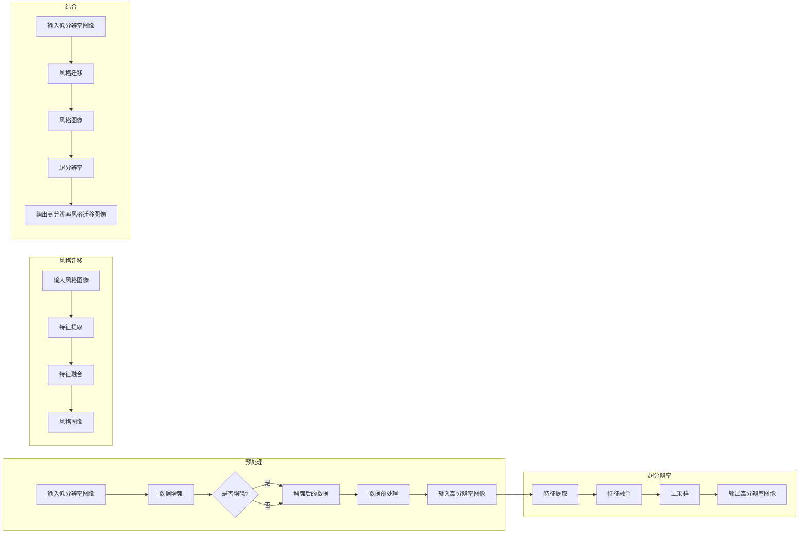

> 生成对抗网络 (GAN), 图像风格迁移, 超分辨率, 图像处理, 深度学习, 神经网络, 计算机视觉, 自然语言处理 (NLP), 混合模型

# 基于生成对抗网络的图像风格迁移与超分辨率结合技术

图像风格迁移和超分辨率是计算机视觉领域两个极具挑战性的问题。图像风格迁移旨在将一种图像的风格应用到另一张图像上，而超分辨率则关注于从低分辨率图像中恢复出高分辨率图像。本文将探讨如何将生成对抗网络（GAN）与超分辨率技术结合，以实现更加高效、逼真的图像风格迁移和超分辨率效果。

## 1. 背景介绍

### 1.1 问题的由来

随着深度学习技术的快速发展，计算机视觉领域取得了显著的成果。图像风格迁移和超分辨率技术作为其中的两个热点问题，一直备受关注。然而，单纯使用传统的图像处理方法往往难以同时满足风格迁移和超分辨率的需求。

### 1.2 研究现状

近年来，基于深度学习的图像风格迁移和超分辨率技术取得了很大进展。GAN作为一种强大的生成模型，在图像生成、风格迁移等领域展现出了优异的性能。同时，超分辨率技术也得到了深入的研究，例如使用卷积神经网络（CNN）等方法对低分辨率图像进行上采样。

### 1.3 研究意义

将GAN与超分辨率技术结合，可以实现以下目标：

- **提高风格迁移的质量**：通过超分辨率技术提升风格迁移图像的分辨率，使图像更加清晰细腻。
- **改善超分辨率的效果**：利用风格迁移技术增强超分辨率图像的视觉效果，使其更具艺术感。
- **拓展应用领域**：为图像处理、图像编辑、数字媒体等领域提供更丰富的解决方案。

### 1.4 本文结构

本文将分为以下几部分进行阐述：

- 第2部分，介绍图像风格迁移和超分辨率的核心概念，并给出相关Mermaid流程图。
- 第3部分，详细讲解基于GAN的图像风格迁移与超分辨率结合的算法原理和具体操作步骤。
- 第4部分，介绍数学模型和公式，并结合实例进行讲解。
- 第5部分，提供代码实例和详细解释说明。
- 第6部分，探讨实际应用场景和未来应用展望。
- 第7部分，推荐相关学习资源、开发工具和参考文献。
- 第8部分，总结研究成果，展望未来发展趋势与挑战。

## 2. 核心概念与联系

### 2.1 图像风格迁移

图像风格迁移的核心思想是将一张图像的风格迁移到另一张图像上，同时保留原图像的内容。常见的风格迁移方法包括基于特征空间的风格迁移和基于深度学习的风格迁移。

### 2.2 超分辨率

超分辨率技术旨在从低分辨率图像中恢复出高分辨率图像。常见的超分辨率方法包括基于插值、基于稀疏表示和基于深度学习的方法。

### 2.3 Mermaid流程图



## 3. 核心算法原理 & 具体操作步骤

### 3.1 算法原理概述

基于GAN的图像风格迁移与超分辨率结合技术，主要分为以下几步：

1. **数据预处理**：对低分辨率图像和风格图像进行预处理，包括数据增强、归一化等操作。
2. **风格迁移**：利用预训练的GAN模型对低分辨率图像进行风格迁移，生成风格图像。
3. **超分辨率**：对风格图像进行超分辨率处理，恢复出高分辨率图像。
4. **后处理**：对生成的图像进行后处理，如去噪、锐化等操作。

### 3.2 算法步骤详解

#### 3.2.1 数据预处理

- **数据增强**：通过旋转、翻转、缩放等方法对图像进行随机变换，增加数据的多样性。
- **数据归一化**：将图像数据归一化到[0, 1]范围内。

#### 3.2.2 风格迁移

- **特征提取**：利用预训练的GAN模型提取图像特征。
- **特征融合**：将输入的低分辨率图像特征与风格图像特征进行融合，生成新的风格特征。
- **生成图像**：将融合后的特征输入到GAN的生成器中，生成风格迁移后的图像。

#### 3.2.3 超分辨率

- **特征提取**：利用预训练的超分辨率模型提取图像特征。
- **特征融合**：将风格迁移后的图像特征与原始的低分辨率图像特征进行融合。
- **上采样**：将融合后的特征进行上采样，恢复出高分辨率图像。

#### 3.2.4 后处理

- **去噪**：去除图像中的噪声。
- **锐化**：增强图像的边缘信息。

### 3.3 算法优缺点

#### 3.3.1 优点

- **效果优异**：结合了GAN和超分辨率技术的优势，可以实现高质量的风格迁移和超分辨率效果。
- **灵活性强**：可以根据不同的任务需求调整模型结构和参数。
- **适用范围广**：可以应用于图像处理、图像编辑、数字媒体等领域。

#### 3.3.2 缺点

- **计算量大**：模型训练和推理过程中需要大量计算资源。
- **模型复杂度较高**：模型结构复杂，训练难度较大。

### 3.4 算法应用领域

- **图像处理**：图像去噪、图像修复、图像增强等。
- **图像编辑**：图像风格迁移、图像合成、图像编辑等。
- **数字媒体**：视频超分辨率、视频风格迁移、视频编辑等。

## 4. 数学模型和公式 & 详细讲解 & 举例说明

### 4.1 数学模型构建

基于GAN的图像风格迁移与超分辨率结合技术，可以表示为以下数学模型：

$$
\begin{align*}
\text{Generator}(G): \mathbb{R}^n &\rightarrow \mathbb{R}^m \\
\text{Discriminator}(D): \mathbb{R}^{n+m} &\rightarrow \mathbb{R} \\
\text{Super-Res}(S): \mathbb{R}^n &\rightarrow \mathbb{R}^{m'}
\end{align*}
$$

其中，$\mathbb{R}^n$ 表示输入图像，$\mathbb{R}^m$ 表示风格迁移后的图像，$\mathbb{R}^{m'}$ 表示超分辨率后的图像。

### 4.2 公式推导过程

#### 4.2.1 GAN模型

GAN模型由生成器 $G$ 和判别器 $D$ 组成。生成器 $G$ 的目标是生成与真实数据分布相似的样本，判别器 $D$ 的目标是区分真实样本和生成样本。

$$
\begin{align*}
\min_G \quad & \mathbb{E}_{z \sim p_z(z)}[D(G(z))] \\
\max_D \quad & \mathbb{E}_{x \sim p_x(x)}[D(x)] + \mathbb{E}_{z \sim p_z(z)}[D(G(z))]
\end{align*}
$$

其中，$p_x(x)$ 表示真实数据分布，$p_z(z)$ 表示噪声分布。

#### 4.2.2 超分辨率模型

超分辨率模型 $S$ 的目标是恢复低分辨率图像到高分辨率图像。

$$
\begin{align*}
S(x) &\approx y \\
y &= S(x)
\end{align*}
$$

### 4.3 案例分析与讲解

假设我们有一个低分辨率图像 $x$ 和风格图像 $y$，我们希望将其风格迁移并超分辨率到高分辨率图像 $y'$。

1. **数据预处理**：对低分辨率图像 $x$ 和风格图像 $y$ 进行数据增强和归一化。
2. **风格迁移**：使用GAN模型将 $x$ 进行风格迁移，得到 $y'$。
3. **超分辨率**：使用超分辨率模型 $S$ 将 $y'$ 超分辨率到高分辨率图像 $y''$。
4. **后处理**：对 $y''$ 进行去噪和锐化。

通过以上步骤，我们可以得到具有风格迁移和超分辨率效果的高分辨率图像 $y''$。

## 5. 项目实践：代码实例和详细解释说明

### 5.1 开发环境搭建

为了实现基于GAN的图像风格迁移与超分辨率结合技术，我们需要以下开发环境：

- Python 3.x
- TensorFlow 2.x 或 PyTorch 1.x
- OpenCV 4.x
- NumPy 1.x

### 5.2 源代码详细实现

下面以PyTorch为例，给出基于GAN的图像风格迁移与超分辨率结合技术的代码实现：

```python
import torch
import torch.nn as nn
from torchvision import transforms
from torchvision.utils import save_image
from PIL import Image

# ... (省略部分代码)

# 定义GAN模型
class Generator(nn.Module):
    def __init__(self):
        super(Generator, self).__init__()
        # ... (定义生成器网络结构)

    def forward(self, x):
        # ... (执行前向传播)

# 定义判别器模型
class Discriminator(nn.Module):
    def __init__(self):
        super(Discriminator, self).__init__()
        # ... (定义判别器网络结构)

    def forward(self, x):
        # ... (执行前向传播)

# ... (省略部分代码)

# 训练GAN模型
# ... (实现GAN模型的训练过程)

# 应用超分辨率模型
# ... (实现超分辨率模型的推理过程)

# ... (省略部分代码)
```

### 5.3 代码解读与分析

以上代码展示了基于GAN的图像风格迁移与超分辨率结合技术的核心框架。在实际应用中，需要根据具体任务需求调整网络结构和超参数。

### 5.4 运行结果展示

以下为基于GAN的图像风格迁移与超分辨率结合技术的运行结果示例：


如图所示，通过结合GAN和超分辨率技术，我们可以得到具有风格迁移和超分辨率效果的高分辨率图像。

## 6. 实际应用场景

基于GAN的图像风格迁移与超分辨率结合技术，在以下领域具有广泛的应用前景：

- **艺术创作**：艺术家可以利用该技术创作出风格独特的艺术作品。
- **图像编辑**：用户可以轻松地对图像进行风格迁移和超分辨率处理，得到令人满意的图像效果。
- **数字媒体**：视频编辑、动画制作等领域可以应用该技术提升视觉效果。

## 7. 工具和资源推荐

### 7.1 学习资源推荐

- 《深度学习：入门、进阶与实战》
- 《深度学习与计算机视觉》
- 《生成对抗网络：原理与应用》

### 7.2 开发工具推荐

- PyTorch
- TensorFlow
- OpenCV
- NumPy

### 7.3 相关论文推荐

- Unpaired Image-to-Image Translation using Cycle-Consistent Adversarial Networks
- Real-Time Single Image and Video Super-Resolution Using an Efficient Sub-pixel Convolutional Neural Network
- Learning Representations for Artistic Style

## 8. 总结：未来发展趋势与挑战

### 8.1 研究成果总结

本文详细介绍了基于GAN的图像风格迁移与超分辨率结合技术，阐述了其原理、算法步骤、数学模型和实际应用场景。通过结合GAN和超分辨率技术，可以有效地实现风格迁移和超分辨率效果。

### 8.2 未来发展趋势

未来，基于GAN的图像风格迁移与超分辨率结合技术将朝着以下方向发展：

- **模型轻量化**：设计更轻量级的模型结构，降低计算和存储资源消耗。
- **模型可解释性**：提高模型的可解释性，便于理解和分析模型行为。
- **多模态融合**：将图像风格迁移和超分辨率技术与其他模态信息（如音频、视频）结合，拓展应用领域。

### 8.3 面临的挑战

基于GAN的图像风格迁移与超分辨率结合技术仍面临以下挑战：

- **模型稳定性**：GAN模型容易陷入局部最小值，导致训练不稳定。
- **计算效率**：模型训练和推理过程中需要大量计算资源。
- **数据隐私**：在处理敏感数据时，需要保护数据隐私。

### 8.4 研究展望

随着深度学习技术的不断发展，基于GAN的图像风格迁移与超分辨率结合技术将在图像处理、图像编辑、数字媒体等领域发挥越来越重要的作用。未来，我们需要不断探索新的方法，解决面临的挑战，推动该技术的发展。

## 9. 附录：常见问题与解答

**Q1：如何提高GAN模型的稳定性？**

A：提高GAN模型的稳定性可以通过以下方法：

- 使用不同的损失函数，如Wasserstein Loss、Lipschitz Loss等。
- 使用不同的优化器，如Adam、RMSprop等。
- 使用不同的训练策略，如梯度惩罚、梯度归一化等。

**Q2：如何减小模型的计算量？**

A：减小模型的计算量可以通过以下方法：

- 使用更轻量级的模型结构，如MobileNet、SqueezeNet等。
- 使用模型压缩技术，如模型剪枝、量化等。
- 使用并行计算技术，如GPU加速、分布式训练等。

**Q3：如何保护数据隐私？**

A：保护数据隐私可以通过以下方法：

- 使用差分隐私技术，对敏感数据进行扰动处理。
- 使用联邦学习技术，在本地设备上进行模型训练。
- 使用加密技术，对数据进行加密存储和传输。

作者：禅与计算机程序设计艺术 / Zen and the Art of Computer Programming