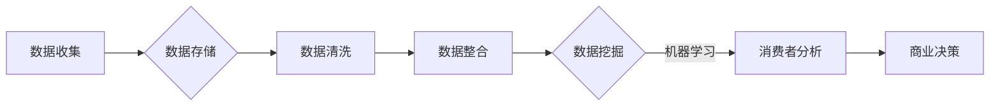

> 关键词：大数据，消费者数据分析，数据挖掘，机器学习，商业智能，消费者行为

# 大数据环境下消费者数据应用分析与研究

在当今数字时代，数据已成为企业宝贵的资产。消费者数据，尤其是海量的在线行为数据，为企业和研究人员提供了前所未有的洞察，帮助他们更好地理解消费者行为，制定精准的市场策略，提升客户体验。本文将探讨大数据环境下消费者数据的应用与分析，深入解析其原理、技术方法和实际案例。

## 1. 背景介绍

### 1.1 数据爆炸时代

随着互联网、物联网和移动设备的发展，数据正以前所未有的速度增长。根据国际数据公司（IDC）的预测，全球数据量预计到2025年将达到175ZB。这种数据爆炸为消费者数据分析带来了前所未有的机遇和挑战。

### 1.2 消费者数据的重要性

消费者数据对于企业来说至关重要，它可以帮助企业：

- 了解消费者偏好和需求
- 优化产品和服务
- 提高营销效率
- 个性化客户体验
- 预测市场趋势
- 降低运营成本

### 1.3 研究意义

深入研究大数据环境下消费者数据的应用，对于推动企业数字化转型、提升竞争力具有重要意义。

## 2. 核心概念与联系

### 2.1 核心概念

- **大数据**：指规模巨大、类型多样、增长迅速的数据集合，无法用传统数据处理工具进行分析。
- **消费者数据**：指与企业消费者相关的数据，包括用户画像、购物记录、浏览行为、社交媒体互动等。
- **数据挖掘**：从大量数据中提取有价值信息的过程。
- **机器学习**：一种使计算机系统能够从数据中学习并做出决策的技术。
- **商业智能**：利用技术手段，将企业数据转化为商业洞察的过程。

### 2.2 Mermaid 流程图



## 3. 核心算法原理 & 具体操作步骤

### 3.1 算法原理概述

消费者数据分析通常涉及以下几个步骤：

1. 数据收集：通过各种渠道收集消费者数据。
2. 数据存储：将收集到的数据存储在合适的数据库中。
3. 数据清洗：清理数据中的噪声和不一致信息。
4. 数据整合：将来自不同源的数据合并成一个统一的数据集。
5. 数据挖掘：使用机器学习算法从数据中提取有价值的信息。
6. 消费者分析：分析消费者行为和偏好。
7. 商业决策：基于分析结果制定商业策略。

### 3.2 算法步骤详解

1. **数据收集**：通过网站分析、社交媒体监控、顾客反馈、销售数据等多种方式收集消费者数据。
2. **数据存储**：使用关系型数据库、NoSQL数据库或数据湖等存储解决方案。
3. **数据清洗**：使用数据清洗工具和脚本处理缺失值、异常值、重复数据等问题。
4. **数据整合**：使用ETL（提取、转换、加载）工具将数据整合到统一的数据仓库或数据湖中。
5. **数据挖掘**：选择合适的机器学习算法，如聚类、分类、关联规则挖掘等。
6. **消费者分析**：根据挖掘结果，构建消费者画像，分析消费者行为模式。
7. **商业决策**：基于分析结果，制定个性化的营销策略、产品优化策略等。

### 3.3 算法优缺点

- **优点**：
  - 提高决策效率
  - 优化营销策略
  - 个性化用户体验
  - 降低运营成本
- **缺点**：
  - 数据质量影响分析结果
  - 需要专业的技术支持
  - 隐私和数据安全风险

### 3.4 算法应用领域

- 消费者细分
- 个性化推荐
- 客户关系管理
- 风险控制
- 市场预测

## 4. 数学模型和公式 & 详细讲解 & 举例说明

### 4.1 数学模型构建

消费者数据分析中常用的数学模型包括：

- **决策树**：通过一系列规则进行决策的树形结构。
- **支持向量机（SVM）**：通过寻找最佳分割超平面来分类数据。
- **神经网络**：模拟人脑神经元工作原理的数学模型，用于分类、回归等任务。

### 4.2 公式推导过程

以SVM为例，其目标是最小化目标函数：

$$
\min_{\boldsymbol{w},b}\frac{1}{2}\|\boldsymbol{w}\|^2 + C\sum_{i=1}^n \xi_i
$$

其中，$\boldsymbol{w}$ 是权重向量，$b$ 是偏置，$C$ 是惩罚参数，$\xi_i$ 是松弛变量。

### 4.3 案例分析与讲解

**案例**：使用SVM进行顾客流失预测。

**数据**：包含顾客购买记录、账户信息、服务历史等。

**步骤**：

1. 数据预处理：清洗数据，处理缺失值。
2. 特征选择：选择对预测目标有显著影响的特征。
3. 模型训练：使用SVM算法训练模型。
4. 模型评估：评估模型预测性能。

**结果**：模型能够准确预测顾客流失风险，帮助企业制定针对性的挽留策略。

## 5. 项目实践：代码实例和详细解释说明

### 5.1 开发环境搭建

- 安装Python和Jupyter Notebook。
- 安装必要的库：pandas、numpy、scikit-learn等。

### 5.2 源代码详细实现

```python
import pandas as pd
from sklearn.model_selection import train_test_split
from sklearn.svm import SVC
from sklearn.metrics import accuracy_score

# 加载数据
data = pd.read_csv('customer_data.csv')

# 数据预处理
data = data.dropna()
X = data.drop('churn', axis=1)
y = data['churn']

# 划分训练集和测试集
X_train, X_test, y_train, y_test = train_test_split(X, y, test_size=0.2, random_state=42)

# 训练SVM模型
model = SVC(kernel='linear')
model.fit(X_train, y_train)

# 预测测试集
y_pred = model.predict(X_test)

# 评估模型
accuracy = accuracy_score(y_test, y_pred)
print(f'Accuracy: {accuracy:.2f}')
```

### 5.3 代码解读与分析

上述代码使用scikit-learn库实现了SVM顾客流失预测模型。首先，代码加载并预处理数据，然后使用SVM算法进行模型训练，最后评估模型在测试集上的性能。

## 6. 实际应用场景

### 6.1 消费者细分

通过分析消费者数据，企业可以将顾客分为不同的细分市场，针对不同群体的特点制定个性化的营销策略。

### 6.2 个性化推荐

利用消费者数据分析，企业可以为用户提供个性化的产品推荐，提高用户满意度和转化率。

### 6.3 客户关系管理

通过分析客户行为数据，企业可以更好地了解客户需求，提供更优质的客户服务，提升客户忠诚度。

## 7. 工具和资源推荐

### 7.1 学习资源推荐

- 《数据挖掘：实用机器学习技术》（Witten, Frank, and Hall）
- 《Python数据科学手册》（Hunter, G., and Oliphant, T.）
- 《机器学习》（Goodfellow, I., Bengio, Y., and Courville, A.）

### 7.2 开发工具推荐

- Python编程语言
- Jupyter Notebook
- Scikit-learn库
- Pandas库
- Matplotlib库

### 7.3 相关论文推荐

- "Customer Relationship Management: A Framework for Analysis and Insights" by V. Zeithaml et al.
- "Personalized Recommendations: A Survey and Comparison of Existing Techniques" by M. S. Murty et al.
- "A Systematic Review of Customer Segmentation Techniques" by M. D. J. Musa et al.

## 8. 总结：未来发展趋势与挑战

### 8.1 研究成果总结

本文深入探讨了大数据环境下消费者数据的应用与分析，介绍了相关技术方法和实际案例，为企业和研究人员提供了有益的参考。

### 8.2 未来发展趋势

- 跨渠道数据分析
- 实时数据分析
- 深度学习在消费者数据分析中的应用
- 隐私保护

### 8.3 面临的挑战

- 数据质量和隐私保护
- 技术复杂性
- 数据安全

### 8.4 研究展望

随着技术的不断进步，消费者数据分析将在未来发挥越来越重要的作用。企业和研究人员需要不断探索新的方法和工具，以更好地利用消费者数据，推动商业发展。

## 9. 附录：常见问题与解答

### 9.1 常见问题

**Q1：消费者数据分析需要哪些技术工具？**

A1：消费者数据分析需要Python、Jupyter Notebook、Scikit-learn、Pandas、Matplotlib等工具。

**Q2：如何处理消费者数据隐私问题？**

A2：通过匿名化、去标识化等技术手段保护消费者数据隐私。

**Q3：消费者数据分析在哪些行业应用广泛？**

A3：消费者数据分析在零售、金融、电信、旅游、医疗等多个行业应用广泛。

**Q4：如何评估消费者数据分析的效果？**

A4：通过准确率、召回率、F1分数等指标评估消费者数据分析的效果。

作者：禅与计算机程序设计艺术 / Zen and the Art of Computer Programming