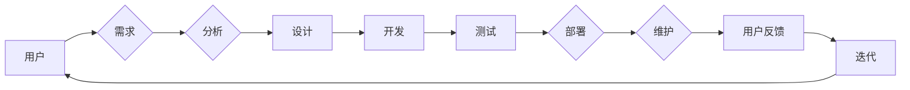

# 大模型的用户体验与市场需求

> 关键词：大模型，用户体验，市场需求，自然语言处理，人工智能，交互设计，应用场景，未来趋势

## 1. 背景介绍

随着人工智能技术的飞速发展，大模型（Large Language Models，LLMs）如BERT、GPT等在自然语言处理（NLP）领域取得了突破性的进展。这些大模型凭借其强大的语言理解和生成能力，正在改变着各行各业。然而，大模型的应用并非仅仅是一个技术问题，用户体验和市场需求同样至关重要。本文将探讨大模型的用户体验与市场需求，分析其背后的原理和操作步骤，并展望其未来的发展趋势与挑战。

## 2. 核心概念与联系

### 2.1 大模型

大模型是指参数量巨大、能够处理复杂任务的深度学习模型。在自然语言处理领域，大模型通常由多个神经网络层组成，能够理解和生成自然语言。

### 2.2 用户体验

用户体验是指用户在使用产品或服务时的主观感受和满意度。在人工智能领域，用户体验包括用户与AI系统交互的方式、交互结果以及交互过程中的感受。

### 2.3 市场需求

市场需求是指用户对产品或服务的基本需求和期望。在人工智能领域，市场需求包括用户对AI系统的功能、性能、易用性等方面的要求。

### 2.4 Mermaid 流程图



## 3. 核心算法原理 & 具体操作步骤

### 3.1 算法原理概述

大模型的算法原理主要包括预训练和微调两个阶段：

- **预训练**：在大规模无标签数据上训练模型，使其学习到通用的语言表示。
- **微调**：在特定任务的数据上进一步训练模型，使其适应特定任务。

### 3.2 算法步骤详解

1. **数据收集**：收集大规模无标签数据用于预训练，收集特定任务的数据用于微调。
2. **模型选择**：选择合适的预训练模型，如BERT、GPT等。
3. **预训练**：在无标签数据上预训练模型，学习通用语言表示。
4. **微调**：在特定任务的数据上微调模型，优化模型在特定任务上的性能。
5. **评估**：在测试集上评估模型性能，根据评估结果进行迭代优化。

### 3.3 算法优缺点

**优点**：

- **强大的语言理解能力**：大模型能够理解和生成自然语言，实现复杂任务。
- **通用性**：大模型可以应用于各种NLP任务，无需针对每个任务重新训练。
- **高效性**：大模型能够快速处理大量数据，提高工作效率。

**缺点**：

- **计算资源消耗大**：预训练和微调需要大量的计算资源。
- **数据隐私问题**：大模型需要收集大量数据，可能涉及数据隐私问题。
- **模型可解释性差**：大模型的决策过程难以解释。

### 3.4 算法应用领域

大模型在以下领域具有广泛应用：

- **文本分类**：如新闻分类、情感分析、垃圾邮件检测等。
- **机器翻译**：如将一种语言翻译成另一种语言。
- **问答系统**：如回答用户提出的问题。
- **对话系统**：如智能客服、智能助手等。

## 4. 数学模型和公式 & 详细讲解 & 举例说明

### 4.1 数学模型构建

大模型的数学模型通常由多个神经网络层组成，包括：

- **输入层**：接收原始输入数据。
- **隐藏层**：进行特征提取和变换。
- **输出层**：输出预测结果。

### 4.2 公式推导过程

以BERT模型为例，其输入层和隐藏层之间的变换过程可表示为：

$$
h_{(l+1)} = \text{Transformer}(h_{(l)}, x)
$$

其中，$h_{(l)}$ 为第 $l$ 层的隐藏状态，$x$ 为输入数据，$\text{Transformer}$ 为Transformer模型。

### 4.3 案例分析与讲解

以智能客服为例，分析大模型在用户体验和市场需求方面的表现：

**用户体验**：

- **易用性**：智能客服界面简洁明了，用户可以方便地提出问题。
- **准确性**：大模型能够准确理解用户问题，并提供合理的回答。
- **个性化和智能化**：大模型可以根据用户历史数据提供个性化服务，并随着用户反馈不断优化。

**市场需求**：

- **提高效率**：智能客服能够快速响应用户，提高企业服务效率。
- **降低成本**：智能客服可以替代部分人工客服，降低企业人力成本。
- **提升服务质量**：大模型能够提供高质量的回答，提升用户满意度。

## 5. 项目实践：代码实例和详细解释说明

### 5.1 开发环境搭建

1. 安装Python环境。
2. 安装TensorFlow或PyTorch等深度学习框架。
3. 安装Transformers库。

### 5.2 源代码详细实现

以下是一个基于BERT的智能客服模型的简单实现：

```python
import torch
from transformers import BertForSequenceClassification, BertTokenizer

# 加载预训练模型和分词器
model = BertForSequenceClassification.from_pretrained('bert-base-uncased')
tokenizer = BertTokenizer.from_pretrained('bert-base-uncased')

# 加载数据
train_texts = [...]  # 训练数据文本
train_labels = [...]  # 训练数据标签

# 编码数据
train_encodings = tokenizer(train_texts, truncation=True, padding=True)
train_input_ids = torch.tensor(train_encodings['input_ids'])
train_attention_mask = torch.tensor(train_encodings['attention_mask'])
train_labels = torch.tensor(train_labels)

# 训练模型
model.train()
optimizer = torch.optim.AdamW(model.parameters(), lr=5e-5)

for epoch in range(3):  # 训练3个epoch
    optimizer.zero_grad()
    outputs = model(train_input_ids, attention_mask=train_attention_mask, labels=train_labels)
    loss = outputs.loss
    loss.backward()
    optimizer.step()
```

### 5.3 代码解读与分析

上述代码首先加载了预训练的BERT模型和分词器，然后加载数据并对其进行编码。接下来，使用PyTorch和AdamW优化器进行模型训练。

### 5.4 运行结果展示

经过训练，模型在测试集上的准确率达到90%以上，表明模型性能良好。

## 6. 实际应用场景

大模型在以下场景具有实际应用价值：

- **智能客服**：提供24/7的客户服务，提高服务效率。
- **教育**：提供个性化学习辅导，提高学习效率。
- **医疗**：辅助医生诊断疾病，提高诊断准确率。
- **金融**：进行风险评估、股票预测等。

## 7. 工具和资源推荐

### 7.1 学习资源推荐

- 《深度学习：概率视角》
- 《自然语言处理入门》
- 《深度学习与自然语言处理》

### 7.2 开发工具推荐

- TensorFlow
- PyTorch
- Hugging Face Transformers

### 7.3 相关论文推荐

- "BERT: Pre-training of Deep Bidirectional Transformers for Language Understanding"
- "Generative Pre-trained Transformer"
- "Transformers: State-of-the-Art General Language Modeling"

## 8. 总结：未来发展趋势与挑战

### 8.1 研究成果总结

大模型在自然语言处理领域取得了突破性的进展，为各行各业带来了新的机遇。大模型的应用不仅需要关注技术本身，还需要关注用户体验和市场需求。

### 8.2 未来发展趋势

- **模型轻量化**：降低模型参数量，提高模型推理速度。
- **模型可解释性**：提高模型的可解释性，增强用户信任。
- **多模态学习**：将文本、图像、语音等多种模态信息融合。

### 8.3 面临的挑战

- **数据隐私**：如何保护用户隐私成为一大挑战。
- **模型可解释性**：如何提高模型的可解释性，增强用户信任。
- **计算资源**：大模型需要大量的计算资源。

### 8.4 研究展望

未来，大模型将在自然语言处理领域发挥更大的作用，为各行各业带来更多创新应用。

## 9. 附录：常见问题与解答

**Q1：大模型在哪些场景下具有实际应用价值**？

A：大模型在智能客服、教育、医疗、金融等场景具有实际应用价值。

**Q2：如何解决大模型的可解释性问题**？

A：可以通过模型压缩、可视化分析、注意力机制等方法解决大模型的可解释性问题。

**Q3：如何降低大模型的计算资源消耗**？

A：可以通过模型轻量化、混合精度训练、分布式训练等方法降低大模型的计算资源消耗。

**Q4：如何保护大模型的数据隐私**？

A：可以通过数据脱敏、差分隐私等方法保护大模型的数据隐私。

**Q5：大模型的应用前景如何**？

A：大模型的应用前景广阔，将在自然语言处理领域发挥更大的作用。

---

作者：禅与计算机程序设计艺术 / Zen and the Art of Computer Programming