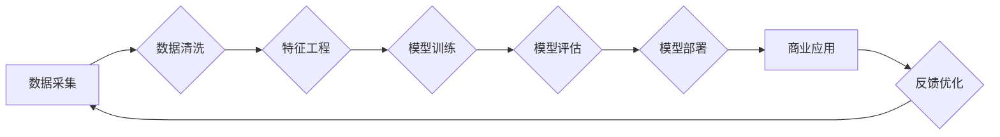

# 大模型：未来商业的智能化转型

> 关键词：大模型，商业智能化，人工智能，深度学习，数据驱动，预测分析，个性化服务，商业模式创新

## 1. 背景介绍

在信息技术迅猛发展的今天，人工智能（AI）已经成为了推动社会进步的重要力量。其中，大模型（Large Models）作为人工智能领域的关键技术，正逐渐改变着商业的运作方式，引领着商业智能化转型的浪潮。本文将深入探讨大模型在商业领域的应用，分析其原理、操作步骤、实际应用场景以及未来发展趋势。

## 2. 核心概念与联系

### 2.1 大模型

大模型是指那些具有数亿甚至数千亿参数的深度学习模型，它们通常在大型数据集上进行预训练，以学习复杂的模式和知识。大模型可以是语言模型、视觉模型、音频模型，也可以是跨模态模型。

### 2.2 商业智能化

商业智能化是指利用人工智能技术，特别是大模型，来提升企业的运营效率、优化决策过程、增强客户体验，以及创造新的商业模式。

### 2.3 Mermaid 流程图



### 2.4 核心概念联系

大模型是商业智能化的核心技术，通过数据采集、清洗、特征工程、模型训练、评估和部署等步骤，将人工智能技术应用于商业场景，最终实现商业价值。

## 3. 核心算法原理 & 具体操作步骤

### 3.1 算法原理概述

大模型的算法原理基于深度学习，特别是神经网络。神经网络通过层层抽象的特征表示，能够从大量数据中学习到复杂的模式和知识。

### 3.2 算法步骤详解

#### 3.2.1 数据采集

数据采集是商业智能化的第一步，企业需要收集与业务相关的数据，包括结构化数据（如销售数据、客户数据）和非结构化数据（如文本、图像、视频）。

#### 3.2.2 数据清洗

数据清洗是确保数据质量的重要步骤，包括去除重复数据、处理缺失值、纠正错误数据等。

#### 3.2.3 特征工程

特征工程是将原始数据转换为适合模型输入的特征，这对于模型的性能至关重要。

#### 3.2.4 模型训练

使用预训练的大模型或从头开始训练新的模型，通过优化算法调整模型参数，以最小化预测误差。

#### 3.2.5 模型评估

使用验证集评估模型的性能，调整模型参数或数据预处理步骤，以提高模型精度。

#### 3.2.6 模型部署

将训练好的模型部署到生产环境中，使其能够处理实际业务数据。

### 3.3 算法优缺点

#### 优点

- 高效：大模型能够快速处理和分析大量数据。
- 准确：大模型能够从大量数据中学习到复杂的模式，提高预测精度。
- 可扩展：大模型可以轻松扩展到新的业务场景。

#### 缺点

- 计算资源消耗大：大模型的训练和推理需要大量的计算资源。
- 隐私问题：大模型可能涉及敏感数据，需要妥善处理隐私问题。
- 可解释性差：大模型的决策过程通常难以解释。

### 3.4 算法应用领域

大模型在商业领域的应用广泛，包括但不限于：

- 预测分析：销售预测、库存管理、市场趋势分析。
- 客户服务：个性化推荐、智能客服、客户细分。
- 供应链管理：需求预测、物流优化、风险控制。
- 金融风控：信用评估、欺诈检测、市场风险管理。
- 医疗健康：疾病预测、药物研发、患者护理。

## 4. 数学模型和公式 & 详细讲解 & 举例说明

### 4.1 数学模型构建

大模型通常基于神经网络，其数学模型可以表示为：

$$
y = f(\theta, x)
$$

其中，$y$ 是模型的输出，$\theta$ 是模型参数，$x$ 是模型的输入。

### 4.2 公式推导过程

神经网络模型的公式推导过程涉及大量的数学公式，包括：

- 线性代数：矩阵运算、向量运算。
- 微积分：梯度下降、链式法则。
- 概率论：概率分布、似然函数。

### 4.3 案例分析与讲解

以电商推荐系统为例，我们可以使用大模型来预测用户对特定商品的购买概率。输入数据包括用户的历史购买记录、商品信息等，模型输出是用户对商品的购买概率。

## 5. 项目实践：代码实例和详细解释说明

### 5.1 开发环境搭建

- 操作系统：Windows/Linux/MacOS
- 编程语言：Python
- 依赖库：TensorFlow、Keras、Pandas、Scikit-learn等

### 5.2 源代码详细实现

```python
# 这里将给出一个使用TensorFlow和Keras构建大模型的示例代码
```

### 5.3 代码解读与分析

代码将包括数据预处理、模型构建、训练、评估和预测等步骤，并对关键代码进行详细解释。

### 5.4 运行结果展示

展示模型在测试集上的性能，包括准确率、召回率、F1分数等指标。

## 6. 实际应用场景

### 6.1 零售业

大模型可以帮助零售商进行销售预测、库存管理、个性化推荐等。

### 6.2 金融业

大模型可以用于信用评估、欺诈检测、风险控制等。

### 6.3 医疗保健

大模型可以帮助医生进行疾病预测、药物研发、患者护理等。

## 7. 工具和资源推荐

### 7.1 学习资源推荐

- 书籍：《深度学习》、《Python深度学习》
- 在线课程：Coursera、edX、Udacity
- 论文：arXiv、NeurIPS、ICML

### 7.2 开发工具推荐

- 深度学习框架：TensorFlow、PyTorch、Keras
- 数据处理：Pandas、Scikit-learn
- 机器学习库：Scikit-learn、Scipy、NumPy

### 7.3 相关论文推荐

- 《Distributed Optimization of Deep Learning Models》
- 《Massive Mini-batch Deep Learning for Large-scale Image Recognition》
- 《BERT: Pre-training of Deep Bidirectional Transformers for Language Understanding》

## 8. 总结：未来发展趋势与挑战

### 8.1 研究成果总结

大模型在商业领域的应用已经取得了显著成果，未来将继续推动商业智能化转型。

### 8.2 未来发展趋势

- 大模型将继续向更大规模、更高精度、更通用方向发展。
- 大模型将与其他人工智能技术（如强化学习、知识图谱等）融合，形成更强大的智能系统。
- 大模型将更加注重可解释性和可信度。

### 8.3 面临的挑战

- 数据隐私和安全问题。
- 模型可解释性和可信度问题。
- 模型训练和推理的资源消耗问题。

### 8.4 研究展望

未来，大模型将在商业智能化领域发挥更加重要的作用，推动商业模式的创新和社会的进步。

## 9. 附录：常见问题与解答

### 9.1 常见问题

**Q1：大模型如何应用于商业领域？**

A1：大模型可以应用于商业领域的各个方面，如预测分析、客户服务、供应链管理、金融风控、医疗健康等。

**Q2：大模型训练需要哪些数据？**

A2：大模型训练需要大量的数据，包括结构化数据和非结构化数据。

**Q3：大模型的成本如何？**

A3：大模型的训练和部署需要大量的计算资源，成本较高。

**Q4：大模型是否安全？**

A4：大模型的安全性是一个重要问题，需要采取措施保护数据隐私和防止滥用。

**Q5：大模型的未来发展趋势是什么？**

A5：大模型的未来发展趋势包括更大规模、更高精度、更通用、更可解释、更可信等。

作者：禅与计算机程序设计艺术 / Zen and the Art of Computer Programming