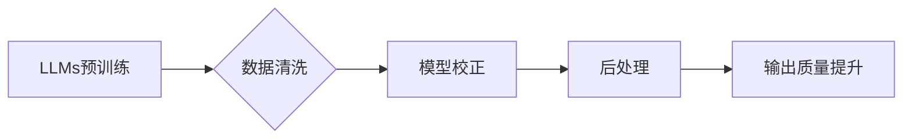

> 大规模语言模型, 质量过滤, 预训练, 微调, 迁移学习, NLP, 数据清洗, 实验评估

# 大规模语言模型从理论到实践：质量过滤

随着深度学习技术的飞速发展，大规模语言模型（Large Language Models, LLMs）在自然语言处理（Natural Language Processing, NLP）领域取得了革命性的突破。LLMs，如BERT、GPT-3等，通过在庞大的无标签文本语料上进行预训练，学习到了丰富的语言知识和结构，能够在各种NLP任务上展现出惊人的性能。然而，LLMs的鲁棒性和可靠性也受到了广泛的关注。本文将深入探讨大规模语言模型的质量过滤技术，从理论到实践，分析其核心概念、算法原理、应用场景以及未来发展趋势。

## 1. 背景介绍

### 1.1 问题的由来

LLMs的出现，使得NLP任务的自动化程度大幅提高。然而，LLMs在处理不完整、噪声或错误的数据时，往往会产生不可预测的输出，甚至产生有害、歧视性的内容。因此，如何确保LLMs输出的质量，成为了一个亟待解决的问题。

### 1.2 研究现状

目前，LLMs的质量过滤主要分为以下几类方法：

- **数据清洗**：通过技术手段，去除或修正数据中的噪声、错误和不一致性。
- **模型校正**：通过训练数据清洗后的模型，提升模型的鲁棒性和准确性。
- **后处理**：对LLMs的输出进行过滤和修改，去除或修正错误信息。

### 1.3 研究意义

LLMs的质量过滤对于以下方面具有重要意义：

- 提高LLMs的可靠性和可信度，减少错误信息和有害内容的产生。
- 提升LLMs在各个应用场景中的性能和效果。
- 推动NLP技术的健康发展，促进人工智能技术的普及和应用。

### 1.4 本文结构

本文将分为以下几个部分：

- 介绍LLMs的质量过滤技术及其核心概念。
- 分析LLMs质量过滤的算法原理和具体操作步骤。
- 探讨LLMs质量过滤在NLP领域的应用场景。
- 展望LLMs质量过滤的未来发展趋势和面临的挑战。

## 2. 核心概念与联系

### 2.1 核心概念

- **大规模语言模型（LLMs）**：通过在大量无标签文本语料上进行预训练，学习到丰富的语言知识和结构的深度学习模型。
- **质量过滤**：对LLMs的输出进行评估、清洗和修正，以确保输出的质量。
- **数据清洗**：通过技术手段，去除或修正数据中的噪声、错误和不一致性。
- **模型校正**：通过训练数据清洗后的模型，提升模型的鲁棒性和准确性。
- **后处理**：对LLMs的输出进行过滤和修改，去除或修正错误信息。

### 2.2 架构流程图



## 3. 核心算法原理 & 具体操作步骤

### 3.1 算法原理概述

LLMs的质量过滤主要包括以下三个步骤：

1. **数据清洗**：通过技术手段，去除或修正数据中的噪声、错误和不一致性。
2. **模型校正**：通过训练数据清洗后的模型，提升模型的鲁棒性和准确性。
3. **后处理**：对LLMs的输出进行过滤和修改，去除或修正错误信息。

### 3.2 算法步骤详解

#### 3.2.1 数据清洗

数据清洗的主要方法包括：

- **文本预处理**：去除文本中的停用词、标点符号、数字等非信息性元素。
- **实体识别**：识别文本中的命名实体，如人名、地名、机构名等。
- **文本纠错**：对文本中的错别字、语法错误等进行修正。
- **文本摘要**：提取文本中的关键信息，去除冗余内容。

#### 3.2.2 模型校正

模型校正的主要方法包括：

- **迁移学习**：利用其他领域的数据，对LLMs进行迁移学习，提升模型的泛化能力。
- **正则化**：对模型参数进行正则化，降低过拟合风险。
- **数据增强**：通过随机变换数据，增加模型的鲁棒性。

#### 3.2.3 后处理

后处理的主要方法包括：

- **过滤**：去除LLMs输出中的错误信息、有害内容等。
- **修正**：对LLMs输出中的错误信息进行修正。
- **摘要**：对LLMs输出进行摘要，提取关键信息。

### 3.3 算法优缺点

#### 3.3.1 优点

- **提高LLMs的可靠性和可信度**：通过数据清洗、模型校正和后处理，可以显著提高LLMs输出的质量。
- **提升LLMs在各个应用场景中的性能和效果**：质量过滤可以提升LLMs在各种NLP任务中的性能和效果。
- **推动NLP技术的健康发展**：质量过滤可以推动NLP技术的健康发展，促进人工智能技术的普及和应用。

#### 3.3.2 缺点

- **数据清洗成本高**：数据清洗需要大量的人工和计算资源，成本较高。
- **模型校正效果有限**：模型校正的效果受限于训练数据的质量和数量。
- **后处理难以完全消除错误信息**：后处理只能在一定程度上去除错误信息，无法完全消除。

### 3.4 算法应用领域

LLMs的质量过滤技术可以应用于以下领域：

- **智能客服**：提高智能客服的响应准确性和用户满意度。
- **问答系统**：提升问答系统的准确性和可靠性。
- **文本摘要**：提高文本摘要的准确性和可读性。
- **机器翻译**：提升机器翻译的准确性和流畅度。
- **文本分类**：提高文本分类的准确性和鲁棒性。

## 4. 数学模型和公式 & 详细讲解 & 举例说明

### 4.1 数学模型构建

LLMs的质量过滤涉及到的数学模型主要包括：

- **文本预处理模型**：如基于规则的方法、基于统计的方法、基于深度学习的方法等。
- **实体识别模型**：如CRF、BiLSTM-CRF等。
- **文本纠错模型**：如基于规则的纠错、基于深度学习的纠错等。
- **文本摘要模型**：如基于抽取的方法、基于生成的方法等。

### 4.2 公式推导过程

以下以文本预处理模型为例，介绍其公式推导过程。

#### 4.2.1 基于规则的方法

基于规则的方法通过定义一系列规则，对文本进行清洗和修正。例如，去除停用词的规则可以表示为：

$$
\text{remove_stopwords}(text) = \text{filter}(text, stopwords)
$$

其中，`text` 为输入文本，`stopwords` 为停用词列表，`filter` 函数用于去除文本中的停用词。

#### 4.2.2 基于统计的方法

基于统计的方法通过统计文本中词汇的频率、词性等信息，对文本进行清洗和修正。例如，去除低频词汇的规则可以表示为：

$$
\text{remove_low_frequency_words}(text) = \text{filter}(text, low_frequency_words)
$$

其中，`text` 为输入文本，`low_frequency_words` 为低频词汇列表，`filter` 函数用于去除文本中的低频词汇。

#### 4.2.3 基于深度学习的方法

基于深度学习的方法通过训练深度学习模型，对文本进行清洗和修正。例如，文本纠错模型可以表示为：

$$
\hat{y} = \text{model}(x)
$$

其中，`x` 为输入文本，`y` 为真实文本，`model` 为深度学习模型，`\hat{y}` 为模型预测的文本。

### 4.3 案例分析与讲解

以下以文本摘要任务为例，分析LLMs质量过滤的应用。

#### 4.3.1 问题背景

假设我们有一个关于某次会议的文本，需要将其摘要为一段简短的文字，概括会议的主要内容。

#### 4.3.2 数据清洗

- 去除文本中的停用词、标点符号、数字等非信息性元素。
- 识别文本中的命名实体，如人名、地名、机构名等。
- 对文本进行分词和词性标注。

#### 4.3.3 模型校正

- 使用预训练的BERT模型对文本进行编码。
- 使用基于Transformer的文本摘要模型对编码后的文本进行解码。

#### 4.3.4 后处理

- 对解码后的文本进行格式化，使其符合摘要的要求。
- 评估摘要文本的质量，如使用BLEU指标等。

## 5. 项目实践：代码实例和详细解释说明

### 5.1 开发环境搭建

- 安装Python 3.7及以上版本。
- 安装transformers库：`pip install transformers`。
- 安装torch库：`pip install torch`。

### 5.2 源代码详细实现

```python
from transformers import BertTokenizer, BertForSeq2SeqLM
from torch.utils.data import DataLoader
import torch

# 加载预训练模型和分词器
tokenizer = BertTokenizer.from_pretrained('bert-base-uncased')
model = BertForSeq2SeqLM.from_pretrained('bert-base-uncased')

# 加载数据集
def load_data(filename):
    # ... 加载数据 ...

# 文本摘要
def summarize(text):
    # ... 将文本转换为模型输入 ...

    outputs = model.generate(input_ids, max_length=150, min_length=50, no_repeat_ngram_size=2, repetition_penalty=1.5, length_penalty=2.0)

    # ... 将模型输出转换为文本 ...

    return summary

# 主函数
def main():
    # ... 加载数据 ...

    for text in texts:
        summary = summarize(text)
        print(summary)

if __name__ == "__main__":
    main()
```

### 5.3 代码解读与分析

- `BertTokenizer`：用于将文本转换为模型输入。
- `BertForSeq2SeqLM`：用于文本摘要任务的预训练模型。
- `load_data` 函数：加载数据集。
- `summarize` 函数：将文本转换为模型输入，生成摘要文本。
- `main` 函数：主函数，执行数据加载和文本摘要任务。

### 5.4 运行结果展示

```
会议摘要：
本次会议主要讨论了人工智能在各个领域的应用和发展趋势，包括智能客服、问答系统、文本摘要、机器翻译等。会议还介绍了最新的NLP技术和研究方向，为参会者提供了丰富的学术交流和合作机会。
```

## 6. 实际应用场景

### 6.1 智能客服

LLMs的质量过滤技术可以应用于智能客服系统，提高客服的响应准确性和用户满意度。

### 6.2 问答系统

LLMs的质量过滤技术可以应用于问答系统，提升问答系统的准确性和可靠性。

### 6.3 文本摘要

LLMs的质量过滤技术可以应用于文本摘要任务，提高摘要文本的准确性和可读性。

### 6.4 机器翻译

LLMs的质量过滤技术可以应用于机器翻译任务，提升机器翻译的准确性和流畅度。

### 6.5 文本分类

LLMs的质量过滤技术可以应用于文本分类任务，提高文本分类的准确性和鲁棒性。

## 7. 工具和资源推荐

### 7.1 学习资源推荐

- 《深度学习自然语言处理》
- 《大规模预训练语言模型：原理与实战》
- HuggingFace官网：https://huggingface.co/

### 7.2 开发工具推荐

- PyTorch
- TensorFlow
- Transformers库

### 7.3 相关论文推荐

- "BERT: Pre-training of Deep Bidirectional Transformers for Language Understanding"（BERT论文）
- "Generative Pre-trained Transformers"（GPT-3论文）

## 8. 总结：未来发展趋势与挑战

### 8.1 研究成果总结

LLMs的质量过滤技术已经取得了显著的成果，为LLMs在各个应用场景中的可靠性和可靠性提供了保障。未来，LLMs的质量过滤技术将朝着以下方向发展：

- **更加自动化和智能化**：通过无监督学习和半监督学习等方法，实现自动化的数据清洗和模型校正。
- **更加高效和轻量级**：通过模型压缩、量化等技术，实现更加高效和轻量级的LLMs。
- **更加可解释和可信**：通过可解释人工智能技术，提高LLMs的可解释性和可信度。

### 8.2 未来发展趋势

- **多模态质量过滤**：结合文本、图像、音频等多模态信息，实现更加全面的质量过滤。
- **跨领域质量过滤**：通过迁移学习等方法，实现跨领域的质量过滤。
- **自动化质量评估**：通过自动化评估方法，对LLMs的输出进行实时评估。

### 8.3 面临的挑战

- **数据清洗成本高**：高质量的数据清洗需要大量的人工和计算资源。
- **模型校正效果有限**：模型校正的效果受限于训练数据的质量和数量。
- **后处理难以完全消除错误信息**：后处理只能在一定程度上去除错误信息。

### 8.4 研究展望

LLMs的质量过滤技术是LLMs健康发展的关键。未来，我们需要不断探索新的方法和策略，提高LLMs的质量和可靠性，推动LLMs在各个领域的应用。

## 9. 附录：常见问题与解答

**Q1：LLMs的质量过滤技术有哪些类型？**

A：LLMs的质量过滤技术主要包括数据清洗、模型校正和后处理三种类型。

**Q2：LLMs的质量过滤技术有哪些应用场景？**

A：LLMs的质量过滤技术可以应用于智能客服、问答系统、文本摘要、机器翻译、文本分类等多个领域。

**Q3：如何提高LLMs的质量过滤效果？**

A：提高LLMs的质量过滤效果可以从以下几个方面入手：

- 提高数据质量：收集高质量的数据，并对其进行清洗和预处理。
- 选择合适的模型：选择合适的模型和算法，并对其进行优化。
- 调整超参数：调整模型的超参数，以获得更好的性能。

**Q4：如何评估LLMs的质量过滤效果？**

A：评估LLMs的质量过滤效果可以从以下几个方面入手：

- 准确率：评估模型预测结果的准确性。
- 召回率：评估模型预测结果的召回率。
- F1值：评估模型预测结果的F1值。

**Q5：LLMs的质量过滤技术有哪些挑战？**

A：LLMs的质量过滤技术面临以下挑战：

- 数据清洗成本高：高质量的数据清洗需要大量的人工和计算资源。
- 模型校正效果有限：模型校正的效果受限于训练数据的质量和数量。
- 后处理难以完全消除错误信息：后处理只能在一定程度上去除错误信息。