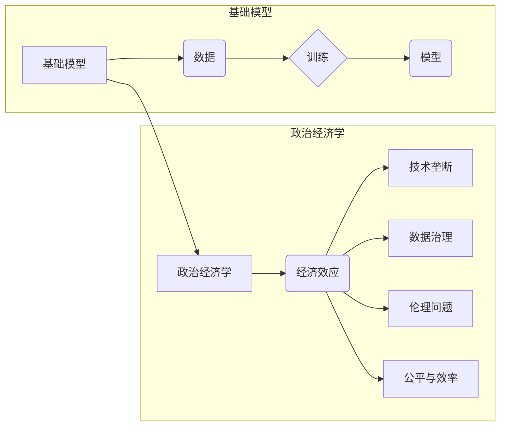

# 基础模型的政治经济学效应

> 关键词：基础模型，政治经济学，人工智能，经济效应，技术垄断，数据治理，伦理问题，公平与效率

## 1. 背景介绍

随着人工智能技术的飞速发展，基础模型作为一种强大的技术基础设施，已经在自然语言处理、计算机视觉、推荐系统等领域展现出巨大的潜力。基础模型通过在庞大的数据集上进行训练，能够自动学习复杂的模式，从而实现强大的数据处理和分析能力。然而，基础模型的发展和应用也引发了一系列的政治经济学效应，包括技术垄断、数据治理、伦理问题以及公平与效率的平衡等。本文将探讨基础模型的政治经济学效应，分析其对经济、社会和技术发展的影响。

### 1.1 技术垄断的兴起

随着基础模型技术的不断进步，少数技术巨头垄断了基础模型的研究、开发和部署。这种垄断现象在人工智能领域尤为突出，因为基础模型需要大量的计算资源和数据积累，这对于中小企业和初创公司来说是一个巨大的门槛。技术垄断可能导致以下问题：

- **创新受阻**：垄断企业可能减少对新技术的研究投入，因为它们已经拥有市场主导地位。
- **价格操纵**：垄断企业可能通过操纵价格来排挤竞争对手，损害消费者利益。
- **市场封闭**：垄断企业可能限制其他企业的进入，导致市场竞争不充分。

### 1.2 数据治理的挑战

基础模型依赖于大量数据，这些数据往往包含个人隐私和敏感信息。如何有效地治理这些数据，确保数据的安全、隐私和公平使用，成为了一个重要的政治经济学问题。

- **数据所有权**：数据所有者是否有权决定其数据的使用和共享？
- **数据共享**：如何平衡数据共享的需求与数据隐私保护之间的冲突？
- **数据安全**：如何确保数据在存储、传输和处理过程中的安全性？

### 1.3 伦理问题的考量

基础模型的应用也可能引发伦理问题，例如：

- **偏见与歧视**：如果训练数据存在偏见，基础模型可能会在决策过程中产生歧视性结果。
- **算法透明度**：算法的决策过程往往不透明，难以解释和审计。
- **责任归属**：当算法决策导致负面影响时，责任应由谁承担？

### 1.4 公平与效率的平衡

基础模型的应用需要在公平与效率之间寻求平衡。一方面，基础模型可以提高生产效率，降低成本；另一方面，如果不加控制，可能会加剧社会不平等。

- **效率提升**：基础模型可以提高数据处理和分析的效率，从而提升整个社会的生产力。
- **社会不平等**：技术进步可能加剧贫富差距，导致社会不平等。

## 2. 核心概念与联系

### 2.1 核心概念原理

#### 基础模型

基础模型是指在大规模数据集上进行训练，能够自动学习复杂模式，并在特定任务上表现出卓越性能的模型。例如，BERT、GPT-3等都是典型的基础模型。

#### 政治经济学

政治经济学是研究经济活动中的权力、资源分配和决策过程的经济学科。它关注经济制度、市场结构、政府政策等因素对经济发展的影响。

#### 技术垄断

技术垄断是指少数企业通过掌握关键技术或资源，在市场上形成垄断地位的现象。

#### 数据治理

数据治理是指对数据进行收集、存储、处理、分析和共享的过程进行管理和控制。

#### 伦理问题

伦理问题是指在技术发展和应用过程中，涉及道德和价值观的冲突和挑战。

### 2.2 架构的 Mermaid 流程图



## 3. 核心算法原理 & 具体操作步骤

### 3.1 算法原理概述

基础模型的算法原理主要基于深度学习和神经网络技术。通过多层神经网络结构，模型能够学习到数据中的复杂模式和特征，从而实现强大的数据处理和分析能力。

### 3.2 算法步骤详解

1. 数据收集：收集大量相关数据，包括文本、图像、音频等。
2. 数据预处理：对收集到的数据进行清洗、标注和格式化。
3. 模型训练：使用预处理后的数据对模型进行训练，调整模型参数以优化性能。
4. 模型评估：使用测试数据评估模型的性能，包括准确率、召回率、F1分数等指标。
5. 模型部署：将训练好的模型部署到实际应用中。

### 3.3 算法优缺点

**优点**：

- **强大的数据处理能力**：基础模型能够处理和分析大量复杂数据。
- **泛化能力强**：基础模型能够从大量数据中学习到通用特征，适用于不同任务。
- **高效性**：深度学习模型能够并行处理大量数据，提高计算效率。

**缺点**：

- **数据依赖性**：基础模型对数据质量有较高要求，数据偏差可能导致模型输出偏差。
- **计算成本高**：训练和运行深度学习模型需要大量计算资源。
- **可解释性差**：深度学习模型的决策过程通常不透明，难以解释和审计。

### 3.4 算法应用领域

基础模型在以下领域有着广泛的应用：

- **自然语言处理**：文本分类、机器翻译、情感分析等。
- **计算机视觉**：图像识别、目标检测、图像生成等。
- **推荐系统**：个性化推荐、商品推荐、新闻推荐等。
- **医疗健康**：疾病诊断、药物研发、健康管理等。

## 4. 数学模型和公式 & 详细讲解 & 举例说明

### 4.1 数学模型构建

基础模型的数学模型主要基于概率论和统计学原理。以下是一些常见的数学模型：

- **神经网络模型**：包括多层感知机、卷积神经网络、循环神经网络等。
- **概率模型**：包括朴素贝叶斯、隐马尔可夫模型等。

### 4.2 公式推导过程

以神经网络模型为例，以下是一个简单的单层神经网络模型公式：

$$
y = f(W \cdot x + b)
$$

其中 $W$ 是权重矩阵，$x$ 是输入向量，$b$ 是偏置项，$f$ 是激活函数。

### 4.3 案例分析与讲解

以BERT模型为例，BERT是一种基于Transformer的预训练语言模型。它通过掩码语言模型(Masked Language Model, MLM)和下一句预测(Next Sentence Prediction, NSP)两个预训练任务来学习语言的深层表示。

- **掩码语言模型**：在输入句子中随机掩码一些词，模型需要预测这些词的正确词性。
- **下一句预测**：给定一个句子对，模型需要预测这两个句子是否属于同一篇文章。

通过这两个预训练任务，BERT能够学习到丰富的语言知识和上下文信息。

## 5. 项目实践：代码实例和详细解释说明

### 5.1 开发环境搭建

为了进行基础模型的开发，需要以下环境：

- 编程语言：Python
- 深度学习框架：TensorFlow或PyTorch
- 依赖库：NumPy、Pandas、Scikit-learn等

### 5.2 源代码详细实现

以下是一个简单的单层神经网络模型实现：

```python
import numpy as np

class SimpleNeuralNetwork:
    def __init__(self, input_size, output_size, learning_rate=0.01):
        self.weights = np.random.randn(input_size, output_size) * 0.01
        self.bias = np.zeros(output_size)
        self.learning_rate = learning_rate

    def forward(self, x):
        return np.dot(x, self.weights) + self.bias

    def backward(self, x, y, output):
        error = y - output
        dW = np.dot(x.T, error)
        db = np.sum(error, axis=0)
        self.weights -= self.learning_rate * dW
        self.bias -= self.learning_rate * db

    def train(self, x, y, epochs):
        for epoch in range(epochs):
            output = self.forward(x)
            self.backward(x, y, output)
            if epoch % 100 == 0:
                print(f"Epoch {epoch+1}, Loss: {np.mean((y - output)**2)}")

    def predict(self, x):
        return self.forward(x)

# 示例数据
x = np.array([[1, 2], [2, 3], [3, 4]])
y = np.array([[1], [0], [1]])

# 创建模型
model = SimpleNeuralNetwork(input_size=2, output_size=1)

# 训练模型
model.train(x, y, epochs=1000)

# 测试模型
print(model.predict(x))
```

### 5.3 代码解读与分析

这段代码实现了一个简单的单层神经网络模型。模型初始化时随机生成权重和偏置，并设置学习率。`forward`方法用于前向传播计算输出，`backward`方法用于反向传播计算梯度并更新模型参数。`train`方法用于训练模型，`predict`方法用于预测输入数据。

### 5.4 运行结果展示

运行上述代码，我们可以看到模型在训练过程中的损失逐渐减小，最终收敛到一个较低的水平。

## 6. 实际应用场景

### 6.1 自然语言处理

基础模型在自然语言处理领域有着广泛的应用，例如：

- **文本分类**：将文本分类为不同的类别，如情感分析、主题分类等。
- **机器翻译**：将一种语言的文本翻译成另一种语言。
- **问答系统**：回答用户提出的问题。

### 6.2 计算机视觉

基础模型在计算机视觉领域也有着重要的应用，例如：

- **图像识别**：识别图像中的物体、场景等。
- **目标检测**：检测图像中的物体位置和类别。
- **图像生成**：根据文本描述或风格迁移生成新的图像。

### 6.3 推荐系统

基础模型在推荐系统领域也有着广泛的应用，例如：

- **商品推荐**：推荐用户可能感兴趣的商品。
- **新闻推荐**：推荐用户可能感兴趣的新闻。
- **电影推荐**：推荐用户可能喜欢的电影。

## 7. 工具和资源推荐

### 7.1 学习资源推荐

- **《深度学习》**：Goodfellow、Bengio和Courville合著的深度学习经典教材。
- **《Python机器学习》**：Seaborn、Pedregosa和Griselidis合著的Python机器学习实用指南。
- **Coursera和edX**：在线课程平台，提供大量深度学习和人工智能相关课程。

### 7.2 开发工具推荐

- **TensorFlow和PyTorch**：流行的深度学习框架。
- **Scikit-learn**：Python机器学习库。
- **Jupyter Notebook**：交互式计算环境。

### 7.3 相关论文推荐

- **"Attention is All You Need"**：Transformer模型的经典论文。
- **"BERT: Pre-training of Deep Bidirectional Transformers for Language Understanding"**：BERT模型的论文。
- **"Generative Adversarial Nets"**：生成对抗网络的经典论文。

## 8. 总结：未来发展趋势与挑战

### 8.1 研究成果总结

基础模型作为一种强大的技术基础设施，已经在人工智能领域取得了显著的成果。然而，基础模型的发展和应用也引发了一系列的政治经济学效应，包括技术垄断、数据治理、伦理问题以及公平与效率的平衡等。

### 8.2 未来发展趋势

- **模型规模将进一步扩大**：随着计算能力的提升，基础模型的规模将进一步扩大，能够处理更复杂的任务。
- **模型将更加可解释和可信赖**：随着研究的深入，模型的决策过程将更加透明，有助于提高模型的可解释性和可信赖度。
- **多模态基础模型将出现**：多模态基础模型能够融合多种类型的数据，如文本、图像和音频，从而实现更全面的智能。

### 8.3 面临的挑战

- **数据安全和隐私保护**：如何确保数据的安全和隐私保护是基础模型发展的重要挑战。
- **算法偏见和公平性**：如何减少算法偏见，确保模型的公平性是一个亟待解决的问题。
- **技术垄断和竞争**：如何避免技术垄断，促进公平竞争是人工智能发展的关键。

### 8.4 研究展望

未来，基础模型的研究和应用需要从以下几个方面进行：

- **跨学科研究**：加强人工智能、经济学、社会学、伦理学等学科的合作，共同推动基础模型的发展。
- **开源和共享**：鼓励开源和共享基础模型和相关技术，促进技术的创新和普及。
- **伦理和规范**：制定相关的伦理规范和标准，确保基础模型的应用符合社会价值观。

## 9. 附录：常见问题与解答

### 9.1 常见问题

**Q1：什么是基础模型？**

A1：基础模型是指在大规模数据集上进行训练，能够自动学习复杂模式，并在特定任务上表现出卓越性能的模型。

**Q2：基础模型有哪些应用领域？**

A2：基础模型在自然语言处理、计算机视觉、推荐系统等领域有着广泛的应用。

**Q3：基础模型的发展面临哪些挑战？**

A3：基础模型的发展面临数据安全、隐私保护、算法偏见、公平性、技术垄断等挑战。

**Q4：如何解决基础模型的技术垄断问题？**

A4：解决技术垄断问题需要政府、企业和学术界共同努力，包括制定相关法规、鼓励开源和共享、促进公平竞争等。

**Q5：基础模型如何解决数据安全和隐私保护问题？**

A5：解决数据安全和隐私保护问题需要采用加密技术、差分隐私等技术，并加强数据治理和伦理规范。

作者：禅与计算机程序设计艺术 / Zen and the Art of Computer Programming