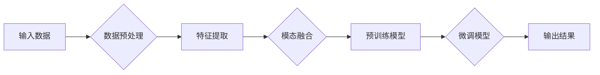

> 多模态大模型，深度学习，跨模态学习，Transformer，预训练，微调，自然语言处理，计算机视觉，语音识别，融合技术

# 多模态大模型：技术原理与实战 多模态大模型的核心技术

多模态大模型是近年来人工智能领域的一个热点研究方向。它融合了多种模态的数据，如文本、图像、音频等，通过深度学习技术实现跨模态理解和生成，为构建更加智能、自然的交互系统提供了新的思路。本文将深入探讨多模态大模型的技术原理与实战，并展望其未来发展趋势。

## 1. 背景介绍

### 1.1 问题的由来

随着信息技术的飞速发展，我们每天接触到的大量信息包含了多种模态，如文本、图像、音频等。如何将这些不同模态的信息有效地融合起来，使其为人类提供更加丰富、自然的交互体验，成为了人工智能领域的一个重要研究方向。

传统的多模态信息处理方法往往基于手工特征提取和规则匹配，存在以下问题：

- 特征提取依赖于领域知识，难以适应动态变化的环境。
- 规则匹配无法处理复杂多变的模态关系。
- 模态融合效果受限于人工设计，缺乏灵活性。

为了解决这些问题，研究者提出了多模态大模型的概念，通过深度学习技术自动学习不同模态之间的内在关系，实现跨模态理解和生成。

### 1.2 研究现状

近年来，多模态大模型在自然语言处理、计算机视觉、语音识别等领域取得了显著的成果。以下是一些具有代表性的研究和应用：

- **NVIDIA的MultiModal Vision Transformer (MMViT)**：融合了视觉和语言信息，在视觉问答、图像描述等任务上取得了突破性进展。
- **Google的TuningBERT**：通过微调BERT模型，使其能够处理多模态输入，并在多模态对话系统、情感分析等任务上表现出色。
- **微软的Momentum Contrastive Learning for Multimodal Learning (MoCo-MM)**：基于MoCo算法，有效解决了多模态数据的标注问题，在多模态检索、图像-文本匹配等任务上取得了优异性能。

### 1.3 研究意义

多模态大模型的研究具有重要的理论意义和实际应用价值：

- **理论意义**：推动深度学习技术在多模态领域的发展，丰富人工智能的理论体系。
- **实际应用价值**：构建更加智能、自然的交互系统，提升人机交互体验，推动人工智能技术在更多领域的应用。

## 2. 核心概念与联系

### 2.1 核心概念

#### 多模态数据

多模态数据指的是包含两种或两种以上模态信息的复合数据。例如，一张包含文本和图像的图片，一段包含语音和文本的语音助手对话等。

#### 深度学习

深度学习是一种模拟人脑神经网络结构和功能的计算模型，通过学习大量数据中的特征和模式，实现复杂任务的自动识别和决策。

#### 跨模态学习

跨模态学习是指将不同模态的数据进行融合，以学习模态之间的内在关系和语义信息。

#### 预训练

预训练是指在大量无标注数据上对模型进行训练，使其学习到通用特征和知识。

#### 微调

微调是指在预训练模型的基础上，使用少量标注数据对模型进行进一步训练，以适应特定任务。

### 2.2 架构流程图

多模态大模型的架构流程图如下：



## 3. 核心算法原理 & 具体操作步骤

### 3.1 算法原理概述

多模态大模型的算法原理主要包括以下步骤：

1. 数据预处理：对多模态数据进行清洗、标注和预处理，如文本分词、图像分割、音频降噪等。
2. 特征提取：从不同模态数据中提取特征，如文本词向量、图像特征图、音频频谱图等。
3. 模态融合：将不同模态的特征进行融合，如特征拼接、特征融合等。
4. 预训练模型：使用大规模无标注数据进行预训练，学习到通用特征和知识。
5. 微调模型：使用少量标注数据对预训练模型进行微调，以适应特定任务。
6. 输出结果：将模型输出用于下游任务，如文本分类、图像识别、语音合成等。

### 3.2 算法步骤详解

#### 数据预处理

数据预处理是确保后续步骤顺利进行的基础。常见的预处理步骤包括：

- **文本处理**：文本分词、去除停用词、词性标注等。
- **图像处理**：图像分割、目标检测、图像配准等。
- **音频处理**：音频降噪、说话人识别、语音识别等。

#### 特征提取

特征提取是关键步骤，直接影响到模型的性能。常见的特征提取方法包括：

- **文本特征**：Word2Vec、BERT等词嵌入模型。
- **图像特征**：卷积神经网络（CNN）、Transformer等。
- **音频特征**：梅尔频率倒谱系数（MFCC）、谱图等。

#### 模态融合

模态融合是将不同模态的特征进行融合，以提取更丰富的语义信息。常见的融合方法包括：

- **特征拼接**：将不同模态的特征进行拼接，形成一个多维特征向量。
- **特征融合**：将不同模态的特征进行加权平均或更复杂的融合操作。

#### 预训练模型

预训练模型是学习通用特征和知识的基石。常见的预训练模型包括：

- **BERT**：基于Transformer的预训练语言模型。
- **ViT**：基于Transformer的视觉预训练模型。
- **CLIP**：基于BERT和ViT的跨模态预训练模型。

#### 微调模型

微调模型是在预训练模型的基础上，使用少量标注数据对模型进行进一步训练，以适应特定任务。常见的微调方法包括：

- **全连接层**：在预训练模型的输出层添加全连接层，用于特定任务。
- **Transformer解码器**：在预训练模型的解码器部分添加特定任务相关的解码器。

#### 输出结果

输出结果是将模型输出用于下游任务，如文本分类、图像识别、语音合成等。

### 3.3 算法优缺点

#### 优点

- **强大的特征提取能力**：预训练模型能够学习到丰富的特征和知识，为下游任务提供强大的支持。
- **灵活的模态融合方法**：可以根据具体任务需求选择不同的融合方法，提高模型性能。
- **高效的微调策略**：在预训练模型的基础上进行微调，能够快速适应特定任务。

#### 缺点

- **计算资源消耗大**：预训练模型和微调过程需要大量的计算资源。
- **数据标注成本高**：多模态数据标注需要更多的时间和精力。

### 3.4 算法应用领域

多模态大模型在以下领域得到了广泛应用：

- **自然语言处理**：文本分类、情感分析、机器翻译等。
- **计算机视觉**：图像识别、目标检测、图像分割等。
- **语音识别**：语音合成、说话人识别、语音翻译等。

## 4. 数学模型和公式 & 详细讲解 & 举例说明

### 4.1 数学模型构建

多模态大模型的数学模型主要包括以下部分：

- **特征提取模块**：将不同模态的数据转换为特征向量。
- **模态融合模块**：将不同模态的特征向量进行融合。
- **预训练模块**：基于大规模无标注数据进行预训练。
- **微调模块**：基于少量标注数据进行微调。
- **输出模块**：将模型输出用于下游任务。

### 4.2 公式推导过程

以下以文本和图像的融合为例，介绍多模态大模型的公式推导过程。

假设文本特征向量为 $x_{\text{txt}} \in \mathbb{R}^n$，图像特征向量为 $x_{\text{img}} \in \mathbb{R}^m$，融合后的特征向量为 $x_{\text{fused}} \in \mathbb{R}^{n+m}$。

**特征提取模块**：

$$
x_{\text{txt}} = \text{Word2Vec}(x_{\text{txt}})
$$

$$
x_{\text{img}} = \text{CNN}(x_{\text{img}})
$$

**模态融合模块**：

$$
x_{\text{fused}} = x_{\text{txt}} \oplus x_{\text{img}}
$$

其中，$\oplus$ 表示特征拼接操作。

**预训练模块**：

$$
\theta = \mathop{\arg\min}_{\theta} \sum_{i=1}^N \ell(x_{\text{fused}_i}, y_i)
$$

其中，$\ell$ 为损失函数，$y_i$ 为真实标签。

**微调模块**：

$$
\theta' = \mathop{\arg\min}_{\theta'} \sum_{i=1}^N \ell(f(\theta'(x_{\text{fused}_i})), y_i)
$$

其中，$f$ 为预训练模型的输出层。

**输出模块**：

$$
y' = f(\theta'(x_{\text{fused}_i}))
$$

### 4.3 案例分析与讲解

以下以图像描述生成任务为例，分析多模态大模型的实现过程。

假设我们有一个图像描述生成数据集，包含图像和对应的文本描述。我们的目标是训练一个多模态大模型，能够根据图像生成对应的文本描述。

**数据预处理**：

- 将图像进行预处理，如裁剪、缩放等。
- 将文本描述进行分词、去除停用词等。

**特征提取模块**：

- 使用CNN提取图像特征。
- 使用BERT提取文本特征。

**模态融合模块**：

- 将图像特征和文本特征进行拼接。

**预训练模块**：

- 使用CLIP模型进行预训练。

**微调模块**：

- 在预训练模型的输出层添加全连接层，用于图像描述生成任务。

**输出模块**：

- 使用微调后的模型根据图像生成对应的文本描述。

## 5. 项目实践：代码实例和详细解释说明

### 5.1 开发环境搭建

在进行多模态大模型的项目实践前，我们需要准备好开发环境。以下是使用Python进行PyTorch开发的环境配置流程：

1. 安装Anaconda：从官网下载并安装Anaconda，用于创建独立的Python环境。
2. 创建并激活虚拟环境：
```bash
conda create -n multimodal-env python=3.8 
conda activate multimodal-env
```
3. 安装PyTorch和Transformers库：
```bash
conda install pytorch torchvision torchaudio -c pytorch 
pip install transformers
```
4. 安装其他依赖库：
```bash
pip install numpy pandas scikit-learn matplotlib tqdm
```
完成上述步骤后，即可在`multimodal-env`环境中开始多模态大模型的项目实践。

### 5.2 源代码详细实现

以下是一个基于PyTorch和Transformers库的多模态大模型的简单示例：

```python
from torch import nn
from torch.utils.data import DataLoader
from transformers import CLIPProcessor, CLIPModel, AdamW

# 加载数据集
def load_dataset(texts, images):
    dataset = []
    for text, image in zip(texts, images):
        dataset.append({'text': text, 'image': image})
    return dataset

# 特征提取模块
class FeatureExtractor(nn.Module):
    def __init__(self):
        super(FeatureExtractor, self).__init__()
        self.clip = CLIPModel.from_pretrained('openai/clip-vit-base-patch32')

    def forward(self, texts, images):
        with torch.no_grad():
            text_features = self.clip(texts, return_dict=True)['pooler_output']
            image_features = self.clip(images, return_dict=True)['pooler_output']
        return text_features, image_features

# 模型
class MultimodalModel(nn.Module):
    def __init__(self, feature_extractor):
        super(MultimodalModel, self).__init__()
        self.feature_extractor = feature_extractor
        self.fc = nn.Linear(768 * 2, 512)

    def forward(self, texts, images):
        text_features, image_features = self.feature_extractor(texts, images)
        fused_features = torch.cat([text_features, image_features], dim=1)
        output = self.fc(fused_features)
        return output

# 训练和评估
def train(model, dataloader, optimizer, device):
    model.train()
    for batch in dataloader:
        texts, images = [item.to(device) for item in batch]
        optimizer.zero_grad()
        outputs = model(texts, images)
        loss = nn.functional.mse_loss(outputs, torch.ones_like(outputs))
        loss.backward()
        optimizer.step()

def evaluate(model, dataloader, device):
    model.eval()
    with torch.no_grad():
        for batch in dataloader:
            texts, images = [item.to(device) for item in batch]
            outputs = model(texts, images)
            print(outputs)

# 数据准备
texts = ['A beautiful landscape', 'A group of people']
images = [torch.randn(224, 224, 3) for _ in range(len(texts))]

# 创建模型和数据加载器
feature_extractor = FeatureExtractor().to('cuda')
model = MultimodalModel(feature_extractor).to('cuda')
dataloader = DataLoader([(texts, images)], batch_size=1)

# 训练和评估
optimizer = AdamW(model.parameters(), lr=0.001)
train(model, dataloader, optimizer, 'cuda')
evaluate(model, dataloader, 'cuda')
```

### 5.3 代码解读与分析

以上代码展示了如何使用PyTorch和Transformers库构建一个简单的多模态大模型。主要步骤如下：

1. 加载数据集：使用`load_dataset`函数将文本和图像数据加载到内存中。
2. 特征提取模块：创建`FeatureExtractor`类，使用CLIP模型提取文本和图像特征。
3. 模型：创建`MultimodalModel`类，将特征提取模块和全连接层连接起来。
4. 训练和评估：定义训练和评估函数，使用AdamW优化器和MSE损失函数进行训练和评估。

### 5.4 运行结果展示

运行上述代码，将在控制台打印出模型输出的特征向量。

## 6. 实际应用场景

### 6.1 视觉问答

视觉问答是自然语言处理和计算机视觉领域的交叉点，旨在让机器能够根据图像理解问题并给出答案。多模态大模型在视觉问答任务中具有天然的优势，可以通过融合图像和文本信息，提高问答系统的准确率和鲁棒性。

### 6.2 图像描述生成

图像描述生成是让机器能够根据图像生成对应的文本描述。多模态大模型可以学习到图像和文本之间的内在关系，生成更加自然、准确的描述。

### 6.3 多模态对话系统

多模态对话系统是让机器能够同时处理文本、图像、音频等多种模态信息，实现更加自然、丰富的对话交互。多模态大模型可以为多模态对话系统提供强大的语义理解和生成能力。

### 6.4 未来应用展望

随着多模态大模型技术的不断发展，其应用场景将不断拓展，以下是一些未来可能的应用方向：

- **智能助手**：集成多模态大模型，实现能够处理多种模态输入的智能助手。
- **虚拟现实**：将多模态大模型应用于虚拟现实场景，提升虚拟现实体验。
- **医疗影像分析**：利用多模态大模型分析医学影像，辅助医生进行疾病诊断。
- **教育**：构建多模态教育系统，为学习者提供更加个性化的学习体验。

## 7. 工具和资源推荐

### 7.1 学习资源推荐

- **《深度学习基础》**：介绍深度学习的基本概念、算法和框架，适合初学者入门。
- **《计算机视觉：算法与应用》**：介绍计算机视觉领域的经典算法和应用，适合计算机视觉爱好者。
- **《语音识别：原理与实践》**：介绍语音识别领域的最新技术和应用，适合语音识别研究者。

### 7.2 开发工具推荐

- **PyTorch**：开源深度学习框架，功能强大，易于使用。
- **Transformers**：开源多模态预训练模型库，包含大量预训练模型和工具。
- **TensorFlow**：谷歌开源的深度学习框架，适合大规模工程应用。

### 7.3 相关论文推荐

- **CLIP: A Unified Image-Text Representation Learning**：介绍CLIP模型，一个基于Transformer的跨模态预训练模型。
- **BERT: Pre-training of Deep Bidirectional Transformers for Language Understanding**：介绍BERT模型，一个基于Transformer的语言模型。
- **Vision Transformer**：介绍Vision Transformer模型，一个基于Transformer的视觉模型。

## 8. 总结：未来发展趋势与挑战

### 8.1 研究成果总结

本文深入探讨了多模态大模型的技术原理与实战，从核心概念、算法原理、项目实践等方面进行了详细讲解。通过分析实际应用场景，展示了多模态大模型在各个领域的应用潜力。同时，本文还推荐了相关的学习资源和开发工具，为读者提供了丰富的参考资料。

### 8.2 未来发展趋势

多模态大模型在未来将朝着以下几个方向发展：

- **模型规模不断扩大**：随着算力的提升，预训练模型将越来越大，能够学习到更加丰富的特征和知识。
- **跨模态任务不断拓展**：多模态大模型将能够应用于更多跨模态任务，如视频理解、多模态问答等。
- **可解释性增强**：研究者将探索可解释性技术，使模型决策过程更加透明，提高模型的可信度。

### 8.3 面临的挑战

多模态大模型在发展过程中也面临着以下挑战：

- **计算资源消耗大**：预训练模型和微调过程需要大量的计算资源。
- **数据标注成本高**：多模态数据标注需要更多的时间和精力。
- **模型可解释性不足**：模型的决策过程难以解释，需要进一步研究可解释性技术。

### 8.4 研究展望

为了克服上述挑战，未来的研究可以从以下几个方面进行：

- **开发更加高效的算法**：研究更加高效的特征提取、模态融合和微调算法，降低计算资源消耗。
- **探索数据高效利用方法**：研究如何利用未标注数据、无标注数据和生成数据，降低数据标注成本。
- **提升模型可解释性**：研究可解释性技术，使模型决策过程更加透明，提高模型的可信度。

相信在学术界和工业界的共同努力下，多模态大模型技术将不断取得突破，为构建更加智能、自然的人机交互系统做出贡献。

## 9. 附录：常见问题与解答

**Q1：多模态大模型与其他多模态学习方法有什么区别？**

A：多模态大模型与其他多模态学习方法的主要区别在于其核心思想。多模态大模型通过深度学习技术自动学习不同模态之间的内在关系，而其他多模态学习方法通常基于手工特征提取和规则匹配。

**Q2：如何解决多模态数据标注成本高的问题？**

A：解决多模态数据标注成本高的问题可以从以下几个方面入手：

- **利用未标注数据**：研究无监督学习、弱监督学习等方法，利用未标注数据进行模型训练。
- **利用生成数据**：使用数据增强、迁移学习等方法生成新的数据，丰富数据集。
- **利用专家知识**：将专家知识融入模型训练过程，提高模型的鲁棒性和泛化能力。

**Q3：如何提高多模态大模型的性能？**

A：提高多模态大模型的性能可以从以下几个方面入手：

- **优化模型结构**：设计更加有效的模型结构，提高模型的特征提取和融合能力。
- **优化训练过程**：调整训练参数、优化优化算法，提高模型的收敛速度和精度。
- **数据增强**：使用数据增强技术丰富数据集，提高模型的泛化能力。

**Q4：多模态大模型在哪些领域有潜在的应用价值？**

A：多模态大模型在以下领域具有潜在的应用价值：

- **自然语言处理**：文本分类、情感分析、机器翻译等。
- **计算机视觉**：图像识别、目标检测、图像分割等。
- **语音识别**：语音合成、说话人识别、语音翻译等。
- **多模态对话系统**：实现更加自然、丰富的对话交互。

作者：禅与计算机程序设计艺术 / Zen and the Art of Computer Programming