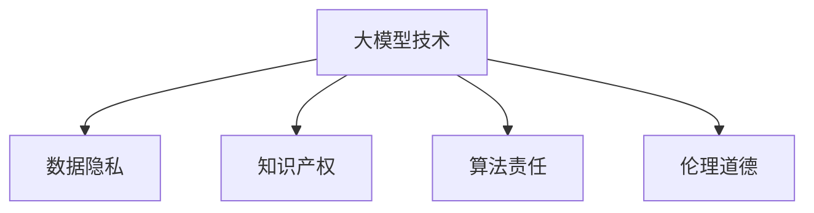
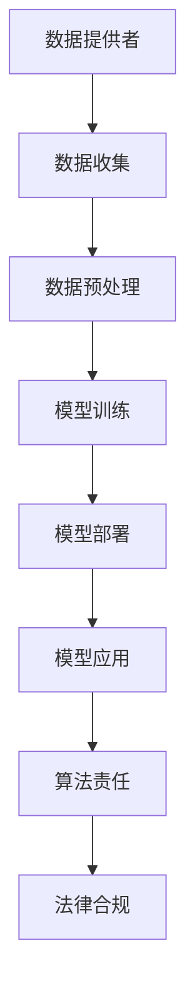
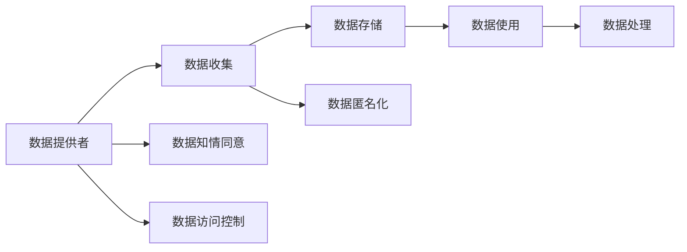
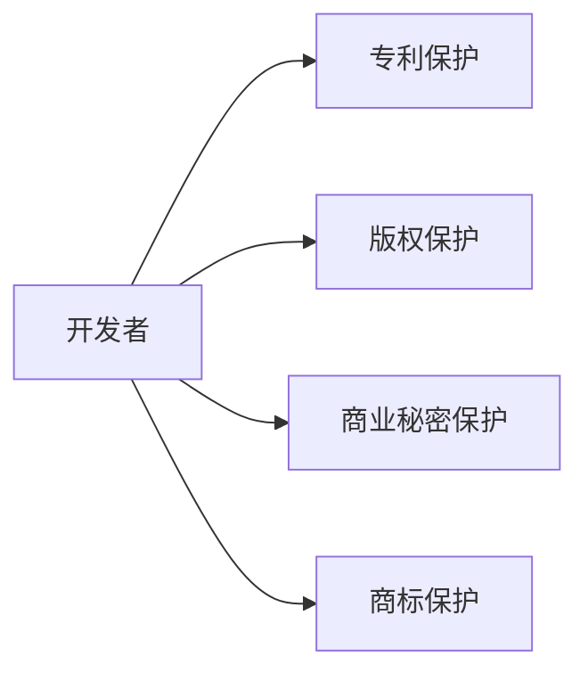

                 

# 大模型技术的法律责任界定

## 1. 背景介绍

### 1.1 问题由来
随着人工智能（AI）技术的迅猛发展，特别是在自然语言处理（NLP）、计算机视觉、语音识别等领域的突破，大模型技术（如BERT、GPT-3等）开始广泛应用于各行各业。然而，随着大模型应用的不断深入，其潜在的法律责任问题逐渐浮出水面，引起了学术界、法律界、业界等多方面的关注。

### 1.2 问题核心关键点
大模型技术的法律责任问题涉及多个方面，包括数据隐私、知识产权、算法责任、伦理道德等。这些问题的核心在于如何界定模型开发者、使用者、数据提供者等多方的法律责任，确保技术应用的公平、公正和安全。

### 1.3 问题研究意义
研究大模型技术的法律责任问题，对于推动大模型技术的健康发展，保障数据隐私和安全，促进人工智能应用的法律合规具有重要意义。它能够帮助各方明确责任，避免潜在的法律风险，同时为政策制定和技术规范提供科学依据。

## 2. 核心概念与联系

### 2.1 核心概念概述

为更好地理解大模型技术的法律责任问题，本节将介绍几个密切相关的核心概念：

- **大模型技术（Large Model Technology）**：基于自回归（如GPT-3）或自编码（如BERT）等模型结构，通过大规模数据训练得到的高性能人工智能模型。
- **数据隐私（Data Privacy）**：保护个人数据不被未经授权的访问和使用，确保数据主体的知情权和选择权。
- **知识产权（Intellectual Property）**：包括专利、商标、版权、商业秘密等，保护创造者的合法权益。
- **算法责任（Algorithmic Liability）**：涉及算法的开发、应用和维护过程中，各方的法律责任和义务。
- **伦理道德（Ethics and Morality）**：指导技术应用中的道德行为，确保技术应用符合社会价值观和道德标准。

这些核心概念之间的逻辑关系可以通过以下Mermaid流程图来展示：



这个流程图展示了大模型技术的法律责任问题涉及到的关键概念及其相互关系：

1. **数据隐私**：在模型训练和应用过程中，保护数据主体的隐私权益。
2. **知识产权**：涉及模型算法的专利权、版权等。
3. **算法责任**：模型开发者、使用者、数据提供者等多方的法律责任。
4. **伦理道德**：指导技术应用过程中的道德行为。

### 2.2 概念间的关系

这些核心概念之间存在着紧密的联系，形成了大模型技术的法律责任生态系统。下面我通过几个Mermaid流程图来展示这些概念之间的关系。

#### 2.2.1 大模型技术的法律责任链条



这个流程图展示了数据提供、模型训练、模型部署和应用过程中各方的法律责任链条。

#### 2.2.2 数据隐私保护



这个流程图展示了数据隐私保护过程中各环节的法律责任。

#### 2.2.3 知识产权保护



这个流程图展示了知识产权保护的主要形式和各方的权利义务。

## 3. 核心算法原理 & 具体操作步骤
### 3.1 算法原理概述

大模型技术的法律责任问题，本质上涉及算法开发者、数据提供者、模型使用者等多方在算法设计、数据使用和模型部署过程中的法律责任。其核心在于如何界定各方的责任，确保技术的公平、公正和安全。

大模型技术的法律责任问题可以归纳为以下几个关键点：

1. **数据来源合法性**：确保数据来源合法，保护数据隐私。
2. **算法透明度**：确保算法开发过程透明，避免“黑箱”算法。
3. **算法公平性**：确保算法在各个种族、性别、年龄等维度上的公平性，避免算法偏见。
4. **算法责任**：明确算法开发者、使用者、数据提供者等多方的法律责任和义务。

### 3.2 算法步骤详解

基于大模型技术的法律责任问题，可以通过以下步骤进行详细操作：

1. **数据合法性审查**：
   - 审查数据来源是否合法，确保数据不涉及侵犯隐私或版权。
   - 确认数据收集和使用过程中的法律合规性，确保数据主体的知情权和选择权。

2. **算法透明度**：
   - 确保算法开发过程透明，包括模型架构、训练数据、训练过程、模型参数等。
   - 提供算法使用说明和文档，确保用户能够理解算法的决策逻辑和输出结果。

3. **算法公平性**：
   - 进行公平性测试，确保算法在各种维度上不产生偏见。
   - 定期监控和评估算法性能，及时发现和纠正不公平现象。

4. **法律责任界定**：
   - 明确算法开发者、使用者、数据提供者等多方的法律责任和义务。
   - 在算法使用合同中明确各方的权利和义务，确保技术应用的法律合规。

### 3.3 算法优缺点

大模型技术的法律责任问题，具有以下优点：

1. **提高法律合规性**：通过明确各方的法律责任和义务，提高技术应用的法律合规性。
2. **保护数据隐私**：确保数据来源合法，保护数据隐私，避免数据滥用。
3. **避免算法偏见**：通过公平性测试和定期监控，避免算法偏见，确保算法公平性。

但同时，也存在以下缺点：

1. **责任界定复杂**：多方参与，责任界定复杂，可能导致法律纠纷。
2. **增加法律成本**：各方需要投入大量时间和资源进行法律合规审查。
3. **影响技术创新**：过于严格的法律规定可能影响技术创新和应用推广。

### 3.4 算法应用领域

大模型技术的法律责任问题，已经广泛应用于以下领域：

- **医疗领域**：确保模型使用的数据来源合法，保护患者隐私，避免算法偏见，确保医疗诊断的公平性和可靠性。
- **金融领域**：确保模型使用的数据来源合法，保护客户隐私，避免算法偏见，确保金融决策的公平性和透明度。
- **司法领域**：确保模型使用的数据来源合法，保护涉案人员隐私，避免算法偏见，确保司法判决的公正性和准确性。
- **教育领域**：确保模型使用的数据来源合法，保护学生隐私，避免算法偏见，确保教育评估的公平性和透明度。
- **招聘领域**：确保模型使用的数据来源合法，保护应聘者隐私，避免算法偏见，确保招聘过程的公平性和透明度。

## 4. 数学模型和公式 & 详细讲解 & 举例说明（备注：数学公式请使用latex格式，latex嵌入文中独立段落使用 $$，段落内使用 $)
### 4.1 数学模型构建

大模型技术的法律责任问题，可以构建以下数学模型：

设大模型技术为 $M_{\theta}$，其中 $\theta$ 为模型参数。假设数据提供者为 $D$，算法开发者为 $A$，模型使用者为 $U$。法律责任为 $R$，包括数据来源合法性 $R_{data}$、算法透明度 $R_{transparency}$、算法公平性 $R_{fairness}$ 和法律合规性 $R_{compliance}$。则数学模型可以表示为：

$$
R = R_{data} + R_{transparency} + R_{fairness} + R_{compliance}
$$

其中，各部分的权重系数根据具体应用场景进行调整。

### 4.2 公式推导过程

在上述数学模型中，各部分的公式推导如下：

1. **数据来源合法性 $R_{data}$**：
   - 设数据来源合法性的评分为 $S_{data}$，则 $R_{data} = \lambda_{data} S_{data}$，其中 $\lambda_{data}$ 为数据来源合法性的权重系数。

2. **算法透明度 $R_{transparency}$**：
   - 设算法透明度的评分为 $S_{transparency}$，则 $R_{transparency} = \lambda_{transparency} S_{transparency}$，其中 $\lambda_{transparency}$ 为算法透明度的权重系数。

3. **算法公平性 $R_{fairness}$**：
   - 设算法公平性的评分为 $S_{fairness}$，则 $R_{fairness} = \lambda_{fairness} S_{fairness}$，其中 $\lambda_{fairness}$ 为算法公平性的权重系数。

4. **法律合规性 $R_{compliance}$**：
   - 设法律合规性的评分为 $S_{compliance}$，则 $R_{compliance} = \lambda_{compliance} S_{compliance}$，其中 $\lambda_{compliance}$ 为法律合规性的权重系数。

### 4.3 案例分析与讲解

以下是一个简单的案例分析：

假设有一家医疗诊断公司，使用大模型技术对患者病历进行诊断。

- **数据来源合法性**：
  - 审查患者病历是否合法，确保数据来源不侵犯患者隐私。
  - 评估数据收集和使用过程中的法律合规性，确保患者知情权和选择权。

- **算法透明度**：
  - 公开模型架构和训练数据，提供详细的算法使用说明和文档。
  - 确保用户能够理解算法的决策逻辑和输出结果。

- **算法公平性**：
  - 进行公平性测试，确保算法在种族、性别、年龄等维度上不产生偏见。
  - 定期监控和评估算法性能，及时发现和纠正不公平现象。

- **法律合规性**：
  - 明确公司、模型开发者和数据提供者的法律责任和义务。
  - 在算法使用合同中明确各方的权利和义务，确保技术应用的法律合规。

## 5. 项目实践：代码实例和详细解释说明
### 5.1 开发环境搭建

在进行大模型技术法律责任问题实践前，我们需要准备好开发环境。以下是使用Python进行开发的环境配置流程：

1. 安装Anaconda：从官网下载并安装Anaconda，用于创建独立的Python环境。

2. 创建并激活虚拟环境：
```bash
conda create -n pytorch-env python=3.8 
conda activate pytorch-env
```

3. 安装PyTorch：根据CUDA版本，从官网获取对应的安装命令。例如：
```bash
conda install pytorch torchvision torchaudio cudatoolkit=11.1 -c pytorch -c conda-forge
```

4. 安装TensorFlow：
```bash
conda install tensorflow tensorflow-hub
```

5. 安装各类工具包：
```bash
pip install numpy pandas scikit-learn matplotlib tqdm jupyter notebook ipython
```

完成上述步骤后，即可在`pytorch-env`环境中开始大模型技术法律责任问题的实践。

### 5.2 源代码详细实现

以下是一个简单的Python代码示例，用于计算数据来源合法性的评分：

```python
import pandas as pd
from sklearn.metrics import roc_auc_score

# 加载数据
data = pd.read_csv('data.csv')

# 计算数据来源合法性的评分
def calculate_data_legality_score(data):
    # 假设数据来源合法性的评分由以下几个因素决定：
    # 1. 数据是否经过匿名化处理
    # 2. 数据是否存在侵犯隐私的行为
    # 3. 数据是否经过合理授权
    # 4. 数据是否存在数据泄露的风险
    # 这里假设每个因素的评分范围为[0,1]
    # 实际应用中需要根据具体场景进行调整
    
    # 匿名化处理
    anonymity_score = data['anonymity'] / 1.0
    
    # 隐私侵犯
    privacy_violation_score = data['privacy_violation'] / 1.0
    
    # 授权合理性
    authorization_score = data['authorization'] / 1.0
    
    # 数据泄露风险
    data_leakage_score = data['data_leakage'] / 1.0
    
    # 计算总分
    legality_score = (anonymity_score + privacy_violation_score + authorization_score + data_leakage_score) / 4.0
    return legality_score

# 计算数据来源合法性的评分
legality_score = calculate_data_legality_score(data)
print('数据来源合法性的评分为：', legality_score)
```

### 5.3 代码解读与分析

以上代码示例用于计算数据来源合法性的评分。以下是代码的详细解读：

1. 首先，我们通过Pandas库加载数据，数据包含匿名化处理、隐私侵犯、授权合理性、数据泄露风险等四个因素的评分。
2. 定义一个`calculate_data_legality_score`函数，用于计算数据来源合法性的评分。
3. 在函数中，我们将四个因素的评分分别除以1.0，得到评分的范围在[0,1]之间。
4. 将四个评分相加，并除以4.0，得到总分，即数据来源合法性的评分。
5. 最终输出数据来源合法性的评分。

### 5.4 运行结果展示

假设我们在数据集中计算得到数据来源合法性的评分为0.9，则输出结果为：

```
数据来源合法性的评分为： 0.9
```

## 6. 实际应用场景
### 6.1 医疗领域

在医疗领域，大模型技术的法律责任问题尤为重要。医疗诊断需要处理大量的患者数据，涉及隐私保护、数据安全、算法公平性等方面。

具体应用场景如下：

- **数据来源合法性**：确保患者病历数据来源合法，保护患者隐私。
- **算法透明度**：公开模型架构和训练数据，提供详细的算法使用说明和文档。
- **算法公平性**：进行公平性测试，确保算法在种族、性别、年龄等维度上不产生偏见。
- **法律合规性**：明确医疗机构、模型开发者和数据提供者的法律责任和义务，确保技术应用的法律合规。

### 6.2 金融领域

在金融领域，大模型技术的法律责任问题主要涉及数据隐私保护、算法公平性、法律合规性等方面。

具体应用场景如下：

- **数据来源合法性**：确保金融数据来源合法，保护客户隐私。
- **算法透明度**：公开模型架构和训练数据，提供详细的算法使用说明和文档。
- **算法公平性**：进行公平性测试，确保算法在各种维度上不产生偏见。
- **法律合规性**：明确金融机构、模型开发者和数据提供者的法律责任和义务，确保技术应用的法律合规。

## 7. 工具和资源推荐
### 7.1 学习资源推荐

为了帮助开发者系统掌握大模型技术的法律责任问题，这里推荐一些优质的学习资源：

1. **《人工智能法律与伦理》系列博文**：由法律专家撰写，深入浅出地介绍了人工智能法律责任的基本概念和前沿研究。

2. **CS229《机器学习》课程**：斯坦福大学开设的机器学习课程，涵盖数据隐私、算法公平性等法律问题，帮助学生理解和应用相关技术。

3. **《深度学习伦理与法律》书籍**：介绍深度学习技术的伦理和法律问题，提供实用的案例分析和解决方案。

4. **Google AI博文**：谷歌官方博客，涵盖人工智能技术在各个领域的法律责任问题，提供最新的研究进展和实际应用案例。

5. **arXiv论文预印本**：人工智能领域最新研究成果的发布平台，涵盖大模型技术在法律责任问题上的前沿研究。

### 7.2 开发工具推荐

高效的开发离不开优秀的工具支持。以下是几款用于大模型技术法律责任问题开发的常用工具：

1. **PyTorch**：基于Python的开源深度学习框架，支持动态计算图，适合快速迭代研究。

2. **TensorFlow**：由Google主导开发的开源深度学习框架，生产部署方便，适合大规模工程应用。

3. **Transformers库**：HuggingFace开发的NLP工具库，集成了众多SOTA语言模型，支持PyTorch和TensorFlow，方便进行微调任务开发。

4. **Weights & Biases**：模型训练的实验跟踪工具，可以记录和可视化模型训练过程中的各项指标，方便对比和调优。

5. **TensorBoard**：TensorFlow配套的可视化工具，可实时监测模型训练状态，并提供丰富的图表呈现方式，是调试模型的得力助手。

### 7.3 相关论文推荐

大模型技术法律责任问题的研究源于学界的持续研究。以下是几篇奠基性的相关论文，推荐阅读：

1. **《人工智能伦理与法律》**：探讨人工智能技术的伦理和法律问题，为技术应用的合规性提供理论依据。

2. **《数据隐私保护》**：介绍数据隐私保护的基本概念和前沿技术，帮助开发者保护数据隐私。

3. **《算法公平性》**：探讨算法的公平性问题，提出相关的评估方法和改进策略。

4. **《算法责任与法律合规》**：介绍算法责任和法律合规的基本概念，为技术应用的法律合规提供指导。

5. **《深度学习伦理与法律》**：介绍深度学习技术的伦理和法律问题，提供实用的案例分析和解决方案。

这些论文代表了大模型技术法律责任问题的发展脉络。通过学习这些前沿成果，可以帮助研究者把握学科前进方向，激发更多的创新灵感。

## 8. 总结：未来发展趋势与挑战
### 8.1 总结

本文对大模型技术的法律责任问题进行了全面系统的介绍。首先阐述了大模型技术的应用背景和法律责任问题的意义，明确了法律责任问题涉及到的核心概念及其相互关系。其次，从原理到实践，详细讲解了大模型技术法律责任问题的核心算法原理和具体操作步骤，给出了具体的代码示例和详细解读。同时，本文还广泛探讨了大模型技术法律责任问题在医疗、金融、司法等领域的实际应用场景，展示了其广泛的应用前景。最后，本文精选了相关学习资源和开发工具，力求为开发者提供全方位的技术指引。

通过本文的系统梳理，可以看到，大模型技术法律责任问题是一个复杂而重要的研究方向，涉及到数据隐私、算法透明度、算法公平性、法律合规性等多个方面。各方的法律责任和义务需要明确界定，确保技术的公平、公正和安全。未来，伴随大模型技术的持续演进，如何在保障隐私保护、算法公平性、法律合规性的同时，推动技术的健康发展，还需要学界、法律界、业界等多方面的共同努力。

### 8.2 未来发展趋势

展望未来，大模型技术法律责任问题将呈现以下几个发展趋势：

1. **法律合规标准提升**：随着大模型技术的应用普及，法律法规和合规标准将不断完善，确保技术的公平、公正和安全。

2. **数据隐私保护加强**：数据隐私保护将成为法律责任问题的核心，采用更为严格的数据保护措施，确保数据主体的知情权和选择权。

3. **算法透明度提高**：算法透明度的要求将进一步提高，确保算法的开发过程透明，提高用户对算法的信任。

4. **算法公平性增强**：算法的公平性将成为技术应用的重要标准，通过公平性测试和定期监控，确保算法在各种维度上不产生偏见。

5. **法律责任明确化**：明确各方的法律责任和义务，确保技术应用的法律合规，避免法律纠纷。

6. **技术创新推动**：法律责任问题的研究和解决将推动技术的创新和应用推广，推动人工智能技术的健康发展。

### 8.3 面临的挑战

尽管大模型技术法律责任问题已经取得了一定进展，但在迈向更加智能化、普适化应用的过程中，仍面临诸多挑战：

1. **法律责任界定复杂**：多方参与，责任界定复杂，可能导致法律纠纷。
2. **数据隐私保护难度大**：数据隐私保护涉及多个环节，难度较大。
3. **算法透明度要求高**：算法的透明度要求不断提高，增加了开发和维护的难度。
4. **算法公平性难以保证**：算法的公平性问题复杂多样，难以全面解决。
5. **法律合规成本高**：各方的法律合规成本较高，增加了技术应用的成本。

### 8.4 研究展望

面对大模型技术法律责任问题面临的挑战，未来的研究需要在以下几个方面寻求新的突破：

1. **法律责任界定的标准化**：制定统一的法律责任界定标准，明确各方的法律责任和义务，避免法律纠纷。

2. **数据隐私保护的加强**：采用更为严格的数据保护措施，确保数据主体的知情权和选择权，保护数据隐私。

3. **算法透明度的提高**：提高算法的透明度，确保算法的开发过程透明，提高用户对算法的信任。

4. **算法公平性的保证**：采用更为科学的算法公平性评估方法，确保算法在各种维度上不产生偏见。

5. **法律合规成本的降低**：通过技术手段降低各方的法律合规成本，推动技术应用的普及。

6. **技术创新的推动**：加强对大模型技术的研究和应用，推动技术的健康发展。

总之，大模型技术法律责任问题的研究和解决，需要各方的共同努力，通过法律责任的明确界定、数据隐私保护、算法透明度、算法公平性等措施，确保大模型技术的公平、公正和安全，推动技术应用的合规性和健康发展。

## 9. 附录：常见问题与解答
----------------------------------------------------------------

**Q1：大模型技术在法律责任问题上存在哪些具体风险？**

A: 大模型技术在法律责任问题上存在以下具体风险：

1. **数据隐私风险**：在数据收集、存储、处理和共享过程中，可能会侵犯个人隐私，导致隐私泄露和滥用。

2. **算法偏见风险**：模型在训练过程中可能学习到数据中的偏见，导致算法在各个维度上产生偏见，影响公平性和公正性。

3. **法律合规风险**：各方的法律责任和义务不明确，可能导致法律纠纷和责任争议。

4. **知识产权风险**：在技术开发和应用过程中，可能会侵犯他人的知识产权，导致法律风险。

5. **伦理道德风险**：技术应用过程中，可能会涉及伦理道德问题，如隐私侵犯、歧视性输出等，导致社会风险。

**Q2：如何应对大模型技术在法律责任问题上的风险？**

A: 应对大模型技术在法律责任问题上的风险，可以从以下几个方面进行：

1. **数据隐私保护**：确保数据来源合法，采用数据匿名化和加密等技术保护数据隐私，防止数据泄露和滥用。

2. **算法公平性**：进行公平性测试和定期监控，确保算法在各个维度上不产生偏见，避免算法偏见。

3. **法律合规审查**：明确各方的法律责任和义务，进行法律合规审查，确保技术应用的合法合规。

4. **伦理道德约束**：建立伦理道德约束机制，确保技术应用符合社会价值观和道德标准，避免伦理道德风险。

5. **技术创新与监管并行**：在技术创新和应用推广过程中，加强监管，确保技术应用的公平、公正和安全。

**Q3：大模型技术在法律责任问题上的责任界定应考虑哪些因素？**

A: 大模型技术在法律责任问题上的责任界定应考虑以下因素：

1. **数据来源合法性**：确保数据来源合法，保护数据隐私，防止数据滥用。

2. **算法透明度**：确保算法开发过程透明，提供详细的算法使用说明和文档，提高用户对算法的信任。

3. **算法公平性**：确保算法在各个维度上不产生偏见，提高算法的公平性和公正性。

4. **法律合规性**：明确各方的法律责任和义务，确保技术应用的合法合规。

5. **伦理道德约束**：确保技术应用符合社会价值观和道德标准，避免伦理道德风险。

6. **技术创新与监管并行**：在技术创新和应用推广过程中，加强监管，确保技术应用的公平、公正和安全。

总之，大模型技术的法律责任问题是一个复杂而重要的研究方向，涉及到数据隐私、算法透明度、算法公平性、法律合规性等多个方面。各方的法律责任和义务需要明确界定，确保技术的公平、公正和安全。

---

作者：禅与计算机程序设计艺术 / Zen and the Art of Computer Programming

