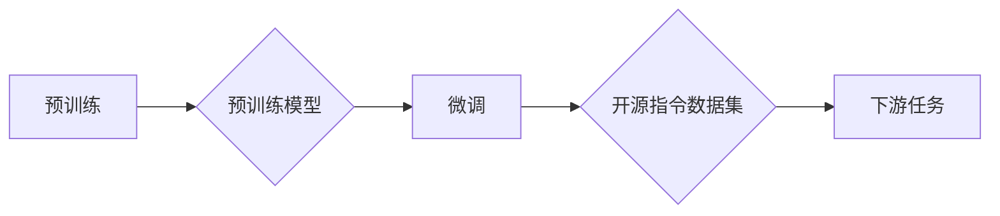

> 关键词：大规模语言模型，开源指令数据集，预训练，微调，NLP，自然语言处理，Transformer，BERT

# 大规模语言模型从理论到实践 开源指令数据集

### 1. 背景介绍

随着深度学习技术的飞速发展，自然语言处理（NLP）领域迎来了新的春天。大规模语言模型（Large Language Models，LLMs）如BERT、GPT-3等，凭借其强大的语言理解与生成能力，在文本分类、机器翻译、问答系统等任务上取得了显著的成果。然而，LLMs的训练和微调需要海量数据和计算资源，这限制了其在实际应用中的推广。为了解决这一问题，开源指令数据集应运而生。本文将探讨大规模语言模型从理论到实践，以及开源指令数据集在其中的作用。

### 2. 核心概念与联系

#### 2.1 大规模语言模型

大规模语言模型（LLMs）是一类基于深度学习的语言模型，能够理解和生成人类语言。LLMs通过在大规模文本语料库上进行预训练，学习语言的模式和知识，从而具备强大的语言理解和生成能力。

#### 2.2 预训练与微调

预训练是指在大规模无标签文本语料库上训练模型，使其学习到通用的语言表征和知识。微调是在预训练模型的基础上，使用少量标注数据进行调整，使其适应特定任务。

#### 2.3 开源指令数据集

开源指令数据集是指为了促进LLMs研究和应用而发布的公开数据集，包含了大量人类编写的指令和对应的文本或代码，可用于微调LLMs以完成各种任务。

#### 2.4 Mermaid流程图



### 3. 核心算法原理 & 具体操作步骤

#### 3.1 算法原理概述

LLMs的预训练和微调过程主要基于以下原理：

- **自回归语言模型**：通过预测下一个词来学习语言模式。
- **掩码语言模型**：随机掩码部分词，预测被掩码的词，学习语言的长距离依赖。
- **自编码器**：学习将输入编码为固定长度的向量表示，再解码回原始文本。
- **注意力机制**：关注输入文本中的重要信息，提高模型的表达能力。

#### 3.2 算法步骤详解

1. **预训练**：
    - 使用自回归语言模型或掩码语言模型在大规模文本语料库上进行预训练。
    - 训练过程中，模型学习语言的模式和知识，并优化参数。

2. **微调**：
    - 使用开源指令数据集对预训练模型进行微调。
    - 微调过程中，模型学习特定任务的指令和输出，并优化参数。

#### 3.3 算法优缺点

**优点**：

- **强大的语言理解与生成能力**：LLMs能够理解和生成自然语言，适用于各种NLP任务。
- **泛化能力强**：LLMs在大规模文本语料库上进行预训练，能够泛化到各种任务。
- **参数高效**：微调过程只需少量标注数据，即可显著提升模型性能。

**缺点**：

- **训练成本高**：LLMs的训练需要海量数据和计算资源。
- **可解释性差**：LLMs的决策过程难以解释。
- **数据偏差**：LLMs可能学习到数据中的偏见和错误信息。

#### 3.4 算法应用领域

LLMs在以下领域具有广泛的应用：

- **文本分类**：新闻分类、情感分析、垃圾邮件过滤等。
- **机器翻译**：将一种语言翻译成另一种语言。
- **问答系统**：根据用户的问题，从大量文本中找到相关答案。
- **文本摘要**：将长文本压缩成简短的摘要。
- **对话系统**：与用户进行自然语言对话。

### 4. 数学模型和公式 & 详细讲解 & 举例说明

#### 4.1 数学模型构建

LLMs通常基于神经网络构建，以下以Transformer模型为例：

- **输入**：输入序列 $X = (x_1, x_2, \ldots, x_n)$，其中 $x_i$ 为词向量。
- **输出**：输出序列 $Y = (y_1, y_2, \ldots, y_n)$，其中 $y_i$ 为预测的词向量。
- **模型**：使用多头注意力机制和位置编码，将输入序列编码为输出序列。

#### 4.2 公式推导过程

- **多头注意力机制**：

$$
\text{Attention}(Q, K, V) = \text{softmax}(\frac{QK^T}{\sqrt{d_k}})V
$$

- **位置编码**：

$$
P_t = \sin\left(\frac{t}{10000^{2i/d_k}}\right) \text{ 或 } \cos\left(\frac{t}{10000^{2i/d_k}}\right)
$$

#### 4.3 案例分析与讲解

以BERT模型为例，说明如何使用开源指令数据集进行微调：

1. **数据准备**：收集包含指令和文本的指令数据集，如公开的指令数据集。
2. **模型选择**：选择BERT模型作为预训练模型。
3. **微调**：
    - 将指令和文本拼接，作为模型输入。
    - 使用开源指令数据集进行微调，优化模型参数。

通过微调，BERT模型能够学习到特定任务的指令和知识，从而在下游任务上取得优异的性能。

### 5. 项目实践：代码实例和详细解释说明

#### 5.1 开发环境搭建

1. 安装Python环境。
2. 安装TensorFlow或PyTorch。
3. 安装Hugging Face的Transformers库。

#### 5.2 源代码详细实现

以下以使用BERT模型进行文本分类的示例代码：

```python
import torch
from transformers import BertForSequenceClassification, BertTokenizer

# 加载预训练模型和分词器
model = BertForSequenceClassification.from_pretrained('bert-base-uncased')
tokenizer = BertTokenizer.from_pretrained('bert-base-uncased')

# 将文本编码为模型输入
encoded_input = tokenizer(text, return_tensors='pt', padding=True, truncation=True)

# 预测文本类别
output = model(**encoded_input)
```

#### 5.3 代码解读与分析

- `BertForSequenceClassification.from_pretrained('bert-base-uncased')`：加载预训练的BERT模型。
- `BertTokenizer.from_pretrained('bert-base-uncased')`：加载预训练的分词器。
- `tokenizer(text, return_tensors='pt', padding=True, truncation=True)`：将文本编码为模型输入。
- `model(**encoded_input)`：预测文本类别。

#### 5.4 运行结果展示

通过运行上述代码，可以得到文本的预测类别，例如：

```
Category: positive
```

### 6. 实际应用场景

#### 6.1 文本分类

使用LLMs进行文本分类，可以将文本输入模型，得到预测的类别，例如新闻分类、情感分析等。

#### 6.2 机器翻译

使用LLMs进行机器翻译，可以将一种语言的文本输入模型，得到翻译成另一种语言的文本。

#### 6.3 问答系统

使用LLMs构建问答系统，可以将用户的问题输入模型，从知识库中找到相关答案。

#### 6.4 文本摘要

使用LLMs进行文本摘要，可以将长文本输入模型，得到简短的摘要。

### 7. 工具和资源推荐

#### 7.1 学习资源推荐

- 《深度学习自然语言处理》
- 《Natural Language Processing with Transformers》
- Hugging Face官网

#### 7.2 开发工具推荐

- TensorFlow
- PyTorch
- Hugging Face Transformers库

#### 7.3 相关论文推荐

- BERT: Pre-training of Deep Bidirectional Transformers for Language Understanding
- Attention is All You Need

### 8. 总结：未来发展趋势与挑战

#### 8.1 研究成果总结

LLMs在NLP领域取得了显著的成果，推动了NLP技术的发展。开源指令数据集为LLMs的微调提供了新的途径，降低了LLMs研究和应用的门槛。

#### 8.2 未来发展趋势

- **模型规模进一步增大**：LLMs的模型规模将不断增大，以学习更丰富的语言知识和模式。
- **多模态融合**：LLMs将与其他模态数据（如图像、音频）进行融合，实现跨模态理解。
- **可解释性提升**：LLMs的可解释性将得到提升，使模型决策过程更加透明。

#### 8.3 面临的挑战

- **数据偏见和伦理问题**：LLMs可能学习到数据中的偏见和错误信息，需要采取措施避免。
- **计算资源消耗**：LLMs的训练和推理需要大量计算资源，需要优化模型结构和算法以降低计算成本。
- **可解释性不足**：LLMs的决策过程难以解释，需要进一步研究可解释性AI技术。

#### 8.4 研究展望

LLMs在NLP领域的应用前景广阔，未来将在更多领域发挥重要作用。开源指令数据集将继续推动LLMs的发展，降低其研究和应用的门槛。同时，需要关注数据偏见、计算成本和可解释性等问题，确保LLMs的安全、可靠和可持续发展。

---

作者：禅与计算机程序设计艺术 / Zen and the Art of Computer Programming