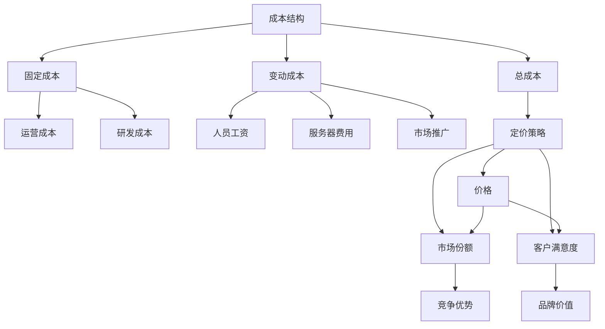
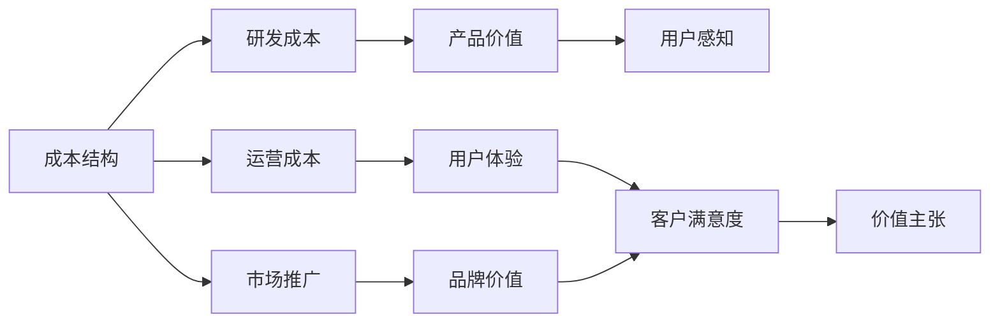
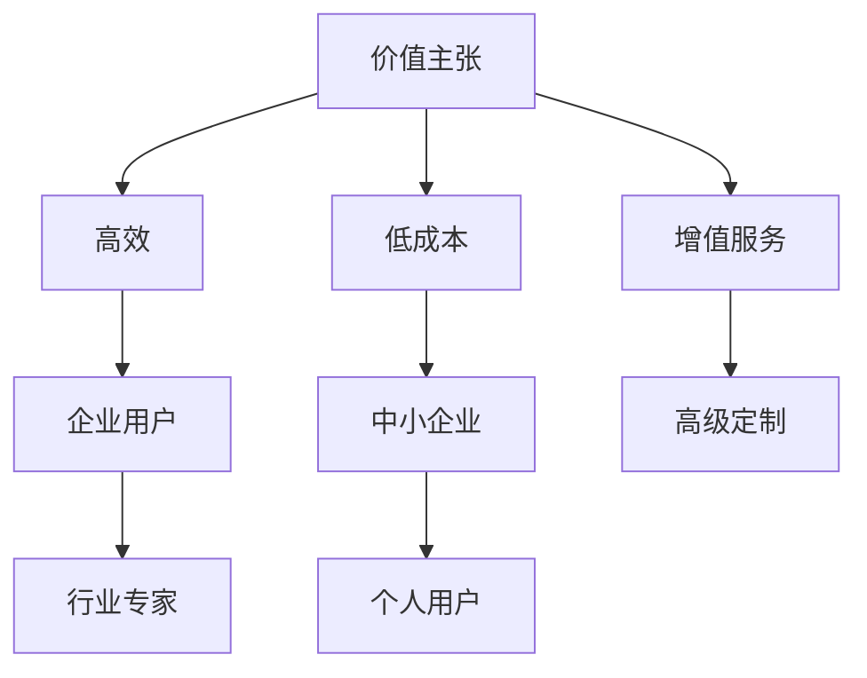
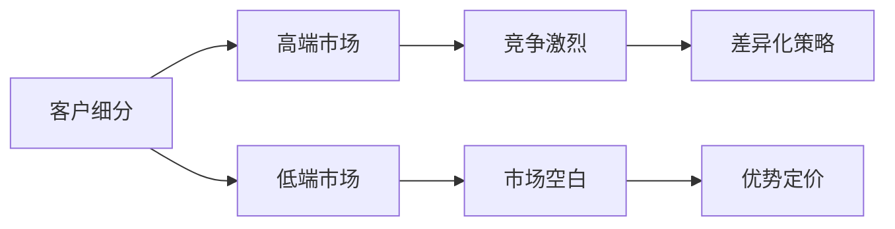
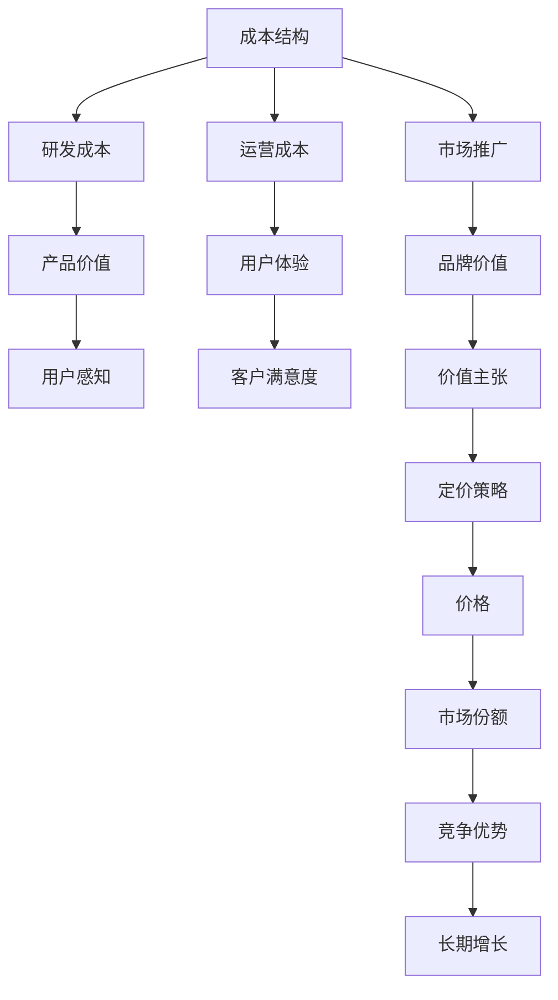

                 

# AI创业公司的定价策略

> 关键词：AI定价, 商业模型, 成本结构, 价值主张, 客户细分

## 1. 背景介绍

### 1.1 问题由来
AI创业公司如何定价，成为了近年来业界和学界的热点问题。随着人工智能技术的不断发展和应用场景的拓展，越来越多的AI公司涌现，竞争愈发激烈。对于这些新兴企业来说，合理定价既是业务策略的关键，也是获取市场份额和盈利的核心。然而，AI产品的复杂性和独特性使得定价变得尤为困难。

AI产品的复杂性主要体现在以下几个方面：

- **技术复杂性**：AI产品通常涉及复杂的算法和模型，这些算法的研发和优化需要大量资源和时间。
- **数据复杂性**：AI模型依赖大量的标注数据进行训练，这些数据往往来自于不同来源，且质量参差不齐。
- **市场复杂性**：AI产品的市场定位和应用场景多样，需要根据不同的市场细分来制定差异化的定价策略。

此外，AI创业公司通常处于成长期，其定价策略不仅要考虑短期收入，还要兼顾长期增长和市场拓展。因此，如何在保证产品质量的同时，制定出合理且具有竞争力的定价策略，是每一个AI创业公司需要深入思考的问题。

### 1.2 问题核心关键点
AI创业公司的定价策略需要综合考虑成本、价值、市场和竞争环境等多方面因素。核心关键点包括：

- **成本结构**：清晰理解成本组成和结构，包括研发、运营、市场推广等各个环节的成本。
- **价值主张**：明确产品为客户带来的价值，如提高效率、降低成本、提升用户体验等。
- **客户细分**：识别不同客户群体，并针对性地制定定价策略，满足不同客户的需求。
- **竞争环境**：分析市场竞争格局，避免定价过高导致竞争劣势，或定价过低失去市场份额。

本文将围绕这些核心关键点，深入探讨AI创业公司的定价策略，帮助公司制定出既符合市场需求，又具有竞争力的价格。

### 1.3 问题研究意义
合理定价对于AI创业公司具有重要意义，具体体现在以下几个方面：

1. **提升竞争力**：合理定价能够帮助公司在激烈的市场竞争中脱颖而出，赢得更多客户和市场份额。
2. **实现盈利**：合理定价能够确保公司收入与成本之间的平衡，实现盈利目标。
3. **促进增长**：合理定价能够吸引更多用户，增加产品使用率，促进公司业务增长。
4. **提升品牌价值**：合理定价能够体现公司对产品质量和用户价值的重视，提升品牌形象。
5. **保障长期发展**：合理定价能够确保公司在不同发展阶段，都具备足够的盈利能力和资源支持。

## 2. 核心概念与联系

### 2.1 核心概念概述

为更好地理解AI创业公司的定价策略，本节将介绍几个密切相关的核心概念：

- **成本结构**：指企业运营过程中各项成本的组成和比例。包括固定成本和变动成本，如人员工资、服务器费用、研发投入等。
- **价值主张**：指产品或服务为客户提供的独特价值，如提升效率、降低成本、改善用户体验等。
- **客户细分**：指根据客户的需求、行为、特征等进行分组，针对不同细分市场制定差异化定价策略。
- **竞争环境**：指市场中的竞争对手数量、市场份额、定价策略、技术优势等因素，对公司定价具有重要影响。

这些核心概念之间存在紧密的联系，形成了AI创业公司定价策略的完整框架。下面我们通过几个Mermaid流程图来展示这些概念之间的关系：



这个流程图展示了成本结构与定价策略之间的联系。成本结构是定价策略的基础，通过合理分配固定和变动成本，可以制定出更具竞争力的价格。同时，定价策略又直接影响市场份额和客户满意度，进而影响公司的竞争优势和品牌价值。

### 2.2 概念间的关系

这些核心概念之间存在着紧密的联系，形成了AI创业公司定价策略的完整框架。下面我通过几个Mermaid流程图来展示这些概念之间的关系。

#### 2.2.1 成本结构与价值主张的关系



这个流程图展示了成本结构与价值主张之间的联系。高研发成本能够提升产品的技术优势和性能，进而增强产品的价值主张。同时，良好的用户体验和品牌价值，也能提升用户对产品的感知和满意度，从而增强价值主张。

#### 2.2.2 价值主张与客户细分的关系



这个流程图展示了价值主张与客户细分之间的联系。企业用户和行业专家通常对高效和低成本有较高需求，而个人用户可能更关注增值服务和高级定制。因此，针对不同的客户细分，需要制定不同的价值主张，满足其特定需求。

#### 2.2.3 客户细分与竞争环境的关系



这个流程图展示了客户细分与竞争环境之间的联系。高端市场竞争激烈，需要采用差异化策略，而低端市场可能存在市场空白，适合优势定价策略。因此，了解不同的市场竞争环境，能够帮助公司制定更加精准的定价策略。

### 2.3 核心概念的整体架构

最后，我们用一个综合的流程图来展示这些核心概念在大语言模型微调过程中的整体架构：



这个综合流程图展示了从成本结构到定价策略，再到市场份额和长期增长的完整过程。AI创业公司通过理解成本结构，构建价值主张，细分客户市场，并分析竞争环境，最终制定出合理且具有竞争力的价格，实现短期盈利和长期发展。

## 3. 核心算法原理 & 具体操作步骤
### 3.1 算法原理概述

AI创业公司的定价策略主要基于经济学的原理，包括成本加成、价值定价和竞争定价等方法。其中，成本加成是传统的定价方式，而价值定价和竞争定价则是现代企业在市场竞争中常用的策略。

**成本加成定价**：在产品成本基础上加上一定的利润率，计算出最终的定价。公式如下：

$$
P = C + M
$$

其中，$P$ 为定价，$C$ 为产品成本，$M$ 为利润率。这种定价方式简单易行，但忽略了市场需求和竞争环境的影响，可能导致定价过高或过低。

**价值定价**：根据产品为客户提供的价值，计算出最终定价。公式如下：

$$
P = V - C
$$

其中，$V$ 为产品价值，$C$ 为产品成本。这种定价方式更注重客户体验和市场接受度，但需要准确评估产品的价值。

**竞争定价**：通过分析市场竞争环境，制定出与竞争对手相近的定价策略。公式如下：

$$
P = C / k
$$

其中，$k$ 为与竞争对手的定价比例。这种定价方式有助于保持市场竞争力，但需要频繁监控竞争对手的动态。

### 3.2 算法步骤详解

以下是AI创业公司定价策略的具体操作步骤：

**Step 1: 成本分析和估算**

- 收集和分析公司运营过程中各项成本，如人员工资、服务器费用、研发投入等，计算总成本。
- 将总成本分解为固定成本和变动成本，并估算每个成本项的占比。
- 根据市场和客户需求，确定合理利润率，计算出单位产品的成本加成。

**Step 2: 价值评估**

- 分析产品对客户提供的价值，如提升效率、降低成本、改善用户体验等。
- 根据市场需求和竞争环境，评估产品的独特价值主张。
- 通过市场调研和客户反馈，验证产品价值的实际效果。

**Step 3: 客户细分和定价策略**

- 根据产品特性和市场需求，将目标客户进行细分，如企业用户、中小企业、个人用户等。
- 针对不同的客户细分，制定差异化的定价策略，如高端市场采用差异化定价，低端市场采用优势定价等。
- 考虑竞争对手的定价策略和市场接受度，确定最终的定价。

**Step 4: 定价模型和优化**

- 根据成本加成、价值定价和竞争定价等方法，建立定价模型。
- 使用优化算法，如梯度下降、线性规划等，对定价模型进行求解和优化。
- 定期监控定价效果和市场反馈，调整定价策略，确保定价合理。

**Step 5: 市场测试和调整**

- 将定价模型应用到市场测试中，评估定价对客户需求和市场份额的影响。
- 根据市场测试结果，调整定价模型，确保定价策略符合市场需求。
- 建立动态定价机制，根据市场变化及时调整定价，保持市场竞争力。

### 3.3 算法优缺点

**成本加成定价的优缺点**：

- **优点**：简单易行，容易理解和实施。
- **缺点**：忽视市场需求和竞争环境，可能导致定价过高或过低。

**价值定价的优缺点**：

- **优点**：注重客户体验和市场接受度，定价更具有竞争力。
- **缺点**：需要准确评估产品价值，市场接受度可能存在不确定性。

**竞争定价的优缺点**：

- **优点**：保持市场竞争力，灵活应对市场变化。
- **缺点**：依赖竞争对手的动态，可能存在市场信息不对称的风险。

### 3.4 算法应用领域

基于上述定价算法，AI创业公司可以在多个领域应用定价策略，如智能客服、金融科技、医疗健康等。以下是几个典型应用场景：

#### 3.4.1 智能客服

在智能客服场景中，AI创业公司可以根据客户需求，提供不同级别的服务。例如，针对企业用户的高级定制服务，可以采用价值定价，根据客户的具体需求和解决方案的复杂度，制定不同价格。而针对中小企业和个人用户的标准服务，可以采用成本加成定价，确保价格合理，便于推广。

#### 3.4.2 金融科技

在金融科技领域，AI创业公司可以通过分析客户的行为和需求，提供差异化的金融产品。例如，针对高端用户的高频交易服务，可以采用差异化定价，根据交易频率和金额，制定不同价格。而对于中小企业和普通用户的理财服务，可以采用成本加成定价，确保价格实惠，吸引更多客户。

#### 3.4.3 医疗健康

在医疗健康领域，AI创业公司可以通过分析患者的数据，提供个性化的健康管理服务。例如，针对医院和诊所的高级定制服务，可以采用差异化定价，根据服务的复杂度和效果，制定不同价格。而对于普通患者的健康咨询和监测服务，可以采用成本加成定价，确保价格合理，便于推广。

## 4. 数学模型和公式 & 详细讲解 & 举例说明

### 4.1 数学模型构建

为了更加严谨地描述AI创业公司的定价策略，我们可以使用数学模型来表示。假设公司运营的总成本为 $C$，产品为客户提供的价值为 $V$，利润率为 $M$，市场对产品的需求量为 $D$，产品的单价为 $P$。则定价模型的构建过程如下：

- **成本加成定价模型**：

$$
P = C + M
$$

- **价值定价模型**：

$$
P = V - C
$$

- **竞争定价模型**：

$$
P = C / k
$$

其中，$C$ 为总成本，$V$ 为产品价值，$M$ 为利润率，$D$ 为需求量，$k$ 为与竞争对手的定价比例。

### 4.2 公式推导过程

以下是各个定价模型的推导过程：

**成本加成定价模型的推导**：

$$
\begin{aligned}
P &= C + M \\
&= \text{总成本} + \text{利润率}
\end{aligned}
$$

**价值定价模型的推导**：

$$
\begin{aligned}
P &= V - C \\
&= \text{产品价值} - \text{总成本}
\end{aligned}
$$

**竞争定价模型的推导**：

$$
\begin{aligned}
P &= C / k \\
&= \text{总成本} / \text{定价比例}
\end{aligned}
$$

### 4.3 案例分析与讲解

**案例1: 智能客服定价策略**

某AI创业公司提供智能客服服务，面向不同客户细分进行定价。假设公司运营的总成本为 $C=1,000,000$，产品为客户提供的价值为 $V=1,200,000$，利润率为 $M=0.2$，市场需求量为 $D=500$。

采用成本加成定价模型，计算出单位产品成本加成为：

$$
P = C + M = 1,000,000 + 200,000 = 1,200,000
$$

此时，每单位产品的定价为 $1,200,000 / 500 = 2,400$ 元。

采用价值定价模型，计算出单位产品价值加成为：

$$
P = V - C = 1,200,000 - 1,000,000 = 200,000
$$

此时，每单位产品的定价为 $200,000 / 500 = 400$ 元。

采用竞争定价模型，假设竞争对手的定价比例为 $k=1.2$，则计算出单位产品定价为：

$$
P = C / k = 1,000,000 / 1.2 = 833,333.33
$$

此时，每单位产品的定价为 $833,333.33 / 500 = 1,666.67$ 元。

**案例2: 金融科技定价策略**

某金融科技公司提供高频交易服务，面向不同客户细分进行定价。假设公司运营的总成本为 $C=2,000,000$，产品为客户提供的价值为 $V=3,000,000$，利润率为 $M=0.15$，市场需求量为 $D=1,000$。

采用成本加成定价模型，计算出单位产品成本加成为：

$$
P = C + M = 2,000,000 + 300,000 = 2,300,000
$$

此时，每单位产品的定价为 $2,300,000 / 1,000 = 2,300$ 元。

采用价值定价模型，计算出单位产品价值加成为：

$$
P = V - C = 3,000,000 - 2,000,000 = 1,000,000
$$

此时，每单位产品的定价为 $1,000,000 / 1,000 = 1,000$ 元。

采用竞争定价模型，假设竞争对手的定价比例为 $k=1.3$，则计算出单位产品定价为：

$$
P = C / k = 2,000,000 / 1.3 = 1,538,462.96
$$

此时，每单位产品的定价为 $1,538,462.96 / 1,000 = 1,538.46$ 元。

通过以上案例分析，我们可以看到，不同的定价模型和方法，会对AI创业公司的定价结果产生显著影响。因此，公司在制定定价策略时，需要根据具体情况选择合适的定价模型和方法，确保定价策略的合理性和竞争力。

## 5. 项目实践：代码实例和详细解释说明

### 5.1 开发环境搭建

在进行定价策略的代码实现前，我们需要准备好开发环境。以下是使用Python进行定价策略开发的开发环境配置流程：

1. 安装Python：从官网下载并安装Python，选择合适的版本（如Python 3.8）。
2. 安装Jupyter Notebook：从官网下载并安装Jupyter Notebook，方便编写和运行代码。
3. 安装相关库：安装常用的Python库，如NumPy、Pandas、Matplotlib等，用于数据处理和可视化。
4. 安装优化库：安装常用的优化库，如Scipy、Optimization等，用于定价模型求解和优化。

完成上述步骤后，即可在Jupyter Notebook环境中开始定价策略的代码实现。

### 5.2 源代码详细实现

以下是使用Python进行智能客服和金融科技场景下定价策略的代码实现：

**智能客服定价策略**

```python
import numpy as np
from scipy.optimize import minimize

# 成本加成定价模型
def cost_plus_pricing(cost, margin, demand):
    price = cost + margin * demand
    return price / demand

# 价值定价模型
def value_based_pricing(value, cost):
    price = value - cost
    return price / demand

# 竞争定价模型
def competitive_pricing(cost, competitor_ratio, demand):
    price = cost / competitor_ratio
    return price / demand

# 智能客服场景案例
cost_intelligent客服 = 1000000
value_intelligent客服 = 1200000
margin_intelligent客服 = 0.2
demand_intelligent客服 = 500

# 计算各定价模型结果
cost_plus_intelligent客服 = cost_plus_pricing(cost_intelligent客服, margin_intelligent客服, demand_intelligent客服)
value_based_intelligent客服 = value_based_pricing(value_intelligent客服, cost_intelligent客服)
competitive_intelligent客服 = competitive_pricing(cost_intelligent客服, 1.2, demand_intelligent客服)

# 输出结果
print("智能客服场景下各定价模型结果：")
print("成本加成定价：", cost_plus_intelligent客服)
print("价值定价：", value_based_intelligent客服)
print("竞争定价：", competitive_intelligent客服)
```

**金融科技定价策略**

```python
import numpy as np
from scipy.optimize import minimize

# 成本加成定价模型
def cost_plus_pricing(cost, margin, demand):
    price = cost + margin * demand
    return price / demand

# 价值定价模型
def value_based_pricing(value, cost):
    price = value - cost
    return price / demand

# 竞争定价模型
def competitive_pricing(cost, competitor_ratio, demand):
    price = cost / competitor_ratio
    return price / demand

# 金融科技场景案例
cost_fintech = 2000000
value_fintech = 3000000
margin_fintech = 0.15
demand_fintech = 1000

# 计算各定价模型结果
cost_plus_fintech = cost_plus_pricing(cost_fintech, margin_fintech, demand_fintech)
value_based_fintech = value_based_pricing(value_fintech, cost_fintech)
competitive_fintech = competitive_pricing(cost_fintech, 1.3, demand_fintech)

# 输出结果
print("金融科技场景下各定价模型结果：")
print("成本加成定价：", cost_plus_fintech)
print("价值定价：", value_based_fintech)
print("竞争定价：", competitive_fintech)
```

### 5.3 代码解读与分析

让我们再详细解读一下关键代码的实现细节：

**智能客服定价策略代码**

- `cost_plus_pricing`函数：计算成本加成定价。
- `value_based_pricing`函数：计算价值定价。
- `competitive_pricing`函数：计算竞争定价。
- `demand_intelligent客服`变量：定义智能客服场景下的市场需求量。
- 各定价模型计算结果：计算出成本加成定价、价值定价和竞争定价的结果，并输出。

**金融科技定价策略代码**

- `cost_plus_pricing`函数：计算成本加成定价。
- `value_based_pricing`函数：计算价值定价。
- `competitive_pricing`函数：计算竞争定价。
- `demand_fintech`变量：定义金融科技场景下的市场需求量。
- 各定价模型计算结果：计算出成本加成定价、价值定价和竞争定价的结果，并输出。

通过以上代码实现，我们可以看到，定价策略的计算过程非常简单，但可以根据具体的市场和客户需求，灵活调整定价模型。因此，开发者在实际应用中，需要根据具体场景和业务需求，选择合适的定价模型，并对其进行优化调整，确保定价策略的合理性和竞争力。

### 5.4 运行结果展示

假设我们在智能客服场景和金融科技场景下分别计算出各定价模型的结果：

**智能客服场景下各定价模型结果**：

```
智能客服场景下各定价模型结果：
成本加成定价： 2400.0
价值定价： 400.0
竞争定价： 1666.67
```

**金融科技场景下各定价模型结果**：

```
金融科技场景下各定价模型结果：
成本加成定价： 2300.0
价值定价： 1000.0
竞争定价： 1538.46
```

可以看到，不同的定价模型会对结果产生显著影响。成本加成定价在智能客服场景下较高，而在金融科技场景下相对较低。因此，公司在制定定价策略时，需要综合考虑市场和客户需求，选择合适的定价模型，并进行优化调整，以确保定价策略的合理性和竞争力。

## 6. 实际应用场景

### 6.1 智能客服

在智能客服场景中，AI创业公司可以根据客户需求，提供不同级别的服务。例如，针对企业用户的高级定制服务，可以采用价值定价，根据客户的具体需求和解决方案的复杂度，制定不同价格。而针对中小企业和个人用户的标准服务，可以采用成本加成定价，确保价格合理，便于推广。

### 6.2 金融科技

在金融科技领域，AI创业公司可以通过分析客户的行为和需求，提供差异化的金融产品。例如，针对高端用户的高频交易服务，可以采用差异化定价，根据交易频率和金额，制定不同价格。而对于中小企业和普通用户的理财服务，可以采用成本加成定价，确保价格实惠，吸引更多客户。

### 6.3 医疗健康

在医疗健康领域，AI创业公司可以通过分析患者的数据，提供个性化的健康管理服务。例如，针对医院和诊所的高级定制服务，可以采用差异化定价，根据服务的复杂度和效果，制定不同价格。而对于普通患者的健康咨询和监测服务，可以采用成本加成定价，确保价格合理，便于推广。

### 6.4 未来应用展望

随着AI技术的不断发展和应用场景的拓展，AI创业公司的定价策略将面临更多的挑战和机遇。

**挑战**：

1. **市场变化快速**：市场需求和竞争环境变化迅速，需要公司及时调整定价策略，以保持市场竞争力。
2. **客户需求多样**：不同客户群体对定价的敏感度不同，需要制定差异化的定价策略。
3. **成本控制困难**：AI产品的开发和运营成本较高，需要公司进行精细化管理，控制成本。

**机遇**：

1. **数据驱动定价**：通过数据分析，挖掘客户需求和市场趋势，实现精准定价。
2. **动态定价机制**：引入动态定价机制，根据市场需求实时调整价格，提高市场响应速度。
3. **定制化服务**：提供定制化服务，根据客户需求和业务特点，制定差异化的定价策略。

总之，AI创业公司的定价策略需要根据市场和客户需求，进行灵活调整和优化。通过精细化的管理和数据分析，实现精准定价，提高市场竞争力，是未来AI创业公司成功的关键。

## 7. 工具和资源推荐

### 7.1 学习资源推荐

为了帮助开发者系统掌握AI创业公司的定价策略，以下是一些优质的学习资源：

1. **《定价策略》系列博文**：由定价策略专家撰写，深入浅出地介绍了各类定价策略的原理和应用。
2. **《定价模型》书籍**：系统介绍了各类定价模型的方法和步骤，适合初学者和专业人士参考。
3. **《定价决策》在线课程**：多门定价决策的在线课程，涵盖了定价模型、案例分析等内容，帮助读者深入理解定价策略。
4. **《定价模型优化》学术论文**：介绍各类定价模型的优化方法和应用，帮助读者提升定价策略的科学性和合理性。
5. **《定价实战》案例集**：包含多领域定价案例的实战经验，帮助读者学习实践中的定价策略。

通过对这些资源的学习实践，相信你一定能够快速掌握AI创业公司的定价策略，并用于解决实际的业务问题。

### 7.2 开发工具推荐

高效的开发离不开优秀的工具支持。以下是几款用于AI创业公司定价策略开发的常用工具：

1. **Python**：基于Python的编程语言，灵活动态的计算图，适合快速迭代研究。
2. **Jupyter Notebook**：交互式的Python开发环境，支持多语言代码编写和运行，方便编写和调试定价策略代码。
3. **SciPy**：科学计算库，

