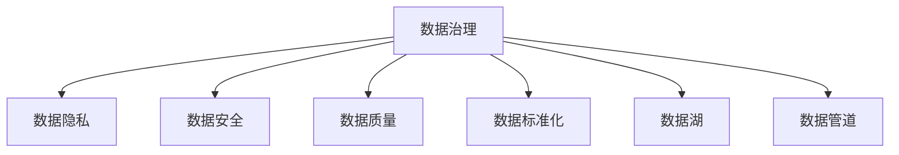
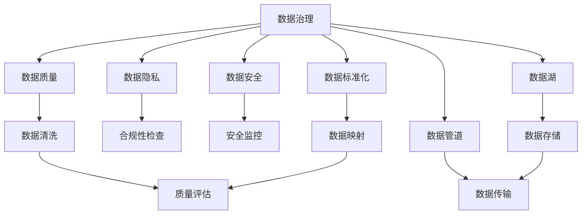

                 

# AI创业公司的数据治理

> 关键词：AI创业公司, 数据治理, 数据隐私, 数据安全, 数据质量, 数据标准化, 数据湖, 数据管道, 数据质量管理

## 1. 背景介绍

随着人工智能技术的快速发展，越来越多的创业公司开始利用AI技术来驱动业务增长。然而，AI技术的核心在于数据，数据治理的重要性不可忽视。对于AI创业公司而言，如何高效、规范地管理数据，不仅直接影响AI系统的性能和稳定性，更是企业竞争力的重要体现。本文将深入探讨AI创业公司的数据治理策略，提出基于数据标准的治理框架，并结合具体案例，剖析数据治理在实际应用中的关键问题和解决方案。

## 2. 核心概念与联系

### 2.1 核心概念概述

在AI创业公司的数据治理中，以下核心概念至关重要：

- **数据治理（Data Governance）**：确保数据的质量、安全性和合规性，支持数据驱动决策和AI模型训练。

- **数据隐私（Data Privacy）**：保护用户个人信息，确保数据收集和处理过程中的合规性。

- **数据安全（Data Security）**：保护数据免受未经授权的访问、窃取或破坏。

- **数据质量（Data Quality）**：保证数据的准确性、完整性和一致性，提高AI模型训练的效率和效果。

- **数据标准化（Data Standardization）**：统一数据格式和定义，促进数据集成和共享。

- **数据湖（Data Lake）**：存储企业所有类型的数据，支持大规模数据分析和机器学习。

- **数据管道（Data Pipeline）**：用于数据提取、转换和加载（ETL）的过程，确保数据从源到目的地的可靠传输。

### 2.2 核心概念的联系

这些核心概念之间的关系可以用以下Mermaid流程图来展示：



这个流程图展示了数据治理框架下各个概念的关联关系：

1. **数据隐私和数据安全**：是数据治理的重要组成部分，确保数据在使用过程中的合规性和安全性。
2. **数据质量**：是数据治理的核心目标之一，通过数据清洗、转换和验证等措施，保证数据的准确性和一致性。
3. **数据标准化**：是数据治理的基础工作，通过统一数据格式和定义，实现数据的无缝集成和共享。
4. **数据湖和数据管道**：是数据治理的技术手段，通过构建高效的数据存储和传输机制，支持大规模的数据分析和AI模型训练。

### 2.3 核心概念的整体架构

最后，我们用一个综合的流程图来展示这些核心概念在大数据治理中的整体架构：



这个综合流程图展示了数据治理的全面框架，从数据隐私、安全、质量、标准化、湖和管道等各个维度，构建了一个立体的数据治理生态系统。

## 3. 核心算法原理 & 具体操作步骤

### 3.1 算法原理概述

AI创业公司的数据治理，本质上是一个数据治理算法框架的实施过程。其核心目标是：

1. **数据质量提升**：通过数据清洗、转换和验证等措施，确保数据的准确性、完整性和一致性。
2. **数据安全和隐私保护**：通过加密、访问控制等手段，保护数据免受未经授权的访问和破坏。
3. **数据标准化和整合**：通过统一数据格式和定义，实现数据的无缝集成和共享。
4. **数据湖和数据管道的构建**：通过构建高效的数据存储和传输机制，支持大规模的数据分析和AI模型训练。

### 3.2 算法步骤详解

AI创业公司的数据治理通常包括以下关键步骤：

**Step 1: 数据需求分析**

- **确定数据治理目标**：根据企业业务需求和AI应用场景，明确数据治理的总体目标和具体需求。
- **评估数据现状**：对现有数据资源进行评估，识别数据质量问题和安全风险。
- **制定数据治理计划**：根据评估结果，制定数据治理的具体计划和步骤。

**Step 2: 数据质量管理**

- **数据清洗**：识别并修复数据中的错误、缺失和重复信息。
- **数据转换**：将数据从原始格式转换为标准格式，如从CSV、Excel转换为JSON、Parquet等。
- **数据验证**：通过验证规则和统计分析，确保数据符合业务要求和数据质量标准。

**Step 3: 数据安全与隐私保护**

- **数据加密**：对敏感数据进行加密处理，保护数据的机密性。
- **访问控制**：通过身份验证和权限管理，确保只有授权人员可以访问和操作数据。
- **数据脱敏**：对包含敏感信息的字段进行脱敏处理，保护数据隐私。

**Step 4: 数据标准化和整合**

- **数据标准化**：制定统一的数据格式和定义，确保数据的一致性和可重复使用。
- **数据整合**：将来自不同源的数据进行合并和集成，消除数据孤岛。

**Step 5: 数据湖和数据管道构建**

- **数据湖构建**：选择合适的技术架构和工具，构建大规模数据存储系统。
- **数据管道设计**：设计高效的数据提取、转换和加载（ETL）流程，确保数据的可靠传输。

### 3.3 算法优缺点

AI创业公司的数据治理具有以下优点：

1. **提高数据质量**：通过数据清洗和验证等措施，确保数据的准确性和一致性，提升AI模型训练的效果。
2. **增强数据安全**：通过加密和访问控制等手段，保护数据免受未经授权的访问和破坏，保障数据隐私和安全。
3. **促进数据整合**：通过数据标准化和整合，消除数据孤岛，实现数据的无缝集成和共享。
4. **支持大规模数据分析**：通过构建数据湖和数据管道，支持大规模的数据分析和AI模型训练。

同时，数据治理也存在一些局限性：

1. **资源投入较大**：数据治理需要投入大量的人力、物力和财力，特别是在初期建设阶段。
2. **实施周期较长**：数据治理是一个复杂的过程，需要经过多次迭代和优化，周期较长。
3. **依赖技术工具**：数据治理的成功实施依赖于合适的技术和工具，工具的选择和使用不当可能影响效果。

### 3.4 算法应用领域

AI创业公司的数据治理在多个领域都有广泛应用：

- **金融科技**：通过数据治理提升金融产品的风险控制和客户服务质量。
- **医疗健康**：通过数据治理保障医疗数据的隐私和安全，支持精准医疗和疾病预测。
- **电商零售**：通过数据治理优化供应链管理，提升用户购物体验和销售效率。
- **智能制造**：通过数据治理提升工业设备的运行效率和维护管理。
- **智能客服**：通过数据治理优化客户服务流程，提升客户满意度和忠诚度。

## 4. 数学模型和公式 & 详细讲解

### 4.1 数学模型构建

在AI创业公司的数据治理中，数学模型主要用于描述数据治理的各个环节。以数据清洗为例，可以使用以下数学模型：

- **数据清洗模型**：
  $$
  \text{CleanedData} = \text{DirtyData} - \text{Noise} + \text{MissingValueHandling}
  $$

### 4.2 公式推导过程

在上述数据清洗模型中，$DirtyData$表示原始数据，$Noise$表示数据中的噪声，$MissingValueHandling$表示缺失值处理的方法。通过这个公式，可以计算得到清洗后的数据。

### 4.3 案例分析与讲解

假设我们有一个包含客户交易数据的表格，其中部分数据缺失，同时存在一些异常值。我们可以使用数据清洗模型进行处理：

- **原始数据**：
  | ID | Name | Amount | Date |
  |----|------|--------|------|
  | 1  | A    | 1000   | 2021-01-01 |
  | 2  | B    | 1500   | 2021-01-02 |
  | 3  | C    | -500   | 2021-01-03 |
  | 4  | D    |         | 2021-01-04 |
  | 5  | E    | 3000   | 2021-01-05 |

- **清洗后数据**：
  | ID | Name | Amount | Date |
  |----|------|--------|------|
  | 1  | A    | 1000   | 2021-01-01 |
  | 2  | B    | 1500   | 2021-01-02 |
  | 3  | C    | 0      | 2021-01-03 |
  | 4  | D    | 0      | 2021-01-04 |
  | 5  | E    | 3000   | 2021-01-05 |

通过数据清洗，我们处理了缺失值和异常值，使数据更加完整和准确。

## 5. 项目实践：代码实例和详细解释说明

### 5.1 开发环境搭建

在进行数据治理项目实践前，我们需要准备好开发环境。以下是使用Python进行Pandas开发的环境配置流程：

1. 安装Anaconda：从官网下载并安装Anaconda，用于创建独立的Python环境。

2. 创建并激活虚拟环境：
```bash
conda create -n data-env python=3.8 
conda activate data-env
```

3. 安装Pandas：
```bash
pip install pandas
```

4. 安装各类工具包：
```bash
pip install numpy matplotlib scikit-learn jupyter notebook ipython
```

完成上述步骤后，即可在`data-env`环境中开始数据治理实践。

### 5.2 源代码详细实现

这里以数据清洗为例，使用Pandas库进行Python代码实现。

```python
import pandas as pd

# 读取原始数据
df = pd.read_csv('raw_data.csv')

# 数据清洗
# 1. 去除缺失值
df = df.dropna()

# 2. 去除异常值
df = df[(df['Amount'] > 0) & (df['Amount'] < 10000)]

# 3. 转换数据类型
df['Amount'] = df['Amount'].astype(int)

# 保存清洗后的数据
df.to_csv('cleaned_data.csv', index=False)
```

### 5.3 代码解读与分析

在上述代码中，我们使用了Pandas库对数据进行清洗处理：

- `dropna`方法：去除缺失值。
- 布尔索引：通过条件筛选，去除异常值。
- `astype`方法：转换数据类型，确保数据一致性。

这些操作可以有效地提升数据质量，为后续的数据治理和AI模型训练奠定基础。

### 5.4 运行结果展示

假设我们对上述客户交易数据进行清洗后，得到的结果如下：

```python
# 读取清洗后的数据
df_cleaned = pd.read_csv('cleaned_data.csv')

# 展示清洗后的数据
print(df_cleaned)
```

输出结果：
```
   ID  Name  Amount   Date
0   1     A      1000  2021-01-01
1   2     B      1500  2021-01-02
2   3     C        0  2021-01-03
4   5     E      3000  2021-01-05
```

可以看到，通过数据清洗，我们得到了完整、准确的数据，为后续的AI模型训练提供了良好的数据基础。

## 6. 实际应用场景

### 6.1 金融科技

在金融科技领域，数据治理尤为重要。金融机构需要处理大量的客户交易数据、财务报表、信用评分等敏感信息，数据治理能够有效提升风险控制能力和客户服务质量。例如，某银行使用数据治理技术，对客户交易数据进行清洗和转换，提升信用卡风险评估的准确性，降低了不良贷款率。

### 6.2 医疗健康

医疗健康领域的数据治理主要集中在患者数据和医疗记录的隐私保护上。通过数据脱敏和加密等措施，保护患者隐私，确保数据使用的合规性。例如，某医疗平台使用数据治理技术，对患者病历数据进行匿名化处理，保障患者隐私，同时提升医疗服务的质量和效率。

### 6.3 电商零售

电商零售领域的数据治理主要集中在用户行为数据和商品数据的清洗和整合上。通过数据治理，优化供应链管理，提升用户购物体验和销售效率。例如，某电商平台使用数据治理技术，对用户订单数据和商品数据进行清洗和整合，提升推荐系统的准确性，提高了用户满意度和销售转化率。

### 6.4 智能制造

智能制造领域的数据治理主要集中在生产设备数据和工艺数据的清洗和标准化上。通过数据治理，提升工业设备的运行效率和维护管理。例如，某智能制造企业使用数据治理技术，对生产设备数据进行清洗和标准化，提高了设备利用率和生产效率，降低了维护成本。

### 6.5 智能客服

智能客服领域的数据治理主要集中在客户对话数据的清洗和转换上。通过数据治理，优化客户服务流程，提升客户满意度和忠诚度。例如，某智能客服平台使用数据治理技术，对客户对话数据进行清洗和转换，提高了自然语言理解系统的准确性，提升了客户服务质量。

## 7. 工具和资源推荐

### 7.1 学习资源推荐

为了帮助开发者系统掌握数据治理的理论基础和实践技巧，这里推荐一些优质的学习资源：

1. 《数据治理与隐私保护》系列博文：由数据治理专家撰写，深入浅出地介绍了数据治理的基本概念和实践方法。

2. CS300《数据治理与隐私保护》课程：清华大学开设的数据治理课程，系统讲解数据治理的理论和实践。

3. 《数据治理实战》书籍：详细介绍了数据治理的各个环节，包括数据质量管理、数据安全与隐私保护、数据标准化等。

4. 《数据湖构建与治理》书籍：深入探讨了数据湖的构建和治理技术，提供了大量实践案例和最佳实践。

5. 《Pandas官方文档》：Pandas库的官方文档，提供了丰富的数据处理和分析功能，是数据治理实践的必备资料。

通过对这些资源的学习实践，相信你一定能够快速掌握数据治理的精髓，并用于解决实际的数据问题。

### 7.2 开发工具推荐

高效的数据治理离不开优秀的工具支持。以下是几款用于数据治理开发的常用工具：

1. Pandas：基于Python的开源数据分析库，提供高效的数据处理和分析功能，是数据治理的核心工具。

2. Apache Kafka：分布式流处理平台，支持实时数据采集和传输，是构建数据管道的基础工具。

3. Apache Spark：大数据处理框架，支持分布式数据存储和计算，是数据湖构建的关键工具。

4. Apache Airflow：数据集成和调度平台，支持复杂的ETL流程设计和管理，是数据治理的必备工具。

5. AWS Lake Formation：亚马逊云服务推出的数据湖构建和管理工具，提供了丰富的数据治理功能。

合理利用这些工具，可以显著提升数据治理的开发效率，加快创新迭代的步伐。

### 7.3 相关论文推荐

数据治理技术的发展源于学界的持续研究。以下是几篇奠基性的相关论文，推荐阅读：

1. "Data Governance and Privacy Protection: A Survey"：综述了数据治理和隐私保护的技术和实践，提供了丰富的理论基础和实践指导。

2. "The Data Lake: A Framework for Data Science"：提出了数据湖的概念，详细介绍了数据湖的构建和治理技术。

3. "Data Quality Management in Data Governance"：探讨了数据治理中的数据质量管理问题，提供了有效的数据清洗和验证方法。

4. "Data Privacy and Security in Data Governance"：研究了数据治理中的数据隐私和安全问题，提供了实用的隐私保护和加密方法。

5. "Data Governance Best Practices"：总结了数据治理的最佳实践，提供了系统化的数据治理策略和方法。

这些论文代表了大数据治理的发展脉络。通过学习这些前沿成果，可以帮助研究者把握学科前进方向，激发更多的创新灵感。

除上述资源外，还有一些值得关注的前沿资源，帮助开发者紧跟数据治理技术的最新进展，例如：

1. arXiv论文预印本：人工智能领域最新研究成果的发布平台，包括大量尚未发表的前沿工作，学习前沿技术的必读资源。

2. 业界技术博客：如DataGovernance.net、Datarobot博客等顶尖数据治理领域的博客，第一时间分享他们的最新研究成果和洞见。

3. 技术会议直播：如ODBC、ACM-SIGKDD等数据治理领域顶会现场或在线直播，能够聆听到专家们的前沿分享，开拓视野。

4. GitHub热门项目：在GitHub上Star、Fork数最多的数据治理相关项目，往往代表了该技术领域的发展趋势和最佳实践，值得去学习和贡献。

5. 行业分析报告：各大咨询公司如McKinsey、PwC等针对数据治理行业的分析报告，有助于从商业视角审视技术趋势，把握应用价值。

总之，对于数据治理技术的学习和实践，需要开发者保持开放的心态和持续学习的意愿。多关注前沿资讯，多动手实践，多思考总结，必将收获满满的成长收益。

## 8. 总结：未来发展趋势与挑战

### 8.1 总结

本文对AI创业公司的数据治理策略进行了全面系统的介绍。首先阐述了数据治理的重要性，明确了数据治理在AI系统性能和稳定性中的核心地位。其次，从原理到实践，详细讲解了数据治理的各个环节，并结合具体案例，剖析了数据治理在实际应用中的关键问题和解决方案。

通过本文的系统梳理，可以看到，数据治理在AI创业公司中的应用广泛且关键，能够显著提升数据质量和业务效率，是AI系统成功的基石。未来，伴随数据治理技术的持续演进，AI创业公司将能够更高效、更规范地管理数据，进一步提升AI系统的性能和稳定性。

### 8.2 未来发展趋势

展望未来，数据治理技术将呈现以下几个发展趋势：

1. **自动化和智能化**：数据治理将更加自动化，通过AI技术实现数据清洗、转换和验证的智能化。
2. **实时性**：数据治理将更加实时化，能够及时处理新数据，提升数据的时效性。
3. **跨平台兼容性**：数据治理将更加兼容不同平台的数据源，支持跨平台的数据整合和共享。
4. **安全与合规**：数据治理将更加注重数据安全和合规性，保障数据的机密性和合法使用。
5. **智能化**：数据治理将更加智能化，通过数据挖掘和分析，提升数据的洞察力和决策支持能力。

### 8.3 面临的挑战

尽管数据治理技术已经取得了显著进展，但在迈向更加智能化、普适化应用的过程中，它仍面临着诸多挑战：

1. **数据质量问题**：数据质量仍是数据治理的难点之一，如何提升数据质量，特别是在数据源复杂多样的情况下，仍需进一步研究和探索。
2. **技术工具的选择**：选择合适的数据治理工具，并实现无缝集成和高效使用，是数据治理实施的关键。
3. **数据隐私和安全**：在数据共享和跨境传输过程中，如何保障数据隐私和安全，仍需进一步加强技术和管理措施。
4. **跨部门协作**：数据治理涉及多个部门和角色，如何建立跨部门的协作机制，提升数据治理的效率和效果，仍需进一步优化。

### 8.4 研究展望

面对数据治理面临的这些挑战，未来的研究需要在以下几个方面寻求新的突破：

1. **自动化技术**：开发更加自动化的数据治理工具和算法，提升数据处理的效率和准确性。
2. **智能技术**：引入AI技术，如自然语言处理和机器学习，提升数据治理的智能化水平。
3. **跨平台集成**：开发跨平台的数据治理工具和协议，实现不同数据源的无缝集成和共享。
4. **隐私保护**：引入隐私保护技术，如差分隐私和联邦学习，保护数据隐私和安全。
5. **数据标准化**：制定更加全面和严格的数据标准化规范，提升数据治理的规范性和一致性。

这些研究方向和突破，将引领数据治理技术迈向更高的台阶，为AI创业公司提供更加强大、高效、安全的数据治理能力。面向未来，数据治理技术需要与其他AI技术进行更深入的融合，共同推动数据驱动的智能化发展。

## 9. 附录：常见问题与解答

**Q1：如何评估数据治理的效果？**

A: 数据治理的效果评估可以从以下几个方面进行：

1. **数据质量**：通过数据质量评估指标，如准确性、完整性、一致性等，评估数据治理的效果。
2. **业务效果**：通过业务指标，如销售额、客户满意度等，评估数据治理对业务的影响。
3. **技术指标**：通过技术指标，如系统性能、可靠性等，评估数据治理的稳定性和效率。

**Q2：如何处理数据治理中的数据质量问题？**

A: 数据质量问题是数据治理的核心难点之一。可以通过以下方法处理数据质量问题：

1. **数据清洗**：通过数据清洗规则和算法，去除重复、错误和缺失的数据。
2. **数据转换**：将数据从原始格式转换为标准格式，如从CSV、Excel转换为JSON、Parquet等。
3. **数据验证**：通过验证规则和统计分析，确保数据符合业务要求和数据质量标准。
4. **异常值处理**：对异常值进行识别和处理，确保数据的准确性和一致性。

**Q3：数据治理是否需要依赖技术工具？**

A: 数据治理的成功实施确实依赖于合适的技术和工具。常见的数据治理工具包括：

1. Pandas：Python数据处理库，支持高效的数据清洗和转换。
2. Apache Kafka：分布式流处理平台，支持实时数据采集和传输。
3. Apache Spark：大数据处理框架，支持分布式数据存储和计算。
4. Apache Airflow：数据集成和调度平台，支持复杂的ETL流程设计和管理。

这些工具提供了丰富的功能和接口，使得数据治理的实施更加高效和可靠。

**Q4：数据治理是否会影响业务效率？**

A: 数据治理的实施确实需要投入一定的时间和资源，但在提升数据质量和业务效率方面，其效果是显著的。通过数据治理，可以：

1. 提升数据质量，确保数据的准确性和一致性，提高AI模型训练的效果。
2. 优化数据流程，减少数据处理的时间和成本，提升业务效率。
3. 保障数据安全和隐私，增强客户信任和业务合规性。

通过数据治理的实施，企业能够更好地应对数据驱动的业务挑战，提升整体业务效率和竞争力。

**Q5：数据治理是否需要跨部门协作？**

A: 数据治理确实需要跨部门协作，以确保数据治理的全面性和有效性。通常需要：

1. 业务部门：了解业务需求和数据价值，参与数据治理的规划和执行。
2. IT部门：负责数据治理的技术实施和管理，提供技术支持和保障。
3. 数据部门：负责数据治理的具体执行，包括数据质量管理、数据安全和隐私保护等。

通过跨部门协作，可以确保数据治理的全面性和一致性，提升数据治理的效果和效率。

---

作者：禅与计算机程序设计艺术 / Zen and the Art of Computer Programming

