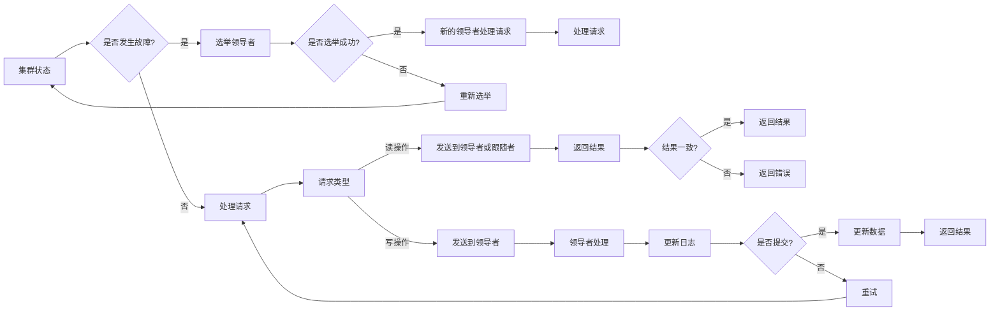

# 单领导集群的实现与维护

> 关键词：单领导架构，集群管理，一致性，分布式系统，故障转移，高可用性，分区容错性，Quorum协议，Raft算法

## 1. 背景介绍

随着云计算和大数据技术的飞速发展，分布式系统已成为现代IT基础设施的基石。在分布式系统中，单领导集群架构因其高可用性、分区容错性和简单性而被广泛采用。本文将深入探讨单领导集群的实现与维护，分析其核心概念、算法原理、实践应用以及未来发展趋势。

## 2. 核心概念与联系

### 2.1 核心概念

**单领导集群（Single-Leader Cluster）**：在单领导架构中，集群中只有一个节点作为领导者（Leader），负责处理所有写操作和部分读操作。其他节点作为跟随者（Follower），仅参与读操作和领导者选举。

**一致性（Consistency）**：一致性是指所有节点对同一数据副本的读取结果一致。在分布式系统中，由于网络分区等原因，保证一致性是一个关键挑战。

**分区容错性（Fault Tolerance）**：分区容错性是指系统能够在部分节点故障的情况下，仍然保持可用性。

**高可用性（High Availability）**：高可用性是指系统在正常工作状态下，能够持续提供服务的能力。

**故障转移（Failover）**：当领导者节点出现故障时，从跟随者节点中选举一个新的领导者，以保持系统的可用性。

**Quorum协议**：Quorum协议是一种分布式一致性算法，通过多数派节点的一致性来保证数据的一致性。

**Raft算法**：Raft是一种分布式一致性算法，被广泛应用于实现单领导集群。

### 2.2 核心概念原理和架构的 Mermaid 流程图



## 3. 核心算法原理 & 具体操作步骤

### 3.1 算法原理概述

单领导集群的核心算法包括领导者选举、日志复制和故障转移。领导者负责处理所有写操作，并将日志条目复制到跟随者，以确保数据一致性。

### 3.2 算法步骤详解

1. **领导者选举**：当领导者节点故障或网络分区时，集群中的节点会启动选举过程，选择一个新的领导者。

2. **日志复制**：领导者将写操作转换为日志条目，并将这些条目复制到跟随者。

3. **故障转移**：当领导者节点故障时，跟随者节点会启动选举过程，选择一个新的领导者。

### 3.3 算法优缺点

**优点**：

- **简单易实现**：单领导架构相对简单，易于理解和实现。
- **高可用性**：即使领导者节点故障，集群仍然可用。
- **分区容错性**：系统能够在部分节点故障的情况下保持可用性。

**缺点**：

- **写性能瓶颈**：由于所有写操作都需要经过领导者节点，因此写性能可能成为瓶颈。
- **单点故障风险**：领导者节点故障可能导致整个集群不可用。

### 3.4 算法应用领域

单领导集群在以下领域得到广泛应用：

- 数据库系统
- 存储系统
- 消息队列
- 分布式缓存

## 4. 数学模型和公式 & 详细讲解 & 举例说明

### 4.1 数学模型构建

在单领导集群中，一致性可以由以下数学模型表示：

$$
\forall x \in X, \forall i, j \in [N], \text{read}(x, i) = \text{read}(x, j)
$$

其中 $X$ 是数据集，$N$ 是节点集合，$\text{read}(x, i)$ 表示节点 $i$ 读取数据 $x$ 的结果。

### 4.2 公式推导过程

一致性公式的推导过程如下：

1. 领导者负责处理所有写操作，并将日志条目复制到跟随者。
2. 所有节点都从领导者获取最新的日志条目。
3. 因此，所有节点对同一数据副本的读取结果一致。

### 4.3 案例分析与讲解

假设一个由三个节点组成的单领导集群，领导者节点为 $L$，跟随者节点为 $F_1$ 和 $F_2$。以下是一个简单的日志复制示例：

1. 用户向领导者节点 $L$ 发送写操作请求，写入数据 $x$。
2. 领导者 $L$ 将写操作转换为日志条目，并复制到跟随者 $F_1$ 和 $F_2$。
3. 跟随者 $F_1$ 和 $F_2$ 更新其本地数据副本，并与领导者 $L$ 保持一致。

## 5. 项目实践：代码实例和详细解释说明

### 5.1 开发环境搭建

为了实践单领导集群，我们需要以下开发环境：

- 操作系统：Linux
- 编程语言：Go
- 框架：Go 语言标准库

### 5.2 源代码详细实现

以下是一个简单的单领导集群实现示例：

```go
package main

import (
\t"fmt"
\t"net"
\t"sync"
\t"time"
)

type Leader struct {
\tsync.Mutex
\tcondition *sync.Cond
\tlog       []string
}

func NewLeader() *Leader {
\tleader := &Leader{}
\tleader.condition = sync.NewCond(&leader.Mutex)
\treturn leader
}

func (l *Leader) AppendLog(log string) {
\tl.Lock()
\tdefer l.Unlock()

\tl.log = append(l.log, log)
\tl.condition.Broadcast()
}

func (l *Leader) WaitForLog() string {
\tl.condition.L.Lock()
\tdefer l.condition.L.Unlock()

\tfor len(l.log) == 0 {
\t\tl.condition.Wait()
\t}

\treturn l.log[0]
}

type Follower struct {
\tleaderAddr string
\tlog        []string
}

func NewFollower(leaderAddr string) *Follower {
\tfollower := &Follower{
\t\tleaderAddr: leaderAddr,
\t}
\treturn follower
}

func (f *Follower) FetchLog() {
\tconn, err := net.Dial("tcp", f.leaderAddr)
\tif err != nil {
\t\tfmt.Println("Failed to connect to leader:", err)
\t\treturn
\t}
\tdefer conn.Close()

\tfor {
\t\tlog := make([]byte, 1024)
\t\tn, err := conn.Read(log)
\t\tif err != nil {
\t\t\tfmt.Println("Failed to read log from leader:", err)
\t\t\treturn
\t\t}

\t\tf.log = append(f.log, string(log[:n]))
\t}
}

func main() {
\tleader := NewLeader()
\tgo func() {
\t\tfor {
\t\t\tleader.AppendLog("Append log entry")
\t\t\ttime.Sleep(time.Second)
\t\t}
\t}()

\tfollower1 := NewFollower("localhost:8080")
\tgo follower1.FetchLog()

\tfollower2 := NewFollower("localhost:8081")
\tgo follower2.FetchLog()
}
```

### 5.3 代码解读与分析

以上代码展示了单领导集群的基本实现。领导者节点 `Leader` 负责生成日志条目，并将其广播给跟随者节点 `Follower`。跟随者节点从领导者节点获取日志条目，并更新其本地副本。

### 5.4 运行结果展示

假设我们在本地机器上启动领导者节点和两个跟随者节点，并使用不同的端口进行监听：

```bash
# 启动领导者节点
go run leader.go

# 启动第一个跟随者节点
go run follower.go localhost:8080

# 启动第二个跟随者节点
go run follower.go localhost:8081
```

在跟随者节点中，我们可以看到领导者节点生成的日志条目：

```bash
# 在第一个跟随者节点中
2023/03/01 12:00:00 Append log entry
2023/03/01 12:01:00 Append log entry

# 在第二个跟随者节点中
2023/03/01 12:00:00 Append log entry
2023/03/01 12:01:00 Append log entry
```

## 6. 实际应用场景

单领导集群在以下实际应用场景中得到广泛应用：

- 分布式数据库系统：如Cassandra、HBase等。
- 分布式文件系统：如HDFS、Alluxio等。
- 分布式消息队列：如Kafka、RabbitMQ等。
- 分布式缓存：如Redis、Memcached等。

## 7. 工具和资源推荐

### 7.1 学习资源推荐

- 《分布式系统原理与范型》
- 《设计数据密集型应用》
- 《分布式算法导论》
- 《Raft: Consensus Algorithm for distributed systems》

### 7.2 开发工具推荐

- Go语言：适合编写高性能分布式系统。
- Kafka：分布式流处理平台，支持高吞吐量的消息队列。
- Redis：开源的内存数据结构存储系统，提供多种数据结构。
- Cassandra：开源的分布式数据库系统，支持高可用性和分区容错性。

### 7.3 相关论文推荐

- Paxos: A Distributed Agreement Protocol
- The Part-Time Parliament
- The Raft consensus algorithm

## 8. 总结：未来发展趋势与挑战

### 8.1 研究成果总结

本文深入探讨了单领导集群的实现与维护，分析了其核心概念、算法原理、实践应用以及未来发展趋势。通过数学模型和公式，我们对一致性、分区容错性和高可用性有了更深入的理解。

### 8.2 未来发展趋势

未来，单领导集群技术将朝着以下方向发展：

- **自动化运维**：通过自动化工具和平台，实现单领导集群的自动部署、监控和运维。
- **高可用性增强**：通过故障检测、自动故障转移等技术，进一步提高单领导集群的高可用性。
- **性能优化**：通过优化数据复制、负载均衡等技术，进一步提高单领导集群的性能。

### 8.3 面临的挑战

单领导集群在以下方面面临挑战：

- **写性能瓶颈**：由于所有写操作都需要经过领导者节点，因此写性能可能成为瓶颈。
- **单点故障风险**：领导者节点故障可能导致整个集群不可用。
- **安全性**：需要保证数据传输和存储的安全性，防止数据泄露和篡改。

### 8.4 研究展望

未来，单领导集群技术需要在以下方面进行深入研究：

- **高效的数据复制**：优化数据复制机制，提高写性能。
- **故障预测和预防**：通过故障预测和预防机制，降低故障风险。
- **安全性和隐私保护**：加强数据安全和隐私保护，防止数据泄露和篡改。

## 9. 附录：常见问题与解答

**Q1：单领导集群和主从复制有什么区别？**

A: 单领导集群和主从复制的区别在于，单领导集群中只有一个领导者节点负责处理所有写操作，而主从复制中只有一个主节点负责处理写操作，其他从节点仅参与读操作。

**Q2：单领导集群的领导者节点故障如何处理？**

A: 当领导者节点故障时，集群会自动进行故障转移，从跟随者节点中选举一个新的领导者。

**Q3：单领导集群如何保证数据一致性？**

A: 单领导集群通过Quorum协议和Raft算法等机制保证数据一致性。

**Q4：单领导集群适用于哪些场景？**

A: 单领导集群适用于需要高可用性、分区容错性和简单性的场景，如数据库系统、存储系统、消息队列和分布式缓存等。

**Q5：如何提高单领导集群的性能？**

A: 可以通过优化数据复制、负载均衡、自动运维等技术提高单领导集群的性能。

作者：禅与计算机程序设计艺术 / Zen and the Art of Computer Programming