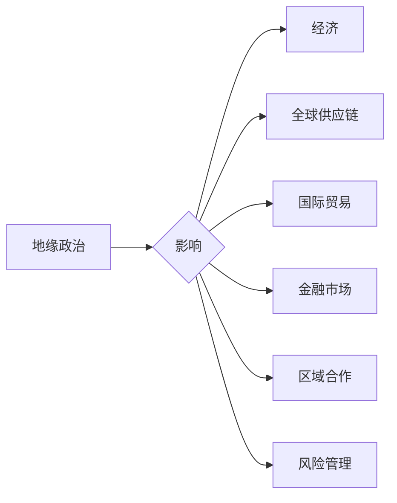

# 地缘冲突加剧的经济影响

> 关键词：地缘政治，经济影响，全球供应链，国际贸易，金融市场，区域合作，风险管理

## 1. 背景介绍

随着世界政治经济格局的不断变化，地缘冲突在全球范围内日益加剧。这些冲突不仅影响着国际关系，也对全球经济产生了深远的影响。本文将探讨地缘冲突加剧带来的主要经济影响，并分析其背后的机制。

### 1.1 地缘冲突的定义

地缘冲突是指由于领土、资源、意识形态、政治制度等因素，不同国家和地区之间发生的对抗和冲突。这些冲突可能表现为战争、制裁、贸易争端等形式。

### 1.2 地缘冲突的加剧

近年来，地缘冲突的加剧主要表现在以下几个方面：

- 领土争端：如南海争端、克里米亚危机等。
- 资源竞争：如中东地区的石油资源争夺。
- 意识形态对立：如中美贸易摩擦。
- 政治制度差异：如俄罗斯与西方国家的对抗。

### 1.3 地缘冲突对经济的影响

地缘冲突对经济的影响是多方面的，包括：

- 全球供应链中断
- 国际贸易受阻
- 金融市场波动
- 区域合作受阻
- 投资信心下降

## 2. 核心概念与联系

### 2.1 地缘政治与经济

地缘政治是指国家在国际关系中的地位、作用以及相互之间的关系。经济则是国家发展的基础，是国家力量和影响力的重要体现。地缘政治与经济相互影响，相互制约。

### 2.2 全球供应链

全球供应链是指在全球范围内，将原材料、零部件、产品和服务等不同环节有机连接起来的复杂网络。地缘冲突可能破坏全球供应链，导致生产成本上升、产品供应不足。

### 2.3 国际贸易

国际贸易是指不同国家和地区之间的商品和服务的交换。地缘冲突可能引发贸易摩擦，导致贸易壁垒上升、贸易规模下降。

### 2.4 金融市场

金融市场是指资金、证券、外汇等金融工具的买卖和交易场所。地缘冲突可能引发金融市场波动，导致资产价格下跌、货币汇率波动。

### 2.5 区域合作

区域合作是指相邻或相近国家为了共同利益而进行的合作。地缘冲突可能破坏区域合作，导致地区经济一体化进程受阻。

### 2.6 风险管理

风险管理是指识别、评估、处理和监控风险的过程。地缘冲突加剧要求企业和个人加强风险管理，以降低地缘冲突带来的经济损失。



## 3. 核心算法原理 & 具体操作步骤

### 3.1 算法原理概述

地缘冲突对经济影响的评估和预测需要综合考虑多种因素，包括政治、经济、社会等多方面信息。常见的算法原理包括：

- 指标体系构建：根据地缘冲突的特点，构建反映地缘冲突经济影响的指标体系。
- 数据收集和处理：收集相关数据，并进行清洗、处理和整合。
- 模型选择：选择合适的模型进行地缘冲突经济影响的预测和评估。
- 结果分析：分析预测和评估结果，为决策提供依据。

### 3.2 算法步骤详解

1. **构建指标体系**：根据地缘冲突的特点，构建反映地缘冲突经济影响的指标体系，如政治稳定性、贸易壁垒、金融市场波动等。
2. **数据收集和处理**：收集相关数据，包括地缘冲突事件、经济指标、政策法规等，并进行清洗、处理和整合。
3. **模型选择**：选择合适的模型进行地缘冲突经济影响的预测和评估，如线性回归、支持向量机、神经网络等。
4. **模型训练和验证**：使用历史数据对模型进行训练和验证，评估模型的准确性和可靠性。
5. **预测和评估**：使用模型对地缘冲突经济影响进行预测和评估，为决策提供依据。

### 3.3 算法优缺点

- **优点**：能够综合考虑多种因素，对地缘冲突经济影响进行量化评估，为决策提供科学依据。
- **缺点**：需要收集大量数据，模型选择和训练需要一定的专业知识和经验。

### 3.4 算法应用领域

- **地缘冲突风险评估**：对潜在的或正在发生的地缘冲突进行风险评估，为政府和企业提供决策依据。
- **国际贸易分析**：分析地缘冲突对国际贸易的影响，为贸易政策制定提供参考。
- **金融市场预测**：预测地缘冲突对金融市场的影响，为金融机构提供投资建议。

## 4. 数学模型和公式 & 详细讲解 & 举例说明

### 4.1 数学模型构建

地缘冲突对经济影响的数学模型可以采用线性回归模型：

$$
y = \beta_0 + \beta_1 x_1 + \beta_2 x_2 + \cdots + \beta_n x_n + \epsilon
$$

其中，$y$ 为因变量，表示地缘冲突对经济的影响；$x_1, x_2, \cdots, x_n$ 为自变量，表示反映地缘冲突的各个指标；$\beta_0, \beta_1, \cdots, \beta_n$ 为模型参数；$\epsilon$ 为误差项。

### 4.2 公式推导过程

线性回归模型的推导过程如下：

1. **最小二乘法**：最小化误差平方和：
   $$
   S = \sum_{i=1}^n (y_i - \hat{y}_i)^2
   $$
   其中，$\hat{y}_i = \beta_0 + \beta_1 x_{1i} + \beta_2 x_{2i} + \cdots + \beta_n x_{ni}$ 为预测值。

2. **求导**：对 $S$ 求关于 $\beta_0, \beta_1, \cdots, \beta_n$ 的偏导数，并令其等于0：
   $$
   \frac{\partial S}{\partial \beta_j} = -2\sum_{i=1}^n (y_i - \hat{y}_i) x_{ij} = 0
   $$

3. **解方程组**：解上述方程组，得到模型参数 $\beta_0, \beta_1, \cdots, \beta_n$。

### 4.3 案例分析与讲解

假设我们要分析地缘冲突对某国国内生产总值(GDP)的影响，选取以下指标：

- $x_1$: 地缘冲突事件数量
- $x_2$: 国际贸易摩擦指数
- $x_3$: 金融市场波动指数

收集相关数据后，使用线性回归模型进行预测和评估。假设模型参数为 $\beta_0 = 100, \beta_1 = -10, \beta_2 = -5, \beta_3 = -3$，则预测公式为：

$$
GDP = 100 - 10 \times x_1 - 5 \times x_2 - 3 \times x_3
$$

当 $x_1 = 5, x_2 = 3, x_3 = 2$ 时，预测GDP为：

$$
GDP = 100 - 10 \times 5 - 5 \times 3 - 3 \times 2 = 40
$$

这表明，当地缘冲突事件数量增加、国际贸易摩擦指数上升、金融市场波动指数加大时，该国的GDP将下降。

## 5. 项目实践：代码实例和详细解释说明

### 5.1 开发环境搭建

1. 安装Python编程语言和Jupyter Notebook。
2. 安装NumPy、Pandas、Scikit-learn等数据分析和机器学习库。

### 5.2 源代码详细实现

```python
import numpy as np
import pandas as pd
from sklearn.linear_model import LinearRegression

# 加载数据
data = pd.read_csv('data.csv')

# 数据预处理
X = data[['x1', 'x2', 'x3']]
y = data['GDP']

# 建立模型
model = LinearRegression()
model.fit(X, y)

# 模型预测
x_predict = np.array([[5, 3, 2]])
y_predict = model.predict(x_predict)

print(f'预测GDP为: {y_predict[0][0]:.2f}')
```

### 5.3 代码解读与分析

- 加载数据：使用Pandas库读取CSV格式的数据文件。
- 数据预处理：将数据分为自变量 $X$ 和因变量 $y$。
- 建立模型：使用Scikit-learn库中的线性回归模型进行建模。
- 模型预测：使用模型对预测数据进行预测。
- 输出结果：打印预测的GDP值。

## 6. 实际应用场景

### 6.1 地缘冲突风险评估

地缘冲突风险评估可以帮助政府和企业了解地缘冲突对经济的影响，为决策提供依据。

### 6.2 国际贸易分析

国际贸易分析可以帮助企业了解地缘冲突对国际贸易的影响，调整贸易策略。

### 6.3 金融市场预测

金融市场预测可以帮助金融机构了解地缘冲突对金融市场的影响，为投资决策提供参考。

## 7. 工具和资源推荐

### 7.1 学习资源推荐

- 《地缘政治学概论》
- 《国际政治经济学》
- 《国际贸易学》
- 《金融市场学》

### 7.2 开发工具推荐

- Python编程语言
- Jupyter Notebook
- NumPy
- Pandas
- Scikit-learn

### 7.3 相关论文推荐

- "The Economic Consequences of the Ukraine Conflict" by Oxera
- "The Impact of Trade Wars on Global Supply Chains" by McKinsey
- "The Economic Impact of Geopolitical Risk" by BCG

## 8. 总结：未来发展趋势与挑战

### 8.1 研究成果总结

本文探讨了地缘冲突加剧带来的主要经济影响，包括全球供应链中断、国际贸易受阻、金融市场波动、区域合作受阻和投资信心下降。同时，本文还介绍了地缘冲突经济影响评估和预测的方法，并给出了案例分析。

### 8.2 未来发展趋势

- 地缘冲突经济影响评估和预测方法将更加精细化、智能化。
- 地缘冲突对经济的影响将更加复杂，需要综合考虑多种因素。
- 地缘冲突对经济的影响将更加深远，需要加强风险管理。

### 8.3 面临的挑战

- 数据获取和处理难度较大。
- 模型选择和训练需要专业知识和经验。
- 预测结果可能存在误差。

### 8.4 研究展望

- 加强地缘政治、经济、社会等多学科交叉研究。
- 开发更加智能化的地缘冲突经济影响评估和预测模型。
- 建立地缘冲突经济影响预警机制。

## 9. 附录：常见问题与解答

**Q1：地缘冲突对经济的影响有哪些方面？**

A：地缘冲突对经济的影响包括全球供应链中断、国际贸易受阻、金融市场波动、区域合作受阻和投资信心下降等方面。

**Q2：如何评估地缘冲突对经济的影响？**

A：可以通过构建指标体系、收集相关数据、选择合适的模型进行预测和评估等方法来评估地缘冲突对经济的影响。

**Q3：地缘冲突对经济的影响有哪些趋势？**

A：地缘冲突对经济的影响将更加复杂、深远，需要加强风险管理。

**Q4：如何应对地缘冲突对经济的影响？**

A：可以通过加强国际合作、加强风险管理、提高经济韧性等措施来应对地缘冲突对经济的影响。

作者：禅与计算机程序设计艺术 / Zen and the Art of Computer Programming