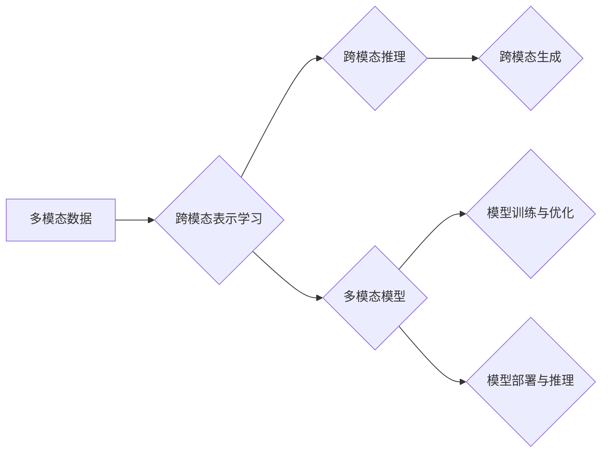

> 多模态大模型，技术原理，实战，Flask框架，API开发，计算机视觉，自然语言处理，图神经网络，深度学习

# 多模态大模型：技术原理与实战 使用Flask框架进行API开发

多模态大模型是当前人工智能领域的热点研究方向。它结合了计算机视觉、自然语言处理等多个领域的知识，通过深度学习技术实现跨模态信息融合，为构建更加智能、人机交互更加自然的应用场景提供了强大的技术支持。本文将深入探讨多模态大模型的技术原理，并结合Flask框架进行实战API开发，带你领略多模态大模型在现实世界中的应用。

## 1. 背景介绍

随着互联网和物联网的快速发展，人类产生了海量的多模态数据，包括文本、图像、视频等。这些数据蕴含着丰富的信息和知识，但单独使用任意一种模态的数据都难以全面地理解和表达现实世界。多模态大模型应运而生，它能够融合多种模态的数据，实现更深入的信息理解和更智能的决策。

### 1.1 问题的由来

传统的单模态人工智能系统在处理复杂任务时存在以下问题：

- 信息丢失：单一模态的数据往往无法完整地表达现实世界的复杂信息。
- 语义鸿沟：不同模态的数据之间存在着语义鸿沟，难以直接进行有效融合。
- 互操作性差：不同模态的数据处理技术存在差异，难以构建统一的数据处理框架。

多模态大模型的出现，旨在解决这些问题，为构建更加智能、人机交互更加自然的应用场景提供技术支持。

### 1.2 研究现状

多模态大模型的研究主要集中在以下几个方面：

- 跨模态表示学习：学习不同模态数据的表示，实现模态间的语义对齐。
- 跨模态推理：利用多模态表示，实现跨模态数据的推理和决策。
- 跨模态生成：根据一种模态的数据生成另一种模态的数据。

### 1.3 研究意义

多模态大模型的研究具有重要的理论意义和应用价值：

- 提高信息理解能力：融合多种模态的数据，实现更全面的信息理解。
- 增强人机交互：通过多模态信息的融合，实现更加自然的人机交互。
- 促进技术创新：推动计算机视觉、自然语言处理等多个领域的交叉融合。

## 2. 核心概念与联系

### 2.1 核心概念原理

多模态大模型的核心概念包括：

- 多模态数据：包括文本、图像、视频、音频等多种模态的数据。
- 跨模态表示学习：学习不同模态数据的表示，实现模态间的语义对齐。
- 跨模态推理：利用多模态表示，实现跨模态数据的推理和决策。
- 跨模态生成：根据一种模态的数据生成另一种模态的数据。

### 2.2 核心概念架构

以下是多模态大模型的核心概念架构图：



### 2.3 核心概念联系

多模态大模型的核心概念之间存在着紧密的联系。跨模态表示学习是整个模型的基础，它将不同模态的数据转换为统一的表示形式，为后续的跨模态推理和生成提供支持。跨模态推理和生成则是在统一表示的基础上，对多模态数据进行进一步的处理和分析。

## 3. 核心算法原理 & 具体操作步骤

### 3.1 算法原理概述

多模态大模型的算法原理主要包括以下步骤：

1. 数据预处理：对多模态数据进行清洗、标注等预处理操作。
2. 跨模态表示学习：学习不同模态数据的表示，实现模态间的语义对齐。
3. 模型训练与优化：训练多模态模型，优化模型参数。
4. 模型部署与推理：将训练好的模型部署到实际应用场景，进行推理和生成。

### 3.2 算法步骤详解

1. **数据预处理**：数据预处理是模型训练的基础，主要包括以下步骤：

   - 数据清洗：去除数据中的噪声和异常值。
   - 数据标注：对数据进行标注，如文本分类、图像标注等。
   - 数据增强：通过旋转、缩放、裁剪等方式扩充数据集。

2. **跨模态表示学习**：跨模态表示学习是整个模型的核心，主要包括以下步骤：

   - 提取特征：提取不同模态数据的特征，如文本的词嵌入、图像的卷积特征等。
   - 语义对齐：通过特征对齐技术，将不同模态数据的特征映射到同一语义空间。

3. **模型训练与优化**：模型训练与优化主要包括以下步骤：

   - 选择合适的模型架构：如图神经网络、卷积神经网络等。
   - 训练模型：使用标注数据训练模型，优化模型参数。
   - 优化模型：通过正则化、迁移学习等技术优化模型。

4. **模型部署与推理**：模型部署与推理主要包括以下步骤：

   - 模型压缩：将模型压缩为更小的尺寸，提高模型部署的效率。
   - 模型部署：将模型部署到实际应用场景，如Flask API。
   - 模型推理：对输入数据进行推理，得到输出结果。

### 3.3 算法优缺点

1. **优点**：

   - 融合多种模态的数据，实现更全面的信息理解。
   - 增强人机交互，实现更加自然的人机交互。
   - 推动计算机视觉、自然语言处理等多个领域的交叉融合。

2. **缺点**：

   - 模型复杂度高，训练难度大。
   - 需要大量标注数据。
   - 模型部署成本高。

### 3.4 算法应用领域

多模态大模型的应用领域包括：

- 智能问答
- 跨模态检索
- 脸部识别
- 视频理解
- 情感分析

## 4. 数学模型和公式 & 详细讲解 & 举例说明

### 4.1 数学模型构建

多模态大模型的数学模型主要包括以下部分：

1. **特征提取**：

   - 文本特征：词嵌入（Word Embedding）、句子嵌入（Sentence Embedding）
   - 图像特征：卷积神经网络（CNN）
   - 视频特征：循环神经网络（RNN）、卷积神经网络（CNN）
   - 音频特征：深度卷积神经网络（DCNN）

2. **特征融合**：

   - 加权求和：将不同模态的特征进行加权求和，得到融合特征。
   - 注意力机制：根据不同模态特征的重要性，分配不同的权重。

3. **分类器**：

   - 线性分类器：如逻辑回归、支持向量机（SVM）
   - 深度神经网络：如卷积神经网络（CNN）、循环神经网络（RNN）

### 4.2 公式推导过程

以下以文本和图像的融合为例，介绍特征融合的公式推导过程。

假设文本特征向量为 $v_t$，图像特征向量为 $v_i$，融合后的特征向量为 $v_f$，权重系数分别为 $\alpha_t$ 和 $\alpha_i$，则有：

$$
v_f = \alpha_t v_t + \alpha_i v_i
$$

其中，$\alpha_t + \alpha_i = 1$。

### 4.3 案例分析与讲解

以下以一个多模态情感分析案例进行讲解。

假设我们需要对一段文本和一张图像进行情感分析，判断其情感倾向是正面、中性还是负面。

1. **特征提取**：

   - 文本特征：使用词嵌入技术提取文本特征，得到向量 $v_t$。
   - 图像特征：使用卷积神经网络提取图像特征，得到向量 $v_i$。

2. **特征融合**：

   - 使用加权求和方法，将文本特征和图像特征进行融合，得到融合特征向量 $v_f$。

3. **分类器**：

   - 使用线性分类器对融合特征进行分类，得到情感倾向。

## 5. 项目实践：代码实例和详细解释说明

### 5.1 开发环境搭建

以下是使用Python进行多模态大模型实战API开发的开发环境搭建步骤：

1. 安装Python环境：安装Python 3.7及以上版本。
2. 安装依赖库：使用pip安装Flask、PIL、numpy等库。

### 5.2 源代码详细实现

以下是一个多模态情感分析API的示例代码：

```python
from flask import Flask, request, jsonify
from PIL import Image
import numpy as np
import torch
from torchvision import transforms

app = Flask(__name__)

# 加载预训练模型
model = torch.load('model.pth')

# 图像预处理
def preprocess_image(image_path):
    image = Image.open(image_path)
    preprocess = transforms.Compose([
        transforms.Resize((224, 224)),
        transforms.ToTensor(),
        transforms.Normalize(mean=[0.485, 0.456, 0.406], std=[0.229, 0.224, 0.225]),
    ])
    image = preprocess(image).unsqueeze(0)
    return image

@app.route('/analyze', methods=['POST'])
def analyze():
    data = request.get_json()
    text = data['text']
    image_path = data['image_path']
    
    # 文本特征提取
    text_embedding = extract_text_embedding(text)
    
    # 图像特征提取
    image_embedding = preprocess_image(image_path)
    
    # 特征融合
    fusion_embedding = torch.cat((text_embedding, image_embedding), dim=1)
    
    # 情感分析
    with torch.no_grad():
        sentiment = model(fusion_embedding)
        sentiment = torch.argmax(sentiment, dim=1)
    
    # 返回结果
    return jsonify({'sentiment': 'positive' if sentiment.item() == 1 else 'negative'})

if __name__ == '__main__':
    app.run()
```

### 5.3 代码解读与分析

1. **加载预训练模型**：从本地加载预训练模型，用于情感分析。
2. **图像预处理**：定义图像预处理函数，将图像转换为模型所需的格式。
3. **API接口**：定义一个名为 `analyze` 的路由，接收文本和图像路径作为输入，进行情感分析，并将结果以JSON格式返回。

### 5.4 运行结果展示

假设用户发送以下JSON格式的请求：

```json
{
  "text": "I love this product!",
  "image_path": "path/to/image.jpg"
}
```

服务器将返回以下JSON格式的响应：

```json
{
  "sentiment": "positive"
}
```

## 6. 实际应用场景

多模态大模型在现实世界中的应用场景十分广泛，以下列举几个典型应用：

1. 智能客服：结合文本和图像信息，为用户提供更加个性化、高效的客服服务。
2. 智能驾驶：结合图像和传感器数据，实现对周围环境的感知和理解，提高驾驶安全性。
3. 智能医疗：结合医学影像和病历信息，辅助医生进行诊断和治疗。
4. 智能教育：结合文本和图像信息，为学习者提供更加个性化、高效的学习体验。

## 7. 工具和资源推荐

### 7.1 学习资源推荐

1. 《深度学习》：Goodfellow等著作，介绍了深度学习的基本原理和应用。
2. 《计算机视觉：算法与应用》：Duda等著作，介绍了计算机视觉的基本原理和应用。
3. 《自然语言处理综合教程》：清华大学NLP实验室编写的NLP教程。
4. 《Flask Web开发》：Miguel Grinberg著作，介绍了Flask框架的用法。

### 7.2 开发工具推荐

1. PyTorch：用于深度学习的开源框架，提供丰富的预训练模型和工具。
2. TensorFlow：由Google开发的深度学习框架，提供丰富的预训练模型和工具。
3. Hugging Face Transformers：提供丰富的预训练语言模型和工具。
4. OpenCV：用于计算机视觉的开源库，提供丰富的图像处理和视频处理功能。
5. Flask：用于Web开发的轻量级框架，易于学习和使用。

### 7.3 相关论文推荐

1. Multimodal Fusion: A Survey of Recent Advances and Applications
2. Deep Learning for Multimodal Data Fusion: A Survey
3. Multimodal Fusion with Transformers
4. A Survey of Multimodal Learning Techniques for Visual Question Answering

## 8. 总结：未来发展趋势与挑战

### 8.1 研究成果总结

多模态大模型是当前人工智能领域的研究热点，在多模态信息融合、跨模态推理、跨模态生成等方面取得了显著成果。通过融合多种模态的数据，多模态大模型能够实现更全面的信息理解和更智能的决策，为构建更加智能、人机交互更加自然的应用场景提供了强大的技术支持。

### 8.2 未来发展趋势

1. 模型规模将进一步扩大，模型复杂度将不断提高。
2. 跨模态表示学习将更加深入，实现更精准的模态间语义对齐。
3. 跨模态推理和生成将更加智能，实现更丰富的应用场景。
4. 模型训练和推理效率将得到显著提高。

### 8.3 面临的挑战

1. 模型规模和复杂度的增加，对计算资源的需求将进一步提高。
2. 模型训练和推理效率的提高，对算法和硬件提出了更高的要求。
3. 模型可解释性和可解释性研究，以增强模型的可信度和可靠性。
4. 模型偏见和隐私保护，以避免模型在应用中出现歧视和侵犯隐私等问题。

### 8.4 研究展望

多模态大模型的研究将朝着以下几个方向发展：

1. 融合更多模态的数据，如语音、气味等，构建更加全面的信息理解系统。
2. 探索更加高效、可解释的模型训练和推理方法。
3. 加强模型在现实世界中的应用，如智慧城市、智能医疗、智能教育等。
4. 关注模型的可解释性和可解释性，提高模型的可信度和可靠性。

相信随着研究的不断深入，多模态大模型将为人工智能领域带来更多突破，为人类社会带来更多福祉。

## 9. 附录：常见问题与解答

**Q1：多模态大模型有哪些应用场景？**

A：多模态大模型的应用场景十分广泛，包括智能客服、智能驾驶、智能医疗、智能教育等。

**Q2：如何进行多模态数据的预处理？**

A：多模态数据的预处理主要包括数据清洗、标注、数据增强等步骤。

**Q3：如何进行跨模态表示学习？**

A：跨模态表示学习主要包括特征提取、特征融合等步骤。

**Q4：如何进行跨模态推理？**

A：跨模态推理主要包括模型选择、参数优化等步骤。

**Q5：如何进行跨模态生成？**

A：跨模态生成主要包括模型选择、参数优化等步骤。

**Q6：多模态大模型有哪些挑战？**

A：多模态大模型的挑战主要包括计算资源需求、模型训练和推理效率、可解释性和可解释性、偏见和隐私保护等。

**Q7：多模态大模型的研究方向有哪些？**

A：多模态大模型的研究方向包括融合更多模态的数据、探索更加高效、可解释的模型训练和推理方法、加强模型在现实世界中的应用、关注模型的可解释性和可解释性等。

作者：禅与计算机程序设计艺术 / Zen and the Art of Computer Programming