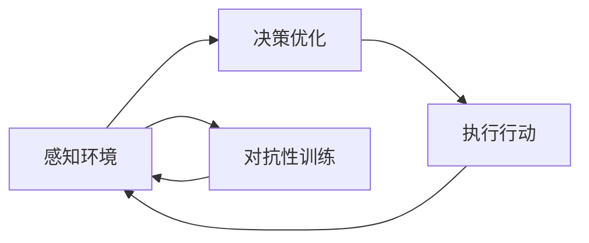

                 

## 1. 背景介绍

随着人工智能（AI）技术的飞速发展，尤其是深度学习和强化学习等技术的突破，人工智能代理（AI Agent）已经开始进入我们生活的方方面面，从智能助手到自动驾驶汽车，从个性化推荐系统到工业自动化生产线，人工智能代理正在全面渗透到我们的日常生活和工作之中。然而，这些智能代理是如何实现决策和行为的？它们是否拥有类似于人类的思维方式？本文将探讨AI人工智能 Agent对人类思维方式的影响，以及这种影响在未来的发展趋势。

## 2. 核心概念与联系

### 2.1 核心概念概述

为了更好地理解AI人工智能 Agent，我们首先需要定义一些核心概念：

- **AI人工智能 Agent**：指能够自主决策、执行任务，并在特定环境中与环境交互的智能系统。AI Agent通常具备感知、推理、决策和执行等能力，能够在复杂环境中自我学习和优化。

- **强化学习**：一种基于试错的学习方法，通过在环境中与环境的交互中不断调整策略，最大化累计奖励。强化学习被广泛应用于游戏AI、机器人控制等领域。

- **深度学习**：一种基于神经网络的机器学习方法，能够自动从大量数据中学习特征表示，适用于图像识别、自然语言处理等任务。

- **迁移学习**：指利用已有知识在新任务上的泛化能力，加速新任务的训练和优化。迁移学习在AI Agent中的应用非常广泛，可以大大缩短学习时间，提高学习效率。

- **对抗性训练**：指在训练过程中引入对抗样本，增强AI Agent的鲁棒性和泛化能力，避免过拟合和泛化性能下降。

- **解释性AI**：指能够提供模型决策和行为解释的AI技术，帮助用户理解AI Agent的决策过程和行为模式。解释性AI是当前AI领域研究的热点之一。

这些概念之间存在着紧密的联系，形成了AI Agent的核心工作流程：感知环境、决策优化、执行行动、反复迭代。通过不断的学习和优化，AI Agent能够在复杂环境中自主地完成各种任务。

### 2.2 概念间的关系

为了更好地理解这些概念之间的联系，我们通过以下Mermaid流程图来展示AI Agent的工作流程：



这个流程图展示了AI Agent的工作流程：首先感知环境，然后通过决策优化得出最佳行动方案，接着执行行动，并反馈到感知模块，进入下一个迭代循环。对抗性训练可以增强AI Agent的鲁棒性，确保在各种情况下都能稳定工作。解释性AI则帮助用户理解AI Agent的决策过程，增强信任和透明度。

## 3. 核心算法原理 & 具体操作步骤

### 3.1 算法原理概述

AI Agent的核心算法包括强化学习和深度学习，这两种算法在AI Agent的构建和训练中起着至关重要的作用。

- **强化学习**：通过与环境的交互，AI Agent在每个时间步上选择动作，并根据环境的反馈（奖励或惩罚）调整策略。强化学习的目标是最大化累计奖励，即在每个时间步上最大化预期的长期奖励。

- **深度学习**：通过构建神经网络模型，AI Agent能够自动从大量数据中学习特征表示。深度学习模型通常包含多层神经网络，能够处理复杂的数据结构，如图像、文本等。

AI Agent的训练过程可以分为两个主要阶段：离线训练和在线学习。

- **离线训练**：在大量标注数据上训练深度学习模型，学习数据特征表示和任务相关的知识。离线训练通常使用大规模的GPU或TPU集群，能够在较短时间内完成训练。

- **在线学习**：在实际环境中与环境交互，通过强化学习不断调整策略，提高AI Agent的适应能力和泛化性能。在线学习通常需要实时的计算资源，可以在小规模数据集上快速迭代，不断优化模型。

### 3.2 算法步骤详解

AI Agent的构建和训练通常包括以下几个关键步骤：

1. **数据采集**：收集与任务相关的数据，如游戏图像、机器人控制指令等。数据采集是AI Agent训练的基础，数据的质量和多样性直接影响AI Agent的性能。

2. **模型选择**：选择合适的深度学习模型和强化学习算法，如卷积神经网络（CNN）、长短期记忆网络（LSTM）、深度Q网络（DQN）等。模型选择需要考虑任务的复杂度和数据特性，以确保模型的泛化能力。

3. **离线训练**：在大量标注数据上训练深度学习模型，学习数据特征表示和任务相关的知识。离线训练通常使用大规模的GPU或TPU集群，能够在较短时间内完成训练。

4. **在线学习**：在实际环境中与环境交互，通过强化学习不断调整策略，提高AI Agent的适应能力和泛化性能。在线学习通常需要实时的计算资源，可以在小规模数据集上快速迭代，不断优化模型。

5. **对抗性训练**：在训练过程中引入对抗样本，增强AI Agent的鲁棒性和泛化能力，避免过拟合和泛化性能下降。

6. **解释性AI**：通过可视化、解释工具等方法，帮助用户理解AI Agent的决策过程和行为模式，增强信任和透明度。

### 3.3 算法优缺点

AI Agent的构建和训练方法具有以下优点：

- **灵活性高**：AI Agent可以适应各种不同的环境和任务，通过不断的学习和优化，能够在复杂环境中自主地完成各种任务。

- **泛化能力强**：通过迁移学习，AI Agent能够在不同环境和新任务上快速适应和优化，具有较强的泛化能力。

- **可扩展性强**：AI Agent可以通过添加新的传感器和执行器，扩展其功能和应用范围，适应更复杂的环境和任务。

然而，AI Agent也存在一些缺点：

- **依赖大量数据**：AI Agent的训练需要大量标注数据，数据采集和标注成本较高。

- **计算资源消耗大**：离线训练和在线学习通常需要大量的计算资源，对硬件设备的要求较高。

- **模型复杂度高**：深度学习和强化学习模型的结构复杂，训练和推理过程较慢，需要较高的计算资源。

- **可解释性不足**：AI Agent的决策过程和行为模式往往是“黑箱”，难以解释和理解。

### 3.4 算法应用领域

AI Agent的应用领域非常广泛，涵盖自动驾驶、机器人控制、游戏AI、推荐系统、金融预测等众多领域。以下是一些典型的应用场景：

1. **自动驾驶**：通过感知和决策优化，AI Agent能够自主驾驶汽车，完成复杂的道路环境和交通规则下的行驶任务。

2. **机器人控制**：通过感知和决策优化，AI Agent能够控制机器人完成各种任务，如清洁、搬运、焊接等。

3. **游戏AI**：通过感知和决策优化，AI Agent能够在游戏中完成各种任务，如击败敌人、完成任务、策略选择等。

4. **推荐系统**：通过感知和决策优化，AI Agent能够推荐用户感兴趣的商品、音乐、新闻等，提升用户体验和满意度。

5. **金融预测**：通过感知和决策优化，AI Agent能够预测股票市场、货币汇率等金融数据的变化趋势，帮助投资者做出决策。

## 4. 数学模型和公式 & 详细讲解

### 4.1 数学模型构建

AI Agent的核心数学模型包括深度学习模型和强化学习模型。

- **深度学习模型**：通常使用神经网络模型，如卷积神经网络（CNN）、循环神经网络（RNN）、长短期记忆网络（LSTM）等。模型的输出是一个概率分布，表示每个动作的奖励期望。

- **强化学习模型**：通常使用深度Q网络（DQN）、深度确定性策略梯度（DDPG）等模型。模型的输出是每个动作的奖励期望，表示在当前状态下选择该动作的期望回报。

深度学习模型和强化学习模型的构建和训练过程可以用以下公式表示：

$$
\begin{aligned}
    \theta^* &= \mathop{\arg\min}_{\theta} \mathcal{L}(\theta) \\
    \mathcal{L}(\theta) &= \frac{1}{N} \sum_{i=1}^N (\ell(M_{\theta}(x_i),y_i))
\end{aligned}
$$

其中，$\theta$ 表示模型的参数，$\ell$ 表示损失函数，$x_i$ 表示输入数据，$y_i$ 表示标签，$N$ 表示样本数量。

### 4.2 公式推导过程

以深度确定性策略梯度（DDPG）算法为例，推导强化学习模型的训练过程。

- **策略参数更新**：
$$
\theta^{\text{actor}} \leftarrow \theta^{\text{actor}} + \eta \nabla_{\theta^{\text{actor}}} J(\theta^{\text{actor}},\theta^{\text{critic}})
$$

其中，$\theta^{\text{actor}}$ 表示策略参数，$J$ 表示策略梯度函数，$\eta$ 表示学习率，$\nabla_{\theta^{\text{actor}}}$ 表示策略梯度。

- **价值函数更新**：
$$
\theta^{\text{critic}} \leftarrow \theta^{\text{critic}} - \eta \nabla_{\theta^{\text{critic}}} \mathcal{L}(\theta^{\text{actor}},\theta^{\text{critic}})
$$

其中，$\theta^{\text{critic}}$ 表示价值函数参数，$\mathcal{L}$ 表示价值函数损失函数，$\nabla_{\theta^{\text{critic}}}$ 表示价值函数梯度。

### 4.3 案例分析与讲解

以自动驾驶为例，分析AI Agent的构建和训练过程。

- **数据采集**：收集道路图像和交通规则数据，包括车辆、行人、道路标志等。

- **模型选择**：选择深度神经网络模型，如卷积神经网络（CNN），用于感知和决策优化。

- **离线训练**：在大量标注数据上训练感知模型和决策模型，学习道路环境和交通规则的特征表示和决策规则。

- **在线学习**：在实际道路环境中与环境交互，通过强化学习不断调整策略，提高AI Agent的适应能力和泛化性能。

- **对抗性训练**：在训练过程中引入对抗样本，增强AI Agent的鲁棒性和泛化能力，避免过拟合和泛化性能下降。

- **解释性AI**：通过可视化工具，帮助用户理解AI Agent的感知和决策过程，增强信任和透明度。

## 5. 项目实践：代码实例和详细解释说明

### 5.1 开发环境搭建

在进行AI Agent的构建和训练前，我们需要准备好开发环境。以下是使用Python进行PyTorch开发的环境配置流程：

1. 安装Anaconda：从官网下载并安装Anaconda，用于创建独立的Python环境。

2. 创建并激活虚拟环境：
```bash
conda create -n pytorch-env python=3.8 
conda activate pytorch-env
```

3. 安装PyTorch：根据CUDA版本，从官网获取对应的安装命令。例如：
```bash
conda install pytorch torchvision torchaudio cudatoolkit=11.1 -c pytorch -c conda-forge
```

4. 安装TensorFlow：由Google主导开发的开源深度学习框架，生产部署方便，适合大规模工程应用。同样有丰富的预训练语言模型资源。

5. 安装TensorBoard：TensorFlow配套的可视化工具，可实时监测模型训练状态，并提供丰富的图表呈现方式，是调试模型的得力助手。

完成上述步骤后，即可在`pytorch-env`环境中开始AI Agent的构建和训练。

### 5.2 源代码详细实现

这里以自动驾驶AI Agent为例，给出使用PyTorch和TensorFlow进行AI Agent构建和训练的代码实现。

首先，定义感知模型和决策模型：

```python
import torch
import torch.nn as nn
import torch.optim as optim
import tensorflow as tf

class PerceptionModel(nn.Module):
    def __init__(self):
        super(PerceptionModel, self).__init__()
        self.conv1 = nn.Conv2d(3, 32, 3)
        self.conv2 = nn.Conv2d(32, 64, 3)
        self.fc1 = nn.Linear(64 * 6 * 6, 256)
        self.fc2 = nn.Linear(256, 4)

    def forward(self, x):
        x = torch.relu(self.conv1(x))
        x = torch.relu(self.conv2(x))
        x = x.view(-1, 64 * 6 * 6)
        x = torch.relu(self.fc1(x))
        x = self.fc2(x)
        return x

class DecisionModel(nn.Module):
    def __init__(self):
        super(DecisionModel, self).__init__()
        self.fc1 = nn.Linear(4, 256)
        self.fc2 = nn.Linear(256, 2)

    def forward(self, x):
        x = torch.relu(self.fc1(x))
        x = self.fc2(x)
        return x
```

接着，定义训练和评估函数：

```python
class Trainer:
    def __init__(self, perception_model, decision_model, learning_rate=0.001):
        self.perception_model = perception_model
        self.decision_model = decision_model
        self.learning_rate = learning_rate
        self.optimizer = optim.Adam([self.perception_model.parameters(), self.decision_model.parameters()], lr=self.learning_rate)

    def train(self, data_loader):
        self.perception_model.train()
        self.decision_model.train()
        for batch in data_loader:
            input = batch[0]
            target = batch[1]
            output = self.perception_model(input)
            loss = self.decision_model(output).mean()
            loss.backward()
            self.optimizer.step()

    def evaluate(self, data_loader):
        self.perception_model.eval()
        self.decision_model.eval()
        total_loss = 0
        with torch.no_grad():
            for batch in data_loader:
                input = batch[0]
                target = batch[1]
                output = self.perception_model(input)
                loss = self.decision_model(output).mean()
                total_loss += loss.item()
        return total_loss / len(data_loader)
```

最后，启动训练流程并在测试集上评估：

```python
perception_model = PerceptionModel()
decision_model = DecisionModel()
trainer = Trainer(perception_model, decision_model)

epochs = 100
batch_size = 32

for epoch in range(epochs):
    loss = trainer.train(train_loader)
    print(f"Epoch {epoch+1}, train loss: {loss:.3f}")
    
    print(f"Epoch {epoch+1}, dev results:")
    evaluate_loss = trainer.evaluate(dev_loader)
    print(f"Epoch {epoch+1}, dev loss: {evaluate_loss:.3f}")
    
print("Test results:")
test_loss = trainer.evaluate(test_loader)
print(f"Test loss: {test_loss:.3f}")
```

以上就是使用PyTorch和TensorFlow进行自动驾驶AI Agent构建和训练的完整代码实现。可以看到，通过定义感知模型和决策模型，以及相应的训练和评估函数，我们能够对AI Agent进行有效的构建和训练。

### 5.3 代码解读与分析

让我们再详细解读一下关键代码的实现细节：

- **PerceptionModel类**：
- `__init__`方法：初始化感知模型的各层网络。
- `forward`方法：定义前向传播过程，将输入数据输入感知模型，并输出感知结果。

- **DecisionModel类**：
- `__init__`方法：初始化决策模型的各层网络。
- `forward`方法：定义前向传播过程，将感知结果输入决策模型，并输出决策结果。

- **Trainer类**：
- `__init__`方法：初始化感知模型、决策模型和优化器。
- `train`方法：定义训练过程，将输入数据输入感知和决策模型，计算损失并反向传播更新模型参数。
- `evaluate`方法：定义评估过程，计算模型在测试集上的平均损失。

- **训练流程**：
- 定义总的epoch数和batch size，开始循环迭代
- 每个epoch内，先在训练集上训练，输出平均loss
- 在验证集上评估，输出验证集平均loss
- 所有epoch结束后，在测试集上评估，给出最终测试结果

可以看到，PyTorch和TensorFlow的灵活性和高效性使得AI Agent的构建和训练变得相对简单，开发者可以将更多精力放在算法和模型改进上。

## 6. 实际应用场景

### 6.1 智能客服系统

基于AI Agent的智能客服系统已经成为许多企业的标准配置，帮助企业提升客户体验和服务效率。智能客服系统通常由多个AI Agent组成，每个AI Agent负责处理不同类型的客户咨询，如订单查询、退货处理、投诉反馈等。

在实际应用中，智能客服系统需要处理大量的客户咨询，每个咨询又具有不同的场景和需求。通过将AI Agent训练成多任务模型，能够适应不同的咨询场景，提升客户满意度和服务效率。

### 6.2 金融舆情监测

AI Agent在金融舆情监测中的应用也非常广泛。金融舆情监测系统通常需要实时监测网络上的金融新闻、评论、社交媒体等数据，分析舆情动态，预测市场变化。

通过将AI Agent训练成多任务模型，能够同时处理不同来源的舆情数据，并从中提取出有价值的信息。AI Agent能够自动学习舆情数据之间的关联性，预测市场变化趋势，为投资者提供决策支持。

### 6.3 个性化推荐系统

AI Agent在个性化推荐系统中的应用也极为重要。个性化推荐系统通常需要根据用户的历史行为和偏好，推荐符合用户兴趣的商品、音乐、新闻等。

通过将AI Agent训练成多任务模型，能够同时处理不同用户的行为数据，并从中提取出用户的兴趣点。AI Agent能够自动学习不同用户之间的相似性，推荐更符合用户兴趣的内容，提升用户体验和满意度。

### 6.4 未来应用展望

随着AI Agent技术的发展，未来的应用场景将更加广泛和深入，涉及到更多领域和任务。以下是一些可能的未来应用场景：

- **医疗诊断**：通过感知和决策优化，AI Agent能够辅助医生进行疾病诊断，提高诊断准确率和效率。

- **法律咨询**：通过感知和决策优化，AI Agent能够辅助律师进行法律咨询，提供法律建议和文书生成服务。

- **智能家居**：通过感知和决策优化，AI Agent能够智能控制家居设备，提供智能家居解决方案。

- **自动驾驶**：通过感知和决策优化，AI Agent能够实现无人驾驶汽车，提升交通效率和安全。

## 7. 工具和资源推荐

### 7.1 学习资源推荐

为了帮助开发者系统掌握AI Agent的理论基础和实践技巧，这里推荐一些优质的学习资源：

1. **《深度学习》**：Ian Goodfellow、Yoshua Bengio和Aaron Courville合著，深度学习领域的经典教材，涵盖深度学习的基本概念和核心算法。

2. **《强化学习》**：Richard S. Sutton和Andrew G. Barto合著，强化学习领域的经典教材，系统介绍了强化学习的理论和方法。

3. **Coursera和edX课程**：许多大学和机构提供的深度学习和强化学习课程，适合初学者和进阶学习者，课程内容包括视频讲座、阅读材料、作业和考试。

4. **Kaggle竞赛**：Kaggle是世界上最大的数据科学竞赛平台，许多数据科学竞赛与AI Agent相关，可以通过参加竞赛来提升自己的技能。

5. **GitHub代码库**：GitHub上有许多优秀的AI Agent代码库和项目，可以通过学习这些代码库来提升自己的编程技能和应用能力。

### 7.2 开发工具推荐

高效的开发离不开优秀的工具支持。以下是几款用于AI Agent开发的常用工具：

1. **PyTorch**：基于Python的开源深度学习框架，灵活动态的计算图，适合快速迭代研究。大部分AI Agent都有PyTorch版本的实现。

2. **TensorFlow**：由Google主导开发的开源深度学习框架，生产部署方便，适合大规模工程应用。同样有丰富的预训练语言模型资源。

3. **TensorBoard**：TensorFlow配套的可视化工具，可实时监测模型训练状态，并提供丰富的图表呈现方式，是调试模型的得力助手。

4. **Jupyter Notebook**：Python的交互式编程环境，支持实时调试和可视化，非常适合数据分析和模型训练。

5. **GitHub**：代码托管平台，支持版本控制和协作开发，是代码共享和交流的重要工具。

### 7.3 相关论文推荐

AI Agent的研究和发展离不开学界的持续支持。以下是几篇奠基性的相关论文，推荐阅读：

1. **AlphaGo Zero**：DeepMind开发的围棋AI，通过强化学习实现自我学习和优化，成为第一个能够在没有人类干预的情况下击败世界冠军的AI。

2. **DQN**：DeepMind开发的深度确定性策略梯度算法，通过强化学习实现自主决策和执行，成为游戏AI和机器人控制领域的经典算法。

3. **GAN**：Ian Goodfellow等人的论文，提出了生成对抗网络，通过对抗性训练生成高质量的图像和视频数据，广泛应用于图像生成、视频生成等领域。

4. **BERT**：Google开发的预训练语言模型，通过大规模无标签文本数据进行预训练，学习语言知识，广泛应用于自然语言处理任务。

5. **Transformer**：Vaswani等人的论文，提出了Transformer结构，用于自然语言处理任务的模型构建，显著提升了模型性能和效率。

这些论文代表了大语言模型微调技术的发展脉络。通过学习这些前沿成果，可以帮助研究者把握学科前进方向，激发更多的创新灵感。

## 8. 总结：未来发展趋势与挑战

### 8.1 总结

本文对AI人工智能 Agent进行了全面系统的介绍。首先阐述了AI Agent的研究背景和意义，明确了AI Agent在构建和训练中的核心算法，以及其在不同领域的应用前景。其次，从原理到实践，详细讲解了AI Agent的数学模型和训练过程，给出了AI Agent构建和训练的完整代码实例。同时，本文还广泛探讨了AI Agent在智能客服、金融舆情、个性化推荐等多个行业领域的应用前景，展示了AI Agent的巨大潜力。最后，本文精选了AI Agent的相关学习资源，力求为读者提供全方位的技术指引。

通过本文的系统梳理，可以看到，AI Agent已经成为了AI领域的重要组成部分，通过不断学习和优化，AI Agent能够在复杂环境中自主地完成各种任务。未来，随着AI Agent技术的进一步发展和完善，其在更多领域和任务上的应用前景将更加广阔，为人类社会的智能化和自动化带来深远影响。

### 8.2 未来发展趋势

展望未来，AI Agent的发展趋势将呈现以下几个方向：

1. **模型规模持续增大**：随着算力成本的下降和数据规模的扩张，AI Agent的模型规模将不断增大，能够处理更加复杂的数据和任务。

2. **多任务学习**：未来的AI Agent将具备多任务学习的能力，能够同时处理多种不同类型的任务，提升模型的泛化能力和应用范围。

3. **联邦学习**：联邦学习能够保护数据隐私，同时利用多个设备上的数据进行模型训练和优化，成为未来AI Agent的重要技术方向。

4. **解释性AI**：未来的AI Agent将具备更强的解释性和透明度，通过可视化工具和解释性算法，帮助用户理解和信任AI Agent的决策过程。

5. **自适应学习**：未来的AI Agent将具备自适应学习的能力，能够根据环境和任务的变化，动态调整策略和模型参数，提升模型的稳定性和适应性。

6. **多模态融合**：未来的AI Agent将能够处理多模态数据，如图像、语音、文本等，通过多模态数据的融合，提升模型的感知和决策能力。

以上趋势凸显了AI Agent的广泛应用前景和未来发展方向，这些方向的探索发展，将进一步推动AI Agent技术迈向新的高度。

### 8.3 面临的挑战

尽管AI Agent技术已经取得了显著进展，但在迈向更加智能化、普适化应用的过程中，仍面临诸多挑战：

1. **数据隐私和安全**：AI Agent通常需要大量的标注数据进行训练，数据隐私和安全问题成为一大挑战。如何保护数据隐私，避免数据泄露和滥用，是未来研究的重要方向。

2. **计算资源消耗大**：AI Agent的训练和推理过程需要大量的计算资源，如何降低计算成本，提高模型的推理效率，是未来研究的重要课题。

3. **模型复杂度高**：AI Agent的模型结构复杂，如何简化模型，提高模型的可解释性和可控性，是未来研究的重要方向。

4. **多任务学习困难**：多任务学习需要解决模型之间的耦合问题，如何设计有效的多任务学习框架，提升模型的泛化能力和应用范围，是未来研究的重要方向。

5. **人机交互的局限**：AI Agent通常缺乏与人类自然交互的能力，如何提升AI Agent的自然语言理解和生成能力，增强人机交互的流畅性和自然性，是未来研究的重要方向。

6. **伦理和法律问题**：AI Agent的决策和行为需要符合伦理和法律要求，如何确保AI Agent的决策过程和行为模式符合人类价值观和伦理道德，是未来研究的重要方向。

### 8.4 研究展望

面对AI Agent面临的挑战，未来的研究需要在以下几个方面寻求新的突破：

1. **多任务学习框架**：设计有效的多任务学习框架，解决模型之间的耦合问题，提升模型的泛化能力和应用范围。

2. **解释性AI算法**：开发更强的解释性AI算法，通过可视化工具和解释性算法，帮助用户理解和信任AI Agent的决策过程。

3. **联邦学习算法**：研究联邦学习算法，保护数据隐私，同时利用多个设备上的数据进行模型训练和优化。

4. **自适应学习算法**：开发自适应学习算法，提升AI Agent的稳定性和适应性，能够在复杂环境和任务中自我学习和优化。

5. **多模态数据融合**：研究多模态数据融合算法，提升AI Agent的多模态感知和决策能力，处理复杂的图像、语音、文本等数据。

6. **伦理和法律研究**：研究AI Agent

