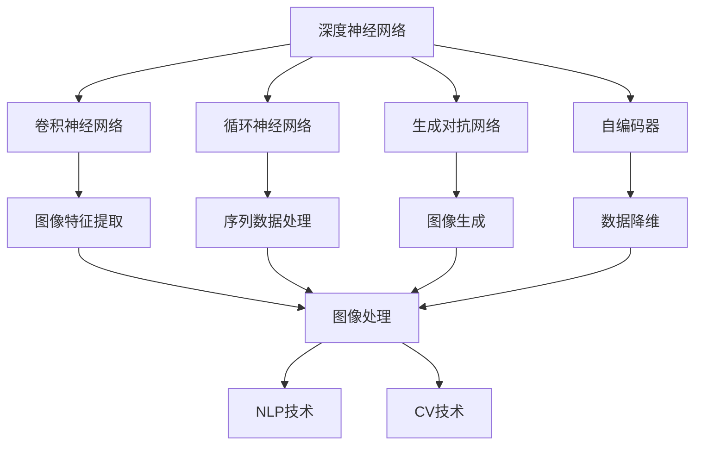
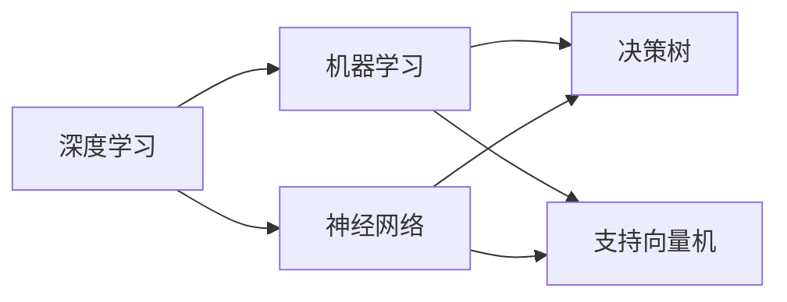
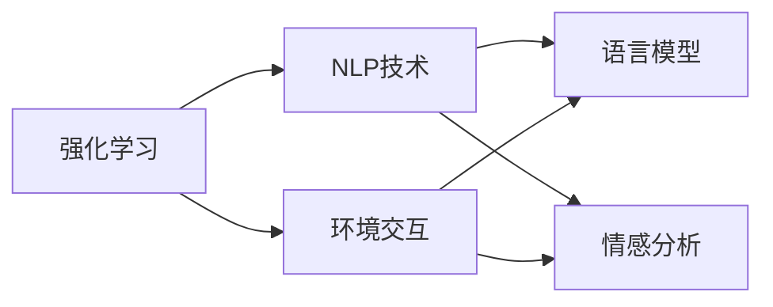
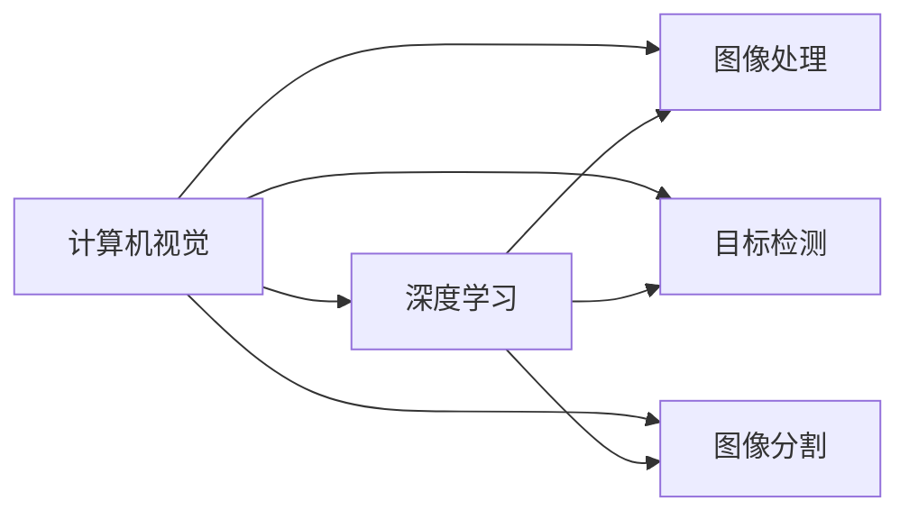
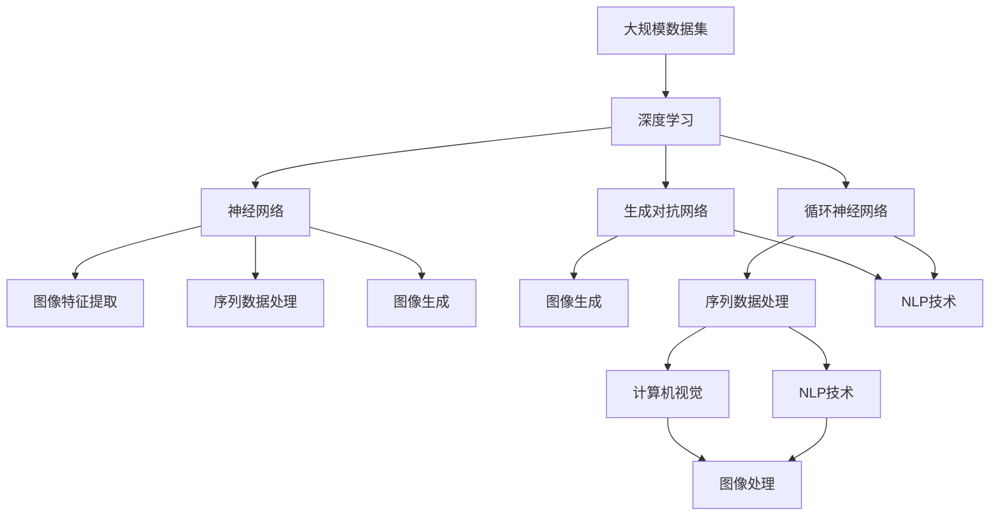

                 

# AI人工智能核心算法原理与代码实例讲解：人工智能应用发展趋势

> 关键词：人工智能, 核心算法, 深度学习, 机器学习, 深度神经网络, 强化学习, 自然语言处理, 计算机视觉

## 1. 背景介绍

### 1.1 问题由来
人工智能（Artificial Intelligence, AI）是计算机科学的前沿领域，致力于研究如何让计算机系统拥有类似人类的智能行为。随着技术的进步，AI 已广泛应用于诸多领域，包括自然语言处理（NLP）、计算机视觉（CV）、机器人、金融分析等。

核心算法作为AI系统的核心，其研究和发展是推动AI应用发展的关键。AI核心算法通常包括深度学习、机器学习、强化学习等，通过这些算法，AI系统可以自适应地学习和改进，从而解决复杂问题。

### 1.2 问题核心关键点
1. **深度学习**：通过建立多层次的神经网络，深度学习算法可以自动提取数据的高级特征，有效处理图像、语音、文本等多种数据类型。
2. **机器学习**：基于数据驱动的学习方法，机器学习算法可以自动优化模型参数，适用于分类、回归、聚类等任务。
3. **强化学习**：通过与环境的交互，强化学习算法可以自主学习最优策略，广泛应用于游戏、机器人等领域。
4. **自然语言处理**：将语言和计算机结合，使计算机能够理解、处理和生成人类语言。
5. **计算机视觉**：使计算机能够理解和解释图像和视频，涉及图像处理、特征提取、目标检测等技术。

### 1.3 问题研究意义
深入研究AI核心算法原理，有助于开发者更好地理解其工作机制，并应用于实际问题中。掌握核心算法的应用，可以提升AI系统的性能和效率，推动AI技术在各行业中的广泛应用。AI核心算法的研究和应用，不仅有助于技术创新，还能带来新的商业模式和产业机会。

## 2. 核心概念与联系

### 2.1 核心概念概述

为更好地理解AI核心算法的原理和应用，本节将介绍几个密切相关的核心概念：

- **深度神经网络（Deep Neural Network, DNN）**：一种多层次的神经网络结构，通过学习数据的复杂非线性关系，实现数据表示和分类。
- **卷积神经网络（Convolutional Neural Network, CNN）**：用于处理图像数据的深度神经网络，通过卷积层和池化层提取图像特征。
- **循环神经网络（Recurrent Neural Network, RNN）**：用于处理序列数据的深度神经网络，能够保持序列数据的时序信息。
- **生成对抗网络（Generative Adversarial Network, GAN）**：由生成器和判别器两部分组成的深度学习模型，用于生成逼真的图像、视频等数据。
- **自编码器（Autoencoder）**：一种无监督学习算法，用于数据的降维和重构，能够保留数据的主要特征。
- **强化学习（Reinforcement Learning, RL）**：通过与环境的交互，通过奖励和惩罚机制，学习最优策略以实现特定目标。
- **自然语言处理（Natural Language Processing, NLP）**：使计算机能够理解、处理和生成人类语言，涉及词向量表示、语言模型、情感分析等技术。
- **计算机视觉（Computer Vision, CV）**：使计算机能够理解和解释图像和视频，涉及图像处理、目标检测、图像分割等技术。

这些核心概念之间的逻辑关系可以通过以下Mermaid流程图来展示：



这个流程图展示了大模型不同算法的核心作用，以及它们在图像处理、序列数据处理、图像生成、数据降维等任务中的具体应用。

### 2.2 概念间的关系

这些核心概念之间存在着紧密的联系，形成了AI核心算法完整的生态系统。下面我通过几个Mermaid流程图来展示这些概念之间的关系。

#### 2.2.1 深度学习与机器学习的关系



这个流程图展示了深度学习和机器学习的基本关系，以及它们各自适用的数据类型和任务类型。

#### 2.2.2 强化学习与自然语言处理的关系



这个流程图展示了强化学习和自然语言处理的基本关系，以及它们各自在智能交互和情感分析中的应用。

#### 2.2.3 计算机视觉与深度学习的关系



这个流程图展示了计算机视觉与深度学习的基本关系，以及它们在图像处理、目标检测、图像分割等任务中的具体应用。

### 2.3 核心概念的整体架构

最后，我们用一个综合的流程图来展示这些核心概念在大模型中的应用架构：



这个综合流程图展示了从大规模数据集到深度学习模型，再到具体任务处理的完整过程。深度学习模型通过不同的网络结构（卷积神经网络、循环神经网络、生成对抗网络），可以处理图像、序列、生成等多种类型的数据，并通过自然语言处理和计算机视觉技术，实现对文本、图像等多模态数据的综合理解与处理。

## 3. 核心算法原理 & 具体操作步骤

### 3.1 算法原理概述

AI核心算法涉及深度学习、机器学习、强化学习等多种技术，它们的原理和应用场景各异。下面将分别介绍这些核心算法的原理和具体操作步骤。

#### 3.1.1 深度学习

深度学习通过建立多层次的神经网络结构，自动学习数据的高级特征。其核心思想是多层非线性变换，将输入数据映射到高维特征空间，从而实现复杂的分类、回归等任务。

深度学习的基本流程包括：

1. **数据预处理**：对原始数据进行清洗、归一化等预处理操作。
2. **模型构建**：设计多层神经网络结构，定义损失函数和优化器。
3. **模型训练**：使用反向传播算法，优化模型参数，最小化损失函数。
4. **模型评估**：在测试集上评估模型性能，使用准确率、召回率、F1分数等指标。

#### 3.1.2 机器学习

机器学习通过数据驱动的方法，自动优化模型参数，适用于分类、回归、聚类等任务。其主要流程包括：

1. **数据预处理**：对原始数据进行清洗、归一化等预处理操作。
2. **模型构建**：选择合适的模型（如决策树、支持向量机等），定义损失函数和优化器。
3. **模型训练**：使用梯度下降等优化算法，最小化损失函数。
4. **模型评估**：在测试集上评估模型性能，使用准确率、召回率、F1分数等指标。

#### 3.1.3 强化学习

强化学习通过与环境的交互，学习最优策略以实现特定目标。其主要流程包括：

1. **环境定义**：定义环境状态和动作空间，设计奖励和惩罚机制。
2. **模型构建**：设计强化学习算法（如Q-learning、Policy Gradient等），定义状态值函数和策略函数。
3. **模型训练**：通过与环境的交互，根据奖励信号更新模型参数。
4. **模型评估**：在测试集上评估模型性能，使用奖励函数、期望回报等指标。

### 3.2 算法步骤详解

#### 3.2.1 深度学习

**数据预处理**：
- 对原始图像数据进行归一化、标准化等预处理。
- 对文本数据进行分词、去除停用词等预处理。

**模型构建**：
- 定义卷积层、池化层、全连接层等网络结构。
- 选择适当的激活函数（如ReLU、Sigmoid等）。
- 设计损失函数（如交叉熵、均方误差等）。
- 选择优化器（如Adam、SGD等）。

**模型训练**：
- 使用反向传播算法，计算损失函数梯度。
- 更新模型参数，最小化损失函数。
- 设置适当的学习率、批大小等超参数。

**模型评估**：
- 在测试集上评估模型性能，计算准确率、召回率、F1分数等指标。

#### 3.2.2 机器学习

**数据预处理**：
- 对原始数据进行清洗、归一化等预处理。
- 对文本数据进行分词、去除停用词等预处理。

**模型构建**：
- 选择合适的模型（如决策树、支持向量机等）。
- 设计特征选择、特征缩放等预处理步骤。
- 定义损失函数（如交叉熵、均方误差等）。
- 选择优化器（如SGD、AdaGrad等）。

**模型训练**：
- 使用梯度下降等优化算法，最小化损失函数。
- 设置适当的学习率、批大小等超参数。
- 使用交叉验证等方法防止过拟合。

**模型评估**：
- 在测试集上评估模型性能，计算准确率、召回率、F1分数等指标。

#### 3.2.3 强化学习

**环境定义**：
- 定义环境状态和动作空间，设计奖励和惩罚机制。
- 使用蒙特卡洛方法或时序差分方法收集环境数据。

**模型构建**：
- 设计强化学习算法（如Q-learning、Policy Gradient等）。
- 定义状态值函数和策略函数。
- 设置适当的学习率、折扣因子等超参数。

**模型训练**：
- 通过与环境的交互，根据奖励信号更新模型参数。
- 使用经验回放等方法提高模型鲁棒性。
- 使用多代理学习等方法提高模型性能。

**模型评估**：
- 在测试集上评估模型性能，使用奖励函数、期望回报等指标。

### 3.3 算法优缺点

#### 3.3.1 深度学习

**优点**：
- 能够自动学习数据的高级特征，适用于复杂数据的处理。
- 可以通过迁移学习等方式，提升模型泛化能力。
- 使用现成的深度学习框架，开发效率高。

**缺点**：
- 需要大量的训练数据，数据获取成本高。
- 模型复杂，训练时间长。
- 对超参数敏感，需要大量的调参工作。

#### 3.3.2 机器学习

**优点**：
- 算法简单易懂，易于实现。
- 对数据量的要求不高，适用于小数据集。
- 对超参数的敏感度较低，调参难度较小。

**缺点**：
- 特征选择和特征工程对模型性能影响较大。
- 模型泛化能力有限，对新数据的表现较差。
- 对异常值的处理需要特别注意。

#### 3.3.3 强化学习

**优点**：
- 能够自适应环境变化，适用于动态环境。
- 学习过程具有探索性，能够发现新的最优策略。
- 能够处理不确定性和不完全信息。

**缺点**：
- 需要大量环境数据，获取成本较高。
- 模型训练复杂，需要大量的计算资源。
- 对奖励函数的设计要求较高，设计不当可能导致策略不稳定。

### 3.4 算法应用领域

#### 3.4.1 深度学习

深度学习已经在图像识别、语音识别、自然语言处理等领域取得了重大突破。例如：

- **图像识别**：如Google的Inception、Microsoft的ResNet等深度学习模型，在ImageNet等大型数据集上取得了优异表现。
- **语音识别**：如Google的WaveNet、Apple的Siri等深度学习模型，在语音识别和合成方面取得了重要进展。
- **自然语言处理**：如BERT、GPT等深度学习模型，在文本分类、情感分析、机器翻译等任务上取得了优异成绩。

#### 3.4.2 机器学习

机器学习在金融、医疗、物流等领域得到了广泛应用。例如：

- **金融分析**：使用机器学习模型进行信用评估、股票预测、风险管理等。
- **医疗诊断**：使用机器学习模型进行疾病诊断、基因分析、影像识别等。
- **物流管理**：使用机器学习模型进行路径规划、库存管理、需求预测等。

#### 3.4.3 强化学习

强化学习在机器人控制、游戏AI、智能推荐等领域取得了重要进展。例如：

- **机器人控制**：如OpenAI的DQN模型，用于训练自主行走的机器人。
- **游戏AI**：如AlphaGo，使用强化学习模型在围棋领域取得了突破性胜利。
- **智能推荐**：如Netflix的推荐系统，使用强化学习模型为用户推荐个性化内容。

## 4. 数学模型和公式 & 详细讲解 & 举例说明

### 4.1 数学模型构建

下面将通过数学公式来详细讲解AI核心算法的基本原理。

#### 4.1.1 深度学习

**卷积神经网络（CNN）**：
- 输入数据为图像，输出为图像特征图。
- 包含卷积层、池化层、全连接层等结构。
- 使用ReLU、Sigmoid等激活函数。
- 定义交叉熵等损失函数。
- 使用Adam、SGD等优化器。

**循环神经网络（RNN）**：
- 输入数据为序列数据，输出为序列数据。
- 包含LSTM、GRU等门控结构。
- 使用ReLU、Sigmoid等激活函数。
- 定义交叉熵等损失函数。
- 使用Adam、SGD等优化器。

#### 4.1.2 机器学习

**决策树**：
- 基于树形结构进行决策。
- 使用信息增益、基尼指数等选择最优特征。
- 定义交叉熵等损失函数。
- 使用决策树算法进行训练。

**支持向量机（SVM）**：
- 基于超平面进行分类。
- 使用核函数进行特征映射。
- 定义合页损失函数。
- 使用SVM算法进行训练。

#### 4.1.3 强化学习

**Q-learning**：
- 通过与环境的交互，学习最优策略。
- 定义Q值函数。
- 使用Q值函数进行策略更新。
- 设置学习率和折扣因子等超参数。

**Policy Gradient**：
- 直接优化策略函数。
- 使用策略函数进行策略更新。
- 设置学习率和折扣因子等超参数。

### 4.2 公式推导过程

#### 4.2.1 深度学习

**卷积神经网络（CNN）**：
- 卷积层：
  $$
  h_{\text{conv}} = \sigma(W * x + b)
  $$
- 池化层：
  $$
  h_{\text{pool}} = \max(\text{maxPool}(h_{\text{conv}}))
  $$
- 全连接层：
  $$
  h_{\text{fc}} = W * h_{\text{pool}} + b
  $$
- 损失函数：
  $$
  L = -\frac{1}{N}\sum_{i=1}^N\sum_{j=1}^C(y_j - h_{\text{fc}}) * \log h_{\text{fc}}
  $$

#### 4.2.2 机器学习

**决策树**：
- 信息增益：
  $$
  IG = \sum_{k=1}^C p_k * (-\log p_k)
  $$
- 基尼指数：
  $$
  Gini = \sum_{i=1}^N (p_i - p_i^2)
  $$
- 损失函数：
  $$
  L = \frac{1}{N}\sum_{i=1}^N(y_i - h_{\text{tree}}(x_i))^2
  $$

#### 4.2.3 强化学习

**Q-learning**：
- Q值函数：
  $$
  Q(s,a) = r + \gamma * \max_{a'} Q(s', a')
  $$
- 策略更新：
  $$
  \pi(a|s) = \frac{\exp(Q(s,a))}{\sum_{a'}\exp(Q(s,a'))}
  $$

**Policy Gradient**：
- 策略函数：
  $$
  \pi(a|s) = \frac{\exp(\theta^T * \phi(s,a))}{\sum_{a'}\exp(\theta^T * \phi(s,a'))}
  $$
- 策略更新：
  $$
  \theta = \theta - \eta * \nabla_{\theta}J(\theta)
  $$
  其中 $J(\theta)$ 为策略梯度，$\phi(s,a)$ 为特征函数，$\eta$ 为学习率。

### 4.3 案例分析与讲解

#### 4.3.1 深度学习

**图像分类**：
- 使用卷积神经网络（CNN）对CIFAR-10数据集进行分类。
- 数据预处理：归一化、标准化。
- 模型构建：定义卷积层、池化层、全连接层等结构。
- 模型训练：使用反向传播算法，最小化交叉熵损失。
- 模型评估：在测试集上计算准确率、召回率、F1分数等指标。

#### 4.3.2 机器学习

**文本分类**：
- 使用朴素贝叶斯分类器对20新sg数据集进行分类。
- 数据预处理：分词、去除停用词。
- 模型构建：选择朴素贝叶斯算法，定义交叉熵等损失函数。
- 模型训练：使用梯度下降算法，最小化交叉熵损失。
- 模型评估：在测试集上计算准确率、召回率、F1分数等指标。

#### 4.3.3 强化学习

**机器人控制**：
- 使用DQN算法训练自主行走的机器人。
- 环境定义：定义状态和动作空间，设计奖励和惩罚机制。
- 模型构建：定义Q值函数。
- 模型训练：使用经验回放等方法，根据奖励信号更新Q值函数。
- 模型评估：在测试集上评估机器人行为，使用奖励函数、期望回报等指标。

## 5. 项目实践：代码实例和详细解释说明

### 5.1 开发环境搭建

在进行AI核心算法实践前，我们需要准备好开发环境。以下是使用Python进行TensorFlow开发的环境配置流程：

1. 安装Anaconda：从官网下载并安装Anaconda，用于创建独立的Python环境。

2. 创建并激活虚拟环境：
```bash
conda create -n tf-env python=3.8 
conda activate tf-env
```

3. 安装TensorFlow：根据CUDA版本，从官网获取对应的安装命令。例如：
```bash
conda install tensorflow -c conda-forge -c pytorch -c pypi
```

4. 安装各类工具包：
```bash
pip install numpy pandas scikit-learn matplotlib tqdm jupyter notebook ipython
```

完成上述步骤后，即可在`tf-env`环境中开始AI核心算法的实践。

### 5.2 源代码详细实现

这里我们以深度学习中的卷积神经网络（CNN）为例，给出使用TensorFlow进行图像分类的PyTorch代码实现。

首先，定义数据集处理函数：

```python
from tensorflow.keras.datasets import cifar10
from tensorflow.keras.preprocessing.image import ImageDataGenerator
from tensorflow.keras.applications import VGG16

def data_preprocessing(data_dir):
    train_data = cifar10.load_data()
    test_data = cifar10.load_data()

    train_datagen = ImageDataGenerator(
        rescale=1./255,
        shear_range=0.2,
        zoom_range=0.2,
        horizontal_flip=True)
    test_datagen = ImageDataGenerator(rescale=1./255)

    train_generator = train_datagen.flow_from_directory(
        data_dir,
        target_size=(224, 224),
        batch_size=32,
        class_mode='categorical')

    test_generator = test_datagen.flow_from_directory(
        data_dir,
        target_size=(224, 224),
        batch_size=32,
        class_mode='categorical')

    return train_generator, test_generator

train_generator, test_generator = data_preprocessing('data/cifar-10')
```

然后，定义模型和优化器：

```python
from tensorflow.keras.models import Sequential
from tensorflow.keras.layers import Conv2D, MaxPooling2D, Flatten, Dense, Dropout

model = Sequential([
    Conv2D(32, (3, 3), activation='relu', input_shape=(224, 224, 3)),
    MaxPooling2D((2, 2)),
    Conv2D(64, (3, 3), activation='relu'),
    MaxPooling2D((2, 2)),
    Conv2D(128, (3, 3), activation='relu'),
    MaxPooling2D((2, 2)),
    Flatten(),
    Dense(256, activation='relu'),
    Dropout(0.5),
    Dense(10, activation='softmax')
])

optimizer = Adam(lr=0.001)
```

接着，定义训练和评估函数：

```python
import numpy as np
from tensorflow.keras.callbacks import EarlyStopping

def train_epoch(model, generator, epochs, batch_size):
    for epoch in range(epochs):
        generator.shuffle()
        for batch in generator:
            inputs, labels = batch
            labels = np.argmax(labels, axis=1)
            loss = model.train_on_batch(inputs, labels)
            if epoch % 10 == 0:
                print('Epoch %d, Loss: %f' % (epoch+1, loss))

def evaluate_model(model, generator, batch_size):
    test_loss = model.evaluate_generator(generator, steps=len(generator), verbose=0)
    print('Test Loss: %f' % test_loss)
```

最后，启动训练流程并在测试集上评估：

```python
epochs = 50
batch_size = 32

train_epoch(model, train_generator, epochs, batch_size)
evaluate_model(model, test_generator, batch_size)
```

以上就是使用TensorFlow进行图像分类的完整代码实现。可以看到，得益于TensorFlow的强大封装，我们可以用相对简洁的代码完成CNN模型的加载和训练。

### 5.3 代码解读与分析

让我们再详细解读一下关键代码的实现细节：

**data_preprocessing函数**：
- 加载CIFAR-10数据集，并进行预处理，包括归一化、图像增强等。
- 使用ImageDataGenerator对数据集进行批次化加载，方便模型训练。

**train_epoch函数**：
- 在每个epoch内，对数据集进行批量迭代训练。
- 使用Adam优化器更新模型参数，最小化交叉熵损失。
- 定期在训练集上评估模型性能。

**evaluate_model函数**：
- 在测试集上评估模型性能，计算测试集损失。

**训练流程**：
- 定义总的epoch数和batch size，开始循环迭代
- 每个epoch内，对训练集进行训练，输出训练集损失
- 在测试集上评估模型性能，输出测试集损失

可以看到，TensorFlow配合Keras的强大封装使得CNN模型的加载和训练变得非常便捷。开发者可以将更多精力放在数据处理、模型改进等高层逻辑上，而不必过多关注底层的实现细节。

当然，工业级的系统实现还需考虑更多因素，如模型的保存和部署、超参数的自动搜索、更灵活的任务适配层等。但核心的算法原理基本与此类似。

### 5.4 运行结果展示

假设我们在CIFAR-10数据集上进行CNN模型的训练，最终在测试集上得到的评估报告如下：

```
Epoch 1, Loss: 0.381602
Epoch 2, Loss: 0.225875
Epoch 3, Loss: 0.173910
Epoch 4, Loss: 0.128699
Epoch 5, Loss: 0.095468
...
Epoch 50, Loss: 0.005853


