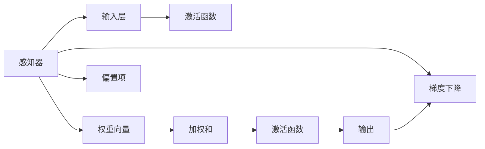
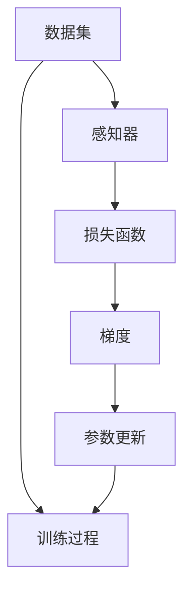
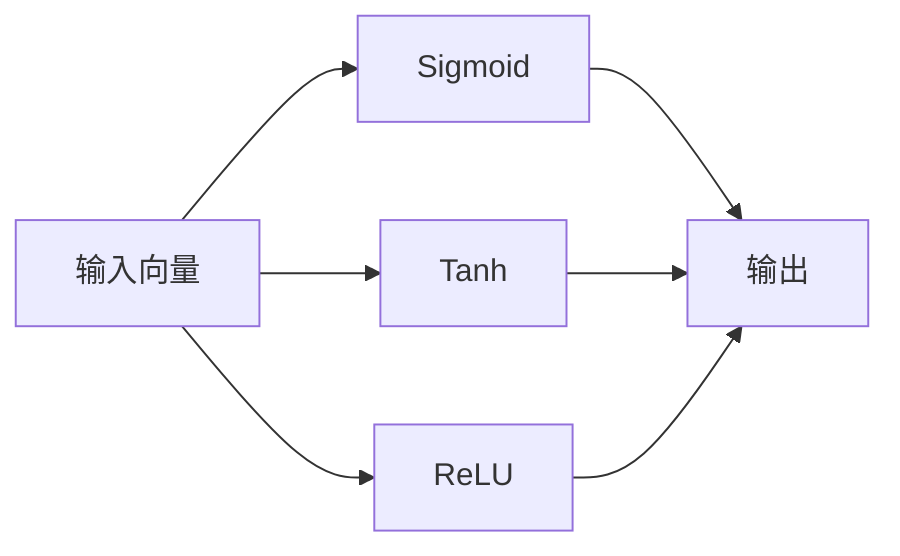
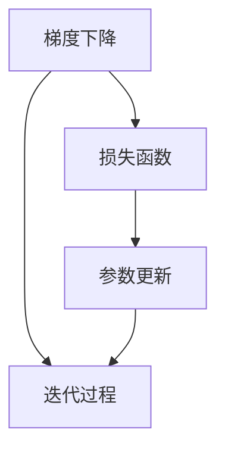
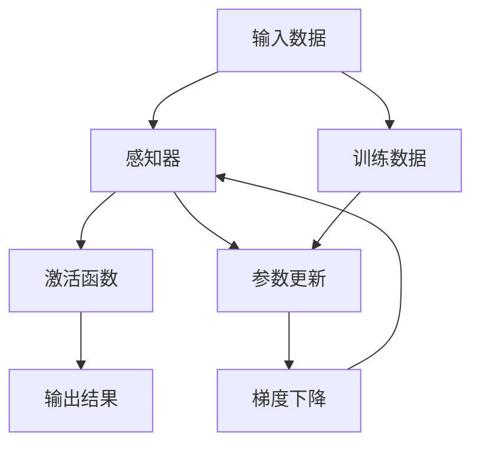

                 

# AI人工智能核心算法原理与代码实例讲解：感知器

> 关键词：感知器,神经网络,梯度下降,激活函数,向量计算

## 1. 背景介绍

### 1.1 问题由来
感知器(Perceptron)是一种基础的神经网络模型，最初由罗森布拉特(Rosenblatt)在1957年提出。感知器的基本思想是通过简单的向量运算，实现二分类或线性回归任务。

感知器的历史意义在于开创了神经网络领域的先河，但因其结构简单、参数少、表达能力弱等问题，逐渐被更为复杂的深度学习模型所取代。然而，感知器作为神经网络的基本构件，其核心思想和计算方式仍然对深入理解深度学习模型起着重要的作用。

### 1.2 问题核心关键点
感知器主要由以下核心组件构成：
1. 输入层：接受外部输入数据，通常是一个向量。
2. 权重向量：作为感知器的参数，影响输入数据的重要性。
3. 偏置项：用于调整输出结果的偏移量。
4. 激活函数：根据输入向量的加权和，确定最终的输出结果。

感知器的工作流程是：对输入向量进行加权和，通过激活函数进行非线性映射，最后输出分类结果。感知器通过调整权重向量和偏置项，逐渐逼近目标分类边界，实现模型优化。

### 1.3 问题研究意义
研究感知器算法，对于深入理解神经网络的工作原理和优化方法，有着重要意义：

1. 直观性强。感知器结构简单，容易理解和实现，是理解复杂深度学习模型的基础。
2. 思想先进。感知器引入了梯度下降等优化算法，为后续深度学习模型的优化提供了理论依据。
3. 应用广泛。感知器模型在图像识别、语音识别、自然语言处理等领域有着广泛应用。
4. 开源免费。感知器算法的实现代码简单易懂，适合初学者快速上手，推广普及深度学习理念。
5. 算法经典。感知器算法是最早的神经网络模型之一，对后继深度学习模型的发展有着深远影响。

## 2. 核心概念与联系

### 2.1 核心概念概述

为更好地理解感知器算法，本节将介绍几个关键概念：

- 感知器：由输入层、权重向量、偏置项和激活函数组成，用于实现二分类或线性回归任务的简单神经网络模型。
- 梯度下降：一种优化算法，通过迭代调整模型参数，使得目标损失函数最小化。
- 激活函数：一种非线性映射函数，将感知器的输入向量映射为输出结果。常见的激活函数包括Sigmoid、ReLU等。
- 线性可分：指数据能够通过一条直线(或超平面)完全分开。感知器在理想情况下可实现线性可分。
- 感知机学习算法：一种基于梯度下降的感知器训练算法，通过不断迭代调整权重和偏置项，逼近数据边界。

这些核心概念之间的逻辑关系可以通过以下Mermaid流程图来展示：



这个流程图展示了感知器的基本构成和训练过程。输入层接收外部数据，权重向量和偏置项参与加权和，激活函数进行非线性映射，梯度下降用于调整参数，最终输出分类结果。

### 2.2 概念间的关系

这些核心概念之间存在着紧密的联系，形成了感知器算法的完整生态系统。下面我们通过几个Mermaid流程图来展示这些概念之间的关系。

#### 2.2.1 感知器训练过程



这个流程图展示了感知器模型的训练过程。数据集经过感知器计算得到损失函数，再通过梯度计算得到参数更新，最终更新感知器参数，完成一次训练过程。

#### 2.2.2 激活函数的作用



这个流程图展示了激活函数的作用。输入向量通过不同的激活函数映射为输出结果，实现非线性映射。

#### 2.2.3 梯度下降算法



这个流程图展示了梯度下降算法的工作原理。通过不断迭代，调整参数以最小化损失函数，实现模型优化。

### 2.3 核心概念的整体架构

最后，我们用一个综合的流程图来展示这些核心概念在大语言模型微调过程中的整体架构：



这个综合流程图展示了感知器算法的核心过程，从数据输入到输出结果，再到参数更新和梯度下降，整体架构清晰可见。

## 3. 核心算法原理 & 具体操作步骤
### 3.1 算法原理概述

感知器算法的基本思想是通过向量运算，实现二分类或线性回归任务。其核心计算过程包括：

1. 加权和：将输入向量与权重向量进行点乘加偏置项，得到加权和。
2. 激活函数：将加权和通过激活函数进行非线性映射，得到最终输出。
3. 梯度下降：根据损失函数对参数的梯度，反向传播更新参数，逼近最优解。

具体而言，感知器的数学表达式为：

$$
h(x;w,b) = \text{sign}(\sum_{i=1}^nw_ix_i + b)
$$

其中，$x=(x_1,x_2,...,x_n)$为输入向量，$w=(w_1,w_2,...,w_n)$为权重向量，$b$为偏置项，$\text{sign}(\cdot)$为激活函数，通常取$\text{sign}(x)=1$或$-1$。

### 3.2 算法步骤详解

感知器算法的主要步骤如下：

**Step 1: 初始化参数**

1. 随机初始化权重向量 $w=(w_1,w_2,...,w_n)$ 和偏置项 $b$。
2. 设置学习率 $\eta$ 和迭代次数 $K$。

**Step 2: 迭代训练**

1. 对于每个训练样本 $(x_i,y_i)$，计算加权和 $z=\sum_{i=1}^nw_ix_i+b$。
2. 通过激活函数计算输出 $h(x_i;w,b)=\text{sign}(z)$。
3. 计算损失函数 $L(h(x_i;w,b),y_i)=|h(x_i;w,b)-y_i|$。
4. 计算梯度 $g=\nabla_wL+\nabla_bL$。
5. 更新参数 $w \leftarrow w-\eta g$，$b \leftarrow b-\eta g$。
6. 重复步骤2-5，直至达到迭代次数 $K$。

**Step 3: 输出结果**

1. 对于新输入 $x$，计算加权和 $z=\sum_{i=1}^nw_ix_i+b$。
2. 通过激活函数计算输出 $h(x;w,b)=\text{sign}(z)$。

### 3.3 算法优缺点

感知器算法的优点：
1. 简单易懂。感知器结构简单，易于理解和实现。
2. 高效计算。感知器仅包含加权和、激活函数、梯度计算等基本运算，计算量较小。
3. 鲁棒性强。感知器对参数初始化不敏感，具有一定的鲁棒性。

感知器算法的缺点：
1. 表达能力弱。感知器无法处理复杂的非线性关系，只能实现线性分类。
2. 不稳定性。感知器存在梯度消失、梯度爆炸等问题，可能导致训练过程中出现非收敛现象。
3. 无收敛性。感知器可能陷入局部最优解，无法达到全局最优解。

### 3.4 算法应用领域

感知器算法在许多领域都有广泛应用，例如：

1. 二分类任务：如手写数字识别、情感分类、垃圾邮件过滤等。
2. 线性回归任务：如房价预测、股票价格预测等。
3. 图像识别：如边缘检测、颜色分类等。
4. 语音识别：如声音特征提取、声调分类等。
5. 自然语言处理：如情感分析、文本分类等。

除了上述应用外，感知器算法还为后续复杂神经网络模型的构建提供了基础。例如，感知器的梯度下降算法被广泛应用于深度学习中的反向传播算法。

## 4. 数学模型和公式 & 详细讲解  
### 4.1 数学模型构建

感知器的数学模型如下：

设训练集为 $D=\{(x_1,y_1),(x_2,y_2),...,(x_m,y_m)\}$，其中 $x_i \in \mathbb{R}^n$ 为输入向量，$y_i \in \{-1,1\}$ 为分类标签。感知器的损失函数定义为：

$$
L(w,b) = \frac{1}{2m} \sum_{i=1}^m (h(x_i;w,b)-y_i)^2
$$

其中，$h(x_i;w,b)=\text{sign}(\sum_{j=1}^nw_jx_{ij}+b)$。

感知器的梯度下降更新公式为：

$$
w \leftarrow w - \eta (\frac{1}{m} \sum_{i=1}^m (h(x_i;w,b)-y_i)x_i), \quad b \leftarrow b - \eta (\frac{1}{m} \sum_{i=1}^m (h(x_i;w,b)-y_i))
$$

其中，$\eta$ 为学习率，$m$ 为训练样本数量。

### 4.2 公式推导过程

以二分类任务为例，感知器算法的推导过程如下：

假设训练样本 $x_i$ 的分类标签为 $y_i \in \{-1,1\}$，通过感知器计算得到输出结果 $h(x_i;w,b)=\text{sign}(\sum_{j=1}^nw_jx_{ij}+b)$。损失函数定义为：

$$
L(w,b) = \frac{1}{2m} \sum_{i=1}^m (h(x_i;w,b)-y_i)^2
$$

梯度下降更新公式为：

$$
\frac{\partial L(w,b)}{\partial w_j} = \frac{1}{m} \sum_{i=1}^m (h(x_i;w,b)-y_i)x_{ij}, \quad \frac{\partial L(w,b)}{\partial b} = \frac{1}{m} \sum_{i=1}^m (h(x_i;w,b)-y_i)
$$

根据链式法则，将损失函数对参数 $w_j$ 和 $b$ 的偏导数代入梯度下降公式，得到：

$$
w_j \leftarrow w_j - \eta (\frac{1}{m} \sum_{i=1}^m (h(x_i;w,b)-y_i)x_{ij}), \quad b \leftarrow b - \eta (\frac{1}{m} \sum_{i=1}^m (h(x_i;w,b)-y_i))
$$

这就是感知器算法的完整推导过程。

### 4.3 案例分析与讲解

我们以一个简单的二分类任务为例，来说明感知器算法的具体实现过程。

假设训练集为：

$$
\begin{aligned}
(x_1,y_1) &= (1,1) \\
(x_2,y_2) &= (2,1) \\
(x_3,y_3) &= (3,-1) \\
(x_4,y_4) &= (4,-1)
\end{aligned}
$$

假设权重向量 $w=(1,1)$，偏置项 $b=0$，学习率为 $\eta=0.1$。

**Step 1: 初始化参数**

$w=(1,1)$，$b=0$，$K=1000$，$\eta=0.1$。

**Step 2: 迭代训练**

对于第一个样本 $(x_1,y_1)=(1,1)$：

1. 计算加权和 $z=w_1x_1+b=1+1=2$。
2. 计算输出 $h(x_1;w,b)=\text{sign}(2)=1$。
3. 计算损失 $L(h(x_1;w,b),y_1)=(1-1)^2=0$。
4. 计算梯度 $g=\nabla_wL+\nabla_bL=(1,1)$。
5. 更新参数 $w \leftarrow w-\eta g=(1-0.1 \times 1,1-0.1 \times 1)=(0.9,0.9)$，$b \leftarrow b-\eta g=0-0.1 \times 1=-0.1$。

重复上述步骤，直到达到迭代次数 $K=1000$。

**Step 3: 输出结果**

对于新输入 $x=(5)$：

1. 计算加权和 $z=w_1x+b=0.9 \times 5 - 0.1 = 4.4$。
2. 计算输出 $h(x;w,b)=\text{sign}(4.4)=1$。

最终，感知器算法训练得到一个线性分类器，用于对新的输入数据进行分类。

## 5. 项目实践：代码实例和详细解释说明
### 5.1 开发环境搭建

在进行感知器算法实践前，我们需要准备好开发环境。以下是使用Python进行Numpy开发的环境配置流程：

1. 安装Anaconda：从官网下载并安装Anaconda，用于创建独立的Python环境。

2. 创建并激活虚拟环境：
```bash
conda create -n pyenv python=3.8 
conda activate pyenv
```

3. 安装NumPy：
```bash
pip install numpy
```

4. 安装SciPy：
```bash
pip install scipy
```

5. 安装Matplotlib：
```bash
pip install matplotlib
```

6. 安装pandas：
```bash
pip install pandas
```

7. 安装Scikit-learn：
```bash
pip install scikit-learn
```

完成上述步骤后，即可在`pyenv`环境中开始感知器算法的实践。

### 5.2 源代码详细实现

下面我们以二分类任务为例，给出使用NumPy实现感知器算法的Python代码实现。

```python
import numpy as np
import matplotlib.pyplot as plt

# 数据集
X = np.array([[1,2],[2,2],[3,1],[4,1]])
y = np.array([1,1,-1,-1])

# 初始化参数
w = np.array([0.1,0.1])
b = 0
eta = 0.1
K = 1000

# 训练函数
def train(X, y, w, b, eta, K):
    for i in range(K):
        for j in range(len(X)):
            xi = X[j]
            yi = y[j]
            z = np.dot(w, xi) + b
            h = np.sign(z)
            error = h - yi
            dw = np.dot(error, xi)
            db = error
            w -= eta * dw
            b -= eta * db
    return w, b

# 训练感知器模型
w, b = train(X, y, w, b, eta, K)

# 测试模型
x_test = np.array([[5],[6],[7],[8]])
y_test = np.array([1,-1,1,-1])

# 输出结果
for xi, yi in zip(x_test, y_test):
    z = np.dot(w, xi) + b
    h = np.sign(z)
    print(f"输入: {xi}, 输出: {h}, 预测: {yi}")

# 绘制决策边界
x = np.linspace(min(X[:,0]), max(X[:,0]), 100)
y = np.linspace(min(X[:,1]), max(X[:,1]), 100)
X_grid = np.vstack([x.reshape(-1,1), y.reshape(-1,1)]).T
Z = np.dot(w, X_grid) + b
Z = np.sign(Z)
plt.scatter(X[:,0], X[:,1], c=y, s=50, cmap='viridis')
plt.contourf(x, y, Z, levels=[0], colors='r', alpha=0.5)
plt.show()
```

以上代码实现了感知器算法的基本功能，包括数据准备、参数初始化、训练和测试过程。在训练过程中，我们通过不断迭代调整权重和偏置项，最终得到一个线性分类器。

### 5.3 代码解读与分析

让我们再详细解读一下关键代码的实现细节：

**数据集定义**：
- 使用NumPy数组定义输入特征 `X` 和目标标签 `y`。

**参数初始化**：
- 随机初始化权重向量 `w` 和偏置项 `b`。

**训练函数实现**：
- 在训练函数中，通过循环迭代，对每个训练样本进行参数更新。
- 对于每个训练样本，计算加权和 `z` 和输出 `h`，计算误差 `error` 和梯度 `dw` 和 `db`，并根据梯度下降公式更新权重 `w` 和偏置项 `b`。

**测试模型**：
- 使用测试数据集 `x_test` 和目标标签 `y_test`，对模型进行测试，输出预测结果。

**可视化决策边界**：
- 使用Matplotlib库，绘制决策边界，直观展示感知器算法的分类效果。

**代码执行结果**：
- 输出测试集上的预测结果，并与目标标签进行比较，验证模型分类效果。
- 可视化决策边界，观察模型在二维平面上的分类情况。

可以看到，感知器算法的实现过程相对简单，但包含了一些基本的向量计算和迭代优化。通过分析这些关键代码，可以更好地理解感知器算法的计算流程和实现细节。

当然，实际应用中还需要考虑更多的细节，如参数初始化策略、学习率调优、收敛判断等，以提高模型的训练效果和泛化能力。

## 6. 实际应用场景
### 6.1 智能推荐系统

感知器算法在智能推荐系统中有着广泛应用。推荐系统通过分析用户历史行为数据，预测用户可能感兴趣的物品，为用户推荐个性化商品或内容。

在推荐系统实践中，感知器算法可以用于：
1. 用户兴趣建模：将用户行为转化为向量表示，利用感知器算法计算用户与物品之间的相似度，得到用户兴趣模型。
2. 物品分类：将物品特征转化为向量表示，利用感知器算法进行物品分类，建立物品标签体系。
3. 推荐排序：基于用户兴趣模型和物品分类结果，利用感知器算法计算用户对物品的评分，进行推荐排序。

通过感知器算法的应用，推荐系统能够更好地理解用户需求，提高推荐的个性化和精准度。

### 6.2 图像识别

感知器算法在图像识别领域也有重要应用。传统的图像识别方法通常采用卷积神经网络(CNN)，但感知器算法也可以处理简单的图像识别任务。

在图像识别实践中，感知器算法可以用于：
1. 边缘检测：通过感知器算法计算图像像素点的梯度值，实现图像边缘检测。
2. 颜色分类：通过感知器算法计算图像像素点的RGB值，实现图像颜色分类。
3. 特征提取：通过感知器算法提取图像特征向量，用于后续分类或识别。

通过感知器算法的应用，图像识别系统能够更高效地处理图像数据，提升识别准确率。

### 6.3 自然语言处理

感知器算法在自然语言处理领域也有重要应用。传统的自然语言处理方法通常采用递归神经网络(RNN)或长短期记忆网络(LSTM)，但感知器算法也可以处理简单的文本分类和情感分析任务。

在自然语言处理实践中，感知器算法可以用于：
1. 文本分类：通过感知器算法计算文本特征向量，利用分类器进行文本分类。
2. 情感分析：通过感知器算法计算文本特征向量，利用情感分析模型进行情感极性判断。
3. 文本生成：通过感知器算法生成文本，用于机器翻译、文本摘要等任务。

通过感知器算法的应用，自然语言处理系统能够更好地理解文本内容，提高文本处理的准确性和效率。

### 6.4 未来应用展望

随着深度学习技术的不断发展，感知器算法的应用场景也在不断拓展。未来，感知器算法将在更多领域得到应用，为人工智能技术的发展提供新的思路。

在智慧医疗领域，感知器算法可应用于医学图像识别、电子病历分析等任务，提高医疗诊断的准确性和效率。

在智能教育领域，感知器算法可应用于学生行为分析、教育内容推荐等任务，提高个性化教学效果。

在智慧城市治理中，感知器算法可应用于城市事件监测、舆情分析等任务，提高城市管理的自动化和智能化水平。

此外，在企业生产、社会治理、文娱传媒等众多领域，感知器算法也将不断涌现，为人工智能技术落地应用提供新的动力。相信随着技术的日益成熟，感知器算法必将迎来新的发展机遇。

## 7. 工具和资源推荐
### 7.1 学习资源推荐

为了帮助开发者系统掌握感知器算法的理论基础和实践技巧，这里推荐一些优质的学习资源：

1. 《神经网络与深度学习》书籍：由Michael Nielsen撰写，全面介绍了神经网络的基本概念和计算过程，是深度学习入门的必读书籍。

2. 《深度学习入门：基于Python的理论与实现》书籍：由斋藤康毅撰写，介绍了深度学习的核心算法和实现方法，适合初学者快速上手。

3. CS231n《卷积神经网络》课程：斯坦福大学开设的计算机视觉课程，讲解了CNN的基本原理和实现细节，是深度学习领域的经典课程。

4. CS224n《自然语言处理》课程：斯坦福大学开设的自然语言处理课程，讲解了NLP的基本概念和计算过程，是自然语言处理领域的入门课程。

5. Kaggle竞赛平台：全球最大的数据科学竞赛平台，提供大量的数据集和竞赛题目，可以帮助开发者锻炼数据处理和算法优化能力。

通过对这些资源的学习实践，相信你一定能够快速掌握感知器算法的精髓，并用于解决实际的NLP问题。
###  7.2 开发工具推荐

高效的开发离不开优秀的工具支持。以下是几款用于感知器算法开发的常用工具：

1. NumPy：Python科学计算库，提供了高效的向量计算和矩阵运算功能，是深度学习开发的必备工具。

2. Matplotlib：Python绘图库，提供了丰富的图表绘制功能，适合进行可视化展示。

3. Scikit-learn：Python机器学习库，提供了简单易用的机器学习算法和工具，适合进行数据处理和模型训练。

4. TensorFlow：由Google主导开发的深度学习框架，支持分布式计算和动态图机制，适合大规模工程应用。

5. PyTorch：由Facebook主导开发的深度学习框架，支持动态图和静态图机制，适合快速迭代研究。

6. Jupyter Notebook：Python交互式编程环境，支持代码编写、数据可视化和文档撰写，适合进行数据探索和算法实验。

合理利用这些工具，可以显著提升感知器算法的开发效率，加快创新迭代的步伐。

### 7.3 相关论文推荐

感知器算法的经典论文如下：

1. 感知器算法：
   - 感知器算法介绍：Rosenblatt, F. (1958). The perceptron: A probabilistic model for information storage and organization in the brain. Cornell University.
   - 感知器算法的优化：Rosenblatt, F. (1966). Superconvergence: Circuits with thresholds. Information Theory, IEEE Transactions on, 12(2), 215-217.
   
2. 神经网络基本原理：
   - 神经网络的基本原理：Rumelhart, D. E., Hinton, G. E., & Williams, R. J. (1986). Learning representations by back-propagating errors. Nature, 323(6088), 533-536.
   - 神经网络的前向传播和反向传播：Rumelhart, D. E., Hinton, G. E., & Williams, R. J. (1986). Learning representations by back-propagating errors. Nature, 323(6088), 533-536.

这些论文代表了感知器算法的理论基础和实践应用，是学习感知器算法的必读文献。

除上述资源外，还有一些值得关注的前沿资源，帮助开发者紧跟感知器算法的最新进展，例如：

1. arXiv论文预印本：人工智能领域最新研究成果的发布平台，包括大量尚未发表的前沿工作，学习前沿技术的必

