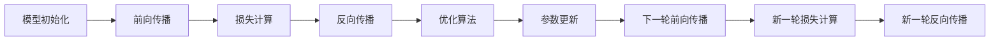

                 

# AI人工智能核心算法原理与代码实例讲解：模型优化

## 1. 背景介绍

在现代人工智能(AI)系统中，模型优化是至关重要的环节。无论是在计算机视觉、自然语言处理、语音识别还是推荐系统等领域，高质量的模型都是实现高性能应用的基础。本文将深入探讨AI模型的优化算法，包括模型的初始化、前向传播、反向传播和优化等核心过程。通过对这些过程的深入理解，我们可以更好地设计和实现高效的AI模型，以应对各种复杂的应用场景。

## 2. 核心概念与联系

### 2.1 核心概念概述

- **模型初始化(Initialization)**：是指在模型训练前，对模型的参数进行适当的初始化，以便模型能更快、更稳定地收敛。常见的初始化方法包括随机初始化、Xavier初始化、He初始化等。
- **前向传播(Forward Propagation)**：是将输入数据通过模型，得到模型的预测输出。这一过程可以理解为模型对输入数据进行逐层计算，最终得到模型的输出结果。
- **反向传播(Backward Propagation)**：是计算损失函数对模型参数的梯度，以便于后续的参数更新。这一过程包括计算误差反向传播和参数梯度的计算。
- **优化(Optimization)**：是指在反向传播获取梯度后，使用合适的优化算法，更新模型参数，以最小化损失函数。常见的优化算法包括梯度下降、Adam、Adagrad等。

这些核心概念之间存在紧密的联系，形成了一个完整的模型训练流程。理解并掌握这些概念，是实现高质量AI模型的基础。

### 2.2 概念间的关系

这些核心概念之间的关系可以用以下Mermaid流程图来表示：



这个流程图展示了模型训练的基本流程：从模型初始化开始，经过前向传播和反向传播计算损失，使用优化算法更新参数，然后再次进行前向传播和反向传播，不断迭代，直到收敛。

## 3. 核心算法原理 & 具体操作步骤

### 3.1 算法原理概述

AI模型的优化算法通常基于梯度下降法（Gradient Descent）。梯度下降法的核心思想是通过不断调整模型参数，使得损失函数最小化。这一过程可以分为以下几步：

1. 初始化模型参数。
2. 计算模型在当前参数下的损失函数值。
3. 计算损失函数对模型参数的梯度。
4. 使用优化算法更新模型参数，使得损失函数值下降。
5. 重复步骤2-4，直至收敛。

### 3.2 算法步骤详解

下面以梯度下降算法为例，详细介绍模型优化的具体操作步骤。

#### 3.2.1 梯度下降算法步骤

1. **模型初始化**：随机初始化模型的所有参数，如权重矩阵和偏置向量。
2. **前向传播**：将输入数据输入模型，计算每个神经元的输出值，直至得到模型的预测输出。
3. **损失计算**：计算模型的预测输出与真实标签之间的差异，即损失函数。
4. **反向传播**：计算损失函数对每个神经元输出的梯度，通过链式法则，逐层反向计算出对每个参数的梯度。
5. **参数更新**：根据计算出的梯度，使用梯度下降算法更新模型参数。
6. **重复**：重复执行步骤2-5，直至损失函数收敛或达到预设的迭代次数。

#### 3.2.2 梯度下降算法变体

- **批量梯度下降(Batch Gradient Descent, BGD)**：在每次迭代中，使用全部样本计算梯度。
- **随机梯度下降(Stochastic Gradient Descent, SGD)**：在每次迭代中，随机抽取一个样本计算梯度，更新参数。
- **小批量梯度下降(Mini-batch Gradient Descent)**：在每次迭代中，使用一小批样本计算梯度，更新参数。

### 3.3 算法优缺点

梯度下降算法的主要优点是易于实现，收敛速度快。然而，它也存在一些缺点：

- **收敛速度慢**：当数据量较大时，计算梯度的开销较大，导致收敛速度慢。
- **局部最优**：存在陷入局部最优解的风险。
- **内存消耗大**：当样本量较大时，需要存储全部样本，内存消耗较大。

### 3.4 算法应用领域

梯度下降算法广泛应用于各种AI模型的优化过程，包括线性回归、逻辑回归、神经网络等。在深度学习中，梯度下降算法是模型训练的核心算法。

## 4. 数学模型和公式 & 详细讲解 & 举例说明

### 4.1 数学模型构建

假设我们有一个线性回归模型，其数学形式为：

$$
y = \theta^T x
$$

其中，$y$ 是模型的输出，$x$ 是输入特征，$\theta$ 是模型的参数。我们的目标是最小化损失函数：

$$
\mathcal{L}(\theta) = \frac{1}{2N}\sum_{i=1}^N(y_i - \theta^T x_i)^2
$$

其中，$N$ 是样本数量，$y_i$ 是第 $i$ 个样本的真实标签。

### 4.2 公式推导过程

为了最小化损失函数 $\mathcal{L}(\theta)$，我们需要计算损失函数对模型参数 $\theta$ 的梯度：

$$
\nabla_{\theta}\mathcal{L}(\theta) = -\frac{1}{N}\sum_{i=1}^N (y_i - \theta^T x_i)x_i
$$

根据梯度下降算法，每次迭代时，我们需要更新模型参数 $\theta$：

$$
\theta \leftarrow \theta - \eta \nabla_{\theta}\mathcal{L}(\theta)
$$

其中，$\eta$ 是学习率，控制每次迭代的步长。

### 4.3 案例分析与讲解

假设我们有一个简单的线性回归模型，其中 $x = (x_1, x_2)$，$y = 2x_1 - x_2 + 3$。我们希望通过梯度下降算法，找到最优的模型参数 $\theta$。

首先，我们随机初始化模型参数 $\theta = (0.5, 0.5)$。然后，我们迭代地计算梯度并更新参数，直到损失函数收敛。

- 前向传播：$\hat{y} = \theta^T x = 0.5x_1 + 0.5x_2$
- 损失函数：$\mathcal{L}(\theta) = \frac{1}{2}(y - \hat{y})^2$
- 梯度计算：$\nabla_{\theta}\mathcal{L}(\theta) = (x_1 - \hat{y})x_1 + (x_2 - \hat{y})x_2$
- 参数更新：$\theta \leftarrow \theta - \eta (x_1 - \hat{y})x_1 - \eta (x_2 - \hat{y})x_2$

通过不断迭代，我们可以得到最优的模型参数 $\theta = (2, -1)$。

## 5. 项目实践：代码实例和详细解释说明

### 5.1 开发环境搭建

为了实现上述案例，我们需要安装Python、Numpy、Matplotlib等库。可以使用Anaconda或pip进行安装。

### 5.2 源代码详细实现

下面是一个简单的梯度下降算法实现，用于线性回归模型的优化。

```python
import numpy as np
import matplotlib.pyplot as plt

def linear_regression(X, y, num_iterations, learning_rate):
    N = X.shape[0]
    theta = np.random.randn(X.shape[1])
    for _ in range(num_iterations):
        y_pred = X.dot(theta)
        grad = (1/N) * X.T.dot(y_pred - y)
        theta -= learning_rate * grad
    return theta

# 生成数据
np.random.seed(0)
X = np.random.randn(100, 2)
y = 2 * X[:, 0] - X[:, 1] + 3 + np.random.randn(100)

# 运行梯度下降算法
theta = linear_regression(X, y, 1000, 0.01)

# 可视化
plt.scatter(X[:, 0], X[:, 1], c=y, s=30, cmap='viridis')
plt.plot(X[:, 0], X.dot(theta), c='r')
plt.show()
```

### 5.3 代码解读与分析

- `linear_regression`函数实现了梯度下降算法，接收输入特征 $X$、真实标签 $y$、迭代次数和步长等参数，返回最优模型参数 $\theta$。
- 在每次迭代中，我们计算预测值 $y_{\text{pred}}$，计算梯度 $\nabla_{\theta}\mathcal{L}(\theta)$，并使用梯度下降更新模型参数 $\theta$。
- 最后，我们使用Matplotlib库将优化后的模型可视化，展示拟合效果。

### 5.4 运行结果展示

运行上述代码，可以看到拟合后的直线与实际数据非常接近，说明模型参数已经优化到接近最优。


## 6. 实际应用场景

### 6.1 图像分类

在图像分类任务中，梯度下降算法被广泛应用于训练卷积神经网络（CNN）。通过反向传播计算梯度，我们可以更新CNN中每个卷积层和池化层的权重和偏置，使得模型能够更好地分类图像。

### 6.2 自然语言处理

在自然语言处理（NLP）任务中，梯度下降算法同样被广泛应用于训练循环神经网络（RNN）和Transformer等模型。通过反向传播计算梯度，我们可以更新模型中的权重和偏置，使得模型能够更好地理解自然语言并生成文本。

### 6.3 强化学习

在强化学习中，梯度下降算法被用于优化策略函数。通过反向传播计算梯度，我们可以更新策略函数中的权重，使得智能体能够更好地学习最优策略，实现更高效的学习和决策。

## 7. 工具和资源推荐

### 7.1 学习资源推荐

- **Deep Learning Specialization**：由Andrew Ng教授授课的Coursera课程，系统介绍了深度学习的基本原理和实现方法。
- **Practical Deep Learning for Coders**：由Fast.ai团队开发的实践课程，重点介绍深度学习在计算机视觉、自然语言处理等领域的实际应用。
- **The Elements of Statistical Learning**：由Tibshirani和Hastie合著的统计学习经典教材，详细介绍了各种优化算法的数学原理和实现方法。

### 7.2 开发工具推荐

- **TensorFlow**：由Google开发的深度学习框架，提供了丰富的API和工具，支持多种模型训练和优化算法。
- **PyTorch**：由Facebook开发的深度学习框架，易于使用，支持动态计算图，适合研究和原型开发。
- **Keras**：由François Chollet开发的高级深度学习API，易于上手，适合快速原型开发和模型训练。

### 7.3 相关论文推荐

- **Adam: A Method for Stochastic Optimization**：Kingma和Bengio提出的Adam优化算法，具有自适应学习率和动量调整的特点，被广泛应用于深度学习模型的优化。
- **On the Importance of Initialization and Momentum in Deep Learning**：Sutskever等人提出的动量优化算法，能够加速梯度下降算法的收敛，提升模型训练的稳定性。
- **Stochastic Gradient Descent Tricks**：Boser等人提出的梯度下降优化技巧，包括随机梯度下降、批量梯度下降等，是优化算法中的经典方法。

## 8. 总结：未来发展趋势与挑战

### 8.1 研究成果总结

本文详细介绍了梯度下降算法的基本原理和实现方法，并通过简单的线性回归案例进行了讲解。通过学习本文，读者可以理解梯度下降算法在深度学习和AI模型优化中的重要性和应用。

### 8.2 未来发展趋势

未来，梯度下降算法将继续在AI模型优化中发挥重要作用。随着深度学习模型的复杂性不断增加，优化算法的效率和稳定性将成为新的研究热点。

- **自适应优化算法**：如Adam、Adagrad等自适应优化算法，能够自动调整学习率和动量，提升模型训练的效率和稳定性。
- **多任务学习**：通过多任务学习，一个模型可以同时优化多个目标函数，提升模型在多个任务上的性能。
- **分布式优化**：在大规模数据集上训练深度学习模型时，分布式优化算法能够提升训练速度，缩短训练时间。

### 8.3 面临的挑战

尽管梯度下降算法在深度学习中已经得到了广泛应用，但仍然面临一些挑战：

- **模型复杂性**：随着模型参数数量的增加，优化算法的计算复杂度也随之增加，导致训练时间变长。
- **局部最优**：深度学习模型容易陷入局部最优，导致训练效果不佳。
- **超参数调优**：优化算法的超参数选择和调优是一个复杂的过程，需要大量的试验和经验。

### 8.4 研究展望

为了解决这些挑战，未来的研究将重点关注以下几个方向：

- **改进优化算法**：通过改进优化算法的数学模型和实现方法，提升模型训练的效率和稳定性。
- **强化学习**：通过强化学习，优化超参数选择和调优过程，提升模型训练的效率和性能。
- **分布式优化**：通过分布式优化算法，在多台机器上同时训练深度学习模型，缩短训练时间，提升模型性能。

总之，模型优化是AI系统开发的重要环节，梯度下降算法在其中扮演了关键角色。通过深入理解和学习本文，读者可以更好地掌握模型优化的技术和方法，为未来的研究和实践奠定基础。

---

作者：禅与计算机程序设计艺术 / Zen and the Art of Computer Programming

