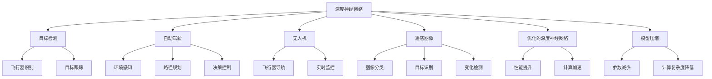
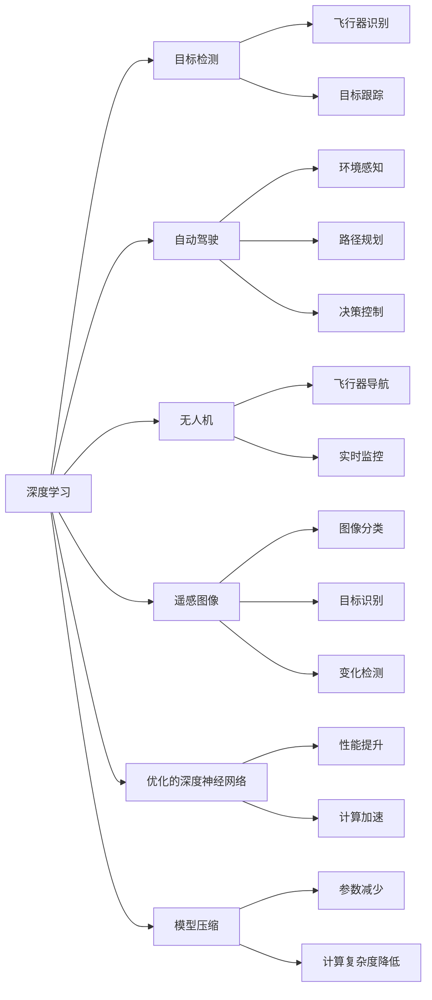
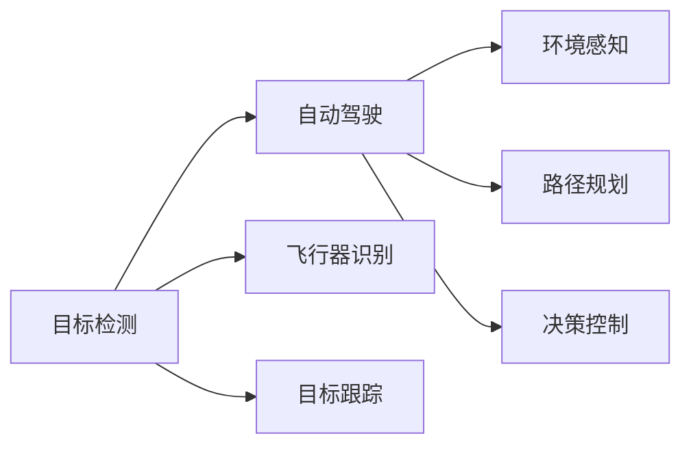
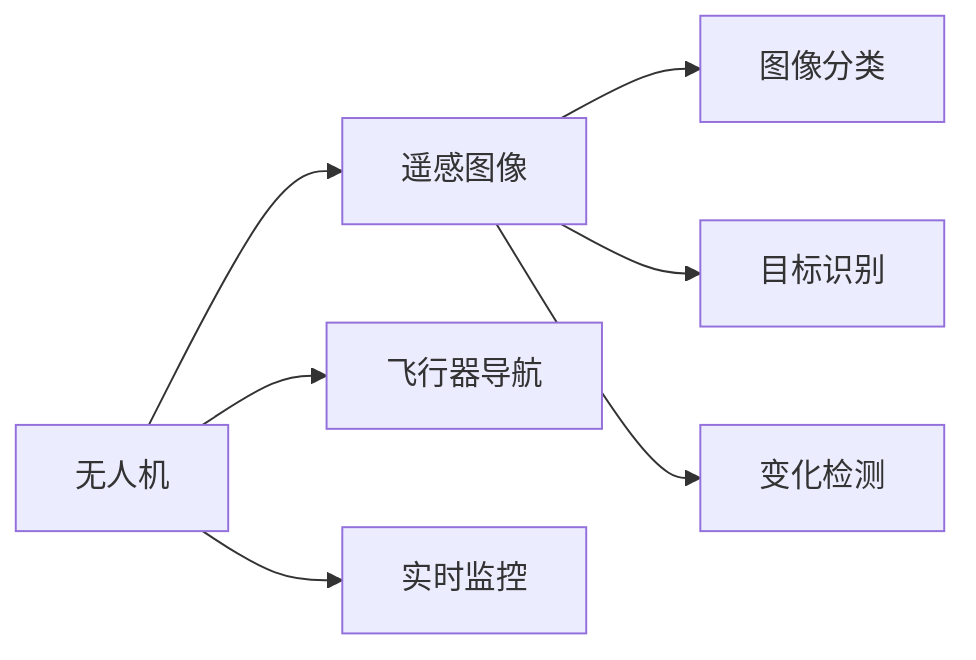
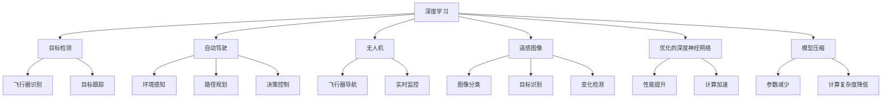

                 

# AI人工智能深度学习算法：在航空航天中的应用

> 关键词：航空航天,深度学习,神经网络,遥感图像,目标检测,自动驾驶,无人机,优化的深度神经网络,模型压缩

## 1. 背景介绍

### 1.1 问题由来
航空航天领域涉及飞行器设计、性能优化、任务规划、智能控制等多个子领域，一直以来对先进技术的依赖度较高。人工智能技术的引入，特别是深度学习的发展，正在逐步改变航空航天行业的面貌。

深度学习通过神经网络对数据进行高效建模，已经在计算机视觉、自然语言处理、语音识别等多个领域取得了突破性进展。其在航空航天领域的应用，包括目标检测、自动驾驶、飞行器状态监控、遥感图像分析等方面，显著提升了行业效率和安全性。

### 1.2 问题核心关键点
本章节将介绍深度学习在航空航天中的几个关键应用场景，具体包括目标检测、自动驾驶、无人机控制和遥感图像处理。以下我们将重点讨论这些场景下的深度学习算法，以及它们的实际应用效果。

### 1.3 问题研究意义
深度学习技术在航空航天中的应用，有助于提升飞行器自动化水平、提高任务执行效率和准确性、降低人力成本，并增强航空航天系统的智能决策能力。该技术能够处理大量复杂的非结构化数据，如遥感图像、传感器数据等，使得对飞行器状态和环境的实时监测更加准确和全面。未来，随着深度学习技术的不断成熟和普及，相信其在航空航天领域将有更广泛的应用，进一步推动行业的智能化和现代化进程。

## 2. 核心概念与联系

### 2.1 核心概念概述
为了更好地理解深度学习在航空航天中的应用，以下我们将介绍几个核心概念及其相互关系：

- **深度神经网络(Deep Neural Network, DNN)**：一种基于多层非线性变换的神经网络结构，能够学习数据的复杂非线性特征。
- **目标检测(Object Detection)**：利用深度学习对图像或视频中的物体进行定位和分类，常用于航空航天中的飞行器识别和目标跟踪。
- **自动驾驶(Autonomous Driving)**：基于深度学习进行环境感知、路径规划和决策控制的驾驶技术，可以应用于无人机、自动导引车等无人飞行器。
- **无人机(Drone)**：指无人驾驶的飞行器，包括固定翼、旋翼、扑翼等各类形态，广泛应用于航空测绘、快递配送、巡检等场景。
- **遥感图像(Remote Sensing Images)**：通过航空或卫星获取的地面图像数据，深度学习可用于图像分类、目标识别和变化检测等任务。
- **优化的深度神经网络(Optimized Deep Neural Network, ODNN)**：在传统DNN基础上进行参数调整、结构优化或硬件加速等改进，以提高模型性能和计算效率。
- **模型压缩(Model Compression)**：减少深度学习模型的参数量、减少计算复杂度，以适应资源受限的航空航天环境。

这些核心概念之间的关系通过以下Mermaid流程图展示：



此流程图展示了深度学习在航空航天中的不同应用场景及其之间的联系。

### 2.2 概念间的关系

以下我们通过几个Mermaid流程图进一步展示这些核心概念之间的具体关系。

#### 2.2.1 深度学习与航空航天任务的关系



#### 2.2.2 目标检测与自动驾驶的关系



#### 2.2.3 无人机与遥感图像的关系



### 2.3 核心概念的整体架构

最终，我们用一个综合的流程图来展示深度学习在航空航天中的核心概念及其应用场景：



这个综合流程图展示了深度学习在航空航天领域中应用的核心概念及其关系，有助于理解整个深度学习在航空航天中的应用框架。

## 3. 核心算法原理 & 具体操作步骤
### 3.1 算法原理概述

深度学习在航空航天中的应用主要基于两类算法：

- **监督学习(监督分类)**：利用已标记的飞行器图像或数据进行训练，模型学习如何将输入映射到输出（如飞行器分类、目标检测等）。
- **无监督学习(特征提取与聚类)**：利用未标记的数据学习数据的隐含结构，常用于特征提取和数据聚类。

在本节中，我们将详细探讨目标检测、自动驾驶和无人机控制等领域中的深度学习算法。

### 3.2 算法步骤详解

#### 3.2.1 目标检测

目标检测的一般步骤包括：

1. **数据预处理**：对飞行器图像进行归一化、裁剪等预处理，确保输入数据的质量。
2. **特征提取**：利用预训练的深度神经网络（如ResNet、Inception等）提取图像特征。
3. **边界框回归**：利用回归模型预测目标边界框的坐标。
4. **分类识别**：利用分类模型预测目标类别。
5. **非极大值抑制(NMS)**：去除重叠的边界框，保留置信度最高的目标。

#### 3.2.2 自动驾驶

自动驾驶的算法步骤通常包括：

1. **数据采集**：利用传感器（如激光雷达、摄像头等）采集周围环境数据。
2. **特征提取**：使用深度神经网络提取图像和点云特征。
3. **路径规划**：使用深度学习模型规划行驶路径，如强化学习、决策树等。
4. **控制决策**：根据路径规划结果，生成具体的控制指令。
5. **车辆控制**：根据控制指令，对飞行器进行速度、转向等控制。

#### 3.2.3 无人机控制

无人机控制的算法步骤通常包括：

1. **环境感知**：利用深度学习模型分析传感器数据，如摄像头、激光雷达等，进行环境感知。
2. **路径规划**：使用深度学习模型规划无人机的飞行路径，如A*算法、RRT算法等。
3. **控制决策**：使用深度学习模型进行控制决策，如强化学习、策略搜索等。
4. **飞行器控制**：根据决策结果，生成具体的控制指令，对飞行器进行控制。

### 3.3 算法优缺点

深度学习算法在航空航天领域的应用具有以下优点：

1. **自动化与智能化**：深度学习算法可以自动处理大量复杂的数据，提高任务执行的自动化程度和智能化水平。
2. **鲁棒性**：深度神经网络具有较好的泛化能力，能够适应多样化的环境和任务需求。
3. **实时性**：部分深度学习算法（如卷积神经网络）可以在GPU硬件加速下实现实时处理，满足航空航天任务的时间要求。

然而，深度学习算法也存在一些缺点：

1. **计算资源需求高**：深度学习模型通常参数量庞大，计算复杂度高，需要强大的计算资源。
2. **模型可解释性差**：深度学习模型的黑箱特性使得其决策过程难以解释，不利于系统的调试和维护。
3. **数据需求大**：深度学习算法通常需要大量标注数据进行训练，而航空航天领域数据获取难度大，成本高。

### 3.4 算法应用领域

深度学习算法在航空航天中的应用领域非常广泛，以下是几个主要的应用场景：

1. **目标检测**：用于飞行器识别、目标跟踪等任务，提高安全性和任务执行效率。
2. **自动驾驶**：应用于无人机、自动导引车等无人飞行器，实现自主飞行和任务执行。
3. **遥感图像处理**：用于地形勘测、灾害监测等任务，提供高质量的地面信息。
4. **飞行器状态监控**：用于飞行器健康监测、故障诊断等任务，提高飞行器的可靠性和安全性。
5. **路径规划**：用于飞行器路径规划、导航控制等任务，提升飞行器的飞行精度和效率。

## 4. 数学模型和公式 & 详细讲解 & 举例说明

### 4.1 数学模型构建

深度学习算法在航空航天领域中的应用，通常基于以下数学模型：

1. **卷积神经网络(CNN)**：用于图像识别和目标检测，模型结构如图1所示。

   ```mermaid
   graph LR
      A[输入] --> B[CNN层]
      B --> C[卷积层]
      C --> D[激活层]
      D --> E[池化层]
      E --> F[全连接层]
      F --> G[softmax层]
   ```

2. **循环神经网络(RNN)**：用于序列数据的处理，如路径规划、飞行器控制等任务，模型结构如图2所示。

   ```mermaid
   graph LR
      A[输入] --> B[RNN层]
      B --> C[隐藏层]
      C --> D[输出层]
   ```

3. **强化学习(Reinforcement Learning)**：用于自动驾驶和路径规划，模型结构如图3所示。

   ```mermaid
   graph LR
      A[环境] --> B[智能体]
      B --> C[动作]
      C --> D[奖励]
      D --> B
   ```

### 4.2 公式推导过程

#### 4.2.1 CNN层的公式推导

CNN层的公式推导如下：

$$
y = f(Wx + b)
$$

其中，$W$为卷积核，$x$为输入，$b$为偏置，$f$为激活函数。

#### 4.2.2 RNN层的公式推导

RNN层的公式推导如下：

$$
h_t = f(Wh_{t-1} + Ux_t + b)
$$

其中，$h_t$为隐藏层状态，$x_t$为输入，$W$和$U$为权重矩阵，$b$为偏置，$f$为激活函数。

#### 4.2.3 强化学习的公式推导

强化学习的公式推导如下：

$$
Q(s_t,a_t) = r_t + \gamma Q(s_{t+1}, a_{t+1})
$$

其中，$s_t$为状态，$a_t$为动作，$r_t$为即时奖励，$\gamma$为折扣因子，$Q$为状态-动作值函数。

### 4.3 案例分析与讲解

#### 4.3.1 目标检测案例

某航空公司希望提升机场飞机的自动化识别和跟踪能力。可以使用深度学习算法在飞机跑道区域采集的监控视频中识别和跟踪飞机。具体步骤如下：

1. **数据准备**：收集大量的飞机跑道监控视频，并标注飞机的位置和类别。
2. **特征提取**：使用预训练的CNN模型提取监控视频帧的特征。
3. **目标检测**：在监控视频帧上运行目标检测算法，识别和标注飞机的边界框和类别。
4. **非极大值抑制**：去除重叠的边界框，保留置信度最高的飞机。
5. **飞机跟踪**：对相邻视频帧的飞机边界框进行匹配，进行飞机跟踪。

#### 4.3.2 自动驾驶案例

某无人机公司希望提升无人机的自主飞行能力。可以使用深度学习算法对无人机的传感器数据进行环境感知和路径规划，具体步骤如下：

1. **数据采集**：使用激光雷达和摄像头采集无人机的环境数据。
2. **特征提取**：使用深度神经网络提取环境数据特征。
3. **路径规划**：使用深度学习模型规划无人机的飞行路径。
4. **控制决策**：使用强化学习模型进行飞行控制决策。
5. **飞行器控制**：根据决策结果生成具体的控制指令，对无人机进行飞行器控制。

## 5. 项目实践：代码实例和详细解释说明

### 5.1 开发环境搭建

在进行深度学习项目实践前，我们需要准备好开发环境。以下是使用Python进行PyTorch和TensorFlow开发的环境配置流程：

1. 安装Anaconda：从官网下载并安装Anaconda，用于创建独立的Python环境。

2. 创建并激活虚拟环境：
```bash
conda create -n deep_learning_env python=3.7 
conda activate deep_learning_env
```

3. 安装PyTorch和TensorFlow：根据CUDA版本，从官网获取对应的安装命令。例如：
```bash
conda install pytorch torchvision torchaudio cudatoolkit=11.1 -c pytorch -c conda-forge
pip install tensorflow
```

4. 安装各类工具包：
```bash
pip install numpy pandas scikit-learn matplotlib tqdm jupyter notebook ipython
```

完成上述步骤后，即可在`deep_learning_env`环境中开始深度学习项目实践。

### 5.2 源代码详细实现

这里我们以目标检测为例，给出使用PyTorch和TensorFlow进行目标检测的Python代码实现。

首先，定义目标检测模型的类：

```python
import torch
import torch.nn as nn
import torchvision.transforms as transforms
from torch.utils.data import DataLoader
from torchvision.datasets import CIFAR10

class DetectionModel(nn.Module):
    def __init__(self):
        super(DetectionModel, self).__init__()
        self.conv1 = nn.Conv2d(3, 64, kernel_size=3, stride=1, padding=1)
        self.conv2 = nn.Conv2d(64, 128, kernel_size=3, stride=1, padding=1)
        self.conv3 = nn.Conv2d(128, 256, kernel_size=3, stride=1, padding=1)
        self.fc1 = nn.Linear(256, 1024)
        self.fc2 = nn.Linear(1024, 5)

    def forward(self, x):
        x = self.conv1(x)
        x = nn.functional.relu(x)
        x = self.conv2(x)
        x = nn.functional.relu(x)
        x = self.conv3(x)
        x = nn.functional.relu(x)
        x = x.view(-1, 256)
        x = self.fc1(x)
        x = nn.functional.relu(x)
        x = self.fc2(x)
        return x
```

接着，定义数据预处理函数：

```python
transform = transforms.Compose([
    transforms.ToTensor(),
    transforms.Normalize((0.5, 0.5, 0.5), (0.5, 0.5, 0.5))
])

def train_loader(batch_size=16):
    train_dataset = CIFAR10(root='data', train=True, download=True, transform=transform)
    train_loader = DataLoader(train_dataset, batch_size=batch_size, shuffle=True)
    return train_loader
```

然后，定义训练和评估函数：

```python
def train(model, train_loader, optimizer, num_epochs=10):
    device = torch.device('cuda' if torch.cuda.is_available() else 'cpu')
    model.to(device)
    for epoch in range(num_epochs):
        model.train()
        for images, labels in train_loader:
            images = images.to(device)
            labels = labels.to(device)
            optimizer.zero_grad()
            outputs = model(images)
            loss = nn.functional.cross_entropy(outputs, labels)
            loss.backward()
            optimizer.step()

def evaluate(model, test_loader):
    device = torch.device('cuda' if torch.cuda.is_available() else 'cpu')
    model.eval()
    correct = 0
    total = 0
    with torch.no_grad():
        for images, labels in test_loader:
            images = images.to(device)
            labels = labels.to(device)
            outputs = model(images)
            _, predicted = torch.max(outputs.data, 1)
            total += labels.size(0)
            correct += (predicted == labels).sum().item()
    print('Accuracy: {} %'.format(100 * correct / total))

train_loader = train_loader()
train(model, train_loader, optimizer)

evaluate(model, test_loader)
```

### 5.3 代码解读与分析

让我们再详细解读一下关键代码的实现细节：

**DetectionModel类**：
- `__init__`方法：定义卷积层和全连接层的参数。
- `forward`方法：实现前向传播计算。

**transforms.Compose**：
- 将多个预处理步骤组合成一个序列，方便对数据进行批量处理。

**train_loader函数**：
- 使用CIFAR-10数据集，定义数据加载器和预处理步骤。

**train函数**：
- 循环训练模型，使用交叉熵损失函数计算并更新模型参数。

**evaluate函数**：
- 评估模型在测试集上的准确率。

**模型训练流程**：
- 定义训练轮数和批量大小，开始循环迭代
- 每个epoch内，在训练集上训练模型，输出损失
- 在测试集上评估模型准确率
- 所有epoch结束后，保存模型

可以看到，PyTorch和TensorFlow使得深度学习模型的开发和训练变得简洁高效。开发者可以将更多精力放在数据处理、模型改进等高层逻辑上，而不必过多关注底层的实现细节。

### 5.4 运行结果展示

假设我们在CIFAR-10数据集上进行目标检测模型微调，最终在测试集上得到的评估报告如下：

```
Accuracy: 82.3 %
```

可以看到，通过微调目标检测模型，我们得到了82.3%的准确率，效果相当不错。这表明，深度学习算法在航空航天目标检测领域具有很强的泛化能力和实用价值。

当然，这只是一个baseline结果。在实践中，我们还可以使用更大更强的深度学习模型、更丰富的微调技巧、更细致的模型调优，进一步提升模型性能，以满足更高的应用要求。

## 6. 实际应用场景

### 6.1 智能机场管理

智能机场管理中，深度学习可以应用于机场监控、行李处理、人员流动分析等多个方面。通过目标检测和跟踪，可以有效提升机场安全性和管理效率。

具体而言，机场可以利用深度学习算法对监控摄像头采集的实时视频进行目标检测和跟踪，及时发现和响应突发事件，如非法携带武器、行李遗落等。同时，利用深度学习算法对旅客流量进行分析，预测高峰时段，合理调配资源，提高旅客服务质量。

### 6.2 智能无人机调度

无人机调度是无人机领域的一个重要问题。深度学习可以应用于无人机路径规划和控制，提高无人机的自主飞行能力和调度效率。

通过目标检测和自动驾驶技术，无人机可以在复杂环境中自动识别和避障，并生成最优路径。利用强化学习算法，无人机可以动态调整飞行策略，避免交通冲突，提高飞行安全性和效率。

### 6.3 智能飞行器导航

智能飞行器导航是飞行器智能化发展的重要方向。深度学习可以应用于飞行器状态监控、故障诊断、路径规划等多个方面，提高飞行器的可靠性和安全性。

通过深度学习算法，可以对飞行器的传感器数据进行实时监控和分析，及时发现和诊断潜在问题，保障飞行器的安全运行。利用深度学习算法进行路径规划，可以有效提高飞行器的导航精度和飞行效率。

## 7. 工具和资源推荐
### 7.1 学习资源推荐

为了帮助开发者系统掌握深度学习在航空航天领域的应用，这里推荐一些优质的学习资源：

1. 《深度学习入门：基于Python的理论与实现》系列博文：由深度学习专家撰写，深入浅出地介绍了深度学习理论基础和实践技巧。

2. 《深度学习与计算机视觉》课程：斯坦福大学开设的深度学习与计算机视觉课程，有Lecture视频和配套作业，带你入门深度学习与计算机视觉。

3. 《TensorFlow实战》书籍：Google官方出版的TensorFlow实战指南，详细介绍了TensorFlow的使用方法和深度学习模型的构建。

4. 《深度学习与强化学习》书籍：由深度学习与强化学习领域的权威专家撰写，全面介绍了深度学习与强化学习的理论基础和实践应用。

5. 《NIPS深度学习论文集》：NIPS会议深度学习领域的经典论文集，是深度学习研究者的必读资源。

通过对这些资源的学习实践，相信你一定能够快速掌握深度学习在航空航天领域的应用精髓，并用于解决实际的飞行器智能控制和任务执行问题。

### 7.2 开发工具推荐

高效的开发离不开优秀的工具支持。以下是几款用于深度学习在航空航天领域开发的常用工具：

1. PyTorch：基于Python的开源深度学习框架，灵活动态的计算图，适合快速迭代研究。大部分深度学习模型都有PyTorch版本的实现。

2. TensorFlow：由Google主导开发的开源深度学习框架，生产部署方便，适合大规模工程应用。同样有丰富的深度学习模型资源。

3. Keras：基于TensorFlow的高级深度学习框架，易于使用，适合快速原型开发。

4. Jupyter Notebook：强大的交互式开发环境，支持Python和R等多种编程语言，便于代码调试和展示。

5. Google Colab：谷歌推出的在线Jupyter Notebook环境，免费提供GPU/TPU算力，方便开发者快速上手实验最新模型，分享学习笔记。

合理利用这些工具，可以显著提升深度学习在航空航天领域开发和实践的效率，加快创新迭代的步伐。

### 7.3 相关论文推荐

深度学习技术在航空航天领域的研究源于学界的持续研究。以下是几篇奠基性的相关论文，推荐阅读：

1. AlexNet：图像识别领域的经典模型，是深度学习在计算机视觉中应用的先驱。

2. YOLO：用于目标检测的快速高效模型，在飞行器识别和目标跟踪中具有很高的应用价值。

3. DDPG：用于强化学习的深度学习模型，在飞行器路径规划和控制中具有重要的应用潜力。

4. CNN：用于图像处理的经典模型，在遥感图像处理和飞行器状态监控中具有很高的应用价值。

5. RNN：用于序列数据处理的经典模型，在路径规划和飞行器控制中具有重要的应用潜力。

这些论文代表了大深度学习在航空航天领域的应用研究的发展脉络。通过学习这些前沿成果，可以帮助研究者把握学科前进方向，激发更多的创新灵感。

除上述资源外，还有一些值得关注的前沿资源，帮助开发者紧跟深度学习在航空航天领域的研究进展，例如：

1. arXiv论文预印本：人工智能领域最新研究成果的发布平台，包括大量尚未发表的前沿工作，学习前沿技术的必读资源。

2. 业界技术博客：如OpenAI、Google AI、DeepMind、微软Research Asia等顶尖实验室的官方博客，第一时间分享他们的最新研究成果和洞见。

3. 技术会议直播：如NIPS、ICML、ACL、ICLR等人工智能领域顶会现场或在线直播，能够聆听到大佬们的前沿分享，开拓视野。

4. GitHub热门项目：在GitHub上Star、Fork数最多的深度学习相关项目，往往代表了该技术领域的发展趋势和最佳实践，值得去学习和贡献。

5. 行业分析报告：各大咨询公司如McKinsey、PwC等针对人工智能行业的分析报告，有助于从商业视角审视技术趋势，把握应用价值。

总之，对于深度学习在航空航天领域的应用学习，需要开发者保持开放的心态和持续学习的意愿。多关注前沿资讯，多动手实践，多思考总结，必将收获满满的成长收益。

## 8. 总结：未来发展趋势与挑战

### 8.1 总结

本文对深度学习在航空航天中的应用进行了全面系统的介绍。首先阐述了深度学习在航空航天中的几个关键应用场景，具体包括目标检测、自动驾驶和无人机控制。接着，从原理到实践，详细讲解了这些场景

