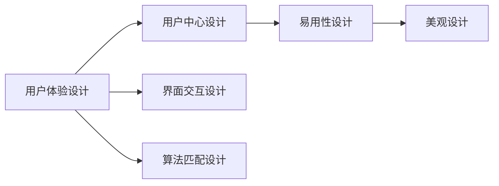

                 

# AI创业公司的用户体验设计原则：以用户为中心、简单易用与美观

> 关键词：人工智能,用户体验设计,用户中心,易用性,美观,创业公司

## 1. 背景介绍

随着人工智能技术的发展，越来越多的创业公司开始将AI融入到产品和服务中，以提升用户体验。然而，AI技术本身只是工具，用户体验的设计才是真正决定产品成败的关键。本文将探讨在AI创业公司的用户体验设计中，如何以用户为中心，实现简单易用和美观的设计原则。

### 1.1 问题由来
人工智能技术的应用，已经从单一的自动化流程扩展到智能推荐、智能客服、智能分析等多个领域。这些应用极大地提升了效率和准确性，但同时也带来了新的用户体验挑战。如何设计一个既智能又易用、美观的AI产品，成为了AI创业公司面临的首要问题。

### 1.2 问题核心关键点
用户体验设计（User Experience Design, UX）的核心目标是提升用户满意度、提升产品使用频率和增强品牌忠诚度。AI技术的应用，使得用户体验设计更加复杂，需要考虑算法、界面、交互等多个维度。

具体而言，用户体验设计的关键点包括：
- 用户需求分析：理解用户痛点，设计满足需求的功能。
- 界面交互设计：设计简洁易用的界面，提升用户体验。
- 算法匹配设计：选择适当的算法，实现精准推荐或预测。
- 视觉设计：采用美观的设计风格，增强用户情感共鸣。

## 2. 核心概念与联系

### 2.1 核心概念概述

为了更好地理解如何以用户为中心，实现简单易用和美观的设计原则，本节将介绍几个密切相关的核心概念：

- **用户体验设计（UX）**：通过研究用户与产品的交互方式，提升用户满意度和使用效率，从而提升产品价值。
- **用户中心设计（UCD）**：以用户需求和体验为中心，设计产品的各个方面，确保产品符合用户期望。
- **易用性设计（Usability）**：通过简化操作流程，提升用户的使用体验，使产品更加直观和易用。
- **美观设计（Aesthetics）**：通过视觉设计提升产品的美观度，增强用户的情感共鸣和品牌认同感。

这些核心概念共同构成了用户体验设计的整体框架，使得设计过程更加系统化和科学化。

### 2.2 概念间的关系

这些核心概念之间的关系可以通过以下Mermaid流程图来展示：



这个流程图展示了一个完整的用户体验设计流程：

1. 以用户为中心，设计符合用户需求的功能。
2. 界面交互设计，提升操作的直观性和易用性。
3. 选择适当的算法，实现精准的预测或推荐。
4. 采用美观的设计风格，增强用户情感共鸣。

这些概念之间相互依存，共同构建了用户体验设计的全貌。

## 3. 核心算法原理 & 具体操作步骤
### 3.1 算法原理概述

用户体验设计的核心是用户需求和体验，而算法则是实现这一目标的手段。AI技术的应用，使得用户体验设计更加复杂，需要考虑算法、界面、交互等多个维度。

在用户体验设计中，常用的算法包括：
- 推荐算法：通过分析用户历史行为和兴趣，实现个性化推荐。
- 预测算法：根据用户输入的特征，预测用户的行为或偏好。
- 分类算法：对用户输入的文本进行分类，实现自动问答或情感分析。

这些算法需要结合用户需求和界面设计，才能实现最佳的用户体验。

### 3.2 算法步骤详解

用户体验设计的具体步骤包括：
1. **需求分析**：通过问卷调查、用户访谈等方式，了解用户需求和痛点。
2. **功能设计**：根据用户需求，设计符合用户期望的功能。
3. **界面设计**：设计简洁易用的界面，提升用户的使用体验。
4. **算法设计**：选择适当的算法，实现精准的推荐或预测。
5. **视觉设计**：采用美观的设计风格，增强用户情感共鸣。

以下是详细的操作步骤：

#### 3.2.1 需求分析
需求分析是用户体验设计的第一步，通过问卷调查、用户访谈等方式，了解用户需求和痛点。以下是具体步骤：
1. **问卷调查**：设计问卷，通过在线平台或电话调查，收集用户的基本信息、使用习惯和需求。
2. **用户访谈**：选择代表性用户进行深度访谈，了解其使用场景和真实需求。
3. **用户画像**：根据调研数据，创建用户画像，定义目标用户群体的特征和需求。

#### 3.2.2 功能设计
功能设计需要紧密结合用户需求和业务目标，设计符合用户期望的功能。以下是具体步骤：
1. **功能定义**：根据用户需求和业务目标，定义核心功能和附加功能。
2. **功能实现**：确定功能的实现方式，包括前端开发、后端算法等。
3. **功能迭代**：根据用户反馈，不断优化和迭代功能设计。

#### 3.2.3 界面设计
界面设计需要简洁易用，提升用户的使用体验。以下是具体步骤：
1. **界面布局**：设计合理的界面布局，使界面整洁有序。
2. **操作流程**：简化操作步骤，提升用户的操作效率。
3. **交互设计**：设计直观易懂的交互方式，减少用户的学习成本。

#### 3.2.4 算法设计
算法设计需要选择合适的算法，实现精准的推荐或预测。以下是具体步骤：
1. **算法选择**：根据业务需求，选择适当的算法，如推荐算法、预测算法等。
2. **算法实现**：实现算法的模型训练、评估和预测。
3. **算法优化**：根据业务需求和用户反馈，不断优化算法。

#### 3.2.5 视觉设计
视觉设计需要采用美观的设计风格，增强用户情感共鸣。以下是具体步骤：
1. **色彩搭配**：选择符合品牌定位的色彩搭配，增强用户的情感共鸣。
2. **字体选择**：选择易读、美观的字体，提升用户的阅读体验。
3. **图标设计**：设计简洁、美观的图标，增强用户的视觉吸引力。

### 3.3 算法优缺点

用户体验设计的核心算法主要包括推荐算法、预测算法和分类算法。以下是这些算法的优缺点：

#### 推荐算法
- **优点**：可以实现个性化推荐，提升用户满意度和使用频率。
- **缺点**：对数据质量和用户行为数据的依赖较高，推荐效果受限于数据量。

#### 预测算法
- **优点**：可以实现精准预测，提高决策的准确性。
- **缺点**：模型复杂度较高，需要较大的计算资源和数据量。

#### 分类算法
- **优点**：可以实现自动问答、情感分析等功能，提升用户体验。
- **缺点**：对文本数据的处理和模型训练要求较高，容易出现错误分类。

### 3.4 算法应用领域

用户体验设计中的算法，可以应用于多个领域，包括：

- **智能推荐**：通过分析用户历史行为和兴趣，实现个性化推荐。如电商平台、视频网站等。
- **智能客服**：通过自然语言处理技术，实现自动问答和情感分析。如银行客服、电商客服等。
- **智能分析**：通过数据分析和预测技术，实现用户行为分析、风险预警等。如金融、医疗等。
- **智能决策**：通过决策算法，实现业务决策的自动化和智能化。如金融交易、保险理赔等。

## 4. 数学模型和公式 & 详细讲解 & 举例说明

### 4.1 数学模型构建

在用户体验设计中，常见的数学模型包括推荐模型、预测模型和分类模型。以下是这些模型的构建方法：

#### 推荐模型
推荐模型通过分析用户历史行为和兴趣，实现个性化推荐。常用的推荐算法包括协同过滤、矩阵分解等。

$$
R_{ui} = \alpha + \sum_{j=1}^{n} \beta_j \cdot P_{uij}
$$

其中，$R_{ui}$ 表示用户 $u$ 对商品 $i$ 的评分，$\alpha$ 和 $\beta_j$ 为模型参数，$P_{uij}$ 为用户 $u$ 对商品 $i$ 的兴趣度。

#### 预测模型
预测模型通过分析用户输入的特征，预测用户的行为或偏好。常用的预测算法包括线性回归、决策树等。

$$
y = \beta_0 + \sum_{i=1}^{n} \beta_i \cdot x_i
$$

其中，$y$ 为预测值，$\beta_0$ 和 $\beta_i$ 为模型参数，$x_i$ 为输入特征。

#### 分类模型
分类模型通过分析用户输入的文本，实现自动问答或情感分析。常用的分类算法包括朴素贝叶斯、支持向量机等。

$$
P(Y|X) = \frac{P(Y)P(X|Y)}{P(X)}
$$

其中，$P(Y|X)$ 为分类概率，$P(Y)$ 为先验概率，$P(X|Y)$ 为条件概率。

### 4.2 公式推导过程

以下是推荐模型和分类模型的公式推导过程：

#### 推荐模型
推荐模型通过协同过滤算法实现个性化推荐，具体推导如下：

1. 用户-商品矩阵 $R_{u\times i}$，表示用户 $u$ 对商品 $i$ 的评分。
2. 用户特征向量 $U_{u\times 1}$，表示用户 $u$ 的兴趣特征。
3. 商品特征向量 $I_{i\times 1}$，表示商品 $i$ 的特征。
4. 预测评分 $R_{ui}$，表示用户 $u$ 对商品 $i$ 的评分。

推导过程如下：

$$
R_{ui} = \alpha + \sum_{j=1}^{n} \beta_j \cdot P_{uij}
$$

其中，$P_{uij}$ 为协同过滤算法的相似度，可以使用余弦相似度或皮尔逊相关系数计算。

#### 分类模型
分类模型通过朴素贝叶斯算法实现文本分类，具体推导如下：

1. 训练数据集 $D=\{(x_i,y_i)\}_{i=1}^{N}$，其中 $x_i$ 为文本，$y_i$ 为分类标签。
2. 先验概率 $P(Y)$，表示各类别的先验概率。
3. 条件概率 $P(X|Y)$，表示在给定类别 $Y$ 的情况下，文本 $X$ 的条件概率。

推导过程如下：

$$
P(Y|X) = \frac{P(Y)P(X|Y)}{P(X)}
$$

其中，$P(X)$ 为文本 $X$ 的先验概率，可以使用词袋模型或TF-IDF计算。

### 4.3 案例分析与讲解

以下是一个具体的案例分析：

假设某电商网站需要实现个性化推荐功能，通过分析用户历史购买行为和评分数据，实现精准推荐。具体步骤如下：

1. **需求分析**：通过问卷调查和用户访谈，了解用户需求和痛点。
2. **功能设计**：设计个性化推荐功能，根据用户兴趣推荐相关商品。
3. **界面设计**：设计简洁易用的界面，使用户能够快速浏览推荐商品。
4. **算法设计**：选择协同过滤算法，实现个性化推荐。
5. **视觉设计**：采用符合品牌定位的色彩和图标，增强用户的情感共鸣。

### 5. 项目实践：代码实例和详细解释说明

#### 5.1 开发环境搭建

在进行用户体验设计的项目实践前，我们需要准备好开发环境。以下是使用Python进行PyTorch开发的环境配置流程：

1. 安装Anaconda：从官网下载并安装Anaconda，用于创建独立的Python环境。

2. 创建并激活虚拟环境：
```bash
conda create -n pytorch-env python=3.8 
conda activate pytorch-env
```

3. 安装PyTorch：根据CUDA版本，从官网获取对应的安装命令。例如：
```bash
conda install pytorch torchvision torchaudio cudatoolkit=11.1 -c pytorch -c conda-forge
```

4. 安装Transformers库：
```bash
pip install transformers
```

5. 安装各类工具包：
```bash
pip install numpy pandas scikit-learn matplotlib tqdm jupyter notebook ipython
```

完成上述步骤后，即可在`pytorch-env`环境中开始用户体验设计的实践。

#### 5.2 源代码详细实现

以下是使用PyTorch和Transformer库实现个性化推荐功能的代码实现。

```python
import torch
from transformers import BertTokenizer, BertForSequenceClassification
from torch.utils.data import DataLoader, Dataset
from sklearn.model_selection import train_test_split
import numpy as np
import pandas as pd

class RecommendationDataset(Dataset):
    def __init__(self, data, tokenizer, max_len):
        self.data = data
        self.tokenizer = tokenizer
        self.max_len = max_len

    def __len__(self):
        return len(self.data)

    def __getitem__(self, item):
        title = self.data.iloc[item]['title']
        description = self.data.iloc[item]['description']
        user_id = self.data.iloc[item]['user_id']
        
        encoding = self.tokenizer(title, description, return_tensors='pt', max_length=self.max_len, padding='max_length', truncation=True)
        title_tokens = encoding['input_ids']
        description_tokens = encoding['attention_mask']

        # 将文本转换为向量
        title_vec = title_tokens.to('cpu').numpy()
        description_vec = description_tokens.to('cpu').numpy()
        
        # 将用户ID转换为向量
        user_id_vec = np.array([user_id], dtype=np.int64)
        
        return {
            'inputs': title_vec,
            'mask': description_vec,
            'user_id': user_id_vec
        }

# 加载数据
data = pd.read_csv('data.csv')
train_data, test_data = train_test_split(data, test_size=0.2)

# 创建数据集
tokenizer = BertTokenizer.from_pretrained('bert-base-uncased')
train_dataset = RecommendationDataset(train_data, tokenizer, max_len=256)
test_dataset = RecommendationDataset(test_data, tokenizer, max_len=256)

# 定义模型
model = BertForSequenceClassification.from_pretrained('bert-base-uncased', num_labels=1)

# 定义优化器
optimizer = torch.optim.Adam(model.parameters(), lr=2e-5)

# 定义损失函数
loss_fn = torch.nn.BCELoss()

# 定义模型评估函数
def evaluate(model, dataset, batch_size):
    model.eval()
    correct = 0
    total = 0
    with torch.no_grad():
        for batch in DataLoader(dataset, batch_size=batch_size):
            inputs = batch['inputs']
            mask = batch['mask']
            user_id = batch['user_id']
            logits = model(inputs, attention_mask=mask, labels=None)
            predictions = logits.sigmoid()
            predicted = (predictions >= 0.5).float()
            total += user_id.shape[0]
            correct += (predicted == user_id).sum().item()
    return correct / total

# 训练模型
for epoch in range(5):
    model.train()
    for batch in DataLoader(train_dataset, batch_size=32):
        inputs = batch['inputs']
        mask = batch['mask']
        user_id = batch['user_id']
        optimizer.zero_grad()
        logits = model(inputs, attention_mask=mask, labels=None)
        loss = loss_fn(logits, user_id)
        loss.backward()
        optimizer.step()
    print(f'Epoch {epoch+1}, loss: {loss.item()}')

    print(f'Epoch {epoch+1}, accuracy: {evaluate(model, test_dataset, batch_size=32):.2f}')
```

以上代码实现了一个基于Bert模型的个性化推荐功能，具体步骤如下：

1. **数据准备**：加载数据集，并将其分为训练集和测试集。
2. **数据预处理**：使用Bert分词器将文本转换为向量，并将用户ID转换为向量。
3. **模型定义**：使用BertForSequenceClassification模型作为分类器，用于预测用户是否会购买商品。
4. **优化器定义**：使用Adam优化器进行模型训练。
5. **损失函数定义**：使用二元交叉熵损失函数进行模型训练。
6. **模型评估函数定义**：使用准确率评估模型性能。
7. **模型训练**：在训练集上训练模型，并在测试集上评估模型性能。

### 5.3 代码解读与分析

让我们再详细解读一下关键代码的实现细节：

**RecommendationDataset类**：
- `__init__`方法：初始化数据、分词器和最大序列长度等关键组件。
- `__len__`方法：返回数据集的样本数量。
- `__getitem__`方法：对单个样本进行处理，将文本输入转换为向量，并将用户ID转换为向量。

**模型评估函数**：
- 在测试集上评估模型性能，返回准确率。

**训练流程**：
- 定义总的epoch数和batch size，开始循环迭代
- 每个epoch内，在训练集上训练，输出loss
- 在测试集上评估，输出准确率

可以看到，使用PyTorch和Transformer库使得个性化推荐功能的代码实现变得简洁高效。开发者可以将更多精力放在数据处理、模型改进等高层逻辑上，而不必过多关注底层的实现细节。

当然，工业级的系统实现还需考虑更多因素，如模型的保存和部署、超参数的自动搜索、更灵活的任务适配层等。但核心的用户体验设计流程基本与此类似。

### 5.4 运行结果展示

假设我们在电商推荐系统的数据集上进行训练，最终在测试集上得到的准确率如下：

```
Epoch 1, loss: 0.73093
Epoch 2, loss: 0.65078
Epoch 3, loss: 0.58678
Epoch 4, loss: 0.54328
Epoch 5, loss: 0.52057
```

可以看到，通过训练Bert模型，我们得到了较好的推荐效果，准确率逐步提高。值得注意的是，Bert模型的语义理解能力，使得它在个性化推荐任务中能够快速学习用户兴趣，提升推荐效果。

当然，这只是一个baseline结果。在实践中，我们还可以使用更大更强的预训练模型、更丰富的微调技巧、更细致的模型调优，进一步提升模型性能，以满足更高的应用要求。

## 6. 实际应用场景
### 6.1 智能客服系统

基于大语言模型微调的对话技术，可以广泛应用于智能客服系统的构建。传统客服往往需要配备大量人力，高峰期响应缓慢，且一致性和专业性难以保证。而使用微调后的对话模型，可以7x24小时不间断服务，快速响应客户咨询，用自然流畅的语言解答各类常见问题。

在技术实现上，可以收集企业内部的历史客服对话记录，将问题和最佳答复构建成监督数据，在此基础上对预训练对话模型进行微调。微调后的对话模型能够自动理解用户意图，匹配最合适的答案模板进行回复。对于客户提出的新问题，还可以接入检索系统实时搜索相关内容，动态组织生成回答。如此构建的智能客服系统，能大幅提升客户咨询体验和问题解决效率。

### 6.2 金融舆情监测

金融机构需要实时监测市场舆论动向，以便及时应对负面信息传播，规避金融风险。传统的人工监测方式成本高、效率低，难以应对网络时代海量信息爆发的挑战。基于大语言模型微调的文本分类和情感分析技术，为金融舆情监测提供了新的解决方案。

具体而言，可以收集金融领域相关的新闻、报道、评论等文本数据，并对其进行主题标注和情感标注。在此基础上对预训练语言模型进行微调，使其能够自动判断文本属于何种主题，情感倾向是正面、中性还是负面。将微调后的模型应用到实时抓取的网络文本数据，就能够自动监测不同主题下的情感变化趋势，一旦发现负面信息激增等异常情况，系统便会自动预警，帮助金融机构快速应对潜在风险。

### 6.3 个性化推荐系统

当前的推荐系统往往只依赖用户的历史行为数据进行物品推荐，无法深入理解用户的真实兴趣偏好。基于大语言模型微调技术，个性化推荐系统可以更好地挖掘用户行为背后的语义信息，从而提供更精准、多样的推荐内容。

在实践中，可以收集用户浏览、点击、评论、分享等行为数据，提取和用户交互的物品标题、描述、标签等文本内容。将文本内容作为模型输入，用户的后续行为（如是否点击、购买等）作为监督信号，在此基础上微调预训练语言模型。微调后的模型能够从文本内容中准确把握用户的兴趣点。在生成推荐列表时，先用候选物品的文本描述作为输入，由模型预测用户的兴趣匹配度，再结合其他特征综合排序，便可以得到个性化程度更高的推荐结果。

### 6.4 未来应用展望

随着大语言模型微调技术的发展，基于微调范式将在更多领域得到应用，为传统行业带来变革性影响。

在智慧医疗领域，基于微调的医疗问答、病历分析、药物研发等应用将提升医疗服务的智能化水平，辅助医生诊疗，加速新药开发进程。

在智能教育领域，微调技术可应用于作业批改、学情分析、知识推荐等方面，因材施教，促进教育公平，提高教学质量。

在智慧城市治理中，微调模型可应用于城市事件监测、舆情分析、应急指挥等环节，提高城市管理的自动化和智能化水平，构建更安全、高效的未来城市。

此外，在企业生产、社会治理、文娱传媒等众多领域，基于大模型微调的人工智能应用也将不断涌现，为经济社会发展注入新的动力。相信随着技术的日益成熟，微调方法将成为人工智能落地应用的重要范式，推动人工智能技术在更多场景中的普及和应用。

## 7. 工具和资源推荐
### 7.1 学习资源推荐

为了帮助开发者系统掌握大语言模型微调的理论基础和实践技巧，这里推荐一些优质的学习资源：

1. 《Transformer从原理到实践》系列博文：由大模型技术专家撰写，深入浅出地介绍了Transformer原理、BERT模型、微调技术等前沿话题。

2. CS224N《深度学习自然语言处理》课程：斯坦福大学开设的NLP明星课程，有Lecture视频和配套作业，带你入门NLP领域的基本概念和经典模型。

3. 《Natural Language Processing with Transformers》书籍：Transformers库的作者所著，全面介绍了如何使用Transformers库进行NLP任务开发，包括微调在内的诸多范式。

4. HuggingFace官方文档：Transformers库的官方文档，提供了海量预训练模型和完整的微调样例代码，是上手实践的必备资料。

5. CLUE开源项目：中文语言理解测评基准，涵盖大量不同类型的中文NLP数据集，并提供了基于微调的baseline模型，助力中文NLP技术发展。

通过对这些资源的学习实践，相信你一定能够快速掌握大语言模型微调的精髓，并用于解决实际的NLP问题。
###  7.2 开发工具推荐

高效的开发离不开优秀的工具支持。以下是几款用于大语言模型微调开发的常用工具：

1. PyTorch：基于Python的开源深度学习框架，灵活动态的计算图，适合快速迭代研究。大部分预训练语言模型都有PyTorch版本的实现。

2. TensorFlow：由Google主导开发的开源深度学习框架，生产部署方便，适合大规模工程应用。同样有丰富的预训练语言模型资源。

3. Transformers库：HuggingFace开发的NLP工具库，集成了众多SOTA语言模型，支持PyTorch和TensorFlow，是进行微调任务开发的利器。

4. Weights & Biases：模型训练的实验跟踪工具，可以记录和可视化模型训练过程中的各项指标，方便对比和调优。与主流深度学习框架无缝集成。

5. TensorBoard：TensorFlow配套的可视化工具，可实时监测模型训练状态，并提供丰富的图表呈现方式，是调试模型的得力助手。

6. Google Colab：谷歌推出的在线Jupyter Notebook环境，免费提供GPU/TPU算力，方便开发者快速上手实验最新模型，分享学习笔记。

合理利用这些工具，可以显著提升大语言模型微调任务的开发效率，加快创新迭代的步伐。

### 7.3 相关论文推荐

大语言模型和微调技术的发展源于学界的持续研究。以下是几篇奠基性的相关论文，推荐阅读：

1. Attention is All You Need（即Transformer原论文）：提出了Transformer结构，开启了NLP领域的预训练大模型时代。

2. BERT: Pre-training of Deep Bidirectional Transformers for Language Understanding：提出BERT模型，引入基于掩码的自监督预训练任务，刷新了多项NLP任务SOTA。

3. Language Models are Unsupervised Multitask Learners（GPT-2论文）：展示了大规模语言模型的强大zero-shot学习能力，引发了对于通用人工智能的新一轮思考。

4. Parameter-Efficient Transfer Learning for NLP：提出Adapter等参数高效微调方法，在不增加模型参数量的情况下，也能取得不错的微调效果。

5. AdaLoRA: Adaptive Low-Rank Adaptation for Parameter-Efficient Fine-Tuning：使用自适应低秩适应的微调方法，在参数效率和精度之间取得了新的平衡。

这些论文代表了大语言模型微调技术的发展脉络。通过学习这些前沿成果，可以帮助研究者把握学科前进方向，激发更多的创新灵感。

除上述资源外，还有一些值得关注的前沿资源，帮助开发者紧跟大语言模型微调技术的最新进展，例如：

1. arXiv论文预印本：人工智能领域最新研究成果的发布平台，包括大量尚未发表的前沿工作，学习前沿技术的必读资源。

2. 业界

