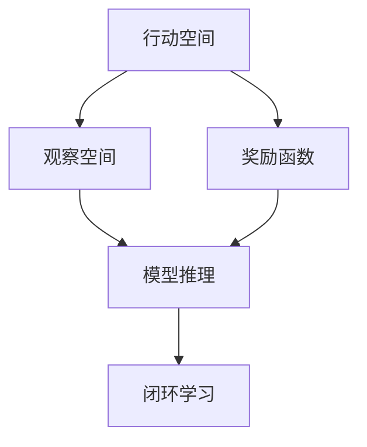
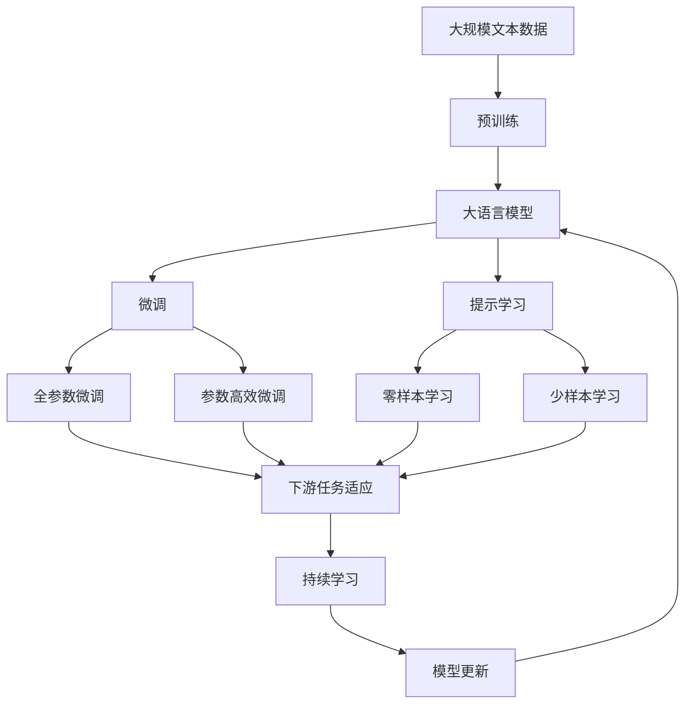

                 

# AI Agent 行动 Action 为进一步感知提供了观察的前提和基础，形成一个自主的闭环学习过程

## 1. 背景介绍

### 1.1 问题由来
在人工智能领域，特别是智能体（AI Agents）的研究中，如何使智能体能够在复杂多变的环境中进行高效、自主的决策，是一个长期且重要的研究方向。传统的强化学习（Reinforcement Learning, RL）方法在许多应用场景中取得了显著成果，但仍然存在一些问题。

- 对于复杂环境，强化学习的学习曲线较陡峭，需要大量经验样本。
- 强化学习的训练过程依赖于环境反馈，缺乏观察信息的自顶向下感知能力。
- 强化学习难以适应多目标、多约束条件的环境，目标函数设计复杂。

因此，如何提供一种新的感知和决策机制，使AI Agent能够更自主、更高效地进行学习和决策，成为一个亟需解决的问题。

### 1.2 问题核心关键点
近年来，基于行动的感知（Action-based Perception）技术应运而生。该技术旨在通过AI Agent自身的行动，获取环境信息，并结合这些信息进行自主决策。其核心思想是通过行动与环境的互动，自顶向下感知环境，形成闭环的学习过程。

行动感知技术的核心在于：
- 以行动为单位，通过观察环境的反馈，学习新的行动策略。
- 将行动与观察结果相结合，形成更加自顶向下的感知方式。
- 利用闭环学习机制，动态调整行动策略，提升决策效率和鲁棒性。

这一技术在机器人、游戏AI、自动驾驶等领域中已显示出显著的优势，并在一些实际应用中取得了令人瞩目的成果。

### 1.3 问题研究意义
行动感知技术的研究，对于拓展AI Agent的应用范围，提升智能决策效率，加速智能体的自主化进程，具有重要意义：

1. **降低学习成本**：行动感知技术可以使得AI Agent在复杂环境中通过自主行动获取观察信息，减少对大量标注数据的依赖，降低学习成本。
2. **提高决策效率**：行动感知通过自顶向下的感知机制，能够快速响应环境变化，优化决策过程，提高决策效率。
3. **增强鲁棒性**：通过闭环学习机制，智能体可以不断从错误中学习，动态调整行动策略，增强决策鲁棒性。
4. **提升自适应能力**：行动感知使得AI Agent能够适应多目标、多约束条件的环境，增强适应性和泛化能力。
5. **促进技术创新**：行动感知技术提供了新的学习和感知范式，推动了强化学习、模型推理等领域的研究进展。
6. **赋能产业升级**：将行动感知技术应用于无人驾驶、机器人、游戏AI等垂直领域，提升行业智能化水平。

## 2. 核心概念与联系

### 2.1 核心概念概述

行动感知技术依赖于以下几个核心概念：

- **行动空间**：智能体可以选择的行动集合，如机器人的关节动作、无人车的加速、转向等。
- **观察空间**：智能体通过行动能够获取的观察信息集合，如机器人的传感器读数、无人车的视觉图像等。
- **奖励函数**：定义智能体在某一行动下所获得的奖励，用于指导智能体的行动选择。
- **模型推理**：通过观察信息与行动之间的映射关系，推断出当前环境状态，供智能体进行决策。
- **闭环学习**：通过智能体自身的行动与观察，不断调整行动策略，实现自主学习。

这些概念之间相互关联，共同构成了行动感知技术的理论基础。

### 2.2 概念间的关系

这些核心概念之间的逻辑关系可以通过以下Mermaid流程图来展示：



这个流程图展示出行动感知技术的基本流程：
- 智能体根据行动空间选择行动。
- 通过观察空间获取环境反馈，并结合模型推理预测环境状态。
- 利用奖励函数对行动选择进行评估和调整，进行闭环学习。

### 2.3 核心概念的整体架构

最后，我们用一个综合的流程图来展示这些核心概念在大语言模型微调过程中的整体架构：



这个综合流程图展示出从预训练到微调，再到持续学习的完整过程，各核心概念在其中发挥着不同的作用。

## 3. 核心算法原理 & 具体操作步骤
### 3.1 算法原理概述

行动感知技术基于强化学习的基本原理，但更强调行动与观察的结合。其核心算法包括：

- **行动选择**：智能体在当前状态下的行动选择策略。
- **模型推理**：通过观察信息，推断出当前状态。
- **奖励函数**：对行动结果进行评估，形成奖励信号。
- **闭环学习**：利用奖励信号和观察结果，调整行动选择策略。

行动感知技术的核心在于如何设计行动空间、观察空间和奖励函数，以及如何进行模型推理和闭环学习。

### 3.2 算法步骤详解

行动感知技术的实施步骤如下：

**Step 1: 定义行动空间和观察空间**

- 根据具体应用场景，定义智能体可执行的行动空间和可获取的观察空间。
- 例如，在机器人控制中，行动空间可能包括关节角度、速度等，观察空间可能包括传感器读数、相机图像等。

**Step 2: 设计奖励函数**

- 设计奖励函数，用以评估智能体的行动效果。
- 奖励函数应尽量简单、直观，且能够捕捉到关键行为指标。
- 例如，在机器人控制中，可以设计奖励函数为关节角度的精度、任务完成的成功率等。

**Step 3: 训练模型推理**

- 使用强化学习等方法，训练模型从观察空间推断出当前状态。
- 模型推理的准确性直接影响智能体的决策效果。
- 例如，在机器人控制中，可以使用LSTM、CNN等模型进行视觉信息处理，提取关键特征。

**Step 4: 实施闭环学习**

- 通过智能体的行动与观察，调整行动策略，进行闭环学习。
- 利用奖励函数和观察结果，更新行动选择策略，优化模型参数。
- 例如，在机器人控制中，通过不断调整关节角度，提高执行精度。

**Step 5: 部署并评估**

- 将训练好的模型部署到实际环境中，进行在线学习。
- 定期评估模型性能，根据评估结果进行优化。
- 例如，在机器人控制中，通过监控执行精度，调整模型参数。

### 3.3 算法优缺点

行动感知技术具有以下优点：

- **自顶向下感知**：通过行动与观察的结合，智能体能够自顶向下感知环境，增强鲁棒性。
- **动态调整**：利用闭环学习机制，智能体能够动态调整行动策略，提升决策效率。
- **泛化能力强**：行动感知技术能够适应多目标、多约束条件的环境，增强泛化能力。

但同时也存在一些缺点：

- **设计复杂**：行动空间和观察空间的定义需要依赖具体应用场景，设计复杂。
- **模型推理复杂**：如何设计有效的模型推理算法，是行动感知技术的一大挑战。
- **学习曲线陡峭**：特别是在复杂环境中，学习曲线较陡峭，需要大量经验样本。

### 3.4 算法应用领域

行动感知技术已经在多个领域中得到了广泛应用，例如：

- **机器人控制**：通过机器人自身的动作获取传感器读数，优化控制策略。
- **无人驾驶**：通过车辆自身的动作获取视觉图像，优化行驶路线。
- **游戏AI**：通过游戏角色的动作获取游戏图像，优化游戏策略。
- **自然语言处理**：通过模型的动作获取自然语言数据，优化语言生成和理解。

随着技术的不断进步，行动感知技术将在更多领域得到应用，为智能体提供更加自顶向下的感知能力。

## 4. 数学模型和公式 & 详细讲解  
### 4.1 数学模型构建

行动感知技术的数学模型主要包括以下几个部分：

- **行动空间**：设行动空间为 $A$，即 $A = \{a_1, a_2, ..., a_n\}$。
- **观察空间**：设观察空间为 $O$，即 $O = \{o_1, o_2, ..., o_m\}$。
- **奖励函数**：设奖励函数为 $R$，即 $R: A \times O \rightarrow [0, 1]$。
- **状态转移概率**：设状态转移概率为 $P$，即 $P: S \times A \rightarrow [0, 1]$。
- **模型推理**：设模型推理函数为 $f$，即 $f: O \rightarrow S$。

其中，$S$ 表示环境状态空间，$R$ 和 $P$ 均为已知参数，$f$ 为待训练的模型函数。

### 4.2 公式推导过程

以机器人控制为例，定义行动空间为关节角度 $\theta$，观察空间为传感器读数 $s$，奖励函数为关节角度的精度 $r$。则行动感知技术的目标是最大化期望的累积奖励：

$$
J(\theta) = \mathbb{E}[\sum_{t=0}^{\infty} \gamma^t r(\theta, s_t)]
$$

其中 $\gamma$ 为折扣因子，控制未来奖励的权重。

模型推理函数 $f$ 通过训练数据，学习如何将传感器读数 $s$ 映射到当前状态 $S$：

$$
S_t = f(s_t; \theta)
$$

利用行动与观察之间的映射关系，智能体可以更新模型参数 $\theta$，进行闭环学习。具体的学习算法包括：

- **策略梯度法**：通过策略梯度公式，优化行动选择策略：

$$
\nabla_\theta J(\theta) = \mathbb{E}[\sum_{t=0}^{\infty} \gamma^t \nabla_\theta \log \pi_\theta(a_t | S_t) r(\theta, s_t)]
$$

其中 $\pi_\theta$ 为行动选择策略。

- **Q-learning**：通过Q值函数 $Q_\theta$，更新模型参数：

$$
Q_\theta(s, a) = r + \gamma \mathbb{E}_{S' \sim P(S' | s, a)} [Q_\theta(S', a)]
$$

利用Q值函数的更新公式，可以不断调整行动策略。

### 4.3 案例分析与讲解

以无人驾驶为例，分析行动感知技术的具体实现：

**Step 1: 定义行动空间和观察空间**

- 行动空间为车辆的加速、转向等动作。
- 观察空间为车辆的前视摄像头、雷达传感器等读数。

**Step 2: 设计奖励函数**

- 奖励函数设计为安全行驶距离和速度控制的综合指标。

**Step 3: 训练模型推理**

- 使用卷积神经网络（CNN）对摄像头图像进行特征提取，得到车辆位置和方向。

**Step 4: 实施闭环学习**

- 通过车辆的动作和传感器读数，更新行动策略，避免障碍物和行人。

**Step 5: 部署并评估**

- 将模型部署到实际驾驶环境中，进行在线学习，不断调整行动策略，提高行驶安全性和舒适性。

## 5. 项目实践：代码实例和详细解释说明
### 5.1 开发环境搭建

在进行行动感知项目开发前，我们需要准备好开发环境。以下是使用Python进行OpenAI Gym进行环境模拟的环境配置流程：

1. 安装Anaconda：从官网下载并安装Anaconda，用于创建独立的Python环境。

2. 创建并激活虚拟环境：
```bash
conda create -n gym-env python=3.8 
conda activate gym-env
```

3. 安装OpenAI Gym：
```bash
conda install gym
```

4. 安装PyTorch：根据CUDA版本，从官网获取对应的安装命令。例如：
```bash
conda install pytorch torchvision torchaudio cudatoolkit=11.1 -c pytorch -c conda-forge
```

5. 安装TensorBoard：
```bash
pip install tensorboard
```

完成上述步骤后，即可在`gym-env`环境中开始行动感知项目开发。

### 5.2 源代码详细实现

下面我们以机器人控制为例，给出使用OpenAI Gym进行行动感知技术开发和测试的PyTorch代码实现。

首先，定义机器人控制的环境：

```python
import gym
import numpy as np

env = gym.make('CartPole-v1')
```

然后，定义行动空间和观察空间：

```python
# 行动空间
action_space = env.action_space

# 观察空间
observation_space = env.observation_space
```

接下来，定义奖励函数和模型推理函数：

```python
# 奖励函数
def reward_func(state, action):
    if action == 1:  # 向右转向
        return 1.0
    elif action == 2:  # 向左转向
        return 1.0
    else:
        return 0.0

# 模型推理函数
def model_inference(observation):
    # 假设模型推理为简单的线性映射
    theta = np.random.rand(1)
    return theta * observation
```

然后，定义行动感知技术的训练函数：

```python
def train_agent():
    agent = QLearningAgent(env)
    for episode in range(1000):
        state = env.reset()
        done = False
        while not done:
            action = agent.choose_action(state)
            next_state, reward, done, _ = env.step(action)
            agent.update(reward, state, next_state)
            state = next_state
    print('Training complete')
```

最后，定义行动感知技术的测试函数：

```python
def test_agent():
    agent = QLearningAgent(env)
    state = env.reset()
    done = False
    while not done:
        action = agent.choose_action(state)
        next_state, reward, done, _ = env.step(action)
        env.render()
        state = next_state
    print('Testing complete')
```

### 5.3 代码解读与分析

让我们再详细解读一下关键代码的实现细节：

**env = gym.make('CartPole-v1')**：
- 使用OpenAI Gym创建一个简单的CartPole环境，用于测试行动感知技术的性能。

**reward_func(state, action)**：
- 定义一个简单的奖励函数，根据智能体的动作给出奖励，即向右或向左转向时获得1.0的奖励。

**model_inference(observation)**：
- 定义模型推理函数，通过简单的线性映射，将传感器读数映射到当前状态。

**QLearningAgent**：
- 定义一个Q-learning智能体，通过Q值函数不断优化行动策略。

**train_agent()**：
- 训练智能体，通过不断调整行动策略，使得智能体能够适应环境变化。

**test_agent()**：
- 测试智能体，展示智能体在实际环境中的表现，进行在线学习。

在实际应用中，还可以进一步优化行动感知技术的各个环节，如引入神经网络进行更复杂的模型推理，使用强化学习算法如策略梯度法进行更高效的闭环学习。这些优化手段能够进一步提升行动感知技术的性能，使其更好地适应复杂多变的环境。

## 6. 实际应用场景
### 6.1 智能客服系统

基于行动感知技术的智能客服系统，可以大幅提升客服系统的智能水平。智能客服系统通过收集用户的语音、文本等信息，结合智能体的行动（如语音合成、文本生成），自顶向下感知用户需求，进行智能响应。

在技术实现上，可以设计多轮对话模板，作为智能体的行动空间。使用深度学习模型对用户语音和文本进行特征提取，作为观察空间。设计基于奖励函数的智能体，不断优化对话策略，提升客服系统的智能水平。

### 6.2 金融舆情监测

在金融舆情监测中，行动感知技术可以用于分析网络舆情变化，识别市场趋势。智能体通过监测网络新闻、社交媒体等信息，自顶向下感知舆情变化，进行情感分析、趋势预测等任务。

具体实现时，可以设计多个舆情指标，如市场情绪、热门话题等，作为观察空间。通过强化学习算法训练智能体，动态调整舆情分析策略，提高舆情监测的准确性和及时性。

### 6.3 个性化推荐系统

在个性化推荐系统中，行动感知技术可以用于动态调整推荐策略，提升推荐效果。智能体通过分析用户的历史行为、兴趣偏好等数据，自顶向下感知用户需求，进行个性化推荐。

具体实现时，可以将用户行为数据作为观察空间，设计基于奖励函数的智能体，动态调整推荐策略，提高推荐系统的精准度和个性化程度。

### 6.4 未来应用展望

随着行动感知技术的不断发展，其将在更多领域得到应用，为智能体提供更加自顶向下的感知能力，增强决策的灵活性和鲁棒性。未来，行动感知技术的应用前景如下：

1. **智能交通管理**：通过车辆自身的动作获取环境信息，优化交通流控制，提升交通安全性和通行效率。
2. **医疗诊断**：通过医生的动作获取医疗图像、病历等数据，优化诊断策略，提高诊断准确性和效率。
3. **农业生产**：通过农机的动作获取环境信息，优化农机作业策略，提升农业生产效率和资源利用率。
4. **游戏AI**：通过游戏角色的动作获取游戏图像，优化游戏策略，提高游戏体验和智能水平。

总之，行动感知技术将带来新的感知范式，推动AI Agent在垂直领域的应用，为智能体的决策和感知提供新的思路和方法。

## 7. 工具和资源推荐
### 7.1 学习资源推荐

为了帮助开发者系统掌握行动感知技术的理论基础和实践技巧，这里推荐一些优质的学习资源：

1. 《Reinforcement Learning: An Introduction》：经典的强化学习教材，介绍了强化学习的基本概念和算法。
2. 《Deep Reinforcement Learning for Decision Making》：Coursera上的强化学习课程，介绍了深度强化学习算法及其应用。
3. OpenAI Gym官方文档：提供了丰富的环境和算法库，用于行动感知技术的实验和开发。
4. TensorFlow官方文档：提供了深度学习框架的全面教程，包括模型推理、优化算法等。
5. PyTorch官方文档：提供了深度学习框架的全面教程，包括神经网络、强化学习等。

通过对这些资源的学习实践，相信你一定能够快速掌握行动感知技术的精髓，并用于解决实际的智能体决策和感知问题。

### 7.2 开发工具推荐

高效的开发离不开优秀的工具支持。以下是几款用于行动感知开发常用的工具：

1. OpenAI Gym：提供了丰富的模拟环境和算法库，用于行动感知技术的实验和开发。
2. TensorBoard：用于监控和可视化模型训练过程，提供详细的实验报告和图表。
3. PyTorch：基于Python的开源深度学习框架，适合快速迭代研究。
4. Jupyter Notebook：提供交互式编程环境，便于开发和调试。
5. PyCharm：全面的Python开发环境，支持IDE和版本控制。

合理利用这些工具，可以显著提升行动感知技术的开发效率，加快创新迭代的步伐。

### 7.3 相关论文推荐

行动感知技术的研究源于学界的持续探索。以下是几篇奠基性的相关论文，推荐阅读：

1. "Playing Atari with Deep Reinforcement Learning"（Atari游戏强化学习论文）：展示了深度强化学习在复杂环境中的性能。
2. "Policy Gradient Methods for Generalization"（策略梯度算法论文）：提出了策略梯度算法，用于优化行动选择策略。
3. "Q-Learning for Action-Perception-Action in Simulated Robot Environments"（Q-learning在机器人控制中的应用）：展示了行动感知技术在机器人控制中的应用效果。
4. "Learning and Decision-Making in Dynamic Environments via Deep Reinforcement Learning"（深度强化学习在动态环境中的应用）：介绍了深度强化学习在复杂环境中的最新进展。

这些论文代表了大语言模型微调技术的发展脉络。通过学习这些前沿成果，可以帮助研究者把握学科前进方向，激发更多的创新灵感。

除上述资源外，还有一些值得关注的前沿资源，帮助开发者紧跟行动感知技术的最新进展，例如：

1. arXiv论文预印本：人工智能领域最新研究成果的发布平台，包括大量尚未发表的前沿工作，学习前沿技术的必读资源。
2. 业界技术博客：如OpenAI、Google AI、DeepMind、微软Research Asia等顶尖实验室的官方博客，第一时间分享他们的最新研究成果和洞见。
3. 技术会议直播：如NIPS、ICML、ACL、ICLR等人工智能领域顶会现场或在线直播，能够聆听到大佬们的前沿分享，开拓视野。
4. GitHub热门项目：在GitHub上Star、Fork数最多的行动感知相关项目，往往代表了该技术领域的发展趋势和最佳实践，值得去学习和贡献。
5. 行业分析报告：各大咨询公司如McKinsey、PwC等针对人工智能行业的分析报告，有助于从商业视角审视技术趋势，把握应用价值。

总之，对于行动感知技术的学习和实践，需要开发者保持开放的心态和持续学习的意愿。多关注前沿资讯，多动手实践，多思考总结，必将收获满满的成长收益。

## 8. 总结：未来发展趋势与挑战
### 8.1 总结

本文对行动感知技术进行了全面系统的介绍。首先阐述了行动感知技术的研究背景和意义，明确了其对于提升智能体决策和感知能力的重要价值。其次，从原理到实践，详细讲解了行动感知技术的数学模型和关键步骤，给出了行动感知技术的代码实现。同时，本文还广泛探讨了行动感知技术在智能客服、金融舆情、个性化推荐等多个行业领域的应用前景，展示了行动感知技术的广阔应用范围。此外，本文精选了行动感知技术的各类学习资源，力求为读者提供全方位的技术指引。

通过本文的系统梳理，可以看到，行动感知技术已经在大语言模型微调领域取得了显著的成果，成为推动智能体自主决策的重要技术手段。未来，随着算力、数据和算法技术的进一步提升，行动感知技术必将在更多垂直领域大显身手，为智能体的决策和感知提供更加自顶向下的支持。

### 8.2 未来发展趋势

展望未来，行动感知技术将呈现以下几个发展趋势：

1. **模型推理能力提升**：随着模型推理技术的进步，智能体的感知能力将进一步提升，能够更准确地理解环境信息，优化决策策略。
2. **多模态融合**：行动感知技术将更多地融合视觉、听觉、触觉等多模态信息，提升智能体的感知范围和鲁棒性。
3. **动态环境适应**：行动感知技术将更加适应动态环境，通过不断调整行动策略，提升对环境变化的应对能力。
4. **实时性提升**：通过优化模型推理和行动选择策略，行动感知技术的实时性将进一步提升，满足更多实时应用的需求。
5. **通用化发展**：行动感知技术将逐步向通用人工智能（AGI）迈进，具备更强的跨领域迁移能力，应用于更多复杂场景。

这些趋势凸显了行动感知技术的广阔前景，将推动AI Agent在更多领域的应用，为智能体的自主决策和感知提供更加强大的支持。

### 8.3 面临的挑战

尽管行动感知技术已经取得了显著进展，但在迈向更加智能化、普适化应用的过程中，仍面临诸多挑战：

1. **设计复杂度高**：行动空间和观察空间的设计需要依赖具体应用场景，设计复杂度高。
2. **模型推理复杂**：如何设计有效的模型推理算法，提高感知精度，是行动感知技术的一大挑战。
3. **数据稀缺**：部分应用场景中，高质量数据获取难度大，限制了行动感知技术的广泛应用。
4. **泛化能力不足**：在复杂环境或新场景下，智能体的感知和决策效果可能大打折扣。
5. **可解释性不足**：行动感知技术的决策过程难以解释，缺乏透明性和可解释性。
6. **伦理和安全问题**：智能体的决策可能涉及隐私、安全等敏感问题，需进行深入研究和规范。

这些挑战需要在未来的研究中进一步突破，推动行动感知技术的成熟应用。

### 8.4 研究展望

面对行动感知技术所面临的挑战，未来的研究需要在以下几个方面寻求新的突破：

1. **自动化设计**：研究如何自动设计行动空间和观察空间，降低人工设计难度。
2. **高效推理算法**：研究高效、可解释的模型推理算法，提升感知能力。
3. **多源数据融合**：研究如何融合多模态数据，提高智能体的感知范围和鲁棒性。
4. **数据增强**：研究如何增强训练数据，提高智能体的泛化能力。
5. **伦理规范**：研究智能体的决策和感知过程，制定相关伦理规范和安全标准。
6. **跨领域迁移**：研究跨领域迁移算法，提升智能体的适应性和泛化能力。

这些研究方向将进一步推动行动感知技术的发展，使其在更多场景中发挥重要作用，

