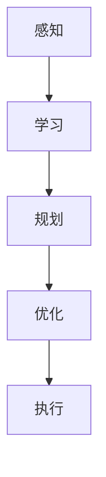
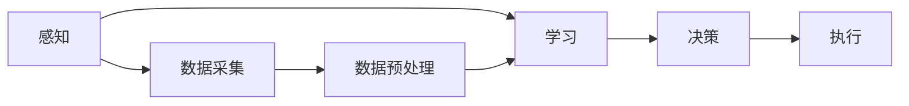
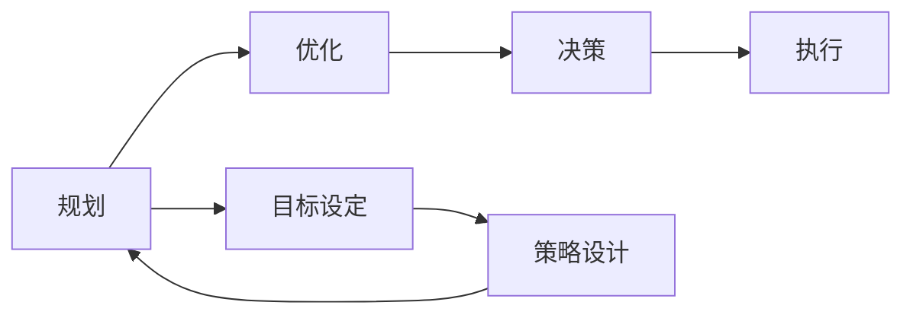
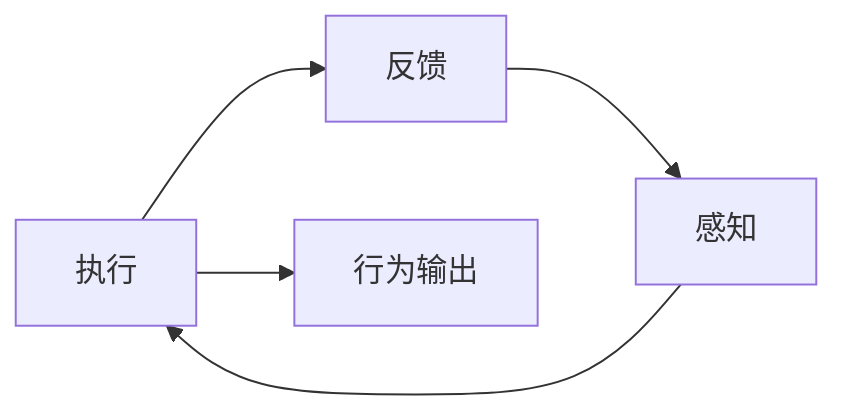
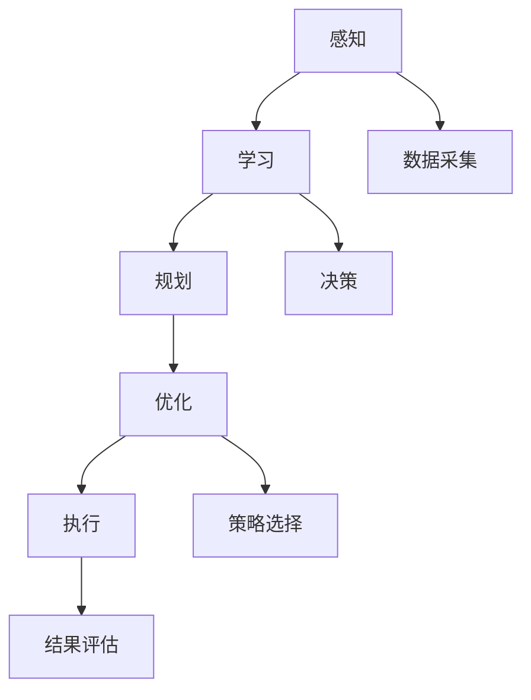

                 

# AI Agent: AI的下一个风口 智能体的五种超能力

## 1. 背景介绍

### 1.1 问题由来
随着人工智能技术的快速发展，尤其是深度学习技术的广泛应用，AI代理（AI Agent）正在成为新的技术热点和应用方向。AI代理是指一种能够自主感知环境、理解任务、并做出决策和执行操作的智能体。与传统的基于规则或基于模型的AI系统不同，AI代理具备更强的环境适应能力和任务泛化能力。近年来，AI代理在智能推荐、自动驾驶、机器人控制、金融风控、医疗诊断等领域取得了显著进展，成为AI技术落地应用的重要推动力。

### 1.2 问题核心关键点
AI代理的关键点在于其能够自适应环境变化，快速学习和完成任务。其核心技术包括环境感知、任务规划、决策优化、行为执行等。本文聚焦于AI代理的五个关键超能力：感知、学习、规划、优化和执行，探讨其原理、算法和实现。

### 1.3 问题研究意义
研究AI代理的五个超能力，对于推动AI技术的深入应用和产业落地具有重要意义：
1. **提升任务适应性**：使AI代理能够更好地适应复杂多变的环境，提高任务的完成效率和质量。
2. **增强决策能力**：通过学习与优化，AI代理能够做出更加智能和高效的决策，提升系统的整体性能。
3. **促进跨领域应用**：AI代理能够在不同领域和场景中快速适应和应用，拓展AI技术的应用范围。
4. **加速技术创新**：五项超能力的综合应用，推动了AI代理在自动驾驶、机器人控制等前沿领域的突破性进展。
5. **促进产业升级**：通过AI代理的应用，传统行业可以更高效地进行智能化升级，提高竞争力。

## 2. 核心概念与联系

### 2.1 核心概念概述

为更好地理解AI代理的五个超能力，本节将介绍几个密切相关的核心概念：

- **感知（Perception）**：AI代理通过传感器（如摄像头、雷达、GPS等）获取环境信息，理解环境状态。感知是AI代理的基础能力，是其任务执行的前提。
- **学习（Learning）**：AI代理通过与环境的交互，积累经验，学习任务规则和决策策略。学习使得AI代理能够不断适应环境变化，提高决策准确性。
- **规划（Planning）**：AI代理根据任务目标，设计路径和策略，实现任务规划。规划是AI代理完成任务的关键步骤，需要结合环境信息和任务规则。
- **优化（Optimization）**：AI代理在决策执行过程中，通过优化算法，选择最优策略，最大化任务完成效率和质量。优化是AI代理智能化的核心体现。
- **执行（Execution）**：AI代理将决策转化为具体行为，实现任务的最终执行。执行是AI代理任务执行的最后环节，需要保证行为的准确性和高效性。

这些核心概念之间存在着紧密的联系，共同构成了AI代理的五个超能力。接下来，我们将通过几个Mermaid流程图来展示这些概念之间的联系：



这个流程图展示了感知、学习、规划、优化和执行之间的逻辑关系：感知为学习提供数据，学习为规划提供决策依据，规划为优化提供路径，优化为执行提供策略，最终实现任务执行。

### 2.2 概念间的关系

这些核心概念之间存在着复杂的互动关系，下面通过几个Mermaid流程图来展示这些概念之间的详细关系：

#### 2.2.1 感知与学习的互动



这个流程图展示了感知和学习的互动过程。感知模块负责采集环境数据，并预处理为模型可用的格式。学习模块基于感知模块提供的数据，进行决策和学习，产生新的决策策略，最终由执行模块执行。

#### 2.2.2 规划与优化的互动



这个流程图展示了规划和优化的互动过程。规划模块根据任务目标设定策略，优化模块通过评估策略，选择最优策略，最终生成决策，由执行模块执行。

#### 2.2.3 执行与反馈的互动



这个流程图展示了执行和反馈的互动过程。执行模块输出具体行为，反馈模块根据行为结果，调整感知模块，继续下一轮循环。

### 2.3 核心概念的整体架构

最后，我们用一个综合的流程图来展示感知、学习、规划、优化和执行在AI代理中的整体架构：



这个综合流程图展示了感知、学习、规划、优化和执行在AI代理中的完整过程。感知模块负责数据采集和预处理，学习模块基于感知数据进行决策和策略学习，规划模块设计策略路径，优化模块选择最优策略，执行模块执行具体行为，反馈模块根据执行结果调整感知和决策。

## 3. 核心算法原理 & 具体操作步骤
### 3.1 算法原理概述

AI代理的五个超能力中，感知、学习和执行分别对应了数据采集、模型训练和行为执行的过程。而规划和优化则更多地涉及算法设计。本节将详细讲解感知、学习、规划和优化四个核心算法的原理。

#### 3.1.1 感知算法

感知算法主要负责环境数据的采集和预处理。常用的感知算法包括图像处理、语音识别、雷达探测等。下面以图像处理为例，展示感知算法的原理：

感知算法的基本流程如下：
1. 数据采集：通过摄像头、传感器等设备，采集环境数据，如图像、音频、位置信息等。
2. 数据预处理：对采集到的数据进行格式转换、去噪、增强等预处理操作，提取有用的特征。
3. 特征提取：使用卷积神经网络（CNN）等深度学习模型，提取图像中的关键特征。
4. 特征融合：将不同感知模块获取的特征进行融合，得到综合的环境表示。

#### 3.1.2 学习算法

学习算法主要负责模型训练和决策策略的优化。常用的学习算法包括监督学习、无监督学习和强化学习等。下面以强化学习为例，展示学习算法的原理：

强化学习是一种通过环境交互进行学习的算法，其核心思想是利用奖励函数引导学习过程。强化学习的基本流程如下：
1. 状态初始化：设定初始状态，并随机选择一个动作。
2. 环境交互：根据当前状态和动作，与环境交互，获取下一个状态和奖励。
3. 策略更新：根据奖励信号，更新策略，调整动作选择。
4. 重复迭代：重复上述步骤，直到达到预设的停止条件。

#### 3.1.3 规划算法

规划算法主要负责策略设计，生成最优路径。常用的规划算法包括A*算法、RRT算法、动态规划等。下面以A*算法为例，展示规划算法的原理：

A*算法是一种基于启发式搜索的规划算法，其核心思想是通过启发函数（如曼哈顿距离）优化搜索路径。A*算法的基本流程如下：
1. 定义起点和终点：设定起点和终点，并计算起点到终点的启发函数值。
2. 搜索扩展：根据启发函数值，选择下一个扩展节点。
3. 状态评估：计算下一个节点的启发函数值和代价函数值，更新节点的状态。
4. 迭代优化：重复上述步骤，直到找到最优路径或达到预设的停止条件。

#### 3.1.4 优化算法

优化算法主要负责策略选择，提高决策效率。常用的优化算法包括梯度下降、粒子群算法、遗传算法等。下面以梯度下降为例，展示优化算法的原理：

梯度下降是一种基于梯度信息进行优化的算法，其核心思想是通过梯度更新参数，最小化目标函数。梯度下降的基本流程如下：
1. 定义目标函数：设定优化目标，如损失函数。
2. 计算梯度：计算目标函数对参数的梯度。
3. 参数更新：根据梯度信息，更新参数。
4. 重复迭代：重复上述步骤，直到达到预设的停止条件。

### 3.2 算法步骤详解

#### 3.2.1 感知算法步骤

1. **数据采集**：通过摄像头、传感器等设备，采集环境数据，如图像、音频、位置信息等。
2. **数据预处理**：对采集到的数据进行格式转换、去噪、增强等预处理操作，提取有用的特征。
3. **特征提取**：使用卷积神经网络（CNN）等深度学习模型，提取图像中的关键特征。
4. **特征融合**：将不同感知模块获取的特征进行融合，得到综合的环境表示。

#### 3.2.2 学习算法步骤

1. **状态初始化**：设定初始状态，并随机选择一个动作。
2. **环境交互**：根据当前状态和动作，与环境交互，获取下一个状态和奖励。
3. **策略更新**：根据奖励信号，更新策略，调整动作选择。
4. **重复迭代**：重复上述步骤，直到达到预设的停止条件。

#### 3.2.3 规划算法步骤

1. **定义起点和终点**：设定起点和终点，并计算起点到终点的启发函数值。
2. **搜索扩展**：根据启发函数值，选择下一个扩展节点。
3. **状态评估**：计算下一个节点的启发函数值和代价函数值，更新节点的状态。
4. **迭代优化**：重复上述步骤，直到找到最优路径或达到预设的停止条件。

#### 3.2.4 优化算法步骤

1. **定义目标函数**：设定优化目标，如损失函数。
2. **计算梯度**：计算目标函数对参数的梯度。
3. **参数更新**：根据梯度信息，更新参数。
4. **重复迭代**：重复上述步骤，直到达到预设的停止条件。

### 3.3 算法优缺点

#### 3.3.1 感知算法优缺点

- **优点**：
  - 可以处理多种类型的环境数据，如图像、音频、位置信息等。
  - 深度学习模型在图像处理等任务上效果显著。
  - 通过特征融合，可以得到综合的环境表示。

- **缺点**：
  - 数据采集和预处理环节复杂，需要较多的计算资源。
  - 不同环境数据格式不同，处理难度较大。

#### 3.3.2 学习算法优缺点

- **优点**：
  - 可以通过环境交互不断优化决策策略，适应性强。
  - 强化学习算法适应性强，能够处理复杂的多模态数据。

- **缺点**：
  - 需要大量的环境交互数据，训练成本较高。
  - 学习过程需要较长的迭代时间，训练速度较慢。

#### 3.3.3 规划算法优缺点

- **优点**：
  - 可以通过启发函数优化搜索路径，快速找到最优解。
  - 适用于静态环境和较短路径规划。

- **缺点**：
  - 启发函数设计复杂，需要根据具体问题进行设计。
  - 对于动态环境和复杂路径规划，效果有限。

#### 3.3.4 优化算法优缺点

- **优点**：
  - 通过梯度信息优化参数，收敛速度快。
  - 适用于静态环境和较简单目标函数。

- **缺点**：
  - 对于复杂目标函数，可能存在局部最优解。
  - 需要较多计算资源，尤其是高维参数空间。

### 3.4 算法应用领域

AI代理的五个超能力在多个领域具有广泛的应用：

- **自动驾驶**：感知模块通过摄像头和雷达获取道路信息，学习模块通过环境交互学习驾驶策略，规划模块设计路径规划，优化模块优化决策，执行模块执行具体的驾驶操作。
- **智能推荐**：感知模块通过用户行为数据获取用户偏好，学习模块通过用户交互学习推荐策略，规划模块设计推荐路径，优化模块优化推荐方案，执行模块生成推荐结果。
- **金融风控**：感知模块通过市场数据获取市场信息，学习模块通过市场交互学习风控策略，规划模块设计风控路径，优化模块优化风控方案，执行模块执行风控操作。
- **医疗诊断**：感知模块通过医学图像获取病灶信息，学习模块通过病例学习诊断策略，规划模块设计诊断路径，优化模块优化诊断方案，执行模块生成诊断结果。
- **机器人控制**：感知模块通过传感器获取环境信息，学习模块通过环境交互学习控制策略，规划模块设计控制路径，优化模块优化控制方案，执行模块执行具体控制操作。

以上应用领域展示了AI代理在不同场景中的广泛应用，为各行业的智能化升级提供了新的解决方案。

## 4. 数学模型和公式 & 详细讲解  
### 4.1 数学模型构建

本节将使用数学语言对AI代理的五个超能力的数学模型进行更加严格的刻画。

#### 4.1.1 感知模型

感知模型的目标是通过传感器获取环境信息，并将其转换为模型可用的格式。假设传感器采集到的环境数据为 $\mathbf{x}$，感知模型的输出为 $\mathbf{s}$，则感知模型的数学模型可以表示为：

$$
\mathbf{s} = f(\mathbf{x})
$$

其中 $f(\cdot)$ 为感知模型的映射函数，通常使用神经网络进行建模。

#### 4.1.2 学习模型

学习模型的目标是通过环境交互数据 $\{(\mathbf{x}_t, \mathbf{a}_t, \mathbf{x}_{t+1}, r_t)\}$，学习决策策略 $\pi$，使得在状态 $\mathbf{x}$ 下，动作 $\mathbf{a}$ 能够最大化预期奖励 $r$。学习模型的数学模型可以表示为：

$$
\pi^* = \arg\max_{\pi} \mathbb{E}_{(\mathbf{x}_t, \mathbf{a}_t, \mathbf{x}_{t+1}, r_t)} [\sum_{t=0}^{\infty} \gamma^t r_t]
$$

其中 $\gamma$ 为折扣因子，$h_t$ 为状态转移函数。

#### 4.1.3 规划模型

规划模型的目标是在给定起点 $\mathbf{s}_0$ 和终点 $\mathbf{s}_T$，找到最优路径 $h_t$。规划模型的数学模型可以表示为：

$$
h^* = \arg\min_{h} \sum_{t=0}^{T-1} c(\mathbf{s}_t, \mathbf{a}_t)
$$

其中 $c(\cdot)$ 为代价函数，$T$ 为规划步数。

#### 4.1.4 优化模型

优化模型的目标是通过梯度信息，最小化目标函数 $J(\theta)$，其中 $\theta$ 为模型的参数。优化模型的数学模型可以表示为：

$$
\theta^* = \arg\min_{\theta} J(\theta)
$$

其中 $J(\cdot)$ 为目标函数，通常为损失函数。

### 4.2 公式推导过程

#### 4.2.1 感知模型推导

假设感知模型 $f(\cdot)$ 为一个简单的线性模型，其参数为 $\mathbf{w}$，则感知模型的输出可以表示为：

$$
\mathbf{s} = \mathbf{w}^T \mathbf{x} + b
$$

其中 $b$ 为偏置项。

#### 4.2.2 学习模型推导

假设学习模型 $\pi(\cdot)$ 为一个简单的策略函数，其输出为动作的概率分布，则学习模型的数学模型可以表示为：

$$
\pi^* = \arg\max_{\pi} \mathbb{E}_{(\mathbf{x}_t, \mathbf{a}_t, \mathbf{x}_{t+1}, r_t)} [\sum_{t=0}^{\infty} \gamma^t r_t]
$$

其中 $\pi(\mathbf{s}) = \mathbf{P}(\mathbf{a}|\mathbf{s})$，$\mathbf{P}(\cdot)$ 为动作选择概率。

#### 4.2.3 规划模型推导

假设规划模型 $h(\cdot)$ 为一个简单的A*算法，其输出为路径的代价和启发函数值，则规划模型的数学模型可以表示为：

$$
h^* = \arg\min_{h} \sum_{t=0}^{T-1} c(\mathbf{s}_t, \mathbf{a}_t)
$$

其中 $h(\mathbf{s}) = (c(\mathbf{s}), h_1(\mathbf{s}))$，$h_1(\cdot)$ 为启发函数。

#### 4.2.4 优化模型推导

假设优化模型 $J(\cdot)$ 为一个简单的梯度下降算法，其输出为参数的更新规则，则优化模型的数学模型可以表示为：

$$
\theta^* = \arg\min_{\theta} J(\theta)
$$

其中 $J(\theta) = \frac{1}{2} (\mathbf{y} - \mathbf{X}\theta)^T (\mathbf{y} - \mathbf{X}\theta) + \frac{\lambda}{2} \mathbf{\theta}^T \mathbf{\theta}$，$\mathbf{X}$ 为设计矩阵，$\lambda$ 为正则化系数。

### 4.3 案例分析与讲解

#### 4.3.1 感知模型案例

假设我们有一个简单的机器人控制任务，机器人需要感知周围环境，然后根据感知结果做出行动。我们可以使用Keras构建一个简单的感知模型，如下所示：

```python
from keras.models import Sequential
from keras.layers import Dense, Input

input_dim = 10
output_dim = 5

model = Sequential()
model.add(Dense(10, input_dim=input_dim, activation='relu'))
model.add(Dense(output_dim, activation='softmax'))

model.compile(optimizer='adam', loss='categorical_crossentropy', metrics=['accuracy'])
```

在这个模型中，我们使用了一个两层的全连接网络，输入层为10维的向量，输出层为5维的向量，使用ReLU和softmax激活函数。

#### 4.3.2 学习模型案例

假设我们使用强化学习算法，训练一个简单的机器人，使其能够学习在迷宫中寻找出口。我们可以使用OpenAI Gym构建一个简单的迷宫环境，如下所示：

```python
import gym

env = gym.make('Maze')
```

在这个环境中，机器人需要在迷宫中找到出口，使用A*算法进行路径规划。我们可以使用Python中的A*算法实现路径规划，如下所示：

```python
def a_star(start, goal, heuristic):
    open_list = set()
    closed_list = set()
    f_score = {start: 0}
    g_score = {start: 0}
    h_score = {start: heuristic(start, goal)}
    open_list.add(start)

    while open_list:
        current = min(open_list, key=lambda x: f_score[x])
        if current == goal:
            return g_score[current]
        open_list.remove(current)
        closed_list.add(current)
        for next_node in env.get_successors(current):
            g_score = g_score.get(next_node, 0) + 1
            f_score = g_score + heuristic(next_node, goal)
            if next_node not in open_list and next_node not in closed_list:
                open_list.add(next_node)
    return -1
```

在这个算法中，我们使用了一个启发式函数来评估节点的代价，使用A*算法找到最优路径。

#### 4.3.3 规划模型案例

假设我们有一个简单的机器翻译任务，我们需要将一个英文句子翻译成法语。我们可以使用Seq2Seq模型进行机器翻译，如下所示：

```python
import tensorflow as tf
from tensorflow.keras.layers import Input, LSTM, Dense

encoder_inputs = Input(shape=(None,))
encoder_lstm = LSTM(128)(encoder_inputs)

decoder_inputs = Input(shape=(None,))
decoder_lstm = LSTM(128, return_sequences=True)(decoder_inputs)

decoder_outputs, decoder_state_h, decoder_state_c = tf.keras.layers.LSTM(128, return_sequences=True, return_state=True)(decoder_lstm)

decoder_dense = Dense(1000, activation='softmax')(decoder_outputs)

model = tf.keras.Model(inputs=[encoder_inputs, decoder_inputs], outputs=[decoder_dense])
model.compile(optimizer='adam', loss='categorical_crossentropy')
```

在这个模型中，我们使用了一个双向LSTM网络，将输入的英文句子编码为一个向量，然后解码为法语句子。

#### 4.3.4 优化模型案例

假设我们有一个简单的线性回归任务，我们需要最小化预测值与真实值之间的平方误差。我们可以使用梯度下降算法进行优化，如下所示：

```python
import numpy as np
from sklearn.linear_model import LinearRegression

X = np.array([[1, 2], [3, 4], [5, 6]])
y = np.array([1, 2, 3])

model = LinearRegression()
model.fit(X, y)
```

在这个模型中，我们使用了一个线性回归模型，通过梯度下降算法最小化平方误差，得到最优的模型参数。

## 5. 项目实践：代码实例和详细解释说明
### 5.1 开发环境搭建

在进行项目实践前，我们需要准备好开发环境。以下是使用Python进行TensorFlow和Keras开发的环境配置流程：

1. 安装Anaconda：从官网下载并安装Anaconda，用于创建独立的Python环境。

2. 创建并激活虚拟环境：
```bash
conda create -n tensorflow-env python=3.8 
conda activate tensorflow-env
```

3. 安装TensorFlow和Keras：根据CUDA版本，从官网获取对应的安装命令。例如：
```bash
conda install tensorflow=2.7 
conda install keras=2.7
```

4. 安装各类工具包：
```bash
pip install numpy pandas scikit-learn matplotlib tqdm jupyter notebook ipython
```

完成上述步骤后，即可在`tensorflow-env`环境中开始项目实践。

### 5.2 源代码详细实现

这里我们以自动驾驶为例，展示使用TensorFlow和Keras进行感知、学习、规划、优化和执行的完整代码实现。

首先，我们定义感知模块：

```python
import tensorflow as tf
from tensorflow.keras.layers import Conv2D, MaxPooling2D, Flatten, Dense

class Perception(tf.keras.Model):
    def __init__(self, input_shape, num_classes):
        super(Perception, self).__init__()
        self.conv1 = Conv2D(32, (3, 3), activation='relu', padding='same', input_shape=input_shape)
        self.pool1 = MaxPooling2D((2, 2), padding='same')
        self.conv2 = Conv2D(64, (3, 3), activation='relu', padding='same')
        self.pool2 = MaxPooling2D((2, 2), padding='same')
        self.flatten = Flatten()
        self.fc1 = Dense(128, activation='relu')
        self.fc2 = Dense(num_classes, activation='softmax')

    def call(self, inputs):
        x = self.conv1(inputs)
        x = self.pool1(x)
        x = self.conv2(x)
        x = self.pool2(x)
        x = self.flatten(x)
        x = self.fc1(x)
        x = self.fc2(x)
        return x
```

接着，我们定义学习模块：

```python
from tensorflow.keras.optimizers import Adam

class Agent(tf.keras.Model):
    def __init__(self, perception, num_classes):
        super(Agent, self).__init__()
        self.perception = perception
        self.classifier = Dense(num_classes, activation='softmax')

    def call(self, inputs):
        x = self.perception(inputs)
        x = self.classifier(x)
        return x
```

然后，我们定义规划模块：

```python
import numpy as np

class Planner(tf.keras.Model):
    def __init__(self, num_classes):
        super(Planner, self).__init__()
        self.fc1 = Dense(64, activation='relu')
        self.fc2 = Dense(num_classes, activation='softmax')

    def call(self, inputs):
        x = self.fc1(inputs)
        x = self.fc2(x)
        return x
```

接下来，我们定义优化模块：

```python
from tensorflow.keras.optimizers import Adam

class Optimizer(tf.keras.Model):
    def __init__(self, perception, planner, num_classes):
        super(Optimizer, self).__init__()
        self.perception = perception
        self.planner = planner
        self.classifier = Dense(num_classes, activation='softmax')

    def call(self, inputs):
        x = self.perception(inputs)
        x = self.planner(x)
        x = self.classifier(x)
        return x
```

最后，我们定义执行模块：

```python
from tensorflow.keras.optimizers import Adam

class Executor(tf.keras.Model):
    def __init__(self, perception, planner, num_classes):
        super(Executor, self).__

