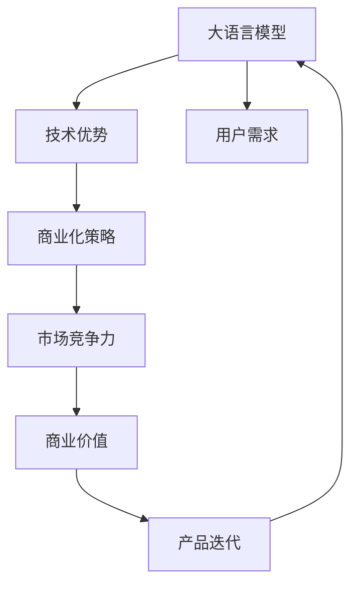

                 

# AI 大模型创业：如何利用商业优势？

> 关键词：大语言模型，AI创业，商业化策略，技术优势，用户需求，市场竞争力

## 1. 背景介绍

### 1.1 问题由来
近年来，人工智能(AI)技术的迅猛发展，尤其是大语言模型和大数据驱动的深度学习模型的出现，为各行各业带来了革命性的变化。在AI领域创业的公司纷纷涌现，许多企业迅速崛起，成为行业内的领头羊。但随着竞争的加剧，如何利用技术优势拓展商业价值，成为每个AI创业公司的核心问题。

### 1.2 问题核心关键点
在AI大模型创业中，利用技术优势拓展商业价值主要包括以下几个关键点：

- **技术优势的利用**：如何将大语言模型和技术优势转化为产品和服务，满足用户需求。
- **市场竞争力的提升**：如何通过技术优势提升产品市场竞争力，吸引更多用户。
- **商业模式的创新**：如何探索新的商业模式，实现商业价值的最大化。
- **用户需求的把握**：如何准确把握用户需求，实现技术的精准落地。
- **数据和算力的优化**：如何在资源有限的情况下，优化模型训练和推理过程。

### 1.3 问题研究意义
本文旨在探讨AI大模型创业公司在利用技术优势拓展商业价值时的具体策略，旨在帮助创业者更高效地整合技术优势与商业模式，提升产品市场竞争力，实现商业价值最大化。

## 2. 核心概念与联系

### 2.1 核心概念概述

在讨论AI大模型创业中的商业优势时，以下核心概念至关重要：

- **大语言模型**：如BERT、GPT等，具备强大的自然语言处理能力，能在各种NLP任务中取得优异表现。
- **AI创业**：利用人工智能技术进行商业化运作的企业，覆盖从初创公司到大型企业。
- **商业化策略**：将技术优势转化为产品和服务，满足市场需求，实现商业价值的策略和方法。
- **技术优势**：大模型在自然语言理解、生成、推理等能力上的优势，是AI创业公司独特的资源。
- **市场竞争力**：企业在市场上的表现，包括市场份额、用户评价、盈利能力等。

这些概念之间的联系紧密，大语言模型和技术优势是AI创业的核心资产，而商业化策略则是将这些资产转化为市场竞争力的关键手段。市场竞争力的提升反过来又能进一步推动产品迭代和技术创新。

### 2.2 概念间的关系

这些核心概念之间的关系可以用以下Mermaid流程图表示：



这个流程图展示了大语言模型技术优势与商业化策略之间的联系，以及市场竞争力对产品迭代和技术创新的推动作用。

## 3. 核心算法原理 & 具体操作步骤

### 3.1 算法原理概述

AI大模型创业公司在利用技术优势拓展商业价值时，主要利用大语言模型在大规模无标签文本数据上的预训练能力，进行微调，得到针对特定任务的高效模型。这些模型的关键特性包括：

- **跨领域泛化能力**：能够在不同领域和任务中表现良好。
- **高性能推理**：模型推理速度快，适合部署到边缘设备或云服务中。
- **灵活性**：模型参数可调整，可以针对特定需求进行优化。
- **自监督学习**：通过自监督学习任务提升模型的泛化能力。

### 3.2 算法步骤详解

利用大语言模型进行AI创业，主要包括以下几个步骤：

1. **数据收集与标注**：收集领域相关的数据，并对其进行标注。标注数据是微调模型、评估性能的基础。

2. **模型微调**：在收集的数据上对大语言模型进行微调，得到特定任务的高效模型。微调过程需要选择合适的任务适配层、学习率、正则化等参数。

3. **产品设计**：基于微调后的模型，设计满足市场需求的产品。这包括选择适合的交互界面、数据格式等。

4. **用户反馈与迭代**：产品上线后，收集用户反馈，不断迭代优化产品，提升用户体验。

5. **市场推广**：通过多种方式（如社交媒体、官网、合作伙伴）进行市场推广，吸引用户。

### 3.3 算法优缺点

大语言模型微调方法在AI创业中的应用，具有以下优缺点：

**优点**：

- **高效性**：利用大模型的预训练优势，快速得到高性能模型。
- **泛化能力**：模型在大规模数据上预训练后，具有较强的泛化能力，适合多种应用场景。
- **灵活性**：模型参数可调整，适合针对特定需求进行优化。

**缺点**：

- **标注数据需求**：微调过程需要大量的标注数据，对于某些领域数据收集困难。
- **计算资源需求**：大模型的训练和推理需要大量计算资源，对硬件要求高。
- **模型鲁棒性**：模型可能对输入数据和推理环境敏感，导致性能波动。

### 3.4 算法应用领域

基于大语言模型的AI创业方法，广泛应用于以下领域：

- **NLP任务**：包括文本分类、情感分析、机器翻译、问答系统等。
- **智能客服**：通过微调模型实现自然语言理解和生成，提升客户服务体验。
- **金融风控**：利用微调模型进行信用评分、欺诈检测等。
- **医疗诊断**：通过微调模型辅助医生进行疾病诊断、病理分析等。
- **教育培训**：利用微调模型进行智能答疑、个性化推荐等。
- **智能交通**：通过微调模型进行智能导航、语音识别等。

## 4. 数学模型和公式 & 详细讲解 & 举例说明

### 4.1 数学模型构建

假设大语言模型为 $M_{\theta}$，其中 $\theta$ 为模型参数。在某特定任务上，我们收集标注数据集 $D=\{(x_i, y_i)\}_{i=1}^N$，其中 $x_i$ 为输入，$y_i$ 为输出。在微调过程中，我们的目标是最小化损失函数 $\mathcal{L}$：

$$
\mathcal{L}(\theta) = \frac{1}{N}\sum_{i=1}^N \ell(M_{\theta}(x_i), y_i)
$$

其中 $\ell$ 为损失函数，常用的有交叉熵损失、均方误差损失等。

### 4.2 公式推导过程

以交叉熵损失函数为例，假设模型 $M_{\theta}$ 在输入 $x_i$ 上的输出为 $\hat{y}=M_{\theta}(x_i)$，真实标签为 $y_i$，则交叉熵损失函数为：

$$
\ell(M_{\theta}(x_i), y_i) = -y_i\log \hat{y} - (1-y_i)\log(1-\hat{y})
$$

结合经验风险公式，得到：

$$
\mathcal{L}(\theta) = -\frac{1}{N}\sum_{i=1}^N [y_i\log \hat{y} + (1-y_i)\log(1-\hat{y})]
$$

### 4.3 案例分析与讲解

在金融领域，可以利用大模型进行贷款审批流程的自动化。通过对大量贷款申请数据进行标注，微调大模型进行信用评分。具体步骤如下：

1. **数据收集**：收集历史贷款申请数据，包括个人信息、财务信息、信用记录等。
2. **标注数据**：对数据进行标注，如将“有违约风险”标注为1，“无违约风险”标注为0。
3. **模型微调**：使用微调后的模型对新申请的贷款进行信用评分，如预测某申请者是否具有违约风险。
4. **产品上线**：将微调后的模型集成到贷款审批系统中，实现自动化审批流程。
5. **迭代优化**：根据用户反馈，不断优化模型和产品，提高审批准确率。

## 5. 项目实践：代码实例和详细解释说明

### 5.1 开发环境搭建

要使用大语言模型进行AI创业，需要以下开发环境：

1. **Python环境**：搭建Python 3.8及以上版本的环境，安装必要的库。
2. **深度学习框架**：安装PyTorch或TensorFlow等深度学习框架，用于模型训练和推理。
3. **NLP工具库**：安装SpaCy、NLTK等NLP工具库，用于处理文本数据。
4. **数据库**：安装MySQL、PostgreSQL等数据库，用于存储和管理标注数据。
5. **云计算平台**：使用AWS、Google Cloud等云平台，提供算力和存储资源。

### 5.2 源代码详细实现

以金融领域信用评分为例，展示代码实现过程：

```python
import torch
import torch.nn as nn
from torch.utils.data import DataLoader
from transformers import BertTokenizer, BertForSequenceClassification
from sklearn.metrics import accuracy_score

# 定义模型
class CreditScoringModel(nn.Module):
    def __init__(self):
        super(CreditScoringModel, self).__init__()
        self.bert = BertForSequenceClassification.from_pretrained('bert-base-cased', num_labels=2)

    def forward(self, input_ids, attention_mask):
        return self.bert(input_ids, attention_mask=attention_mask)

# 加载模型
model = CreditScoringModel()

# 加载数据
train_dataset = # 训练集数据加载
test_dataset = # 测试集数据加载
tokenizer = BertTokenizer.from_pretrained('bert-base-cased')

# 微调模型
device = 'cuda' if torch.cuda.is_available() else 'cpu'
model.to(device)

# 定义优化器
optimizer = torch.optim.Adam(model.parameters(), lr=2e-5)

# 定义损失函数
criterion = nn.CrossEntropyLoss()

# 训练模型
for epoch in range(10):
    for batch in DataLoader(train_dataset, batch_size=32):
        input_ids = batch['input_ids'].to(device)
        attention_mask = batch['attention_mask'].to(device)
        labels = batch['labels'].to(device)
        model.zero_grad()
        outputs = model(input_ids, attention_mask=attention_mask)
        loss = criterion(outputs.logits, labels)
        loss.backward()
        optimizer.step()

    # 评估模型
    test_loss = 0
    test_acc = 0
    model.eval()
    with torch.no_grad():
        for batch in DataLoader(test_dataset, batch_size=32):
            input_ids = batch['input_ids'].to(device)
            attention_mask = batch['attention_mask'].to(device)
            labels = batch['labels'].to(device)
            outputs = model(input_ids, attention_mask=attention_mask)
            test_loss += criterion(outputs.logits, labels).item()
        test_loss /= len(test_dataset)
        test_acc = accuracy_score(labels, torch.argmax(outputs.logits, dim=1))
    print(f'Epoch {epoch+1}, test loss: {test_loss:.4f}, test acc: {test_acc:.4f}')

# 保存模型
torch.save(model.state_dict(), 'credit_scoring_model.pth')
```

### 5.3 代码解读与分析

**数据加载与预处理**：

1. 使用BertTokenizer对文本进行分词和编码。
2. 将编码后的输入张量输入模型。
3. 使用Adam优化器进行模型训练，交叉熵损失函数进行评价。

**模型训练**：

1. 模型定义：继承自PyTorch的nn.Module，自定义模型结构。
2. 加载预训练模型：使用BertForSequenceClassification加载预训练模型，并进行微调。
3. 训练过程：在每个epoch中，使用DataLoader对训练集数据进行批处理，前向传播计算损失，反向传播更新模型参数。
4. 模型评估：在测试集上计算模型的损失和准确率，作为模型性能的指标。

**模型保存与部署**：

1. 保存模型参数：使用torch.save方法将训练好的模型保存为本地文件。
2. 部署模型：将模型集成到实际应用系统中，如贷款审批系统。

## 6. 实际应用场景

### 6.1 智能客服系统

智能客服系统可以通过微调大语言模型实现自然语言理解和生成。用户输入问题后，系统自动理解并生成答案，提高客户服务体验。

**应用场景**：

1. **语音识别**：通过语音识别技术，将用户语音转化为文本，送入微调后的模型进行理解。
2. **自然语言生成**：根据用户问题，微调模型生成相应的回答，完成自动客服。
3. **用户画像**：根据历史互动数据，微调模型生成用户画像，提供个性化服务。

**技术挑战**：

1. **语音处理**：语音识别和处理技术需不断优化，以提高准确率。
2. **语义理解**：大模型需要理解复杂语义，处理多轮对话。
3. **上下文管理**：模型需保持上下文一致性，避免误解和错误。

### 6.2 金融风控

金融风控系统可以利用微调大模型进行信用评分、欺诈检测等。通过历史数据训练模型，对新申请进行评估。

**应用场景**：

1. **信用评分**：利用微调模型预测用户违约风险，辅助贷款审批。
2. **欺诈检测**：利用微调模型识别异常交易行为，保护用户资金安全。
3. **风险预警**：根据模型预测结果，进行风险预警，及时防范金融风险。

**技术挑战**：

1. **数据隐私**：需要保护用户隐私，防止数据泄露。
2. **模型泛化**：模型需在各种场景下表现稳定，避免过拟合。
3. **实时性**：系统需具备高实时性，及时处理大量数据。

### 6.3 医疗诊断

医疗诊断系统可以利用微调大模型进行疾病诊断、病理分析等。通过医疗数据训练模型，辅助医生诊断。

**应用场景**：

1. **疾病诊断**：利用微调模型诊断疾病，如癌症、心脏病等。
2. **病理分析**：利用微调模型分析病理切片，提供诊断建议。
3. **医学影像**：利用微调模型分析医学影像，辅助医生决策。

**技术挑战**：

1. **数据质量**：医疗数据质量参差不齐，需进行数据清洗和预处理。
2. **模型鲁棒性**：模型需具备鲁棒性，避免误诊和漏诊。
3. **可解释性**：模型需具备可解释性，医生需了解模型的诊断依据。

## 7. 工具和资源推荐

### 7.1 学习资源推荐

为了帮助AI大模型创业者系统掌握大语言模型和微调技术，推荐以下学习资源：

1. **《Transformer从原理到实践》系列博文**：由大模型技术专家撰写，介绍Transformer原理、BERT模型、微调技术等。
2. **CS224N《深度学习自然语言处理》课程**：斯坦福大学开设的NLP明星课程，涵盖NLP基本概念和经典模型。
3. **《Natural Language Processing with Transformers》书籍**：介绍如何使用Transformers库进行NLP任务开发，包括微调方法。
4. **HuggingFace官方文档**：提供大量预训练模型和微调样例代码。
5. **CLUE开源项目**：中文语言理解测评基准，提供大量数据集和微调baseline模型。

通过这些资源的学习，可以系统掌握大语言模型的微调技术和应用，帮助创业公司高效开发和部署AI产品。

### 7.2 开发工具推荐

以下是常用的AI大模型开发工具：

1. **PyTorch**：深度学习框架，灵活动态计算图，适合快速迭代研究。
2. **TensorFlow**：Google主导的深度学习框架，生产部署方便。
3. **Transformers库**：HuggingFace提供的NLP工具库，支持多种模型和微调方法。
4. **Weights & Biases**：实验跟踪工具，记录和可视化模型训练指标。
5. **TensorBoard**：TensorFlow配套的可视化工具，实时监测模型训练状态。
6. **Google Colab**：在线Jupyter Notebook环境，免费提供GPU/TPU算力。

合理利用这些工具，可以提升大语言模型微调任务的开发效率，加快产品迭代。

### 7.3 相关论文推荐

以下几篇论文代表了大语言模型微调技术的发展脉络：

1. **Attention is All You Need**：提出Transformer结构，开启预训练大模型时代。
2. **BERT: Pre-training of Deep Bidirectional Transformers for Language Understanding**：提出BERT模型，引入自监督学习任务。
3. **Language Models are Unsupervised Multitask Learners（GPT-2论文）**：展示大模型零样本学习能力。
4. **Parameter-Efficient Transfer Learning for NLP**：提出Adapter等参数高效微调方法。
5. **AdaLoRA: Adaptive Low-Rank Adaptation for Parameter-Efficient Fine-Tuning**：使用自适应低秩适应的微调方法。
6. **Prefix-Tuning: Optimizing Continuous Prompts for Generation**：引入连续型Prompt的微调范式。

这些论文有助于深入理解大语言模型微调技术，探索新的研究方向。

## 8. 总结：未来发展趋势与挑战

### 8.1 研究成果总结

本文详细介绍了AI大模型创业中利用技术优势拓展商业价值的方法和策略。从数据收集、模型微调、产品设计、市场推广等方面，系统讲解了基于大语言模型的AI创业流程。

### 8.2 未来发展趋势

未来大语言模型和AI创业将呈现以下发展趋势：

1. **技术创新**：随着技术不断发展，预训练模型的性能将持续提升，新的微调方法和技术将不断涌现。
2. **应用场景拓展**：大语言模型将在更多垂直领域得到应用，如智能医疗、智慧城市、智能交通等。
3. **跨领域融合**：大模型将与边缘计算、物联网、区块链等技术结合，形成更强大的AI生态系统。
4. **商业化加速**：AI创业公司将通过产品化和市场推广，实现商业价值的最大化。
5. **伦理与安全**：大模型需要考虑伦理与安全问题，确保技术应用的合规性和安全性。

### 8.3 面临的挑战

尽管大语言模型和AI创业取得一定进展，但仍面临以下挑战：

1. **标注数据需求**：微调需要大量标注数据，标注成本高且获取困难。
2. **计算资源限制**：模型训练和推理需要大量计算资源，硬件成本高。
3. **模型泛化能力**：模型需具备泛化能力，避免过拟合。
4. **用户隐私保护**：需保护用户隐私，防止数据泄露。
5. **技术可解释性**：模型需具备可解释性，方便用户理解和使用。

### 8.4 研究展望

未来研究需关注以下方向：

1. **无监督和半监督微调**：探索无监督和半监督微调方法，降低标注数据需求。
2. **参数高效微调**：开发参数高效微调方法，提升模型训练和推理效率。
3. **跨领域迁移学习**：研究跨领域迁移学习，提高模型泛化能力。
4. **多模态学习**：融合多模态数据，提升模型的多领域适应能力。
5. **伦理与安全**：建立伦理与安全的机制，确保技术应用的安全合规。

总之，AI大模型创业需要在技术创新和商业化策略上不断探索和优化，才能在激烈的市场竞争中脱颖而出。只有不断提升技术优势，优化商业模型，才能实现商业价值的最大化。

## 9. 附录：常见问题与解答

**Q1：大语言模型微调是否适用于所有NLP任务？**

A: 大语言模型微调在大多数NLP任务上都能取得不错的效果，但对于某些特定领域，需针对该领域进行额外预训练和微调。

**Q2：微调过程中如何选择合适的学习率？**

A: 微调学习率一般比预训练时小，建议从1e-5开始调参，逐步减小学习率。也可以使用warmup策略，开始阶段使用较小的学习率，再逐渐过渡到预设值。

**Q3：如何缓解微调过程中的过拟合问题？**

A: 过拟合的缓解方法包括数据增强、正则化、对抗训练、参数高效微调等。

**Q4：大语言模型创业公司如何获取标注数据？**

A: 标注数据可以通过众包、公开数据集、行业数据等方式获取。但需注意数据质量和隐私保护。

**Q5：大语言模型创业公司如何实现商业化？**

A: 实现商业化需选择合适的市场切入点，开发满足用户需求的产品，并进行市场推广和用户反馈收集。

---

作者：禅与计算机程序设计艺术 / Zen and the Art of Computer Programming

