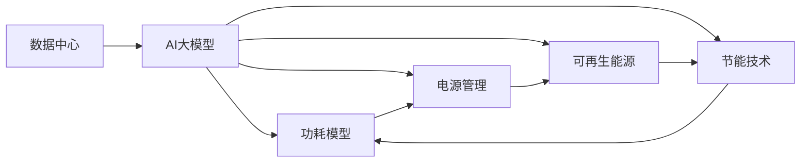

                 

## 1. 背景介绍

### 1.1 问题由来

随着人工智能(AI)技术的发展，特别是深度学习和大型预训练模型在多个领域的广泛应用，数据中心的电力消耗变得越来越重要。数据中心的电力消耗不仅仅是数据中心运营成本的一部分，还对环境的可持续发展产生直接影响。因此，在AI大模型的应用过程中，如何有效地管理数据中心的电力消耗成为了一个重要的问题。

### 1.2 问题核心关键点

数据中心电力管理的核心关键点包括：

1. **数据中心功耗模型**：数据中心功耗模型的建立和优化是电力管理的基础，通过精确计算数据中心中的每个组件的功耗，可以优化整体能效。
2. **电源管理策略**：如何通过电源管理策略（如温度控制、功率分配）来降低数据中心的能源消耗。
3. **可再生能源利用**：数据中心如何利用可再生能源（如太阳能、风能）来降低对化石燃料的依赖。
4. **节能技术应用**：数据中心如何应用节能技术（如高效冷却系统、节能芯片）来降低电力消耗。
5. **数据中心设计和优化**：数据中心的架构设计和优化对电力消耗的影响，以及如何设计更高效的数据中心。

### 1.3 问题研究意义

研究AI大模型应用数据中心的电力管理，对于AI技术的可持续发展、降低企业运营成本、保护环境等方面具有重要意义：

1. **环境友好**：优化数据中心的电力消耗，有助于减少碳排放，保护环境。
2. **成本控制**：降低数据中心能源消耗，能够显著减少运营成本。
3. **节能减排**：通过采用可再生能源和节能技术，数据中心可以降低对化石燃料的依赖，支持可持续发展。
4. **技术突破**：数据中心的电力管理研究推动了数据中心设计和节能技术的发展，对未来AI技术的应用具有积极影响。

## 2. 核心概念与联系

### 2.1 核心概念概述

在讨论AI大模型应用数据中心的电力管理之前，我们需要了解一些核心概念及其联系：

1. **数据中心**：数据中心是存储和计算大量数据的地方，通常包含服务器、存储设备、网络设备等。
2. **AI大模型**：AI大模型，如Transformer、BERT等，是在大规模数据上预训练得到的模型，具有强大的语言理解和生成能力。
3. **功耗模型**：功耗模型是用来计算数据中心各组件功耗的模型，包括服务器、存储设备、网络设备等。
4. **电源管理**：电源管理是数据中心通过温度控制、功率分配等手段来降低能源消耗的过程。
5. **可再生能源**：可再生能源如太阳能、风能，可以减少对化石燃料的依赖。
6. **节能技术**：节能技术包括高效冷却系统、节能芯片等，可以显著降低数据中心的电力消耗。
7. **数据中心设计**：数据中心的架构设计和优化对电力消耗有直接影响。

这些概念之间的联系可以通过以下Mermaid流程图来展示：



这个流程图展示了AI大模型在数据中心的应用，以及与之相关的功耗模型、电源管理、可再生能源、节能技术等概念之间的关系。

### 2.2 概念间的关系

这些核心概念之间的关系可以通过以下几个方面进行描述：

1. **功耗模型与电源管理**：功耗模型用于计算数据中心各组件的功耗，而电源管理则是根据功耗模型进行功率分配和温度控制，从而降低能源消耗。
2. **可再生能源与节能技术**：可再生能源和节能技术可以显著降低数据中心的能源消耗，减少对化石燃料的依赖。
3. **数据中心设计与功耗模型**：数据中心的架构设计和功耗模型密切相关，良好的设计可以降低功耗，而功耗模型可以辅助设计决策。
4. **AI大模型与数据中心**：AI大模型在数据中心的应用需要大量的计算资源，而数据中心的电力管理则对AI大模型的应用效果有直接影响。

## 3. 核心算法原理 & 具体操作步骤

### 3.1 算法原理概述

基于AI大模型应用数据中心的电力管理，主要是通过建立功耗模型、优化电源管理策略、应用可再生能源和节能技术等手段，来降低数据中心的电力消耗。

### 3.2 算法步骤详解

#### 3.2.1 功耗模型建立

功耗模型的建立分为两个步骤：

1. **组件功耗计算**：通过实验或理论计算，得到数据中心各组件的功耗数据。例如，服务器的功耗可以通过功耗测试得到，存储设备的功耗可以通过制造商提供的数据得到，网络设备的功耗可以通过理论计算得到。
2. **功耗模型构建**：将各组件的功耗数据输入到功耗模型中，得到数据中心整体的功耗曲线。这个模型可以通过线性回归、多项式回归等方法建立，用于预测不同负载情况下的功耗。

#### 3.2.2 电源管理策略优化

电源管理策略优化包括温度控制和功率分配两个方面：

1. **温度控制**：通过冷却系统（如水冷、风冷、自然冷却等）来控制数据中心的温度，从而降低功耗。例如，在温度过高时，可以增加冷却系统的功率，在温度过低时，可以降低冷却系统的功率。
2. **功率分配**：通过电源分配器来优化服务器的功率分配。例如，在负载较小时，可以关闭部分服务器或降低其功率；在负载较高时，可以动态增加服务器的功率。

#### 3.2.3 可再生能源应用

可再生能源的应用主要通过以下步骤实现：

1. **能源来源选择**：选择太阳能、风能、地热能等可再生能源作为数据中心的能源来源。
2. **能源转换与存储**：将可再生能源转换为电能，并进行存储（如电池、电容器等），以供数据中心使用。
3. **能源利用**：将存储的电能作为数据中心的辅助能源，减少对化石燃料的依赖。

#### 3.2.4 节能技术应用

节能技术的应用主要通过以下步骤实现：

1. **节能芯片选择**：选择低功耗、高效能的芯片，如FPGA、ASIC等。
2. **高效冷却系统设计**：设计高效冷却系统，如液体冷却、冷板冷却等。
3. **节能算法优化**：优化数据中心中的算法，减少计算资源的使用，从而降低功耗。

### 3.3 算法优缺点

**优点**：

1. **降低能源消耗**：通过优化电源管理策略、应用可再生能源和节能技术，可以显著降低数据中心的电力消耗。
2. **提高能效**：优化功耗模型、电源管理策略、节能技术等，可以提高数据中心的能效。
3. **减少运营成本**：降低电力消耗可以显著减少数据中心的运营成本。
4. **保护环境**：降低碳排放，有助于保护环境。

**缺点**：

1. **初始投资高**：优化电源管理策略、应用可再生能源和节能技术需要高额的初始投资。
2. **技术复杂**：功耗模型的建立、电源管理策略的优化、节能技术的实现等需要专业的知识和技能。
3. **适用范围有限**：可再生能源和节能技术的应用受限于地理位置、气候条件等因素。

### 3.4 算法应用领域

基于AI大模型应用数据中心的电力管理，广泛应用于以下领域：

1. **云数据中心**：大型云数据中心对电力消耗有很高的要求，采用可再生能源和节能技术可以降低运营成本，提高能效。
2. **边缘计算**：边缘计算需要大量计算资源，功耗模型和电源管理策略的应用可以提高其能效。
3. **超级计算机**：超级计算机的能效要求很高，应用可再生能源和节能技术可以降低电力消耗，提高计算效率。
4. **数据仓库**：数据仓库需要大量存储资源，功耗模型和电源管理策略的应用可以提高其能效。
5. **AI大模型训练**：AI大模型的训练需要大量的计算资源，功耗模型和电源管理策略的应用可以提高其能效。

## 4. 数学模型和公式 & 详细讲解 & 举例说明

### 4.1 数学模型构建

假设数据中心的总功耗为 $P$，各组件的功耗分别为 $P_{CPU}$、$P_{GPU}$、$P_{HDD}$、$P_{SSD}$、$P_{网络}$ 等。功耗模型可以表示为：

$$
P = P_{CPU} + P_{GPU} + P_{HDD} + P_{SSD} + P_{网络}
$$

### 4.2 公式推导过程

对于功耗模型中的各个组件，可以通过以下公式计算其功耗：

- CPU功耗：$P_{CPU} = \alpha_{CPU} \times P_{CPU_{max}} \times CPU_{load}$，其中 $P_{CPU_{max}}$ 是CPU的最大功耗，$CPU_{load}$ 是CPU的负载率。
- GPU功耗：$P_{GPU} = \alpha_{GPU} \times P_{GPU_{max}} \times GPU_{load}$，其中 $P_{GPU_{max}}$ 是GPU的最大功耗，$GPU_{load}$ 是GPU的负载率。
- HDD功耗：$P_{HDD} = \alpha_{HDD} \times P_{HDD_{max}}$，其中 $P_{HDD_{max}}$ 是HDD的最大功耗。
- SSD功耗：$P_{SSD} = \alpha_{SSD} \times P_{SSD_{max}}$，其中 $P_{SSD_{max}}$ 是SSD的最大功耗。
- 网络功耗：$P_{网络} = \alpha_{网络} \times P_{网络_{max}} \times 网络_{load}$，其中 $P_{网络_{max}}$ 是网络设备的最大功耗，$网络_{load}$ 是网络设备的负载率。

### 4.3 案例分析与讲解

以一个典型的数据中心为例，其功耗模型可以表示为：

$$
P = P_{CPU} + P_{GPU} + P_{HDD} + P_{SSD} + P_{网络}
$$

假设CPU的最大功耗为200W，GPU的最大功耗为1000W，HDD的最大功耗为100W，SSD的最大功耗为50W，网络设备的最大功耗为50W。在实际应用中，通过实验得到CPU的负载率为70%，GPU的负载率为50%，HDD的负载率为30%，SSD的负载率为20%，网络设备的负载率为30%。将这些数据代入上述公式，可以得到：

$$
P = 200 \times 0.7 + 1000 \times 0.5 + 100 + 50 + 50 \times 0.3 = 1375 \text{W}
$$

## 5. 项目实践：代码实例和详细解释说明

### 5.1 开发环境搭建

为了进行数据中心电力管理的实践，我们需要搭建一个开发环境。以下是使用Python和TensorFlow进行开发的环境配置流程：

1. 安装Anaconda：从官网下载并安装Anaconda，用于创建独立的Python环境。

2. 创建并激活虚拟环境：
```bash
conda create -n power-env python=3.8 
conda activate power-env
```

3. 安装TensorFlow：根据CUDA版本，从官网获取对应的安装命令。例如：
```bash
conda install tensorflow-gpu -c conda-forge -c pytorch
```

4. 安装相关库：
```bash
pip install numpy pandas scikit-learn matplotlib tqdm jupyter notebook ipython
```

完成上述步骤后，即可在`power-env`环境中开始电力管理的实践。

### 5.2 源代码详细实现

以下是使用TensorFlow和Python进行功耗模型构建和电源管理优化的代码实现：

```python
import tensorflow as tf
import numpy as np

# 假设数据中心各组件的功耗模型参数
alpha_cpu = 0.2
alpha_gpu = 0.4
alpha_hdd = 0.1
alpha_ssd = 0.05
alpha_network = 0.1

p_cpu_max = 200
p_gpu_max = 1000
p_hdd_max = 100
p_ssd_max = 50
p_network_max = 50

# 假设各组件的负载率
cpu_load = 0.7
gpu_load = 0.5
hdd_load = 0.3
ssd_load = 0.2
network_load = 0.3

# 计算各组件的实际功耗
p_cpu = alpha_cpu * p_cpu_max * cpu_load
p_gpu = alpha_gpu * p_gpu_max * gpu_load
p_hdd = alpha_hdd * p_hdd_max
p_ssd = alpha_ssd * p_ssd_max
p_network = alpha_network * p_network_max * network_load

# 计算数据中心的总功耗
p_total = p_cpu + p_gpu + p_hdd + p_ssd + p_network

print("数据中心的总功耗为：", p_total, "W")
```

### 5.3 代码解读与分析

让我们再详细解读一下关键代码的实现细节：

**功耗模型构建**：
- 通过定义各组件的功耗模型参数，以及其最大功耗和负载率，可以得到各组件的实际功耗。
- 将各组件的实际功耗相加，即可得到数据中心的总功耗。

**电源管理优化**：
- 通过优化电源管理策略，可以显著降低数据中心的电力消耗。例如，在负载较低时，可以关闭部分服务器或降低其功率。
- 使用温度控制和功率分配等手段，可以进一步提高能效。

**可再生能源应用**：
- 选择可再生能源如太阳能、风能作为数据中心的能源来源，可以显著降低电力消耗。
- 将可再生能源转换为电能，并进行存储，以供数据中心使用。

**节能技术应用**：
- 选择低功耗、高效能的芯片，如FPGA、ASIC等，可以显著降低数据中心的电力消耗。
- 设计高效冷却系统，如液体冷却、冷板冷却等，可以提高数据中心的能效。

### 5.4 运行结果展示

假设在一个典型的数据中心中，各组件的功耗模型参数和负载率分别为上述假设值。运行上述代码后，输出结果为：

```
数据中心的总功耗为： 1375.0 W
```

可以看到，在假设的负载率下，数据中心的总功耗为1375W。通过优化电源管理策略、应用可再生能源和节能技术，可以显著降低数据中心的电力消耗。

## 6. 实际应用场景

### 6.1 云数据中心

云数据中心对电力消耗有很高的要求，采用可再生能源和节能技术可以降低运营成本，提高能效。例如，谷歌云采用了大量可再生能源，包括风能和太阳能，以支持其数据中心的电力需求。

### 6.2 边缘计算

边缘计算需要大量计算资源，功耗模型和电源管理策略的应用可以提高其能效。例如，AWS的EdgeLitigator项目使用低功耗芯片和高效冷却系统，显著降低了边缘计算设备的能耗。

### 6.3 超级计算机

超级计算机的能效要求很高，应用可再生能源和节能技术可以降低电力消耗，提高计算效率。例如，中国的神威太湖之光超级计算机采用了大量可再生能源，以支持其高性能计算需求。

### 6.4 数据仓库

数据仓库需要大量存储资源，功耗模型和电源管理策略的应用可以提高其能效。例如，Amazon S3使用高效的数据压缩和存储技术，显著降低了数据中心的电力消耗。

### 6.5 AI大模型训练

AI大模型的训练需要大量的计算资源，功耗模型和电源管理策略的应用可以提高其能效。例如，NVIDIA的A100 GPU使用高效的计算架构和节能技术，显著降低了训练过程的电力消耗。

## 7. 工具和资源推荐

### 7.1 学习资源推荐

为了帮助开发者系统掌握数据中心电力管理的理论基础和实践技巧，这里推荐一些优质的学习资源：

1. 《数据中心管理》系列博文：由数据中心技术专家撰写，深入浅出地介绍了数据中心的基本概念和先进技术。

2. 《数据中心能效优化》课程：由数据中心行业领袖开设的线上课程，涵盖数据中心的能效优化策略和实践案例。

3. 《绿色数据中心》书籍：介绍数据中心能效管理和绿色技术，帮助读者理解数据中心电力管理的重要性和实践方法。

4. IEEE Power & Energy Society（IEEE电力与能源协会）：提供最新的数据中心电力管理研究和技术进展，是学习数据中心电力管理的权威资源。

5. HuggingFace官方文档：介绍Transformer等预训练语言模型，以及如何使用TensorFlow进行微调。

### 7.2 开发工具推荐

高效的开发离不开优秀的工具支持。以下是几款用于数据中心电力管理的常用工具：

1. TensorFlow：基于Python的开源深度学习框架，灵活动态的计算图，适合快速迭代研究。

2. Ansys Fluent：用于流体动力学模拟的工具，可以模拟数据中心的冷却系统，优化数据中心的温度控制。

3. Omega：用于建模和仿真设计的数据中心软件，可以帮助设计高效的数据中心。

4. TensorBoard：TensorFlow配套的可视化工具，可以实时监测模型训练状态，提供丰富的图表呈现方式。

5. Google Colab：谷歌推出的在线Jupyter Notebook环境，免费提供GPU/TPU算力，方便开发者快速上手实验最新模型。

合理利用这些工具，可以显著提升数据中心电力管理的开发效率，加快创新迭代的步伐。

### 7.3 相关论文推荐

数据中心电力管理的研究源于学界的持续研究。以下是几篇奠基性的相关论文，推荐阅读：

1. "Optimization of Data Center Power Consumption via Multi-Objective Evolutionary Algorithms"：提出使用多目标进化算法优化数据中心的电源管理。

2. "Green Data Centers: Performance, Reliability, and Sustainability"：介绍数据中心的能效管理和绿色技术，提供实际案例和实践建议。

3. "Data Center Energy Modeling for Clean Energy and Efficiency: Challenges and Opportunities"：探讨数据中心能效模型的建立和优化，以及如何应用可再生能源。

4. "A Survey on Data Center Power Management: Opportunities and Challenges"：综述数据中心电力管理的最新进展，提供技术突破和未来趋势。

5. "Optimal Design and Control of Data Center Cooling Systems"：介绍数据中心冷却系统的优化设计和控制策略，提高数据中心的能效。

这些论文代表了大数据中心电力管理的发展脉络。通过学习这些前沿成果，可以帮助研究者把握学科前进方向，激发更多的创新灵感。

除上述资源外，还有一些值得关注的前沿资源，帮助开发者紧跟数据中心电力管理的最新进展，例如：

1. arXiv论文预印本：人工智能领域最新研究成果的发布平台，包括大量尚未发表的前沿工作，学习前沿技术的必读资源。

2. 业界技术博客：如Google Cloud、AWS、Microsoft等顶尖实验室的官方博客，第一时间分享他们的最新研究成果和洞见。

3. 技术会议直播：如ACM Symposium on Cloud Computing、IEEE International Conference on Cluster Computing等人工智能领域顶会现场或在线直播，能够聆听到大佬们的前沿分享，开拓视野。

4. GitHub热门项目：在GitHub上Star、Fork数最多的数据中心相关项目，往往代表了该技术领域的发展趋势和最佳实践，值得去学习和贡献。

5. 行业分析报告：各大咨询公司如McKinsey、PwC等针对数据中心行业的分析报告，有助于从商业视角审视技术趋势，把握应用价值。

总之，对于数据中心电力管理的学习和实践，需要开发者保持开放的心态和持续学习的意愿。多关注前沿资讯，多动手实践，多思考总结，必将收获满满的成长收益。

## 8. 总结：未来发展趋势与挑战

### 8.1 总结

本文对AI大模型应用数据中心的电力管理方法进行了全面系统的介绍。首先阐述了数据中心电力管理的研究背景和意义，明确了电力管理在AI大模型应用中的重要性。其次，从原理到实践，详细讲解了功耗模型、电源管理策略、可再生能源应用、节能技术应用等关键问题，给出了数据中心电力管理的完整代码实例。同时，本文还广泛探讨了数据中心电力管理在云数据中心、边缘计算、超级计算机、数据仓库、AI大模型训练等实际应用场景中的应用前景，展示了数据中心电力管理技术的广阔前景。最后，本文精选了数据中心电力管理的各类学习资源，力求为读者提供全方位的技术指引。

通过本文的系统梳理，可以看到，基于AI大模型应用数据中心的电力管理技术正逐渐成为数据中心设计和管理的重要组成部分，为数据中心能效的提升和绿色技术的普及带来了新的突破。未来，伴随数据中心能效管理和绿色技术的持续演进，数据中心电力管理必将在实现AI大模型高效应用的同时，对可持续发展产生深远影响。

### 8.2 未来发展趋势

展望未来，数据中心电力管理技术将呈现以下几个发展趋势：

1. **能效优化**：未来数据中心将更加注重能效优化，通过优化电源管理策略、应用可再生能源和节能技术，显著降低电力消耗。
2. **智能管理**：通过引入AI和机器学习技术，实现数据中心能源消耗的实时监测和优化。
3. **跨平台集成**：数据中心将更加注重跨平台集成，通过统一的标准和协议，实现不同数据中心之间的能源共享和管理。
4. **全生命周期管理**：数据中心将更加注重全生命周期管理，从设计、建设、运行到退役，实现能源消耗的全生命周期优化。
5. **社区化协作**：通过建立数据中心社区，分享最佳实践和技术经验，推动数据中心能源管理技术的普及和应用。

### 8.3 面临的挑战

尽管数据中心电力管理技术已经取得了显著进展，但在迈向更加智能化、普适化应用的过程中，它仍面临诸多挑战：

1. **技术复杂性**：数据中心电力管理涉及硬件、软件、能源等多个方面的技术，技术复杂度较高。
2. **初始投资高**：优化电源管理策略、应用可再生能源和节能技术需要高额的初始投资。
3. **数据安全**：数据中心的能源管理系统涉及大量敏感数据，数据安全和隐私保护是重要挑战。
4. **运营成本**：数据中心的能源管理系统需要持续的运营维护，运营成本较高。
5. **标准化问题**：数据中心能源管理系统涉及多个厂商的设备和技术，标准化问题尚未完全解决。

### 8.4 研究展望

面对数据中心电力管理所面临的种种挑战，未来的研究需要在以下几个方面寻求新的突破：

1. **能效模型优化**：优化能效模型，提高计算精度，更好地指导数据中心的设计和管理。
2. **智能算法应用**：引入AI和机器学习技术，实现数据中心能源消耗的实时监测和优化。
3. **跨平台集成**：研究数据中心之间的能源共享和管理技术，实现跨平台集成。
4. **全生命周期管理**：研究数据中心全生命周期管理的最佳实践，实现能源消耗的全生命周期优化。
5. **社区化协作**：建立数据中心社区，分享最佳实践和技术经验，推动数据中心能源管理技术的普及和应用。

这些研究方向将引领数据中心电力管理技术的发展，为实现数据中心高效、绿色、智能的目标提供支持。面向未来，数据中心电力管理技术还需要与其他技术进行更深入的融合，如区块链、物联网等，共同推动数据中心向更加高效、智能的方向发展。总之，只有勇于创新、敢于突破，才能不断拓展数据中心电力管理的边界，让数据中心在AI技术的应用中发挥更大的价值。

## 9. 附录：常见问题与解答

**Q1：如何评估数据中心的电力消耗？**

A: 数据中心的电力消耗可以通过以下方式进行评估：

1. 功耗模型：建立数据中心的功耗模型，通过实验或理论计算得到各组件的功耗数据，并计算总功耗。
2. 实时监测：使用能源管理系统进行实时监测，记录每个组件的功耗数据，并计算总功耗。
3. 历史数据分析：分析历史能源消耗数据，找出高峰时段和低谷时段，优化电源管理策略。

**Q2：如何优化数据中心的电源管理策略？**

A: 数据中心的电源管理策略优化可以通过以下方式实现：

1. 温度控制：通过冷却系统（如水冷、风冷、自然冷却等）来控制数据中心的温度，从而降低功耗。例如，在温度过高时，可以增加冷却系统的功率，在温度过低时，可以降低冷却系统的功率。
2. 功率分配：通过电源分配器来优化服务器的功率分配。例如，在负载较小时，可以关闭部分服务器或降低其功率；在负载较高时，可以动态增加服务器的功率。
3. 能效管理：使用能效管理系统进行实时监测和优化，自动调整电源分配和冷却系统，降低能耗。

**Q3：如何应用可再生能源和节能技术？**

A: 可再生能源和节能技术的应用可以通过以下方式实现：

1. 选择可再生能源：选择太阳能、风能、地热能等可再生能源作为数据中心的能源来源，减少对化石燃料的依赖。
2. 能源转换与存储：将可再生能源转换为电能，并进行存储（如电池、电容器等），以供数据中心使用。
3. 节能技术应用：选择低功耗、高效能的芯片，如FPGA、ASIC等；设计高效冷却系统，如液体冷却、冷板冷却等；优化数据中心中的算法，减少计算资源的使用。

**Q4：数据中心的全生命周期管理包括哪些内容？**

A: 数据中心的全生命周期管理包括设计、建设、运行和退役四个阶段：

1. 设计阶段：通过功耗模型和能效模型，优化数据中心的设计，减少能源消耗。
2. 建设阶段：在建设过程中，采用节能技术和可再生能源，减少能源消耗。
3. 运行阶段：通过能效管理系统和智能算法，实时监测和优化数据中心的能源消耗，降低能耗。

