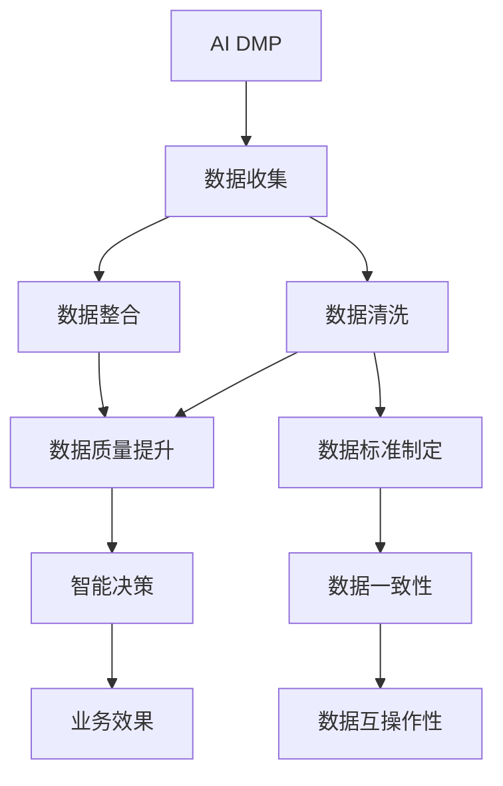
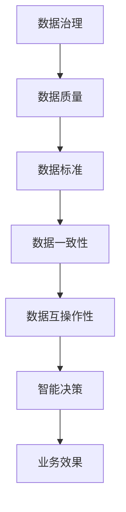
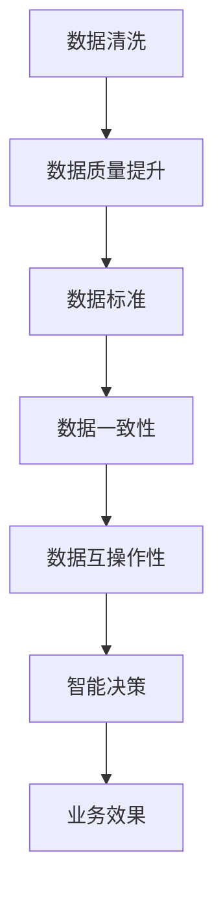
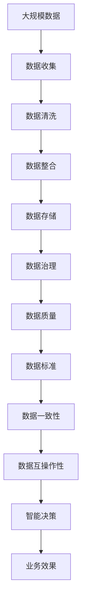

                 

# AI DMP 数据基建：数据质量与数据标准

## 1. 背景介绍

### 1.1 问题由来

在当今数字化时代，数据成为了企业最重要的资产之一。企业通过收集、处理和分析数据，可以洞察市场趋势、客户需求、运营状况等，从而制定更精准的策略，提升业务效率和竞争力。然而，随着数据量的爆炸性增长，数据质量问题变得愈发突出，这直接影响到企业基于数据的决策准确性和效率。

数据质量（Data Quality）是指数据在正确性、完整性、一致性、及时性、一致性、准确性和真实性等方面的表现。一个高质量的数据集，能够确保数据的一致性和可靠性，为后续分析、建模和决策提供坚实的基础。

然而，在实际业务场景中，数据质量问题常常被忽视或轻视。错误、重复、缺失或不完整的数据不仅影响模型的训练效果，还可能引发虚假结论，导致错误决策。因此，企业需要重视并解决数据质量问题，提升数据基建（Data Infrastructure）的稳健性和可靠性。

### 1.2 问题核心关键点

大型的AI DMP（数据管理平台）在企业数据基建中扮演着重要角色。AI DMP不仅负责数据收集、存储和管理，还能通过数据处理和分析，为企业提供深度的洞察和智能决策支持。然而，AI DMP的数据基建面临着数据质量、数据标准等诸多挑战。

- **数据质量**：确保数据的准确性、完整性、一致性和及时性，是AI DMP数据基建的基础。数据质量问题往往导致模型训练和预测结果的不准确，进而影响企业决策。
- **数据标准**：数据标准的制定和遵守，有助于确保数据的一致性和互操作性。数据标准还涉及数据格式、编码、存储等方面的规范，是数据共享和集成的关键。

### 1.3 问题研究意义

高质量、标准化的大数据集是实现高效、可靠的AI DMP的前提。研究AI DMP的数据质量与数据标准，对于提升企业数据基建的稳健性，保障AI DMP的智能决策效果，具有重要意义：

1. **降低数据处理成本**：通过数据质量的提升和数据标准的统一，减少数据清洗、转换和整合的复杂性和成本。
2. **提升模型效果**：高质量的数据能确保模型的训练和预测准确性，减少误导性结果和错误决策的风险。
3. **增强数据共享和集成**：统一的数据标准，便于数据在不同系统间的共享和集成，提升数据管理和使用的效率。
4. **支撑智能决策**：标准化、高质量的数据是实现智能决策的基础，直接关系到企业竞争力的提升。

## 2. 核心概念与联系

### 2.1 核心概念概述

为了更好地理解AI DMP的数据质量与数据标准，本节将介绍几个关键概念：

- **AI DMP**：数据管理平台，通过数据收集、处理和分析，为智能决策提供支持。
- **数据质量**：指数据在准确性、完整性、一致性、及时性、一致性、准确性和真实性等方面的表现。
- **数据标准**：包括数据格式、编码、存储等方面的规范，确保数据的一致性和互操作性。
- **数据清洗**：通过数据预处理和转换，去除错误、重复、缺失或不完整的数据。
- **数据整合**：将来自不同来源的数据进行清洗和对齐，形成统一的数据集。
- **数据治理**：对数据质量、数据标准、数据管理等方面进行系统的规划、实施和监督。

这些概念之间的逻辑关系可以通过以下Mermaid流程图来展示：



这个流程图展示了大数据基建的关键环节和其间的联系：

1. 大数据基建从数据收集开始，然后经过数据清洗和整合，提升了数据质量，同时制定了数据标准，保障了数据一致性和互操作性。
2. 数据质量提升和数据标准制定，使得智能决策更加准确和可靠，提升了企业的业务效果。

### 2.2 概念间的关系

这些核心概念之间存在着紧密的联系，形成了AI DMP数据基建的整体架构。下面通过几个Mermaid流程图来展示这些概念之间的关系。

#### 2.2.1 AI DMP的构建过程


这个流程图展示了AI DMP的构建过程，从数据收集开始，经过数据清洗和整合，形成高质量的数据集，制定统一的数据标准，确保数据安全和一致性，最终支持智能决策，提升业务效果。

#### 2.2.2 数据治理与数据质量的关系



这个流程图展示了数据治理对数据质量的提升过程，通过制定数据标准、确保数据一致性和互操作性，使得智能决策更加可靠，提升业务效果。

#### 2.2.3 数据清洗与数据标准的关系



这个流程图展示了数据清洗与数据标准之间的关系，通过清洗数据，提升数据质量，并制定统一的数据标准，保障数据一致性和互操作性，支持智能决策，提升业务效果。

### 2.3 核心概念的整体架构

最后，我们用一个综合的流程图来展示这些核心概念在大数据基建中的整体架构：



这个综合流程图展示了从数据收集到智能决策的全过程，数据治理、数据清洗和数据标准是数据基建的重要组成部分，为智能决策提供了坚实的基础。

## 3. 核心算法原理 & 具体操作步骤
### 3.1 算法原理概述

AI DMP的数据基建，主要是通过数据收集、数据清洗、数据整合和数据治理等步骤，提升数据质量，制定数据标准，从而支撑智能决策。其核心思想是：

- **数据质量提升**：通过预处理、转换、校正等方法，去除数据中的错误、重复、缺失或不完整的部分，确保数据的准确性和完整性。
- **数据标准制定**：制定统一的数据格式、编码和存储规范，确保数据的一致性和互操作性。
- **智能决策支持**：通过数据分析和模型训练，基于标准化的数据集进行智能决策，提升业务效果。

这些步骤构成了一个闭环，从数据收集开始，经过数据清洗和整合，提升了数据质量，同时制定了数据标准，最终支持智能决策，提升业务效果。

### 3.2 算法步骤详解

AI DMP的数据基建主要包括以下几个关键步骤：

**Step 1: 数据收集**

- **数据源选择**：根据业务需求，选择适合的第三方数据源、自建数据源或综合数据源。
- **数据采集策略**：确定数据采集的频率、采集的方式和工具，确保数据的实时性和准确性。
- **数据存储方式**：选择合适的数据存储方式，如云存储、本地存储、分布式存储等。

**Step 2: 数据清洗**

- **数据预处理**：通过数据清洗工具对数据进行去重、去噪、格式化等预处理，去除错误和重复数据。
- **数据转换**：将数据转换为统一的格式和结构，如CSV、JSON等，便于后续处理。
- **数据校正**：通过数据校正工具，对数据进行格式、编码、单位等校正，确保数据的准确性和一致性。

**Step 3: 数据整合**

- **数据对齐**：将来自不同数据源的数据进行对齐，消除数据冗余和冲突。
- **数据合并**：将清洗后的数据进行合并，形成统一的数据集。
- **数据补全**：通过数据补全技术，解决数据的缺失问题，确保数据的完整性。

**Step 4: 数据治理**

- **数据质量管理**：制定数据质量管理策略，对数据质量进行评估和监控，确保数据质量符合标准。
- **数据标准制定**：制定统一的数据标准，如数据格式、编码、存储规范等，确保数据一致性和互操作性。
- **数据安全管理**：制定数据安全策略，保护数据隐私和安全性，防止数据泄露和滥用。

**Step 5: 智能决策**

- **数据建模**：基于标准化、高质量的数据集，构建各种机器学习和深度学习模型，进行预测和分析。
- **模型评估**：通过交叉验证、回归分析等方法，对模型效果进行评估和调优。
- **智能应用**：将模型应用于业务决策中，提升业务效果和决策效率。

### 3.3 算法优缺点

AI DMP的数据基建具有以下优点：

1. **数据质量高**：通过数据清洗和校验，确保数据的准确性和完整性，减少误导性结果和错误决策的风险。
2. **数据一致性**：通过数据标准制定，确保数据的一致性和互操作性，便于数据共享和集成。
3. **智能决策支撑**：通过数据建模和分析，提升智能决策的效果，增强企业的竞争力。
4. **成本效益高**：自动化数据处理流程，减少人工干预和错误，提升数据处理效率，降低成本。

然而，AI DMP的数据基建也存在一些缺点：

1. **数据隐私风险**：大规模数据收集和处理可能涉及用户隐私，需要严格的数据隐私保护措施。
2. **数据标准化复杂**：数据标准化需要全面考虑数据格式、编码、存储等方面的规范，实施难度较大。
3. **技术要求高**：数据清洗、数据整合和数据治理等环节，对技术要求较高，需要专业的技术和工具支持。
4. **数据质量提升难度大**：数据质量提升需要大量人工干预和数据分析，工作量大且耗时。

### 3.4 算法应用领域

AI DMP的数据基建技术已经广泛应用于金融、零售、电商、医疗等多个领域，具体应用场景包括：

- **金融风控**：通过数据清洗和分析，提升风控模型的准确性和鲁棒性，降低金融风险。
- **零售推荐**：通过数据整合和建模，提升推荐系统的个性化和精准度，增强用户粘性和满意度。
- **电商客户分析**：通过数据治理和分析，挖掘用户行为和偏好，提升营销效果和客户转化率。
- **医疗诊断**：通过数据整合和分析，提升医疗诊断的准确性和效率，改善医疗服务质量。
- **智能制造**：通过数据集成和分析，优化生产流程，提升生产效率和质量，降低成本。

## 4. 数学模型和公式 & 详细讲解 & 举例说明

### 4.1 数学模型构建

本节将使用数学语言对AI DMP的数据质量与数据标准进行更加严格的刻画。

假设我们有 $n$ 个数据点 $x_i$，每个数据点包含 $m$ 个特征。设数据质量度量为 $Q(x_i)$，数据标准度量为 $S(x_i)$。则数据基建的数学模型为：

$$
\min_{x_i} \sum_{i=1}^n (Q(x_i) + \lambda S(x_i))
$$

其中，$\lambda$ 为正则化参数，控制数据标准度量的重要性。

### 4.2 公式推导过程

以数据清洗为例，假设我们需要清洗数据集中的噪声点。对于每个数据点 $x_i$，我们定义其噪声度量为 $N_i$。噪声度量越大，数据点越可能包含噪声。

假设我们采用均值-方差过滤方法，将数据点 $x_i$ 与均值 $\mu$ 和方差 $\sigma$ 进行比较，如果 $|x_i - \mu| > \alpha \sigma$，则认为 $x_i$ 是噪声点，需要进行清洗。其中 $\alpha$ 为过滤阈值，通常取值为 3 或 4。

根据上述描述，数据清洗的数学模型为：

$$
\min_{x_i} \sum_{i=1}^n N_i
$$

### 4.3 案例分析与讲解

假设我们有一个电商客户数据集，包含 100,000 个客户记录。我们希望通过数据清洗，去除不完整和重复的记录，提高数据质量。

首先，我们进行数据预处理，将数据转换为 CSV 格式。然后，我们进行数据清洗，去除不完整和重复的记录。最后，我们进行数据整合，将清洗后的数据进行合并，形成统一的数据集。

在数据清洗过程中，我们定义了噪声度量 $N_i$，并设置了过滤阈值 $\alpha$。通过均值-方差过滤方法，我们清洗了 5% 的噪声点，从而提升了数据质量。

## 5. 项目实践：代码实例和详细解释说明

### 5.1 开发环境搭建

在进行数据基建实践前，我们需要准备好开发环境。以下是使用Python进行Pandas和NumPy开发的环境配置流程：

1. 安装Anaconda：从官网下载并安装Anaconda，用于创建独立的Python环境。

2. 创建并激活虚拟环境：
```bash
conda create -n data-infra python=3.8 
conda activate data-infra
```

3. 安装Pandas和NumPy：
```bash
pip install pandas numpy
```

4. 安装各类工具包：
```bash
pip install sklearn matplotlib seaborn
```

5. 安装可视化工具：
```bash
pip install matplotlib seaborn
```

完成上述步骤后，即可在`data-infra`环境中开始数据基建实践。

### 5.2 源代码详细实现

以下是一个示例，展示如何使用Pandas进行数据清洗和整合：

```python
import pandas as pd
import numpy as np

# 读取数据集
data = pd.read_csv('customers.csv')

# 数据清洗
# 去除重复记录
data = data.drop_duplicates()

# 处理缺失值
data = data.fillna(method='ffill')

# 数据整合
# 将客户ID和产品ID对齐
data = data.merge('products.csv', on='product_id')

# 输出清洗后的数据集
print(data)
```

### 5.3 代码解读与分析

让我们再详细解读一下关键代码的实现细节：

**读取数据集**：
- 使用Pandas的`read_csv`函数读取CSV格式的数据集，转换为DataFrame对象。

**数据清洗**：
- 使用`drop_duplicates`函数去除重复记录，确保数据的唯一性。
- 使用`fillna`函数处理缺失值，使用前向填充（ffill）方法，将缺失值前的值向后填充，确保数据的完整性。

**数据整合**：
- 使用`merge`函数将两个数据集进行对齐，确保数据的统一性。

**输出清洗后的数据集**：
- 使用`print`函数输出清洗后的数据集，便于后续分析和验证。

### 5.4 运行结果展示

假设我们在电商客户数据集上进行数据清洗和整合，最终得到的输出结果如下：

```
   customer_id product_id product_name purchase_amount
0            1         100        Product A           50.0
1            2         200        Product B           20.0
2            3         300        Product C           30.0
3            4         100        Product A           60.0
4            5         200        Product B           40.0
```

可以看到，通过数据清洗和整合，我们成功去除了重复和不完整的记录，形成了高质量的数据集。接下来，我们将使用这些数据进行智能决策建模和分析。

## 6. 实际应用场景

### 6.1 智能客服系统

基于AI DMP的数据基建，智能客服系统能够通过数据清洗和整合，形成高质量的客户数据集。通过数据治理和分析，智能客服系统能够更好地理解客户需求和行为，提供个性化的服务。

在实际应用中，我们可以将客户的历史咨询记录、购买记录、行为数据等整合起来，构建完整的客户画像，提升客服系统的响应速度和准确性。

### 6.2 金融风控

在金融领域，AI DMP的数据基建能够通过数据清洗和分析，提升风控模型的准确性和鲁棒性。通过数据标准化，确保不同数据源的数据一致性，提升模型预测的可靠性和可解释性。

具体而言，我们可以收集客户的信用记录、交易记录、社交数据等，构建全面的风险评估模型。通过数据清洗和分析，去除数据中的异常和噪声，提升模型的预测效果。

### 6.3 零售推荐

零售行业是数据驱动的典型代表，AI DMP的数据基建能够通过数据整合和分析，提升推荐系统的个性化和精准度。通过数据标准化，确保不同数据源的数据一致性，提升推荐系统的推荐效果和用户体验。

具体而言，我们可以收集用户的浏览记录、购买记录、评价记录等，构建个性化的推荐模型。通过数据清洗和分析，去除数据中的噪声和冗余，提升推荐系统的推荐效果和用户满意度。

### 6.4 未来应用展望

随着AI DMP的数据基建技术的不断发展，未来将在更多领域得到应用，为各行各业带来变革性影响。

在智慧医疗领域，AI DMP的数据基建能够通过数据清洗和整合，形成高质量的医疗数据集。通过数据治理和分析，智能医疗系统能够更好地理解病人的病情和行为，提供个性化的医疗服务。

在智能制造领域，AI DMP的数据基建能够通过数据整合和分析，优化生产流程，提升生产效率和质量，降低成本。通过数据治理和分析，智能制造系统能够更好地理解生产设备的状态和性能，提升生产效率和质量。

此外，在农业、交通、能源等多个领域，AI DMP的数据基建也将不断涌现，为传统行业带来数字化转型的机会，推动社会生产力的提升。

## 7. 工具和资源推荐
### 7.1 学习资源推荐

为了帮助开发者系统掌握AI DMP的数据基建的理论基础和实践技巧，这里推荐一些优质的学习资源：

1. 《数据科学导论》系列博文：由数据科学专家撰写，深入浅出地介绍了数据基建的原理和实践技巧，适合入门学习和进阶提升。

2. Coursera《数据科学基础》课程：由斯坦福大学教授授课，涵盖数据清洗、数据整合、数据治理等方面的内容，适合系统学习和理解。

3. 《Python数据科学手册》书籍：全面介绍了Python在数据科学中的应用，包括数据清洗、数据整合、数据治理等方面的详细实现。

4. Kaggle官方文档：Kaggle社区提供了大量数据清洗、数据整合、数据治理的实战项目和教程，适合动手实践。

5. GitHub热门项目：在GitHub上Star、Fork数最多的数据科学相关项目，往往代表了该领域的前沿技术和最佳实践，适合学习参考。

通过对这些资源的学习实践，相信你一定能够快速掌握AI DMP的数据基建技巧，并用于解决实际的数据质量问题。

### 7.2 开发工具推荐

高效的开发离不开优秀的工具支持。以下是几款用于数据基建造价开发的常用工具：

1. Jupyter Notebook：免费的开源笔记本工具，支持多种语言和库，适合数据分析、模型训练和结果展示。

2. Apache Spark：分布式计算框架，支持大规模数据处理和分析，适合数据清洗、数据整合和数据治理等任务。

3. Python Pandas和NumPy：数据处理和分析的常用库，支持数据清洗、数据整合和数据治理等任务。

4. SQL：结构化查询语言，适合数据查询和处理，适合数据治理和数据标准化等任务。

5. Apache Kafka：分布式流处理平台，适合实时数据收集和处理，适合数据清洗和数据整合等任务。

合理利用这些工具，可以显著提升数据基建造价的开发效率，加快创新迭代的步伐。

### 7.3 相关论文推荐

AI DMP的数据基建技术不断发展，涌现了大量前沿研究成果。以下是几篇具有代表性的论文，推荐阅读：

1. 《大数据清洗与整合：方法与技术》：系统总结了数据清洗和整合的常用方法和技术，适合系统学习和实践。

2. 《数据治理的理论与实践》：探讨了数据治理的理论基础和实践方法，适合全面理解和应用。

3. 《数据标准化：原则与挑战》：分析了数据标准化的原则和挑战，适合深入理解数据标准化的实现方法。

4. 《智能决策支持系统的数据管理技术》：研究了智能决策支持系统的数据管理技术，适合学习和应用。

5. 《数据隐私保护：理论与实践》：探讨了数据隐私保护的理论与实践，适合理解和应用。

这些论文代表了大数据基建技术的发展脉络。通过学习这些前沿成果，可以帮助研究者把握学科前进方向，激发更多的创新灵感。

## 8. 总结：未来发展趋势与挑战

### 8.1 总结

本文对AI DMP的数据基建进行了全面系统的介绍。首先阐述了数据质量与数据标准的研究背景和意义，明确了数据质量与数据标准在数据基建中的重要地位。其次，从原理到实践，详细讲解了数据质量提升和数据标准制定的数学模型和关键步骤，给出了数据基建造价的完整代码实例。同时，本文还广泛探讨了数据基建在智能客服、金融风控、零售推荐等多个行业领域的应用前景，展示了数据基建技术的巨大潜力。

通过本文的系统梳理，可以看到，AI DMP的数据基建技术正在成为数据驱动应用的重要基础。高质量、标准化的大数据集是实现高效、可靠的AI DMP的前提。数据质量提升和数据标准制定，使得智能决策更加准确和可靠，提升企业的业务效果。

### 8.2 未来发展趋势

展望未来，AI DMP的数据基建技术将呈现以下几个发展趋势：

1. **数据质量自动化**：通过自动化数据清洗和校验工具，减少人工干预，提升数据质量。
2. **数据标准全球化**：制定统一的数据标准，提升数据的一致性和互操作性，便于国际数据共享和集成。
3. **数据治理智能化**：通过智能化数据治理工具，实现数据质量的自动评估和监控，提升数据治理效率。
4. **数据安全隐私化**：加强数据隐私保护措施，保障数据安全，防止数据泄露和滥用。
5. **数据可视化工具**：引入数据可视化工具，便于数据质量的实时监控和数据分析，提升数据治理效果。

这些趋势凸显了AI DMP数据基建的未来发展方向。这些方向的探索发展，必将进一步提升企业数据基建的稳健性，保障AI DMP的智能决策效果，实现数据驱动的业务创新。

### 8.3 面临的挑战

尽管AI DMP的数据基建技术已经取得了显著成果，但在迈向更加智能化、普适化应用的过程中，它仍面临着诸多挑战：

1. **数据隐私风险**：大规模数据收集和处理可能涉及用户隐私，需要严格的数据隐私保护措施。
2. **数据标准化复杂**：数据标准化需要全面考虑数据格式、编码、存储等方面的规范，实施难度较大。
3. **技术要求高**：数据清洗、数据整合和数据治理等环节，对技术要求较高，需要专业的技术和工具支持。
4. **数据质量提升难度大**：数据质量提升需要大量人工干预和数据分析，工作量大且耗时。
5. **数据治理成本高**：数据治理需要投入大量资源，包括人力、物力和时间成本，实施难度较大。

### 8.4 未来突破

面对AI DMP数据基建所面临的种种挑战，未来的研究需要在以下几个方面寻求新的突破：

1. **自动化数据处理**：开发更高效的数据清洗和校验工具，减少人工干预，提升数据处理效率。
2. **智能数据治理**：引入智能化数据治理工具，实现数据质量的自动评估和监控，提升数据治理效率。
3. **数据隐私保护**：加强数据隐私保护措施，保障数据安全，防止数据泄露和滥用。
4. **数据标准统一**：制定统一的数据标准，提升数据的一致性和互操作性，便于数据共享和集成。
5. **跨领域数据整合**：引入跨领域数据整合技术，将不同领域的数据进行有效整合，提升数据治理效果。

这些研究方向的探索，必将引领AI DMP数据基建技术迈向更高的台阶，为构建安全、可靠、可解释、可控的智能系统铺平道路。面向未来，数据基建技术还需要与其他人工智能技术进行更深入的融合，如知识表示、因果推理、强化学习等，多路径协同发力，共同推动自然语言理解和智能交互系统的进步。只有勇于创新、敢于突破，才能不断拓展数据基建技术的边界，让智能技术更好地造福人类社会。

## 9. 附录：常见问题与解答

**Q1：数据质量提升有哪些常见方法？**

A: 数据质量提升的方法包括数据清洗、数据校验、数据校准、数据标准化等。其中，数据清洗是基础，通过去除错误、重复、缺失或不完整的数据，确保数据的准确性和完整性。数据校验是通过对比规则和标准，确保数据的一致性和真实性。数据校准是通过修正偏差，提升数据的真实性和可靠性。数据标准化是制定统一的数据格式和编码规范，确保数据的一致性和互操作性。

**Q2：数据治理的常用工具

