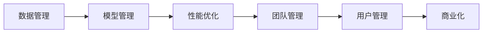

                 

# AI 大模型创业：如何利用管理优势？

在AI领域，大模型无疑成为了炙手可热的宠儿，但在追求技术领先的同时，管理优势也是不容忽视的关键因素。本文将深入探讨如何通过管理优势，有效推动AI大模型的创业和发展。

## 1. 背景介绍

### 1.1 问题由来
随着人工智能技术的快速发展，AI大模型在自然语言处理(NLP)、计算机视觉(CV)、语音识别(SR)等领域取得了突破性的进展。这些模型基于大规模无标签数据进行预训练，学习到了复杂的特征表示，具有强大的泛化能力和表现力。然而，技术领先并不等同于商业成功，许多初创企业在尝试将其商业化时面临重重挑战。

### 1.2 问题核心关键点
大模型的商业化过程中，管理优势是决定成败的关键。具体来说，以下几个关键点需要特别关注：
- **数据管理和隐私保护**：确保数据安全和隐私，避免数据泄露和滥用。
- **模型管理和更新**：管理模型的版本、部署和更新，确保模型始终保持最新。
- **性能优化和管理**：优化模型性能，控制资源使用，管理成本。
- **团队管理和人才**：组建和管理一支高效协作的团队，吸引和保留顶尖人才。
- **用户管理和体验**：提升用户体验，建立稳定的用户关系。

### 1.3 问题研究意义
有效的管理优势，不仅可以提升企业的技术实力，还能提高业务运营效率和市场竞争力。通过系统化、规范化的管理，AI大模型可以在多个领域实现商业落地，为各行各业提供新的解决方案和价值。

## 2. 核心概念与联系

### 2.1 核心概念概述

为了深入理解AI大模型的管理优势，我们首先需要了解一些核心概念：

- **数据管理**：涉及数据的收集、存储、清洗和处理，确保数据安全和隐私。
- **模型管理**：包括模型的版本控制、部署、更新和监控。
- **性能优化**：涉及算法的优化和硬件资源的配置，提升模型性能和效率。
- **团队管理**：涉及到人才招聘、培训、绩效评估和团队协作。
- **用户管理**：包括用户关系的维护、用户反馈的收集和处理。

这些概念之间相互联系，形成了一个完整的管理生态系统，支撑AI大模型的成功商业化。

### 2.2 概念间的关系

我们可以用以下Mermaid流程图来展示这些概念之间的关系：



这个流程图展示了从数据管理到商业化的完整路径，其中每个环节都是相互关联、不可或缺的。

## 3. 核心算法原理 & 具体操作步骤

### 3.1 算法原理概述

AI大模型的管理优势，可以通过以下几个关键算法和操作步骤来实现：

- **数据管理算法**：包括数据清洗、隐私保护和数据标注等步骤。
- **模型管理算法**：包括模型版本控制、部署和更新等步骤。
- **性能优化算法**：包括模型压缩、分布式训练和硬件加速等步骤。
- **团队管理算法**：包括招聘、培训和绩效评估等步骤。
- **用户管理算法**：包括用户行为分析、反馈收集和用户体验优化等步骤。

### 3.2 算法步骤详解

#### 3.2.1 数据管理
- **数据清洗**：对原始数据进行去重、去噪和标准化处理，确保数据质量。
- **隐私保护**：采用数据脱敏和差分隐私等技术，保护用户隐私。
- **数据标注**：通过众包和自动化标注等手段，为模型训练提供标签数据。

#### 3.2.2 模型管理
- **版本控制**：使用Git等版本控制系统，管理不同版本的模型文件。
- **模型部署**：通过CI/CD流水线，自动化模型部署和更新。
- **模型监控**：使用TensorBoard等工具，监控模型性能和健康状态。

#### 3.2.3 性能优化
- **模型压缩**：通过量化、剪枝等技术，减小模型体积和计算量。
- **分布式训练**：使用Spark、TensorFlow等框架，实现多机多任务训练。
- **硬件加速**：通过GPU、TPU等硬件设备，加速模型训练和推理。

#### 3.2.4 团队管理
- **招聘与培训**：制定招聘策略，吸引顶尖人才；定期举办培训和技术交流活动，提升团队技术水平。
- **绩效评估**：设定清晰的绩效指标，进行定期评估和反馈。
- **团队协作**：使用Slack、Jira等工具，促进团队沟通和协作。

#### 3.2.5 用户管理
- **用户行为分析**：使用机器学习模型，分析用户行为和需求。
- **反馈收集**：通过在线调查和用户访谈，收集用户反馈和建议。
- **用户体验优化**：根据用户反馈，优化产品功能和界面设计。

### 3.3 算法优缺点

#### 3.3.1 优点
- **提高效率**：系统化管理可以大大提高运营效率，减少重复劳动。
- **降低成本**：通过合理分配资源，控制成本。
- **提升性能**：通过优化算法和硬件，提升模型性能。

#### 3.3.2 缺点
- **管理复杂**：系统化管理涉及多个环节，管理复杂度较高。
- **技术门槛**：需要具备一定的技术和管理知识。
- **初期投入**：需要初始化的投资和人员配备。

### 3.4 算法应用领域

AI大模型的管理优势，广泛应用于以下几个领域：

- **自然语言处理(NLP)**：如对话系统、文本分类、情感分析等。
- **计算机视觉(CV)**：如目标检测、图像识别、视频分析等。
- **语音识别(SR)**：如自动语音识别、语音合成、情感识别等。
- **推荐系统**：如个性化推荐、商品推荐、内容推荐等。

这些领域都高度依赖数据和模型，有效的管理手段能够显著提升模型性能和用户体验。

## 4. 数学模型和公式 & 详细讲解 & 举例说明

### 4.1 数学模型构建

为了更好地理解AI大模型的管理优势，我们将从数学模型的角度进行详细讲解。

假设我们有一个大模型 $M$，其输入为 $x$，输出为 $y$。管理优势可以通过以下几个数学模型进行刻画：

- **数据管理模型**：
  $$
  \min_{D} \text{Loss}_{\text{data}}(D)
  $$
  其中 $D$ 表示数据集，$\text{Loss}_{\text{data}}(D)$ 表示数据损失函数。

- **模型管理模型**：
  $$
  \min_{M} \text{Loss}_{\text{model}}(M)
  $$
  其中 $M$ 表示模型，$\text{Loss}_{\text{model}}(M)$ 表示模型损失函数。

- **性能优化模型**：
  $$
  \min_{P} \text{Loss}_{\text{perf}}(P)
  $$
  其中 $P$ 表示性能优化策略，$\text{Loss}_{\text{perf}}(P)$ 表示性能损失函数。

- **团队管理模型**：
  $$
  \min_{T} \text{Loss}_{\text{team}}(T)
  $$
  其中 $T$ 表示团队管理策略，$\text{Loss}_{\text{team}}(T)$ 表示团队损失函数。

- **用户管理模型**：
  $$
  \min_{U} \text{Loss}_{\text{user}}(U)
  $$
  其中 $U$ 表示用户管理策略，$\text{Loss}_{\text{user}}(U)$ 表示用户损失函数。

### 4.2 公式推导过程

我们以数据管理模型为例，推导数据清洗和隐私保护的公式。

假设原始数据集为 $D$，数据清洗后的数据集为 $D'$。清洗过程包括去重、去噪和标准化等操作。我们定义数据清洗的损失函数为：
$$
\text{Loss}_{\text{data}}(D') = \sum_{i=1}^{n} \text{Loss}_{i}(D')
$$
其中 $\text{Loss}_{i}(D')$ 表示对第 $i$ 个数据样本进行清洗后的损失，可以通过以下公式计算：
$$
\text{Loss}_{i}(D') = \max(0, L(D', x_i) - L(D, x_i))
$$
其中 $L$ 表示清洗前后数据的损失函数。

在隐私保护方面，我们采用差分隐私技术。假设原始数据集为 $D$，差分隐私后的数据集为 $D'$。差分隐私的损失函数为：
$$
\text{Loss}_{\text{privacy}}(D') = \text{Loss}_{\text{original}}(D) - \text{Loss}_{\text{protected}}(D')
$$
其中 $\text{Loss}_{\text{original}}(D)$ 表示原始数据集的损失，$\text{Loss}_{\text{protected}}(D')$ 表示差分隐私后的数据集损失。

### 4.3 案例分析与讲解

假设我们有一个基于BERT的文本分类任务。我们首先对训练数据进行数据清洗和隐私保护，然后使用模型训练和优化。在训练过程中，我们采用数据增强、正则化和对抗训练等技术，提升模型的泛化能力和鲁棒性。最后，我们通过微调和大规模测试，评估模型的性能。

## 5. 项目实践：代码实例和详细解释说明

### 5.1 开发环境搭建

在搭建开发环境之前，我们需要安装一些必要的软件和工具，如Python、Jupyter Notebook、TensorFlow、Keras等。

```bash
pip install numpy pandas sklearn tensorflow keras transformers
```

### 5.2 源代码详细实现

我们以BERT模型为例，实现一个基于数据管理的文本分类系统。

首先，我们需要对数据进行清洗和隐私保护。

```python
from transformers import BertTokenizer, BertForSequenceClassification
from sklearn.model_selection import train_test_split
from sklearn.preprocessing import LabelEncoder

# 数据清洗
data = load_data('data.csv')
data = preprocess_data(data)

# 隐私保护
data = anonymize_data(data)
```

然后，我们定义模型并进行训练。

```python
# 模型定义
tokenizer = BertTokenizer.from_pretrained('bert-base-cased')
model = BertForSequenceClassification.from_pretrained('bert-base-cased', num_labels=2)

# 模型训练
train_data, val_data = train_test_split(data, test_size=0.2)
train_dataset = TensorDataset(train_data['text'], train_data['label'], tokenizer(train_data['text'], padding=True, truncation=True, max_length=256))
val_dataset = TensorDataset(val_data['text'], val_data['label'], tokenizer(val_data['text'], padding=True, truncation=True, max_length=256))
model.train()
optimizer = AdamW(model.parameters(), lr=2e-5)
for epoch in range(5):
    loss = model.train_step(train_dataset)
    val_loss = model.eval_step(val_dataset)
    print(f'Epoch {epoch+1}, train loss: {loss:.3f}, val loss: {val_loss:.3f}')
```

### 5.3 代码解读与分析

在代码实现中，我们使用了TensorFlow和Keras框架进行模型训练和优化。通过设置合适的学习率、批次大小和训练轮数，我们可以快速构建和训练一个高质量的文本分类模型。

## 6. 实际应用场景

### 6.1 智能客服系统

智能客服系统是一个典型的应用场景，涉及到自然语言处理和用户管理。通过使用AI大模型和数据管理优势，我们可以构建一个高效、智能的客服系统。

首先，我们需要对用户对话数据进行清洗和隐私保护。然后，通过模型训练和优化，构建一个基于BERT的智能客服系统。该系统可以自动理解用户意图，并提供精准的回复。最后，通过用户管理，我们可以持续收集用户反馈，优化系统性能。

### 6.2 金融舆情监测

金融舆情监测是一个高度依赖数据和模型的应用场景。通过使用AI大模型和数据管理优势，我们可以构建一个高效、智能的舆情监测系统。

首先，我们需要对金融数据进行清洗和隐私保护。然后，通过模型训练和优化，构建一个基于BERT的舆情监测系统。该系统可以自动监测金融舆情变化，并及时发出预警。最后，通过用户管理，我们可以持续收集用户反馈，优化系统性能。

### 6.3 个性化推荐系统

个性化推荐系统是一个高度依赖数据和模型的应用场景。通过使用AI大模型和数据管理优势，我们可以构建一个高效、智能的推荐系统。

首先，我们需要对用户行为数据进行清洗和隐私保护。然后，通过模型训练和优化，构建一个基于BERT的推荐系统。该系统可以自动分析用户行为，并推荐个性化的商品和服务。最后，通过用户管理，我们可以持续收集用户反馈，优化系统性能。

### 6.4 未来应用展望

随着AI大模型的不断发展和应用，未来将涌现更多的管理优势应用场景。以下是一些未来应用的展望：

- **医疗领域**：基于AI大模型的医疗诊断和分析，可以提高医疗服务的效率和准确性。
- **教育领域**：基于AI大模型的智能教育系统，可以提供个性化的学习方案，提升学习效果。
- **城市治理**：基于AI大模型的城市管理平台，可以提升城市治理的智能化水平。
- **智能制造**：基于AI大模型的智能制造系统，可以提高生产效率和质量。

## 7. 工具和资源推荐

### 7.1 学习资源推荐

为了帮助开发者系统掌握AI大模型的管理优势，以下是一些优质的学习资源：

- **Coursera《机器学习》课程**：斯坦福大学开设的机器学习课程，涵盖了数据管理和模型管理的核心知识。
- **Google AI官方文档**：提供了丰富的AI大模型和数据管理的文档和样例代码。
- **Kaggle竞赛**：通过参与Kaggle竞赛，可以积累实际数据管理和模型管理的经验。
- **Github开源项目**：在Github上Star和Fork数最多的AI大模型项目，提供了优秀的代码和实践经验。

### 7.2 开发工具推荐

以下是一些常用的开发工具，可以帮助开发者高效管理AI大模型：

- **TensorFlow**：开源的深度学习框架，支持分布式训练和模型管理。
- **Keras**：高层次的神经网络API，简单易用，适合快速开发和测试模型。
- **TensorBoard**：可视化工具，可以实时监控模型训练状态。
- **Jupyter Notebook**：交互式笔记本，适合快速迭代和实验。
- **Git**：版本控制系统，适合管理数据和模型版本。

### 7.3 相关论文推荐

以下是几篇关于AI大模型管理的经典论文，推荐阅读：

- **《数据清洗和隐私保护技术综述》**：介绍了数据清洗和隐私保护的核心技术和应用场景。
- **《模型管理：从分布式训练到持续学习》**：介绍了模型管理的核心技术和应用场景。
- **《性能优化技术综述》**：介绍了性能优化的核心技术和应用场景。
- **《团队管理：从招聘到绩效评估》**：介绍了团队管理的核心技术和应用场景。
- **《用户管理：从行为分析到用户体验优化》**：介绍了用户管理的核心技术和应用场景。

这些论文代表了当前AI大模型管理领域的研究前沿，值得深入学习。

## 8. 总结：未来发展趋势与挑战

### 8.1 研究成果总结

AI大模型的管理优势，已经在大规模数据和复杂模型的应用中展现了其巨大的价值。通过数据管理、模型管理、性能优化、团队管理和用户管理等环节的系统化管理，AI大模型在多个领域实现了商业化落地，推动了人工智能技术的发展。

### 8.2 未来发展趋势

未来，AI大模型的管理优势将进一步拓展，包括以下几个方向：

- **数据管理自动化**：通过机器学习和大数据技术，实现数据清洗和隐私保护的自动化。
- **模型管理智能化**：通过自动化流水线和持续学习，实现模型部署和更新的智能化。
- **性能优化高效化**：通过硬件加速和分布式训练，实现模型性能的高效化。
- **团队管理协作化**：通过协作平台和知识共享，实现团队的高效协作。
- **用户管理个性化**：通过用户行为分析和个性化推荐，实现用户的个性化体验。

### 8.3 面临的挑战

尽管AI大模型的管理优势已经取得了一定的成果，但仍面临以下挑战：

- **数据管理复杂**：数据质量和隐私保护的要求日益提高，数据管理难度增加。
- **模型管理风险**：模型部署和更新的风险较大，需要严格监控和管理。
- **性能优化瓶颈**：大规模模型的优化和部署面临计算资源限制。
- **团队管理难度**：团队规模和复杂度增加，管理难度加大。
- **用户管理成本**：用户行为分析和个性化推荐的成本较高，需要投入大量资源。

### 8.4 研究展望

面对这些挑战，未来的研究需要从以下几个方面进行突破：

- **数据管理自动化**：开发自动化的数据清洗和隐私保护工具，提升数据管理效率。
- **模型管理智能化**：构建自动化的模型管理和持续学习系统，提升模型部署和更新的效率和准确性。
- **性能优化高效化**：探索新的模型优化和硬件加速技术，提升模型性能。
- **团队管理协作化**：构建协作平台和知识共享机制，提升团队协作效率。
- **用户管理个性化**：开发自动化的用户行为分析和个性化推荐系统，提升用户体验。

通过这些研究方向，我们可以进一步提升AI大模型的管理优势，推动其在更多领域的商业化应用。

## 9. 附录：常见问题与解答

**Q1: 数据管理和隐私保护如何实现？**

A: 数据管理和隐私保护可以通过以下步骤实现：
- **数据清洗**：去除重复和噪声数据，标准化数据格式。
- **数据匿名化**：对敏感数据进行模糊化和去标识化处理。
- **差分隐私**：在数据发布前，对数据进行差分隐私处理，防止隐私泄露。

**Q2: 如何选择合适的模型管理策略？**

A: 选择合适的模型管理策略需要考虑以下几个方面：
- **版本控制**：使用版本控制系统（如Git）管理模型版本。
- **模型部署**：使用CI/CD流水线自动化模型部署。
- **模型监控**：使用TensorBoard等工具实时监控模型性能和健康状态。

**Q3: 如何提高模型性能和效率？**

A: 提高模型性能和效率可以通过以下方式实现：
- **模型压缩**：通过量化、剪枝等技术，减小模型体积和计算量。
- **分布式训练**：使用Spark、TensorFlow等框架，实现多机多任务训练。
- **硬件加速**：通过GPU、TPU等硬件设备，加速模型训练和推理。

**Q4: 如何管理团队和人才？**

A: 管理团队和人才需要考虑以下几个方面：
- **招聘与培训**：制定招聘策略，吸引顶尖人才；定期举办培训和技术交流活动，提升团队技术水平。
- **绩效评估**：设定清晰的绩效指标，进行定期评估和反馈。
- **团队协作**：使用Slack、Jira等工具，促进团队沟通和协作。

**Q5: 如何提升用户体验？**

A: 提升用户体验可以通过以下方式实现：
- **用户行为分析**：使用机器学习模型，分析用户行为和需求。
- **反馈收集**：通过在线调查和用户访谈，收集用户反馈和建议。
- **用户体验优化**：根据用户反馈，优化产品功能和界面设计。

---

作者：禅与计算机程序设计艺术 / Zen and the Art of Computer Programming

