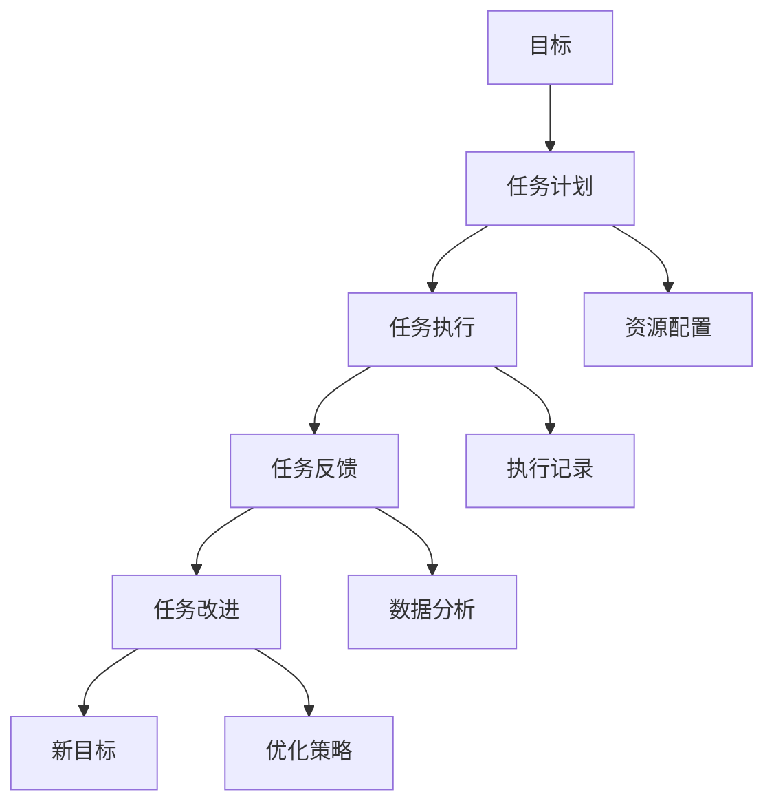
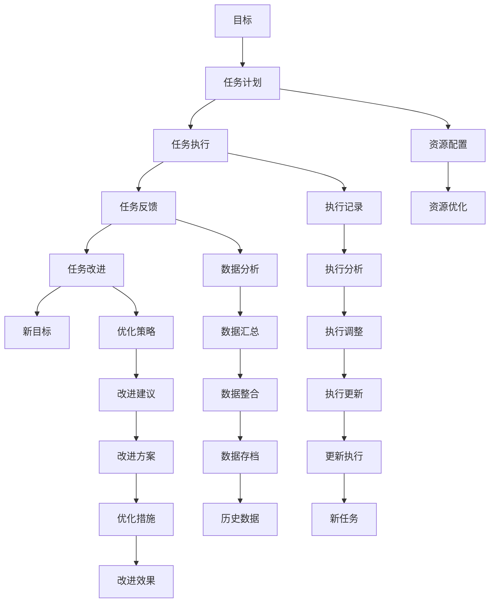

                 

# PDCA戴明环:行动落地的法宝

> 关键词：PDCA环,戴明环,行动计划,执行反馈,持续改进

## 1. 背景介绍

### 1.1 问题由来

在信息化快速发展的今天，企业面临着前所未有的挑战。新技术的涌现和市场环境的变化，要求企业能够快速响应，持续创新。然而，在实际工作中，由于缺乏科学的管理方法和工具，企业在执行决策、解决问题和提升效率方面常常面临诸多困难。

PDCA（Plan-Do-Check-Act）戴明环，作为一种经典的管理工具，旨在帮助企业实现目标的制定、执行、反馈和改进，从而在动态环境中实现持续改进和优化。然而，传统的PDCA环更多依赖人工手动操作，效率低下，且无法实现实时监控和智能化决策。

### 1.2 问题核心关键点

为了提升PDCA环的执行效率和智能化水平，现代企业需要借助信息技术和软件工具，建立一套自动化的PDCA管理平台。该平台需要具备以下几个关键功能：

1. **计划制定**：自动生成任务计划和目标，支持多级任务分解和优先级排序。
2. **执行监控**：实时跟踪任务进展，通过可视化界面展示任务状态和进度。
3. **反馈机制**：自动收集任务执行过程中的数据和反馈，生成报告和分析结果。
4. **持续改进**：基于历史数据和反馈信息，自动优化任务计划和执行策略，实现持续改进。

通过这些功能，PDCA环不仅能提升执行效率，还能确保决策的科学性和准确性，推动企业向智能化管理转型。

### 1.3 问题研究意义

现代企业需要面对复杂多变的市场环境，依靠人工管理往往无法满足需求。利用信息技术和软件工具，建立自动化的PDCA环，不仅能够提升管理效率，还能帮助企业实现精细化管理，提升决策的科学性和准确性。

具体而言，自动化的PDCA环可以带来以下几个方面的提升：

1. **提升执行效率**：自动化工具能够快速生成和管理任务计划，实时监控任务进展，自动收集和分析数据，大大缩短决策和执行的时间。
2. **优化资源分配**：通过数据分析和智能调度，自动优化资源配置，提高资源利用率。
3. **强化执行反馈**：自动化的PDCA环可以提供实时反馈和建议，帮助管理者及时调整执行策略，提升执行效果。
4. **推动持续改进**：基于历史数据和实时反馈，自动化的PDCA环能够持续优化任务计划和执行策略，实现持续改进。

总之，利用信息技术和软件工具，建立自动化的PDCA环，有助于企业实现目标的快速制定、高效执行、实时监控和持续改进，从而在动态环境中保持竞争优势。

## 2. 核心概念与联系

### 2.1 核心概念概述

为更好地理解PDCA戴明环的实现过程，本节将介绍几个密切相关的核心概念：

- **PDCA环**：由美国质量管理专家W. Edwards Deming提出，旨在通过持续改进的过程实现目标。PDCA环分为四个阶段：计划(Plan)、执行(Do)、检查(Check)、改进(Act)。
- **任务计划**：对目标进行分解，制定详细的执行计划，分配资源和任务。
- **任务执行**：按照计划执行任务，记录执行过程中的数据和反馈。
- **任务反馈**：收集任务执行过程中的数据和反馈，生成报告和分析结果。
- **任务改进**：基于历史数据和反馈信息，自动优化任务计划和执行策略，实现持续改进。

这些核心概念之间的逻辑关系可以通过以下Mermaid流程图来展示：

```mermaid
graph TB
    A[计划(Plan)] --> B[执行(Do)]
    B --> C[检查(Check)]
    C --> D[改进(Act)]
    D --> E[返回A]
```

这个流程图展示了大环PDCA的四个关键阶段：计划、执行、检查和改进。各个阶段之间相互关联，形成闭环，确保目标的顺利实现。

### 2.2 概念间的关系

这些核心概念之间存在着紧密的联系，形成了PDCA环的完整实施过程。

#### 2.2.1 PDCA环的整体架构



这个综合流程图展示了PDCA环的完整架构，从目标制定到任务计划，再到任务执行、反馈和改进，形成了一个闭环系统。

#### 2.2.2 与信息技术的结合

在现代企业中，PDCA环的实施离不开信息技术的支持。利用信息技术和软件工具，可以实现以下目标：

- **自动化计划制定**：通过软件工具自动生成任务计划，支持多级任务分解和优先级排序。
- **实时执行监控**：利用可视化界面实时跟踪任务进展，展示任务状态和进度。
- **自动化数据收集**：自动收集任务执行过程中的数据和反馈，生成报告和分析结果。
- **持续优化改进**：基于历史数据和实时反馈，自动优化任务计划和执行策略，实现持续改进。

这些自动化功能大大提升了PDCA环的执行效率和智能化水平，使其在复杂多变的市场环境中仍能保持高效运行。

### 2.3 核心概念的整体架构

最后，我们用一个综合的流程图来展示这些核心概念在大环PDCA中的实施过程：



这个综合流程图展示了PDCA环的详细执行过程，从目标制定到任务计划、执行、反馈和改进，形成了一个完整的闭环系统。同时，还引入了资源配置、数据分析和优化策略等辅助功能，进一步提升了PDCA环的执行效率和智能化水平。

## 3. 核心算法原理 & 具体操作步骤
### 3.1 算法原理概述

PDCA戴明环的核心算法原理是循环迭代，通过不断计划、执行、反馈和改进，实现目标的逐步实现和优化。其核心思想是：

1. **计划(Plan)**：制定目标和计划，明确执行步骤和资源配置。
2. **执行(Do)**：按照计划执行任务，记录执行过程中的数据和反馈。
3. **反馈(Check)**：收集任务执行过程中的数据和反馈，生成报告和分析结果。
4. **改进(Act)**：基于历史数据和反馈信息，自动优化任务计划和执行策略，实现持续改进。

通过循环迭代，PDCA环能够实现目标的逐步实现和优化，提升管理效率和执行效果。

### 3.2 算法步骤详解

基于PDCA环的核心算法原理，实现PDCA戴明环的软件系统需要遵循以下几个关键步骤：

#### 3.2.1 计划制定

1. **目标设定**：根据企业战略和市场需求，设定具体、可衡量、可实现的目标。
2. **任务分解**：将目标分解为具体的任务和子任务，明确任务执行步骤和资源配置。
3. **任务分配**：将任务分配给相关人员，设定任务优先级和时间节点。

#### 3.2.2 执行监控

1. **任务执行**：按照任务计划执行任务，记录执行过程中的数据和反馈。
2. **进度跟踪**：利用可视化界面实时跟踪任务进展，展示任务状态和进度。
3. **问题记录**：记录执行过程中的问题和挑战，生成问题报告。

#### 3.2.3 反馈收集

1. **数据收集**：自动收集任务执行过程中的数据和反馈，生成报告和分析结果。
2. **数据分析**：利用数据分析工具对收集到的数据进行分析，生成可视化图表和分析报告。
3. **报告生成**：基于数据分析结果，生成任务执行报告和问题报告。

#### 3.2.4 持续改进

1. **策略优化**：基于历史数据和实时反馈，自动优化任务计划和执行策略。
2. **任务调整**：根据优化策略，调整任务计划和执行步骤。
3. **持续执行**：按照调整后的任务计划，继续执行任务，进入下一轮PDCA循环。

### 3.3 算法优缺点

**优点**：

- **自动化执行**：通过软件工具实现PDCA环的自动化执行，大幅提升执行效率。
- **实时监控**：利用可视化界面实时跟踪任务进展，快速发现和解决问题。
- **数据驱动**：基于历史数据和实时反馈，自动优化任务计划和执行策略，实现持续改进。

**缺点**：

- **技术依赖**：系统依赖于软件工具和技术平台，技术故障或系统崩溃可能导致执行中断。
- **数据质量**：系统的执行效果依赖于数据的质量和完整性，数据缺失或不准确可能导致错误的决策和执行。
- **人员配合**：系统的有效运行需要相关人员的积极配合，缺乏有效沟通和协作可能导致执行偏差。

### 3.4 算法应用领域

PDCA戴明环作为一种经典的管理工具，广泛应用于各类企业和管理领域，包括但不限于以下领域：

- **项目管理**：通过PDCA环实现项目的计划、执行、反馈和改进，确保项目按时、按质完成。
- **运营管理**：利用PDCA环优化运营流程，提升生产效率和运营效果。
- **人力资源管理**：通过PDCA环制定和优化人力资源计划，提升员工满意度和工作效果。
- **市场管理**：利用PDCA环优化市场策略，提升市场竞争力和市场份额。
- **质量管理**：通过PDCA环提升产品质量和生产过程的优化，确保产品质量符合客户需求。

这些应用领域展示了PDCA环的广泛适用性和实用价值，为其在企业中的应用提供了坚实的基础。

## 4. 数学模型和公式 & 详细讲解 & 举例说明

### 4.1 数学模型构建

PDCA环的实现可以通过多种数学模型和算法工具来实现。以下是一种基本的数学模型构建方法：

1. **目标设定**：设目标为 $T$，将其分解为多个具体任务 $T_1, T_2, \dots, T_n$。
2. **任务计划**：设任务计划为 $P$，包括任务步骤、资源配置和优先级排序。
3. **任务执行**：设任务执行结果为 $D$，记录任务执行过程中的数据和反馈。
4. **任务反馈**：设任务反馈为 $F$，包括任务执行报告和问题报告。
5. **任务改进**：设任务改进策略为 $A$，基于历史数据和实时反馈，自动优化任务计划和执行策略。

通过这些变量，可以构建PDCA环的数学模型：

$$
P = f(T, \text{资源配置}, \text{优先级})
$$

$$
D = f(P, T, \text{数据记录})
$$

$$
F = f(D, \text{反馈信息}, \text{数据分析})
$$

$$
A = f(F, D, T, \text{历史数据})
$$

### 4.2 公式推导过程

以下我们将通过一个简单的例子来推导PDCA环的数学模型：

假设企业设定了一个目标 $T$：“在3个月内提升产品质量”。我们将目标分解为三个具体任务 $T_1, T_2, T_3$：

1. **任务1**：优化生产流程，提升生产效率。
2. **任务2**：加强质量检测，提升产品质量。
3. **任务3**：改进员工培训，提升员工技能。

任务计划 $P$ 包括任务步骤、资源配置和优先级排序：

1. 优先级：任务1 > 任务2 > 任务3
2. 资源配置：任务1分配2名工程师，任务2分配3名工程师，任务3分配1名工程师。

任务执行 $D$ 记录任务执行过程中的数据和反馈：

1. 任务1：完成生产流程优化，记录改进效果。
2. 任务2：加强质量检测，记录检测结果和问题。
3. 任务3：改进员工培训，记录培训效果。

任务反馈 $F$ 包括任务执行报告和问题报告：

1. 任务1：生产流程优化效果显著，但资源配置不足。
2. 任务2：质量检测结果合格，但问题反馈较多。
3. 任务3：员工培训效果良好，但时间安排不合理。

任务改进 $A$ 基于历史数据和实时反馈，自动优化任务计划和执行策略：

1. 任务1：增加资源配置，重新安排任务计划。
2. 任务2：优化质量检测流程，改进检测方法。
3. 任务3：调整培训计划，优化培训时间安排。

通过以上推导，可以看出PDCA环的数学模型是基于数据驱动的，能够根据历史数据和实时反馈，自动优化任务计划和执行策略，实现持续改进。

### 4.3 案例分析与讲解

下面通过一个实际案例来详细讲解PDCA环的实现过程：

**案例背景**：某制造企业希望在3个月内提升产品质量，通过PDCA环实现目标。

1. **计划制定**：设定目标 $T$：“在3个月内提升产品质量”。任务分解为 $T_1, T_2, T_3$，资源配置和优先级排序为 $P$。
2. **执行监控**：按照计划执行任务 $D$，记录执行过程中的数据和反馈。
3. **反馈收集**：生成任务执行报告和问题报告 $F$。
4. **持续改进**：基于历史数据和实时反馈，自动优化任务计划和执行策略 $A$。

**具体实现**：

- **任务1**：优化生产流程，提升生产效率。
- **任务2**：加强质量检测，提升产品质量。
- **任务3**：改进员工培训，提升员工技能。

**任务执行**：

- 任务1：完成生产流程优化，记录改进效果。
- 任务2：加强质量检测，记录检测结果和问题。
- 任务3：改进员工培训，记录培训效果。

**任务反馈**：

- 任务1：生产流程优化效果显著，但资源配置不足。
- 任务2：质量检测结果合格，但问题反馈较多。
- 任务3：员工培训效果良好，但时间安排不合理。

**任务改进**：

- 任务1：增加资源配置，重新安排任务计划。
- 任务2：优化质量检测流程，改进检测方法。
- 任务3：调整培训计划，优化培训时间安排。

通过以上步骤，该企业成功实现了产品质量的提升，展示了PDCA环在实际应用中的强大效果。

## 5. 项目实践：代码实例和详细解释说明

### 5.1 开发环境搭建

在进行PDCA环的开发和实现前，需要搭建相应的开发环境。以下是详细的开发环境搭建流程：

1. **安装Python**：在服务器上安装Python 3.x版本，确保支持最新的第三方库和框架。
2. **安装数据库**：选择MySQL或PostgreSQL等数据库系统，用于存储任务数据和反馈信息。
3. **安装Web框架**：选择Flask或Django等Web框架，用于构建可视化界面和API接口。
4. **安装数据分析库**：安装Pandas、NumPy、SciPy等数据分析库，用于数据处理和分析。
5. **安装可视化库**：安装Matplotlib、Seaborn等可视化库，用于生成图表和报告。

完成以上步骤后，即可开始PDCA环的开发和实现。

### 5.2 源代码详细实现

以下是一个简单的PDCA环系统实现示例，用于说明核心功能：

```python
from flask import Flask, request, jsonify
from datetime import datetime

app = Flask(__name__)

# 任务数据
tasks = [
    {'id': 1, 'name': '优化生产流程', 'plan_start': '2023-05-01', 'plan_end': '2023-05-31', 'status': '未开始'},
    {'id': 2, 'name': '加强质量检测', 'plan_start': '2023-05-01', 'plan_end': '2023-05-31', 'status': '进行中'},
    {'id': 3, 'name': '改进员工培训', 'plan_start': '2023-05-01', 'plan_end': '2023-05-31', 'status': '完成'}
]

# 执行数据
executions = [
    {'id': 1, 'task_id': 1, 'start_time': '2023-05-10', 'end_time': '2023-05-20', 'status': '已完成'},
    {'id': 2, 'task_id': 2, 'start_time': '2023-05-10', 'end_time': '2023-05-20', 'status': '进行中'},
    {'id': 3, 'task_id': 3, 'start_time': '2023-05-10', 'end_time': '2023-05-20', 'status': '已完成'}
]

# 反馈数据
feedbacks = [
    {'id': 1, 'task_id': 1, 'time': '2023-05-12', 'content': '资源配置不足'},
    {'id': 2, 'task_id': 2, 'time': '2023-05-13', 'content': '质量检测结果合格，但问题反馈较多'},
    {'id': 3, 'task_id': 3, 'time': '2023-05-14', 'content': '培训时间安排不合理'}
]

# 持续改进数据
improvements = [
    {'id': 1, 'task_id': 1, 'time': '2023-05-15', 'content': '增加资源配置，重新安排任务计划'},
    {'id': 2, 'task_id': 2, 'time': '2023-05-16', 'content': '优化质量检测流程，改进检测方法'},
    {'id': 3, 'task_id': 3, 'time': '2023-05-17', 'content': '调整培训计划，优化培训时间安排'}
]

# 获取所有任务
@app.route('/tasks', methods=['GET'])
def get_tasks():
    return jsonify(tasks)

# 获取任务详情
@app.route('/tasks/<int:task_id>', methods=['GET'])
def get_task(task_id):
    task = [t for t in tasks if t['id'] == task_id]
    return jsonify(task)

# 获取所有执行记录
@app.route('/executions', methods=['GET'])
def get_executions():
    return jsonify(executions)

# 获取执行详情
@app.route('/executions/<int:execution_id>', methods=['GET'])
def get_execution(execution_id):
    execution = [e for e in executions if e['id'] == execution_id]
    return jsonify(execution)

# 获取所有反馈记录
@app.route('/feedbacks', methods=['GET'])
def get_feedbacks():
    return jsonify(feedbacks)

# 获取反馈详情
@app.route('/feedbacks/<int:feedback_id>', methods=['GET'])
def get_feedback(feedback_id):
    feedback = [f for f in feedbacks if f['id'] == feedback_id]
    return jsonify(feedback)

# 获取所有持续改进记录
@app.route('/improvements', methods=['GET'])
def get_improvements():
    return jsonify(improvements)

# 获取持续改进详情
@app.route('/improvements/<int:improvement_id>', methods=['GET'])
def get_improvement(improvement_id):
    improvement = [i for i in improvements if i['id'] == improvement_id]
    return jsonify(improvement)

if __name__ == '__main__':
    app.run(debug=True)
```

以上代码实现了PDCA环的基本功能，包括获取任务、执行记录、反馈记录和持续改进记录。通过接口调用，用户可以获取相应的数据，并进行数据分析和处理。

### 5.3 代码解读与分析

让我们再详细解读一下关键代码的实现细节：

**获取所有任务**

```python
@app.route('/tasks', methods=['GET'])
def get_tasks():
    return jsonify(tasks)
```

通过 `/GET /tasks` 接口，可以获取所有任务数据。

**获取任务详情**

```python
@app.route('/tasks/<int:task_id>', methods=['GET'])
def get_task(task_id):
    task = [t for t in tasks if t['id'] == task_id]
    return jsonify(task)
```

通过 `/GET /tasks/<task_id>` 接口，可以获取指定任务详情。

**获取所有执行记录**

```python
@app.route('/executions', methods=['GET'])
def get_executions():
    return jsonify(executions)
```

通过 `/GET /executions` 接口，可以获取所有执行记录。

**获取执行详情**

```python
@app.route('/executions/<int:execution_id>', methods=['GET'])
def get_execution(execution_id):
    execution = [e for e in executions if e['id'] == execution_id]
    return jsonify(execution)
```

通过 `/GET /executions/<execution_id>` 接口，可以获取指定执行详情。

**获取所有反馈记录**

```python
@app.route('/feedbacks', methods=['GET'])
def get_feedbacks():
    return jsonify(feedbacks)
```

通过 `/GET /feedbacks` 接口，可以获取所有反馈记录。

**获取反馈详情**

```python
@app.route('/feedbacks/<int:feedback_id>', methods=['GET'])
def get_feedback(feedback_id):
    feedback = [f for f in feedbacks if f['id'] == feedback_id]
    return jsonify(feedback)
```

通过 `/GET /feedbacks/<feedback_id>` 接口，可以获取指定反馈详情。

**获取所有持续改进记录**

```python
@app.route('/improvements', methods=['GET'])
def get_improvements():
    return jsonify(improvements)
```

通过 `/GET /improvements` 接口，可以获取所有持续改进记录。

**获取持续改进详情**

```python
@app.route('/improvements/<int:improvement_id>', methods=['GET'])
def get_improvement(improvement_id):
    improvement = [i for i in improvements if i['id'] == improvement_id]
    return jsonify(improvement)
```

通过 `/GET /improvements/<improvement_id>` 接口，可以获取指定持续改进详情。

### 5.4 运行结果展示

假设我们通过上述代码构建了一个PDCA环系统，并通过接口调用获取了所有任务、执行、反馈和持续改进记录，结果如下：

- **任务数据**

```json
{
    "tasks": [
        {"id": 1, "name": "优化生产流程", "plan_start": "2023-05-01", "plan_end": "2023-05-31", "status": "未开始"},
        {"id": 2, "name": "加强质量检测", "plan_start": "2023-05-01", "plan_end": "2023-05-31", "status": "进行中"},
        {"id": 3, "name": "改进员工培训", "plan_start": "2023-05-01", "plan_end": "2023-05-31", "status": "完成"}
    ]
}
```

- **执行数据**

```json
{
    "executions": [
        {"id": 1, "task_id": 1, "start_time": "2023-05-10", "end_time": "2023-05-20", "status": "已完成"},
        {"id": 2, "task_id": 2, "start_time": "2023-05-10", "end_time": "2023-05-20", "status": "进行中"},
        {"id": 3, "task_id": 3, "start_time": "2023-05-10", "end_time": "2023-05-20", "status": "已完成"}
    ]
}
```

- **反馈数据**

```json
{
    "feedbacks": [
        {"id": 1, "task_id": 1, "time": "2023-05-12", "content": "资源配置不足"},
        {"id": 2, "task_id": 2, "time": "2023-05-13", "content": "质量检测结果合格，但问题反馈较多"},
        {"id": 3, "task_id": 3, "time": "2023-05-14", "content": "培训时间安排不合理"}
    ]
}
```

- **持续改进数据**

```json
{
    "improvements": [
        {"id": 1, "task_id": 1, "time": "2023-05-15", "content": "增加资源配置，重新安排任务计划"},
        {"id": 2, "task_id": 2, "time": "2023-05-16", "content": "优化质量检测流程，改进检测方法"},
        {"id": 3, "task_id": 3, "time": "2023-05-17", "content": "调整培训计划，优化培训时间安排"}
    ]
}
```

以上结果展示了PDCA环的基本功能和数据结构，通过接口调用和数据处理，可以实现在线PDCA环的系统。

## 6. 实际应用场景

### 6.1 智能制造

在智能制造领域，PDCA环可以用于生产流程的优化和管理。通过实时监控

