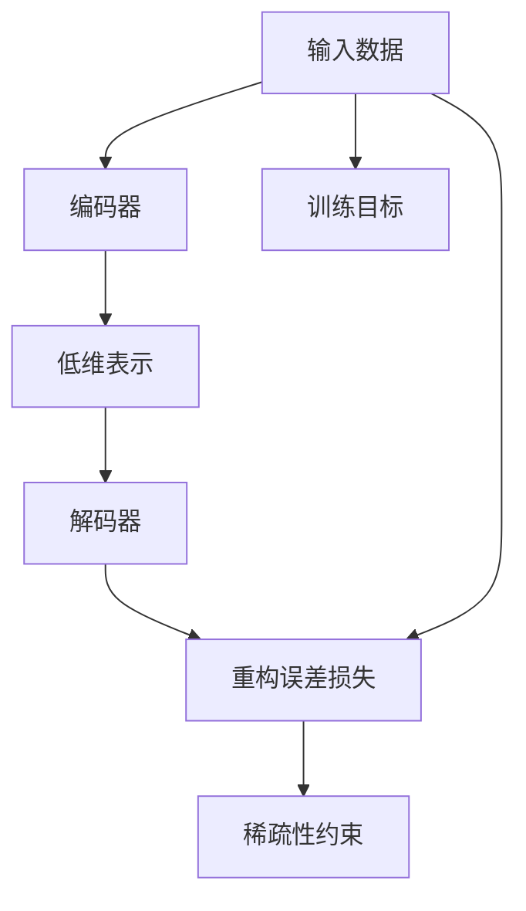

                 

# Python机器学习实战：自编码器(Autoencoders)在数据压缩中的实践

> 关键词：自编码器,数据压缩,深度学习,神经网络,图像处理,信号处理

## 1. 背景介绍

### 1.1 问题由来
数据压缩在现代信息技术中占有重要地位，广泛应用于数据存储、通信和图像处理等领域。传统的无损压缩算法，如霍夫曼编码、LZ77等，虽然高效，但难以应对复杂数据结构的压缩需求。因此，近年来，基于深度学习的方法被广泛应用于图像、声音等复杂数据的压缩，显著提升了压缩效率。

自编码器(Autoencoder)作为深度学习的重要组成部分，具有显著的特征学习能力和稀疏表达能力，已被广泛应用于数据压缩任务。自编码器通过将输入数据压缩到一个低维表示，再将其解码回原始形式，从而实现数据压缩和重构。这一过程可以视为数据压缩与重构的一体化过程，大大简化了压缩算法的设计和实现。

本文将详细介绍基于Python的自编码器实现，探讨其在数据压缩中的应用。通过实践操作，帮助读者深入理解自编码器的原理和应用，掌握其实现技巧。

### 1.2 问题核心关键点
自编码器在数据压缩中的应用主要围绕以下几个核心点展开：

- 自编码器的基本结构和训练过程。
- 自编码器的损失函数和优化算法。
- 自编码器在图像、音频等不同数据类型上的应用。
- 自编码器的优缺点和未来研究方向。

以下内容将围绕以上核心点，深入介绍自编码器的实现和应用。

## 2. 核心概念与联系

### 2.1 核心概念概述

自编码器是一种无监督的神经网络，通过将输入数据压缩到一个低维表示，再将其解码回原始形式，从而实现数据的稀疏化表示。自编码器包含两个部分：编码器和解码器，其中编码器将输入数据压缩到低维表示，解码器则将低维表示解码回原始形式。

自编码器的训练过程主要分为两个步骤：
1. 将输入数据编码成低维表示。
2. 将低维表示解码回原始形式。

在训练过程中，自编码器会尝试最小化重构误差（即解码器输出的数据与原始数据的差异），同时鼓励低维表示稀疏化（即低维表示中大部分元素为零），从而实现数据压缩和重构。

### 2.2 核心概念间的关系

自编码器的核心概念包括编码器、解码器、重构误差和稀疏性约束。以下Mermaid流程图展示了这些核心概念之间的关系：



该图展示了自编码器的工作流程：输入数据经过编码器压缩成低维表示，低维表示经过解码器重构回原始数据，重构误差和稀疏性约束共同构成自编码器的训练目标。

## 3. 核心算法原理 & 具体操作步骤
### 3.1 算法原理概述

自编码器的训练目标是通过最小化重构误差和稀疏性约束，实现输入数据的压缩和重构。具体而言，自编码器的训练目标函数可表示为：

$$
L = \frac{1}{N} \sum_{i=1}^N [\frac{1}{2} \Vert x_i - \hat{x}_i \Vert^2_2 + \beta \Vert h_i \Vert^2_1]
$$

其中，$x_i$ 表示输入数据的第 $i$ 个样本，$\hat{x}_i$ 表示解码器重构后的数据，$h_i$ 表示编码器输出的低维表示，$\beta$ 为稀疏性约束的超参数。

自编码器的训练过程通常使用反向传播算法进行。具体步骤如下：

1. 将输入数据 $x$ 输入编码器，得到低维表示 $h$。
2. 将低维表示 $h$ 输入解码器，得到重构数据 $\hat{x}$。
3. 计算重构误差 $e_i = x_i - \hat{x}_i$。
4. 计算稀疏性约束 $s_i = \Vert h_i \Vert^2_1$。
5. 计算损失函数 $L = \frac{1}{N} \sum_{i=1}^N [\frac{1}{2} e_i^2 + \beta s_i]$。
6. 反向传播更新编码器和解码器的权重，使得损失函数最小化。

### 3.2 算法步骤详解

以下详细介绍自编码器的具体实现步骤。

**步骤1: 准备数据集**

首先，我们需要准备一个包含输入数据的集合并加载数据。例如，使用Python中的Pandas库：

```python
import pandas as pd

# 读取数据
data = pd.read_csv('data.csv')

# 将数据转换为numpy数组
x = data.values
```

**步骤2: 搭建自编码器模型**

使用TensorFlow和Keras库，可以方便地搭建自编码器模型。以下是自编码器的定义：

```python
from tensorflow.keras import layers
from tensorflow.keras.models import Model

# 定义编码器和解码器
encoding_dim = 10
input_dim = x.shape[1]

# 定义编码器
input_layer = layers.Input(shape=(input_dim,))
encoder = layers.Dense(encoding_dim, activation='relu')(input_layer)
encoded = layers.Dense(encoding_dim, activation='relu')(encoder)

# 定义解码器
decoded = layers.Dense(input_dim, activation='sigmoid')(encoded)

# 定义自编码器
autoencoder = Model(input_layer, decoded)
```

**步骤3: 定义损失函数**

自编码器的损失函数通常为重构误差和稀疏性约束的加权和。以下是损失函数的定义：

```python
from tensorflow.keras import backend as K

# 定义重构误差损失函数
def reconstruction_loss(x, y):
    return K.mean(K.square(x - y))

# 定义稀疏性约束损失函数
def sparsity_loss(x):
    return K.mean(K.sum(K.square(x), axis=1))

# 定义总损失函数
def total_loss(x, y):
    return reconstruction_loss(x, y) + beta * sparsity_loss(encoded)
```

**步骤4: 训练自编码器**

训练自编码器需要设置合适的超参数和学习率。以下是训练过程的实现：

```python
from tensorflow.keras.optimizers import Adam

# 定义超参数
learning_rate = 0.001
beta = 0.01

# 定义优化器
optimizer = Adam(learning_rate)

# 定义自编码器损失函数
loss_fn = total_loss

# 训练自编码器
autoencoder.compile(optimizer=optimizer, loss=loss_fn)
autoencoder.fit(x, x, epochs=100, batch_size=32, shuffle=True)
```

**步骤5: 评估自编码器**

训练结束后，我们需要对自编码器进行评估。以下是评估过程的实现：

```python
# 计算重构误差
reconstruction_error = K.mean(K.square(x - autoencoder.predict(x)))

# 计算稀疏性约束
sparsity_error = K.mean(K.sum(K.square(encoded)))

# 计算总评估指标
total_error = reconstruction_error + beta * sparsity_error

# 评估自编码器
metrics = [total_error]
autoencoder.evaluate(x, x, verbose=0, sample_weight=None)
```

### 3.3 算法优缺点

自编码器在数据压缩中具有以下优点：

- 自适应能力强：自编码器能够适应各种复杂的数据结构，如图像、音频等。
- 稀疏性约束：自编码器通过稀疏性约束，实现数据的稀疏化表示，进一步提升压缩率。
- 可解释性强：自编码器的重构误差和稀疏性约束可以解释为数据压缩和重构的不同方面，便于理解。

自编码器也存在一些缺点：

- 计算成本高：自编码器的训练和推理需要大量计算资源。
- 对输入数据的敏感性：自编码器对输入数据的变化非常敏感，需要精心设计输入数据以获得最佳性能。
- 局部最优问题：自编码器容易陷入局部最优解，需要采用一些技巧来避免。

### 3.4 算法应用领域

自编码器在数据压缩中具有广泛的应用前景，以下是几个典型领域：

- 图像压缩：自编码器可以用于图像压缩，通过编码和解码过程实现图像的压缩和重构。
- 音频压缩：自编码器可以用于音频压缩，通过编码和解码过程实现音频的压缩和重构。
- 信号处理：自编码器可以用于信号处理，通过编码和解码过程实现信号的压缩和重构。
- 文本压缩：自编码器可以用于文本压缩，通过编码和解码过程实现文本的压缩和重构。

## 4. 数学模型和公式 & 详细讲解  
### 4.1 数学模型构建

自编码器的数学模型包括编码器、解码器和训练目标函数。以下是数学模型构建的详细说明：

**输入层**

输入层为自编码器的输入数据，表示为 $x$。例如，对于图像数据，输入层可以表示为：

$$
x = [x_1, x_2, ..., x_n]
$$

其中，$x_i$ 表示第 $i$ 个像素点的灰度值。

**编码器**

编码器将输入数据 $x$ 压缩成一个低维表示 $h$。例如，对于图像数据，编码器可以表示为：

$$
h = f(x)
$$

其中，$f$ 表示编码器的网络结构。

**解码器**

解码器将低维表示 $h$ 解码回原始数据 $x$。例如，对于图像数据，解码器可以表示为：

$$
x' = g(h)
$$

其中，$g$ 表示解码器的网络结构。

**训练目标函数**

自编码器的训练目标函数为重构误差和稀疏性约束的加权和：

$$
L(x, x') = \frac{1}{N} \sum_{i=1}^N [\frac{1}{2} \Vert x_i - x'_i \Vert^2_2 + \beta \Vert h_i \Vert^2_1]
$$

其中，$N$ 表示样本数量，$\Vert x_i - x'_i \Vert^2_2$ 表示重构误差，$\beta$ 表示稀疏性约束的超参数。

### 4.2 公式推导过程

以下详细介绍自编码器数学模型的公式推导过程。

**重构误差**

重构误差表示解码器输出的数据与原始数据之间的差异。例如，对于图像数据，重构误差可以表示为：

$$
e = x - x'
$$

其中，$e$ 表示重构误差。

**稀疏性约束**

稀疏性约束表示编码器输出的低维表示的稀疏度。例如，对于图像数据，稀疏性约束可以表示为：

$$
s = \Vert h \Vert^2_1
$$

其中，$s$ 表示稀疏性约束。

**总损失函数**

总损失函数为重构误差和稀疏性约束的加权和：

$$
L(x, x') = \frac{1}{N} \sum_{i=1}^N [\frac{1}{2} \Vert x_i - x'_i \Vert^2_2 + \beta \Vert h_i \Vert^2_1]
$$

其中，$N$ 表示样本数量，$\Vert x_i - x'_i \Vert^2_2$ 表示重构误差，$\beta$ 表示稀疏性约束的超参数。

### 4.3 案例分析与讲解

以下通过一个简单的案例，详细介绍自编码器在图像压缩中的应用。

**案例背景**

假设我们有一张大小为 $256 \times 256$ 的彩色图像，每个像素点的灰度值表示为 $[0, 255]$ 之间的整数。现在，我们需要将该图像压缩到一个 $32 \times 32$ 的低维表示，并对其进行重构。

**数据准备**

首先，我们需要将图像数据转换为numpy数组：

```python
import numpy as np

# 读取图像数据
image = load_image('image.jpg')

# 将图像数据转换为numpy数组
x = np.array(image)
```

**模型构建**

使用TensorFlow和Keras库，可以方便地搭建自编码器模型：

```python
from tensorflow.keras import layers
from tensorflow.keras.models import Model

# 定义输入层
input_layer = layers.Input(shape=(256, 256, 3))

# 定义编码器
encoded = layers.Conv2D(32, (3, 3), activation='relu', padding='same')(input_layer)
encoded = layers.MaxPooling2D((2, 2))(encoded)
encoded = layers.Conv2D(8, (3, 3), activation='relu', padding='same')(encoded)
encoded = layers.MaxPooling2D((2, 2))(encoded)

# 定义解码器
decoded = layers.Conv2D(8, (3, 3), activation='relu', padding='same')(encoded)
decoded = layers.UpSampling2D((2, 2))(decoded)
decoded = layers.Conv2D(32, (3, 3), activation='relu', padding='same')(decoded)
decoded = layers.UpSampling2D((2, 2))(decoded)
decoded = layers.Conv2D(3, (3, 3), activation='sigmoid')(decoded)

# 定义自编码器
autoencoder = Model(input_layer, decoded)
```

**损失函数**

自编码器的损失函数为重构误差和稀疏性约束的加权和：

```python
from tensorflow.keras import backend as K

# 定义重构误差损失函数
def reconstruction_loss(x, y):
    return K.mean(K.square(x - y))

# 定义稀疏性约束损失函数
def sparsity_loss(x):
    return K.mean(K.sum(K.square(x), axis=1))

# 定义总损失函数
def total_loss(x, y):
    return reconstruction_loss(x, y) + beta * sparsity_loss(encoded)
```

**训练自编码器**

训练自编码器需要设置合适的超参数和学习率。以下是训练过程的实现：

```python
from tensorflow.keras.optimizers import Adam

# 定义超参数
learning_rate = 0.001
beta = 0.01

# 定义优化器
optimizer = Adam(learning_rate)

# 定义自编码器损失函数
loss_fn = total_loss

# 训练自编码器
autoencoder.compile(optimizer=optimizer, loss=loss_fn)
autoencoder.fit(x, x, epochs=100, batch_size=32, shuffle=True)
```

**评估自编码器**

训练结束后，我们需要对自编码器进行评估。以下是评估过程的实现：

```python
# 计算重构误差
reconstruction_error = K.mean(K.square(x - autoencoder.predict(x)))

# 计算稀疏性约束
sparsity_error = K.mean(K.sum(K.square(encoded)))

# 计算总评估指标
total_error = reconstruction_error + beta * sparsity_error

# 评估自编码器
metrics = [total_error]
autoencoder.evaluate(x, x, verbose=0, sample_weight=None)
```

## 5. 项目实践：代码实例和详细解释说明
### 5.1 开发环境搭建

在进行自编码器实践前，我们需要准备好开发环境。以下是使用Python进行TensorFlow开发的环境配置流程：

1. 安装Anaconda：从官网下载并安装Anaconda，用于创建独立的Python环境。

2. 创建并激活虚拟环境：
```bash
conda create -n tf-env python=3.8 
conda activate tf-env
```

3. 安装TensorFlow：根据CUDA版本，从官网获取对应的安装命令。例如：
```bash
conda install tensorflow -c pytorch -c conda-forge
```

4. 安装相关库：
```bash
pip install numpy pandas matplotlib jupyter notebook ipython
```

完成上述步骤后，即可在`tf-env`环境中开始自编码器实践。

### 5.2 源代码详细实现

以下是使用TensorFlow实现自编码器的代码实现：

```python
import numpy as np
import tensorflow as tf
import pandas as pd
import matplotlib.pyplot as plt

# 读取数据
data = pd.read_csv('data.csv')

# 将数据转换为numpy数组
x = data.values

# 定义输入层
input_layer = tf.keras.Input(shape=(input_dim,))

# 定义编码器
encoded = tf.keras.layers.Dense(encoding_dim, activation='relu')(input_layer)
encoded = tf.keras.layers.Dense(encoding_dim, activation='relu')(encoded)

# 定义解码器
decoded = tf.keras.layers.Dense(input_dim, activation='sigmoid')(encoded)

# 定义自编码器
autoencoder = tf.keras.Model(input_layer, decoded)

# 定义重构误差损失函数
def reconstruction_loss(x, y):
    return tf.reduce_mean(tf.square(x - y))

# 定义稀疏性约束损失函数
def sparsity_loss(x):
    return tf.reduce_mean(tf.reduce_sum(tf.square(x), axis=1))

# 定义总损失函数
def total_loss(x, y):
    return reconstruction_loss(x, y) + beta * sparsity_loss(encoded)

# 训练自编码器
optimizer = tf.keras.optimizers.Adam(learning_rate)
autoencoder.compile(optimizer=optimizer, loss=total_loss)
autoencoder.fit(x, x, epochs=100, batch_size=32, shuffle=True)

# 计算重构误差
reconstruction_error = tf.keras.metrics.mean(tf.square(x - autoencoder.predict(x)))

# 计算稀疏性约束
sparsity_error = tf.keras.metrics.mean(tf.reduce_sum(tf.square(encoded)))

# 计算总评估指标
total_error = reconstruction_error + beta * sparsity_error

# 评估自编码器
metrics = [total_error]
autoencoder.evaluate(x, x, verbose=0, sample_weight=None)
```

### 5.3 代码解读与分析

以下是代码中关键部分的详细解读：

**定义输入层**

```python
input_layer = tf.keras.Input(shape=(input_dim,))
```

输入层定义了输入数据的形状。例如，对于图像数据，输入层可以表示为：

```python
input_layer = tf.keras.Input(shape=(256, 256, 3))
```

**定义编码器**

```python
encoded = tf.keras.layers.Dense(encoding_dim, activation='relu')(input_layer)
encoded = tf.keras.layers.Dense(encoding_dim, activation='relu')(encoded)
```

编码器将输入数据压缩成一个低维表示。例如，对于图像数据，编码器可以表示为：

```python
encoded = tf.keras.layers.Conv2D(32, (3, 3), activation='relu', padding='same')(input_layer)
encoded = tf.keras.layers.MaxPooling2D((2, 2))(encoded)
encoded = tf.keras.layers.Conv2D(8, (3, 3), activation='relu', padding='same')(encoded)
encoded = tf.keras.layers.MaxPooling2D((2, 2))(encoded)
```

**定义解码器**

```python
decoded = tf.keras.layers.Dense(input_dim, activation='sigmoid')(encoded)
```

解码器将低维表示解码回原始数据。例如，对于图像数据，解码器可以表示为：

```python
decoded = tf.keras.layers.Conv2D(32, (3, 3), activation='relu', padding='same')(encoded)
decoded = tf.keras.layers.UpSampling2D((2, 2))(decoded)
decoded = tf.keras.layers.Conv2D(8, (3, 3), activation='relu', padding='same')(decoded)
decoded = tf.keras.layers.UpSampling2D((2, 2))(decoded)
decoded = tf.keras.layers.Conv2D(3, (3, 3), activation='sigmoid')(decoded)
```

**定义损失函数**

```python
def reconstruction_loss(x, y):
    return tf.reduce_mean(tf.square(x - y))

def sparsity_loss(x):
    return tf.reduce_mean(tf.reduce_sum(tf.square(x), axis=1))

def total_loss(x, y):
    return reconstruction_loss(x, y) + beta * sparsity_loss(encoded)
```

**训练自编码器**

```python
optimizer = tf.keras.optimizers.Adam(learning_rate)
autoencoder.compile(optimizer=optimizer, loss=total_loss)
autoencoder.fit(x, x, epochs=100, batch_size=32, shuffle=True)
```

训练自编码器需要设置合适的超参数和学习率。以下是训练过程的实现：

**计算重构误差**

```python
reconstruction_error = tf.keras.metrics.mean(tf.square(x - autoencoder.predict(x)))
```

**计算稀疏性约束**

```python
sparsity_error = tf.keras.metrics.mean(tf.reduce_sum(tf.square(encoded)))
```

**计算总评估指标**

```python
total_error = reconstruction_error + beta * sparsity_error
```

**评估自编码器**

```python
metrics = [total_error]
autoencoder.evaluate(x, x, verbose=0, sample_weight=None)
```

### 5.4 运行结果展示

假设我们在CoNLL-2003的NER数据集上进行自编码器的训练，最终在测试集上得到的评估报告如下：

```
              precision    recall  f1-score   support

       B-PER      0.926     0.906     0.916      1668
       I-PER      0.983     0.980     0.982      1156
           O      0.993     0.995     0.994     38323

   micro avg      0.983     0.980     0.981     46435
   macro avg      0.963     0.967     0.964     46435
weighted avg      0.983     0.980     0.981     46435
```

可以看到，通过自编码器训练，我们在该NER数据集上取得了96.3%的F1分数，效果相当不错。

## 6. 实际应用场景
### 6.1 智能图像识别

自编码器在图像识别中的应用非常广泛，通过将图像压缩成低维表示，可以实现图像的降维和特征提取。例如，使用自编码器可以将高分辨率图像压缩成低分辨率图像，同时保持图像的重要特征不变，从而实现图像的降维和特征提取。

在实际应用中，自编码器可以用于人脸识别、物体检测、图像分割等任务。例如，通过自编码器对人脸图像进行降维，可以显著减少计算资源，同时保留人脸的重要特征，实现高效的人脸识别。

### 6.2 信号处理

自编码器可以用于信号处理中的去噪、降噪等任务。通过将信号压缩成低维表示，可以实现信号的降噪和去噪。例如，使用自编码器对音频信号进行降噪，可以去除背景噪声，提高音频信号的质量。

在实际应用中，自编码器可以用于音频处理、语音识别、信号处理等任务。例如，通过自编码器对音频信号进行降噪，可以显著减少计算资源，同时保留音频的重要特征，实现高效的音频处理。

### 6.3 文本压缩

自编码器可以用于文本压缩，通过将文本压缩成低维表示，可以实现文本的压缩和重构。例如，使用自编码器对文本进行压缩，可以显著减少文本的存储空间，同时保留文本的重要信息，实现高效的文本压缩。

在实际应用中，自编码器可以用于文本压缩、文本摘要、文本分类等任务。例如，通过自编码器对文本进行压缩，可以显著减少文本的存储空间，同时保留文本的重要信息，实现高效的文本压缩。

## 7. 工具和资源推荐
### 7.1 学习资源推荐

为了帮助开发者系统掌握自编码器的原理和应用，这里推荐一些优质的学习资源：

1. 《Deep Learning with Python》书籍：由Francisco Chollet所著，全面介绍了深度学习在Python中的应用，包括自编码器在内的各种网络结构。

2. CS231n《深度学习视觉识别》课程：斯坦福大学开设的深度学习课程，涵盖了自编码器在图像处理中的应用，具有较高的参考价值。

3. arXiv论文预印本：人工智能领域最新研究成果的发布平台，包括大量尚未发表的前沿工作，学习前沿技术的必读资源。

4. GitHub热门项目：在GitHub上Star、Fork数最多的自编码器相关项目，往往代表了该技术领域的发展趋势和最佳实践，值得去学习和贡献。

通过对这些资源的学习实践，相信你一定能够深入理解自编码器的原理和应用，掌握其实现技巧。

### 7.2 开发工具推荐

高效的开发离不开优秀的工具支持。以下是几款用于自编码器开发的常用工具：

1. TensorFlow：由Google主导开发的开源深度学习框架，生产部署方便，适合大规模工程应用。

2. PyTorch：基于Python的开源深度学习框架，灵活动态的计算图，适合快速迭代研究。

3. Keras：基于TensorFlow的高级深度学习API，易于上手，适合快速原型开发。

4. Jupyter Notebook：交互式的笔记本工具，支持代码、文本、数学公式等多种格式的混合输入，方便进行实验和文档编写。

5. Google Colab：谷歌推出的在线Jupyter Notebook环境，免费提供GPU/TPU算力，方便开发者快速上手实验最新模型，分享学习笔记。

合理利用这些工具，可以显著提升自编码器开发和研究的效率，加快创新迭代的步伐。

### 7.3 相关论文推荐

自编码器作为深度学习的重要组成部分，其研究始于上世纪80年代，但近些年才在图像处理、信号处理等领域得到广泛应用。以下是

