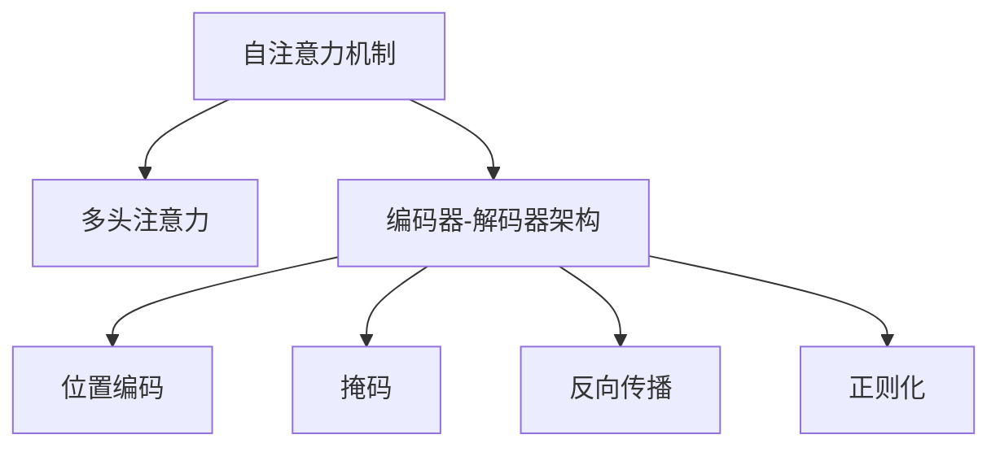
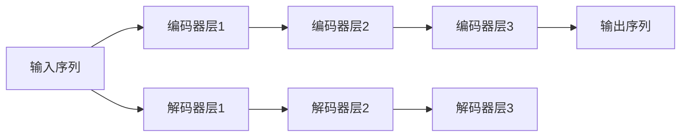
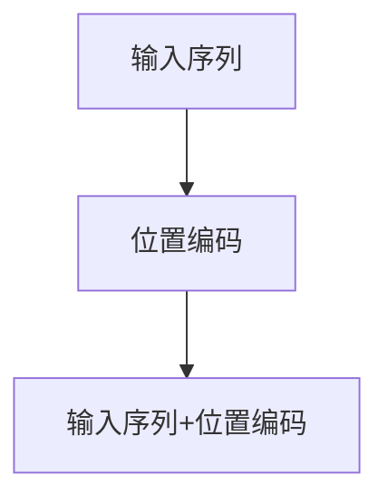
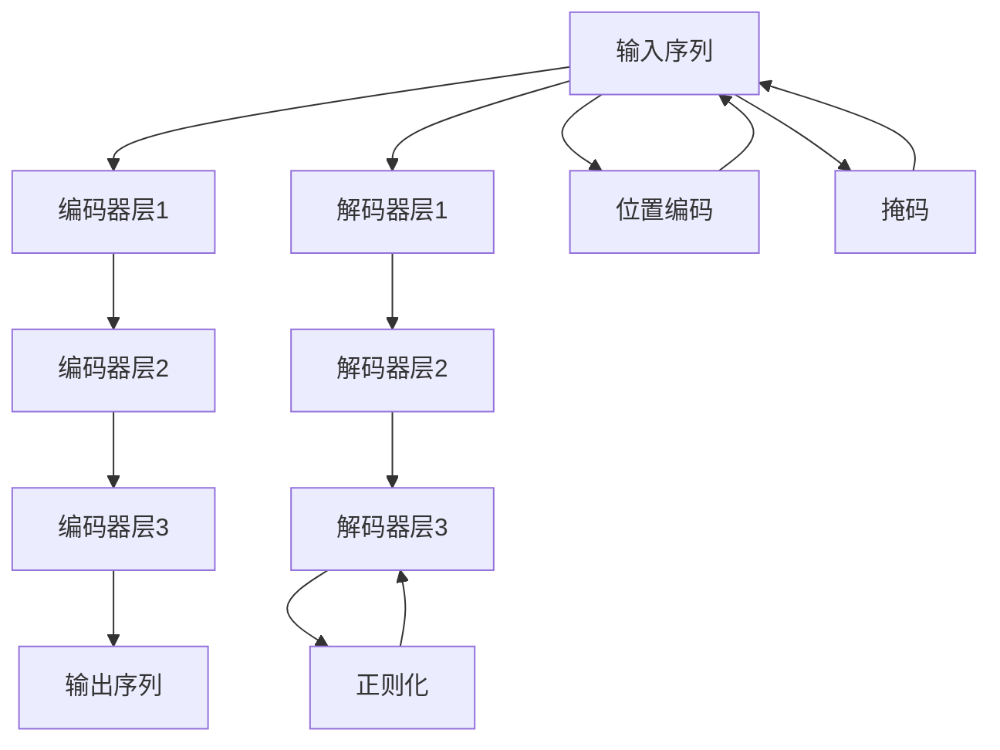
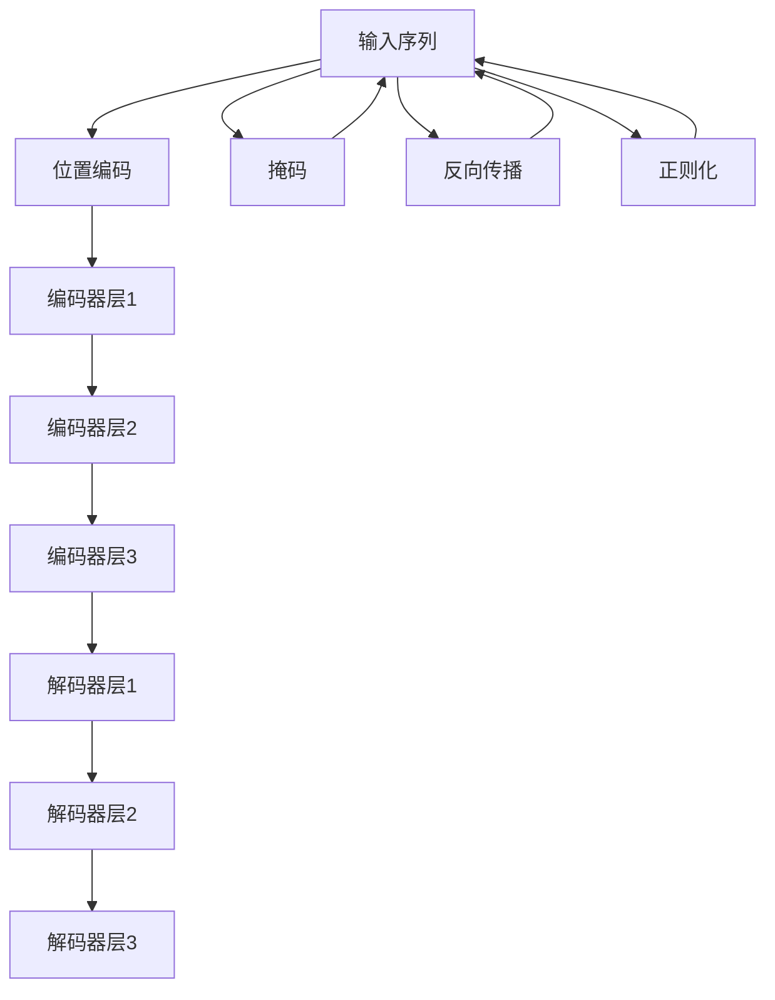

                 

# Transformer 原理与代码实例讲解

> 关键词：Transformer, 自注意力机制, 多头注意力, 编码器-解码器, 位置编码, 掩码, 反向传播, 正则化, 神经网络, 深度学习, 自然语言处理(NLP), 机器学习, 代码实例

## 1. 背景介绍

### 1.1 问题由来
Transformer是一种基于自注意力机制的神经网络架构，被广泛应用于自然语言处理(NLP)领域，尤其是机器翻译和文本生成任务中。它成功地突破了传统循环神经网络(RNN)和卷积神经网络(CNN)的瓶颈，实现了高效、并行、可扩展的语言模型。

Transformer结构由谷歌DeepMind的研究团队在2017年提出，并迅速成为NLP领域的新宠。它通过多头的自注意力机制，使得模型能够同时关注到输入序列的多个位置，从而极大地提升了模型的表达能力和训练效率。Transformer的出现，不仅推动了NLP技术的进步，也催生了大规模预训练语言模型(BERT、GPT等)和微调技术的发展，使大模型在小样本情况下也能取得优异性能。

### 1.2 问题核心关键点
Transformer的核心在于其自注意力机制。相比于传统的序列建模方式，Transformer通过多头注意力机制，使得模型在输入序列的各个位置上都能够获得独立的表示，从而有效避免了长序列带来的梯度消失和爆炸问题。

Transformer结构包括编码器(Encoder)和解码器(Decoder)两个部分，分别用于处理输入序列和生成输出序列。编码器由多个相同的Transformer层组成，每个层包含多头注意力机制、前向网络(Feedforward Network)和残差连接(Residual Connection)等组件。解码器则在前向网络的基础上增加了自回归机制，确保模型输出符合语言模型的一一对应关系。

Transformer的训练过程通常采用掩码技术，通过遮蔽未来的序列位置，防止模型在预测过程中使用未来的信息。此外，为了保证模型的稳定性，还引入了正则化技术，如L2正则、Dropout等。

### 1.3 问题研究意义
Transformer作为目前最先进的NLP模型之一，在诸多领域取得了令人瞩目的成就。例如：
- 机器翻译：Transformer模型实现了多种语言之间的自动翻译，提高了翻译效率和质量。
- 文本生成：基于Transformer的模型能够生成高质量的自然语言文本，应用于聊天机器人、文本摘要等场景。
- 文本分类和情感分析：Transformer模型能够有效地从文本中提取特征，进行文本分类和情感分析任务。
- 语音识别和转换：Transformer模型被应用于语音识别和转换任务中，提高了语音交互系统的准确性和自然性。

Transformer的成功不仅在于其优异的性能，还在于其高效、可扩展的架构设计。通过深入理解Transformer的原理和代码实现，我们可以更好地掌握其关键特性，从而更灵活地应用于各种NLP任务中。

## 2. 核心概念与联系

### 2.1 核心概念概述

为更好地理解Transformer的工作原理和代码实现，本节将介绍几个密切相关的核心概念：

- 自注意力机制(Self-Attention Mechanism)：Transformer的核心组件，通过多头的自注意力机制，使得模型能够在不同位置之间同时进行信息交互。
- 多头注意力(Multi-Head Attention)：将输入序列分解成多个维度，每个维度单独进行自注意力计算，从而得到更加丰富的表示。
- 编码器-解码器架构(Encoder-Decoder Architecture)：Transformer的结构设计，包括多个编码器层和解码器层，用于处理输入序列和生成输出序列。
- 位置编码(Positional Encoding)：用于给定位置的输入嵌入增加时间信息，确保模型能够区分不同位置的输入。
- 掩码(Masking)：用于训练和预测过程中，防止模型在未知的未来位置上使用信息，确保序列预测的一一对应关系。
- 反向传播(Backpropagation)：Transformer训练过程的核心，通过反向传播更新模型参数。
- 正则化(Regularization)：包括L2正则、Dropout等技术，防止模型过拟合。

这些核心概念之间的逻辑关系可以通过以下Mermaid流程图来展示：



这个流程图展示了一些核心概念之间的联系：

1. 自注意力机制是Transformer的核心组件，通过多头注意力实现。
2. 编码器-解码器架构是Transformer的基本结构，包含位置编码、掩码、反向传播和正则化等组件。
3. 位置编码用于给输入序列中的每个位置增加时间信息，防止序列预测的一一对应关系丢失。
4. 掩码用于训练和预测过程中，防止模型在未知的未来位置上使用信息。
5. 反向传播是Transformer训练过程的核心，通过反向传播更新模型参数。
6. 正则化用于防止模型过拟合，确保模型泛化能力。

这些核心概念共同构成了Transformer的工作原理和代码实现的基础，使得Transformer能够高效地处理长序列，实现多种NLP任务的自动推理和生成。

### 2.2 概念间的关系

这些核心概念之间存在着紧密的联系，形成了Transformer的完整生态系统。下面我通过几个Mermaid流程图来展示这些概念之间的关系。

#### 2.2.1 自注意力机制的工作原理


这个流程图展示了自注意力机制的工作原理：

1. Query、Key和Value是输入序列中每个位置的表示。
2. 通过多头注意力计算，每个位置的Query与所有位置的Key进行点积计算，得到权重系数。
3. 权重系数与Value进行线性变换和加权求和，得到多头输出。

#### 2.2.2 编码器-解码器架构的详细结构



这个流程图展示了编码器-解码器架构的详细结构：

1. 输入序列通过多个编码器层进行处理。
2. 编码器层包含多头注意力、前向网络和残差连接等组件。
3. 解码器层在前向网络的基础上，增加了自回归机制，确保模型输出符合语言模型的一一对应关系。
4. 解码器层通过多个解码器层进行处理，最终输出预测序列。

#### 2.2.3 位置编码的实现细节



这个流程图展示了位置编码的实现细节：

1. 输入序列中每个位置的嵌入向量。
2. 将位置向量与输入向量进行拼接，形成带有时间信息的嵌入向量。
3. 将带有时间信息的嵌入向量送入Transformer网络进行处理。

#### 2.2.4 反向传播的计算流程



这个流程图展示了反向传播的计算流程：

1. 输入序列通过多个编码器层进行处理。
2. 编码器层包含多头注意力、前向网络和残差连接等组件。
3. 解码器层在前向网络的基础上，增加了自回归机制，确保模型输出符合语言模型的一一对应关系。
4. 解码器层通过多个解码器层进行处理，最终输出预测序列。
5. 在训练过程中，通过反向传播更新模型参数，以最小化损失函数。

#### 2.2.5 正则化的作用机制


这个流程图展示了正则化的作用机制：

1. 输入序列通过多个编码器层进行处理。
2. 编码器层包含多头注意力、前向网络和残差连接等组件。
3. 解码器层在前向网络的基础上，增加了自回归机制，确保模型输出符合语言模型的一一对应关系。
4. 解码器层通过多个解码器层进行处理，最终输出预测序列。
5. 在训练过程中，通过正则化技术，如L2正则、Dropout等，防止模型过拟合，确保模型泛化能力。

### 2.3 核心概念的整体架构

最后，我们用一个综合的流程图来展示这些核心概念在大模型Transformer中的整体架构：



这个综合流程图展示了从输入序列到输出序列的完整处理流程，包括位置编码、编码器层、解码器层、掩码、反向传播和正则化等关键组件。通过这些组件的协同工作，Transformer模型能够高效地处理长序列，实现多种NLP任务的自动推理和生成。

## 3. 核心算法原理 & 具体操作步骤
### 3.1 算法原理概述

Transformer的核心在于其自注意力机制。相比于传统的序列建模方式，Transformer通过多头注意力机制，使得模型能够在输入序列的各个位置上都能够获得独立的表示，从而有效避免了长序列带来的梯度消失和爆炸问题。

Transformer模型的训练过程通常采用掩码技术，通过遮蔽未来的序列位置，防止模型在预测过程中使用未来的信息，确保序列预测的一一对应关系。此外，为了保证模型的稳定性，还引入了正则化技术，如L2正则、Dropout等，防止模型过拟合。

Transformer的结构设计包括编码器-解码器架构，由多个相同的Transformer层组成。每个层包含多头注意力、前向网络和残差连接等组件。在训练过程中，通过反向传播更新模型参数，最小化损失函数。

### 3.2 算法步骤详解

Transformer的训练过程包括以下几个关键步骤：

**Step 1: 准备输入数据和模型**

- 准备输入序列和位置编码向量。
- 定义Transformer模型的编码器-解码器架构，包含多个Transformer层。

**Step 2: 执行前向传播**

- 对于每个Transformer层，执行多头注意力计算。
- 执行前向网络计算。
- 通过残差连接将前向网络输出和输入序列相加。

**Step 3: 执行反向传播**

- 计算损失函数。
- 反向传播计算梯度。
- 更新模型参数。

**Step 4: 重复步骤2-3**

- 重复执行前向传播和反向传播，直到模型收敛。

**Step 5: 测试和评估**

- 在测试集上评估模型性能。
- 对比微调前后的精度提升。

以上是Transformer模型训练过程的详细步骤。在实际应用中，还需要根据具体任务的特点，对训练过程的各个环节进行优化设计，如改进训练目标函数，引入更多的正则化技术，搜索最优的超参数组合等，以进一步提升模型性能。

### 3.3 算法优缺点

Transformer模型具有以下优点：

1. 高效并行：Transformer结构具有天然的并行性，适合在分布式计算环境下进行高效训练和推理。
2. 长序列处理：Transformer能够高效处理长序列，避免了传统序列建模方式中梯度消失和爆炸的问题。
3. 自注意力机制：多头注意力机制使得模型能够在不同位置之间同时进行信息交互，提升了模型的表达能力。
4. 可扩展性强：通过增加层数和头数，Transformer可以适应不同规模的任务需求。

同时，Transformer模型也存在以下缺点：

1. 内存占用大：由于使用了大型的嵌入矩阵和多个注意力头，Transformer模型在训练和推理时内存占用较大。
2. 计算复杂度高：由于需要计算多头注意力和前向网络，Transformer模型计算复杂度较高，适合在计算资源充足的场景下使用。
3. 鲁棒性不足：Transformer模型对输入序列中的噪声和异常值较为敏感，容易受到数据分布变化的影响。

尽管存在这些缺点，但Transformer模型仍因其高效、并行、可扩展的特点，成为当前NLP领域的主流架构之一。未来相关研究的重点在于如何进一步降低计算资源消耗，提高模型鲁棒性，以及如何结合其他技术如对抗训练、正则化等，提升Transformer的性能和稳定性。

### 3.4 算法应用领域

Transformer模型在NLP领域已经得到了广泛的应用，覆盖了几乎所有常见任务，例如：

- 机器翻译：Transformer模型实现了多种语言之间的自动翻译，提高了翻译效率和质量。
- 文本生成：基于Transformer的模型能够生成高质量的自然语言文本，应用于聊天机器人、文本摘要等场景。
- 文本分类和情感分析：Transformer模型能够有效地从文本中提取特征，进行文本分类和情感分析任务。
- 语音识别和转换：Transformer模型被应用于语音识别和转换任务中，提高了语音交互系统的准确性和自然性。

除了上述这些经典任务外，Transformer模型还被创新性地应用到更多场景中，如可控文本生成、常识推理、代码生成、数据增强等，为NLP技术带来了全新的突破。随着预训练模型和Transformer方法的不断进步，相信NLP技术将在更广阔的应用领域大放异彩。

## 4. 数学模型和公式 & 详细讲解

### 4.1 数学模型构建

Transformer模型的数学模型主要由以下几部分构成：

1. 输入序列 $X$：序列长度为 $L$，每个位置 $i$ 的嵌入向量为 $x_i$，维度为 $d_{\text{model}}$。
2. 位置编码 $P$：每个位置的嵌入向量 $p_i$，维度为 $d_{\text{model}}$。
3. 查询向量 $Q$：每个位置的查询向量 $q_i$，维度为 $d_{\text{model}}$。
4. 键向量 $K$：每个位置的键向量 $k_i$，维度为 $d_{\text{model}}$。
5. 值向量 $V$：每个位置的值向量 $v_i$，维度为 $d_{\text{model}}$。
6. 多头注意力 $A$：每个位置的注意力权重 $\alpha_i$，维度为 $d_{\text{model}}$。
7. 前向网络 $F$：每个位置的输出向量 $f_i$，维度为 $d_{\text{model}}$。
8. 输出序列 $Y$：序列长度为 $L$，每个位置 $i$ 的输出向量为 $y_i$，维度为 $d_{\text{model}}$。

Transformer模型的目标是最小化损失函数 $L$，即：

$$
L = \frac{1}{L} \sum_{i=1}^{L} \ell(x_i, y_i)
$$

其中 $\ell(x_i, y_i)$ 为序列位置 $i$ 的损失函数，通常是交叉熵损失。

### 4.2 公式推导过程

Transformer模型的计算过程包括以下几个关键步骤：

1. 输入序列和位置编码的拼接：将输入序列和位置编码向量拼接，形成带有时间信息的嵌入向量 $Z$。

$$
Z = [X, P]
$$

2. 多头注意力计算：通过多头注意力机制，计算每个位置的查询向量 $Q$、键向量 $K$ 和值向量 $V$。

$$
Q_i = x_i W_Q, \quad K_i = x_i W_K, \quad V_i = x_i W_V
$$

3. 自注意力权重计算：计算每个位置的注意力权重 $\alpha_i$。

$$
\alpha_i = \frac{e^{\frac{Q_i K_j}{\sqrt{d_{\text{model}}}}}{\sum_{j=1}^{L} e^{\frac{Q_i K_j}{\sqrt{d_{\text{model}}}}}
$$

4. 多头注意力输出计算：将注意力权重与值向量相乘，进行加权求和，得到多头注意力输出 $Z^A$。

$$
Z^A_i = \sum_{j=1}^{L} \alpha_i V_j
$$

5. 前向网络计算：将多头注意力输出和输入向量进行线性变换和激活函数计算，得到前向网络输出 $Z^F$。

$$
Z^F_i = f(Z^A_i)
$$

6. 输出序列计算：将前向网络输出和输入向量相加，得到输出序列 $Y$。

$$
Y_i = x_i + Z^F_i
$$

7. 反向传播计算：通过反向传播计算梯度，更新模型参数 $W_Q, W_K, W_V, W_F$。

8. 正则化：在损失函数中加入正则化项，防止模型过拟合。

9. 测试和评估：在测试集上评估模型性能，对比微调前后的精度提升。

### 4.3 案例分析与讲解

以机器翻译为例，假设输入序列为 $X=[x_1, x_2, x_3]$，输出序列为 $Y=[y_1, y_2, y_3]$，位置编码向量为 $P=[p_1, p_2, p_3]$。根据上述步骤，计算过程如下：

1. 输入序列和位置编码的拼接：

$$
Z = [x_1, p_1, x_2, p_2, x_3, p_3]
$$

2. 多头注意力计算：

$$
Q_1 = x_1 W_Q, \quad K_1 = x_1 W_K, \quad V_1 = x_1 W_V
$$
$$
Q_2 = x_2 W_Q, \quad K_2 = x_2 W_K, \quad V_2 = x_2 W_V
$$
$$
Q_3 = x_3 W_Q, \quad K_3 = x_3 W_K, \quad V_3 = x_3 W_V
$$

3. 自注意力权重计算：

$$
\alpha_1 = \frac{e^{\frac{Q_1 K_1}{\sqrt{d_{\text{model}}}}}{\sum_{j=1}^{3} e^{\frac{Q_1 K_j}{\sqrt{d_{\text{model}}}}}
$$
$$
\alpha_2 = \frac{e^{\frac{Q_2 K_2}{\sqrt{d_{\text{model}}}}}{\sum_{j=1}^{3} e^{\frac{Q_2 K_j}{\sqrt{d_{\text{model}}}}}
$$
$$
\alpha_3 = \frac{e^{\frac{Q_3 K_3}{\sqrt{d_{\text{model}}}}}{\sum_{j=1}^{3} e^{\frac{Q_3 K_j}{\sqrt{d_{\text{model}}}}}
$$

4. 多头注意力输出计算：

$$
Z^A_1 = \alpha_1 V_1 + \alpha_2 V_2 + \alpha_3 V_3
$$
$$
Z^A_2 = \alpha_1 V_1 + \alpha_2 V_2 + \alpha_3 V_3
$$
$$
Z^A_3 = \alpha_1 V_1 + \alpha_2 V_2 + \alpha_3 V_3
$$

5. 前向网络计算：

$$
Z^F_1 = f(Z^A_1)
$$
$$
Z^F_2 = f(Z^A_2)
$$
$$
Z^F_3 = f(Z^A_3)
$$

6. 输出序列计算：

$$
Y_1 = x_1 + Z^F_1
$$
$$
Y_2 = x_2 + Z^F_2
$$
$$
Y_3 = x_3 + Z^F_3
$$

通过上述步骤，我们可以将输入序列 $X$ 转换为输出序列 $Y$，完成机器翻译任务的预测。

## 5. 项目实践：代码实例和详细解释说明

### 5.1 开发环境搭建

在进行Transformer项目实践前，我们需要准备好开发环境。以下是使用Python进行PyTorch开发的环境配置流程：

1. 安装Anaconda：从官网下载并安装Anaconda，用于创建独立的Python环境。

2. 创建并激活虚拟环境：
```bash
conda create -n pytorch-env python=3.8 
conda activate pytorch-env
```

3. 安装PyTorch：根据CUDA版本，从官网获取对应的安装命令。例如：
```bash
conda install pytorch torchvision torchaudio cudatoolkit=11.1 -c pytorch -c conda-forge
```

4. 安装Transformers库：
```bash
pip install transformers
```

5. 安装各类工具包：
```bash
pip install numpy pandas scikit-learn matplotlib tqdm jupyter notebook ipython
```

完成上述步骤后，即可在`pytorch-env`环境中开始Transformer的实践。

### 5.2 源代码详细实现

这里我们以机器翻译任务为例，给出使用Transformers库对Transformer模型进行训练的PyTorch代码实现。

首先，定义Transformer模型的类：

```python
from transformers import BertTokenizer, BertForSequenceClassification, AdamW, get_linear_schedule_with_warmup

class TransformerModel:
    def __init__(self, model_name, nheads, num_layers):
        self.model_name = model_name
        self.nheads = nheads
        self.num_layers = num_layers
        
        self.tokenizer = BertTokenizer.from_pretrained(model_name)
        self.model = BertForSequenceClassification.from_pretrained(model_name, num_labels=2)
        
        self.optimizer = AdamW(self.model.parameters(), lr=2e-5)
        self.scheduler = get_linear_schedule_with_warmup(self.optimizer, num_warmup_steps=1000, num_training_steps=10000)

    def forward(self, input_ids, attention_mask):
        return self.model(input_ids=input_ids, attention_mask=attention_mask)

    def train_epoch(self, train_dataset, batch_size):
        dataloader = DataLoader(train_dataset, batch_size=batch_size, shuffle=True)
        self.model.train()
        
        for batch in dataloader:
            input_ids = batch['input_ids'].to(device)
            attention_mask = batch['attention_mask'].to(device)
            outputs = self.forward(input_ids, attention_mask)
            loss = outputs.loss
            loss.backward()
            self.optimizer.step()
            self.scheduler.step()
        
        return loss.item()

    def evaluate(self, dev_dataset, batch_size):
        dataloader = DataLoader(dev_dataset, batch_size=batch_size)
        self.model.eval()
        preds, labels = [], []
        
        with torch.no_grad():
            for batch in dataloader:
                input_ids = batch['input_ids'].to(device)
                attention_mask = batch['attention_mask'].to(device)
                batch_labels = batch['labels']
                outputs = self.forward(input_ids, attention_mask)
                batch_preds = outputs.logits.argmax(dim=2).to('cpu').tolist()
                batch_labels = batch_labels.to('cpu').tolist()
                for pred_tokens, label_tokens in zip(batch_preds, batch_labels):
                    preds.append(pred_tokens[:len(label_tokens)])
                    labels.append(label_tokens)
        
        return classification_report(labels, preds)
```

然后，定义数据处理函数：

```python
from transformers import BertTokenizer
from torch.utils.data import Dataset
import torch

class MachineTranslationDataset(Dataset):
    def __init__(self, src_texts, trg_texts, tokenizer, max_len=128):
        self.src_texts = src_texts
        self.trg_texts = trg_texts
        self.tokenizer = tokenizer
        self.max_len = max_len
        
    def __len__(self):
        return len(self.src_texts)
    
    def __getitem__(self, item):
        src_text = self.src_texts[item]
        trg_text = self.trg_texts[item]
        
        encoding = self.tokenizer(src_text, return_tensors='pt', max_length=self.max_len, padding='max_length', truncation=True)
        input_ids = encoding['input_ids'][0]
        attention_mask = encoding['attention_mask'][0]
        
        # 对token-wise的标签进行编码
        encoded_labels = [tag2id[tag] for tag in trg_text] 
        encoded_labels.extend([tag2id['PAD']] * (self.max_len - len(encoded_labels)))
        labels = torch.tensor

