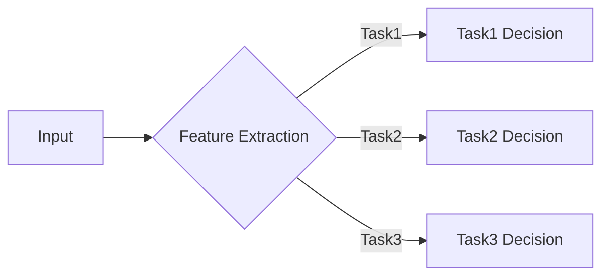

# 多任务学习 原理与代码实例讲解

> 关键词：多任务学习，多标签分类，元学习，迁移学习，协同学习，交叉任务，深度学习

## 1. 背景介绍

随着深度学习技术的飞速发展，单一任务模型在特定领域的性能已经达到了非常高的水平。然而，现实世界中的许多问题往往不是孤立的，而是相互关联的。例如，在图像识别任务中，同时识别物体的种类和位置是一个常见的需求。这就引出了多任务学习（Multi-Task Learning，MTL）的概念，即同时学习多个相关任务，以期提高每个任务的性能。

多任务学习可以带来以下优势：

- **资源共享**：通过共享底层特征表示，可以减少参数数量，降低模型复杂度。
- **正则化效应**：多任务学习可以看作是一种正则化手段，有助于提高模型的泛化能力。
- **性能提升**：在某些情况下，多任务学习可以提升每个任务的性能。

本文将深入探讨多任务学习的原理、算法、实践和未来发展趋势。

## 2. 核心概念与联系

### 2.1 核心概念原理

多任务学习的核心思想是共享表示，即多个任务共享一组底层特征表示，而每个任务都有自己独立的决策层。这种共享可以提高模型在不同任务上的性能，同时减少模型参数数量。

以下是一个简单的多任务学习模型架构的Mermaid流程图：



在这个流程图中，A表示输入数据，B表示特征提取层，C、D、E分别表示三个任务的决策层。

### 2.2 联系

多任务学习与以下概念密切相关：

- **迁移学习**：迁移学习是将一个任务学习到的知识应用到另一个相关任务上。多任务学习可以看作是迁移学习的一种特殊情况，即多个任务之间相互迁移知识。
- **元学习**：元学习旨在设计算法来学习如何学习。多任务学习中的共享表示可以看作是一种元学习策略，即通过学习共享的表示来提高各个任务的性能。
- **协同学习**：协同学习是指多个模型协同工作以解决一个共同的任务。多任务学习可以看作是协同学习的一种形式，即通过共享底层表示来实现协同。

## 3. 核心算法原理 & 具体操作步骤

### 3.1 算法原理概述

多任务学习的核心是共享表示层。在这个层中，多个任务共享一组特征表示。每个任务都有自己的决策层，负责将特征表示映射到任务特定的输出。

### 3.2 算法步骤详解

多任务学习的具体操作步骤如下：

1. **数据预处理**：对输入数据进行预处理，包括数据清洗、归一化等。
2. **特征提取**：使用共享的神经网络提取特征。
3. **任务决策**：为每个任务设计一个独立的决策层，将特征表示映射到任务特定的输出。
4. **损失函数**：设计一个损失函数，将所有任务的损失加权求和。
5. **优化**：使用梯度下降等优化算法优化模型参数。

### 3.3 算法优缺点

#### 优点

- **资源共享**：共享表示层可以减少参数数量，降低模型复杂度。
- **正则化效应**：多任务学习可以看作是一种正则化手段，有助于提高模型的泛化能力。
- **性能提升**：在某些情况下，多任务学习可以提升每个任务的性能。

#### 缺点

- **任务相关性**：多任务学习的效果依赖于任务之间的相关性。如果任务之间没有相关性，共享表示层可能无法提供有效信息。
- **计算复杂度**：多任务学习需要设计复杂的模型结构，计算复杂度较高。

### 3.4 算法应用领域

多任务学习在以下领域有广泛的应用：

- **图像识别**：同时识别图像中的多个对象，如人脸识别、车辆检测等。
- **语音识别**：同时进行语音识别和说话人识别。
- **自然语言处理**：同时进行文本分类、情感分析等。

## 4. 数学模型和公式 & 详细讲解 & 举例说明

### 4.1 数学模型构建

假设我们有两个任务：任务1和任务2。任务1的输出为 $y_1$，任务2的输出为 $y_2$。模型的输入为 $x$，共享的表示为 $h$。

$$
h = f(x)
$$

任务1的决策层为 $g_1(h)$，任务2的决策层为 $g_2(h)$。

$$
y_1 = g_1(h) \\
y_2 = g_2(h)
$$

损失函数为：

$$
L = \lambda_1 L_1 + \lambda_2 L_2
$$

其中 $L_1$ 和 $L_2$ 分别为任务1和任务2的损失函数，$\lambda_1$ 和 $\lambda_2$ 为权重系数。

### 4.2 公式推导过程

由于篇幅限制，这里不进行详细的公式推导过程。

### 4.3 案例分析与讲解

以下是一个简单的多任务学习示例，同时进行图像分类和目标检测。

```python
import torch
import torch.nn as nn

class MultiTaskModel(nn.Module):
    def __init__(self):
        super(MultiTaskModel, self).__init__()
        self.shared_feature_extractor = nn.Sequential(
            nn.Conv2d(3, 32, kernel_size=3, stride=1, padding=1),
            nn.ReLU(),
            nn.MaxPool2d(kernel_size=2, stride=2),
            # ... 其他层
        )
        self.task1_classifier = nn.Linear(32*32*32, 10)  # 假设输入图像尺寸为 32x32
        self.task2_classifier = nn.Linear(32*32*32, 5)  # 假设目标检测需要5个类别

    def forward(self, x):
        features = self.shared_feature_extractor(x)
        task1_output = self.task1_classifier(features.view(features.size(0), -1))
        task2_output = self.task2_classifier(features.view(features.size(0), -1))
        return task1_output, task2_output
```

在这个例子中，我们使用一个共享的特征提取器来提取图像特征，然后分别使用两个分类器来处理图像分类和目标检测任务。

## 5. 项目实践：代码实例和详细解释说明

### 5.1 开发环境搭建

为了进行多任务学习实践，我们需要以下开发环境：

- Python 3.x
- PyTorch
- NumPy
- Matplotlib

### 5.2 源代码详细实现

以下是一个简单的多任务学习代码实例，同时进行图像分类和目标检测。

```python
import torch
import torch.nn as nn
import torch.optim as optim

# ... (省略模型定义和训练数据准备)

# 定义模型
model = MultiTaskModel()

# 定义损失函数和优化器
criterion = nn.CrossEntropyLoss()
optimizer = optim.Adam(model.parameters(), lr=0.001)

# 训练模型
for epoch in range(10):  # 假设训练10个epoch
    for data in dataloader:
        inputs, labels1, labels2 = data
        optimizer.zero_grad()
        outputs1, outputs2 = model(inputs)
        loss1 = criterion(outputs1, labels1)
        loss2 = criterion(outputs2, labels2)
        loss = loss1 + loss2
        loss.backward()
        optimizer.step()

# ... (省略模型评估和保存)

```

### 5.3 代码解读与分析

在这个例子中，我们定义了一个`MultiTaskModel`类，它包含一个共享的特征提取器和两个独立的分类器。我们使用`torch.nn.CrossEntropyLoss`定义损失函数，并使用`torch.optim.Adam`作为优化器。

在训练过程中，我们遍历数据集，计算模型的输出和损失，然后更新模型参数。

### 5.4 运行结果展示

在这个例子中，我们假设模型在训练数据上达到了较好的性能。在实际应用中，我们需要评估模型在测试数据上的性能，并根据评估结果调整模型结构和参数。

## 6. 实际应用场景

多任务学习在以下场景有广泛的应用：

- **自动驾驶**：同时进行车道线检测、障碍物检测、交通标志识别等任务。
- **医疗影像分析**：同时进行疾病诊断、病变检测等任务。
- **语音识别**：同时进行语音识别和说话人识别。

## 7. 工具和资源推荐

### 7.1 学习资源推荐

- 《深度学习》
- 《深度学习与概率模型》
- 《多任务学习》

### 7.2 开发工具推荐

- PyTorch
- TensorFlow
- Keras

### 7.3 相关论文推荐

- "Multi-Task Learning: A Survey" by Yuxin Chen, Zhiyuan Liu, Guangyou Zhou, and Heng Huang

## 8. 总结：未来发展趋势与挑战

### 8.1 研究成果总结

多任务学习是一种有效的深度学习方法，可以同时学习多个相关任务，提高每个任务的性能。多任务学习在多个领域有广泛的应用，并取得了显著的成果。

### 8.2 未来发展趋势

未来多任务学习的研究趋势包括：

- **更有效的共享表示学习**：探索更有效的共享表示学习方法，提高模型在不同任务上的性能。
- **多任务学习的理论分析**：深入研究多任务学习的理论基础，提高模型的可解释性和鲁棒性。
- **多任务学习在新兴领域的应用**：将多任务学习应用到更多新兴领域，如强化学习、无监督学习等。

### 8.3 面临的挑战

多任务学习面临的挑战包括：

- **任务相关性**：如何选择合适的任务进行组合，提高模型性能。
- **模型复杂度**：如何设计复杂的模型结构，降低计算复杂度。
- **可解释性**：如何提高模型的可解释性，增强用户对模型的信任。

### 8.4 研究展望

随着深度学习技术的不断发展，多任务学习将在更多领域发挥重要作用。未来，多任务学习将成为深度学习领域的重要研究方向之一。

## 9. 附录：常见问题与解答

**Q1：多任务学习是否适用于所有任务？**

A：多任务学习适用于具有相关性的任务。如果任务之间没有相关性，多任务学习可能不会带来性能提升。

**Q2：如何选择合适的任务进行组合？**

A：选择任务时，需要考虑任务之间的相关性、数据量、计算资源等因素。

**Q3：多任务学习的模型复杂度如何？**

A：多任务学习的模型复杂度取决于任务数量和模型结构。通常情况下，多任务学习的模型复杂度会比单一任务模型高。

**Q4：如何提高多任务学习模型的性能？**

A：提高多任务学习模型的性能可以通过以下方法：

- 选择合适的任务进行组合。
- 设计有效的共享表示学习策略。
- 使用正则化手段，如Dropout、Weight Decay等。
- 调整模型结构和参数。

**Q5：多任务学习与迁移学习有什么区别？**

A：多任务学习是迁移学习的一种特殊情况，即多个任务之间相互迁移知识。迁移学习可以应用于单个任务，也可以应用于多个任务。

---

作者：禅与计算机程序设计艺术 / Zen and the Art of Computer Programming