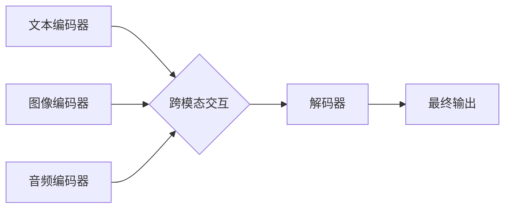

## 多模态大模型：技术原理与实战 多模态大模型的性能评估

> 关键词：多模态大模型、Transformer、多模态学习、性能评估、文本、图像、音频

## 1. 背景介绍

近年来，人工智能领域取得了令人瞩目的进展，其中大模型在自然语言处理、计算机视觉等领域展现出强大的能力。然而，传统的单模态大模型仅处理单一类型数据（如文本或图像），难以捕捉现实世界中多模态信息的复杂关系。

多模态大模型 (Multimodal Large Models, MMLMs) 应运而生，旨在融合不同模态数据（如文本、图像、音频、视频等）进行学习和推理。MMLMs 能够更好地理解和生成人类语言、图像、音频等多模态信息，从而在更广泛的应用场景中发挥作用。

## 2. 核心概念与联系

多模态大模型的核心概念是将不同模态数据融合在一起，学习它们的联合表示。

**2.1 多模态学习 (Multimodal Learning)**

多模态学习旨在从多个模态数据中学习共享的表示，从而更好地理解和建模复杂场景。

**2.2 Transformer 架构**

Transformer 架构是一种强大的深度学习模型，在自然语言处理领域取得了突破性进展。其自注意力机制能够捕捉文本序列中的长距离依赖关系，并可扩展到处理多模态数据。

**2.3 多模态融合策略**

多模态融合策略是指将不同模态数据融合在一起的方法。常见的策略包括：

* **早期融合:** 在模型输入层将不同模态数据直接拼接或连接。
* **晚期融合:** 在模型输出层将不同模态数据的结果进行融合。
* **跨模态注意力:** 使用注意力机制学习不同模态数据之间的关系。

**2.4 多模态大模型架构**

多模态大模型通常由以下几个部分组成：

* **模态编码器:** 负责将每个模态数据编码成相应的向量表示。
* **跨模态交互模块:** 负责学习不同模态数据之间的关系。
* **解码器:** 负责根据融合后的多模态表示生成最终输出。

**Mermaid 流程图**



## 3. 核心算法原理 & 具体操作步骤

### 3.1 算法原理概述

多模态大模型的核心算法是基于 Transformer 架构的多模态融合模型。该模型利用自注意力机制学习不同模态数据之间的关系，并通过跨模态交互模块融合多模态信息，最终生成多模态输出。

### 3.2 算法步骤详解

1. **数据预处理:** 将文本、图像、音频等多模态数据进行预处理，例如文本分词、图像裁剪、音频降噪等。
2. **模态编码:** 使用不同的编码器将每个模态数据编码成相应的向量表示。例如，可以使用 BERT 模型对文本进行编码，使用 ResNet 模型对图像进行编码。
3. **跨模态交互:** 使用跨模态注意力机制学习不同模态数据之间的关系，将不同模态的向量表示融合在一起。
4. **解码:** 使用解码器根据融合后的多模态表示生成最终输出。例如，可以生成文本描述、图像分类结果、音频识别结果等。

### 3.3 算法优缺点

**优点:**

* 能够更好地理解和建模复杂场景，因为能够融合不同模态数据的信息。
* 在多模态任务中表现优异，例如图像字幕生成、视频问答、多模态检索等。

**缺点:**

* 训练成本高，因为需要处理大量多模态数据。
* 模型复杂度高，需要强大的计算资源。

### 3.4 算法应用领域

* **计算机视觉:** 图像字幕生成、图像分类、目标检测、视频理解等。
* **自然语言处理:** 文本摘要、机器翻译、问答系统、对话系统等。
* **语音识别:** 语音转文本、语音情感分析等。
* **人机交互:** 多模态对话系统、虚拟助手等。

## 4. 数学模型和公式 & 详细讲解 & 举例说明

### 4.1 数学模型构建

多模态大模型的数学模型通常基于 Transformer 架构，并引入跨模态注意力机制。

**4.1.1 Transformer 模型**

Transformer 模型的核心是自注意力机制，其计算公式如下：

$$
Attention(Q, K, V) = \frac{exp(Q \cdot K^T / \sqrt{d_k})}{exp(Q \cdot K^T / \sqrt{d_k})} \cdot V
$$

其中：

* $Q$：查询矩阵
* $K$：键矩阵
* $V$：值矩阵
* $d_k$：键向量的维度

**4.1.2 跨模态注意力机制**

跨模态注意力机制学习不同模态数据之间的关系，其计算公式如下：

$$
Attention_{cross}(Q_t, K_s, V_s) = \frac{exp(Q_t \cdot K_s^T / \sqrt{d_k})}{exp(Q_t \cdot K_s^T / \sqrt{d_k})} \cdot V_s
$$

其中：

* $Q_t$：文本模态的查询矩阵
* $K_s$：图像模态的键矩阵
* $V_s$：图像模态的值矩阵

### 4.2 公式推导过程

跨模态注意力机制的推导过程与文本注意力机制类似，只是将查询矩阵和键矩阵分别来自不同的模态数据。

### 4.3 案例分析与讲解

例如，在图像字幕生成任务中，可以使用跨模态注意力机制学习图像和文本之间的关系。

* 图像编码器将图像编码成图像特征向量。
* 文本编码器将文本编码成文本特征向量。
* 跨模态注意力机制学习图像特征向量和文本特征向量之间的关系，生成融合后的多模态表示。
* 解码器根据融合后的多模态表示生成字幕。

## 5. 项目实践：代码实例和详细解释说明

### 5.1 开发环境搭建

* Python 3.7+
* PyTorch 1.7+
* CUDA 10.2+

### 5.2 源代码详细实现

```python
import torch
import torch.nn as nn

class CrossModalAttention(nn.Module):
    def __init__(self, d_model, num_heads):
        super(CrossModalAttention, self).__init__()
        self.num_heads = num_heads
        self.d_model = d_model
        self.query = nn.Linear(d_model, d_model)
        self.key = nn.Linear(d_model, d_model)
        self.value = nn.Linear(d_model, d_model)
        self.fc_out = nn.Linear(d_model, d_model)

    def forward(self, query, key, value):
        batch_size = query.size(0)
        q = self.query(query).view(batch_size, -1, self.num_heads, self.d_model // self.num_heads).transpose(1, 2)
        k = self.key(key).view(batch_size, -1, self.num_heads, self.d_model // self.num_heads).transpose(1, 2)
        v = self.value(value).view(batch_size, -1, self.num_heads, self.d_model // self.num_heads).transpose(1, 2)

        scores = torch.matmul(q, k.transpose(-2, -1)) / torch.sqrt(torch.tensor(self.d_model // self.num_heads))
        attention = torch.softmax(scores, dim=-1)
        context = torch.matmul(attention, v)

        context = context.transpose(1, 2).contiguous().view(batch_size, -1, self.d_model)
        output = self.fc_out(context)
        return output
```

### 5.3 代码解读与分析

* `CrossModalAttention` 类定义了一个跨模态注意力机制模块。
* `forward` 方法实现跨模态注意力机制的计算过程。
* 该代码使用 PyTorch 库实现跨模态注意力机制，并使用线性层进行参数化。

### 5.4 运行结果展示

运行该代码可以得到跨模态注意力机制的输出结果，例如图像和文本的融合表示。

## 6. 实际应用场景

### 6.1 图像字幕生成

多模态大模型可以学习图像和文本之间的关系，生成图像的描述性文本。

### 6.2 视频问答

多模态大模型可以理解视频内容和问题，并给出准确的答案。

### 6.3 多模态检索

多模态大模型可以根据文本或图像查询，检索出相关的多模态数据。

### 6.4 未来应用展望

* **增强现实 (AR) 和虚拟现实 (VR):** 多模态大模型可以为 AR 和 VR 应用提供更丰富的交互体验。
* **医疗诊断:** 多模态大模型可以辅助医生进行诊断，例如分析医学图像和病历信息。
* **教育:** 多模态大模型可以为学生提供个性化的学习体验，例如生成互动式学习内容。

## 7. 工具和资源推荐

### 7.1 学习资源推荐

* **论文:**
    * "BERT: Pre-training of Deep Bidirectional Transformers for Language Understanding"
    * "Vision Transformer"
    * "DALL-E: Creating Images from Text"
* **博客:**
    * The Illustrated Transformer
    * OpenAI Blog
* **课程:**
    * Stanford CS224N: Natural Language Processing with Deep Learning

### 7.2 开发工具推荐

* **PyTorch:** 深度学习框架
* **TensorFlow:** 深度学习框架
* **Hugging Face Transformers:** 预训练 Transformer 模型库

### 7.3 相关论文推荐

* "Exploring the Limits of Transfer Learning with a Unified Text-to-Image Transformer"
* "CLIP: Connecting Text and Images"
* "MAE: Masked Autoencoders Are Scalable Vision Learners"

## 8. 总结：未来发展趋势与挑战

### 8.1 研究成果总结

多模态大模型在多模态任务中取得了显著进展，例如图像字幕生成、视频问答、多模态检索等。

### 8.2 未来发展趋势

* **模型规模和能力提升:** 未来多模态大模型将继续朝着更大规模和更强大的能力发展。
* **跨模态理解的深化:** 研究将更加注重跨模态理解的深化，例如学习不同模态之间的语义关系和因果关系。
* **应用场景的拓展:** 多模态大模型将应用于更多领域，例如医疗、教育、娱乐等。

### 8.3 面临的挑战

* **数据获取和标注:** 多模态数据的获取和标注成本高昂。
* **模型训练和推理效率:** 多模态大模型的训练和推理效率仍然是一个挑战。
* **伦理和安全问题:** 多模态大模型的应用可能带来伦理和安全问题，例如数据隐私、算法偏见等。

### 8.4 研究展望

未来研究将集中在解决上述挑战，例如开发新的数据标注方法、提高模型训练和推理效率、研究多模态大模型的伦理和安全问题。


## 9. 附录：常见问题与解答

### 9.1 什么是多模态学习？

多模态学习是指从多个模态数据中学习共享的表示，从而更好地理解和建模复杂场景。

### 9.2 多模态大模型有哪些应用场景？

多模