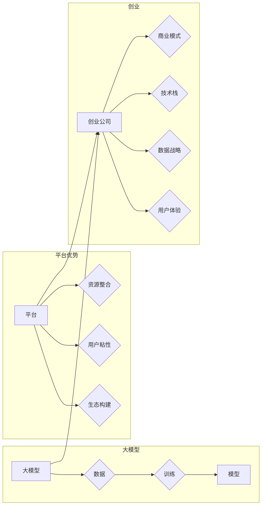

# AI 大模型创业：如何利用平台优势？

> 关键词：AI 大模型，平台优势，创业，商业模式，技术栈，生态构建，数据战略，用户体验

## 1. 背景介绍

随着人工智能技术的飞速发展，大模型（Large Models）逐渐成为人工智能领域的明星技术。大模型通过在海量数据上学习，能够完成复杂的自然语言处理、计算机视觉等任务，展现出惊人的性能。与此同时，越来越多的创业公司开始关注大模型的应用，并希望通过构建平台来发挥大模型的优势，开拓新的商业机会。

然而，大模型创业并非易事，如何有效地利用平台优势，构建可持续发展的商业模式，成为创业公司面临的重要挑战。本文将深入探讨AI大模型创业的路径，分析平台优势的构建方法，并展望未来的发展趋势。

## 2. 核心概念与联系

### 2.1 核心概念

**大模型**：指使用海量数据训练的深度学习模型，具有强大的特征提取和模式识别能力。

**平台优势**：指平台在资源整合、用户粘性、生态构建等方面的优势。

**创业**：指创立新的企业，开展新的商业活动。

**商业模式**：指企业如何创造、传递和捕获价值。

**技术栈**：指企业所使用的一套技术组件和工具。

**生态构建**：指构建一个健康、可持续发展的生态体系。

**数据战略**：指企业如何收集、管理和使用数据。

**用户体验**：指用户在使用产品或服务过程中的感受和体验。

### 2.2 Mermaid 流程图



从流程图中可以看出，大模型是创业公司的基础，平台优势是构建成功的关键，而创业公司则需要通过商业模式、技术栈、数据战略和用户体验来打造可持续发展的业务。

## 3. 核心算法原理 & 具体操作步骤

### 3.1 算法原理概述

大模型的算法原理主要基于深度学习技术，包括以下步骤：

1. 数据收集：从互联网、企业内部等渠道收集海量数据。
2. 数据预处理：对数据进行清洗、去重、标注等处理。
3. 模型训练：使用深度学习框架（如TensorFlow、PyTorch）训练大模型。
4. 模型评估：在测试集上评估模型性能。
5. 模型部署：将模型部署到服务器或云端平台，供用户使用。

### 3.2 算法步骤详解

1. **数据收集**：选择合适的领域和数据来源，如公开数据集、企业内部数据等。
2. **数据预处理**：对数据进行清洗、去重、标注等处理，确保数据质量。
3. **模型训练**：选择合适的模型架构和训练参数，使用GPU或TPU等高性能计算资源进行训练。
4. **模型评估**：在测试集上评估模型性能，包括准确率、召回率、F1值等指标。
5. **模型部署**：将模型部署到服务器或云端平台，使用API接口供用户调用。

### 3.3 算法优缺点

**优点**：

* 强大的特征提取和模式识别能力。
* 能够处理复杂任务，如自然语言处理、计算机视觉等。
* 模型可解释性较好。

**缺点**：

* 训练数据量巨大，需要大量的计算资源。
* 训练过程耗时较长。
* 模型对数据依赖性强。

### 3.4 算法应用领域

大模型在以下领域具有广泛的应用：

* 自然语言处理：机器翻译、情感分析、问答系统等。
* 计算机视觉：图像识别、目标检测、图像生成等。
* 语音识别：语音合成、语音识别、语音翻译等。
* 医疗诊断：疾病诊断、药物研发、健康管理等。

## 4. 数学模型和公式 & 详细讲解 & 举例说明

### 4.1 数学模型构建

大模型的数学模型通常基于深度学习框架，如TensorFlow和PyTorch。以下以一个简单的卷积神经网络（CNN）为例，介绍数学模型的构建。

```latex
f(\mathbf{x}) = \mathbf{W} \cdot \mathbf{x} + b
```

其中，$\mathbf{x}$ 是输入数据，$\mathbf{W}$ 是权重矩阵，$b$ 是偏置项，$f(\mathbf{x})$ 是输出。

### 4.2 公式推导过程

以CNN为例，假设输入数据为 $\mathbf{x} \in \mathbb{R}^{N \times C \times H \times W}$，其中 $N$ 是批次大小，$C$ 是通道数，$H$ 是高度，$W$ 是宽度。输出为 $\mathbf{y} \in \mathbb{R}^{N \times C' \times H' \times W'}$，其中 $C'$ 是输出通道数，$H'$ 是输出高度，$W'$ 是输出宽度。

卷积层计算公式如下：

$$
\mathbf{y}_i = \sum_{k=1}^{C'} \sum_{j=1}^{C'} \sum_{h=1}^{H'} \sum_{w=1}^{W'} \mathbf{W}_{k} \mathbf{x}_{i,h} \mathbf{x}_{j,h} \mathbf{x}_{w} + b_k
$$

### 4.3 案例分析与讲解

以下以BERT模型为例，分析大模型的数学模型和公式。

BERT模型是一种基于Transformer的预训练语言模型，其数学模型主要包括以下部分：

* **Transformer编码器**：使用多头自注意力机制，对输入序列进行编码。
* **Transformer解码器**：使用多头自注意力机制和交叉注意力机制，对编码器的输出进行解码。

**多头自注意力**：

$$
Q = \mathbf{W}_Q \mathbf{X}V = \mathbf{Q} \times \mathbf{K} \times \mathbf{V}
$$

**多头自注意力输出**：

$$
\mathbf{M} = \frac{1}{\sqrt{d_k}} \mathbf{W}_O (\mathbf{S} \mathbf{W}_V \mathbf{V})^T
$$

其中，$\mathbf{Q}$、$\mathbf{K}$、$\mathbf{V}$ 分别表示查询、键和值矩阵，$\mathbf{S}$ 表示注意力权重矩阵，$\mathbf{W}_O$ 表示输出权重矩阵，$\mathbf{W}_V$ 表示值权重矩阵。

## 5. 项目实践：代码实例和详细解释说明

### 5.1 开发环境搭建

以下以Python和PyTorch为例，介绍如何搭建大模型开发环境。

```python
pip install torch torchvision
```

### 5.2 源代码详细实现

以下是一个简单的CNN模型实现：

```python
import torch.nn as nn

class SimpleCNN(nn.Module):
    def __init__(self):
        super(SimpleCNN, self).__init__()
        self.conv1 = nn.Conv2d(1, 16, kernel_size=3, stride=1, padding=1)
        self.relu = nn.ReLU()
        self.pool = nn.MaxPool2d(kernel_size=2, stride=2)
        self.fc = nn.Linear(16 * 7 * 7, 10)

    def forward(self, x):
        x = self.relu(self.conv1(x))
        x = self.pool(x)
        x = x.view(x.size(0), -1)
        x = self.fc(x)
        return x
```

### 5.3 代码解读与分析

以上代码实现了一个简单的CNN模型，包括卷积层、ReLU激活函数、最大池化层和全连接层。

### 5.4 运行结果展示

运行以上代码，可以使用MNIST数据集进行训练和测试。

```python
import torch.optim as optim

def train(model, device, train_loader, optimizer, criterion, epoch):
    model.train()
    for batch_idx, (data, target) in enumerate(train_loader):
        data, target = data.to(device), target.to(device)
        optimizer.zero_grad()
        output = model(data)
        loss = criterion(output, target)
        loss.backward()
        optimizer.step()
        if batch_idx % 100 == 0:
            print('Train Epoch: {} [{}/{} ({:.0f}%)]\tLoss: {:.6f}'.format(
                epoch, batch_idx * len(data), len(train_loader.dataset),
                100. * batch_idx / len(train_loader), loss.item()))

def test(model, device, test_loader, criterion):
    model.eval()
    test_loss = 0
    correct = 0
    with torch.no_grad():
        for data, target in test_loader:
            data, target = data.to(device), target.to(device)
            output = model(data)
            test_loss += criterion(output, target).item()
            pred = output.argmax(dim=1, keepdim=True)
            correct += pred.eq(target.view_as(pred)).sum().item()
    test_loss /= len(test_loader.dataset)
    print('
Test set: Average loss: {:.4f}, Accuracy: {}/{} ({:.0f}%)
'.format(
        test_loss, correct, len(test_loader.dataset),
        100. * correct / len(test_loader.dataset)))

# 加载数据集
train_loader = torch.utils.data.DataLoader(
    datasets.MNIST(root='./data', train=True, transform=transforms.Compose([
        transforms.ToTensor(),
        transforms.Normalize((0.1307,), (0.3081,))
    ])),
    batch_size=64, shuffle=True)

test_loader = torch.utils.data.DataLoader(
    datasets.MNIST(root='./data', train=False, transform=transforms.Compose([
        transforms.ToTensor(),
        transforms.Normalize((0.1307,), (0.3081,))
    ])),
    batch_size=1000, shuffle=True)

device = torch.device("cuda" if torch.cuda.is_available() else "cpu")
model = SimpleCNN().to(device)
optimizer = optim.SGD(model.parameters(), lr=0.01, momentum=0.5)
criterion = nn.CrossEntropyLoss()

for epoch in range(1, 11):
    train(model, device, train_loader, optimizer, criterion, epoch)
    test(model, device, test_loader, criterion)
```

## 6. 实际应用场景

### 6.1 金融风控

在金融领域，大模型可以应用于信贷评估、反欺诈、风险评估等任务。通过分析用户的信用历史、交易记录等数据，大模型可以准确预测用户的信用风险，帮助金融机构进行风险管理。

### 6.2 健康医疗

在健康医疗领域，大模型可以应用于疾病诊断、药物研发、健康管理等领域。通过分析患者的病历、基因数据等，大模型可以辅助医生进行诊断，提高诊断准确率。

### 6.3 智能客服

在智能客服领域，大模型可以应用于智能问答、语义理解、情感分析等任务。通过分析用户的问题和反馈，大模型可以提供个性化的服务，提高客户满意度。

### 6.4 未来应用展望

随着大模型技术的不断发展，其应用领域将更加广泛，以下是一些潜在的应用方向：

* 自动驾驶：通过分析路况、环境等数据，大模型可以辅助自动驾驶系统做出决策，提高行驶安全。
* 教育领域：通过分析学生的学习数据，大模型可以提供个性化的教学方案，提高教学效果。
* 能源领域：通过分析能源消耗、设备运行状态等数据，大模型可以优化能源利用效率，降低能源消耗。

## 7. 工具和资源推荐

### 7.1 学习资源推荐

* 《深度学习》
* 《Python深度学习》
* 《动手学深度学习》
* fast.ai课程

### 7.2 开发工具推荐

* PyTorch
* TensorFlow
* Jupyter Notebook
* Google Colab

### 7.3 相关论文推荐

* "Attention is All You Need"
* "BERT: Pre-training of Deep Bidirectional Transformers for Language Understanding"
* "Generative Adversarial Nets"
* "Reinforcement Learning: An Introduction"

## 8. 总结：未来发展趋势与挑战

### 8.1 研究成果总结

本文从大模型创业的角度，探讨了平台优势的构建方法，分析了大模型在各个领域的应用场景，并展望了未来的发展趋势。通过本文的学习，读者可以了解到大模型创业的核心要素，为创业实践提供参考。

### 8.2 未来发展趋势

* 大模型将向更通用、更智能的方向发展。
* 大模型将与更多领域相结合，解决更复杂的问题。
* 大模型的应用将更加普及，渗透到各个行业。

### 8.3 面临的挑战

* 大模型对计算资源的需求将越来越大。
* 大模型的可解释性有待提高。
* 大模型的安全性和伦理问题需要关注。

### 8.4 研究展望

未来，大模型研究将朝着以下方向发展：

* 提高模型的效率，降低计算资源需求。
* 提高模型的可解释性，增强用户信任。
* 加强模型的安全性和伦理性，避免潜在风险。

## 9. 附录：常见问题与解答

**Q1：大模型创业需要哪些技术栈？**

A：大模型创业需要以下技术栈：

* 深度学习框架：PyTorch、TensorFlow等。
* 数据处理工具：Pandas、NumPy等。
* 机器学习库：Scikit-learn、Scipy等。
* 模型评估工具：TensorBoard、Weights & Biases等。

**Q2：如何获取大模型训练数据？**

A：大模型训练数据可以从以下途径获取：

* 公开数据集：如MNIST、ImageNet、COCO等。
* 企业内部数据：如用户行为数据、交易数据等。
* 网络爬虫：从互联网上抓取相关数据。

**Q3：如何评估大模型的效果？**

A：大模型的效果可以从以下方面进行评估：

* 准确率：模型预测结果与真实标签的一致性。
* 召回率：模型预测结果中正确标签的比例。
* F1值：准确率和召回率的调和平均值。
* 模型鲁棒性：模型在不同数据集、不同环境下的表现。

**Q4：大模型创业需要关注哪些伦理问题？**

A：大模型创业需要关注以下伦理问题：

* 数据隐私：确保用户数据安全。
* 模型歧视：避免模型对特定人群产生歧视。
* 模型偏见：避免模型学习到潜在的偏见。
* 模型可解释性：提高模型的可解释性，增强用户信任。

作者：禅与计算机程序设计艺术 / Zen and the Art of Computer Programming