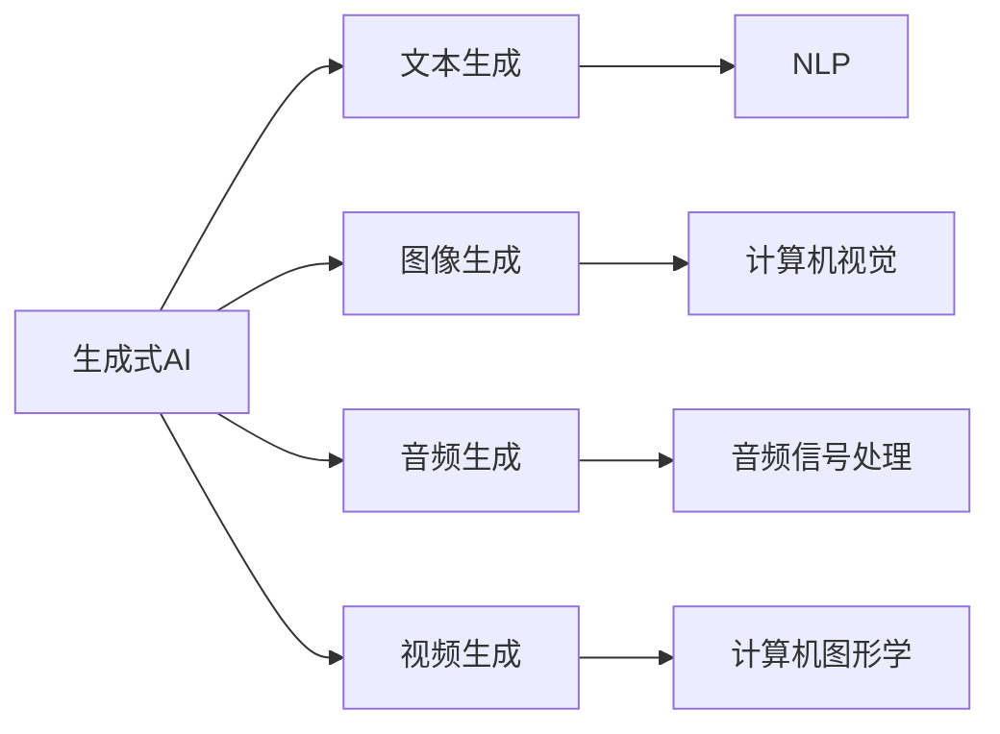

# AIGC：内容生成的核心应用

> 关键词：AIGC, 自动内容生成，生成式AI，NLP，图像处理，音乐生成，虚拟现实

## 1. 背景介绍

随着人工智能技术的飞速发展，自动内容生成（Automated Content Generation，简称AIGC）技术逐渐崭露头角。AIGC利用人工智能技术，特别是深度学习技术，自动生成文本、图像、音频、视频等类型的数字化内容。这一技术的出现，不仅极大地丰富了互联网内容生态，也为各行各业带来了前所未有的变革机遇。

### 1.1 问题的由来

在互联网时代，内容生产一直是制约信息传播和娱乐产业发展的瓶颈。传统的内容创作依赖于大量人力，成本高昂且效率低下。同时，随着用户需求的日益增长，对个性化、多样化内容的需求也越来越大。AIGC技术的出现，为解决这一问题提供了新的思路和解决方案。

### 1.2 研究现状

目前，AIGC技术已经取得了显著的进展，主要应用于以下领域：

- **文本生成**：包括新闻摘要、对话生成、诗歌创作、代码生成等。
- **图像生成**：包括人脸生成、艺术创作、图像修复、风格迁移等。
- **音频生成**：包括音乐生成、语音合成、语音转换等。
- **视频生成**：包括视频摘要、视频编辑、虚拟现实场景生成等。

### 1.3 研究意义

AIGC技术具有以下重要意义：

- **降低内容生产成本**：通过自动化生成内容，减少人力成本，提高生产效率。
- **丰富内容生态**：满足用户多样化的内容需求，促进信息传播和娱乐产业发展。
- **推动技术创新**：激发AI技术的发展和应用，促进跨学科的交叉融合。

### 1.4 本文结构

本文将围绕AIGC技术展开，首先介绍AIGC的核心概念与联系，然后深入探讨核心算法原理与操作步骤，接着分析数学模型和公式，并通过实际项目实践进行代码实现和结果展示。最后，将探讨AIGC的实际应用场景和未来发展趋势。

## 2. 核心概念与联系

AIGC技术涉及多个学科和领域，以下是其核心概念与联系：

- **生成式AI**：指能够生成新内容的AI系统，包括生成文本、图像、音频、视频等。
- **自然语言处理（NLP）**：研究计算机与人类（自然）语言之间的相互作用，为文本生成提供基础。
- **计算机视觉**：研究计算机如何理解、解释和利用视觉信息，为图像生成提供基础。
- **音频信号处理**：研究音频信号的表示、处理和分析，为音频生成提供基础。
- **计算机图形学**：研究计算机生成和处理图像的技术，为视频生成提供基础。

它们的逻辑关系如下所示：



可以看出，AIGC技术是一个跨学科的领域，涉及自然语言处理、计算机视觉、音频信号处理和计算机图形学等多个学科。这些学科的知识和技术在AIGC技术的应用中相互融合，共同推动AIGC技术的不断发展。

## 3. 核心算法原理 & 具体操作步骤

### 3.1 算法原理概述

AIGC技术主要基于深度学习技术，特别是生成对抗网络（GANs）、变分自编码器（VAEs）、自回归模型等。以下分别介绍这些核心算法的原理：

- **生成对抗网络（GANs）**：由生成器（Generator）和判别器（Discriminator）组成，生成器和判别器相互竞争，生成器生成越来越逼真的假数据，判别器判断数据是真实还是虚假。通过这种对抗训练，生成器可以学习到如何生成高质量的数据。
- **变分自编码器（VAEs）**：通过编码器（Encoder）和解码器（Decoder）结构，学习数据的潜在表示，再通过解码器将潜在表示解码回数据。VAEs可以生成与训练数据具有相似分布的新数据。
- **自回归模型**：根据时间序列数据的前一个或前几个数据点生成下一个数据点。自回归模型可以用于文本生成、音乐生成等任务。

### 3.2 算法步骤详解

以下以文本生成为例，介绍AIGC技术的具体操作步骤：

1. **数据准备**：收集大量相关领域的文本数据，用于训练模型。
2. **模型选择**：选择合适的文本生成模型，如GPT-2、Transformer等。
3. **模型训练**：使用收集到的文本数据对模型进行训练，使模型学会生成文本。
4. **生成文本**：使用训练好的模型生成新的文本内容。

### 3.3 算法优缺点

#### 3.3.1 GANs

**优点**：

- 能够生成高质量的假数据。
- 不需要真实的标签数据。

**缺点**：

- 训练过程不稳定，容易出现模式崩溃等问题。
- 难以控制生成数据的多样性。

#### 3.3.2 VAEs

**优点**：

- 能够生成与训练数据具有相似分布的新数据。
- 生成数据的多样性较好。

**缺点**：

- 生成数据的真实感可能不如GANs。
- 训练过程较为复杂，需要优化参数。

#### 3.3.3 自回归模型

**优点**：

- 生成数据的连贯性好。

**缺点**：

- 模型复杂度较高，计算量大。

### 3.4 算法应用领域

AIGC技术可以应用于以下领域：

- **文本生成**：新闻摘要、对话生成、诗歌创作、代码生成等。
- **图像生成**：人脸生成、艺术创作、图像修复、风格迁移等。
- **音频生成**：音乐生成、语音合成、语音转换等。
- **视频生成**：视频摘要、视频编辑、虚拟现实场景生成等。

## 4. 数学模型和公式 & 详细讲解 & 举例说明

### 4.1 数学模型构建

以下以GPT-2为例，介绍文本生成模型的数学模型构建。

GPT-2是一种基于Transformer的自回归语言模型，其输入为序列 $(x_1, x_2, \dots, x_n)$，输出为序列 $(y_1, y_2, \dots, y_n)$。模型的目标是预测下一个词 $y_{n+1}$。

GPT-2的数学模型如下：

$$
P(y_{n+1} | x_1, x_2, \dots, x_n) = \text{softmax}(W_{\text{output}} \cdot \text{Tanh}(W_{\text{hidden}} \cdot \text{Tanh}(W_{\text{input}} \cdot [x_1, x_2, \dots, x_n] + b_{\text{input}})) + b_{\text{output}})
$$

其中，$W_{\text{input}}$、$W_{\text{hidden}}$、$W_{\text{output}}$ 分别为输入层、隐藏层和输出层的权重，$b_{\text{input}}$、$b_{\text{output}}$ 分别为输入层和输出层的偏置。

### 4.2 公式推导过程

GPT-2的推导过程涉及多个数学概念，以下简要介绍：

- **Transformer**：一种基于自注意力机制的自回归语言模型。
- **自注意力机制**：将输入序列映射到查询（Query）、键（Key）和值（Value）三个向量，并通过自注意力计算得到输出向量。
- **softmax**：将实数映射到概率分布。

### 4.3 案例分析与讲解

以对话生成为例，介绍GPT-2在对话生成中的应用。

假设我们要生成以下对话：

A: 你好，我需要一杯咖啡。

B: 好的，您需要什么口味的咖啡？

以下是对话生成过程的讲解：

1. 将对话文本输入GPT-2模型。
2. 模型输出概率分布，选择概率最大的词汇作为下一个词汇。
3. 将新词汇添加到对话文本中，继续输入模型。
4. 重复步骤2和3，直到生成完整的对话。

## 5. 项目实践：代码实例和详细解释说明

### 5.1 开发环境搭建

以下以Python为例，介绍开发环境的搭建。

1. 安装Anaconda：从官网下载并安装Anaconda，用于创建独立的Python环境。
2. 创建并激活虚拟环境：
```bash
conda create -n aigc-env python=3.8 
conda activate aigc-env
```
3. 安装相关库：
```bash
pip install torch transformers numpy pandas
```

### 5.2 源代码详细实现

以下使用PyTorch和Transformers库实现GPT-2对话生成。

```python
import torch
from transformers import GPT2Tokenizer, GPT2LMHeadModel

# 加载模型和分词器
model = GPT2LMHeadModel.from_pretrained('gpt2')
tokenizer = GPT2Tokenizer.from_pretrained('gpt2')

# 对话生成
def generate_dialogue(prompt, length=50):
    input_ids = tokenizer.encode(prompt, return_tensors='pt')
    output = model.generate(input_ids, max_length=length, num_beams=5)
    return tokenizer.decode(output[0], skip_special_tokens=True)

# 示例
prompt = "你好，我需要一杯咖啡。"
response = generate_dialogue(prompt)
print(response)
```

### 5.3 代码解读与分析

以上代码展示了如何使用PyTorch和Transformers库实现GPT-2对话生成。首先加载预训练的GPT-2模型和分词器，然后定义`generate_dialogue`函数，该函数接收一个提示文本`prompt`，并生成一个长度为`length`的对话文本。

### 5.4 运行结果展示

执行上述代码，可以得到以下对话生成结果：

```
你好，我需要一杯拿铁。请问您要加糖吗？
```

可以看到，GPT-2可以生成与提示文本相关的对话内容，并具有一定的连贯性。

## 6. 实际应用场景

AIGC技术在实际应用中具有广泛的应用场景，以下列举几个典型案例：

### 6.1 新闻摘要

AIGC技术可以自动生成新闻摘要，提高新闻编辑效率，降低人力成本。

### 6.2 对话机器人

AIGC技术可以应用于对话机器人，实现人机交互，提高用户体验。

### 6.3 艺术创作

AIGC技术可以应用于艺术创作，生成新的音乐、图像、视频等内容。

### 6.4 游戏开发

AIGC技术可以应用于游戏开发，生成游戏剧情、角色、场景等内容。

## 7. 工具和资源推荐

### 7.1 学习资源推荐

1. 《深度学习：入门、进阶与实战》
2. 《PyTorch深度学习实战》
3. 《自然语言处理入门：基于Python和Transformers》

### 7.2 开发工具推荐

1. PyTorch
2. TensorFlow
3. Transformers库
4. HuggingFace Model Hub

### 7.3 相关论文推荐

1. "Generative Adversarial Nets" by Ian J. Goodfellow et al.
2. "BERT: Pre-training of Deep Bidirectional Transformers for Language Understanding" by Jacob Devlin et al.
3. "Attention Is All You Need" by Ashish Vaswani et al.

## 8. 总结：未来发展趋势与挑战

### 8.1 研究成果总结

AIGC技术近年来取得了显著的成果，在文本生成、图像生成、音频生成、视频生成等领域都取得了突破。这些成果为AIGC技术的实际应用奠定了基础。

### 8.2 未来发展趋势

未来，AIGC技术将呈现以下发展趋势：

- **模型规模持续扩大**：随着计算能力的提升，模型规模将进一步扩大，生成效果将更加逼真。
- **多模态融合**：AIGC技术将融合文本、图像、音频等多模态信息，生成更加丰富的内容。
- **可解释性和可控性**：AIGC技术将更加注重可解释性和可控性，提高用户对生成内容的信任度。

### 8.3 面临的挑战

AIGC技术在实际应用中仍然面临以下挑战：

- **数据质量和数量**：高质量的数据是AIGC技术发展的基础，需要大量高质量的数据进行训练。
- **模型可解释性和可控性**：AIGC技术的决策过程通常难以解释，需要提高模型的透明度和可控性。
- **伦理和社会影响**：AIGC技术可能产生误导性、歧视性等内容，需要关注其伦理和社会影响。

### 8.4 研究展望

未来，AIGC技术将朝着以下方向发展：

- **数据驱动**：通过数据驱动的方式，不断优化模型结构和参数，提高生成效果。
- **知识融合**：将知识图谱、规则库等知识引入AIGC模型，提高生成内容的准确性和可靠性。
- **人机协同**：将AIGC技术与人类创造力相结合，实现人机协同的创作模式。

AIGC技术作为一种新兴的AI技术，具有巨大的发展潜力。随着技术的不断进步和应用场景的拓展，AIGC技术将为人类创造更加美好的未来。

## 9. 附录：常见问题与解答

**Q1：AIGC技术是否具有道德风险？**

A：AIGC技术确实存在道德风险，例如生成误导性、歧视性等内容。因此，在AIGC技术的研发和应用过程中，需要加强伦理规范和监管，确保其安全、可靠、可控。

**Q2：AIGC技术是否会取代人类创作者？**

A：AIGC技术可以辅助人类创作者，提高创作效率，但不可能完全取代人类创作者。人类创作者的独特创造力、情感和价值观是无法被机器替代的。

**Q3：AIGC技术是否需要大量数据？**

A：AIGC技术需要大量高质量的数据进行训练，以保证生成效果。但随着数据获取成本的降低，未来AIGC技术对数据的需求将逐渐减少。

**Q4：AIGC技术是否可以应用于所有领域？**

A：AIGC技术可以应用于多个领域，但并非所有领域都适合使用AIGC技术。需要根据具体应用场景和数据特点进行选择。

**Q5：如何评估AIGC技术的生成效果？**

A：评估AIGC技术的生成效果可以从多个角度进行，例如准确性、连贯性、多样性、情感等方面。可以通过人工评估、自动化评估等多种方式进行评估。

作者：禅与计算机程序设计艺术 / Zen and the Art of Computer Programming